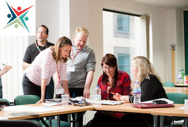
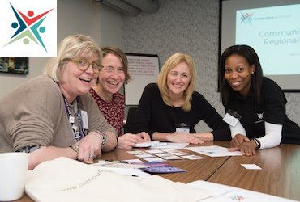
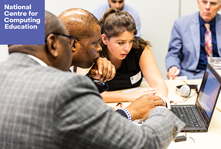
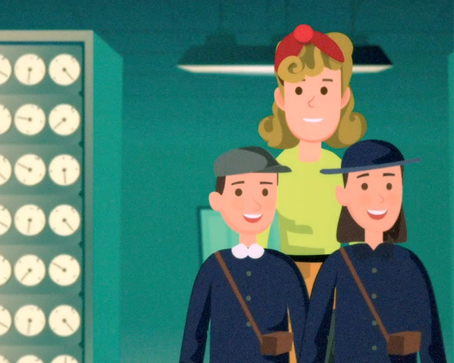
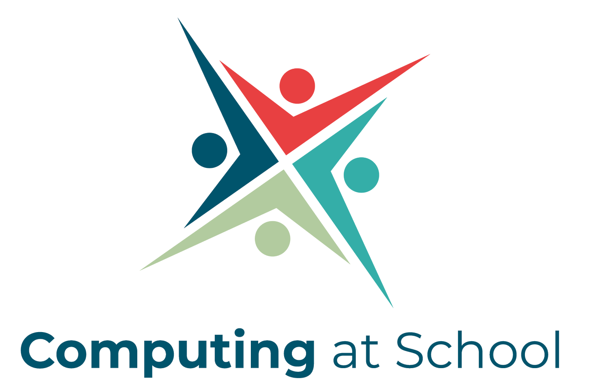
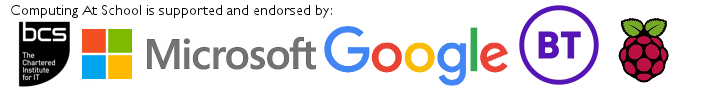

Computing At School

- [Who we are](https://www.computingatschool.org.uk/about)

- [Community Site**](https://community.computingatschool.org.uk/)

- [Classroom Resources **](https://www.computingatschool.org.uk/#)

- [Projects **](https://www.computingatschool.org.uk/#)

- [Login](https://www.computingatschool.org.uk/#)

 [Forgotten password?](https://www.computingatschool.org.uk/forgot_password)

 

### Welcome to Computing at School

We are passionate about ensuring that every child has a world-class computing education. We encourage, support and equip teachers of computing through our Community of Professional Practice.

The CAS community is open to everyone who cares about computing education, including teachers, academics, developers, IT professionals, members of professional societies, school leaders, and parents.

[Read more...](https://www.computingatschool.org.uk/about)

 

#### Join your local CAS Community

Local CAS Community Meetings are a great way to build relationships with other computing teachers, find new teaching resources, explore ideas and develop your practice. Find out what’s going on near you.

 

#### Apply to become a CAS Community

CAS Community Leaders are essential to the success of CAS, hosting face to face meetings in the local area, supporting local teachers to share good practice, network and gather ideas to take back to the classroom. Find out how you can become a community leader.

 

#### Computer Science Accelerator Programme

Become a certified teacher of GCSE Computer Science with the National Centre for Computing Education’s Computer Science Accelerator Programme.

Local CAS Communities offer a supportive environment for teachers to share resources and ideas, reflect on professional development, explore good practice and encourage one another, find out what’s happening near you

 [Join CAS](https://community.computingatschool.org.uk/door)

#### Here is selection of the events, resources, and discussions that you’ll gain access to if you [join the online CAS community](https://community.computingatschool.org.uk/door)

* * *

#### ** Upcoming events

- [CAS Port of Blyth Primary Community Meeti...](https://community.computingatschool.org.uk/events/7229)
- [CAS Trafford - Cancelled](https://community.computingatschool.org.uk/events/7348)
- [Barefoot Programming Workshop](https://community.computingatschool.org.uk/events/7292)
- [Barefoot Programming Workshop](https://community.computingatschool.org.uk/events/7351)
- [CAS Cambridge Secondary Community Meeting...](https://community.computingatschool.org.uk/events/7131)
- [CAS Chorley & South Ribble Secondary Comm...](https://community.computingatschool.org.uk/events/7383)
- [QUB EEECS - Women Creating Our Tech Futur...](https://community.computingatschool.org.uk/events/7461)
- [Beginner Raspberry Pi Training](https://community.computingatschool.org.uk/events/7364)
- [CAS Wirral Secondary Community Meeting](https://community.computingatschool.org.uk/events/7455)
- [OCR GCSE Computer Science update at CAS N...](https://community.computingatschool.org.uk/events/7465)

#### ** Teaching resources

- [CAS London 2020 Conference Information](https://community.computingatschool.org.uk/resources/5985)
- [FREE UNLIMITED POLLS](https://community.computingatschool.org.uk/resources/5984)
- [Mildenhall Community Meeting October 2019...](https://community.computingatschool.org.uk/resources/5983)
- [FREE WEB PAGES / WEBSITES](https://community.computingatschool.org.uk/resources/5980)
- [QUOZR BADGE PROJECTS](https://community.computingatschool.org.uk/resources/5973)
- [Qualifications Framework (April 2019)](https://community.computingatschool.org.uk/resources/5972)
- [Hashing Algorithm Python Brute Force Atta...](https://community.computingatschool.org.uk/resources/5969)
- [Using micro:bits for tinkering projects w...](https://community.computingatschool.org.uk/resources/5962)
- [Operating Systems Scheduling Simulation](https://community.computingatschool.org.uk/resources/5960)
- [11 study tips and techniques to help you ...](https://community.computingatschool.org.uk/resources/5959)

#### ** Discussions

- [Protected Properties in AQA 2020 pre-rele...](https://community.computingatschool.org.uk/forums/23/topics/9970)
- [AQA A level coursework: User requirements...](https://community.computingatschool.org.uk/forums/23/topics/9969)
- [Class set of robots (10?) for £300 - any ...](https://community.computingatschool.org.uk/forums/23/topics/9968)
- [To what extent is a good foundation in Ma...](https://community.computingatschool.org.uk/forums/23/topics/9967)
- [The best strategies for assessment of Com...](https://community.computingatschool.org.uk/forums/23/topics/9966)
- [Compulsory Key stage 4 'Computing'](https://community.computingatschool.org.uk/forums/23/topics/9963)
- [How to thrive in an Ofsted Deep Dive](https://community.computingatschool.org.uk/forums/3/topics/9962)
- [A Level coursework](https://community.computingatschool.org.uk/forums/23/topics/9959)
- [There will be a CS1 Game Engine and IDE W...](https://community.computingatschool.org.uk/forums/23/topics/9958)
- [The halting problem](https://community.computingatschool.org.uk/forums/23/topics/9954)

## CAS News

* * *

 

#### [The Code Cracking Resources and the Code Cracking Cup](https://www.computingatschool.org.uk/news_items/860)

 Published by Barefoot on 2019-09-25

Calling all Code Crackers… Have your primary pupils got the skills for the Code Cracking Cup? They must collaborate to create a movie storyboard to bring their team to victory and be in with a chance t...

 

#### [Say hello to Isaac Computer Science!](https://www.computingatschool.org.uk/news_items/854)

 Published by Computing at School on 2019-09-09

The Raspberry Pi Foundation and the University of Cambridge are delighted to have launched Isaac Computer Science, a new online platform for teachers and students of A level Computer Science.

 

#### [CAS August Newsletter](https://bcshq.org/9U7-6EYX4-18V30SV9BF/cr.aspx)

 Published by Computing at School on 2019-08-30

In this latest edition of the CAS Newsletter, we discover how an Academy in Wolverhampton is increasing the number of girls in its computer science classes. We find out about Robotics in Primary School...

## There is no "them" - only us

*> CAS is a grass roots organisation, whose energy, creativity, and leadership comes from its members.*>   > — > Simon Humphreys, CAS Coordinator>  —>

### Promoting and supporting excellence in computer science education

Redevelopment of this website has been kindly funded by 

[Register Now](https://community.computingatschool.org.uk/door)

#### Computing At School,

#### part of BCS

BCS, The Chartered Institute for IT,
North Star House,
North Star Avenue,
Swindon SN2 1FA
compatsch@bcs.uk

 [](https://twitter.com/CompAtSch)  [](https://www.linkedin.com/company/computing-at-school)  [](https://www.youtube.com/user/computingatschool)  [](https://www.facebook.com/ComputingAtSchool)

#### Recent **News**

- [The Code Cracking Resources and the Code Cracking Cup](https://www.computingatschool.org.uk/news_items/860)

- [Say hello to Isaac Computer Science!](https://www.computingatschool.org.uk/news_items/854)

- [CAS August Newsletter](https://bcshq.org/9U7-6EYX4-18V30SV9BF/cr.aspx)

#### About **Us**

Computing At School (CAS) aims to promote the teaching of computer science at school. Our goal is to put the excitement back into Computing at school.

Stats

Members: **[33408](https://community.computingatschool.org.uk/users/user_graph)**

Resources: **[4865](https://community.computingatschool.org.uk/resources)**

CAS Local Communities: **[352](https://www.computingatschool.org.uk/users/map?events=0&hubs=1&users=0)**

New last 30 days:
Members: **307**
Comments: **494**

Schools: **1794**
Lead Schools: **580**
Master Teachers: **512**
Recent School registrations: **0**

* * *

 

  All Rights Reserved © Computing At School 2019

 [Using the website](https://community.computingatschool.org.uk/terms_of_use#using-the-website) • [Disclaimer of liability](https://community.computingatschool.org.uk/terms_of_use#disclaimer) • [Cookies policy](https://community.computingatschool.org.uk/terms_of_use#cookies) • [Privacy policy](https://community.computingatschool.org.uk/terms_of_use#data-protection)