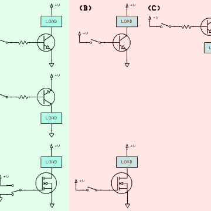

Concise electronics for geeks

Concise electronics for geeks

http://lcamtuf.coredump.cx/electronics/

Concise electronics for geeks Copyright (C) 2010 by Michal Zalewski < lcamtuf@coredump.cx > There are quite a few primers on electronics on the Internet; sadly, almost all of the top hits resort to gross oversimplifications (e.g., hydraulic analogies ), or convenient omission, when covering subtle but incredibly important topics such as the real-world behavior of semiconductors. There are some exceptions - but they often suffer from another malady: regressions into mundane, academic rigor, complete with differential equations and complex number algebra in transient analysis - a trait that is highly unlikely to be accessible, or even useful, to hobbyists.