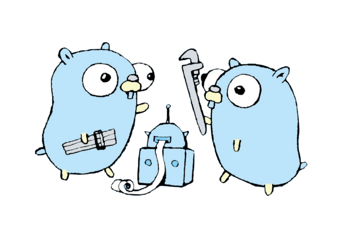

Concurrent Programming in Go - Compass True North - Medium

# Concurrent Programming in Go

[Henry Warren](https://medium.com/@henry.warren?source=post_page---------------------------)

[Jul 8](https://medium.com/compass-true-north/concurrent-programming-in-go-de33441ace1c?source=post_page---------------------------) · 5 min read

A quick case study.

*Special thanks and credit to *[*Dan McClure*](https://medium.com/@danmcclure?source=post_page---------------------------)* for implementation of RunAsync*

First and foremost, I’d like to say that working with Go the past six months at [Compass](https://grnh.se/ae70a06b1?source=post_page---------------------------) has been nothing short of a joy. The language’s uncompromisingly simple feature set and familiar syntax has made it the most legible, learnable, and maintainable language I’ve had the pleasure of working with. From type inference, to first-class functions, to duck-typing, Go picks its design battles wisely. While Go has many compelling features, today I’m going to touch on Go’s concurrency model, and one example of how we’re harnessing its power to build better software at Compass. As a disclaimer, this article does assume an introductory level knowledge of Go.

# **Terminology Review**

Before getting into the how and why, let’s briefly cover the what. There are two primary elements of Go’s concurrency model:

- **Goroutines**
- **Channels**

A [**Goroutine**](https://tour.golang.org/concurrency/1?source=post_page---------------------------) is a concurrent thread of execution. Compared to traditional threads, goroutines are computationally much cheaper to utilize. They have much faster startup times and take up minimal space on the stack. To spawn a new goroutine, you simply precede a function call with the keyword *go*.

|     |     |
| --- | --- |
| 1   | go  func() { |
| 2   | http.Get("http://example.com") |
| 3   | }() |

 [view raw](https://gist.github.com/henrysdev/38444032f97d77c5ba9eb4078c36eeaa/raw/dd78a8f2aac1537da97c8486e0416fe5b82f10be/goroutine.go)  [goroutine.go](https://gist.github.com/henrysdev/38444032f97d77c5ba9eb4078c36eeaa#file-goroutine-go) hosted with ❤ by [GitHub](https://github.com/)

A [**Channel**](https://tour.golang.org/concurrency/2?source=post_page---------------------------)**  **is the conduit through which goroutines communicate with one another via message passing. Channels typically use blocked message passing, although [non-blocking channel operations](https://gobyexample.com/non-blocking-channel-operations?source=post_page---------------------------) are possible as well. Channels are how goroutines share data with one another without the complexity and safety concerns that come with sharing memory. In terms of usage, a channel can essentially be thought of as a typed queue with optional capacity.

|     |     |
| --- | --- |
| 1   | // declare a new channel of type string of size 1 |
| 2   | ch  :=  make(chan  string, 1) |
| 3   |     |
| 4   | // push a new value into the channel |
| 5   | ch <-  "foo" |
| 6   |     |
| 7   | // pop first value from channel and assign it |
| 8   | result  :=  <-ch |

 [view raw](https://gist.github.com/henrysdev/dff2629bdb6fecfbcd9483690ca81cfa/raw/552e56d119e36dd5f525721da48c431b67f9f6f1/concurrency_basics.go)  [concurrency_basics.go](https://gist.github.com/henrysdev/dff2629bdb6fecfbcd9483690ca81cfa#file-concurrency_basics-go) hosted with ❤ by [GitHub](https://github.com/)

# **A Case for Concurrency**

## Background

In a [microservice](https://en.wikipedia.org/wiki/Microservices?source=post_page---------------------------) architecture such as Compass’, each microservice owns its own data exclusively and provides an API for other services to query this data. While defining the scope of a microservice is often a point of contention, for us it boils down to a service that *does one thing, and one thing well*. In practice, this often takes the form of feature-based microservices.

## **Problem**

Our team was recently tasked with building the web API for an analytics application — one that would require data pertaining to customer usage of roughly a dozen different features on a per-customer basis, in real time. In terms of technical implications, this meant that to serve a request, we’d need to **query the APIs of many disparate microservices, process their data into a consistent format, and aggregate all of this data into a single response payload**. With performance at the front of our minds, we knew that the only way for this map-reduce operation to be feasible would be to make the microservice API calls concurrently.

Fanning out API calls over RPC to many feature-based microservices

## **Go Time**

Luckily for our team, our need to execute functions concurrently was hardly a novel one. In fact, the gophers at Compass had already implemented an extremely helpful utility function titled *RunAsync* for this exact purpose (huge shoutout to [Dan McClure](https://medium.com/@danmcclure?source=post_page---------------------------), the author of this very clever utility). *RunAsync* had a simple and elegant objective; to execute any list of functions concurrently, exiting and returning on the first encountered error.

RunAsync alone got us 95% of the way there. However, our use case did not require such a strict approach to error handling. For this reason, we created *RunAsyncAllowErrors*. As opposed to exiting early and returning the first error, *RunAsyncAllowErrors* returns an indexed list of errors encountered, always waiting to return until all functions have finished executing.

Enough talk, let’s look at some code. Note that early exit conditions and other optimizations have been removed for readability sake.

|     |     |
| --- | --- |
| 1   | import ( |
| 2   | "bytes" |
| 3   | "debug" |
| 4   | "fmt" |
| 5   | "sync" |
| 6   | )   |
| 7   |     |
| 8   | // Alias for a function that takes no args and returns an error |
| 9   | type  GenericFunction  func() error |
| 10  |     |
| 11  | func  RunAsyncAllowErrors(functions ...GenericFunction) []error { |
| 12  | // Channel for communicating when execution has finished. |
| 13  | finished  :=  make(chan  struct{}, 1) |
| 14  |     |
| 15  | // Create a wait group for the functions to be executed. |
| 16  | // Note: wg.Add sets the number of goroutines to wait on. |
| 17  | // wg.Done decrements the number of goroutines left to wait on by one. |
| 18  | var  wg sync.WaitGroup |
| 19  | wg.Add(len(functions)) |
| 20  |     |
| 21  | // Wait group in go routine. Will not close until all functions have completed |
| 22  | go  func() { |
| 23  | wg.Wait() |
| 24  | close(finished) |
| 25  | }() |
| 26  |     |
| 27  | // Spawn a goroutine for each function |
| 28  | errors  :=  make([]error, len(functions)) |
| 29  | for  j  :=  range functions { |
| 30  | go  func(j int) { |
| 31  | defer wg.Done() |
| 32  | // Clause for handling panic errors |
| 33  | defer  func() { |
| 34  | if  r  :=  recover(); r != nil { |
| 35  | // Skip 4 stack frames: |
| 36  | // 1) debug.Stack() |
| 37  | // 2) formatStack() |
| 38  | // 3) this anonymous func |
| 39  | // 4) runtime/panic |
| 40  | err  := fmt.Errorf( |
| 41  | "panic in async function: %v\n%s", |
| 42  | r, formatStack(4)) |
| 43  | errors[j] = err |
| 44  | }   |
| 45  | }() |
| 46  | // Execute function and log error at appropriate |
| 47  | // position if applicable. |
| 48  | if  err  := functions[j](); err != nil { |
| 49  | errors[j] = err |
| 50  | return |
| 51  | }   |
| 52  | }(j) |
| 53  | }   |
| 54  |     |
| 55  | // The code below this will not be reached until the wait group has finished |
| 56  | <-finished |
| 57  | return errors |
| 58  | }   |
| 59  |     |
| 60  | // Return formatted stack trace, skipping "skip" leading stack frames |
| 61  | func  formatStack(skip  int) string { |
| 62  | lines  := bytes.Split(bytes.TrimSpace(debug.Stack()), []byte("\n")) |
| 63  | formatted  := bytes.Join(lines[1+2*skip:], []byte("\n")) |
| 64  | return  string(formatted) |
| 65  | }   |

 [view raw](https://gist.github.com/henrysdev/1a178f7c015bbbaeb679435f6b2f8da9/raw/7f4092c5e0d6549bd147aed8ee0bf1f44c588f23/run_async_allow_errors.go)  [run_async_allow_errors.go](https://gist.github.com/henrysdev/1a178f7c015bbbaeb679435f6b2f8da9#file-run_async_allow_errors-go) hosted with ❤ by [GitHub](https://github.com/)

There’s quite a bit to unpack in this code. While the core concurrency logic is fairly straight forward (spawning goroutines in a for loop, capturing their errors, joining them), there are some interesting things that take place in regards to error handling.

This utility is powerful in that it handles both explicitly thrown errors as well as runtime panics. For the latter type of error, the helper function *formatStack* is used to parse the ugly stack trace thrown by the panic error and extract only the line that we care about.

While many gophers would simply write their concurrent logic inline, we’ve found that for safer concurrency, a single generic concurrency utility like *RunAsyncAllowErrors *can be advantageous. Of course, the tradeoff is that this utility becomes a single point of failure, so you better get it right (took us a couple of patches). Now that we’ve walked through the code and discussed its functionality, let’s take a look at a simple usage example.

|     |     |
| --- | --- |
| 1   | import  "net/http" |
| 2   |     |
| 3   | func  makeRequest() error { |
| 4   | if  _, err  := http.Get("http://foo.com"); err != nil { |
| 5   | return err |
| 6   | }   |
| 7   | return  nil |
| 8   | }   |
| 9   |     |
| 10  | func  main() { |
| 11  | funcs  := []GenericFunction{ |
| 12  | makeRequest, |
| 13  | makeRequest, |
| 14  | makeRequest, |
| 15  | }   |
| 16  | RunAsyncAllowErrors(funcs...) |
| 17  | }   |

 [view raw](https://gist.github.com/henrysdev/3b2816b42fe8b4ebe1cca85980a0a538/raw/a3269bba0c8ebd8cbb23410bef6c7e0a6d66044c/basic_usage.go)  [basic_usage.go](https://gist.github.com/henrysdev/3b2816b42fe8b4ebe1cca85980a0a538#file-basic_usage-go) hosted with ❤ by [GitHub](https://github.com/)

That’s pretty cool, but only useful for executing asynchronous tasks with no associated state. If you refer back to the code for *RunAsyncAllowErrors*, you’ll recall that a *GenericFunction* is a function that takes no arguments and returns an error (or nil). But what if we want to concurrently execute functions that don’t conform to the signature of a *GenericFunction*? Let’s start by seeing how we can concurrently execute functions that take different arguments.

|     |     |
| --- | --- |
| 1   | import  "net/http" |
| 2   |     |
| 3   | func  makeRequest(url  string) GenericFunction { |
| 4   | return  func() error { |
| 5   | if  _, err  := http.Get(url); err != nil { |
| 6   | return err |
| 7   | }   |
| 8   | return  nil |
| 9   | }   |
| 10  | }   |
| 11  |     |
| 12  | func  main() { |
| 13  | funcs  := []GenericFunction{ |
| 14  | makeRequest("http://abc.com"), |
| 15  | makeRequest("http://def.com"), |
| 16  | makeRequest("http://ghi.com"), |
| 17  | }   |
| 18  | RunAsyncAllowErrors(funcs...) |
| 19  | }   |

 [view raw](https://gist.github.com/henrysdev/6b9ac3ee064ab306b69ad48bbf2bc1e0/raw/69e9bc8d2df1b96a6cb07840edbfa3bcc5b3aaac/arguments.go)  [arguments.go](https://gist.github.com/henrysdev/6b9ac3ee064ab306b69ad48bbf2bc1e0#file-arguments-go) hosted with ❤ by [GitHub](https://github.com/)

Go’s support for closures allows us to wrap a *GenericFunction* in the context of a scope that has access to values not explicitly passed into the *GenericFunction* as arguments. In this example, we’re getting our *GenericFunction* as the return value of a higher-order function that wraps it, but the same effect can be achieved inline as well. Now that we can pass arguments in, let’s see how we can capture return values.

|     |     |
| --- | --- |
| 1   | import  "net/http" |
| 2   |     |
| 3   | func  makeRequest(url  string, response *http.Response) GenericFunction { |
| 4   | return  func() error { |
| 5   | resp, err  := http.Get(url) |
| 6   | if err != nil { |
| 7   | return err |
| 8   | }   |
| 9   | response = resp |
| 10  | return  nil |
| 11  | }   |
| 12  | }   |
| 13  | func  main() { |
| 14  | var  resp1 http.Response |
| 15  | var  resp2 http.Response |
| 16  | var  resp3 http.Response |
| 17  | funcs  := []GenericFunction{ |
| 18  | makeRequest("http://abc.com", &resp1), |
| 19  | makeRequest("http://def.com", &resp2), |
| 20  | makeRequest("http://ghi.com", &resp3), |
| 21  | }   |
| 22  | RunAsyncAllowErrors(funcs...) |
| 23  | processFurther([]http.Response{resp1, resp2, resp3}) |
| 24  | }   |

 [view raw](https://gist.github.com/henrysdev/1900570c631c4c0c200cbac3092505d0/raw/37f916f501754feacf5e9cdb1a65417ac012f22d/return_values.go)  [return_values.go](https://gist.github.com/henrysdev/1900570c631c4c0c200cbac3092505d0#file-return_values-go) hosted with ❤ by [GitHub](https://github.com/)

Once again, closures save the day. Just like how closures allow us to preserve *values*, they also allow us to preserve *references* to objects outside of the current scope using pointers. To scale our example, we’d probably want to define a structure to hold all of the state we want to pass around to each function. We’d also want to handle and propagate errors of course.

# **Go Forth and Prosper**

In the context of a larger paradigm shift towards concurrent programming, Go’s concurrency features are a great tool for both learning about concurrency and using it to optimize your codebase. If you enjoy Go as much as we do, make sure to keep an eye out for more content from Compass. Oh, and we’re hiring! We hope this article was helpful, thanks for reading.