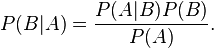

Conditional probability explained visually

[Back](http://setosa.io/ev/)

# Conditional probability

### Explained Visually

[**Tweet](https://twitter.com/intent/tweet?original_referer=http%3A%2F%2Fsetosa.io%2Fev%2Fconditional-probability%2F&ref_src=twsrc%5Etfw&text=Conditional%20probability%20explained%20visually&tw_p=tweetbutton&url=http%3A%2F%2Fsetosa.io%2Fev%2Fconditional-probability%2F&via=setosaio)

|     |     |
| --- | --- |
|     | [(L)](https://www.facebook.com/sharer/sharer.php?u=http%3A%2F%2Fsetosa.io%2Fev%2Fconditional-probability%2F&display=popup&ref=plugin&src=like&kid_directed_site=0) |

By [Victor Powell](http://twitter.com/vicapow)

A conditional probability is the probability of an event, given some other event has already occurred. In the below example, there are two possible events that can occur. A ball falling could either hit the red shelf (we'll call this event A) or hit the blue shelf (we'll call this event B) or both.

If we know the statistics of these events across the entire population and then were to be given a single ball and told "this ball hit the red shelf (event A), what's the probability it also hit the blue shelf (event B)?" we could answer this question by providing the conditional probability of B given that A occurred or P(B|A).

 

 P(A) = 0.356 or 35.6%

 P(B) = 0.285 or 28.5%

 P(A n B) = 0.175 or 17.5%

P(B|A) = 0.492 or 49.2%

  If we have a ball and we know it hit the red shelf, there's a 49.2% chance it also hit the blue shelf.

P(A|B) = 0.614 or 61.4%

  If we have a ball and we know it hit the blue shelf, there's a 61.4% chance it also hit the red shelf.

 AB
 drop frequency

 perspective

actual

expected

count(A n !B): 945 (balls that hit the red shelf but not the blue shelf)

count(B n !A): 548  (balls that hit the blue shelf but not the red shelf)

count(A n B): 876 (balls that hit both the red shelf and the blue shelf)

count(!A n !B): 2602 (balls that did not hit the red nor blue shelf)

For more explanations, visit the Explained Visually [project homepage.](http://setosa.io/ev/)

Or subscribe to our mailing list.

- [13 comments]()
- [**Explained Visually**](https://disqus.com/home/forums/explainedvisually/)
- [Login](https://disqus.com/embed/comments/?base=default&f=explainedvisually&t_u=http%3A%2F%2Fsetosa.io%2Fev%2Fconditional-probability%2F&t_d=Conditional%20probability%20explained%20visually&t_t=Conditional%20probability%20explained%20visually&s_o=default#)
- [1](https://disqus.com/home/inbox/)
- [ Recommend9](https://disqus.com/embed/comments/?base=default&f=explainedvisually&t_u=http%3A%2F%2Fsetosa.io%2Fev%2Fconditional-probability%2F&t_d=Conditional%20probability%20explained%20visually&t_t=Conditional%20probability%20explained%20visually&s_o=default#)
- [⤤Share](https://disqus.com/embed/comments/?base=default&f=explainedvisually&t_u=http%3A%2F%2Fsetosa.io%2Fev%2Fconditional-probability%2F&t_d=Conditional%20probability%20explained%20visually&t_t=Conditional%20probability%20explained%20visually&s_o=default#)
- [Sort by Best](https://disqus.com/embed/comments/?base=default&f=explainedvisually&t_u=http%3A%2F%2Fsetosa.io%2Fev%2Fconditional-probability%2F&t_d=Conditional%20probability%20explained%20visually&t_t=Conditional%20probability%20explained%20visually&s_o=default#)

Join the discussion…

- [Attach](https://disqus.com/embed/comments/?base=default&f=explainedvisually&t_u=http%3A%2F%2Fsetosa.io%2Fev%2Fconditional-probability%2F&t_d=Conditional%20probability%20explained%20visually&t_t=Conditional%20probability%20explained%20visually&s_o=default#)

-

    - [−](https://disqus.com/embed/comments/?base=default&f=explainedvisually&t_u=http%3A%2F%2Fsetosa.io%2Fev%2Fconditional-probability%2F&t_d=Conditional%20probability%20explained%20visually&t_t=Conditional%20probability%20explained%20visually&s_o=default#)
    - [*⚑*](https://disqus.com/embed/comments/?base=default&f=explainedvisually&t_u=http%3A%2F%2Fsetosa.io%2Fev%2Fconditional-probability%2F&t_d=Conditional%20probability%20explained%20visually&t_t=Conditional%20probability%20explained%20visually&s_o=default#)

[TheSisb](https://disqus.com/by/TheSisb/)•[3 years ago](http://setosa.io/ev/conditional-probability/#comment-1693317646)

Great explanation, love this visualization!

-

    - [−](https://disqus.com/embed/comments/?base=default&f=explainedvisually&t_u=http%3A%2F%2Fsetosa.io%2Fev%2Fconditional-probability%2F&t_d=Conditional%20probability%20explained%20visually&t_t=Conditional%20probability%20explained%20visually&s_o=default#)
    - [*⚑*](https://disqus.com/embed/comments/?base=default&f=explainedvisually&t_u=http%3A%2F%2Fsetosa.io%2Fev%2Fconditional-probability%2F&t_d=Conditional%20probability%20explained%20visually&t_t=Conditional%20probability%20explained%20visually&s_o=default#)

[dwilson86](https://disqus.com/by/dwilson86/)•[3 years ago](http://setosa.io/ev/conditional-probability/#comment-1693489882)

Nice visualization. The gap that is still missing for me with this explanation, as with most other visualization, is a sense of what multiplying and dividing the probability terms actually represents physically. I get the idea that it provides some sort of perspective shift (which I see here), but am still having trouble putting the pieces together.

-

    - [−](https://disqus.com/embed/comments/?base=default&f=explainedvisually&t_u=http%3A%2F%2Fsetosa.io%2Fev%2Fconditional-probability%2F&t_d=Conditional%20probability%20explained%20visually&t_t=Conditional%20probability%20explained%20visually&s_o=default#)
    - [*⚑*](https://disqus.com/embed/comments/?base=default&f=explainedvisually&t_u=http%3A%2F%2Fsetosa.io%2Fev%2Fconditional-probability%2F&t_d=Conditional%20probability%20explained%20visually&t_t=Conditional%20probability%20explained%20visually&s_o=default#)

[Pramod](https://disqus.com/by/pramodliv1/)•[3 years ago](http://setosa.io/ev/conditional-probability/#comment-1694412135)

I understand the concept. But the final formula is more intuitive for me if expressed using intersection. P(B/A) = P(A ∩ B) / P(A). Similarly, P(A/B) = P(A ∩ B) / P(B). From the two equations, the final formula, P(B/A) = P(A/B) * P(B) / P(A) can be derived. This final formula in itself isn't intuitive for me. Is there any intuition for the final formula?

    -

        - [−](https://disqus.com/embed/comments/?base=default&f=explainedvisually&t_u=http%3A%2F%2Fsetosa.io%2Fev%2Fconditional-probability%2F&t_d=Conditional%20probability%20explained%20visually&t_t=Conditional%20probability%20explained%20visually&s_o=default#)
        - [*⚑*](https://disqus.com/embed/comments/?base=default&f=explainedvisually&t_u=http%3A%2F%2Fsetosa.io%2Fev%2Fconditional-probability%2F&t_d=Conditional%20probability%20explained%20visually&t_t=Conditional%20probability%20explained%20visually&s_o=default#)

[spuehler](https://disqus.com/by/adamploshay/)[*>* Pramod](http://setosa.io/ev/conditional-probability/#comment-1694412135)•[3 years ago](http://setosa.io/ev/conditional-probability/#comment-1708995476)

Here's how I've thought about arriving at Bayes' Theorem:
1) P(B∩A) = P(A∩B) -- by commutativity of intersection
2) P(B|A)*P(A) = P(A|B)*P(B) -- by definition of ∩, |, *
3) P(B|A) = [P(A|B)*P(B)]/P(A) -- divide both sides by P(A)

The final form still doesn't feel intuitive for me -- but at least the jump from the 2nd to 3rd step is simple.

-
Comments continue after advertisement

[   ## Fans Rejoice After Victoria's Net Worth Boost  Victoria's Offer Now Extends To Her Fans  Learn More  Sponsored by Pulse Envy](https://bevo-eu-west-1.adsnative.com/ck?url=http%3A%2F%2Fpulseenvy.com%2Ftrack.php%3Fid%3DfaC3%26single-post%2F2017%2F05%2F17%2FVictorias-Well-Rounded-Portfolio&data=OTMxZGRjZmJjMjNlMzBhNDkxNzI1ZGM4MDIxZjNmYmUwODhjNTNlMjEwYzg1Nzk4ODU4NGNkZTBjZjc1YmE2M2M1YjRiOTI5YzMyMTc4YjlmMmZkZGIxM2NmZjNhODZlZjRiNDAxM2JmN2VhMjAwZDZiZWNiODg3ZjYyYWRmZDEwZDk0YTMzZjBmYmFhYTFlMmU1ZmExMzZmZjU1ZDM0ZWNhYjdlODA4NzhjNWQwMzZhZTk5NGE2YWFkNzFhY2Y2OTc2NDY5NTJlODI5M2E3M2EyZTIyYWVkM2YxZTg3YTI1N2EzYjY2YmJiYjE2MzQ5YmU2YzFlYmEzODAyODI1N2ZiNGNhOTllZTRhMmZhZWNlODExNmU0M2I0N2YxMTZhZTIxMmY3ZmJmZjg0MWNlNzgxYmNmNThkODRjNGMzM2U%3D&sid=f83afe68a1c54537a5feb34404f6d51a_a40cd772)

[Report ad]()
-

    - [−](https://disqus.com/embed/comments/?base=default&f=explainedvisually&t_u=http%3A%2F%2Fsetosa.io%2Fev%2Fconditional-probability%2F&t_d=Conditional%20probability%20explained%20visually&t_t=Conditional%20probability%20explained%20visually&s_o=default#)
    - [*⚑*](https://disqus.com/embed/comments/?base=default&f=explainedvisually&t_u=http%3A%2F%2Fsetosa.io%2Fev%2Fconditional-probability%2F&t_d=Conditional%20probability%20explained%20visually&t_t=Conditional%20probability%20explained%20visually&s_o=default#)

[proskuriv](https://disqus.com/by/disqus_mjV7jOY10T/)•[8 months ago](http://setosa.io/ev/conditional-probability/#comment-2889695880)

Neat! I am not alone with my Venn Pie Charts [https://dl.dropboxuserconte...](https://disq.us/url?url=https%3A%2F%2Fdl.dropboxusercontent.com%2Fu%2F133074120%2Fvenn_pie_solver.html%3ALG88myoMS7vHh9-5C2hM2xsTC0c&cuid=3310774)

-

    - [−](https://disqus.com/embed/comments/?base=default&f=explainedvisually&t_u=http%3A%2F%2Fsetosa.io%2Fev%2Fconditional-probability%2F&t_d=Conditional%20probability%20explained%20visually&t_t=Conditional%20probability%20explained%20visually&s_o=default#)
    - [*⚑*](https://disqus.com/embed/comments/?base=default&f=explainedvisually&t_u=http%3A%2F%2Fsetosa.io%2Fev%2Fconditional-probability%2F&t_d=Conditional%20probability%20explained%20visually&t_t=Conditional%20probability%20explained%20visually&s_o=default#)

[vijay](https://disqus.com/by/dffrnt/)•[3 years ago](http://setosa.io/ev/conditional-probability/#comment-1694190948)

This is outstanding. I never thought there could be a better way to ilustrate Conditional Probability better than the standard Venn diagram but you've proved me wrong and helped expand my understanding of the topic at the same time (the buttons that let me see A|B and B|A are what made it click for me.)

Looking forward to the Eigen value visualizations!

    -

        - [−](https://disqus.com/embed/comments/?base=default&f=explainedvisually&t_u=http%3A%2F%2Fsetosa.io%2Fev%2Fconditional-probability%2F&t_d=Conditional%20probability%20explained%20visually&t_t=Conditional%20probability%20explained%20visually&s_o=default#)
        - [*⚑*](https://disqus.com/embed/comments/?base=default&f=explainedvisually&t_u=http%3A%2F%2Fsetosa.io%2Fev%2Fconditional-probability%2F&t_d=Conditional%20probability%20explained%20visually&t_t=Conditional%20probability%20explained%20visually&s_o=default#)

[Pramod](https://disqus.com/by/pramodliv1/)[*>* vijay](http://setosa.io/ev/conditional-probability/#comment-1694190948)•[2 years ago](http://setosa.io/ev/conditional-probability/#comment-2065259635)

Thanks for the reminder. I was looking forward to them too. [http://setosa.io/ev/eigenve...](http://disq.us/url?url=http%3A%2F%2Fsetosa.io%2Fev%2Feigenvectors-and-eigenvalues%2F%3AUyYtfrRXlsot766lio430_TMAqg&cuid=3310774) and [http://setosa.io/ev/princip...](http://disq.us/url?url=http%3A%2F%2Fsetosa.io%2Fev%2Fprincipal-component-analysis%2F%3Az0AOZFokM692cxRoKVUQuiXf5Ms&cuid=3310774)

-

    - [−](https://disqus.com/embed/comments/?base=default&f=explainedvisually&t_u=http%3A%2F%2Fsetosa.io%2Fev%2Fconditional-probability%2F&t_d=Conditional%20probability%20explained%20visually&t_t=Conditional%20probability%20explained%20visually&s_o=default#)
    - [*⚑*](https://disqus.com/embed/comments/?base=default&f=explainedvisually&t_u=http%3A%2F%2Fsetosa.io%2Fev%2Fconditional-probability%2F&t_d=Conditional%20probability%20explained%20visually&t_t=Conditional%20probability%20explained%20visually&s_o=default#)

[Vijay Ram](https://disqus.com/by/vijayakumarramdoss/)•[4 months ago](http://setosa.io/ev/conditional-probability/#comment-3140436116)

great work

-

    - [−](https://disqus.com/embed/comments/?base=default&f=explainedvisually&t_u=http%3A%2F%2Fsetosa.io%2Fev%2Fconditional-probability%2F&t_d=Conditional%20probability%20explained%20visually&t_t=Conditional%20probability%20explained%20visually&s_o=default#)
    - [*⚑*](https://disqus.com/embed/comments/?base=default&f=explainedvisually&t_u=http%3A%2F%2Fsetosa.io%2Fev%2Fconditional-probability%2F&t_d=Conditional%20probability%20explained%20visually&t_t=Conditional%20probability%20explained%20visually&s_o=default#)

[Mandar Gogate](https://disqus.com/by/mandargogate/)•[a year ago](http://setosa.io/ev/conditional-probability/#comment-2779178375)

wow! eloquently explained!

-

    - [−](https://disqus.com/embed/comments/?base=default&f=explainedvisually&t_u=http%3A%2F%2Fsetosa.io%2Fev%2Fconditional-probability%2F&t_d=Conditional%20probability%20explained%20visually&t_t=Conditional%20probability%20explained%20visually&s_o=default#)
    - [*⚑*](https://disqus.com/embed/comments/?base=default&f=explainedvisually&t_u=http%3A%2F%2Fsetosa.io%2Fev%2Fconditional-probability%2F&t_d=Conditional%20probability%20explained%20visually&t_t=Conditional%20probability%20explained%20visually&s_o=default#)

[EW](https://disqus.com/by/disqus_h3gWTH4Z9j/)•[a year ago](http://setosa.io/ev/conditional-probability/#comment-2513521611)

The visualization is good, and can be improved by having P(A|B) and P(B|A) unequal. I think a student might well come away from this visualization thinking P(A|B) = P(B|A) all the time. In teaching, I use as example P(person speaks Spanish|person is Chilean citizen) and P(person is Chilean citizen|person speaks Spanish). The first is surely markedly greater than the second.

-

    - [−](https://disqus.com/embed/comments/?base=default&f=explainedvisually&t_u=http%3A%2F%2Fsetosa.io%2Fev%2Fconditional-probability%2F&t_d=Conditional%20probability%20explained%20visually&t_t=Conditional%20probability%20explained%20visually&s_o=default#)
    - [*⚑*](https://disqus.com/embed/comments/?base=default&f=explainedvisually&t_u=http%3A%2F%2Fsetosa.io%2Fev%2Fconditional-probability%2F&t_d=Conditional%20probability%20explained%20visually&t_t=Conditional%20probability%20explained%20visually&s_o=default#)

[Er Kedar Paul](https://disqus.com/by/erkedarpaul/)•[2 years ago](http://setosa.io/ev/conditional-probability/#comment-2240084706)

hi ! I want to visualize different state of a generator output. say 0,0.5,1.0,1.5,2. If there are 6 generator can we visualize this case ?

-
Comments continue after advertisement

[   ## Mel B Fights For Her Life After Shock Split  When we thought things couldn't uglier, new details emerge surrounding the divorce between pop icon Mel B and husband of 10 years.  Learn More  Sponsored by Freestyle Today](https://bevo-eu-west-1.adsnative.com/ck?url=http%3A%2F%2Ffreestyletoday.com%2Ftrack.php%3Fid%3Def2B%26mel-b-releases-shocking-information-and-disturbing-facts-in-recent-events&data=MWQxNTJhM2U2Zjk5MjI0M2RhYjk3OWE0YmM0ZjAwODFhMWIzZDk4NGVmY2Q5MTI4OWFiODU4OTUzMjc4MjliOTJhZTBlMzYzMGRjOGE3NDMxMDk5NWQ2YTg2OWJhZWM0MjUzM2NkMWNjYzk3ODIwZDk5ZjY0NjIwODRiZjEwOTM5NzNhZDk2NTBjMmQyOWY4MDcyNzcyOTYzYTdhNjA4Y2FiMzJlOWI2ZWI4YTQzMGU4YzdkMGNlOTM5OGRkMDc0N2MyNTRjMmUzNGFjMDVhZWNjMjk4Zjg1NGM1OWY2ZmEzZGI3OWVkMTFkNDY5Njg0Y2VhNWI3ZWMwNDY0NmM5NGZmMWM2MWJlOTUzODMzYzMyNDIwYWVkZTcwMWQzNDZkMDlkN2UzYWNmNjk0NDVkMDdlMjQxZjFjYjJjMzAzMGM%3D&sid=e239f01c171e49dfba2d0aa25acb5c83_fa0f8576)

[Report ad]()
-

    - [−](https://disqus.com/embed/comments/?base=default&f=explainedvisually&t_u=http%3A%2F%2Fsetosa.io%2Fev%2Fconditional-probability%2F&t_d=Conditional%20probability%20explained%20visually&t_t=Conditional%20probability%20explained%20visually&s_o=default#)
    - [*⚑*](https://disqus.com/embed/comments/?base=default&f=explainedvisually&t_u=http%3A%2F%2Fsetosa.io%2Fev%2Fconditional-probability%2F&t_d=Conditional%20probability%20explained%20visually&t_t=Conditional%20probability%20explained%20visually&s_o=default#)

[Alex](https://disqus.com/by/disqus_MRj3UeVJDf/)•[3 years ago](http://setosa.io/ev/conditional-probability/#comment-1694811394)

It's worth including that the equation used is called the Bayes Formula.

-

    - [−](https://disqus.com/embed/comments/?base=default&f=explainedvisually&t_u=http%3A%2F%2Fsetosa.io%2Fev%2Fconditional-probability%2F&t_d=Conditional%20probability%20explained%20visually&t_t=Conditional%20probability%20explained%20visually&s_o=default#)
    - [*⚑*](https://disqus.com/embed/comments/?base=default&f=explainedvisually&t_u=http%3A%2F%2Fsetosa.io%2Fev%2Fconditional-probability%2F&t_d=Conditional%20probability%20explained%20visually&t_t=Conditional%20probability%20explained%20visually&s_o=default#)

[toobulkeh](https://disqus.com/by/toobulkeh/)•[3 years ago](http://setosa.io/ev/conditional-probability/#comment-1694630237)

The animation behind the visualization is powerful, but the interactivity (5th dimension) is even more so!

- [Powered by Disqus](https://disqus.com/)
- [*✉*Subscribe*✔*](https://disqus.com/embed/comments/?base=default&f=explainedvisually&t_u=http%3A%2F%2Fsetosa.io%2Fev%2Fconditional-probability%2F&t_d=Conditional%20probability%20explained%20visually&t_t=Conditional%20probability%20explained%20visually&s_o=default#)
- [*d*Add Disqus to your site](https://publishers.disqus.com/engage?utm_source=explainedvisually&utm_medium=Disqus-Footer)
- [*🔒*Privacy](https://help.disqus.com/customer/portal/articles/1657951?utm_source=disqus&utm_medium=embed-footer&utm_content=privacy-btn)

[< 1 min to Spreed]()