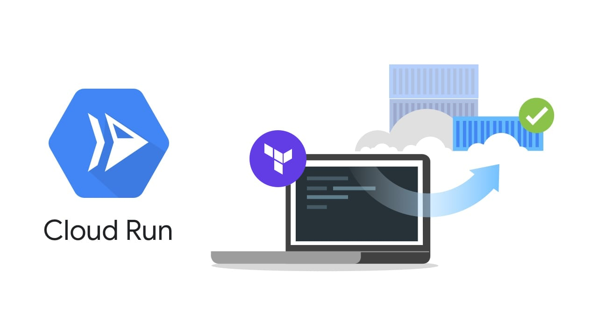

Configuring Cloud Run with Terraform | Seth Vargo

# [Configuring Cloud Run with Terraform](https://www.sethvargo.com/configuring-cloud-run-with-terraform/)

 [Cloud Run](https://www.sethvargo.com/tag/cloud-run), [Serverless](https://www.sethvargo.com/tag/serverless), [Terraform](https://www.sethvargo.com/tag/terraform)    * Posted on December 4, 2019*

[Terraform](https://www.terraform.io/) is a popular tool for managing infrastructure configurations as code, but what if that infrastructure is serverless? Google's [Cloud Run](https://cloud.google.com/run) is a fully-managed serverless offering that leverages the power and flexibility of containers as a deployment primitive. This post explores **how to setup and configure a Cloud Run service using Terraform**.

The full sample code for this post is [available on GitHub](https://github.com/sethvargo/terraform-cloud-run-demo).

## Setup

To get started, [create a Google Cloud account](https://console.cloud.google.com/freetrial), [install the Cloud SDK](https://cloud.google.com/sdk/install), and install [Terraform](https://www.terraform.io/) for your device. If you have not already done so, authenticate to the Cloud SDK:

	$ gcloud auth application-default login

This will open a browser and prompt a sign in for your Google account. This only needs to be done once per device.

Create a new folder in which to create your Terraform configurations. All future commands will be run from this folder and files will be created in this folder.

	$ mkdir terraform-cloud-run-demo

	$ cd terraform-cloud-run-demo

## Configurations

Create a file named `versions.tf` that define the version constraints.

	terraform {
	  required_version = ">= 0.12"

	  required_providers {
	    google = ">= 3.3"
	  }
	}

This file creates two constraints:

- `terraform` - This is the actual Terraform binary version. We require version 12.0+.

- `google` - This is the Google *provider* for Terraform. We require 3.3+ because Cloud Run support was added in version 3.3.0.

Create a file named `main.tf` and configure the Google provider stanza:

	provider "google" {
	  project = "YOUR_PROJECT_ID" *# replace with your project ID*
	}

Enable the Cloud Run API. This only needs to be done once per project, but it is an idempotent operation.

	resource "google_project_service" "run" {
	  service = "run.googleapis.com"
	}

Create a Cloud Run service named `"my_service"` in the `"us-central1"` region. This service deploys a basic hello world container and directs 100% of traffic to this container.

	resource "google_cloud_run_service" "my_service" {
	  name     = "my_service"
	  location = "us-central1"

	  template {
	    spec {
	      containers {
	        image = "gcr.io/cloudrun/hello"
	      }
	    }
	  }

	  traffic {
	    percent         = 100
	    latest_revision = true
	  }

	  depends_on = [google_project_service.run]
	}

Make the deployed service publicly accessible. Without this configuration, the endpoint will require authentication. For demo purposes, give "allUsers" the ability to invoke the service.

	resource "google_cloud_run_service_iam_member" "allUsers" {
	  service  = google_cloud_run_service.my_service.name
	  location = google_cloud_run_service.my_service.location
	  role     = "roles/run.invoker"
	  member   = "allUsers"
	}

Finally, output the URL where the service can be accessed.

	output "url" {
	  value = "${google_cloud_run_service.my_service.status[0].url}"
	}

## Execute Terraform

Now that the configurations are written, initialize Terraform.

	$ terraform init

Next, plan the changes.

	$ terraform plan

The output will show the actions Terraform is going to take.

	Plan: 3 to add, 0 to change, 0 to destroy.

Now apply the changes. Terraform will automatically handle the order of operations.

	$ terraform apply

The output will show the progress and eventually the URL.

	google_project_service.run: Creating...
	google_project_service.run: Still creating... [10s elapsed]
	google_project_service.run: Still creating... [20s elapsed]
	google_project_service.run: Still creating... [30s elapsed]
	google_project_service.run: Creation complete after 38s [id=sethvargo-gcloud-secrets/run.googleapis.com]
	google_cloud_run_service.my-service: Creating...
	google_cloud_run_service.my-service: Still creating... [10s elapsed]
	google_cloud_run_service.my-service: Creation complete after 16s [id=locations/us-central1/namespaces/sethvargo-gcloud-secrets/services/my-service]
	google_cloud_run_service_iam_member.allUsers: Creating...
	google_cloud_run_service_iam_member.allUsers: Creation complete after 6s [id=v1/projects/sethvargo-gcloud-secrets/locations/us-central1/services/my-service/roles/run.invoker/allusers]

	Apply complete! Resources: 3 added, 0 changed, 0 destroyed.

	Outputs:

	url = https://my-service-3vyvs7utmq-uc.a.run.app

## Invoke the service

Use Terraform outputs to invoke the service.

	# In the terminal
	$ curl $(terraform output url)

	# In the default browser
	$ open $(terraform output url)

## Tearing it down

One of the beauties of Terraform is its self-contained nature. Even though Cloud Run has a generours free tier and [you only pay when your service is running], some folks want to cleanup things when they are done.

When you are done experimenting, tear everything down with a single Terraform command!

	$ terraform destroy

Confirm "yes" at the prompt.

## Next steps

This post only beings to scratch the surface of the functionality offered by the `google_cloud_run_service` resource in Terraform. Check out the [Cloud Run Terraform resource documentation](https://www.terraform.io/docs/providers/google/r/cloud_run_service.html) for a full list of all arguments and attributes available. You can also [learn more about Cloud Run](https://cloud.google.com/run) and [Cloud Run pricing](https://cloud.google.com/run/pricing) on the Google Cloud website.

## About Seth

Seth Vargo is an engineer at [Google Cloud](https://cloud.google.com/). Previously he worked at HashiCorp, Chef Software, CustomInk, and some Pittsburgh-based startups. He is the author of [Learning Chef](https://www.amazon.com/Learning-Chef-Configuration-Management-Automation/dp/1491944935) and is passionate about reducing inequality in technology. When he is not writing, working on open source, teaching, or speaking at conferences, Seth advises non-profits.

- 

- 

- 

- 

- 

- 