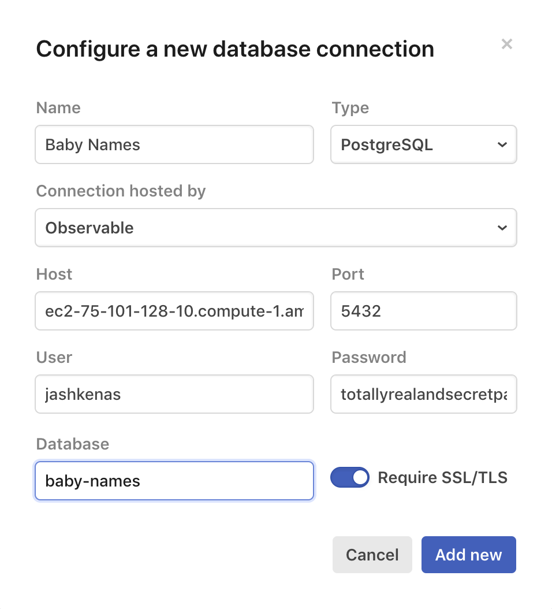

Connecting to databases

[Observable![](data:image/svg+xml,%3csvg xmlns='http://www.w3.org/2000/svg' width='16' height='16' viewBox='0 0 16 16' fill='none' class='w1 h1 ml1 moon-gray js-evernote-checked' alt='Team' data-evernote-id='61'%3e%3cpath d='M7 5.5C7 6.32843 6.32843 7 5.5 7C4.67157 7 4 6.32843 4 5.5C4 4.67157 4.67157 4 5.5 4C6.32843 4 7 4.67157 7 5.5ZM7.47118 8.39255C8.39415 7.76235 9 6.70193 9 5.5C9 3.567 7.433 2 5.5 2C3.567 2 2 3.567 2 5.5C2 6.70193 2.60585 7.76235 3.52882 8.39255C1.42531 9.26936 0 11.507 0 14H2C2 11.6891 3.6635 10 5.5 10C7.3365 10 9 11.6891 9 14H11C11 11.507 9.57469 9.26936 7.47118 8.39255ZM10.7943 4.37149C10.6095 4.15028 10.3566 4 10 4V2C11.0261 2 11.8163 2.4756 12.3289 3.0889C12.8197 3.67612 13.0863 4.42197 13.0863 5.08628C13.0863 5.88608 12.8633 6.71994 12.35 7.37771C12.2971 7.44563 12.2414 7.51111 12.183 7.57398C13.0379 8.03579 13.7664 8.72891 14.3323 9.47518C15.3396 10.8034 16 12.5103 16 14H14C14 13.0349 13.5411 11.7417 12.7387 10.6837C11.9307 9.61822 10.9416 9 10 9V8.5V7V6.5C10.377 6.5 10.6101 6.35651 10.7732 6.1474C10.9575 5.91125 11.0863 5.53825 11.0863 5.08628C11.0863 4.91608 11.001 4.6188 10.7943 4.37149Z' fill='currentColor' fill-rule='evenodd' clip-rule='evenodd'%3e%3c/path%3e%3c/svg%3e)](https://observablehq.com/@observablehq)• Jul 12

The magic notebook for visualization.
By

[Visnu P](https://observablehq.com/@visnup)

Listed in [Introduction](https://observablehq.com/collection/@observablehq/introduction)

# Connecting to databases

Observable database clients allow secure and convenient querying of SQL databases from private notebooks. You can feed query results directly into visualizations, and you can use reactive values as parameters in dynamic queries!

This walkthrough discusses connecting notebooks to databases that are reachable from the public internet, with the connection hosted by Observable. If you wish to use your notebooks to query a database on your local computer, or on a private network, we also provide a [self-hosted database proxy](https://observablehq.com/@observablehq/self-hosted-database-proxies) that you may prefer to use.

## Setting up a database client

We currently support PostgreSQL 8+, MySQL 5, and Google BigQuery. We highly recommend that you use an SSL-encrypted connection and set up a read-only database user — perhaps also restricted via SQL `GRANT` permissions to only be able to read the relevant tables and columns — specifically for connecting to Observable.

To get started, navigate to the [Databases tab](https://observablehq.com/settings/databases) in Settings. A database client can be created for personal use or shared by a [team](https://observablehq.com/teams), and is only accessible from that user or team’s private notebooks. Sharing or publishing a notebook that uses a database connector will immediately revoke that notebook’s access to the database.

Setting up a new PostgreSQL or MySQL database client

Database connections are tested when they’re saved, and show a warning if the client has write permissions or if the connection has problems. Connections over SSL are encrypted, but not (yet) verified, as most cloud database hosts either provide their own certification authority, or issue unverifiable certificates.

## Using a database client

Create a DatabaseClient for a configured database, then use `client.query(sql, [parameters])` to issue a query, or `client.describe(table)` to inspect the schema.

### DatabaseClient(*name*)

Returns a promise to the client for the database with the specified *name*. The first time you call this method from a private notebook, you’ll be prompted to allow the notebook access to this database.

client = [DatabaseClient {]()}

### *client*.query(*query*[, *parameters*])

Run the specified SQL *query*, returning a promise to the array of results.

*(You can either explicitly await the promise as part of a larger expression, or rely on Observable’s [implicit cell-level await](https://observablehq.com/@observablehq/introduction-to-promises).)*

If *parameters* is specified, it is an array of values to bind to query parameters. The parameter syntax depends on the database type: PostgreSQL uses numbered parameters (`$1`, `$2`, …), while MySQL uses ordered parameters (repeating `?`). BigQuery can use named (`@age`, `@name`, …) or ordered (repeating `?`) parameters. Please refer to the respective documentation for [PostgreSQL](https://node-postgres.com/features/queries#parameterized-query), [MySQL](https://github.com/mysqljs/mysql/blob/master/Readme.md#escaping-query-values), and [BigQuery](https://cloud.google.com/bigquery/docs/parameterized-queries).

names = [Array(263) Object, Object, Object, Object, Object, Object, Object, Object, Object, Object, Object, Object, Object, Object, Object, Object, Object, Object, Object, Object, …]

' style='user-select: none%3b'%3e%3cg transform='translate(0%2c 0)' fill='none' font-size='10' font-family='sans-serif' text-anchor='middle'%3e%3cpath class='domain' stroke='currentColor' d='M0.5%2c-6V0.5H955.5V-6'%3e%3c/path%3e%3cg class='tick' opacity='1' transform='translate(0.5%2c0)'%3e%3cline stroke='currentColor' y2='-6'%3e%3c/line%3e%3ctext fill='currentColor' y='-9' dy='0em' opacity='1'%3e1920%3c/text%3e%3c/g%3e%3cg class='tick' opacity='1' transform='translate(97.96095823439028%2c0)'%3e%3cline stroke='currentColor' y2='-6'%3e%3c/line%3e%3ctext fill='currentColor' y='-9' dy='0em' opacity='1'%3e1930%3c/text%3e%3c/g%3e%3cg class='tick' opacity='1' transform='translate(195.3952367649113%2c0)'%3e%3cline stroke='currentColor' y2='-6'%3e%3c/line%3e%3ctext fill='currentColor' y='-9' dy='0em' opacity='1'%3e1940%3c/text%3e%3c/g%3e%3cg class='tick' opacity='1' transform='translate(292.8561949993016%2c0)'%3e%3cline stroke='currentColor' y2='-6'%3e%3c/line%3e%3ctext fill='currentColor' y='-9' dy='0em' opacity='1'%3e1950%3c/text%3e%3c/g%3e%3cg class='tick' opacity='1' transform='translate(390.2904735298226%2c0)'%3e%3cline stroke='currentColor' y2='-6'%3e%3c/line%3e%3ctext fill='currentColor' y='-9' dy='0em' opacity='1'%3e1960%3c/text%3e%3c/g%3e%3cg class='tick' opacity='1' transform='translate(487.75032010988497%2c0)'%3e%3cline stroke='currentColor' y2='-6'%3e%3c/line%3e%3ctext fill='currentColor' y='-9' dy='0em' opacity='1'%3e1970%3c/text%3e%3c/g%3e%3cg class='tick' opacity='1' transform='translate(585.1857102947339%2c0)'%3e%3cline stroke='currentColor' y2='-6'%3e%3c/line%3e%3ctext fill='currentColor' y='-9' dy='0em' opacity='1'%3e1980%3c/text%3e%3c/g%3e%3cg class='tick' opacity='1' transform='translate(682.6466685291241%2c0)'%3e%3cline stroke='currentColor' y2='-6'%3e%3c/line%3e%3ctext fill='currentColor' y='-9' dy='0em' opacity='1'%3e1990%3c/text%3e%3c/g%3e%3cg class='tick' opacity='1' transform='translate(780.0809470596452%2c0)'%3e%3cline stroke='currentColor' y2='-6'%3e%3c/line%3e%3ctext fill='currentColor' y='-9' dy='0em' opacity='1'%3e2000%3c/text%3e%3c/g%3e%3cg class='tick' opacity='1' transform='translate(877.5419052940355%2c0)'%3e%3cline stroke='currentColor' y2='-6'%3e%3c/line%3e%3ctext fill='currentColor' y='-9' dy='0em' opacity='0.64'%3e2010%3c/text%3e%3c/g%3e%3c/g%3e%3cg transform='translate(0%2c 180)' fill='none' font-size='10' font-family='sans-serif' text-anchor='middle'%3e%3cpath class='domain' stroke='currentColor' d='M0.5%2c6V0.5H955.5V6'%3e%3c/path%3e%3cg class='tick' opacity='1' transform='translate(0.5%2c0)'%3e%3cline stroke='currentColor' y2='6'%3e%3c/line%3e%3ctext fill='currentColor' y='9' dy='0.71em' opacity='1'%3e1920%3c/text%3e%3c/g%3e%3cg class='tick' opacity='1' transform='translate(97.96095823439028%2c0)'%3e%3cline stroke='currentColor' y2='6'%3e%3c/line%3e%3ctext fill='currentColor' y='9' dy='0.71em' opacity='1'%3e1930%3c/text%3e%3c/g%3e%3cg class='tick' opacity='1' transform='translate(195.3952367649113%2c0)'%3e%3cline stroke='currentColor' y2='6'%3e%3c/line%3e%3ctext fill='currentColor' y='9' dy='0.71em' opacity='1'%3e1940%3c/text%3e%3c/g%3e%3cg class='tick' opacity='1' transform='translate(292.8561949993016%2c0)'%3e%3cline stroke='currentColor' y2='6'%3e%3c/line%3e%3ctext fill='currentColor' y='9' dy='0.71em' opacity='1'%3e1950%3c/text%3e%3c/g%3e%3cg class='tick' opacity='1' transform='translate(390.2904735298226%2c0)'%3e%3cline stroke='currentColor' y2='6'%3e%3c/line%3e%3ctext fill='currentColor' y='9' dy='0.71em' opacity='1'%3e1960%3c/text%3e%3c/g%3e%3cg class='tick' opacity='1' transform='translate(487.75032010988497%2c0)'%3e%3cline stroke='currentColor' y2='6'%3e%3c/line%3e%3ctext fill='currentColor' y='9' dy='0.71em' opacity='1'%3e1970%3c/text%3e%3c/g%3e%3cg class='tick' opacity='1' transform='translate(585.1857102947339%2c0)'%3e%3cline stroke='currentColor' y2='6'%3e%3c/line%3e%3ctext fill='currentColor' y='9' dy='0.71em' opacity='1'%3e1980%3c/text%3e%3c/g%3e%3cg class='tick' opacity='1' transform='translate(682.6466685291241%2c0)'%3e%3cline stroke='currentColor' y2='6'%3e%3c/line%3e%3ctext fill='currentColor' y='9' dy='0.71em' opacity='1'%3e1990%3c/text%3e%3c/g%3e%3cg class='tick' opacity='1' transform='translate(780.0809470596452%2c0)'%3e%3cline stroke='currentColor' y2='6'%3e%3c/line%3e%3ctext fill='currentColor' y='9' dy='0.71em' opacity='1'%3e2000%3c/text%3e%3c/g%3e%3cg class='tick' opacity='1' transform='translate(877.5419052940355%2c0)'%3e%3cline stroke='currentColor' y2='6'%3e%3c/line%3e%3ctext fill='currentColor' y='9' dy='0.71em' opacity='0.64'%3e2010%3c/text%3e%3c/g%3e%3c/g%3e%3cg transform='translate(0%2c 0)' clip-path='url(https://observablehq.static.observableusercontent.com/worker/worker.e3faf704bc998c6e3a994e66e24a44614356fd1451db2397ac78dfb58c91af0a.html%23O-clip-1)'%3e%3cg%3e%3cpath fill='%237fc97f' opacity='0.25' transform='translate(0%2c 0)' d='M496.9884120221633%2c43.50052056222286L516.4923872049169%2c42.55136033176707L526.230479117195%2c41.12836073967245L535.9685710294734%2c42.79282603026276L545.7066629417516%2c40.17984799292907L555.4714345578991%2c39.698539606489966L565.2095264701774%2c39.98925512607819L574.9476183824556%2c39.59355000059061L584.6857102947339%2c39.769703375921196L594.4504819108814%2c40.46010054925213L604.1885738231596%2c40.848129440068476L613.926665735438%2c42.26233762471432L623.6647576477161%2c42.064184172463634L633.4295292638636%2c40.985798976848834L643.1676211761419%2c39.952000004399125L652.9057130884202%2c40.80324304843861L662.6438050006984%2c41.08026399789956L672.408576616846%2c41.53710057182024L682.1466685291241%2c42.79282603026276L691.8847604414025%2c42.96969524342276L701.6228523536806%2c43.63116881235716L721.1257158821064%2c43.38037709686199L818.5599944126275%2c42.96969524342276L818.5599944126275%2c45L721.1257158821064%2c45L701.6228523536806%2c45L691.8847604414025%2c45L682.1466685291241%2c45L672.408576616846%2c45L662.6438050006984%2c45L652.9057130884202%2c45L643.1676211761419%2c45L633.4295292638636%2c45L623.6647576477161%2c45L613.926665735438%2c45L604.1885738231596%2c45L594.4504819108814%2c45L584.6857102947339%2c45L574.9476183824556%2c45L565.2095264701774%2c45L555.4714345578991%2c45L545.7066629417516%2c45L535.9685710294734%2c45L526.230479117195%2c45L516.4923872049169%2c45L496.9884120221633%2c45Z'%3e%3c/path%3e%3cpath fill='%237fc97f' opacity='0.25' transform='translate(0%2c 45)' d='M496.9884120221633%2c43.50052056222286L516.4923872049169%2c42.55136033176707L526.230479117195%2c41.12836073967245L535.9685710294734%2c42.79282603026276L545.7066629417516%2c40.17984799292907L555.4714345578991%2c39.698539606489966L565.2095264701774%2c39.98925512607819L574.9476183824556%2c39.59355000059061L584.6857102947339%2c39.769703375921196L594.4504819108814%2c40.46010054925213L604.1885738231596%2c40.848129440068476L613.926665735438%2c42.26233762471432L623.6647576477161%2c42.064184172463634L633.4295292638636%2c40.985798976848834L643.1676211761419%2c39.952000004399125L652.9057130884202%2c40.80324304843861L662.6438050006984%2c41.08026399789956L672.408576616846%2c41.53710057182024L682.1466685291241%2c42.79282603026276L691.8847604414025%2c42.96969524342276L701.6228523536806%2c43.63116881235716L721.1257158821064%2c43.38037709686199L818.5599944126275%2c42.96969524342276L818.5599944126275%2c45L721.1257158821064%2c45L701.6228523536806%2c45L691.8847604414025%2c45L682.1466685291241%2c45L672.408576616846%2c45L662.6438050006984%2c45L652.9057130884202%2c45L643.1676211761419%2c45L633.4295292638636%2c45L623.6647576477161%2c45L613.926665735438%2c45L604.1885738231596%2c45L594.4504819108814%2c45L584.6857102947339%2c45L574.9476183824556%2c45L565.2095264701774%2c45L555.4714345578991%2c45L545.7066629417516%2c45L535.9685710294734%2c45L526.230479117195%2c45L516.4923872049169%2c45L496.9884120221633%2c45Z'%3e%3c/path%3e%3cpath fill='%237fc97f' opacity='0.25' transform='translate(0%2c 90)' d='M496.9884120221633%2c43.50052056222286L516.4923872049169%2c42.55136033176707L526.230479117195%2c41.12836073967245L535.9685710294734%2c42.79282603026276L545.7066629417516%2c40.17984799292907L555.4714345578991%2c39.698539606489966L565.2095264701774%2c39.98925512607819L574.9476183824556%2c39.59355000059061L584.6857102947339%2c39.769703375921196L594.4504819108814%2c40.46010054925213L604.1885738231596%2c40.848129440068476L613.926665735438%2c42.26233762471432L623.6647576477161%2c42.064184172463634L633.4295292638636%2c40.985798976848834L643.1676211761419%2c39.952000004399125L652.9057130884202%2c40.80324304843861L662.6438050006984%2c41.08026399789956L672.408576616846%2c41.53710057182024L682.1466685291241%2c42.79282603026276L691.8847604414025%2c42.96969524342276L701.6228523536806%2c43.63116881235716L721.1257158821064%2c43.38037709686199L818.5599944126275%2c42.96969524342276L818.5599944126275%2c45L721.1257158821064%2c45L701.6228523536806%2c45L691.8847604414025%2c45L682.1466685291241%2c45L672.408576616846%2c45L662.6438050006984%2c45L652.9057130884202%2c45L643.1676211761419%2c45L633.4295292638636%2c45L623.6647576477161%2c45L613.926665735438%2c45L604.1885738231596%2c45L594.4504819108814%2c45L584.6857102947339%2c45L574.9476183824556%2c45L565.2095264701774%2c45L555.4714345578991%2c45L545.7066629417516%2c45L535.9685710294734%2c45L526.230479117195%2c45L516.4923872049169%2c45L496.9884120221633%2c45Z'%3e%3c/path%3e%3cpath fill='%237fc97f' opacity='0.25' transform='translate(0%2c 135)' d='M496.9884120221633%2c43.50052056222286L516.4923872049169%2c42.55136033176707L526.230479117195%2c41.12836073967245L535.9685710294734%2c42.79282603026276L545.7066629417516%2c40.17984799292907L555.4714345578991%2c39.698539606489966L565.2095264701774%2c39.98925512607819L574.9476183824556%2c39.59355000059061L584.6857102947339%2c39.769703375921196L594.4504819108814%2c40.46010054925213L604.1885738231596%2c40.848129440068476L613.926665735438%2c42.26233762471432L623.6647576477161%2c42.064184172463634L633.4295292638636%2c40.985798976848834L643.1676211761419%2c39.952000004399125L652.9057130884202%2c40.80324304843861L662.6438050006984%2c41.08026399789956L672.408576616846%2c41.53710057182024L682.1466685291241%2c42.79282603026276L691.8847604414025%2c42.96969524342276L701.6228523536806%2c43.63116881235716L721.1257158821064%2c43.38037709686199L818.5599944126275%2c42.96969524342276L818.5599944126275%2c45L721.1257158821064%2c45L701.6228523536806%2c45L691.8847604414025%2c45L682.1466685291241%2c45L672.408576616846%2c45L662.6438050006984%2c45L652.9057130884202%2c45L643.1676211761419%2c45L633.4295292638636%2c45L623.6647576477161%2c45L613.926665735438%2c45L604.1885738231596%2c45L594.4504819108814%2c45L584.6857102947339%2c45L574.9476183824556%2c45L565.2095264701774%2c45L555.4714345578991%2c45L545.7066629417516%2c45L535.9685710294734%2c45L526.230479117195%2c45L516.4923872049169%2c45L496.9884120221633%2c45Z'%3e%3c/path%3e%3ctext text-anchor='end' fill='%237fc97f' y='40' x='950'%3e%3c/text%3e%3c/g%3e%3cg%3e%3cpath fill='%23beaed4' opacity='0.25' transform='translate(0%2c 0)' d='M68.22000279368628%2c43.63116881235716L97.46095823439028%2c43.63116881235716L136.44000558737255%2c43.63116881235716L146.1780974996508%2c43.38037709686199L155.91618941192903%2c43.50052056222286L165.68096102807652%2c43.268550285910116L175.4190529403548%2c43.268550285910116L185.15714485263305%2c42.79282603026276L194.8952367649113%2c42.79282603026276L204.65889672673094%2c43.16352024882531L214.39698863900918%2c42.194730842662764L224.13508055128742%2c42.12871547749786L233.87317246356568%2c42.12871547749786L243.63794407971318%2c41.53710057182024L253.37714764631934%2c41.70341795831963L263.1152395585975%2c42.55136033176707L272.8533314708758%2c41.43052497168096L282.6181030870233%2c41.03275031158674L292.3561949993016%2c41.53710057182024L302.0942869115798%2c40.37829397830127L311.83237882385805%2c40.25822967203551L321.5971504400056%2c40.50156168666858L331.33524235228384%2c40.064608965499474L341.07333426456205%2c39.841848853732124L350.8114261768403%2c40.46010054925213L360.57619779298784%2c41.08026399789956L370.3142897052661%2c40.50156168666858L380.0523816175443%2c39.952000004399125L389.7904735298226%2c38.93992600068542L399.5552451459701%2c38.128521973356435L409.29333705824837%2c38.32212369669247L419.0314289705266%2c37.5026028111143L428.76952088280484%2c37.52763592670576L438.53429249895237%2c36.299572864585684L448.27238441123063%2c35.87902266093657L458.01047632350884%2c33.61316732527221L467.7485682357871%2c29.893163259367654L477.51222819760676%2c17.121508816914336L487.25032010988497%2c4.760087966399645L496.9884120221633%2c-7.993393850660688L506.7276155887693%2c-7.659987219807455L516.4923872049169%2c-14.237345911087779L526.230479117195%2c-25.597725614225396L535.9685710294734%2c-30.479590836820407L545.7066629417516%2c-41.87280419244077L555.4714345578991%2c-45L565.2095264701774%2c-40.50758759568086L574.9476183824556%2c-43.73151887997912L584.6857102947339%2c-41.360122650316185L594.4504819108814%2c-39.6309701606926L604.1885738231596%2c-33.561847699431354L613.926665735438%2c-28.09609808918657L623.6647576477161%2c-25.48085067791915L633.4295292638636%2c-25.989438277685096L643.1676211761419%2c-33.07139208646042L652.9057130884202%2c-28.64260903424912L662.6438050006984%2c-25.238515030959604L672.408576616846%2c-25.000693959086178L682.1466685291241%2c-21.169928239285767L691.8847604414025%2c-17.434309683671643L701.6228523536806%2c-13.209938554897015L711.3876239698283%2c-11.673578656160792L721.1257158821064%2c-10.527999951609594L730.8638077943847%2c-6.52335866914752L740.601899706663%2c-4.014861290654721L750.3666713228105%2c-1.63276584975479L760.1047632350886%2c-0.5678947573424651L769.842855147367%2c1.6488764075889577L779.5809470596452%2c2.885355239992535L789.3457186757928%2c5.017005696809122L799.083810588071%2c5.502637584877121L808.8219025003492%2c6.849125257985932L818.5599944126275%2c6.98196125585352L828.324766028775%2c8.88775306210455L838.0628579410532%2c9.116775099146693L847.8009498533315%2c9.179489784250897L857.5390417656097%2c10.198291458342752L867.3038133817573%2c11.835844538194628L877.0419052940355%2c12.630687676574524L886.7799972063137%2c14.330849249247535L896.518089118592%2c12.480534842085184L906.2828607347395%2c14.324740465051757L916.0209526470177%2c14.385883159955348L925.7590445592961%2c15.248776114375143L935.4971364715742%2c16.807393884994177L945.2619080877218%2c17.520905681477174L955%2c18.058008184802677L955%2c45L945.2619080877218%2c45L935.4971364715742%2c45L925.7590445592961%2c45L916.0209526470177%2c45L906.2828607347395%2c45L896.518089118592%2c45L886.7799972063137%2c45L877.0419052940355%2c45L867.3038133817573%2c45L857.5390417656097%2c45L847.8009498533315%2c45L838.0628579410532%2c45L828.324766028775%2c45L818.5599944126275%2c45L808.8219025003492%2c45L799.083810588071%2c45L789.3457186757928%2c45L779.5809470596452%2c45L769.842855147367%2c45L760.1047632350886%2c45L750.3666713228105%2c45L740.601899706663%2c45L730.8638077943847%2c45L721.1257158821064%2c45L711.3876239698283%2c45L701.6228523536806%2c45L691.8847604414025%2c45L682.1466685291241%2c45L672.408576616846%2c45L662.6438050006984%2c45L652.9057130884202%2c45L643.1676211761419%2c45L633.4295292638636%2c45L623.6647576477161%2c45L613.926665735438%2c45L604.1885738231596%2c45L594.4504819108814%2c45L584.6857102947339%2c45L574.9476183824556%2c45L565.2095264701774%2c45L555.4714345578991%2c45L545.7066629417516%2c45L535.9685710294734%2c45L526.230479117195%2c45L516.4923872049169%2c45L506.7276155887693%2c45L496.9884120221633%2c45L487.25032010988497%2c45L477.51222819760676%2c45L467.7485682357871%2c45L458.01047632350884%2c45L448.27238441123063%2c45L438.53429249895237%2c45L428.76952088280484%2c45L419.0314289705266%2c45L409.29333705824837%2c45L399.5552451459701%2c45L389.7904735298226%2c45L380.0523816175443%2c45L370.3142897052661%2c45L360.57619779298784%2c45L350.8114261768403%2c45L341.07333426456205%2c45L331.33524235228384%2c45L321.5971504400056%2c45L311.83237882385805%2c45L302.0942869115798%2c45L292.3561949993016%2c45L282.6181030870233%2c45L272.8533314708758%2c45L263.1152395585975%2c45L253.37714764631934%2c45L243.63794407971318%2c45L233.87317246356568%2c45L224.13508055128742%2c45L214.39698863900918%2c45L204.65889672673094%2c45L194.8952367649113%2c45L185.15714485263305%2c45L175.4190529403548%2c45L165.68096102807652%2c45L155.91618941192903%2c45L146.1780974996508%2c45L136.44000558737255%2c45L97.46095823439028%2c45L68.22000279368628%2c45Z'%3e%3c/path%3e%3cpath fill='%23beaed4' opacity='0.25' transform='translate(0%2c 45)' d='M68.22000279368628%2c43.63116881235716L97.46095823439028%2c43.63116881235716L136.44000558737255%2c43.63116881235716L146.1780974996508%2c43.38037709686199L155.91618941192903%2c43.50052056222286L165.68096102807652%2c43.268550285910116L175.4190529403548%2c43.268550285910116L185.15714485263305%2c42.79282603026276L194.8952367649113%2c42.79282603026276L204.65889672673094%2c43.16352024882531L214.39698863900918%2c42.194730842662764L224.13508055128742%2c42.12871547749786L233.87317246356568%2c42.12871547749786L243.63794407971318%2c41.53710057182024L253.37714764631934%2c41.70341795831963L263.1152395585975%2c42.55136033176707L272.8533314708758%2c41.43052497168096L282.6181030870233%2c41.03275031158674L292.3561949993016%2c41.53710057182024L302.0942869115798%2c40.37829397830127L311.83237882385805%2c40.25822967203551L321.5971504400056%2c40.50156168666858L331.33524235228384%2c40.064608965499474L341.07333426456205%2c39.841848853732124L350.8114261768403%2c40.46010054925213L360.57619779298784%2c41.08026399789956L370.3142897052661%2c40.50156168666858L380.0523816175443%2c39.952000004399125L389.7904735298226%2c38.93992600068542L399.5552451459701%2c38.128521973356435L409.29333705824837%2c38.32212369669247L419.0314289705266%2c37.5026028111143L428.76952088280484%2c37.52763592670576L438.53429249895237%2c36.299572864585684L448.27238441123063%2c35.87902266093657L458.01047632350884%2c33.61316732527221L467.7485682357871%2c29.893163259367654L477.51222819760676%2c17.121508816914336L487.25032010988497%2c4.760087966399645L496.9884120221633%2c-7.993393850660688L506.7276155887693%2c-7.659987219807455L516.4923872049169%2c-14.237345911087779L526.230479117195%2c-25.597725614225396L535.9685710294734%2c-30.479590836820407L545.7066629417516%2c-41.87280419244077L555.4714345578991%2c-45L565.2095264701774%2c-40.50758759568086L574.9476183824556%2c-43.73151887997912L584.6857102947339%2c-41.360122650316185L594.4504819108814%2c-39.6309701606926L604.1885738231596%2c-33.561847699431354L613.926665735438%2c-28.09609808918657L623.6647576477161%2c-25.48085067791915L633.4295292638636%2c-25.989438277685096L643.1676211761419%2c-33.07139208646042L652.9057130884202%2c-28.64260903424912L662.6438050006984%2c-25.238515030959604L672.408576616846%2c-25.000693959086178L682.1466685291241%2c-21.169928239285767L691.8847604414025%2c-17.434309683671643L701.6228523536806%2c-13.209938554897015L711.3876239698283%2c-11.673578656160792L721.1257158821064%2c-10.527999951609594L730.8638077943847%2c-6.52335866914752L740.601899706663%2c-4.014861290654721L750.3666713228105%2c-1.63276584975479L760.1047632350886%2c-0.5678947573424651L769.842855147367%2c1.6488764075889577L779.5809470596452%2c2.885355239992535L789.3457186757928%2c5.017005696809122L799.083810588071%2c5.502637584877121L808.8219025003492%2c6.849125257985932L818.5599944126275%2c6.98196125585352L828.324766028775%2c8.88775306210455L838.0628579410532%2c9.116775099146693L847.8009498533315%2c9.179489784250897L857.5390417656097%2c10.198291458342752L867.3038133817573%2c11.835844538194628L877.0419052940355%2c12.630687676574524L886.7799972063137%2c14.330849249247535L896.518089118592%2c12.480534842085184L906.2828607347395%2c14.324740465051757L916.0209526470177%2c14.385883159955348L925.7590445592961%2c15.248776114375143L935.4971364715742%2c16.807393884994177L945.2619080877218%2c17.520905681477174L955%2c18.058008184802677L955%2c45L945.2619080877218%2c45L935.4971364715742%2c45L925.7590445592961%2c45L916.0209526470177%2c45L906.2828607347395%2c45L896.518089118592%2c45L886.7799972063137%2c45L877.0419052940355%2c45L867.3038133817573%2c45L857.5390417656097%2c45L847.8009498533315%2c45L838.0628579410532%2c45L828.324766028775%2c45L818.5599944126275%2c45L808.8219025003492%2c45L799.083810588071%2c45L789.3457186757928%2c45L779.5809470596452%2c45L769.842855147367%2c45L760.1047632350886%2c45L750.3666713228105%2c45L740.601899706663%2c45L730.8638077943847%2c45L721.1257158821064%2c45L711.3876239698283%2c45L701.6228523536806%2c45L691.8847604414025%2c45L682.1466685291241%2c45L672.408576616846%2c45L662.6438050006984%2c45L652.9057130884202%2c45L643.1676211761419%2c45L633.4295292638636%2c45L623.6647576477161%2c45L613.926665735438%2c45L604.1885738231596%2c45L594.4504819108814%2c45L584.6857102947339%2c45L574.9476183824556%2c45L565.2095264701774%2c45L555.4714345578991%2c45L545.7066629417516%2c45L535.9685710294734%2c45L526.230479117195%2c45L516.4923872049169%2c45L506.7276155887693%2c45L496.9884120221633%2c45L487.25032010988497%2c45L477.51222819760676%2c45L467.7485682357871%2c45L458.01047632350884%2c45L448.27238441123063%2c45L438.53429249895237%2c45L428.76952088280484%2c45L419.0314289705266%2c45L409.29333705824837%2c45L399.5552451459701%2c45L389.7904735298226%2c45L380.0523816175443%2c45L370.3142897052661%2c45L360.57619779298784%2c45L350.8114261768403%2c45L341.07333426456205%2c45L331.33524235228384%2c45L321.5971504400056%2c45L311.83237882385805%2c45L302.0942869115798%2c45L292.3561949993016%2c45L282.6181030870233%2c45L272.8533314708758%2c45L263.1152395585975%2c45L253.37714764631934%2c45L243.63794407971318%2c45L233.87317246356568%2c45L224.13508055128742%2c45L214.39698863900918%2c45L204.65889672673094%2c45L194.8952367649113%2c45L185.15714485263305%2c45L175.4190529403548%2c45L165.68096102807652%2c45L155.91618941192903%2c45L146.1780974996508%2c45L136.44000558737255%2c45L97.46095823439028%2c45L68.22000279368628%2c45Z'%3e%3c/path%3e%3cpath fill='%23beaed4' opacity='0.25' transform='translate(0%2c 90)' d='M68.22000279368628%2c43.63116881235716L97.46095823439028%2c43.63116881235716L136.44000558737255%2c43.63116881235716L146.1780974996508%2c43.38037709686199L155.91618941192903%2c43.50052056222286L165.68096102807652%2c43.268550285910116L175.4190529403548%2c43.268550285910116L185.15714485263305%2c42.79282603026276L194.8952367649113%2c42.79282603026276L204.65889672673094%2c43.16352024882531L214.39698863900918%2c42.194730842662764L224.13508055128742%2c42.12871547749786L233.87317246356568%2c42.12871547749786L243.63794407971318%2c41.53710057182024L253.37714764631934%2c41.70341795831963L263.1152395585975%2c42.55136033176707L272.8533314708758%2c41.43052497168096L282.6181030870233%2c41.03275031158674L292.3561949993016%2c41.53710057182024L302.0942869115798%2c40.37829397830127L311.83237882385805%2c40.25822967203551L321.5971504400056%2c40.50156168666858L331.33524235228384%2c40.064608965499474L341.07333426456205%2c39.841848853732124L350.8114261768403%2c40.46010054925213L360.57619779298784%2c41.08026399789956L370.3142897052661%2c40.50156168666858L380.0523816175443%2c39.952000004399125L389.7904735298226%2c38.93992600068542L399.5552451459701%2c38.128521973356435L409.29333705824837%2c38.32212369669247L419.0314289705266%2c37.5026028111143L428.76952088280484%2c37.52763592670576L438.53429249895237%2c36.299572864585684L448.27238441123063%2c35.87902266093657L458.01047632350884%2c33.61316732527221L467.7485682357871%2c29.893163259367654L477.51222819760676%2c17.121508816914336L487.25032010988497%2c4.760087966399645L496.9884120221633%2c-7.993393850660688L506.7276155887693%2c-7.659987219807455L516.4923872049169%2c-14.237345911087779L526.230479117195%2c-25.597725614225396L535.9685710294734%2c-30.479590836820407L545.7066629417516%2c-41.87280419244077L555.4714345578991%2c-45L565.2095264701774%2c-40.50758759568086L574.9476183824556%2c-43.73151887997912L584.6857102947339%2c-41.360122650316185L594.4504819108814%2c-39.6309701606926L604.1885738231596%2c-33.561847699431354L613.926665735438%2c-28.09609808918657L623.6647576477161%2c-25.48085067791915L633.4295292638636%2c-25.989438277685096L643.1676211761419%2c-33.07139208646042L652.9057130884202%2c-28.64260903424912L662.6438050006984%2c-25.238515030959604L672.408576616846%2c-25.000693959086178L682.1466685291241%2c-21.169928239285767L691.8847604414025%2c-17.434309683671643L701.6228523536806%2c-13.209938554897015L711.3876239698283%2c-11.673578656160792L721.1257158821064%2c-10.527999951609594L730.8638077943847%2c-6.52335866914752L740.601899706663%2c-4.014861290654721L750.3666713228105%2c-1.63276584975479L760.1047632350886%2c-0.5678947573424651L769.842855147367%2c1.6488764075889577L779.5809470596452%2c2.885355239992535L789.3457186757928%2c5.017005696809122L799.083810588071%2c5.502637584877121L808.8219025003492%2c6.849125257985932L818.5599944126275%2c6.98196125585352L828.324766028775%2c8.88775306210455L838.0628579410532%2c9.116775099146693L847.8009498533315%2c9.179489784250897L857.5390417656097%2c10.198291458342752L867.3038133817573%2c11.835844538194628L877.0419052940355%2c12.630687676574524L886.7799972063137%2c14.330849249247535L896.518089118592%2c12.480534842085184L906.2828607347395%2c14.324740465051757L916.0209526470177%2c14.385883159955348L925.7590445592961%2c15.248776114375143L935.4971364715742%2c16.807393884994177L945.2619080877218%2c17.520905681477174L955%2c18.058008184802677L955%2c45L945.2619080877218%2c45L935.4971364715742%2c45L925.7590445592961%2c45L916.0209526470177%2c45L906.2828607347395%2c45L896.518089118592%2c45L886.7799972063137%2c45L877.0419052940355%2c45L867.3038133817573%2c45L857.5390417656097%2c45L847.8009498533315%2c45L838.0628579410532%2c45L828.324766028775%2c45L818.5599944126275%2c45L808.8219025003492%2c45L799.083810588071%2c45L789.3457186757928%2c45L779.5809470596452%2c45L769.842855147367%2c45L760.1047632350886%2c45L750.3666713228105%2c45L740.601899706663%2c45L730.8638077943847%2c45L721.1257158821064%2c45L711.3876239698283%2c45L701.6228523536806%2c45L691.8847604414025%2c45L682.1466685291241%2c45L672.408576616846%2c45L662.6438050006984%2c45L652.9057130884202%2c45L643.1676211761419%2c45L633.4295292638636%2c45L623.6647576477161%2c45L613.926665735438%2c45L604.1885738231596%2c45L594.4504819108814%2c45L584.6857102947339%2c45L574.9476183824556%2c45L565.2095264701774%2c45L555.4714345578991%2c45L545.7066629417516%2c45L535.9685710294734%2c45L526.230479117195%2c45L516.4923872049169%2c45L506.7276155887693%2c45L496.9884120221633%2c45L487.25032010988497%2c45L477.51222819760676%2c45L467.7485682357871%2c45L458.01047632350884%2c45L448.27238441123063%2c45L438.53429249895237%2c45L428.76952088280484%2c45L419.0314289705266%2c45L409.29333705824837%2c45L399.5552451459701%2c45L389.7904735298226%2c45L380.0523816175443%2c45L370.3142897052661%2c45L360.57619779298784%2c45L350.8114261768403%2c45L341.07333426456205%2c45L331.33524235228384%2c45L321.5971504400056%2c45L311.83237882385805%2c45L302.0942869115798%2c45L292.3561949993016%2c45L282.6181030870233%2c45L272.8533314708758%2c45L263.1152395585975%2c45L253.37714764631934%2c45L243.63794407971318%2c45L233.87317246356568%2c45L224.13508055128742%2c45L214.39698863900918%2c45L204.65889672673094%2c45L194.8952367649113%2c45L185.15714485263305%2c45L175.4190529403548%2c45L165.68096102807652%2c45L155.91618941192903%2c45L146.1780974996508%2c45L136.44000558737255%2c45L97.46095823439028%2c45L68.22000279368628%2c45Z'%3e%3c/path%3e%3cpath fill='%23beaed4' opacity='0.25' transform='translate(0%2c 135)' d='M68.22000279368628%2c43.63116881235716L97.46095823439028%2c43.63116881235716L136.44000558737255%2c43.63116881235716L146.1780974996508%2c43.38037709686199L155.91618941192903%2c43.50052056222286L165.68096102807652%2c43.268550285910116L175.4190529403548%2c43.268550285910116L185.15714485263305%2c42.79282603026276L194.8952367649113%2c42.79282603026276L204.65889672673094%2c43.16352024882531L214.39698863900918%2c42.194730842662764L224.13508055128742%2c42.12871547749786L233.87317246356568%2c42.12871547749786L243.63794407971318%2c41.53710057182024L253.37714764631934%2c41.70341795831963L263.1152395585975%2c42.55136033176707L272.8533314708758%2c41.43052497168096L282.6181030870233%2c41.03275031158674L292.3561949993016%2c41.53710057182024L302.0942869115798%2c40.37829397830127L311.83237882385805%2c40.25822967203551L321.5971504400056%2c40.50156168666858L331.33524235228384%2c40.064608965499474L341.07333426456205%2c39.841848853732124L350.8114261768403%2c40.46010054925213L360.57619779298784%2c41.08026399789956L370.3142897052661%2c40.50156168666858L380.0523816175443%2c39.952000004399125L389.7904735298226%2c38.93992600068542L399.5552451459701%2c38.128521973356435L409.29333705824837%2c38.32212369669247L419.0314289705266%2c37.5026028111143L428.76952088280484%2c37.52763592670576L438.53429249895237%2c36.299572864585684L448.27238441123063%2c35.87902266093657L458.01047632350884%2c33.61316732527221L467.7485682357871%2c29.893163259367654L477.51222819760676%2c17.121508816914336L487.25032010988497%2c4.760087966399645L496.9884120221633%2c-7.993393850660688L506.7276155887693%2c-7.659987219807455L516.4923872049169%2c-14.237345911087779L526.230479117195%2c-25.597725614225396L535.9685710294734%2c-30.479590836820407L545.7066629417516%2c-41.87280419244077L555.4714345578991%2c-45L565.2095264701774%2c-40.50758759568086L574.9476183824556%2c-43.73151887997912L584.6857102947339%2c-41.360122650316185L594.4504819108814%2c-39.6309701606926L604.1885738231596%2c-33.561847699431354L613.926665735438%2c-28.09609808918657L623.6647576477161%2c-25.48085067791915L633.4295292638636%2c-25.989438277685096L643.1676211761419%2c-33.07139208646042L652.9057130884202%2c-28.64260903424912L662.6438050006984%2c-25.238515030959604L672.408576616846%2c-25.000693959086178L682.1466685291241%2c-21.169928239285767L691.8847604414025%2c-17.434309683671643L701.6228523536806%2c-13.209938554897015L711.3876239698283%2c-11.673578656160792L721.1257158821064%2c-10.527999951609594L730.8638077943847%2c-6.52335866914752L740.601899706663%2c-4.014861290654721L750.3666713228105%2c-1.63276584975479L760.1047632350886%2c-0.5678947573424651L769.842855147367%2c1.6488764075889577L779.5809470596452%2c2.885355239992535L789.3457186757928%2c5.017005696809122L799.083810588071%2c5.502637584877121L808.8219025003492%2c6.849125257985932L818.5599944126275%2c6.98196125585352L828.324766028775%2c8.88775306210455L838.0628579410532%2c9.116775099146693L847.8009498533315%2c9.179489784250897L857.5390417656097%2c10.198291458342752L867.3038133817573%2c11.835844538194628L877.0419052940355%2c12.630687676574524L886.7799972063137%2c14.330849249247535L896.518089118592%2c12.480534842085184L906.2828607347395%2c14.324740465051757L916.0209526470177%2c14.385883159955348L925.7590445592961%2c15.248776114375143L935.4971364715742%2c16.807393884994177L945.2619080877218%2c17.520905681477174L955%2c18.058008184802677L955%2c45L945.2619080877218%2c45L935.4971364715742%2c45L925.7590445592961%2c45L916.0209526470177%2c45L906.2828607347395%2c45L896.518089118592%2c45L886.7799972063137%2c45L877.0419052940355%2c45L867.3038133817573%2c45L857.5390417656097%2c45L847.8009498533315%2c45L838.0628579410532%2c45L828.324766028775%2c45L818.5599944126275%2c45L808.8219025003492%2c45L799.083810588071%2c45L789.3457186757928%2c45L779.5809470596452%2c45L769.842855147367%2c45L760.1047632350886%2c45L750.3666713228105%2c45L740.601899706663%2c45L730.8638077943847%2c45L721.1257158821064%2c45L711.3876239698283%2c45L701.6228523536806%2c45L691.8847604414025%2c45L682.1466685291241%2c45L672.408576616846%2c45L662.6438050006984%2c45L652.9057130884202%2c45L643.1676211761419%2c45L633.4295292638636%2c45L623.6647576477161%2c45L613.926665735438%2c45L604.1885738231596%2c45L594.4504819108814%2c45L584.6857102947339%2c45L574.9476183824556%2c45L565.2095264701774%2c45L555.4714345578991%2c45L545.7066629417516%2c45L535.9685710294734%2c45L526.230479117195%2c45L516.4923872049169%2c45L506.7276155887693%2c45L496.9884120221633%2c45L487.25032010988497%2c45L477.51222819760676%2c45L467.7485682357871%2c45L458.01047632350884%2c45L448.27238441123063%2c45L438.53429249895237%2c45L428.76952088280484%2c45L419.0314289705266%2c45L409.29333705824837%2c45L399.5552451459701%2c45L389.7904735298226%2c45L380.0523816175443%2c45L370.3142897052661%2c45L360.57619779298784%2c45L350.8114261768403%2c45L341.07333426456205%2c45L331.33524235228384%2c45L321.5971504400056%2c45L311.83237882385805%2c45L302.0942869115798%2c45L292.3561949993016%2c45L282.6181030870233%2c45L272.8533314708758%2c45L263.1152395585975%2c45L253.37714764631934%2c45L243.63794407971318%2c45L233.87317246356568%2c45L224.13508055128742%2c45L214.39698863900918%2c45L204.65889672673094%2c45L194.8952367649113%2c45L185.15714485263305%2c45L175.4190529403548%2c45L165.68096102807652%2c45L155.91618941192903%2c45L146.1780974996508%2c45L136.44000558737255%2c45L97.46095823439028%2c45L68.22000279368628%2c45Z'%3e%3c/path%3e%3ctext text-anchor='end' fill='%23beaed4' y='20' x='950'%3e1%2c937%3c/text%3e%3c/g%3e%3ctext y='40'%3eJeremy%3c/text%3e%3c/g%3e%3cg transform='translate(0%2c 45)' clip-path='url(https://observablehq.static.observableusercontent.com/worker/worker.e3faf704bc998c6e3a994e66e24a44614356fd1451db2397ac78dfb58c91af0a.html%23O-clip-1)'%3e%3cg%3e%3cpath fill='%23beaed4' opacity='0.25' transform='translate(0%2c 0)' d='M847.8009498533315%2c43.63116881235716L857.5390417656097%2c43.268550285910116L867.3038133817573%2c43.50052056222286L877.0419052940355%2c42.47600000219956L886.7799972063137%2c42.96969524342276L896.518089118592%2c42.40282542886518L906.2828607347395%2c41.03275031158674L916.0209526470177%2c40.6713757147753L925.7590445592961%2c40.10272066353414L935.4971364715742%2c41.53710057182024L945.2619080877218%2c41.276376593967726L955%2c40.33792896718004L955%2c45L945.2619080877218%2c45L935.4971364715742%2c45L925.7590445592961%2c45L916.0209526470177%2c45L906.2828607347395%2c45L896.518089118592%2c45L886.7799972063137%2c45L877.0419052940355%2c45L867.3038133817573%2c45L857.5390417656097%2c45L847.8009498533315%2c45Z'%3e%3c/path%3e%3cpath fill='%23beaed4' opacity='0.25' transform='translate(0%2c 45)' d='M847.8009498533315%2c43.63116881235716L857.5390417656097%2c43.268550285910116L867.3038133817573%2c43.50052056222286L877.0419052940355%2c42.47600000219956L886.7799972063137%2c42.96969524342276L896.518089118592%2c42.40282542886518L906.2828607347395%2c41.03275031158674L916.0209526470177%2c40.6713757147753L925.7590445592961%2c40.10272066353414L935.4971364715742%2c41.53710057182024L945.2619080877218%2c41.276376593967726L955%2c40.33792896718004L955%2c45L945.2619080877218%2c45L935.4971364715742%2c45L925.7590445592961%2c45L916.0209526470177%2c45L906.2828607347395%2c45L896.518089118592%2c45L886.7799972063137%2c45L877.0419052940355%2c45L867.3038133817573%2c45L857.5390417656097%2c45L847.8009498533315%2c45Z'%3e%3c/path%3e%3cpath fill='%23beaed4' opacity='0.25' transform='translate(0%2c 90)' d='M847.8009498533315%2c43.63116881235716L857.5390417656097%2c43.268550285910116L867.3038133817573%2c43.50052056222286L877.0419052940355%2c42.47600000219956L886.7799972063137%2c42.96969524342276L896.518089118592%2c42.40282542886518L906.2828607347395%2c41.03275031158674L916.0209526470177%2c40.6713757147753L925.7590445592961%2c40.10272066353414L935.4971364715742%2c41.53710057182024L945.2619080877218%2c41.276376593967726L955%2c40.33792896718004L955%2c45L945.2619080877218%2c45L935.4971364715742%2c45L925.7590445592961%2c45L916.0209526470177%2c45L906.2828607347395%2c45L896.518089118592%2c45L886.7799972063137%2c45L877.0419052940355%2c45L867.3038133817573%2c45L857.5390417656097%2c45L847.8009498533315%2c45Z'%3e%3c/path%3e%3cpath fill='%23beaed4' opacity='0.25' transform='translate(0%2c 135)' d='M847.8009498533315%2c43.63116881235716L857.5390417656097%2c43.268550285910116L867.3038133817573%2c43.50052056222286L877.0419052940355%2c42.47600000219956L886.7799972063137%2c42.96969524342276L896.518089118592%2c42.40282542886518L906.2828607347395%2c41.03275031158674L916.0209526470177%2c40.6713757147753L925.7590445592961%2c40.10272066353414L935.4971364715742%2c41.53710057182024L945.2619080877218%2c41.276376593967726L955%2c40.33792896718004L955%2c45L945.2619080877218%2c45L935.4971364715742%2c45L925.7590445592961%2c45L916.0209526470177%2c45L906.2828607347395%2c45L896.518089118592%2c45L886.7799972063137%2c45L877.0419052940355%2c45L867.3038133817573%2c45L857.5390417656097%2c45L847.8009498533315%2c45Z'%3e%3c/path%3e%3ctext text-anchor='end' fill='%23beaed4' y='20' x='950'%3e58%3c/text%3e%3c/g%3e%3ctext y='40'%3eLoki%3c/text%3e%3c/g%3e%3cg transform='translate(0%2c 90)' clip-path='url(https://observablehq.static.observableusercontent.com/worker/worker.e3faf704bc998c6e3a994e66e24a44614356fd1451db2397ac78dfb58c91af0a.html%23O-clip-1)'%3e%3cg%3e%3cpath fill='%237fc97f' opacity='0.25' transform='translate(0%2c 0)' d='M146.1780974996508%2c43.50052056222286L204.65889672673094%2c42.00104112444572L214.39698863900918%2c37.5026028111143L224.13508055128742%2c37.80874924374916L233.87317246356568%2c38.15584406178581L243.63794407971318%2c35.1102538749589L253.37714764631934%2c31.56033608033961L263.1152395585975%2c28.608282249080318L272.8533314708758%2c28.815343838287262L282.6181030870233%2c28.90822641967505L292.3561949993016%2c28.24649041915387L302.0942869115798%2c27.08974489212545L311.83237882385805%2c24.558991293999053L321.5971504400056%2c23.175833575803313L331.33524235228384%2c20.984911058312342L341.07333426456205%2c19.07880409883516L350.8114261768403%2c15.09174333409095L360.57619779298784%2c17.801906422690006L370.3142897052661%2c19.501500227827012L380.0523816175443%2c18.01631304742667L389.7904735298226%2c12.857232081020037L399.5552451459701%2c15.859644728598251L409.29333705824837%2c17.520905681477174L419.0314289705266%2c17.061085766947567L428.76952088280484%2c18.358732892073398L438.53429249895237%2c20.149021525120638L448.27238441123063%2c19.76000002199564L458.01047632350884%2c21.149319468156445L467.7485682357871%2c23.27047854400714L477.51222819760676%2c23.64447863309851L487.25032010988497%2c24.204575317708382L496.9884120221633%2c23.980528507638876L506.7276155887693%2c24.715418147521262L516.4923872049169%2c24.650861461027915L526.230479117195%2c24.034081388265733L535.9685710294734%2c24.087771408825194L545.7066629417516%2c23.847239464340053L555.4714345578991%2c22.507808433342902L565.2095264701774%2c22.775981258523185L574.9476183824556%2c22.641492776878938L584.6857102947339%2c22.953742404289898L594.4504819108814%2c24.18656282002012L604.1885738231596%2c24.835857469328776L613.926665735438%2c24.81728156255135L623.6647576477161%2c25.05072358645529L633.4295292638636%2c26.301545522123828L643.1676211761419%2c26.553761745009123L652.9057130884202%2c26.84040219700854L662.6438050006984%2c27.079286348105462L672.408576616846%2c26.995836706316478L682.1466685291241%2c27.33200001539695L691.8847604414025%2c27.417045033797322L701.6228523536806%2c26.850723083209086L711.3876239698283%2c28.69998488609923L721.1257158821064%2c28.838514438803575L730.8638077943847%2c29.072074200835008L740.601899706663%2c29.549782211839336L750.3666713228105%2c28.87333276052977L760.1047632350886%2c29.072074200835008L769.842855147367%2c30.10550637587089L779.5809470596452%2c29.036822385381285L789.3457186757928%2c25.013189637157655L799.083810588071%2c25.410882654136586L808.8219025003492%2c25.66117158345326L818.5599944126275%2c25.777788697550875L828.324766028775%2c25.487552683541075L838.0628579410532%2c24.957020504312773L847.8009498533315%2c24.531510651468082L857.5390417656097%2c23.856099259717467L867.3038133817573%2c21.92392570823743L877.0419052940355%2c20.899239964645332L886.7799972063137%2c21.039588515035906L896.518089118592%2c19.26742991690893L906.2828607347395%2c18.662891136997896L916.0209526470177%2c17.378085518715743L925.7590445592961%2c16.509890682234346L935.4971364715742%2c16.76754565858327L945.2619080877218%2c17.36452209315919L955%2c16.920604287717172L955%2c45L945.2619080877218%2c45L935.4971364715742%2c45L925.7590445592961%2c45L916.0209526470177%2c45L906.2828607347395%2c45L896.518089118592%2c45L886.7799972063137%2c45L877.0419052940355%2c45L867.3038133817573%2c45L857.5390417656097%2c45L847.8009498533315%2c45L838.0628579410532%2c45L828.324766028775%2c45L818.5599944126275%2c45L808.8219025003492%2c45L799.083810588071%2c45L789.3457186757928%2c45L779.5809470596452%2c45L769.842855147367%2c45L760.1047632350886%2c45L750.3666713228105%2c45L740.601899706663%2c45L730.8638077943847%2c45L721.1257158821064%2c45L711.3876239698283%2c45L701.6228523536806%2c45L691.8847604414025%2c45L682.1466685291241%2c45L672.408576616846%2c45L662.6438050006984%2c45L652.9057130884202%2c45L643.1676211761419%2c45L633.4295292638636%2c45L623.6647576477161%2c45L613.926665735438%2c45L604.1885738231596%2c45L594.4504819108814%2c45L584.6857102947339%2c45L574.9476183824556%2c45L565.2095264701774%2c45L555.4714345578991%2c45L545.7066629417516%2c45L535.9685710294734%2c45L526.230479117195%2c45L516.4923872049169%2c45L506.7276155887693%2c45L496.9884120221633%2c45L487.25032010988497%2c45L477.51222819760676%2c45L467.7485682357871%2c45L458.01047632350884%2c45L448.27238441123063%2c45L438.53429249895237%2c45L428.76952088280484%2c45L419.0314289705266%2c45L409.29333705824837%2c45L399.5552451459701%2c45L389.7904735298226%2c45L380.0523816175443%2c45L370.3142897052661%2c45L360.57619779298784%2c45L350.8114261768403%2c45L341.07333426456205%2c45L331.33524235228384%2c45L321.5971504400056%2c45L311.83237882385805%2c45L302.0942869115798%2c45L292.3561949993016%2c45L282.6181030870233%2c45L272.8533314708758%2c45L263.1152395585975%2c45L253.37714764631934%2c45L243.63794407971318%2c45L233.87317246356568%2c45L224.13508055128742%2c45L214.39698863900918%2c45L204.65889672673094%2c45L146.1780974996508%2c45Z'%3e%3c/path%3e%3cpath fill='%237fc97f' opacity='0.25' transform='translate(0%2c 45)' d='M146.1780974996508%2c43.50052056222286L204.65889672673094%2c42.00104112444572L214.39698863900918%2c37.5026028111143L224.13508055128742%2c37.80874924374916L233.87317246356568%2c38.15584406178581L243.63794407971318%2c35.1102538749589L253.37714764631934%2c31.56033608033961L263.1152395585975%2c28.608282249080318L272.8533314708758%2c28.815343838287262L282.6181030870233%2c28.90822641967505L292.3561949993016%2c28.24649041915387L302.0942869115798%2c27.08974489212545L311.83237882385805%2c24.558991293999053L321.5971504400056%2c23.175833575803313L331.33524235228384%2c20.984911058312342L341.07333426456205%2c19.07880409883516L350.8114261768403%2c15.09174333409095L360.57619779298784%2c17.801906422690006L370.3142897052661%2c19.501500227827012L380.0523816175443%2c18.01631304742667L389.7904735298226%2c12.857232081020037L399.5552451459701%2c15.859644728598251L409.29333705824837%2c17.520905681477174L419.0314289705266%2c17.061085766947567L428.76952088280484%2c18.358732892073398L438.53429249895237%2c20.149021525120638L448.27238441123063%2c19.76000002199564L458.01047632350884%2c21.149319468156445L467.7485682357871%2c23.27047854400714L477.51222819760676%2c23.64447863309851L487.25032010988497%2c24.204575317708382L496.9884120221633%2c23.980528507638876L506.7276155887693%2c24.715418147521262L516.4923872049169%2c24.650861461027915L526.230479117195%2c24.034081388265733L535.9685710294734%2c24.087771408825194L545.7066629417516%2c23.847239464340053L555.4714345578991%2c22.507808433342902L565.2095264701774%2c22.775981258523185L574.9476183824556%2c22.641492776878938L584.6857102947339%2c22.953742404289898L594.4504819108814%2c24.18656282002012L604.1885738231596%2c24.835857469328776L613.926665735438%2c24.81728156255135L623.6647576477161%2c25.05072358645529L633.4295292638636%2c26.301545522123828L643.1676211761419%2c26.553761745009123L652.9057130884202%2c26.84040219700854L662.6438050006984%2c27.079286348105462L672.408576616846%2c26.995836706316478L682.1466685291241%2c27.33200001539695L691.8847604414025%2c27.417045033797322L701.6228523536806%2c26.850723083209086L711.3876239698283%2c28.69998488609923L721.1257158821064%2c28.838514438803575L730.8638077943847%2c29.072074200835008L740.601899706663%2c29.549782211839336L750.3666713228105%2c28.87333276052977L760.1047632350886%2c29.072074200835008L769.842855147367%2c30.10550637587089L779.5809470596452%2c29.036822385381285L789.3457186757928%2c25.013189637157655L799.083810588071%2c25.410882654136586L808.8219025003492%2c25.66117158345326L818.5599944126275%2c25.777788697550875L828.324766028775%2c25.487552683541075L838.0628579410532%2c24.957020504312773L847.8009498533315%2c24.531510651468082L857.5390417656097%2c23.856099259717467L867.3038133817573%2c21.92392570823743L877.0419052940355%2c20.899239964645332L886.7799972063137%2c21.039588515035906L896.518089118592%2c19.26742991690893L906.2828607347395%2c18.662891136997896L916.0209526470177%2c17.378085518715743L925.7590445592961%2c16.509890682234346L935.4971364715742%2c16.76754565858327L945.2619080877218%2c17.36452209315919L955%2c16.920604287717172L955%2c45L945.2619080877218%2c45L935.4971364715742%2c45L925.7590445592961%2c45L916.0209526470177%2c45L906.2828607347395%2c45L896.518089118592%2c45L886.7799972063137%2c45L877.0419052940355%2c45L867.3038133817573%2c45L857.5390417656097%2c45L847.8009498533315%2c45L838.0628579410532%2c45L828.324766028775%2c45L818.5599944126275%2c45L808.8219025003492%2c45L799.083810588071%2c45L789.3457186757928%2c45L779.5809470596452%2c45L769.842855147367%2c45L760.1047632350886%2c45L750.3666713228105%2c45L740.601899706663%2c45L730.8638077943847%2c45L721.1257158821064%2c45L711.3876239698283%2c45L701.6228523536806%2c45L691.8847604414025%2c45L682.1466685291241%2c45L672.408576616846%2c45L662.6438050006984%2c45L652.9057130884202%2c45L643.1676211761419%2c45L633.4295292638636%2c45L623.6647576477161%2c45L613.926665735438%2c45L604.1885738231596%2c45L594.4504819108814%2c45L584.6857102947339%2c45L574.9476183824556%2c45L565.2095264701774%2c45L555.4714345578991%2c45L545.7066629417516%2c45L535.9685710294734%2c45L526.230479117195%2c45L516.4923872049169%2c45L506.7276155887693%2c45L496.9884120221633%2c45L487.25032010988497%2c45L477.51222819760676%2c45L467.7485682357871%2c45L458.01047632350884%2c45L448.27238441123063%2c45L438.53429249895237%2c45L428.76952088280484%2c45L419.0314289705266%2c45L409.29333705824837%2c45L399.5552451459701%2c45L389.7904735298226%2c45L380.0523816175443%2c45L370.3142897052661%2c45L360.57619779298784%2c45L350.8114261768403%2c45L341.07333426456205%2c45L331.33524235228384%2c45L321.5971504400056%2c45L311.83237882385805%2c45L302.0942869115798%2c45L292.3561949993016%2c45L282.6181030870233%2c45L272.8533314708758%2c45L263.1152395585975%2c45L253.37714764631934%2c45L243.63794407971318%2c45L233.87317246356568%2c45L224.13508055128742%2c45L214.39698863900918%2c45L204.65889672673094%2c45L146.1780974996508%2c45Z'%3e%3c/path%3e%3cpath fill='%237fc97f' opacity='0.25' transform='translate(0%2c 90)' d='M146.1780974996508%2c43.50052056222286L204.65889672673094%2c42.00104112444572L214.39698863900918%2c37.5026028111143L224.13508055128742%2c37.80874924374916L233.87317246356568%2c38.15584406178581L243.63794407971318%2c35.1102538749589L253.37714764631934%2c31.56033608033961L263.1152395585975%2c28.608282249080318L272.8533314708758%2c28.815343838287262L282.6181030870233%2c28.90822641967505L292.3561949993016%2c28.24649041915387L302.0942869115798%2c27.08974489212545L311.83237882385805%2c24.558991293999053L321.5971504400056%2c23.175833575803313L331.33524235228384%2c20.984911058312342L341.07333426456205%2c19.07880409883516L350.8114261768403%2c15.09174333409095L360.57619779298784%2c17.801906422690006L370.3142897052661%2c19.501500227827012L380.0523816175443%2c18.01631304742667L389.7904735298226%2c12.857232081020037L399.5552451459701%2c15.859644728598251L409.29333705824837%2c17.520905681477174L419.0314289705266%2c17.061085766947567L428.76952088280484%2c18.358732892073398L438.53429249895237%2c20.149021525120638L448.27238441123063%2c19.76000002199564L458.01047632350884%2c21.149319468156445L467.7485682357871%2c23.27047854400714L477.51222819760676%2c23.64447863309851L487.25032010988497%2c24.204575317708382L496.9884120221633%2c23.980528507638876L506.7276155887693%2c24.715418147521262L516.4923872049169%2c24.650861461027915L526.230479117195%2c24.034081388265733L535.9685710294734%2c24.087771408825194L545.7066629417516%2c23.847239464340053L555.4714345578991%2c22.507808433342902L565.2095264701774%2c22.775981258523185L574.9476183824556%2c22.641492776878938L584.6857102947339%2c22.953742404289898L594.4504819108814%2c24.18656282002012L604.1885738231596%2c24.835857469328776L613.926665735438%2c24.81728156255135L623.6647576477161%2c25.05072358645529L633.4295292638636%2c26.301545522123828L643.1676211761419%2c26.553761745009123L652.9057130884202%2c26.84040219700854L662.6438050006984%2c27.079286348105462L672.408576616846%2c26.995836706316478L682.1466685291241%2c27.33200001539695L691.8847604414025%2c27.417045033797322L701.6228523536806%2c26.850723083209086L711.3876239698283%2c28.69998488609923L721.1257158821064%2c28.838514438803575L730.8638077943847%2c29.072074200835008L740.601899706663%2c29.549782211839336L750.3666713228105%2c28.87333276052977L760.1047632350886%2c29.072074200835008L769.842855147367%2c30.10550637587089L779.5809470596452%2c29.036822385381285L789.3457186757928%2c25.013189637157655L799.083810588071%2c25.410882654136586L808.8219025003492%2c25.66117158345326L818.5599944126275%2c25.777788697550875L828.324766028775%2c25.487552683541075L838.0628579410532%2c24.957020504312773L847.8009498533315%2c24.531510651468082L857.5390417656097%2c23.856099259717467L867.3038133817573%2c21.92392570823743L877.0419052940355%2c20.899239964645332L886.7799972063137%2c21.039588515035906L896.518089118592%2c19.26742991690893L906.2828607347395%2c18.662891136997896L916.0209526470177%2c17.378085518715743L925.7590445592961%2c16.509890682234346L935.4971364715742%2c16.76754565858327L945.2619080877218%2c17.36452209315919L955%2c16.920604287717172L955%2c45L945.2619080877218%2c45L935.4971364715742%2c45L925.7590445592961%2c45L916.0209526470177%2c45L906.2828607347395%2c45L896.518089118592%2c45L886.7799972063137%2c45L877.0419052940355%2c45L867.3038133817573%2c45L857.5390417656097%2c45L847.8009498533315%2c45L838.0628579410532%2c45L828.324766028775%2c45L818.5599944126275%2c45L808.8219025003492%2c45L799.083810588071%2c45L789.3457186757928%2c45L779.5809470596452%2c45L769.842855147367%2c45L760.1047632350886%2c45L750.3666713228105%2c45L740.601899706663%2c45L730.8638077943847%2c45L721.1257158821064%2c45L711.3876239698283%2c45L701.6228523536806%2c45L691.8847604414025%2c45L682.1466685291241%2c45L672.408576616846%2c45L662.6438050006984%2c45L652.9057130884202%2c45L643.1676211761419%2c45L633.4295292638636%2c45L623.6647576477161%2c45L613.926665735438%2c45L604.1885738231596%2c45L594.4504819108814%2c45L584.6857102947339%2c45L574.9476183824556%2c45L565.2095264701774%2c45L555.4714345578991%2c45L545.7066629417516%2c45L535.9685710294734%2c45L526.230479117195%2c45L516.4923872049169%2c45L506.7276155887693%2c45L496.9884120221633%2c45L487.25032010988497%2c45L477.51222819760676%2c45L467.7485682357871%2c45L458.01047632350884%2c45L448.27238441123063%2c45L438.53429249895237%2c45L428.76952088280484%2c45L419.0314289705266%2c45L409.29333705824837%2c45L399.5552451459701%2c45L389.7904735298226%2c45L380.0523816175443%2c45L370.3142897052661%2c45L360.57619779298784%2c45L350.8114261768403%2c45L341.07333426456205%2c45L331.33524235228384%2c45L321.5971504400056%2c45L311.83237882385805%2c45L302.0942869115798%2c45L292.3561949993016%2c45L282.6181030870233%2c45L272.8533314708758%2c45L263.1152395585975%2c45L253.37714764631934%2c45L243.63794407971318%2c45L233.87317246356568%2c45L224.13508055128742%2c45L214.39698863900918%2c45L204.65889672673094%2c45L146.1780974996508%2c45Z'%3e%3c/path%3e%3cpath fill='%237fc97f' opacity='0.25' transform='translate(0%2c 135)' d='M146.1780974996508%2c43.50052056222286L204.65889672673094%2c42.00104112444572L214.39698863900918%2c37.5026028111143L224.13508055128742%2c37.80874924374916L233.87317246356568%2c38.15584406178581L243.63794407971318%2c35.1102538749589L253.37714764631934%2c31.56033608033961L263.1152395585975%2c28.608282249080318L272.8533314708758%2c28.815343838287262L282.6181030870233%2c28.90822641967505L292.3561949993016%2c28.24649041915387L302.0942869115798%2c27.08974489212545L311.83237882385805%2c24.558991293999053L321.5971504400056%2c23.175833575803313L331.33524235228384%2c20.984911058312342L341.07333426456205%2c19.07880409883516L350.8114261768403%2c15.09174333409095L360.57619779298784%2c17.801906422690006L370.3142897052661%2c19.501500227827012L380.0523816175443%2c18.01631304742667L389.7904735298226%2c12.857232081020037L399.5552451459701%2c15.859644728598251L409.29333705824837%2c17.520905681477174L419.0314289705266%2c17.061085766947567L428.76952088280484%2c18.358732892073398L438.53429249895237%2c20.149021525120638L448.27238441123063%2c19.76000002199564L458.01047632350884%2c21.149319468156445L467.7485682357871%2c23.27047854400714L477.51222819760676%2c23.64447863309851L487.25032010988497%2c24.204575317708382L496.9884120221633%2c23.980528507638876L506.7276155887693%2c24.715418147521262L516.4923872049169%2c24.650861461027915L526.230479117195%2c24.034081388265733L535.9685710294734%2c24.087771408825194L545.7066629417516%2c23.847239464340053L555.4714345578991%2c22.507808433342902L565.2095264701774%2c22.775981258523185L574.9476183824556%2c22.641492776878938L584.6857102947339%2c22.953742404289898L594.4504819108814%2c24.18656282002012L604.1885738231596%2c24.835857469328776L613.926665735438%2c24.81728156255135L623.6647576477161%2c25.05072358645529L633.4295292638636%2c26.301545522123828L643.1676211761419%2c26.553761745009123L652.9057130884202%2c26.84040219700854L662.6438050006984%2c27.079286348105462L672.408576616846%2c26.995836706316478L682.1466685291241%2c27.33200001539695L691.8847604414025%2c27.417045033797322L701.6228523536806%2c26.850723083209086L711.3876239698283%2c28.69998488609923L721.1257158821064%2c28.838514438803575L730.8638077943847%2c29.072074200835008L740.601899706663%2c29.549782211839336L750.3666713228105%2c28.87333276052977L760.1047632350886%2c29.072074200835008L769.842855147367%2c30.10550637587089L779.5809470596452%2c29.036822385381285L789.3457186757928%2c25.013189637157655L799.083810588071%2c25.410882654136586L808.8219025003492%2c25.66117158345326L818.5599944126275%2c25.777788697550875L828.324766028775%2c25.487552683541075L838.0628579410532%2c24.957020504312773L847.8009498533315%2c24.531510651468082L857.5390417656097%2c23.856099259717467L867.3038133817573%2c21.92392570823743L877.0419052940355%2c20.899239964645332L886.7799972063137%2c21.039588515035906L896.518089118592%2c19.26742991690893L906.2828607347395%2c18.662891136997896L916.0209526470177%2c17.378085518715743L925.7590445592961%2c16.509890682234346L935.4971364715742%2c16.76754565858327L945.2619080877218%2c17.36452209315919L955%2c16.920604287717172L955%2c45L945.2619080877218%2c45L935.4971364715742%2c45L925.7590445592961%2c45L916.0209526470177%2c45L906.2828607347395%2c45L896.518089118592%2c45L886.7799972063137%2c45L877.0419052940355%2c45L867.3038133817573%2c45L857.5390417656097%2c45L847.8009498533315%2c45L838.0628579410532%2c45L828.324766028775%2c45L818.5599944126275%2c45L808.8219025003492%2c45L799.083810588071%2c45L789.3457186757928%2c45L779.5809470596452%2c45L769.842855147367%2c45L760.1047632350886%2c45L750.3666713228105%2c45L740.601899706663%2c45L730.8638077943847%2c45L721.1257158821064%2c45L711.3876239698283%2c45L701.6228523536806%2c45L691.8847604414025%2c45L682.1466685291241%2c45L672.408576616846%2c45L662.6438050006984%2c45L652.9057130884202%2c45L643.1676211761419%2c45L633.4295292638636%2c45L623.6647576477161%2c45L613.926665735438%2c45L604.1885738231596%2c45L594.4504819108814%2c45L584.6857102947339%2c45L574.9476183824556%2c45L565.2095264701774%2c45L555.4714345578991%2c45L545.7066629417516%2c45L535.9685710294734%2c45L526.230479117195%2c45L516.4923872049169%2c45L506.7276155887693%2c45L496.9884120221633%2c45L487.25032010988497%2c45L477.51222819760676%2c45L467.7485682357871%2c45L458.01047632350884%2c45L448.27238441123063%2c45L438.53429249895237%2c45L428.76952088280484%2c45L419.0314289705266%2c45L409.29333705824837%2c45L399.5552451459701%2c45L389.7904735298226%2c45L380.0523816175443%2c45L370.3142897052661%2c45L360.57619779298784%2c45L350.8114261768403%2c45L341.07333426456205%2c45L331.33524235228384%2c45L321.5971504400056%2c45L311.83237882385805%2c45L302.0942869115798%2c45L292.3561949993016%2c45L282.6181030870233%2c45L272.8533314708758%2c45L263.1152395585975%2c45L253.37714764631934%2c45L243.63794407971318%2c45L233.87317246356568%2c45L224.13508055128742%2c45L214.39698863900918%2c45L204.65889672673094%2c45L146.1780974996508%2c45Z'%3e%3c/path%3e%3ctext text-anchor='end' fill='%237fc97f' y='40' x='950'%3e2%2c104%3c/text%3e%3c/g%3e%3ctext y='40'%3eMelody%3c/text%3e%3c/g%3e%3cg transform='translate(0%2c 135)' clip-path='url(https://observablehq.static.observableusercontent.com/worker/worker.e3faf704bc998c6e3a994e66e24a44614356fd1451db2397ac78dfb58c91af0a.html%23O-clip-1)'%3e%3cg%3e%3cpath fill='%23beaed4' opacity='0.25' transform='translate(0%2c 0)' d='M19.502863528425756%2c43.63116881235716L48.74381896912977%2c43.63116881235716L321.5971504400056%2c43.50052056222286L341.07333426456205%2c43.16352024882531L350.8114261768403%2c43.38037709686199L389.7904735298226%2c43.16352024882531L399.5552451459701%2c41.70341795831963L409.29333705824837%2c43.268550285910116L419.0314289705266%2c42.55136033176707L428.76952088280484%2c42.12871547749786L438.53429249895237%2c41.70341795831963L448.27238441123063%2c42.87941584259599L458.01047632350884%2c43.50052056222286L467.7485682357871%2c41.17706254327161L477.51222819760676%2c41.64706204626715L487.25032010988497%2c42.12871547749786L496.9884120221633%2c40.80324304843861L506.7276155887693%2c42.40282542886518L516.4923872049169%2c41.53710057182024L526.230479117195%2c42.96969524342276L535.9685710294734%2c43.50052056222286L545.7066629417516%2c43.50052056222286L555.4714345578991%2c43.38037709686199L565.2095264701774%2c43.06418036983622L574.9476183824556%2c42.33165678425693L584.6857102947339%2c42.87941584259599L594.4504819108814%2c43.63116881235716L604.1885738231596%2c43.63116881235716L613.926665735438%2c43.63116881235716L623.6647576477161%2c42.55136033176707L643.1676211761419%2c42.87941584259599L652.9057130884202%2c43.38037709686199L662.6438050006984%2c43.06418036983622L672.408576616846%2c42.79282603026276L682.1466685291241%2c42.26233762471432L691.8847604414025%2c43.06418036983622L701.6228523536806%2c42.064184172463634L711.3876239698283%2c42.96969524342276L721.1257158821064%2c42.96969524342276L730.8638077943847%2c42.70950732445215L750.3666713228105%2c42.70950732445215L760.1047632350886%2c42.629114836017756L769.842855147367%2c42.96969524342276L779.5809470596452%2c42.40282542886518L789.3457186757928%2c42.629114836017756L799.083810588071%2c42.47600000219956L808.8219025003492%2c42.40282542886518L818.5599944126275%2c42.40282542886518L828.324766028775%2c42.00104112444572L838.0628579410532%2c41.878584637480735L847.8009498533315%2c41.70341795831963L857.5390417656097%2c40.17984799292907L867.3038133817573%2c42.26233762471432L877.0419052940355%2c41.22639283522991L886.7799972063137%2c41.53710057182024L896.518089118592%2c40.33792896718004L906.2828607347395%2c40.80324304843861L916.0209526470177%2c40.02678932404016L925.7590445592961%2c40.41901464890429L935.4971364715742%2c41.70341795831963L945.2619080877218%2c41.276376593967726L955%2c41.378413090667856L955%2c45L945.2619080877218%2c45L935.4971364715742%2c45L925.7590445592961%2c45L916.0209526470177%2c45L906.2828607347395%2c45L896.518089118592%2c45L886.7799972063137%2c45L877.0419052940355%2c45L867.3038133817573%2c45L857.5390417656097%2c45L847.8009498533315%2c45L838.0628579410532%2c45L828.324766028775%2c45L818.5599944126275%2c45L808.8219025003492%2c45L799.083810588071%2c45L789.3457186757928%2c45L779.5809470596452%2c45L769.842855147367%2c45L760.1047632350886%2c45L750.3666713228105%2c45L730.8638077943847%2c45L721.1257158821064%2c45L711.3876239698283%2c45L701.6228523536806%2c45L691.8847604414025%2c45L682.1466685291241%2c45L672.408576616846%2c45L662.6438050006984%2c45L652.9057130884202%2c45L643.1676211761419%2c45L623.6647576477161%2c45L613.926665735438%2c45L604.1885738231596%2c45L594.4504819108814%2c45L584.6857102947339%2c45L574.9476183824556%2c45L565.2095264701774%2c45L555.4714345578991%2c45L545.7066629417516%2c45L535.9685710294734%2c45L526.230479117195%2c45L516.4923872049169%2c45L506.7276155887693%2c45L496.9884120221633%2c45L487.25032010988497%2c45L477.51222819760676%2c45L467.7485682357871%2c45L458.01047632350884%2c45L448.27238441123063%2c45L438.53429249895237%2c45L428.76952088280484%2c45L419.0314289705266%2c45L409.29333705824837%2c45L399.5552451459701%2c45L389.7904735298226%2c45L350.8114261768403%2c45L341.07333426456205%2c45L321.5971504400056%2c45L48.74381896912977%2c45L19.502863528425756%2c45Z'%3e%3c/path%3e%3cpath fill='%23beaed4' opacity='0.25' transform='translate(0%2c 45)' d='M19.502863528425756%2c43.63116881235716L48.74381896912977%2c43.63116881235716L321.5971504400056%2c43.50052056222286L341.07333426456205%2c43.16352024882531L350.8114261768403%2c43.38037709686199L389.7904735298226%2c43.16352024882531L399.5552451459701%2c41.70341795831963L409.29333705824837%2c43.268550285910116L419.0314289705266%2c42.55136033176707L428.76952088280484%2c42.12871547749786L438.53429249895237%2c41.70341795831963L448.27238441123063%2c42.87941584259599L458.01047632350884%2c43.50052056222286L467.7485682357871%2c41.17706254327161L477.51222819760676%2c41.64706204626715L487.25032010988497%2c42.12871547749786L496.9884120221633%2c40.80324304843861L506.7276155887693%2c42.40282542886518L516.4923872049169%2c41.53710057182024L526.230479117195%2c42.96969524342276L535.9685710294734%2c43.50052056222286L545.7066629417516%2c43.50052056222286L555.4714345578991%2c43.38037709686199L565.2095264701774%2c43.06418036983622L574.9476183824556%2c42.33165678425693L584.6857102947339%2c42.87941584259599L594.4504819108814%2c43.63116881235716L604.1885738231596%2c43.63116881235716L613.926665735438%2c43.63116881235716L623.6647576477161%2c42.55136033176707L643.1676211761419%2c42.87941584259599L652.9057130884202%2c43.38037709686199L662.6438050006984%2c43.06418036983622L672.408576616846%2c42.79282603026276L682.1466685291241%2c42.26233762471432L691.8847604414025%2c43.06418036983622L701.6228523536806%2c42.064184172463634L711.3876239698283%2c42.96969524342276L721.1257158821064%2c42.96969524342276L730.8638077943847%2c42.70950732445215L750.3666713228105%2c42.70950732445215L760.1047632350886%2c42.629114836017756L769.842855147367%2c42.96969524342276L779.5809470596452%2c42.40282542886518L789.3457186757928%2c42.629114836017756L799.083810588071%2c42.47600000219956L808.8219025003492%2c42.40282542886518L818.5599944126275%2c42.40282542886518L828.324766028775%2c42.00104112444572L838.0628579410532%2c41.878584637480735L847.8009498533315%2c41.70341795831963L857.5390417656097%2c40.17984799292907L867.3038133817573%2c42.26233762471432L877.0419052940355%2c41.22639283522991L886.7799972063137%2c41.53710057182024L896.518089118592%2c40.33792896718004L906.2828607347395%2c40.80324304843861L916.0209526470177%2c40.02678932404016L925.7590445592961%2c40.41901464890429L935.4971364715742%2c41.70341795831963L945.2619080877218%2c41.276376593967726L955%2c41.378413090667856L955%2c45L945.2619080877218%2c45L935.4971364715742%2c45L925.7590445592961%2c45L916.0209526470177%2c45L906.2828607347395%2c45L896.518089118592%2c45L886.7799972063137%2c45L877.0419052940355%2c45L867.3038133817573%2c45L857.5390417656097%2c45L847.8009498533315%2c45L838.0628579410532%2c45L828.324766028775%2c45L818.5599944126275%2c45L808.8219025003492%2c45L799.083810588071%2c45L789.3457186757928%2c45L779.5809470596452%2c45L769.842855147367%2c45L760.1047632350886%2c45L750.3666713228105%2c45L730.8638077943847%2c45L721.1257158821064%2c45L711.3876239698283%2c45L701.6228523536806%2c45L691.8847604414025%2c45L682.1466685291241%2c45L672.408576616846%2c45L662.6438050006984%2c45L652.9057130884202%2c45L643.1676211761419%2c45L623.6647576477161%2c45L613.926665735438%2c45L604.1885738231596%2c45L594.4504819108814%2c45L584.6857102947339%2c45L574.9476183824556%2c45L565.2095264701774%2c45L555.4714345578991%2c45L545.7066629417516%2c45L535.9685710294734%2c45L526.230479117195%2c45L516.4923872049169%2c45L506.7276155887693%2c45L496.9884120221633%2c45L487.25032010988497%2c45L477.51222819760676%2c45L467.7485682357871%2c45L458.01047632350884%2c45L448.27238441123063%2c45L438.53429249895237%2c45L428.76952088280484%2c45L419.0314289705266%2c45L409.29333705824837%2c45L399.5552451459701%2c45L389.7904735298226%2c45L350.8114261768403%2c45L341.07333426456205%2c45L321.5971504400056%2c45L48.74381896912977%2c45L19.502863528425756%2c45Z'%3e%3c/path%3e%3cpath fill='%23beaed4' opacity='0.25' transform='translate(0%2c 90)' d='M19.502863528425756%2c43.63116881235716L48.74381896912977%2c43.63116881235716L321.5971504400056%2c43.50052056222286L341.07333426456205%2c43.16352024882531L350.8114261768403%2c43.38037709686199L389.7904735298226%2c43.16352024882531L399.5552451459701%2c41.70341795831963L409.29333705824837%2c43.268550285910116L419.0314289705266%2c42.55136033176707L428.76952088280484%2c42.12871547749786L438.53429249895237%2c41.70341795831963L448.27238441123063%2c42.87941584259599L458.01047632350884%2c43.50052056222286L467.7485682357871%2c41.17706254327161L477.51222819760676%2c41.64706204626715L487.25032010988497%2c42.12871547749786L496.9884120221633%2c40.80324304843861L506.7276155887693%2c42.40282542886518L516.4923872049169%2c41.53710057182024L526.230479117195%2c42.96969524342276L535.9685710294734%2c43.50052056222286L545.7066629417516%2c43.50052056222286L555.4714345578991%2c43.38037709686199L565.2095264701774%2c43.06418036983622L574.9476183824556%2c42.33165678425693L584.6857102947339%2c42.87941584259599L594.4504819108814%2c43.63116881235716L604.1885738231596%2c43.63116881235716L613.926665735438%2c43.63116881235716L623.6647576477161%2c42.55136033176707L643.1676211761419%2c42.87941584259599L652.9057130884202%2c43.38037709686199L662.6438050006984%2c43.06418036983622L672.408576616846%2c42.79282603026276L682.1466685291241%2c42.26233762471432L691.8847604414025%2c43.06418036983622L701.6228523536806%2c42.064184172463634L711.3876239698283%2c42.96969524342276L721.1257158821064%2c42.96969524342276L730.8638077943847%2c42.70950732445215L750.3666713228105%2c42.70950732445215L760.1047632350886%2c42.629114836017756L769.842855147367%2c42.96969524342276L779.5809470596452%2c42.40282542886518L789.3457186757928%2c42.629114836017756L799.083810588071%2c42.47600000219956L808.8219025003492%2c42.40282542886518L818.5599944126275%2c42.40282542886518L828.324766028775%2c42.00104112444572L838.0628579410532%2c41.878584637480735L847.8009498533315%2c41.70341795831963L857.5390417656097%2c40.17984799292907L867.3038133817573%2c42.26233762471432L877.0419052940355%2c41.22639283522991L886.7799972063137%2c41.53710057182024L896.518089118592%2c40.33792896718004L906.2828607347395%2c40.80324304843861L916.0209526470177%2c40.02678932404016L925.7590445592961%2c40.41901464890429L935.4971364715742%2c41.70341795831963L945.2619080877218%2c41.276376593967726L955%2c41.378413090667856L955%2c45L945.2619080877218%2c45L935.4971364715742%2c45L925.7590445592961%2c45L916.0209526470177%2c45L906.2828607347395%2c45L896.518089118592%2c45L886.7799972063137%2c45L877.0419052940355%2c45L867.3038133817573%2c45L857.5390417656097%2c45L847.8009498533315%2c45L838.0628579410532%2c45L828.324766028775%2c45L818.5599944126275%2c45L808.8219025003492%2c45L799.083810588071%2c45L789.3457186757928%2c45L779.5809470596452%2c45L769.842855147367%2c45L760.1047632350886%2c45L750.3666713228105%2c45L730.8638077943847%2c45L721.1257158821064%2c45L711.3876239698283%2c45L701.6228523536806%2c45L691.8847604414025%2c45L682.1466685291241%2c45L672.408576616846%2c45L662.6438050006984%2c45L652.9057130884202%2c45L643.1676211761419%2c45L623.6647576477161%2c45L613.926665735438%2c45L604.1885738231596%2c45L594.4504819108814%2c45L584.6857102947339%2c45L574.9476183824556%2c45L565.2095264701774%2c45L555.4714345578991%2c45L545.7066629417516%2c45L535.9685710294734%2c45L526.230479117195%2c45L516.4923872049169%2c45L506.7276155887693%2c45L496.9884120221633%2c45L487.25032010988497%2c45L477.51222819760676%2c45L467.7485682357871%2c45L458.01047632350884%2c45L448.27238441123063%2c45L438.53429249895237%2c45L428.76952088280484%2c45L419.0314289705266%2c45L409.29333705824837%2c45L399.5552451459701%2c45L389.7904735298226%2c45L350.8114261768403%2c45L341.07333426456205%2c45L321.5971504400056%2c45L48.74381896912977%2c45L19.502863528425756%2c45Z'%3e%3c/path%3e%3cpath fill='%23beaed4' opacity='0.25' transform='translate(0%2c 135)' d='M19.502863528425756%2c43.63116881235716L48.74381896912977%2c43.63116881235716L321.5971504400056%2c43.50052056222286L341.07333426456205%2c43.16352024882531L350.8114261768403%2c43.38037709686199L389.7904735298226%2c43.16352024882531L399.5552451459701%2c41.70341795831963L409.29333705824837%2c43.268550285910116L419.0314289705266%2c42.55136033176707L428.76952088280484%2c42.12871547749786L438.53429249895237%2c41.70341795831963L448.27238441123063%2c42.87941584259599L458.01047632350884%2c43.50052056222286L467.7485682357871%2c41.17706254327161L477.51222819760676%2c41.64706204626715L487.25032010988497%2c42.12871547749786L496.9884120221633%2c40.80324304843861L506.7276155887693%2c42.40282542886518L516.4923872049169%2c41.53710057182024L526.230479117195%2c42.96969524342276L535.9685710294734%2c43.50052056222286L545.7066629417516%2c43.50052056222286L555.4714345578991%2c43.38037709686199L565.2095264701774%2c43.06418036983622L574.9476183824556%2c42.33165678425693L584.6857102947339%2c42.87941584259599L594.4504819108814%2c43.63116881235716L604.1885738231596%2c43.63116881235716L613.926665735438%2c43.63116881235716L623.6647576477161%2c42.55136033176707L643.1676211761419%2c42.87941584259599L652.9057130884202%2c43.38037709686199L662.6438050006984%2c43.06418036983622L672.408576616846%2c42.79282603026276L682.1466685291241%2c42.26233762471432L691.8847604414025%2c43.06418036983622L701.6228523536806%2c42.064184172463634L711.3876239698283%2c42.96969524342276L721.1257158821064%2c42.96969524342276L730.8638077943847%2c42.70950732445215L750.3666713228105%2c42.70950732445215L760.1047632350886%2c42.629114836017756L769.842855147367%2c42.96969524342276L779.5809470596452%2c42.40282542886518L789.3457186757928%2c42.629114836017756L799.083810588071%2c42.47600000219956L808.8219025003492%2c42.40282542886518L818.5599944126275%2c42.40282542886518L828.324766028775%2c42.00104112444572L838.0628579410532%2c41.878584637480735L847.8009498533315%2c41.70341795831963L857.5390417656097%2c40.17984799292907L867.3038133817573%2c42.26233762471432L877.0419052940355%2c41.22639283522991L886.7799972063137%2c41.53710057182024L896.518089118592%2c40.33792896718004L906.2828607347395%2c40.80324304843861L916.0209526470177%2c40.02678932404016L925.7590445592961%2c40.41901464890429L935.4971364715742%2c41.70341795831963L945.2619080877218%2c41.276376593967726L955%2c41.378413090667856L955%2c45L945.2619080877218%2c45L935.4971364715742%2c45L925.7590445592961%2c45L916.0209526470177%2c45L906.2828607347395%2c45L896.518089118592%2c45L886.7799972063137%2c45L877.0419052940355%2c45L867.3038133817573%2c45L857.5390417656097%2c45L847.8009498533315%2c45L838.0628579410532%2c45L828.324766028775%2c45L818.5599944126275%2c45L808.8219025003492%2c45L799.083810588071%2c45L789.3457186757928%2c45L779.5809470596452%2c45L769.842855147367%2c45L760.1047632350886%2c45L750.3666713228105%2c45L730.8638077943847%2c45L721.1257158821064%2c45L711.3876239698283%2c45L701.6228523536806%2c45L691.8847604414025%2c45L682.1466685291241%2c45L672.408576616846%2c45L662.6438050006984%2c45L652.9057130884202%2c45L643.1676211761419%2c45L623.6647576477161%2c45L613.926665735438%2c45L604.1885738231596%2c45L594.4504819108814%2c45L584.6857102947339%2c45L574.9476183824556%2c45L565.2095264701774%2c45L555.4714345578991%2c45L545.7066629417516%2c45L535.9685710294734%2c45L526.230479117195%2c45L516.4923872049169%2c45L506.7276155887693%2c45L496.9884120221633%2c45L487.25032010988497%2c45L477.51222819760676%2c45L467.7485682357871%2c45L458.01047632350884%2c45L448.27238441123063%2c45L438.53429249895237%2c45L428.76952088280484%2c45L419.0314289705266%2c45L409.29333705824837%2c45L399.5552451459701%2c45L389.7904735298226%2c45L350.8114261768403%2c45L341.07333426456205%2c45L321.5971504400056%2c45L48.74381896912977%2c45L19.502863528425756%2c45Z'%3e%3c/path%3e%3ctext text-anchor='end' fill='%23beaed4' y='20' x='950'%3e35%3c/text%3e%3c/g%3e%3ctext y='40'%3eThor%3c/text%3e%3c/g%3e%3cg transform='translate(955%2c 0)'%3e%3crect width='1' height='180'%3e%3c/rect%3e%3ctext y='-8.5' text-anchor='middle' font-size='12'%3e2018%3c/text%3e%3ctext y='197' text-anchor='middle' font-size='12'%3e2018%3c/text%3e%3c/g%3e%3c/g%3e%3c/svg%3e)

### *client*.queryRow(*query*[, *parameters*])

An alternative to [*client*.query](https://observablehq.com/@observablehq/connecting-to-databases#query) that returns a single row instead of an array of results.

[Object {]()year: 2007}

### *client*.describe([*name*])

Describes the schema for the table with the specified *name*, returning a promise to an HTML table. The exact output depends on the database type.

| column_name | data_type | column_default | is_nullable |
| --- | --- | --- | --- |
| state | character varying | null | YES |
| gender | character varying | null | YES |
| year | integer | null | YES |
| name | character varying | null | YES |
| number | integer | null | YES |

In addition to the returned HTML table, you can access the table schema programmatically as *table*.value. The returned array contains an object for each of the table’s columns.

[Array(5) Object, Object, Object, Object, Object]

If you don’t specify a table *name*, *client*.describe instead describes the available tables in the database.

| table_schema | table_name |
| --- | --- |
| public | names |

### Got a different setup?

Need to access a different type of database? Or a connection option aside from the [self-hosted database proxies](https://observablehq.com/@observablehq/self-hosted-database-proxies)? Let us know at [support@observablehq.com](https://observablehq.com/@observablehq/connecting-to-databasesmailto:support@observablehq.com?subject=Custom%20data%20connectors&body=Browser%20info%3A%20Mozilla%2F5.0%20(Macintosh%3B%20Intel%20Mac%20OS%20X%2010_14_6)%20AppleWebKit%2F537.36%20(KHTML%2C%20like%20Gecko)%20Chrome%2F76.0.3809.100%20Safari%2F537.36%0A%F0%9F%91%86%20Please%20keep%20this%20information%20in%20your%20email%2C%20so%20that%20we%20can%20quickly%20debug%20anything%20related%20to%20your%20browser%20configuration!%0A%0AWrite%20your%20message%20under%20this%20line%0A%0A---).

* * *

## Appendix

import {[MockDatabaseClient](https://observablehq.com/d/cc1c4f2583af6f34#MockDatabaseClient) as DatabaseClient} from [cc1c4f2583af6f34](https://observablehq.com/d/cc1c4f2583af6f34)

yearExtent = [Array(2) 1920, 2018]

import {[chart](https://observablehq.com/@visnup/baby-names-by-birth-year#chart) as horizon} from [@visnup/baby-names-by-birth-year@1015](https://observablehq.com/@visnup/baby-names-by-birth-year)

import {[support](https://observablehq.com/d/4188fd23699b2b3d#support)} from [4188fd23699b2b3d](https://observablehq.com/d/4188fd23699b2b3d)

client  =  DatabaseClient("Baby Names")

xxxxxxxxxx

names  =  client.query(
 `SELECT name, gender, year, SUM(number) AS number
 FROM names
 WHERE year > ?
 GROUP BY name, gender, year`,
[1920]
)

xxxxxxxxxx

horizon(names)

xxxxxxxxxx

client.queryRow(
 `SELECT MIN(year) AS year
 FROM names
 WHERE name = ?`,
["Loki"]
)

xxxxxxxxxx

table  =  client.describe("names")

xxxxxxxxxx

table.value

xxxxxxxxxx

client.describe()

xxxxxxxxxx

import {MockDatabaseClient  as  DatabaseClient} from  "cc1c4f2583af6f34"

xxxxxxxxxx

yearExtent  = [1920, 2018]

xxxxxxxxxx

import {chart  as  horizon} with {yearExtent} from  "@visnup/baby-names-by-birth-year@1015"

xxxxxxxxxx

import {support} from  "4188fd23699b2b3d"