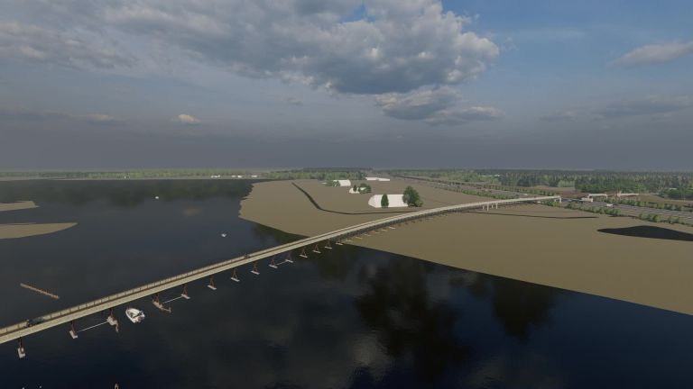

Construction starts in Netherlands on longest cycling bridge in Europe | World news | The Guardian

[Netherlands](https://www.theguardian.com/world/netherlands)

# Construction starts in Netherlands on longest cycling bridge in Europe

The 800-metre Blauwe Loper will only be accessible to cyclists, pedestrians – and bats

[Daniel Boffey](https://www.theguardian.com/profile/daniel-boffey) in Brussels
Wed 4 Mar 2020 18.01 GMTLast modified on Wed 4 Mar 2020 18.28 GMT

- 
- 
- 

Shares

339

1080p geselecteerd als afspeelkwaliteitvolume is gedemptvolume is 80%Video speelt afVideo speelt af

*!*

*!*

%3b'%3e%3cg stroke='none' stroke-width='1' fill-rule='evenodd' data-evernote-id='105' class='js-evernote-checked'%3e%3cg transform='translate(-18.000000%2c -11.000000)' data-evernote-id='106' class='js-evernote-checked'%3e%3cpolygon points='18 11 27 17 18 23' data-evernote-id='107' class='js-evernote-checked'%3e%3c/polygon%3e%3c/g%3e%3c/g%3e%3c/svg%3e)  %3b'%3e%3cg stroke='none' stroke-width='1' fill-rule='evenodd' data-evernote-id='109' class='js-evernote-checked'%3e%3cg transform='translate(-72.000000%2c -11.000000)' data-evernote-id='110' class='js-evernote-checked'%3e%3cpath d='M77%2c13.4172662 C77.9081882%2c13.4172662 78.7465031%2c13.6330914 79.5149701%2c14.0647482 C80.2734569%2c14.4868127 80.8722533%2c15.0575504 81.3113772%2c15.7769784 C81.7704614%2c16.5251836 82%2c17.3309309 82%2c18.1942446 C82%2c19.0575583 81.7704614%2c19.8633056 81.3113772%2c20.6115108 C80.8722533%2c21.3405312 80.2734569%2c21.916065 79.5149701%2c22.3381295 C78.7365231%2c22.7793787 77.8982081%2c23 77%2c23 C76.1017919%2c23 75.2634769%2c22.7793787 74.4850299%2c22.3381295 C73.7265431%2c21.916065 73.1277467%2c21.3405312 72.6886228%2c20.6115108 C72.2295386%2c19.8633056 72%2c19.0575583 72%2c18.1942446 L73.257485%2c18.1942446 C73.257485%2c18.846526 73.424649%2c19.4484385 73.758982%2c20 C74.093315%2c20.5515615 74.5474023%2c20.988008 75.1212575%2c21.3093525 C75.6951126%2c21.6306971 76.3213539%2c21.7913669 77%2c21.7913669 C77.6786461%2c21.7913669 78.3048874%2c21.6306971 78.8787425%2c21.3093525 C79.4525977%2c20.988008 79.906685%2c20.5515615 80.241018%2c20 C80.575351%2c19.4484385 80.742515%2c18.846526 80.742515%2c18.1942446 C80.742515%2c17.5419632 80.575351%2c16.9400507 80.241018%2c16.3884892 C79.906685%2c15.8369277 79.4525977%2c15.4004812 78.8787425%2c15.0791367 C78.3048874%2c14.7577922 77.6786461%2c14.5971223 77%2c14.5971223 L77%2c17.0143885 L73.8712575%2c14.0071942 L77%2c11 L77%2c13.4172662 Z' id='Replay' data-evernote-id='111' class='js-evernote-checked'%3e%3c/path%3e%3c/g%3e%3c/g%3e%3c/svg%3e)  %3b'%3e%3cg stroke='none' stroke-width='1' fill-rule='evenodd' data-evernote-id='113' class='js-evernote-checked'%3e%3cg transform='translate(-43.000000%2c -11.000000)' data-evernote-id='114' class='js-evernote-checked'%3e%3cpath d='M50.6185567%2c11 L54.0412371%2c11 L54.0412371%2c23 L50.6185567%2c23 L50.6185567%2c11 Z M43.7319588%2c23 L43.7319588%2c11 L47.1546392%2c11 L47.1546392%2c23 L43.7319588%2c23 Z' id='Pause' data-evernote-id='115' class='js-evernote-checked'%3e%3c/path%3e%3c/g%3e%3c/g%3e%3c/svg%3e)

%3b display: none%3b'%3e%3cg stroke='none' stroke-width='1' fill-rule='evenodd' transform='translate(-298.000000%2c -11.000000)' data-evernote-id='177' class='js-evernote-checked'%3e%3cpath d='M302.249825%2c11 L304.372148%2c13.1287133 L303.850676%2c13.651465 L302.618158%2c12.415143 L302.618158%2c19.0001 L301.881493%2c19.0001 L301.881493%2c12.4145717 L300.648975%2c13.651465 L300.128072%2c13.1287133 L302.249825%2c11 Z M303.623471%2c14.4678781 L306.500106%2c14.4678781 L306.500106%2c23 L298%2c23 L298%2c14.4678781 L300.862403%2c14.4678781 L300.862403%2c15.2638895 L298.793024%2c15.2638895 L298.793024%2c22.2039886 L305.706513%2c22.2039886 L305.706513%2c15.2638895 L303.623471%2c15.2638895 L303.623471%2c14.4678781 Z' data-evernote-id='178' class='js-evernote-checked'%3e%3c/path%3e%3c/g%3e%3c/svg%3e)  %3b'%3e%3cg stroke='none' stroke-width='1' fill-rule='evenodd' data-evernote-id='180' class='js-evernote-checked'%3e%3cg transform='translate(-277.000000%2c -11.000000)' data-evernote-id='181' class='js-evernote-checked'%3e%3cpath d='M284.207932%2c14.3864478 C284.09341%2c14.3864478 283.940715%2c14.3942548 283.940715%2c14.4014613 L283.940715%2c11 L277%2c16.4402963 L283.940715%2c21.8097288 L283.940715%2c18.0809729 C283.940715%2c18.0269242 284.487296%2c17.9896907 284.808304%2c17.9896907 C287.657467%2c17.9896907 290.020781%2c20.1065959 290.775584%2c23 C290.905144%2c22.4643179 291%2c21.9070163 291%2c21.3304974 C291%2c17.4954459 287.969221%2c14.3864478 284.207932%2c14.3864478' transform='translate(284.000000%2c 17.000000) scale(-1%2c 1) translate(-284.000000%2c -17.000000) ' data-evernote-id='182' class='js-evernote-checked'%3e%3c/path%3e%3c/g%3e%3c/g%3e%3c/svg%3e)  %3b display: none%3b'%3e%3cg stroke='none' stroke-width='1' fill-rule='evenodd' transform='translate(-259.000000%2c -11.000000)' data-evernote-id='184' class='js-evernote-checked'%3e%3cpath d='M268.036145%2c19.4722892 C268.34458%2c19.4722892 268.633734%2c19.5518064 268.903614%2c19.7108434 C269.173495%2c19.8698803 269.387951%2c20.084336 269.546988%2c20.3542169 C269.706025%2c20.6240977 269.785542%2c20.9132515 269.785542%2c21.2216867 C269.785542%2c21.530122 269.706025%2c21.8216854 269.546988%2c22.0963855 C269.387951%2c22.3710857 269.173495%2c22.5903606 268.903614%2c22.7542169 C268.633734%2c22.9180731 268.34458%2c23 268.036145%2c23 C267.727709%2c23 267.438556%2c22.9180731 267.168675%2c22.7542169 C266.898794%2c22.5903606 266.684338%2c22.3710857 266.525301%2c22.0963855 C266.366264%2c21.8216854 266.286747%2c21.530122 266.286747%2c21.2216867 C266.286747%2c21.0289147 266.296385%2c20.8987955 266.315663%2c20.8313253 L262.050602%2c18.3445783 C261.703613%2c18.6626522 261.289159%2c18.8216867 260.807229%2c18.8216867 C260.489155%2c18.8216867 260.190363%2c18.7397599 259.910843%2c18.5759036 C259.631324%2c18.4120474 259.409639%2c18.1903628 259.245783%2c17.9108434 C259.081927%2c17.6313239 259%2c17.3325317 259%2c17.0144578 C259%2c16.696384 259.081927%2c16.3975918 259.245783%2c16.1180723 C259.409639%2c15.8385528 259.631324%2c15.6168683 259.910843%2c15.453012 C260.190363%2c15.2891558 260.489155%2c15.2072289 260.807229%2c15.2072289 C261.289159%2c15.2072289 261.703613%2c15.3662635 262.050602%2c15.6843373 L266.286747%2c13.226506 C266.248193%2c13.033734 266.228916%2c12.8939763 266.228916%2c12.8072289 C266.228916%2c12.489155 266.310843%2c12.1903628 266.474699%2c11.9108434 C266.638555%2c11.6313239 266.86024%2c11.4096394 267.139759%2c11.2457831 C267.419279%2c11.0819269 267.718071%2c11 268.036145%2c11 C268.354218%2c11 268.653011%2c11.0819269 268.93253%2c11.2457831 C269.21205%2c11.4096394 269.433734%2c11.6313239 269.59759%2c11.9108434 C269.761447%2c12.1903628 269.843373%2c12.489155 269.843373%2c12.8072289 C269.843373%2c13.1253028 269.761447%2c13.424095 269.59759%2c13.7036145 C269.433734%2c13.9831339 269.21205%2c14.2048185 268.93253%2c14.3686747 C268.653011%2c14.5325309 268.354218%2c14.6144578 268.036145%2c14.6144578 C267.592769%2c14.6144578 267.178315%2c14.4457848 266.792771%2c14.1084337 L262.556627%2c16.5951807 C262.595181%2c16.7686756 262.614458%2c16.903614 262.614458%2c17 C262.614458%2c17.096386 262.595181%2c17.2409629 262.556627%2c17.4337349 L266.850602%2c19.9204819 C267.197592%2c19.6216853 267.592769%2c19.4722892 268.036145%2c19.4722892 Z' data-evernote-id='185' class='js-evernote-checked'%3e%3c/path%3e%3c/g%3e%3c/svg%3e)

%3b display: none%3b' data-evernote-id='208' class='js-evernote-checked'%3e%3cg stroke='none' stroke-width='1' fill-rule='evenodd' data-evernote-id='209' class='js-evernote-checked'%3e%3cg transform='translate(-447.000000%2c -16.000000)' fill-rule='nonzero' data-evernote-id='210' class='js-evernote-checked'%3e%3cpath d='M448.5%2c28 L453%2c22 L457.5%2c28 L448.5%2c28 Z M450.460848%2c23.5522036 L449.092927%2c25 L447%2c25 L447%2c16 L459%2c16 L459%2c25 L456.907073%2c25 L455.539152%2c23.5522036 L457.5684%2c23.5522036 L457.5684%2c17.4309958 L448.4316%2c17.4309958 L448.4316%2c23.5522036 L450.460848%2c23.5522036 Z' id='AirPlay' data-evernote-id='211' class='js-evernote-checked'%3e%3c/path%3e%3c/g%3e%3c/g%3e%3c/svg%3e)  %3b' data-evernote-id='212' class='js-evernote-checked'%3e%3cg stroke='none' stroke-width='1' fill-rule='evenodd' data-evernote-id='213' class='js-evernote-checked'%3e%3cg transform='translate(-477.000000%2c -16.000000)' fill-rule='nonzero' data-evernote-id='214' class='js-evernote-checked'%3e%3cpath d='M477%2c26 L477%2c28 L479.045455%2c28 C479.045455%2c26.8933333 478.131818%2c26 477%2c26 Z M477%2c23.3333333 L477%2c24.6666667 C478.881818%2c24.6666667 480.409091%2c26.16 480.409091%2c28 L481.772727%2c28 C481.772727%2c25.42 479.638636%2c23.3333333 477%2c23.3333333 Z M477%2c20.6666667 L477%2c22 C480.388636%2c22 483.136364%2c24.6866667 483.136364%2c28 L484.5%2c28 C484.5%2c23.9466667 481.138636%2c20.6666667 477%2c20.6666667 Z M490.636364%2c16 L478.363636%2c16 C477.613636%2c16 477%2c16.6 477%2c17.3333333 L477%2c19.3333333 L478.363636%2c19.3333333 L478.363636%2c17.3333333 L490.636364%2c17.3333333 L490.636364%2c26.6666667 L485.863636%2c26.6666667 L485.863636%2c28 L490.636364%2c28 C491.386364%2c28 492%2c27.4 492%2c26.6666667 L492%2c17.3333333 C492%2c16.6 491.386364%2c16 490.636364%2c16 Z' id='Chromecast' data-evernote-id='215' class='js-evernote-checked'%3e%3c/path%3e%3c/g%3e%3c/g%3e%3c/svg%3e)

%3b'%3e%3cg stroke='none' stroke-width='1' fill-rule='evenodd' data-evernote-id='219' class='js-evernote-checked'%3e%3cg transform='translate(-465.000000%2c -11.000000)' data-evernote-id='220' class='js-evernote-checked'%3e%3cpath d='M472.731959%2c11 L477%2c11 L477%2c15.2680412 L475.309278%2c15.2680412 L475.309278%2c12.6907216 L472.731959%2c12.6907216 L472.731959%2c11 Z M475.309278%2c21.3092784 L475.309278%2c18.7319588 L477%2c18.7319588 L477%2c23 L472.731959%2c23 L472.731959%2c21.3092784 L475.309278%2c21.3092784 Z M465%2c15.2680412 L465%2c11 L469.268041%2c11 L469.268041%2c12.6907216 L466.690722%2c12.6907216 L466.690722%2c15.2680412 L465%2c15.2680412 Z M466.690722%2c18.7319588 L466.690722%2c21.3092784 L469.268041%2c21.3092784 L469.268041%2c23 L465%2c23 L465%2c18.7319588 L466.690722%2c18.7319588 Z' id='fullscreen---material' data-evernote-id='221' class='js-evernote-checked'%3e%3c/path%3e%3c/g%3e%3c/g%3e%3c/svg%3e)

# Related Videos

[<]()
1. [Oosterstraat legt de rode loper uit voor het Forum  00:02]()
2. [Nieuwe wijk Blauwe Stad begint vorm te krijgen  01:01]()
3. [Paniek over blauwe vaten in Nijetrijne  01:03]()
4. [Samenvatting LDODK - Blauw-Wit  04:47]()
5. [Samenvatting LDODK - Blauw-Wit  03:10]()
6. [Zo ziet de nieuwe klimhal in Leeuwarden eruit  02:06]()
7. [De Nijmeegse Vierdaagse - Reactie van lopers (2)  00:54]()
8. [De Nijmeegse Vierdaagse - Reactie van lopers (1)  00:30]()
9. [Militairen zwemmen in het Blauwe meer  00:24]()
10. [Militairen klimmen uit het Blauwe Meer  00:51]()
11. [Ruw Interview RUG 4Mijl loper  01:15]()
12. [Première Spaak  00:17]()
13. [Hoe leuk zijn de nieuwe glijbanen van de Blauwe Golf?  02:23]()
14. [Telegrammen op de Nijmeegse Vierdaagse  00:19]()
15. [DvhN deelt gelukstelegrammen uit op de vierdaagse  01:00]()
 [>]()

none

Construction has started in the [Netherlands](https://www.theguardian.com/world/netherlands) on what will be Europe’s longest bridge for cyclists and pedestrians – stretching over a lake, canal, motorway and nature reserve – to connect a new village to its closest town.

The so-called “Blue carpet bridge”, or Blauwe Loper, will be 800 metres long, but there are plans to ultimately extend it to 1km in length. The first phase is scheduled for completion by next Christmas.

The €6.5m (£5.6m) bridge, which rises at a comfortable 2.5% gradient at its steepest, will connect Winschoten, in Groningen province, with Blauwestad, a new village being built on reclaimed land.

The bridge will only be accessible to cyclists and pedestrians – and bats. Its LED lighting has been designed to assist the creatures in finding their way from the nearby nature reserve to the Oldambtmeer lake. The bridge will also be painted in “bat-friendly” green.

Advertisement

The bridge has been designed to last for at least 80 years despite being made from wood, which was sourced from Gabon in Central Africa.

Reinder Lanting, a project leader told the Dagblad van het Noorden, a regional daily: “We think we can stretch it to a kilometre by connecting it to the main street in Blauwestad.

“This bridge is not going to rot. That is because it is technically well designed. The wood is not pressed together but has a sort of venting system.”

Local dignitaries joined an event to watch the laying of the concrete foundations of the bridge. The Dutch cycling embassy, a government-funded agency, tweeted: “The province of Groningen has started construction on the €6.5m, 800-metre Blauwe Loper … When completed in late 2020, it will be the longest bicycle bridge in [Europe](https://www.theguardian.com/world/europe-news).”

The Blauwe Loper will surpass Europe’s current longest cyclists’ bridge, which is in Sölvesborg, southern Sweden. The 756-metre bridge extends across Sölvesborg Bay.

Both bridges are dwarfed, however, by the [Xiamen Bicycle Skyway](https://www.businessinsider.com/china-elevated-cycleway-xiamen-2017-7?r=US&IR=T) in China. Developed by the Danish design firm Dissing + Weitling, it is 7.6km long. The firm’s previous projects include the [Bicycle Snake](https://www.archdaily.com/522669/bicycle-snake-dissing-weitling-architecture) — a 230-metre bridge in Copenhagen.

##  We won’t let Brexit come between us…

…and we hope you feel the same. Britain may be leaving the EU, but the Guardian remains committed to Europe, doubling down on the ideas and interests that we share. We are intensifying our reporting on every aspect of the continent – its people, its politics, institutions, economy and culture. Our independent, fact-based reporting will inform Britain about Europe, Europe about Britain, and Europeans about each other. These are testing times, and crises are not limited by national boundaries. But then neither are we. We will stay with you, delivering quality journalism so we can all make up our minds based on fact, not fiction.

More people than ever in the UK and across Europe, like you, are reading and supporting the Guardian’s independent, investigative journalism. And unlike many news organisations, we made the choice to keep our reporting open for all, regardless of where they live or what they can afford to pay.

The Guardian will engage with the most critical issues of our time – from the escalating climate emergency to widespread inequality to the influence of big tech on our lives. At a time when factual information is a necessity, we believe that each of us, around the world, deserves access to accurate reporting with integrity at its heart.

Our editorial independence means we set our own agenda and voice our own opinions. Guardian journalism is free from commercial and political bias and not influenced by billionaire owners or shareholders. This means we can give a voice to those less heard, explore where others turn away, and rigorously challenge those in power.

We hope you will consider supporting us today. We need your support to keep delivering quality journalism that’s open and independent. Every reader contribution, however big or small, is so valuable. **Support the Guardian from as little as £1 – and it only takes a minute. Thank you.**

 [Support The Guardian](https://support.theguardian.com/uk/contribute?REFPVID=k7elcc9niba4ih3b5mbn&INTCMP=gdnwb_copts_memco_2020-03-02_Europe_Moment_UK_Epic__no_article_count_borders_first_para&acquisitionData=%7B%22source%22%3A%22GUARDIAN_WEB%22%2C%22componentId%22%3A%22gdnwb_copts_memco_2020-03-02_Europe_Moment_UK_Epic__no_article_count_borders_first_para%22%2C%22componentType%22%3A%22ACQUISITIONS_EPIC%22%2C%22campaignCode%22%3A%22gdnwb_copts_memco_2020-03-02_Europe_Moment_UK_Epic__no_article_count_borders_first_para%22%2C%22abTest%22%3A%7B%22name%22%3A%222020-03-02_Europe_Moment_UK_Epic__no_article_count%22%2C%22variant%22%3A%22borders_first_para%22%7D%2C%22referrerPageviewId%22%3A%22k7elcc9niba4ih3b5mbn%22%2C%22referrerUrl%22%3A%22https%3A%2F%2Fwww.theguardian.com%2Fworld%2F2020%2Fmar%2F04%2Fconstruction-starts-in-netherlands-on-longest-cycling-bridge-in-europe%22%7D)

 

Topics

- [Netherlands/](https://www.theguardian.com/world/netherlands)
- [Cycling/](https://www.theguardian.com/lifeandstyle/cycling)
- [Architecture/](https://www.theguardian.com/artanddesign/architecture)
- [Europe/](https://www.theguardian.com/world/europe-news)
- [news/](https://www.theguardian.com/tone/news)
- 
- 
- 
- [Share on LinkedIn](http://www.linkedin.com/shareArticle?mini=true&title=Construction%20starts%20in%20Netherlands%20on%20longest%20cycling%20bridge%20in%20Europe&url=https%3A%2F%2Fwww.theguardian.com%2Fworld%2F2020%2Fmar%2F04%2Fconstruction-starts-in-netherlands-on-longest-cycling-bridge-in-europe)
- [Share on Pinterest](http://www.pinterest.com/pin/find/?url=https%3A%2F%2Fwww.theguardian.com%2Fworld%2F2020%2Fmar%2F04%2Fconstruction-starts-in-netherlands-on-longest-cycling-bridge-in-europe)
- [Reuse this content](https://syndication.theguardian.com/automation/?url=https%3A%2F%2Fwww.theguardian.com%2Fworld%2F2020%2Fmar%2F04%2Fconstruction-starts-in-netherlands-on-longest-cycling-bridge-in-europe&type=article&internalpagecode=7165619)