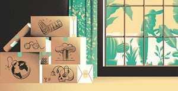
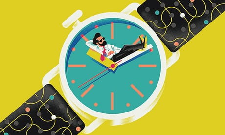
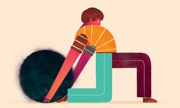
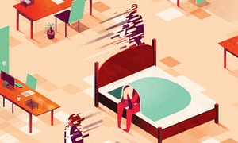

Consumed by anxiety? Give it a day or two

‘We tend to live in a constant state of anxious anticipation of the next potentially stressful event.’ Illustration: Michele Marconi for the Guardian

[Health & wellbeing](https://www.theguardian.com/lifeandstyle/health-and-wellbeing)

[This column will change your life](https://www.theguardian.com/lifeandstyle/series/thiscolumnwillchangeyourlife)

# Consumed by anxiety? Give it a day or two

The problems you’re experiencing today seem fraught and important, but that’s mainly because you’re so narrowly focused on the present

- [(L)](https://www.facebook.com/dialog/share?app_id=180444840287&href=https%3A%2F%2Fwww.theguardian.com%2Flifeandstyle%2F2017%2Fsep%2F15%2Fconsumed-by-anxiety-give-it-day-or-two%3FCMP%3Dshare_btn_fb)
- [(L)](https://twitter.com/intent/tweet?text=Consumed%20by%20anxiety%3F%20Give%20it%20a%20day%20or%20two&url=https%3A%2F%2Fwww.theguardian.com%2Flifeandstyle%2F2017%2Fsep%2F15%2Fconsumed-by-anxiety-give-it-day-or-two%3FCMP%3Dshare_btn_tw)
- [(L)](https://www.theguardian.com/lifeandstyle/2017/sep/15/consumed-by-anxiety-give-it-day-or-two?utm_source=pocket&utm_medium=email&utm_campaign=pockethitsmailto:?subject=Consumed%20by%20anxiety%3F%20Give%20it%20a%20day%20or%20two&body=https%3A%2F%2Fwww.theguardian.com%2Flifeandstyle%2F2017%2Fsep%2F15%2Fconsumed-by-anxiety-give-it-day-or-two%3FCMP%3Dshare_btn_link)

-

### Shares

2,111

[ ###   Comments   225](https://www.theguardian.com/lifeandstyle/2017/sep/15/consumed-by-anxiety-give-it-day-or-two?utm_source=pocket&utm_medium=email&utm_campaign=pockethits#comments)

[Oliver Burkeman](https://www.theguardian.com/profile/oliverburkeman)
[@oliverburkeman](https://twitter.com/oliverburkeman)

Friday 15 September 2017 15.00 BSTLast modified on Sunday 17 September 2017 05.32 BST

The next time you’re consumed by anxiety – which, given the headlines, is probably this minute – you might borrow a tip from the philosopher Massimo Pigliucci, author of the excellent new book [How To Be A Stoic](https://www.guardianbookshop.com/how-to-be-a-stoic.html). In [a recent podcast](http://meaningoflife.tv/videos/38900), Pigliucci described how he used Google Street View and Google Earth to create a slideshow that starts with an image of his own home, then zooms out, out and out, until it shows the whole planet. He consults it when feeling overwrought. You couldn’t hope for a more vivid illustration of the Stoic [“dichotomy of control”](http://www.traditionalstoicism.com/2016/04/19/dichotomy-of-control/), which urges us to restrict our attempts to change things to those actually in our power, instead of making ourselves miserable railing against those that aren’t. (See also the [“serenity prayer”](http://www.beliefnet.com/prayers/protestant/addiction/serenity-prayer.aspx), popularised by Alcoholics Anonymous.) You are – not to be rude – a tiny part of the cosmos. That doesn’t make you powerless. But it does mean you’re almost certainly stressing about things that will, without doubt, remain [majestically unaffected by your stress](http://www.oliverburkeman.com/books).

If you ask me, such perspective shifts are even more powerful when applied to time. The problems you’re experiencing today seem uniquely fraught and important, but that’s mainly because you’re so narrowly focused on the present. This is, of course, the reasoning behind the old suggestion to ask yourself if your worries will matter on your deathbed, or in a decade, or even next week: they probably won’t. But you can do better than “probably”, as [the psychology blogger David Cain points out](http://www.raptitude.com/2013/10/6-helpful-reminders-for-the-overwhelmed-person/), by turning your gaze backwards rather than forwards. Because it’s an undeniable fact that every single problem you’ve ever had is currently solved, with the exception of today’s small handful. “Every heart-twisting crisis, every fearsome responsibility, every breakdown of confidence or hope, everything I ever thought I couldn’t handle” – all sorted. “Every single disaster has inevitably given up its emotional hold, except that thin leading edge of the two or three things that are really bothering you right now.”

 

#   [Let’s hear it for the four-hour working day]()

Read more

 [(L)](https://www.theguardian.com/lifeandstyle/2017/aug/11/oliver-burkeman-four-hour-working-day)

We tend to live, it has often been observed, in a constant state of anxious anticipation of the next potentially stressful event. But the usual Buddhism-tinged solution – to be “present in the moment” instead – is notoriously hard to put into practice. It’s easier to look back at *previous* forthcoming events, and ask if your anxiety proved justified. You could try the exercise I recently undertook, following [Cain’s line of thinking](http://www.raptitude.com/2017/08/look-backwards/), which I trust the Stoics would have endorsed: every morning, make a brief note of what feels like your biggest problem. As the list accumulates, you can start looking back at earlier entries. Guess how many months it took for my former worries to seem laughably overblown? Five days: that’s how many months. Most of what troubles us turns out to be tolerable, or even wonderful, or just never happens at all. Next time you worry that something’s going to ruin your life, it’s worth remembering that if you’d ever been right about that before, even once, your life would presently be ruined.

[oliver.burkeman@theguardian.com](https://www.theguardian.com/lifeandstyle/2017/sep/15/consumed-by-anxiety-give-it-day-or-two?utm_source=pocket&utm_medium=email&utm_campaign=pockethitsmailto:oliver.burkeman@theguardian.com)

##  Since you’re here …

… we have a small favour to ask. More people are reading the Guardian than ever but advertising revenues across the media are falling fast. And unlike many news organisations, we haven’t put up a paywall – we want to keep our journalism as open as we can. So you can see why we need to ask for your help. The Guardian’s independent, investigative journalism takes a lot of time, money and hard work to produce. But we do it because we believe our perspective matters – because it might well be your perspective, too.

>  I appreciate there not being a paywall: it is more democratic for the media to be available for all and not a commodity to be purchased by a few. I’m happy to make a contribution so others with less means still have access to information. >  Thomasine F-R. >

If everyone who reads our reporting, who likes it, helps to support it, our future would be much more secure.

 [Become a supporter](https://membership.theguardian.com/supporter?REFPVID=j7z9x34ejec2zaql9c1d&INTCMP=gdnwb_copts_memco_kr1_epic_ask_four_earning_control&acquisitionData=%7B%22source%22%3A%22GUARDIAN_WEB%22%2C%22componentId%22%3A%22gdnwb_copts_memco_kr1_epic_ask_four_earning_control%22%2C%22componentType%22%3A%22ACQUISITIONS_EPIC%22%2C%22referrerPageviewId%22%3A%22j7z9x34ejec2zaql9c1d%22%2C%22campaignCode%22%3A%22gdnwb_copts_memco_kr1_epic_ask_four_earning_control%22%2C%22abTest%22%3A%7B%22name%22%3A%22ContributionsEpicAskFourEarning%22%2C%22variant%22%3A%22control%22%7D%7D)

 [Make a contribution](https://contribute.theguardian.com/?REFPVID=j7z9x34ejec2zaql9c1d&INTCMP=gdnwb_copts_memco_kr1_epic_ask_four_earning_control&acquisitionData=%7B%22source%22%3A%22GUARDIAN_WEB%22%2C%22componentId%22%3A%22gdnwb_copts_memco_kr1_epic_ask_four_earning_control%22%2C%22componentType%22%3A%22ACQUISITIONS_EPIC%22%2C%22referrerPageviewId%22%3A%22j7z9x34ejec2zaql9c1d%22%2C%22campaignCode%22%3A%22gdnwb_copts_memco_kr1_epic_ask_four_earning_control%22%2C%22abTest%22%3A%7B%22name%22%3A%22ContributionsEpicAskFourEarning%22%2C%22variant%22%3A%22control%22%7D%7D)

Topics

- [Health & wellbeing/](https://www.theguardian.com/lifeandstyle/health-and-wellbeing)
- [This column will change your life/](https://www.theguardian.com/lifeandstyle/series/thiscolumnwillchangeyourlife)
- [features/](https://www.theguardian.com/tone/features)
- [(L)](https://www.facebook.com/dialog/share?app_id=180444840287&href=https%3A%2F%2Fwww.theguardian.com%2Flifeandstyle%2F2017%2Fsep%2F15%2Fconsumed-by-anxiety-give-it-day-or-two%3FCMP%3Dshare_btn_fb)
- [(L)](https://twitter.com/intent/tweet?text=Consumed%20by%20anxiety%3F%20Give%20it%20a%20day%20or%20two&url=https%3A%2F%2Fwww.theguardian.com%2Flifeandstyle%2F2017%2Fsep%2F15%2Fconsumed-by-anxiety-give-it-day-or-two%3FCMP%3Dshare_btn_tw)
- [(L)](https://www.theguardian.com/lifeandstyle/2017/sep/15/consumed-by-anxiety-give-it-day-or-two?utm_source=pocket&utm_medium=email&utm_campaign=pockethitsmailto:?subject=Consumed%20by%20anxiety%3F%20Give%20it%20a%20day%20or%20two&body=https%3A%2F%2Fwww.theguardian.com%2Flifeandstyle%2F2017%2Fsep%2F15%2Fconsumed-by-anxiety-give-it-day-or-two%3FCMP%3Dshare_btn_link)
- [Share on LinkedIn](http://www.linkedin.com/shareArticle?mini=true&title=Consumed%20by%20anxiety%3F%20Give%20it%20a%20day%20or%20two&url=https%3A%2F%2Fwww.theguardian.com%2Flifeandstyle%2F2017%2Fsep%2F15%2Fconsumed-by-anxiety-give-it-day-or-two)
- [Share on Pinterest](http://www.pinterest.com/pin/find/?url=https%3A%2F%2Fwww.theguardian.com%2Flifeandstyle%2F2017%2Fsep%2F15%2Fconsumed-by-anxiety-give-it-day-or-two)
- [Share on Google+](https://plus.google.com/share?url=https%3A%2F%2Fwww.theguardian.com%2Flifeandstyle%2F2017%2Fsep%2F15%2Fconsumed-by-anxiety-give-it-day-or-two%3FCMP%3Dshare_btn_gp&amp;hl=en-GB&amp;wwc=1)
- [Share on WhatsApp](https://www.theguardian.com/lifeandstyle/2017/sep/15/consumed-by-anxiety-give-it-day-or-two?utm_source=pocket&utm_medium=email&utm_campaign=pockethitswhatsapp://send?text=%22Consumed%20by%20anxiety%3F%20Give%20it%20a%20day%20or%20two%22%20https%3A%2F%2Fwww.theguardian.com%2Flifeandstyle%2F2017%2Fsep%2F15%2Fconsumed-by-anxiety-give-it-day-or-two%3FCMP%3Dshare_btn_wa)
- [Share on Messenger](https://www.theguardian.com/lifeandstyle/2017/sep/15/consumed-by-anxiety-give-it-day-or-two?utm_source=pocket&utm_medium=email&utm_campaign=pockethitsfb-messenger://share?link=https%3A%2F%2Fwww.theguardian.com%2Flifeandstyle%2F2017%2Fsep%2F15%2Fconsumed-by-anxiety-give-it-day-or-two%3FCMP%3Dshare_btn_me&app_id=180444840287)

 Paid content

#   [Arthritis: the nation’s joint problem](https://adclick.g.doubleclick.net/pcs/click?xai=AKAOjssfar6LlJ82LeUzVpp9WqD_Ecg2HJ5bT6qFcerzc_zDlL8qum2mLth-rb3Y_2k7TvbchI73js5A1AMquseH5R7SyiuplfJkGCZe86ZCZDdLMp3VGZKoTjhj_uNRyq17ixfx1xEZM80RtGJqP59_QWXTcMKjR4JmfOJs5KeJEkA7oEQ_8WCNlX8Jl4Ct5hQRhRY4b8URCIOWOKNzrq-2cjhonA73xU9h1U1Z4YE-TO0q39QJ2cWDknjqv70_B2q1aueYUD0rcziHDFJGkacR&sig=Cg0ArKJSzKMxZ0dzY7wAEAE&urlfix=1&adurl=https://theguardian.com/nations-joint-problem/nations-joint-problem)

 [  Guardian Labs](https://adclick.g.doubleclick.net/pcs/click?xai=AKAOjssfar6LlJ82LeUzVpp9WqD_Ecg2HJ5bT6qFcerzc_zDlL8qum2mLth-rb3Y_2k7TvbchI73js5A1AMquseH5R7SyiuplfJkGCZe86ZCZDdLMp3VGZKoTjhj_uNRyq17ixfx1xEZM80RtGJqP59_QWXTcMKjR4JmfOJs5KeJEkA7oEQ_8WCNlX8Jl4Ct5hQRhRY4b8URCIOWOKNzrq-2cjhonA73xU9h1U1Z4YE-TO0q39QJ2cWDknjqv70_B2q1aueYUD0rcziHDFJGkacR&sig=Cg0ArKJSzKMxZ0dzY7wAEAE&urlfix=1&adurl=https://www.theguardian.com/guardian-labs)

 [ ##  How arthritis is an 'invisible' condition – and where to find support                  ](https://adclick.g.doubleclick.net/pcs/click?xai=AKAOjssfar6LlJ82LeUzVpp9WqD_Ecg2HJ5bT6qFcerzc_zDlL8qum2mLth-rb3Y_2k7TvbchI73js5A1AMquseH5R7SyiuplfJkGCZe86ZCZDdLMp3VGZKoTjhj_uNRyq17ixfx1xEZM80RtGJqP59_QWXTcMKjR4JmfOJs5KeJEkA7oEQ_8WCNlX8Jl4Ct5hQRhRY4b8URCIOWOKNzrq-2cjhonA73xU9h1U1Z4YE-TO0q39QJ2cWDknjqv70_B2q1aueYUD0rcziHDFJGkacR&sig=Cg0ArKJSzKMxZ0dzY7wAEAE&urlfix=1&adurl=https://www.theguardian.com/nations-joint-problem/2017/sep/21/how-arthritis-is-an-invisible-condition-and-where-to-find-support)  [ ##  The pain of arthritis: 'It’s like a black cloud that’s always above us'                  ](https://adclick.g.doubleclick.net/pcs/click?xai=AKAOjssfar6LlJ82LeUzVpp9WqD_Ecg2HJ5bT6qFcerzc_zDlL8qum2mLth-rb3Y_2k7TvbchI73js5A1AMquseH5R7SyiuplfJkGCZe86ZCZDdLMp3VGZKoTjhj_uNRyq17ixfx1xEZM80RtGJqP59_QWXTcMKjR4JmfOJs5KeJEkA7oEQ_8WCNlX8Jl4Ct5hQRhRY4b8URCIOWOKNzrq-2cjhonA73xU9h1U1Z4YE-TO0q39QJ2cWDknjqv70_B2q1aueYUD0rcziHDFJGkacR&sig=Cg0ArKJSzKMxZ0dzY7wAEAE&urlfix=1&adurl=https://www.theguardian.com/nations-joint-problem/2017/sep/15/the-pain-of-arthritis-its-like-a-black-cloud-thats-always-above-us)  [ ##  Arthritis in the workplace: 'Everyone benefits from me remaining in work'                  ](https://adclick.g.doubleclick.net/pcs/click?xai=AKAOjssfar6LlJ82LeUzVpp9WqD_Ecg2HJ5bT6qFcerzc_zDlL8qum2mLth-rb3Y_2k7TvbchI73js5A1AMquseH5R7SyiuplfJkGCZe86ZCZDdLMp3VGZKoTjhj_uNRyq17ixfx1xEZM80RtGJqP59_QWXTcMKjR4JmfOJs5KeJEkA7oEQ_8WCNlX8Jl4Ct5hQRhRY4b8URCIOWOKNzrq-2cjhonA73xU9h1U1Z4YE-TO0q39QJ2cWDknjqv70_B2q1aueYUD0rcziHDFJGkacR&sig=Cg0ArKJSzKMxZ0dzY7wAEAE&urlfix=1&adurl=https://www.theguardian.com/nations-joint-problem/2017/sep/08/arthritis-in-the-workplace-everyone-benefits-from-me-remaining-in-work)  [ ##  Arthritis, anxiety and pain: 'My family never gave up on me'                  ](https://adclick.g.doubleclick.net/pcs/click?xai=AKAOjssfar6LlJ82LeUzVpp9WqD_Ecg2HJ5bT6qFcerzc_zDlL8qum2mLth-rb3Y_2k7TvbchI73js5A1AMquseH5R7SyiuplfJkGCZe86ZCZDdLMp3VGZKoTjhj_uNRyq17ixfx1xEZM80RtGJqP59_QWXTcMKjR4JmfOJs5KeJEkA7oEQ_8WCNlX8Jl4Ct5hQRhRY4b8URCIOWOKNzrq-2cjhonA73xU9h1U1Z4YE-TO0q39QJ2cWDknjqv70_B2q1aueYUD0rcziHDFJGkacR&sig=Cg0ArKJSzKMxZ0dzY7wAEAE&urlfix=1&adurl=https://www.theguardian.com/nations-joint-problem/2017/sep/01/arthritis-anxiety-and-pain-my-family-never-gave-up-on-me)

Paid for by 

 [This column will change your life](https://www.theguardian.com/lifeandstyle/series/thiscolumnwillchangeyourlife)

Oliver Burkeman investigates routes to mental wellbeing

-

## [  Do we really need therapy?](https://www.theguardian.com/lifeandstyle/2017/sep/22/self-help-better-than-therapy)

 6d

 [Do we really need therapy?](https://www.theguardian.com/lifeandstyle/2017/sep/22/self-help-better-than-therapy)

-

## [  Sleep: how much do you really get?](https://www.theguardian.com/lifeandstyle/2017/sep/08/sleep-how-much-do-you-really-get-oliver-burkeman)

 8 Sep 2017

 [Sleep: how much do you really get?](https://www.theguardian.com/lifeandstyle/2017/sep/08/sleep-how-much-do-you-really-get-oliver-burkeman)

-

## [  Don’t treat love or leisure like a job](https://www.theguardian.com/lifeandstyle/2017/sep/01/dont-treat-love-leisure-like-job)

 1 Sep 2017

 [Don’t treat love or leisure like a job](https://www.theguardian.com/lifeandstyle/2017/sep/01/dont-treat-love-leisure-like-job)

-

## [  Slob versus neatnik: it’s time to come clean](https://www.theguardian.com/lifeandstyle/2017/aug/25/slob-v-neatnik-house-clean-or-dirty-oliver-burkeman)

 25 Aug 2017

 [Slob versus neatnik: it’s time to come clean](https://www.theguardian.com/lifeandstyle/2017/aug/25/slob-v-neatnik-house-clean-or-dirty-oliver-burkeman)

## comments (225)

[Sign in](https://profile.theguardian.com/signin?INTCMP=DOTCOM_COMMENTS_SIGNIN) or [create your Guardian account](https://profile.theguardian.com/register?INTCMP=DOTCOM_COMMENTS_REG) to join the discussion.

 1  [2](https://www.theguardian.com/discussion/p/755kv?page=2)  [3](https://www.theguardian.com/discussion/p/755kv?page=3)  [4](https://www.theguardian.com/discussion/p/755kv?page=4)

- 

   [deltajones](https://profile.theguardian.com/user/id/3535208)

 [15 Sep 2017 15:25](https://discussion.theguardian.com/comment-permalink/105275232)

   66  67

I do make up a tiny part of the cosmos but a huge part of my own life and my anxieties tend to be over my own deficiencies so I'm not sure this will help. Then when I do worry about world problems they seem to be the responsibility of people who are even more useless than me, which is also not reassuring. As a result of reading this I'm now also looking forward to lying on my deathbed worrying about whether I'm dying properly or if I'm just letting everyone down with my trite last words.

       Share

 [    Facebook](https://www.facebook.com/dialog/share?app_id=180444840287&href=https%3A%2F%2Fdiscussion.theguardian.com%2Fcomment-permalink%2F105275232&quote=deltajones%20commented%3A%20%22I%20do%20make%20up%20a%20tiny%20part%20of%20the%20cosmos%20but%20a%20huge%20part%20of%20my%20own%20life%20and%20my%20anxieties%20tend%20to%20be%20over%20my%20own%20deficiencies%20so%20I%27m%20not%20sure%20this%20will%20help.%20Then%20when%20I%20do%20worry%20about%20world%20problems%20they%20seem%20to%20be%20the%20responsibility%20of%20people%20who%20are%20even%20more%20useless%20than%20me%2C%20which%20is%20also%20not%20reassuring.%20As%20a%20result%20of%20reading%20this%20I%27m%20now%20also%20looking%20forward%20to%20lying%20on%20my%20deathbed%20worrying%20about%20whether%20I%27m%20dying%20properly%20or%20if%20I%27m%20just%20letting%20everyone%20down%20with%20my%20trite%20last%20words.%22)  [    Twitter](https://twitter.com/intent/tweet?text=%22I%20do%20make%20up%20a%20tiny%20part%20of%20the%20cosmos%20but%20a%20huge%20part%20of%20my%20own%20life%20and%20my%20anxieties%20tend%20to%20be%20over%20my%20own%20d...%22&url=https%3A%2F%2Fdiscussion.theguardian.com%2Fcomment-permalink%2F105275232)

 [Report](https://www.theguardian.com/discussion/report-abuse/105275232)

    -

   [BewilderedMark](https://profile.theguardian.com/user/id/4807914)            [deltajones](https://www.theguardian.com/lifeandstyle/2017/sep/15/consumed-by-anxiety-give-it-day-or-two?utm_source=pocket&utm_medium=email&utm_campaign=pockethits#comment-105275232)

 [15 Sep 2017 15:55](https://discussion.theguardian.com/comment-permalink/105276547)

   138  139

>
> my trite last words.
>

You could always do what my grandmother did. She was given hours to live after a serious tumble down stairs when she was around 80. We gathered as a family at her bedside and she told some "home truths" about some of us that weren't very flattering - luckily I was only lamented for being single and childless at 22.

Then she made a full recovery and lived another 13 years.

       Share

 [    Facebook](https://www.facebook.com/dialog/share?app_id=180444840287&href=https%3A%2F%2Fdiscussion.theguardian.com%2Fcomment-permalink%2F105276547&quote=BewilderedMark%20commented%3A%20%22You%20could%20always%20do%20what%20my%20grandmother%20did.%20She%20was%20given%20hours%20to%20live%20after%20a%20serious%20tumble%20down%20stairs%20when%20she%20was%20around%2080.%20We%20gathered%20as%20a%20family%20at%20her%20bedside%20and%20she%20told%20some%20%22home%20truths%22%20about%20some%20of%20us%20that%20weren%27t%20very%20flattering%20-%20luckily%20I%20was%20only%20lamented%20for%20being%20single%20and%20childless%20at%2022.%20Then%20she%20made%20a%20full%20recovery%20and%20lived%20another%2013%20years.%22)  [    Twitter](https://twitter.com/intent/tweet?text=%22You%20could%20always%20do%20what%20my%20grandmother%20did.%20She%20was%20given%20hours%20to%20live%20after%20a%20serious%20tumble%20down%20stairs%20whe...%22&url=https%3A%2F%2Fdiscussion.theguardian.com%2Fcomment-permalink%2F105276547)

 [Report](https://www.theguardian.com/discussion/report-abuse/105276547)

    -

   [MikeHarold](https://profile.theguardian.com/user/id/12147194)            [BewilderedMark](https://www.theguardian.com/lifeandstyle/2017/sep/15/consumed-by-anxiety-give-it-day-or-two?utm_source=pocket&utm_medium=email&utm_campaign=pockethits#comment-105276547)

 [15 Sep 2017 17:12](https://discussion.theguardian.com/comment-permalink/105279634)

   19  20

on her own or did the family still visit? But I suppose there is an advantage in getting your trite last words in first ;)

       Share

 [    Facebook](https://www.facebook.com/dialog/share?app_id=180444840287&href=https%3A%2F%2Fdiscussion.theguardian.com%2Fcomment-permalink%2F105279634&quote=MikeHarold%20commented%3A%20%22on%20her%20own%20or%20did%20the%20family%20still%20visit%3F%20But%20I%20suppose%20there%20is%20an%20advantage%20in%20getting%20your%20trite%20last%20words%20in%20first%20%3B%29%22)  [    Twitter](https://twitter.com/intent/tweet?text=%22on%20her%20own%20or%20did%20the%20family%20still%20visit%3F%20But%20I%20suppose%20there%20is%20an%20advantage%20in%20getting%20your%20trite%20last%20words%20...%22&url=https%3A%2F%2Fdiscussion.theguardian.com%2Fcomment-permalink%2F105279634)

 [Report](https://www.theguardian.com/discussion/report-abuse/105279634)

    -

-
   [BewilderedMark](https://profile.theguardian.com/user/id/4807914)

 [15 Sep 2017 15:31](https://discussion.theguardian.com/comment-permalink/105275449)

   35  36

>

> Next time you worry that something’s going to ruin your life, it’s worth remembering that if you’d ever been right about that before, even once, your life would presently be ruined.

>

There are degrees of ruination. And I could still be right about the earlier times if they ever find the bodies.

       Share

 [    Facebook](https://www.facebook.com/dialog/share?app_id=180444840287&href=https%3A%2F%2Fdiscussion.theguardian.com%2Fcomment-permalink%2F105275449&quote=BewilderedMark%20commented%3A%20%22There%20are%20degrees%20of%20ruination.%20And%20I%20could%20still%20be%20right%20about%20the%20earlier%20times%20if%20they%20ever%20find%20the%20bodies.%22)  [    Twitter](https://twitter.com/intent/tweet?text=%22There%20are%20degrees%20of%20ruination.%20And%20I%20could%20still%20be%20right%20about%20the%20earlier%20times%20if%20they%20ever%20find%20the%20bodies.%22&url=https%3A%2F%2Fdiscussion.theguardian.com%2Fcomment-permalink%2F105275449)

 [Report](https://www.theguardian.com/discussion/report-abuse/105275449)

    - 

   [Alex Alex](https://profile.theguardian.com/user/id/15378064)            [BewilderedMark](https://www.theguardian.com/lifeandstyle/2017/sep/15/consumed-by-anxiety-give-it-day-or-two?utm_source=pocket&utm_medium=email&utm_campaign=pockethits#comment-105275449)

 [15 Sep 2017 15:57](https://discussion.theguardian.com/comment-permalink/105276608)

   9  10

I agree with your point.(degrees of ruination)
I also think that Mr.Burkerman started making his case,but ended up ruining it.
I suggest a book which is small outside but quite empowering inside.
It 's called "The Positive Power of Negative Thinking ", by Julie Norem.

       Share

 [    Facebook](https://www.facebook.com/dialog/share?app_id=180444840287&href=https%3A%2F%2Fdiscussion.theguardian.com%2Fcomment-permalink%2F105276608&quote=Alex%20Alex%20commented%3A%20%22I%20agree%20with%20your%20point.%28degrees%20of%20ruination%29I%20also%20think%20that%20Mr.Burkerman%20started%20making%20his%20case%2Cbut%20ended%20up%20ruining%20it.I%20suggest%20a%20book%20which%20is%20small%20outside%20but%20quite%20empowering%20inside.%20It%20%27s%20called%20%22The%20Positive%20Power%20of%20Negative%20Thinking%20%22%2C%20by%20Julie%20Norem.%22)  [    Twitter](https://twitter.com/intent/tweet?text=%22I%20agree%20with%20your%20point.(degrees%20of%20ruination)I%20also%20think%20that%20Mr.Burkerman%20started%20making%20his%20case%2Cbut%20ended%20...%22&url=https%3A%2F%2Fdiscussion.theguardian.com%2Fcomment-permalink%2F105276608)

 [Report](https://www.theguardian.com/discussion/report-abuse/105276608)

    -

   [BewilderedMark](https://profile.theguardian.com/user/id/4807914)            [Alex Alex](https://www.theguardian.com/lifeandstyle/2017/sep/15/consumed-by-anxiety-give-it-day-or-two?utm_source=pocket&utm_medium=email&utm_campaign=pockethits#comment-105276608)

 [15 Sep 2017 16:08](https://discussion.theguardian.com/comment-permalink/105277081)

   33  34

>
> It 's called "The Positive Power of Negative Thinking ", by Julie Norem.
>

Well that's bound to be crap.

       Share

 [    Facebook](https://www.facebook.com/dialog/share?app_id=180444840287&href=https%3A%2F%2Fdiscussion.theguardian.com%2Fcomment-permalink%2F105277081&quote=BewilderedMark%20commented%3A%20%22Well%20that%27s%20bound%20to%20be%20crap.%22)  [    Twitter](https://twitter.com/intent/tweet?text=%22Well%20that%27s%20bound%20to%20be%20crap.%22&url=https%3A%2F%2Fdiscussion.theguardian.com%2Fcomment-permalink%2F105277081)

 [Report](https://www.theguardian.com/discussion/report-abuse/105277081)

    -

## [most viewed](https://www.theguardian.com/most-read/lifeandstyle)