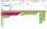
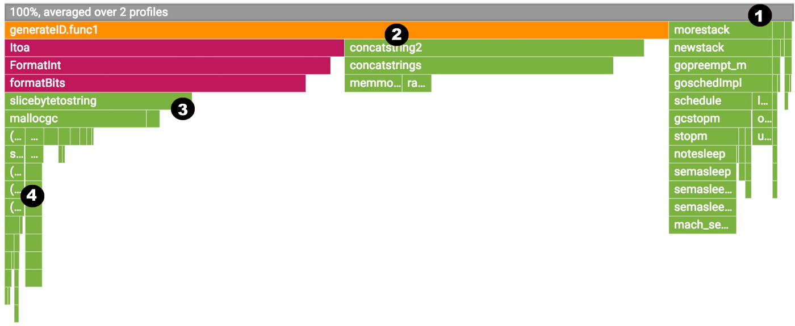
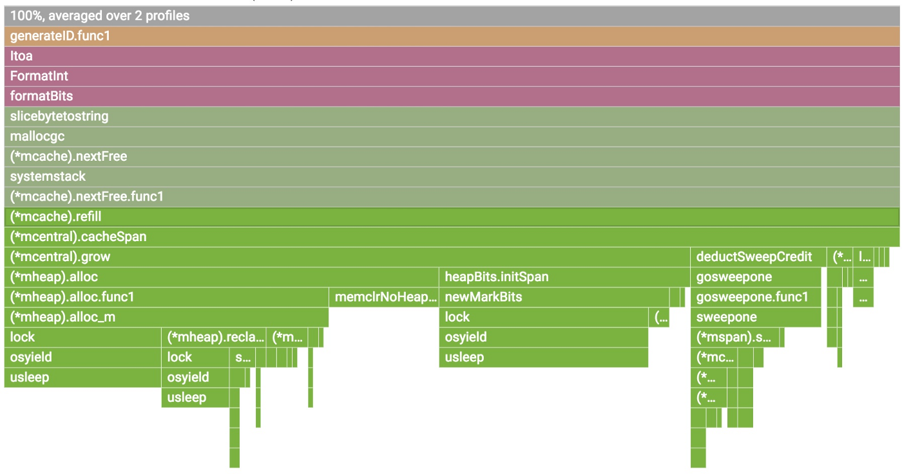
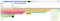
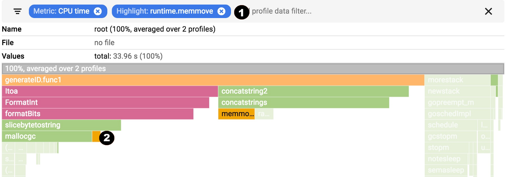

Continuous Profiling of Go programs - Google Cloud - Community - Medium

# Continuous Profiling of Go programs

[Jaana Dogan](https://medium.com/@rakyll?source=post_page-----96d4416af77b----------------------)

[Apr 25, 2018](https://medium.com/google-cloud/continuous-profiling-of-go-programs-96d4416af77b?source=post_page-----96d4416af77b----------------------) · 4 min read

One of the most interesting parts of Google is our fleet-wide continuous profiling service. We can see who is accountable for CPU and memory usage, we can continuously monitor our production services for contention and blocking profiles, and we can generate analysis and reports and easily can tell what are some highly impactful optimization projects we can work on.

I briefly worked on [Google Cloud Profiler](https://cloud.google.com/profiler/), our new product that is filling the cloud-wide profiling gap for Cloud users. Note that you DON’T need to run your code on Google Cloud Platform in order to use it. Actually, I use it at development time on a daily basis now. It also supports Java and Node.js.

## Profiling in production

pprof is safe to use in production. We target an additional 5% overhead for CPU and heap allocation profiling. The collection is happening for 10 seconds for every minute from a single instance. If you have multiple replicas of a Kubernetes pod, we make sure we do amortized collection. For example, if you have 10 replicas of a pod, the overhead will be 0.5%. This makes it possible for users to keep the profiling always on.

We currently support CPU, heap, mutex and thread profiles for Go programs.

## Why?

Before explaining how you can use the profiler in production, it would be helpful to explain why you would ever want to profile in production. Some very common cases are:

- Debug performance problems only visible in production.
- Understand the CPU usage to reduce billing.
- Understand where the contention cumulates and optimize.
- Understand the impact of new releases, e.g. seeing the difference between canary and production.
- Enrich your distributed traces by [correlating](https://rakyll.org/profiler-labels/) them with profiling samples to understand the root cause of latency.

## Enabling

Stackdriver Profiler doesn’t work with the *net/http/pprof* handlers and require you to install and configure a one-line agent in your program.

go get [cloud.google.com/go/profiler](http://cloud.google.com/go/profiler)
And in your main function, start the profiler:
if err := profiler.Start(profiler.Config{
Service: "indexing-service",
ServiceVersion: "1.0",
ProjectID: "bamboo-project-606", // optional on GCP
}); err != nil {
log.Fatalf("Cannot start the profiler: %v", err)
}

Once you start running your program, the profiler package will report the profilers for 10 seconds for every minute.

## Visualization

As soon as profiles are reported to the backend, you will start seeing a flamegraph at https://console.cloud.google.com/profiler. You can filter by tags and change the time span, as well as break down by service name and version. The data will be around up to 30 days.

You can choose one of the available profiles; break down by service, zone and version. You can move in the flame and filter by tags.

## Reading the flame

Flame graph visualization is explained by [Brendan Gregg](http://www.brendangregg.com/flamegraphs.html) very comprehensively. Stackdriver Profiler adds a little bit of its own flavor.

We will examine a CPU profile but all also applies to the other profiles.

1. The top-most x-axis represents the entire program. Each box on the flame represents a frame on the call path. The width of the box is proportional to the CPU time spent to execute that function.

2. Boxes are sorted from left to right, left being the most expensive call path.

3. Frames from the same package have the same color. All runtime functions are represented with green in this case.

4. You can click on any box to expand the execution tree further.

You can hover on any box to see detailed information for any frame.

## Filtering

You can show, hide and highlight by symbol name. These are extremely useful if you specifically want to understand the cost of a particular call or package.

1. Choose your filter. You can combine multiple filters. In this case, we are highlighting runtime.memmove.

2. The flame is going to filter the frames with the filter and visualize the filtered boxes. In this case, it is highlighting all runtime.memmove boxes.