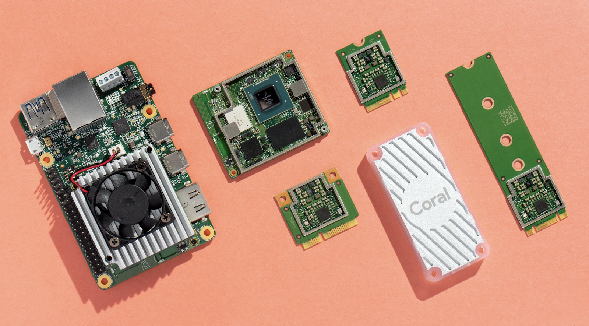
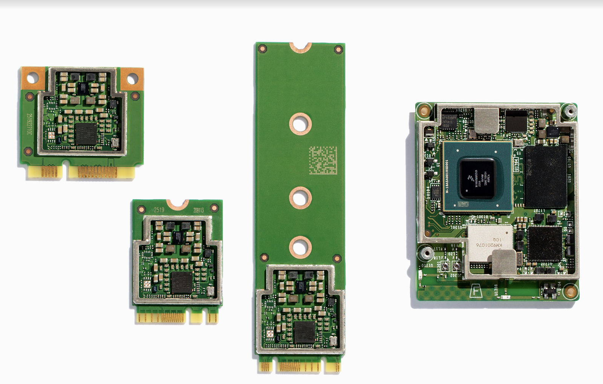

Coral moves out of beta

## [Coral moves out of beta](https://developers.googleblog.com/2019/10/coral-moves-out-of-beta.html)

Tuesday, October 22, 2019
 *Posted by Vikram Tank (Product Manager), Coral Team*

Last March, we launched Coral beta from Google Research. Coral helps engineers and researchers bring new models out of the data center and onto devices, running TensorFlow models efficiently at the edge. Coral is also at the core of new applications of local AI in industries ranging from agriculture to healthcare to manufacturing. We've received a lot of feedback over the past six months and used it to improve our platform. Today we’re thrilled to graduate Coral out of beta, into a wider, global release.

Coral is already delivering impact across industries, and several of our partners are including Coral in products that require fast ML inferencing at the edge.

In healthcare, [Care.ai is using Coral](https://coral.ai/news/care-ai/) to build a device that enables hospitals and care centers to respond quickly to falls, prevent bed sores, improve patient care, and reduce costs. [Virgo SVS is also using Coral](https://coral.ai/news/virgo-svs/) as the basis of a polyp detection system that helps doctors improve the accuracy of endoscopies.

In a very different use case, [Olea Edge employs Coral](https://coral.ai/news/olea-edge/) to help municipal water utilities accurately measure the amount of water used by their commercial customers. Their [Meter Health Analytics](https://www.oleanetworks.com/solutions/meter-health-analytics) solution uses local AI to reduce waste and predict equipment failure in industrial water meters.

Nexcom is using Coral to build gateways with local AI and provide a platform for next-gen, AI-enabled IoT applications. By moving AI processing to the gateway, existing sensor networks can stay in service without the need to add AI processing to each node.

### **From prototype to production**

Coral’s Dev Board is designed as an integrated prototyping solution for new product development. Under the heatsink is the detachable Coral SoM, which combines Google’s Edge TPU with the NXP IMX8M SoC, Wi-Fi and Bluetooth connectivity, memory, and storage. We’re happy to announce that you can now purchase the [Coral SoM](https://coral.ai/products/som) standalone. We’ve also created a [baseboard developer guide](https://coral.ai/docs/som/datasheet/#baseboard-developer-guide) to help integrate it into your own production design.

Our Coral USB Accelerator allows users with existing system designs to add local AI inferencing via USB 2/3. For production workloads, we now offer three new Accelerators that feature the Edge TPU and connect via PCIe interfaces: [Mini PCIe](https://coral.withgoogle.com/products/pcie-accelerator), [M.2 A+E key](https://coral.withgoogle.com/products/m2-accelerator-ae), and [M.2 B+M key](https://coral.withgoogle.com/products/m2-accelerator-bm). You can easily integrate these Accelerators into new products or upgrade existing devices that have an available PCIe slot.

The new Coral products are available globally and for sale at [Mouser](https://www.mouser.com/manufacturer/google-coral/); for large volume sales, [contact our sales team](https://docs.google.com/forms/d/e/1FAIpQLSf0t-I4y0AS4Ymph9SRY3Gr9ppZsgE_LZ2A8_vMa7K_Do4ZQA/viewform). By the end of 2019, we'll continue to expand our distribution of the Coral Dev Board and SoM into new markets including: Taiwan, Australia, New Zealand, India, Thailand, Singapore, Oman, Ghana and the Philippines.

### **Better resources**

We’ve also revamped the Coral site with better organization for our [docs and tools](https://coral.ai.com/docs/), a set of [success stories](https://coral.ai/news/), and [industry focused pages](https://coral.ai/industries/). All of it can be found at a new, easier to remember URL [Coral.ai](http://coral.ai/).

To help you get the most out of the hardware, we’re also publishing a [new set of examples](https://coral.withgoogle.com/examples/). The included models and code can provide solutions to the most common on-device ML problems, such as image classification, object detection, pose estimation, and keyword spotting.

For those looking for a more in-depth application—and a way to solve the eternal problem of squirrels plundering your bird feeder—the [Smart Bird Feeder](https://coral.withgoogle.com/projects/bird-feeder/) project shows you how to perform classification with a custom dataset on the Coral Dev board.

Finally, we’ll soon release a new version of the Mendel OS that updates the system to Debian Buster, and we're hard at work on more improvements to the Edge TPU compiler and runtime that will improve the model development workflow.

The official launch of Coral is, of course, just the beginning, and we’ll continue to evolve the platform. Please keep sending us feedback at [coral-support@google.com](https://developers.googleblog.com/2019/10/coral-moves-out-of-beta.htmlmailto:coral-support@google.com).

Labels:[AI](https://developers.googleblog.com/search/label/AI) , [Artificial Intelligence](https://developers.googleblog.com/search/label/Artificial%20Intelligence) , [AutoML](https://developers.googleblog.com/search/label/AutoML) , [Coral](https://developers.googleblog.com/search/label/Coral) , [Edge TPU](https://developers.googleblog.com/search/label/Edge%20TPU) , [Google](https://developers.googleblog.com/search/label/Google) , [IoT](https://developers.googleblog.com/search/label/IoT) , [machine learning](https://developers.googleblog.com/search/label/machine%20learning) , [TensorFlow](https://developers.googleblog.com/search/label/TensorFlow)

#### No comments :

#### Post a Comment

[(L)](https://www.blogger.com/comment-iframe.g?blogID=596098824972435195&postID=3568045679150253582&blogspotRpcToken=1428716)

Comment as:

[Sign out](https://developers.googleblog.com/logout?d=https://www.blogger.com/logout-redirect.g?blogID%3D596098824972435195%26postID%3D3568045679150253582)

Notify me