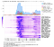
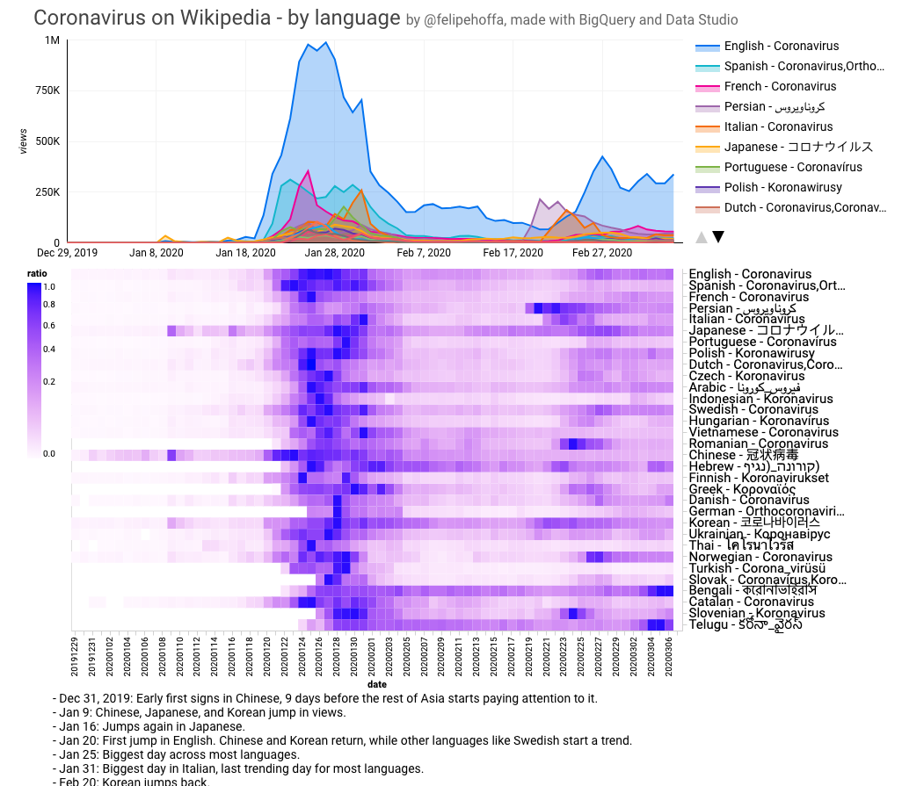
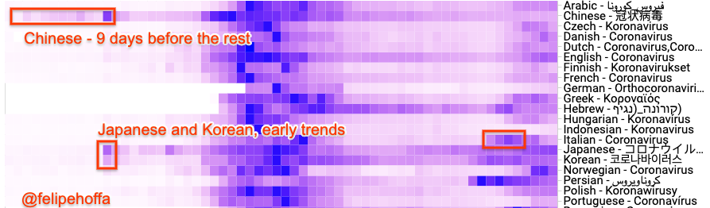
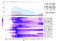
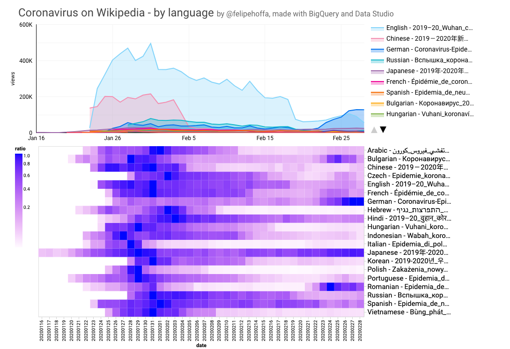
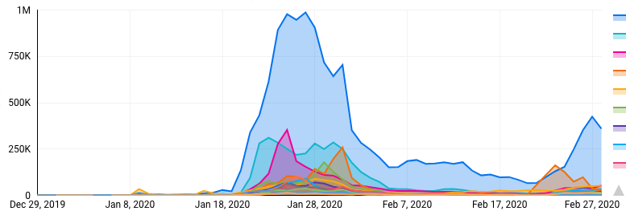
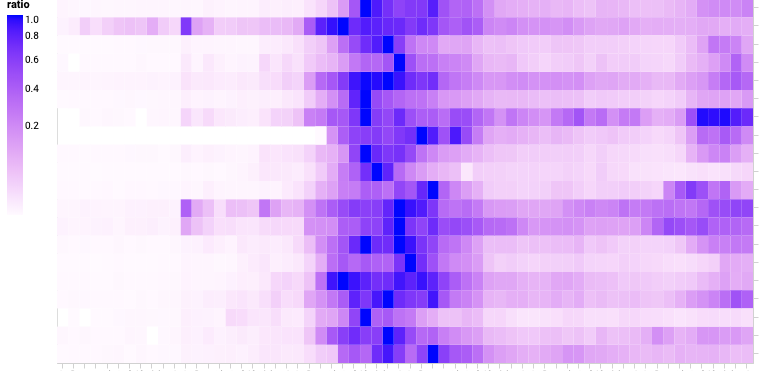
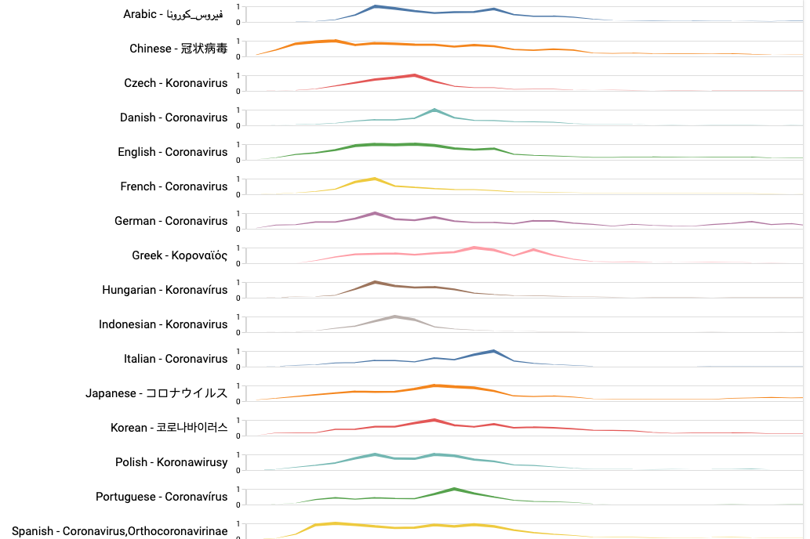
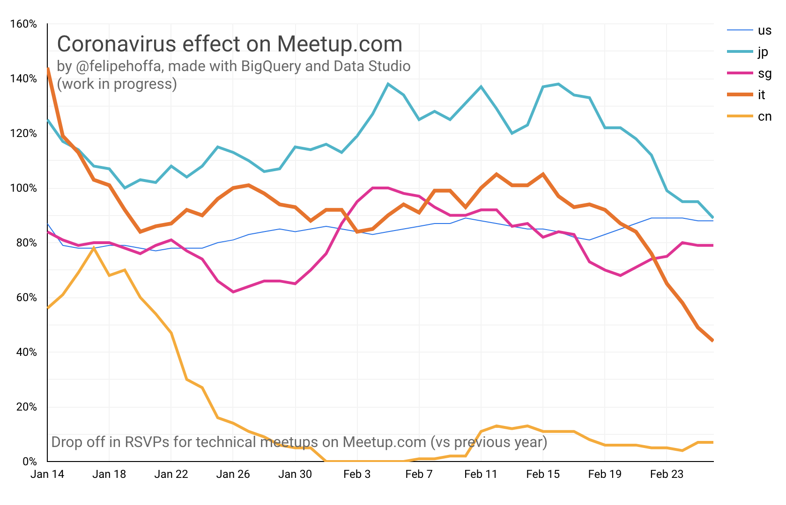

Coronavirus in Wikipedia by language — visualized - Towards Data Science

Wikipedia pageviews by language for Coronavirus

# Coronavirus in Wikipedia by language — visualized

## Check the Wikipedia pageviews for language to get deeper look into how the news has spread and trended around the world. First we’ll extract the data out of terabytes of Wikipedia pageviews to create a new dashboard. Stay until the end to see the secret for extremely configurable visualizations in Data Studio with Vega and Vega Lite.

[Felipe Hoffa](https://towardsdatascience.com/@hoffa?source=post_page-----1b3e6562040d----------------------)

[Feb 29](https://towardsdatascience.com/coronavirus-interest-inwikipedia-by-language-1b3e6562040d?source=post_page-----1b3e6562040d----------------------) · 4 min read

Some interesting trends you can quickly visualize:

- Coronavirus in Chinese started trending 9 days earlier than any other language.
- Japanese and Korean were the first languages to catch-up.
- Italian, Norwegian, and Persian had the strongest rebounds these last few days.

Some interesting trends you can quickly visualize

On the opening chart you can find the views per language for each language Coronavirus page. The next chart shows the same for the [Wikipedia article following the current news](https://en.wikipedia.org/wiki/2019%E2%80%9320_coronavirus_outbreak):

Wikipedia views per language for the topic [2019–20_Wuhan_coronavirus_outbreak](https://en.wikipedia.org/wiki/2019%E2%80%9320_coronavirus_outbreak). See opening picture for [Coronavirus](https://en.wikipedia.org/wiki/Coronavirus) instead.

Get all the Coronavirus page titles out of Wikidata in BigQuery:
CREATE OR REPLACE TABLE `temp.wikidata_coronavirus`
AS
SELECT REGEXP_EXTRACT(site, '(..)wiki') language, encoded value
FROM `bigquery-public-data.wikipedia.wikidata`, UNNEST(sitelinks)
WHERE numeric_id = 290805
AND LENGTH(site)=6# 1.9 sec elapsed, 9.7 MB processed
Fix for Spanish, Dutch, Slovak renaming of pages:
INSERT INTO `temp.wikidata_coronavirus`
SELECT 'es', 'Orthocoronavirinae';
INSERT INTO `temp.wikidata_coronavirus`
SELECT 'nl', 'Coronavirussen'
INSERT INTO `temp.wikidata_coronavirus`
SELECT 'sk', 'Coronavírus'
Create a table for Data Studio:
CREATE OR REPLACE TABLE
`fh-bigquery.wikipedia_extracts.wikipedia_corona_views`
AS
WITH sumviews AS (

SELECT * REPLACE(IF(date=CURRENT_DATE(), views*24/hours_day, views) AS views) # last fractional day correction

FROM (

SELECT SUM(views) views, SUBSTR(a.wiki, 0, 2) wiki, title, DATE(datehour) date, COUNT(DISTINCT datehour) hours_day

FROM `bigquery-public-data.wikipedia.pageviews_20*` a
JOIN `temp.wikidata_coronavirus` b
ON ((a.title=b.value AND SUBSTR(a.wiki, 0, 2)=b.language))
WHERE DATE(a.datehour) > '2019-12-28'
GROUP BY wiki, title, date
)
)
SELECT *, (FORMAT('%s - %s', language, title)) wiki_title
FROM (
SELECT *

REPLACE((SELECT STRING_AGG(DISTINCT title ORDER BY title) FROM sumviews WHERE a.wiki=wiki) AS title)

, (views)/ (MAX(views) OVER(PARTITION BY wiki)) ratio

, (SELECT language FROM `wikipedia_extracts.wiki_langs` WHERE a.wiki=wiki ) language

FROM sumviews a

WHERE wiki IN (SELECT wiki FROM (SELECT wiki, SUM(views) FROM sumviews GROUP BY 1 ORDER BY 2 DESC LIMIT 28 ))

)# (13.4 sec elapsed, 411.3 GB processed)

**Optimization to-do**: Those 411.3 GB can be optimized heavily — especially if in an ongoing basis I just load the incremental hour of views, instead of re-processing the whole thing.

# Play with the results

The full table with the results only has 1,239 rows, and you can find it on BigQuery with:

SELECT *
FROM `fh-bigquery.wikipedia_extracts.wikipedia_corona_views`

[*New to BigQuery? Get started here*](https://towardsdatascience.com/bigquery-without-a-credit-card-discover-learn-and-share-199e08d4a064).

# Data Studio

You’ve seen charts like this:

A typical Data Studio area chart
But how cool is this?

A Vega Lite visualization connected to BigQuery in Data Studio

The secret: We can now use [Vega & Vega lite charts in Data Studio](https://twitter.com/googleanalytics/status/1233170199211380736). So with this community visualization, I just needed to provide Vega lite a configuration:

{
"$schema":"https://vega.github.io/schema/vega-lite/v3.json",
"mark":"rect",
"config":{
"axisRight":{
"labelFontSize":15
}
},
"encoding":{
"y":{
"title":"",
"field":"$dimension0",
"type":"nominal",
"axis":{
"labelAlign":"left",
"orient":"right"
}
},
"x":{
"field":"$dimension1",
"type":"ordinal"
},
"color":{
"field":"$metric0",
"type":"quantitative",
"legend":{
"orient":"left"
},
"scale":{
"type":"sqrt",
"range":[
"#fffaff",
"blue"
]
}
}
}
}
A different attempt:

Playing with Vega Lite in Data Studio

# Want more?

Stay tuned for an interactive dashboard, and more updates. Please leave me your comments with any suggestions or corrections.

**Thanks**: [Denny Vrandečić](https://medium.com/u/ac7d3bcad193?source=post_page-----1b3e6562040d----------------------), for Wikidata and last minute corrections to this post. [Marc Cohen](https://medium.com/u/1f225b5f22b2?source=post_page-----1b3e6562040d----------------------) for building a reliable pipeline for Wikidata and Wikipedia data in BigQuery. More details soon.

## Coronavirus and Meetup RSVPs

Oh, I’m also looking at how Meetup RSVPs around the world have been affected. Check this one out:

Drop off in RSVPs for technical meetups on Meetup.com (vs previous year)

I’m Felipe Hoffa, a Developer Advocate for Google Cloud. Follow me on [@felipehoffa](https://twitter.com/felipehoffa), find my previous posts on [medium.com/@hoffa](https://medium.com/@hoffa), and all about BigQuery on [reddit.com/r/bigquery](https://reddit.com/r/bigquery).

[ ## BigQuery without a credit card: Discover, learn and share   ### If you ever had trouble signing up for BigQuery, worry no more — now it’s easier than ever to sign up and start…    #### towardsdatascience.com](https://towardsdatascience.com/bigquery-without-a-credit-card-discover-learn-and-share-199e08d4a064)

[ ## Inequality: How to draw a Lorenz curve with SQL, BigQuery, and Data Studio   ### The top 0.1% of all Wikipedia pages earn 25% of the pageviews. The bottom 99% only get 42% of all the views. And the…    #### towardsdatascience.com](https://towardsdatascience.com/inequality-how-to-draw-a-lorenz-curve-with-sql-bigquery-and-data-studio-c70824b0748d)

[ ## Interactive: The top 2019 Wikipedia pages   ### Wikimedia has published their list of most popular 2019 pages— but can we go deeper? Of course, here with BigQuery and…    #### towardsdatascience.com](https://towardsdatascience.com/interactive-the-top-2019-wikipedia-pages-d3b96335b6ae)

[ ## Optimizing BigQuery: Cluster your tables   ### BigQuery just announced the ability to cluster tables — which I’ll describe here. If you are looking for massive…    #### medium.com](https://medium.com/google-cloud/bigquery-optimized-cluster-your-tables-65e2f684594b)