Coronavirus: Why You Must Act Now - Tomas Pueyo - Medium

# Coronavirus: Why You Must Act Now

## Politicians, Community Leaders and Business Leaders: What Should You Do and When?

[Tomas Pueyo](https://medium.com/@tomaspueyo?source=post_page-----f4d3d9cd99ca----------------------)

[Mar 10](https://medium.com/@tomaspueyo/coronavirus-act-today-or-people-will-die-f4d3d9cd99ca?source=post_page-----f4d3d9cd99ca----------------------) · 22 min read

*Updated on 3/11/2020*

With everything that’s happening about the Coronavirus, it might be very hard to make a decision of what to do today. Should you wait for more information? Do something today? What?

Here’s what I’m going to cover in this article, with lots of charts, data and models with plenty of sources:

- How many cases of coronavirus will there be in your area?
- What will happen when these cases materialize?
- What should you do?
- When?

When you’re done reading the article, this is what you’ll take away:
The coronavirus is coming to you.
It’s coming at an exponential speed: gradually, and then suddenly.
It’s a matter of days. Maybe a week or two.
When it does, your healthcare system will be overwhelmed.
Your fellow citizens will be treated in the hallways.
Exhausted healthcare workers will break down. Some will die.
They will have to decide which patient gets the oxygen and which one dies.
The only way to prevent this is social distancing today. Not tomorrow. Today.
That means keeping as many people home as possible, starting now.

As a politician, community leader or business leader, you have the power and the responsibility to prevent this.

You might have fears today: What if I overreact? Will people laugh at me? Will they be angry at me? Will I look stupid? Won’t it be better to wait for others to take steps first? Will I hurt the economy too much?

But in 2–4 weeks, when the entire world is in lockdown, when the few precious days of social distancing you will have enabled will have saved lives, people won’t criticize you anymore: They will thank you for making the right decision.

Ok, let’s do this.

# 1. How Many Cases of Coronavirus Will There Be in Your Area?

## Country Growth

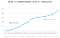

The total number of cases grew exponentially until China contained it. But then, it leaked outside, and now it’s a pandemic that nobody can stop.

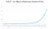
As of today, this is mostly due to Italy, Iran and South Korea:
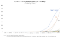

There are so many cases in South Korea, Italy and China that it’s hard to see the rest of the countries, but let’s zoom in on that corner at the bottom right.

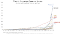

There are dozens of countries with exponential growth rates. As of today, most of them are Western.

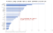

If you keep up with that type of growth rate for just a week, this is what you get:

If you want to understand what will happen, or how to prevent it, you need to look at the cases that have already gone through this: China, Eastern countries with SARS experience, and Italy.

# China

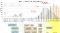

Source: Tomas Pueyo analysis over chart and data from the [Journal of the American Medical Association](https://jamanetwork.com/journals/jama/fullarticle/2762130)

This is one of the most important charts.

It shows in orange bars the daily official number of cases in the Hubei province: How many people were diagnosed that day.

The grey bars show the **true** daily coronavirus cases. Crucially, these weren’t know at the time. We can only figure them out looking backwards.

What this means is that the orange bars show you what authorities knew, and the grey ones what was really happening.

On January 21st, the number of new diagnosed cases (orange) is exploding: there are around 100 new cases. In reality, there were 1,500 new cases that day, growing exponentially. But the authorities didn’t know that. What they knew was that suddenly there were 100 new cases of this new illness.

Two days later, authorities shut down Wuhan. At that point, the number of diagnosed daily new cases was ~400. Note that number: they made a decision to close the city with just 400 new cases in a day. In reality, there were 2,500 new cases that day, but they didn’t know that.

The day after, another 15 cities in Hubei shut down.

Up until Jan 23rd, when Wuhan closes, you can look at the grey graph: it’s growing exponentially. True cases were exploding. As soon as Wuhan shuts down, cases slow down. On Jan 24th, when another 15 cities shut down, the number of true cases (again, grey) grinds to a halt. Two days later, the maximum number of true cases was reached, and it has gone down ever since.

Note that the orange (official) cases were still growing exponentially: For 12 more days, it looked like this thing was still exploding. But it wasn’t. It’s just that the cases were getting stronger symptoms and going to the doctor more, and the system to identify them was stronger.

This concept of official and true cases is important. Let’s keep it in mind for later.

The rest of regions in China were well coordinated by the central government, so they took immediate and drastic measures. This is the result:

Every flat line is a Chinese region with coronavirus cases. Each one had the potential to become exponential, but thanks to the measures happening just at the end of January, all of them stopped the virus before it could spread.

Meanwhile, South Korea, Italy and Iran had a full month to learn, but didn’t. They started the same exponential growth of Hubei and passed every Chinese region before the end of February.

## Eastern Countries

South Korea cases have exploded, but have you wondered why Japan, Taiwan, Singapore, Thailand or Hong Kong haven’t?

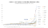

Taiwan didn’t even make it to this graph because it didn’t have the 50 cases threshold that I used.

All of them were hit by SARS in 2003, and all of them learned from it. They learned how viral and lethal it could be, so they knew to take it seriously. That’s why all of their graphs, despite starting to grow much earlier, still don’t look like exponentials.

So far, we have stories of coronavirus exploding, governments realizing the threat, and containing them. For the rest of countries, however, it’s a completely different story.

Before I jump to them, a note about South Korea: The country is probably an outlier. The coronavirus was contained for the first 30 cases. [Patient 31](https://graphics.reuters.com/CHINA-HEALTH-SOUTHKOREA-CLUSTERS/0100B5G33SB/index.html) was a super-spreader who passed it to thousands of other people. Because the virus spreads before people show symptoms, by the time the authorities realized the issue, the virus was out there. They’re now paying the consequences of that one instance. Their containment efforts show, however: Italy has already passed it in numbers of cases, and Iran will pass it tomorrow (3/10/2020).

## Washington State

You’ve already seen the growth in Western countries, and how bad forecasts of just one week look like. Now imagine that containment doesn’t happen like in Wuhan or in other Eastern countries, and you get a colossal epidemic.

Let’s look at a few cases, such as Washington State, the San Francisco Bay Area, Paris and Madrid.

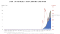

Washington State is the US’s Wuhan.The number of cases there is growing exponentially. It’s currently at 140.

But something interesting happened early on. The death rate was through the roof. At some point, the state had 3 cases and one death.

We know from other places that the death rate of the coronavirus is anything between 0.5% and 5% (more on that later). How could the death rate be 33%?

It turned out that the virus had been spreading undetected for weeks. It’s not like there were only 3 cases. It’s that authorities only knew about 3, and one of them was dead because the more serious the condition, the more likely somebody is to be tested.

This is a bit like the orange and grey bars in China: Here they only knew about the orange bars (official cases) and they looked good: just 3. But in reality, there were hundreds, maybe thousands of true cases.

This is an issue: You only know the official cases, not the true ones. But you need to know the true ones. How can you estimate the true ones? It turns out, there’s a couple of ways. And [I have a model for both](https://docs.google.com/spreadsheets/d/17YyCmjb2Z2QwMiRRwAb7W0vQoEAiL9Co0ARsl03dSlw/edit?usp=sharing), so you can play with the numbers too ([direct link to copy the model](https://docs.google.com/spreadsheets/u/1/d/17YyCmjb2Z2QwMiRRwAb7W0vQoEAiL9Co0ARsl03dSlw/copy?usp=sharing)).

First, through deaths. If you have deaths in your region, you can use that to guess the number of true current cases. We know approximately how long it takes for that person to go from catching the virus to dying on average ([17.3 days](https://github.com/midas-network/COVID-19/tree/master/parameter_estimates/2019_novel_coronavirus)). That means the person who died on 2/29 in Washington State probably got infected around 2/12.

Then, you know the mortality rate. For this scenario, I’m using 1% (we’ll discuss later the details). That means that, around 2/12, there were already around ~100 cases in the area (of which only one ended up in death 17.3 days later).

Now, use the average doubling time for the coronavirus (time it takes to double cases, on average). It’s [6.2](https://github.com/midas-network/COVID-19/tree/master/parameter_estimates/2019_novel_coronavirus). That means that, in the 17 days it took this person to die, the cases had to multiply by ~8 (=2^(17/6)). That means that, if you are not diagnosing all cases, one death today means 800 true cases today.

Washington state has today 22 deaths. With that quick calculation, you get ~16,000 true coronavirus cases today. *As many as the official cases in Italy and Iran combined.*

If we look into the detail, we realize that 19 of these deaths were from one cluster, which might not have spread the virus widely. So if we consider those 19 deaths as one, the total deaths in the state is four. Updating the model with that number, we still get ~3,000 cases today.

This approach from [Trevor Bedford](https://medium.com/u/685823cf116a?source=post_page-----f4d3d9cd99ca----------------------) looks at the viruses themselves and their mutations to assess the current case count.

The conclusion is that there are likely ~1,100 cases in Washington state right now.

None of these approaches are perfect, but they all point to the same message: We don’t know the number of true cases, but it’s much higher than the official one. It’s not in the hundreds. It’s in the thousands, maybe more.

**San Francisco Bay Area**

Until 3/8, the Bay Area didn’t have any death. That made it hard to know how many true cases there were. Officially, there were 86 cases. But the US is vastly undertesting because it doesn’t have enough kits. The country decided to create their own test kit, which turned out [not to work](https://www.propublica.org/article/cdc-coronavirus-covid-19-test).

These were the number of tests carried out in different countries by March 3rd:
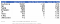

[Sources for each number here](https://docs.google.com/spreadsheets/d/17YyCmjb2Z2QwMiRRwAb7W0vQoEAiL9Co0ARsl03dSlw/edit#gid=508476959)

Turkey, with no cases of coronavirus, had 10 times the testing per inhabitant than the US. The situation is not much better today, with [~8,000 tests performed in the US](https://www.cdc.gov/coronavirus/2019-ncov/testing-in-us.html), which means [~4,000](https://www.nbcnews.com/health/health-news/u-s-has-tested-more-8-500-specimens-coronavirus-doesn-n1154156) people have been tested.

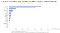

Here, you can just use a share of official cases to true cases. How to decide which one? For the Bay Area, they were testing everybody who had traveled or was in contact with a traveler, which means that they knew most of the travel-related cases, but none of the community spread cases. By having a sense of community spread vs. travel spread, you can know how many true cases there are.

I looked at that ratio for South Korea, which has great data. By the time they had 86 cases, the % of them from community spread was 86% (86 and 86% are a coincidence).

With that number, you can calculate the number of true cases. If the Bay Area has 86 cases today, it is likely that the true number is ~600.

## France and Paris

France claims 1,400 cases today and 30 deaths. Using the two methods above, you can have a range of cases: **between 24,000 and 140,000.**

> The true number of coronavirus cases in France today is likely to be between 24,000 and 140,000.

Let me repeat that: the number of true cases in France is likely to be between one and two orders or magnitude higher than it is officially reported.

Don’t believe me? Let’s look at the Wuhan graph again.
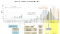

Source: Tomas Pueyo analysis over chart and data from the [Journal of the American Medical Association](https://jamanetwork.com/journals/jama/fullarticle/2762130)

If you stack up the orange bars until 1/22, you get [444 cases](https://github.com/CSSEGISandData/COVID-19/tree/master/csse_covid_19_data/csse_covid_19_time_series). Now add up all the grey bars. They add up to ~12,000 cases. So when Wuhan thought it had 444 cases, it had 27 times more. If France thinks it has 1,400 cases, it might well have tens of thousands

The same math applies to Paris. With ~30 cases inside the city, the true number of cases is likely to be in the hundreds, maybe thousands. With 300 cases in the Ile-de-France region, the total cases in the region might already exceed tens of thousands.

## Spain and Madrid

Spain has very [similar numbers](https://www.worldometers.info/coronavirus/) as France (1,200 cases vs. 1,400, and both have 30 deaths). That means the same rules are valid: Spain has probably upwards of 20k true cases already.

In the Comunidad de Madrid region, with 600 official cases and 17 deaths, the true number of cases is likely between 10,000 and 60,000.

If you read these data and tell yourself: “*Impossible, this can’t be true*”, just think this: With this number of cases, Wuhan was already in lockdown.

> With the number of cases in countries like the US, Spain, France, Iran, Germany, Japan or Switzerland, Wuhan was already in lockdown.

And if you’re telling yourself: “*Well, Hubei is just one region*”, let me remind you that it has nearly 60 million people, bigger than Spain and about the size of France.

# 2. What Will Happen When These Coronavirus Cases Materialize?

So the coronavirus is already here. It’s hidden, and it’s growing exponentially.

What will happen in our countries when it hits? It’s easy to know, because we already have several places where it’s happening. The best examples are Hubei and Italy.

## Fatality Rates

The World Health Organization (WHO) quotes 3.4% as the fatality rate (% people who contract the coronavirus and then die). This number is out of context so let me explain it.

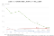

It really depends on the country and the moment: between 0.6% in South Korea and 4.4% in Iran. So what is it? We can use a trick to figure it out.

The two ways you can calculate the fatality rate is Deaths/Total Cases and Death/Closed Cases. The first one is likely to be an underestimate, because lots of open cases can still end up in death. The second is an overestimate, because it’s likely that deaths are closed quicker than recoveries.

What I did was look at how both evolve over time. Both of these numbers will converge to the same result once all cases are closed, so if you project past trends to the future, you can make a guess on what the final fatality rate will be.

This is what you see in the data. China’s fatality rate is now between 3.6% and 6.1%. If you project that in the future, it looks like it converges towards ~3.8%-4%. This is double the current estimate, and 30 times worse than the flu.

It is made up of two completely different realities though: Hubei and the rest of China.

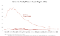

Hubei’s fatality rate will probably converge towards 4.8%. Meanwhile, for the rest of China, it will likely converge to ~0.9%

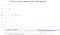

I also charted the numbers for Iran, Italy and South Korea, the only countries with enough deaths to make this somewhat relevant.

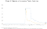
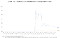
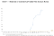

Iran’s and Italy’s Deaths / Total Cases are both converging towards the 3%-4% range. My guess is their numbers will end up around that figure too.

South Korea is the most interesting example, because these 2 numbers are completely disconnected: deaths / total cases is only 0.6%, but deaths / closed cases is a whopping 48%. My take on it is that the country is just extremely cautious: they’re testing everybody (with so many open cases, the death rate seems low), and leaving the cases open for longer (so they close cases quickly when the patient is dead). What is relevant is that deaths/cases has hovered around 0.5% since the beginning, suggesting it will stay there.

The last relevant example is the Diamond Princess cruise: with 706 cases, 6 deaths and 100 recoveries, the fatality rate will be between 1% and 6.5%.

This is what you can conclude:

- Countries that are prepared will see a fatality rate of ~0.5% (South Korea) to 0.9% (rest of China).
- Countries that are overwhelmed will have a fatality rate between ~3%-5%

Put in another way: Countries that act fast can reduce the number of deaths by ten. And that’s just counting the fatality rate. Acting fast also drastically reduces the cases, making this even more of a no-brainer.

> Countries that act fast reduce the number of deaths at least by 10x.
So what does a country need to be prepared?

## What Will Be the Pressure on the System

Around 20% of cases require hospitalization, 5% of cases require the Intensive Care Unit (ICU), and around 1% require very intensive help, with items such as ventilators or ECMO ([extra-corporeal oxygenation](https://en.wikipedia.org/wiki/Extracorporeal_membrane_oxygenation)).

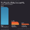
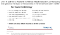

The problem is that items such as ventilators and ECMO can’t be produced or bought easily. A few years ago, the US had a total of 250 ECMO machines, for example.

So if you suddenly have 100,000 people infected, many of them will want to go get tested. Around 20,000 will require hospitalization, 5,000 will need the ICU, and 1,000 will need machines that we don’t have enough of today. And that’s just with 100,000 cases.

That is without taking into account issues such as masks. A country like the US has only 1% of the masks it needs to cover the needs of its healthcare workers (12M N95, 30M surgical vs. 3.5B needed). If a lot of cases appear at once, [there will be masks for only 2 weeks](https://www.cnbc.com/2020/03/04/hhs-clarifies-us-has-about-1percent-of-face-masks-needed-for-full-blown-pandemic.html).

Countries like Japan, South Korea, Hong Kong or Singapore, as well as Chinese regions outside of Hubei, have been prepared and given the care that patients need.

But the rest of Western countries are rather going in the direction of Hubei and Italy. So what is happening there?

## What an Overwhelmed Healthcare System Looks Like

The stories that happened in Hubei and those in Italy are starting to become eerily similar. Hubei built two hospitals in ten days, but even then, it was completely overwhelmed.

Both complained that patients inundated their hospitals. They had to be taken care of anywhere: in hallways, in waiting rooms…

I heavily recommend this short Twitter thread. It paints a pretty stark picture of Italy today

[ ## Medico Humanitas su Facebook: "Situazione drammatica, altro che normale influenza"   ### Pubblichiamo l'intervento sui social di Daniele Macchini, medico alle Cliniche Humanitas Gavazzeni. Una testimonianza…    #### bergamo.corriere.it](https://bergamo.corriere.it/notizie/cronaca/20_marzo_07/coronavirus-bergamo-medico-humanitas-facebook-situazione-drammatica-altro-che-normale-influenza-4fdf6866-6088-11ea-8d61-438e0a276fc4.shtml)

Healthcare workers spend hours in a single piece of protective gear, because there’s not enough of them. As a result, they can’t leave the infected areas for hours. When they do, they crumble, dehydrated and exhausted. Shifts don’t exist anymore. People are driven back from retirement to cover needs. People who have no idea about nursing are trained overnight to fulfill critical roles. Everybody is on call, always.

That is, until they become sick. Which happens a lot, because they’re in constant exposure to the virus, without enough protective gear. When that happens, they need to be in quarantine for 14 days, during which they can’t help. Best case scenario, 2 weeks are lost. Worst case, they’re dead.

The worst is in the ICUs, when patients need to share ventilators or ECMOs. These are in fact impossible to share, so the healthcare workers must determine what patient will use it. That really means, which one lives and which one dies.

[ ## Coronavirus: 'We must choose who to treat,' says Italian doctor   ### An Italian doctor in Lombardy, a region of Italy that has been quarantined due to the new coronavirus (Covid-19)…    #### www.brusselstimes.com](https://www.brusselstimes.com/all-news/belgium-all-news/health/99412/coronavirus-we-must-choose-who-to-treat-says-italian-doctor-covid-19-christian-salaroli/)

> “After a few days, we have to choose. […] Not everyone can be intubated. We decide based on age and state of health.” —*> Christian Salaroli, Italian MD.*

All of this is what drives a system to have a fatality rate of ~4% instead of ~0.5%. If you want your city or your country to be part of the 4%, don’t do anything today.

# 3. What Should You Do?

## Flatten the Curve

This is a pandemic now. It can’t be eliminated. But what we can do is reduce its impact.

Some countries have been exemplary at this. The best one is Taiwan, which is extremely connected with China and yet still has as of today fewer than 50 cases. This recent paper explain all the measures they took early on, which were focused on containment.

[ ## Response to COVID-19 in Taiwan: Big Data Analytics, New Technology, and Proactive Testing   ### This Viewpoint describes the outbreak response infrastructure developed by the Taiwanese government following the SARS…    #### jamanetwork.com](https://jamanetwork.com/journals/jama/fullarticle/2762689)

They have been able to contain it, but most countries lacked this expertise and didn’t. Now, they’re playing a different game: mitigation. They need to make this virus as inoffensive as possible.

If we reduce the infections as much as possible, our healthcare system will be able to handle cases much better, driving the fatality rate down. And, if we spread this over time, we will reach a point where the rest of society can be vaccinated, eliminating the risk altogether. So our goal is not to eliminate coronavirus contagions. It’s to postpone them.

The more we postpone cases, the better the healthcare system can function, the lower the mortality rate, and the higher the share of the population that will be vaccinated before it gets infected.

How do we flatten the curve?

## Social Distancing

There is one very simple thing that we can do and that works: social distancing.

If you go back to the Wuhan graph, you will remember that as soon as there was a lockdown, cases went down. That’s because people didn’t interact with each other, and the virus didn’t spread.

The current scientific consensus is that this virus can be spread within 2 meters (6 feet) if somebody coughs. Otherwise, the droplets fall to the ground and don’t infect you.

The worst infection then becomes through surfaces: The virus survives for hours or days on different surfaces. If it behaves like the flu, it can survive for weeks on metal, ceramics and plastics. That means things like doorknobs, tables, or elevator buttons can be terrible infection vectors.

The only way to truly reduce that is with social distancing: Keeping people home as much as possible, for as long as possible until this recedes.

This has already been proven in the past. Namely, in the 1918 flu pandemic.

## Learnings from the 1918 Flu Pandemic

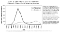

You can see how Philadelphia didn’t act quickly, and had a massive peak in death rates. Compare that with St Louis, which did.

Then look at Denver, which enacted measures and then loosened them. They had a double peak, with the 2nd one higher than the first.

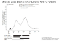
If you generalize, this is what you find:

This chart shows, for the 1918 flu in the US, how many more deaths there were per city depending on how fast measures were taken. For example, a city like St Louis took measures 6 days before Pittsburg, and had less than half the deaths per citizen. On average, taking measures 20 days earlier halved the death rate.

Italy has finally figured this out. They first locked down Lombardy on Sunday, and one day later, on Monday, they realized their mistake and decided they had to lock down the entire country.

Hopefully, we will see results in the coming days. However, it will take one to two weeks to see. Remember the Wuhan graph: there was a delay of 12 days between the moment when the lockdown was announced and the moment when official cases (orange) started going down.

## How Can Politicians Contribute to Social Distancing?

If you’re a politician in a region affected by the coronavirus, you should immediately follow Italy’s example and order a lockdown.

This is what they ordered:

- Nobody can enter or exit lockdown areas, unless there are proven family or work reasons.
- Movement inside the areas is to be avoided, unless they are justified for urgent personal or work reasons and can’t be postponed.
- People with symptoms (respiratory infection and fever) are “highly recommended” to remain home.
- Standard time off for healthcare workers is suspended
- Closure of all educational establishments (schools, universities…), gyms, museums, ski stations, cultural and social centers, swimming pools, and theaters.
- Bars and restaurants have limited opening times from 6am to 6pm, with at least one meter (~3 feet) distance between people.
- All pubs and clubs must close.
- All commercial activity must keep a distance of one meter between customers. Those that can’t make it happen must close. Temples can remain open as long as they can guarantee this distance.
- Family and friends hospital visits are limited
- Work meetings must be postponed. Work from home must be encouraged.
- All sports events and competitions, public or private, are canceled. Important events can be held under closed doors.

This is *the least* I would order. If you want to be safe, do it Wuhan style. People might complain now, but they’ll thank you later.

## How Can Business Leaders Contribute to Social Distancing?

If you’re a business leader and you want to know what you should do, the best resource for you is [Staying Home Club](https://stayinghome.club/).

[ ## Who's staying home because of COVID-19?   ### A list of all the companies WFH or events changed because of covid-19    #### stayinghome.club](https://stayinghome.club/)

It is a list of social distancing policies that have been enacted by US tech companies—so far, 85.

They range from allowed to required Work From Home, and restricted visits, travel, or events.

There are more things that every company must determine, such as what to do with hourly workers, whether to keep the office open or not, how to conduct interviews, what to do with the cafeterias… If you want to know how my company handled some of these, along with a model announcement to your employees, [here is the one my company used](https://docs.google.com/document/d/1rpdqqBCKopFrCUyoNpURfBCbbLzC8T7PgOJgXDiCNG4/edit?usp=sharing) ([view only version here](https://docs.google.com/document/d/1BWp1cnOlzOUUnJTTs_N0uIktYwoF0qcNCfELUuyoYnU/edit?usp=sharing)).

# 4. When?

It is very possible that so far you’ve agreed with everything I’ve said, and were just wondering since the beginning when to make each decision. Put in another way, what triggers should we have for each measure.

## Risk-Based Model for Triggers

To solve this, I’ve created a [model](https://docs.google.com/spreadsheets/d/17YyCmjb2Z2QwMiRRwAb7W0vQoEAiL9Co0ARsl03dSlw/edit?usp=sharing).

[ ## Coronavirus - When Should You Close Your Office?   ### How To Use Coronavirus Work From Home Model This model should help you and your company make a decision on whether you…    #### docs.google.com](https://docs.google.com/spreadsheets/d/17YyCmjb2Z2QwMiRRwAb7W0vQoEAiL9Co0ARsl03dSlw/edit?usp=sharing)

It enables you to assess the likely number of cases in your area, the probability that your employees are already infected, how that evolves over time, and how that should tell you whether to remain open.

It tells us things like:

- If your company has 100 employees in the Washington state area that has 11 coronavirus deaths, there’s a 25% chance at least one of your employees is infected, and you should close immediately.
- If your company has 250 employees mostly in the South Bay (San Mateo and Santa Clara counties, which together have 22 official cases and the true number is probably at least 54), by 3/9 you will have ~2% chances to have at least one employee infected.
- If your company is in Paris (intramuros), and it has 250 employees, today there’s a 0.85% chance that one of your employees has the coronavirus, and by tomorrow it will be 1.2%, so if you’re only comfortable with a 1% chance, you should close your office by tomorrow.

The model uses labels such as “company” and “employee”, but the same model be used for anything else: schools, mass transit… So if you have only 50 employees in Paris, but all of them are going to take the RER, coming across thousands of other people, suddenly the likelihood that at least one of them will get infected is much higher and you should close your office immediately.

## Are You Part of a Group of Leaders?

This math is selfish. It looks at every company’s risk individually, taking as much risk as we want until the inevitable hammer of the coronavirus closes our offices.

But if you’re part of a league of business leaders or politicians, your calculations are not for just one company, but for the whole. The math becomes: What’s the likelihood that any of our companies is infected? If you’re a group of 50 companies of 250 employees on average, in the SF Bay Area, there’s a 35% chance that at least one of the companies has an employee infected, and 97% chance that will be true next week. I added a tab in [the model](https://docs.google.com/spreadsheets/d/17YyCmjb2Z2QwMiRRwAb7W0vQoEAiL9Co0ARsl03dSlw/copy?usp=sharing) to play with that.

# Conclusion: The Cost of Waiting

It might feel scary to make a decision today, but you shouldn’t think about it this way.

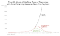

This theoretical model shows different communities: one doesn’t take social distancing measures, one takes them on Day n of an outbreak, the other one on Day n+1. All the numbers are completely fictitious (I chose them to resemble what happened in Hubei, with ~6k daily new cases at the worst). They’re just there to illustrate how important a single day can be in something that grows exponentially. You can see that the one-day delay peaks later and higher, but then daily cases converge to zero.

But what about cumulative cases?
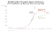

In this theoretical model that resembles loosely Hubei, waiting one more day creates 40% more cases! So, maybe, if the Hubei authorities had declared the lockdown on 1/22 instead of 1/23, they might have reduced the number of cases by a staggering 20k.

And remember, these are just cases. Mortality would be much higher, because not only would there be directly 40% more deaths. There would also be a much higher collapse of the healthcare system, leading to a mortality rate up to 10x higher as we saw before. So a one-day difference in social distancing measures can end exploding the number of deaths in your community by multiplying more cases and higher fatality rate.

This is an exponential threat. Every day counts. When you’re delaying by a single day a decision, you’re not contributing to a few cases maybe. There are probably hundreds or thousands of cases in your community already. Every day that there isn’t social distancing, these cases grow exponentially.

# Share the Word

This is probably the one time in the last decade that sharing an article might save lives. They need to understand this to avert a catastrophe. The moment to act is now.