Coursera's Monetization Journey: From 0 to $100+ Million in Revenue — Class Central

# Coursera’s Monetization Journey: From 0 to $100+ Million in Revenue

 [Dhawal Shah](https://www.classcentral.com/report/author/dhawal/)   Jun 22nd, 2019

- [Facebook](http://www.facebook.com/sharer.php?u=https%3A%2F%2Fwww.classcentral.com%2Freport%2Fcoursera-monetization-revenues%2F&t=Coursera%26%238217%3Bs%20Monetization%20Journey%3A%20From%200%20to%20%24100%2B%20Million%20in%20Revenue&s=100&p[url]=https%3A%2F%2Fwww.classcentral.com%2Freport%2Fcoursera-monetization-revenues%2F&p[images][0]=https%3A%2F%2Fwww.classcentral.com%2Freport%2Fwp-content%2Fuploads%2F2019%2F06%2Fcoursera-path-to-monetization-1024x512.png&p[title]=Coursera%26%238217%3Bs%20Monetization%20Journey%3A%20From%200%20to%20%24100%2B%20Million%20in%20Revenue)

- [Twitter](https://twitter.com/intent/tweet?url=https%3A%2F%2Fwww.classcentral.com%2Freport%2Fcoursera-monetization-revenues%2F&text=Coursera%26%238217%3Bs%20Monetization%20Journey%3A%20From%200%20to%20%24100%2B%20Million%20in%20Revenue)

- [Envelope](https://www.classcentral.com/report/coursera-monetization-revenues/?utm_source=cc_newsletter&utm_medium=email&utm_campaign=%7B%7B+utm_campaign+%7D%7Dmailto:?subject=Coursera%26%238217%3Bs%20Monetization%20Journey%3A%20From%200%20to%20%24100%2B%20Million%20in%20Revenue&body=Hey%20check%20this%20out:%20https%3A%2F%2Fwww.classcentral.com%2Freport%2Fcoursera-monetization-revenues%2F)

- Url

- [3*i*](https://www.classcentral.com/report/coursera-monetization-revenues/#commentSection)

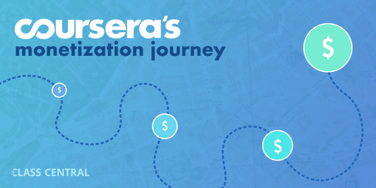

In April, Coursera [announced](https://www.classcentral.com/report/seek-group-invests-in-mooc/) a major Series E funding round of $103 million, their largest yet. With this raise, [Coursera](https://www.classcentral.com/provider/coursera) has entered Unicorn territory (over $1 billion in valuation), with $313.1 million raised.

As you may recall, [MOOCs](https://www.classcentral.com/help/moocs) were born without a business model. In the beginning, everyone wondered how free courses would ever make money. Last year Coursera reportedly made around $140 million dollars.

Through **Class Central**, I have been tracking and writing about the [evolution of the MOOC space](https://www.classcentral.com/moocs-year-in-review-2018) right from the beginning. In this article, I explain how Coursera has evolved over the last seven years and how the company went from zero to over $100 million in revenue.

This article is based on the keynote that I gave last year at The 9th TCU International e-Learning Conference 2018 in Thailand, titled [A Product at Every Price: Overview of MOOC Monetization Models](https://www.youtube.com/watch?v=qfXYqtAeW9c).

## History of Coursera Monetization

### Jan 2012: Free Online Education

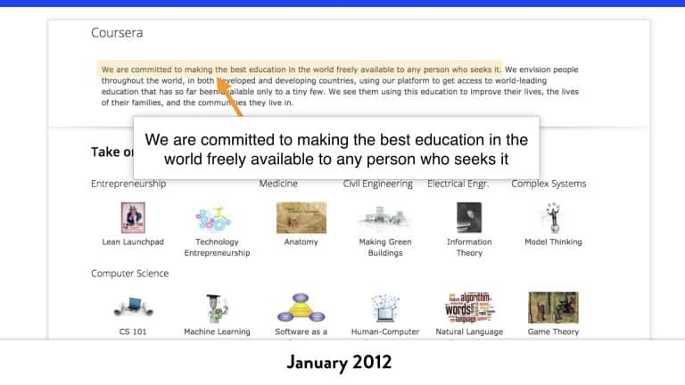

Coursera formally launched in Jan 2012 with the mission statement: ”We are committed to making the best education in the world freely available to any person who seeks it.” At that time Coursera had no business model.

In July of that year, [The Chronicle of Higher Education](http://chronicle.com/article/How-an-Upstart-Company-Might/133065/) obtained the agreement governing Coursera’s relationship with one of its partners, the University of Michigan at Ann Arbor, under a Freedom of Information Act request. The agreement contained a section that listed [eight possible business models](https://www.documentcloud.org/documents/400864-coursera-fully-executed-agreement.html#document/p40), basically making the university aware of the ways Coursera might eventually try to make money from courses. The business models included: certification, secure assessments, employee recruiting, employee or university screening, human-provided tutoring or manual grading, corporate/university enterprise model, sponsorships, and tuition fees. The agreement also showed that Coursera would share with universities 6-15% of the total revenue and 20% of gross profits on its courses.

### Dec 2012: First Attempt at Monetization – Headhunting

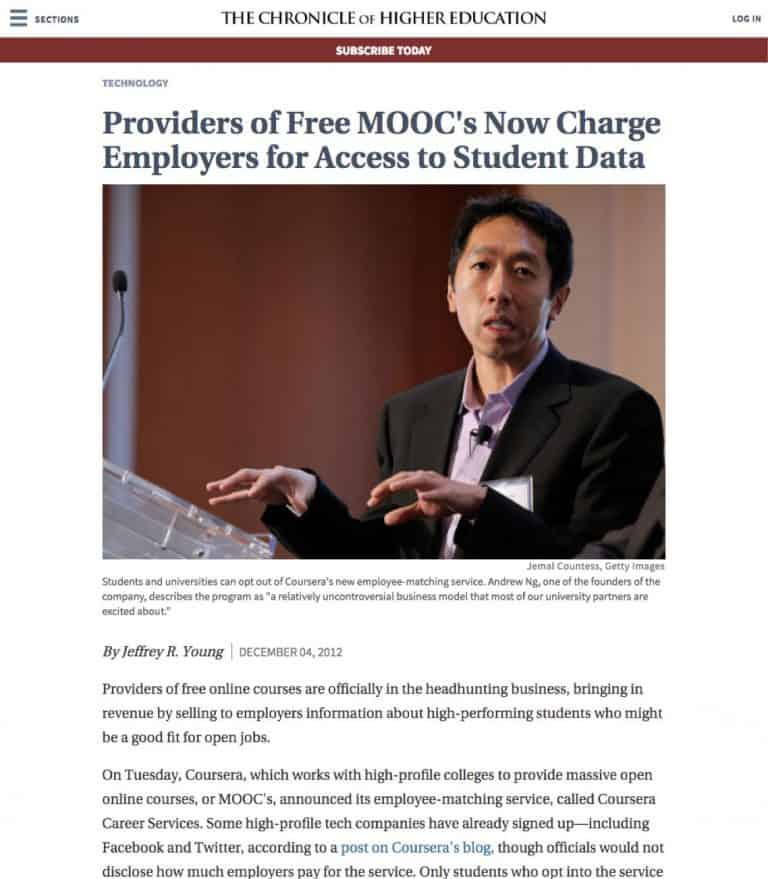

In December 2012, When Coursera had around 2 million registered students, the company published a [blog post](http://blog.coursera.org/post/37200369286/coursera-and-your-career) (the post seems to have been deleted from the blog), pitching Career Services as “a recruiting service that connects passionate and committed Coursera students with positions that match their skills and interests.” The service used sophisticated analytics to match students to companies. Students had to explicitly opt in and create a profile to be eligible.

Coursera charged [companies a flat fee](http://chronicle.com/article/Providers-of-Free-MOOCs-Now/136117/) for introductions to matched students. The revenue would be shared with the university whose courses the student had registered for. At launch, positions were all in software engineering. Some of the initial companies using the service included Facebook, Twitter, AppDirect, and TrialPay.

At some point, Coursera quietly shut down Career Services.

### Jan 2013: Verified Certificates Launched

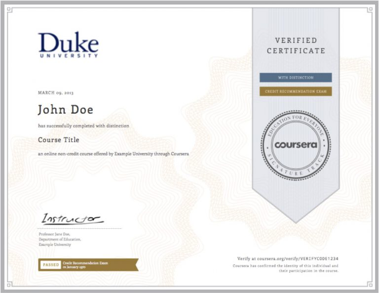

Just a month after its experiment with Career Services, Coursera [announced](http://blog.coursera.org/post/40080531667/signaturetrack) the Signature Track, in January 2013. Signature Track “securely links coursework to real identity” via a verified certificate, which costs between $30 and $100. At launch, six courses were eligible for the verified track. Students facing economic hardship could apply for [financial aid](https://learner.coursera.help/hc/en-us/articles/209819033-Apply-for-Financial-Aid-or-a-Scholarship).

### September 2013: $1 Million in Revenues

Nine months after the launch, Coursera cracked [$1 million in revenue](http://blog.coursera.org/post/61047298750/a-milestone-for-signature-track-certificates-for-the) through the sale of 25,000 sales of verified certificates among its 4.7 million students. Five months later, cumulative revenues reportedly reached [$4 million](http://donaldclarkplanb.blogspot.co.uk/2014/04/moocs-coursera-moves-towards-massive.html).

It may well be that a small set of popular courses contributed to the bulk of these revenues. In an April 2014 [interview](https://www.classcentral.com/report/marketing-in-todays-world-whartons-prof-david-bell-on-intro-to-marketing-mooc/) with Class Central, Professor David Bell of the University of Pennsylvania Wharton School of Business mentioned that 10,000 people had signed up for Signature Track in his [Introduction to Marketing](https://www.classcentral.com/course/coursera-introduction-to-marketing-1137) course, part of the [Wharton Foundation Series](http://blog.coursera.org/post/60889088289/the-wharton-foundation-series). At $49 per verified certificate for the course, that one course had earned nearly half a million dollars in revenue in a little over a year.

### January 2014: Coursera Announces Specializations

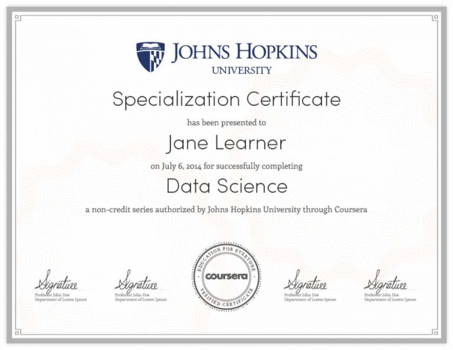

In January 2014, Coursera [announced](http://blog.coursera.org/post/73994272513/coursera-specializations-focused-programs-in-popular) Specializations, which consist of a group of related courses designed to help students deepen expertise in a subject. To obtain a Specialization certification, a student has to earn a verified certificate in each of the courses that make up that Specialization. Specializations quickly took off.

### October 2014: $1 Million in Monthly Revenue

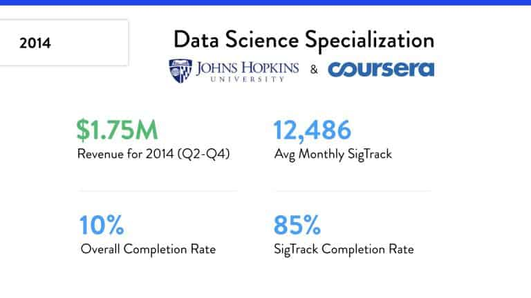

In October 2014, Coursera reached $1 million per month in revenues, likely fuelled by the popularity of Specializations. Johns Hopkins University [shared details](https://www.classcentral.com/report/data-science-specialization-switftkey/) about their [Data Science Specialization](https://www.classcentral.com/certificate/jhudatascience-specialization), consisting of nine courses and a capstone project. In the first five months after the Specialization started, 14,000 people completed at least one course with a verified certificate (each cost $49) while 266 students completed all 9 classes. These figures, not accounting for any financial aid given, amount to about $1 million in verified certificates. It may be that some people would have purchased these verified certificates even without the larger Specialization, but it is safe to assume that the Specializations were (and continue to be) a big driver of sales of verified certificates.

### November 2014: End of Free Certificates

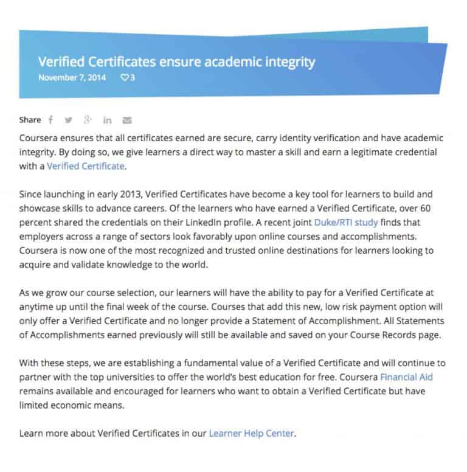

In November 2014, much to the disappointment of some users, Coursera [stopped offering free certificates](https://blog.coursera.org/verified-certificates-ensure-academic-integrity/) (known as Statements of Accomplishment). This was the first sign that Coursera might move away from its mission statement and that MOOCs might not remain free.

### Late 2014: On-Demand Platform is Launched

In late 2014, Coursera started rebuilding its technology platform to support completely self-paced courses. Initially only a few courses were available, and none of these courses offered free certificates. In fact, the new platform didn’t even include a way for a course to offer a free certificate. Soon, Coursera would start pushing all new courses to this new platform.

Now, instead of courses being available only once or twice a year, users could start a course any time under a self-paced model. This meant that Coursera could now earn money from a course throughout the year. Coursera eventually settled on a flexible session-based model, in which new sessions start on a regular schedule, at a bi-weekly or monthly frequency.

### Mid 2015: Coursera Solicits Bids from Universities

Up to this point universities decided which courses to make and launch. In the middle of 2015, Coursera decided to take control of its destiny. The company made a list of Specializations that they thought would sell well and asked universities to bid to create them. The winning bids would be given an advance of $100,000, which would be paid back with revenues from the course.

### May 2015: iMBA Announced

In May 2015, Coursera [announced its first degree partnership](https://www.classcentral.com/report/coursera-imba/), with the University of Illinois at Urbana-Champaign. The iMBA was expected to cost around $20,000, less than half the cost of most other online and on-campus MBA programs.

### October 2015: Assignment Paywall

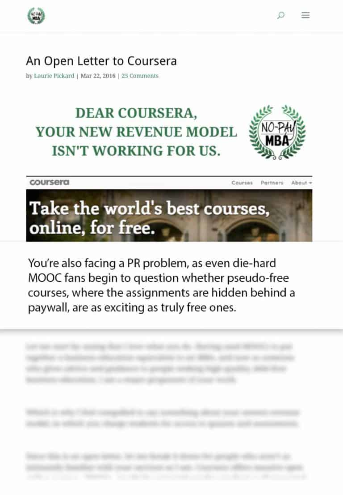

In October 2015, Coursera announced that they would put assignments and homework behind a paywall. Now, only those people who paid for a certificate would be able to access these assignments. With this change, Coursera had effectively started charging for content.

### Feb 2016: Coursera Pilots Mentor-Guided Courses

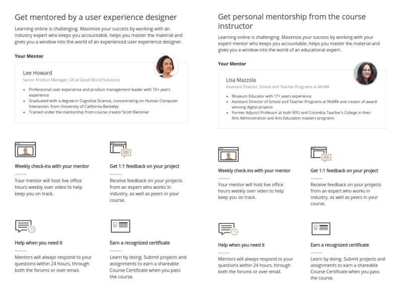

In Feb 2016, Coursera [experimented](https://www.classcentral.com/report/coursera-mentor-guided-courses/) with mentor-guided courses, an initiative which allowed learners to pay extra for mentor support. Coursera charged $149 for the first mentor-guided courses (a 40% discount from the list price of $248). Students who signed up for a mentor guided course were promised 1:1 project feedback, email/forum support, and access to live weekly office hours. Ten courses were chosen for the pilot with 50 slots for mentees. The pilot was discontinued shortly after its launch.

### June 2016: Coursera Shuts Down Old Platform, Moves to On-Demand Model

Eventually, Coursera [shut down their old platform](https://www.classcentral.com/report/coursera-old-platform-shutdown-download-courses/) and forced everyone to move to the new on-demand model. In this process, hundreds of Coursera courses were lost forever.

### June 2016: Coursera Pilots Paid Only Courses

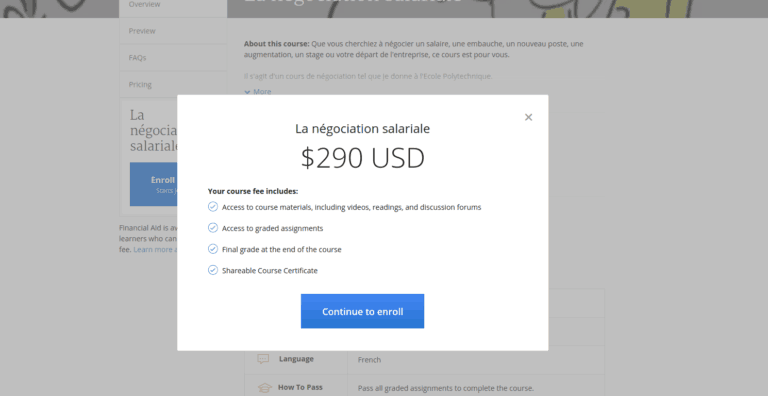

In June 2016, Coursera began offering a few courses that were only open to paying users. A few courses which had been free were now paid. This pilot apparently failed; Coursera didn’t continue, and the courses went back to being free (or rather, ‘free to audit’). Despite the reversal on the first paid courses, fully paid courses have now become more numerous on Coursera.

### August 2016: Coursera for Business

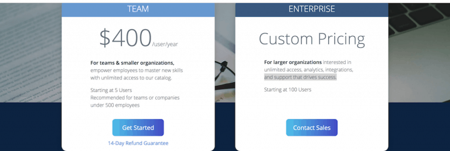

In August 2016, Coursera launched Coursera for Business. Now, businesses could purchase Coursera content for their employees.

### October 2016: Subscriptions for Specializations

Then in October, Coursera [changed](https://blog.coursera.org/introducing-subscriptions-for-specializations/) the pricing of Specializations. Previously, learners bought the Specialization course by course and paid a fixed price per course.

Under the new pricing model, users would pay a monthly fee ranging between $39–$89 to have access to graded assignments and to earn certificates. These features remained enabled as long as learners were paying the subscription fee. They could also pay a larger amount to get access to all the premium features for the entire Specialization for 12 months. (This option is no longer available.)

### 2016: Potential Revenue $50-60M

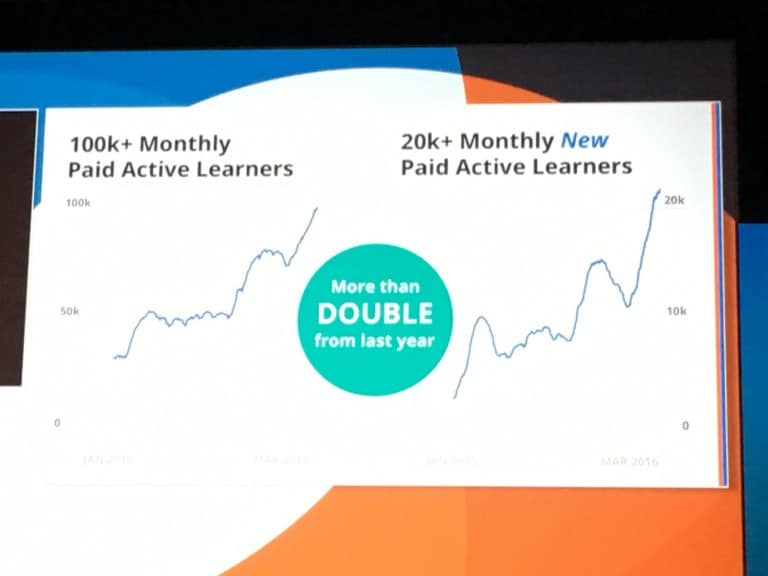

At the 2016 Coursera Partners Conference, Coursera revealed some details about how many paid learners they have. At that time, they had over 100,000 monthly paid active learners and were adding least 20,000 more every month. Using some back of the envelope calculations, I estimated [$50-$60 million](https://www.quora.com/How-does-Coursera-make-money-if-it-does-What-is-its-business-model/answer/Dhawal-Shah) in revenue.

By this point, the original MOOC model (involving free courses, large numbers of people who would take a course at the same time, and free certificates) had practically disappeared. Over the past several years, Coursera had removed free certificates, put graded assignments behind paywalls, adopted a subscription model for payment, switched to an on-demand model for course delivery, and increased the monetizable content on the platform by soliciting bids from universities.

### April 2017: Coursera Launches Free Trial For Specializations

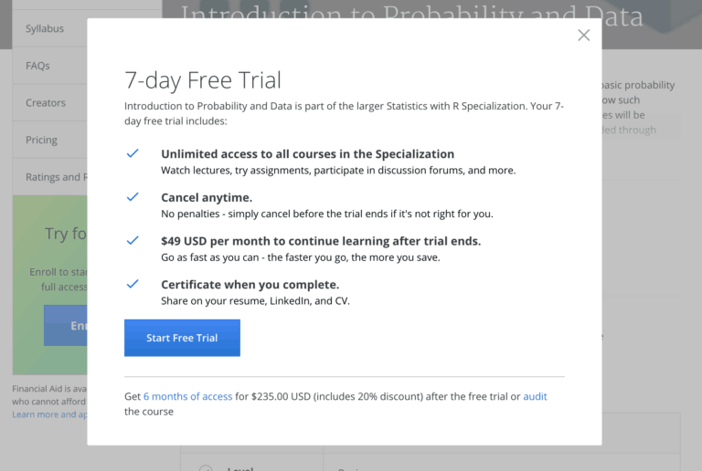

In April 2017, Coursera introduced another tweak to the model: a [seven-day free trial](https://www.classcentral.com/report/coursera-free-trial-financial-aid/) for Specialization subscriptions. Users could now get access to premium features for free for a week, but would have to provide a credit card to start the free trial.

### April 2017: Financial Aid Restrictions

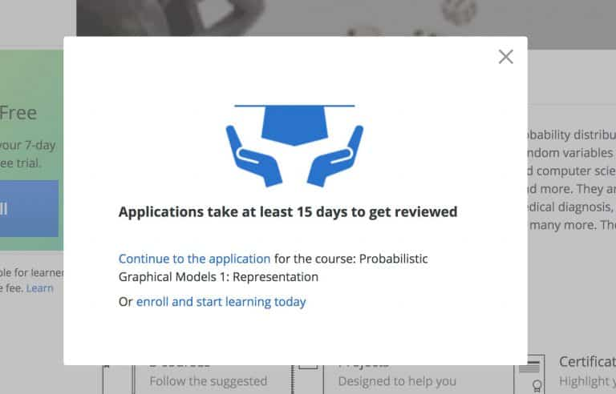

That same month, Coursera made some changes to its financial aid policies. For a long time, Coursera was pretty liberal with its financial aid and was quick to approve aid applications. I personally applied for financial aid and was approved instantly. In October 2015, Coursera announced that it had approved 1 million financial aid applications. However, Coursera changed the application process, making it longer and more difficult.

As one of Class Central’s users lamented:

“*Now they want what looks like an essay — 300 words — of why you cannot pay, and there are a few boxes to tick on whether you would take out a loan (to do a course which has no transferable credit!) and if you say ‘no’ to a loan, they want an explanation from you. Then it will take 15 days to approve or decline an application.*”

### Mid 2017: Single Subscription Price

In 2017, Coursera ran an [extensive test](https://www.classcentral.com/report/coursera-specialization-subscription/) on a newer pricing model. Under this model, learners would get access to the whole catalog (instead of just one Specialization) for a price of $49/month, a huge price cut for users interested in multiple Specializations.

Previously, if you were to subscribe to every Specialization in Coursera, it would cost you thousands of dollars per month. Now you could get that access for $49/month. Unfortunately, Coursera did not move forward with this pricing model, and catalog subscriptions are no longer available to individual learners. Companies can still purchase a catalog subscription for their employees, through Coursera for Business for a price of $400/employee per year.

### End of 2017: Coursera for Business Exceeds 500 Companies

In 2016, 30 companies had signed up for Coursera for Business. [Coursera ended 2017](https://www.classcentral.com/report/coursera-2017-year-review/) with more than 500 companies signed up for the service.

### Jan 2018: $9.6 Million in Tuition from Online Degrees

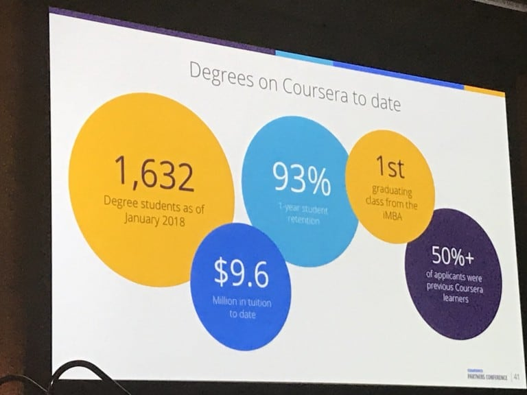

At their 2018 partners conference, Coursera announced that they had 1,632-degree students and a total of $9.6million from tuition revenue. Interestingly, Coursera noted that 50% of the degree students were previous Coursera learners.

A large portion of the costs for traditional online degrees come from the marketing cost to acquire the student. For Coursera (and this is true of other MOOC platforms too), this cost is significantly lower. The MOOC platform with tens of millions of learners acts as a marketing channel. As we will see, Coursera saw a lucrative opportunity in online degrees, and they went for it.

To learn how MOOC-based degrees are different from traditional online degrees, read Class Central’s [article here](https://www.classcentral.com/report/mooc-based-degrees-vs-traditional-online-degrees/).

### March 2018: Coursera Launches Six New Degrees, Including a Bachelor’s Degree

In March of last year, Coursera announced six new degrees, including its [first MOOC-based bachelor’s degree](https://www.classcentral.com/report/coursera-new-bachelors-degree/), a B.S. in Computer Science from Goldsmiths, University of London.

Two of the six new degrees were master’s in public health, the first non-STEM degrees announced by Coursera, from the University of Michigan and Imperial College of London. Coursera also announced two master’s of computer science, one from Arizona State University and the other from the University of Illinois. The University of Michigan announced a Master of Applied Data Science (which is similar to the Master of Computer Science in Data Science from the University of Illinois).

A sign of the increasing popularity and legitimacy of MOOC-based degrees, a few months later Coursera would [announce](https://www.classcentral.com/report/coursera-penn-mcit-degree/) a MOOC-based masters from an Ivy League school, The University of Pennsylvania.

To see a list of complete degrees check out Class Central’s list of [35+ legit masters degrees](https://www.classcentral.com/report/mooc-based-masters-degree/) or our [pricing chart](https://www.classcentral.com/pricing-charts/mooc-based-degrees).

### March 2018: Coursera Announces MastersTrack

In addition to its Specializations, Coursera announced another micro-credential called [MasterTrack](https://www.classcentral.com/report/mastertrack-coursera/), similar to edX’s MicroMasters program. Both these micro-credentials allow learners to earn credit towards a Master’s Degree. Students still need to apply and get accepted into the Master’s program to redeem the credits.

### 2018: Coursera’s 2018 Revenue Estimated at $140 Million

According to Forbes, Coursera’s 2018 estimated revenue is around [$140 million](https://www.classcentral.com/report/coursera-2018-revenue-140-million/). (In our analysis of [Coursera in 2017](https://www.classcentral.com/report/coursera-2017-year-review/), Class Central estimated Coursera’s 2017 revenue in the range of $100 million.)

By the end of 2018, Coursera had an active catalog of 3100 courses and 310 Specializations, 12 master’s degrees announced, and over 1,500 enterprise customers (including over 60 Fortune 500 companies), up from 500 at the end of 2016.

I captured this business plan in my analysis of how MOOC platforms make money, [Six Tiers of MOOC Monetization](https://www.classcentral.com/report/six-tiers-mooc-monetization/). Now Coursera has [A Product at Every Price](https://www.classcentral.com/report/moocs-stats-and-trends-2017/), from free to millions of dollars. Here is how it looks in 2019:

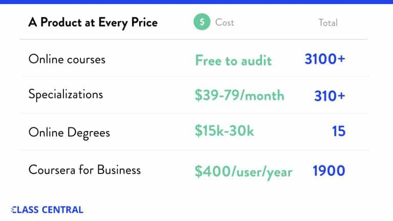

For more of **Class Central**‘s analysis of Coursera, checkout out our previous year in reviews:

- [Coursera’s 2018: Year in Review](https://www.classcentral.com/report/coursera-2018-year-review/)
- [Coursera’s 2017: Year in Review](https://www.classcentral.com/report/coursera-2017-year-review/)
- [Coursera’s 2016: Year in Review](https://www.classcentral.com/report/coursera-2016-review/)

 [ AD       LWMOOCs 2019 CFP open until May 15th, 2019 23-25 October, Milwaukee, WI, USA](http://lwmoocs-conference.org/lwmoocs2019/)

 [ AD       LWMOOCs 2019 CFP open until May 15th, 2019 23-25 October, Milwaukee, WI, USA](http://lwmoocs-conference.org/lwmoocs2019/)

 **Category**

- [Analysis](https://www.classcentral.com/report/category/analysis/)

- [Features](https://www.classcentral.com/report/category/features/)

 **Tags**

- [Coursera](https://www.classcentral.com/report/tag/coursera/)

- [MOOC Monetization](https://www.classcentral.com/report/tag/mooc-monetization/)

 

###   [Dhawal Shah](https://www.classcentral.com/report/author/dhawal/)

Dhawal is the founder and CEO of Class Central.

 [More articles from Dhawal Shah](https://www.classcentral.com/report/author/dhawal/)