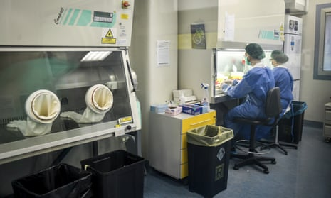

Covid-19: how do we test for it? - podcast | Science | The Guardian

[Skip to main content](https://www.theguardian.com/science/audio/2020/mar/31/covid-19-how-do-we-test-for-it-podcast#maincontent)

Advertisement

[The Guardian - Back to home![](data:image/svg+xml,%3csvg xmlns='http://www.w3.org/2000/svg' viewBox='0 0 297 95' class='inline-the-guardian-logo__svg inline-logo__svg js-evernote-checked' data-evernote-id='726'%3e %3cpath fill='%23121212' d='M66.8 50.7l5-2.6V8.4H68l-9.3 12.4h-1L58.2 7h40.5l.6 13.8h-1.1L89 8.4h-3.9V48l5 2.7V52H66.9v-1.3zm37-1.8V5L100 3.5v-.9L114.2.1h1.5v20.8l.3-.4a19 19 0 0 1 12.2-4.5c6.2 0 9 3.5 9 10v23l3.3 1.7V52H122v-1.3l3.4-1.8V26c0-3.6-1.6-5-4.6-5a7.8 7.8 0 0 0-4.9 1.6V49l3.3 1.8V52h-18.5v-1.2zm48.4-13.4c.4 7.2 3.6 12.8 11.4 12.8 3.7 0 6.3-1.7 8.8-3v1.5a17.4 17.4 0 0 1-13.6 6.2c-12 0-18-6.6-18-18.1 0-11.3 6.6-18.3 17.4-18.3 10.2 0 15.5 5 15.5 18.4v.4zm-.2-1.7l10.5-.7c0-9-1.5-15-4.6-15-3.3 0-5.9 7-5.9 15.6M0 69.6c0-19.1 12.7-26 26.8-26 6 0 11.6 1 14.8 2.3l.3 13.4h-1.4l-8.3-13a12.2 12.2 0 0 0-5.2-.8c-7.5 0-11.3 8.7-11.2 22.9.1 17 3 24.7 10 24.7a10.7 10.7 0 0 0 4.1-.7V74.2l-4.5-2.6V70h22v1.7l-4.5 2.5v18A49.2 49.2 0 0 1 26.2 95C10.2 95 0 87.5 0 69.6m47.1-9v-1L62 57l1.6.1v29c0 3.6 1.7 4.6 4.5 4.6a6 6 0 0 0 4.8-2.2v-26l-4-1.8v-1.2L83.6 57l1.4.2v33.3l4 1.6v1.1L74.4 95l-1.4-.1v-4.4h-.4A16.4 16.4 0 0 1 61.5 95C54.4 95 51 90.8 51 84.5v-22zm94.5-3.7l1.2.1v10.8h.4c1.6-7.9 5-10.8 9.3-10.8a4.7 4.7 0 0 1 1.8.3v11a12.6 12.6 0 0 0-3-.3 18.6 18.6 0 0 0-8 1.6v21.2l3.4 1.9V94h-19.3v-1.3l3.5-1.9v-29l-4-1.2v-1zm37.1.9V46.5l-4-1.5v-.9l15-2.7 1.3.2v48.8l4.2 1.5V93l-14.8 2-1.1-.1v-4h-.4a13.1 13.1 0 0 1-9.8 4.1c-8 0-13.9-6.1-13.9-18.7 0-13.2 6.9-19.7 17.2-19.7a14.7 14.7 0 0 1 6.3 1.2m0 31.2V60a5.5 5.5 0 0 0-4-1.3c-4 .1-6.5 6.2-6.5 16.9 0 9.6 1.8 15 7 14.8a5.2 5.2 0 0 0 3.5-1.3M211.5 57h1.3v34l3.4 1.8V94H197v-1.3l3.4-1.9V62.4l-4-1.7v-1.1zm1.4-9.2a6.4 6.4 0 0 1-6.6 6.3 6.3 6.3 0 1 1 0-12.6 6.5 6.5 0 0 1 6.6 6.3m46.3 43.1V62l-4-1.4v-1.4l14.7-2.8 1.5.2v4.3h.4a19.4 19.4 0 0 1 12.5-4.7c6.4 0 9.3 3 9.3 9.8v24.8l3.4 1.9V94h-19.2v-1.3l3.5-1.9v-24c0-3.8-1.6-5.3-4.7-5.3a8 8 0 0 0-5 1.7v27.6l3.3 1.9V94h-19.1v-1.3zm-21.3-18V68c0-7.3-1.5-9.6-6-9.6a11.8 11.8 0 0 0-1.6 0l-8 11h-1.1v-10a43.3 43.3 0 0 1 13.5-2.4c9.8 0 15.5 2.7 15.5 11v23.5l3.5 1v.9a15 15 0 0 1-7.2 1.6c-4.9 0-7.2-1.6-8.3-4.2h-.3c-2 2.8-5 4.3-9.6 4.3-5.8 0-9.8-3.6-9.8-9.9 0-6 3.8-9.4 11.5-10.8zm0 16.2V74.5l-2.4.2c-3.9.3-5.2 2.7-5.2 8.2 0 5.9 1.9 7.4 4.6 7.4a3.6 3.6 0 0 0 3-1.3M109.7 72.7V68c0-7.3-1.6-9.7-6.1-9.7a11.8 11.8 0 0 0-1.5.2L94 69.2h-1v-10a43.3 43.3 0 0 1 13.4-2.3c9.8 0 15.5 2.7 15.5 11v23.5l3.5 1v.9a15 15 0 0 1-7.2 1.6c-4.9 0-7.2-1.6-8.3-4.2h-.3c-2 2.8-5 4.3-9.5 4.3-5.9 0-9.8-3.6-9.8-9.9 0-6 3.7-9.4 11.4-10.8zm0 16.3V74.5l-2.5.2c-3.8.3-5.2 2.7-5.2 8.2 0 5.9 2 7.4 4.6 7.4a3.6 3.6 0 0 0 3-1.3' data-evernote-id='2244' class='js-evernote-checked'%3e%3c/path%3e %3c/svg%3e)](https://www.theguardian.com/uk)

Support The Guardian
Available for everyone, funded by readers

[Contribute](https://support.theguardian.com/uk/contribute?INTCMP=header_support_contribute&acquisitionData=%7B%22componentType%22%3A%22ACQUISITIONS_HEADER%22%2C%22componentId%22%3A%22header_support_contribute%22%2C%22source%22%3A%22GUARDIAN_WEB%22%2C%22referrerPageviewId%22%3A%22k8h79f96rspkzjfpvqv1%22%2C%22referrerUrl%22%3A%22https%3A%2F%2Fwww.theguardian.com%2Fscience%2Faudio%2F2020%2Fmar%2F31%2Fcovid-19-how-do-we-test-for-it-podcast%22%7D)[Subscribe](https://support.theguardian.com/uk/subscribe?INTCMP=header_support_subscribe&acquisitionData=%7B%22componentType%22%3A%22ACQUISITIONS_HEADER%22%2C%22componentId%22%3A%22header_support_subscribe%22%2C%22source%22%3A%22GUARDIAN_WEB%22%2C%22referrerPageviewId%22%3A%22k8h79f96rspkzjfpvqv1%22%2C%22referrerUrl%22%3A%22https%3A%2F%2Fwww.theguardian.com%2Fscience%2Faudio%2F2020%2Fmar%2F31%2Fcovid-19-how-do-we-test-for-it-podcast%22%7D)

[Search jobs](https://jobs.theguardian.com/?INTCMP=jobs_uk_web_newheader)[Dating](https://soulmates.theguardian.com/?INTCMP=soulmates_uk_web_newheader)

[![](data:image/svg+xml,%3csvg xmlns='http://www.w3.org/2000/svg' viewBox='0 0 14 14' class='top-bar__item__icon__svg inline-profile__svg inline-icon__svg js-evernote-checked' data-evernote-id='730'%3e %3cpath d='M7 0C3.1 0 0 3.1 0 7c0 2 .9 3.9 2.4 5.2C3.6 13.4 5.3 14 7 14s3.4-.6 4.7-1.8C13.2 10.9 14 9 14 7c0-3.9-3.1-7-7-7zm0 1.8c1.3 0 2.1.8 2.1 2.1S8 6.3 7 6.3c-.8 0-2-1.1-2-2.4 0-1.4.7-2.1 2-2.1zm0 11.6c-1.7 0-3.3-.7-4.5-1.8l.8-3.2.5-.5c1-.4 2.1-.5 3.1-.5 1.1 0 2.1.2 3.1.5l.5.5.9 3.2c-1.1 1.2-2.7 1.8-4.4 1.8z'%3e%3c/path%3e %3cpath d='M9.6 4.2c.1-.1.1-.1 0 0zm.1 0s0-.1 0 0c0-.1 0-.1 0 0 0-.1 0-.1 0 0 0-.1 0-.1 0 0zm0 0c0-.1 0-.1 0 0 0-.1 0-.1 0 0 0-.1 0-.1 0 0 0-.1 0 0 0 0zm.1 0c0-.1 0-.1 0 0 0-.1 0-.1 0 0 0-.1 0-.1 0 0 0-.1 0-.1 0 0 0-.1 0-.1 0 0 0-.1 0-.1 0 0 0-.1 0-.1 0 0zm0 0zm.1-.1c0 .1 0 .1 0 0 0 .1 0 .1 0 0 0 .1 0 .1 0 0 0 .1 0 .1 0 0 0 0 0 .1 0 0 0 .1 0 .1 0 0zm0 0c0 .1 0 .1 0 0 0 .1 0 0 0 0zm0 0c.1 0 .1 0 0 0 .1 0 .1 0 0 0 .1 0 .1 0 0 0 .1 0 0 0 0 0 .1 0 .1 0 0 0 .1 0 .1 0 0 0 .1 0 0 0 0 0s.1 0 0 0c.1 0 .1 0 0 0 .1 0 .1 0 0 0 .1 0 .1 0 0 0 .1 0 .1 0 0 0 .1 0 .1 0 0 0zm.1 0zm.1 0c-.1 0-.1 0 0 0zm0 0zm0 0zm.1 0s-.1 0 0 0c-.1 0-.1 0 0 0-.1 0-.1 0 0 0-.1 0-.1 0 0 0-.1 0-.1 0 0 0zm-.1 0c.1 0 .1 0 0 0 .1 0 .1 0 0 0zm.2 0c-.1 0-.1 0 0 0-.1 0-.1 0 0 0-.1 0-.1 0 0 0-.1 0-.1 0 0 0-.1 0-.1 0 0 0-.1-.1-.1-.1 0 0-.1-.1-.1-.1 0 0-.1-.1-.1-.1 0 0-.1-.1-.1 0 0 0-.1-.1-.1-.1 0 0-.1-.1-.1-.1 0 0-.1-.1-.1-.1 0 0-.1-.1-.1-.1 0 0-.1 0-.1 0 0 0-.1 0-.1 0 0 0-.1 0-.1 0 0 0-.1 0-.1 0 0 0zm0 0s0-.1 0 0c0-.1 0-.1 0 0 0-.1 0-.1 0 0 0-.1 0-.1 0 0 0-.1 0-.1 0 0 0-.1 0-.1 0 0 0-.1 0-.1 0 0zm0 0c0-.1 0-.1 0 0 0-.1 0-.1 0 0 0-.1 0-.1 0 0 0-.1 0-.1 0 0zm.1 0c-.1-.1-.1-.1 0 0-.1-.1-.1-.1 0 0-.1-.1-.1-.1 0 0-.1-.1-.1-.1 0 0zm0 0c0-.1 0-.1 0 0 0-.1 0-.1 0 0 0-.1 0-.1 0 0 0-.1 0 0 0 0 0-.1 0-.1 0 0 0-.1 0-.1 0 0 0-.1 0-.1 0 0 0-.1 0-.1 0 0 0-.1 0-.1 0 0 0-.1 0-.1 0 0 0-.1 0 0 0 0zm0-.1z'%3e%3c/path%3e %3c/svg%3e)Sign in](https://profile.theguardian.com/signin?INTCMP=DOTCOM_NEWHEADER_SIGNIN)

[Search](https://www.google.co.uk/advanced_search?q=site:www.theguardian.com)

- [News](https://www.theguardian.com/uk)
- [Opinion](https://www.theguardian.com/uk/commentisfree)
- [Sport](https://www.theguardian.com/uk/sport)
- [Culture](https://www.theguardian.com/uk/culture)
- [Lifestyle](https://www.theguardian.com/uk/lifeandstyle)
- [UK](https://www.theguardian.com/uk-news)
- [World](https://www.theguardian.com/world)
- [Business](https://www.theguardian.com/uk/business)
- [Coronavirus](https://www.theguardian.com/world/coronavirus-outbreak)
- [Football](https://www.theguardian.com/football)
- [Environment](https://www.theguardian.com/uk/environment)
- [UK politics](https://www.theguardian.com/politics)
- [Education](https://www.theguardian.com/education)
- [Society](https://www.theguardian.com/society)
- [Science](https://www.theguardian.com/science)
- [Tech](https://www.theguardian.com/uk/technology)
- [Global development](https://www.theguardian.com/global-development)
- [Obituaries](https://www.theguardian.com/tone/obituaries)

[Science Weekly](https://www.theguardian.com/science/series/science)
[Coronavirus outbreak](https://www.theguardian.com/world/coronavirus-outbreak)

# Covid-19: how do we test for it?

00:12:00
00:12:51

![](data:image/svg+xml,%3csvg viewBox='0 0 439 84' preserveAspectRatio='xMinYMax slice' xmlns='http://www.w3.org/2000/svg' xmlns:xlink='http://www.w3.org/1999/xlink' data-evernote-id='737' class='js-evernote-checked'%3e %3cdefs%3e %3cpath id='WaveRectangles' d='M-.004 35.914h2.249v5.621H-.004zM3.369 20.287h2.248v21.248H3.369zM6.742 1.288H8.99v40.247H6.742zM10.114 1.963h2.249v39.572h-2.249zM13.487 2.749h2.248v38.786h-2.248zM16.859 4.436h2.249v37.1h-2.249zM20.232 6.347h2.248v35.188h-2.248zM23.605 8.37h2.248v33.165h-2.248zM26.977 9.382h2.249v32.153h-2.249zM30.35 6.685h2.248v34.851H30.35zM33.722 7.809h2.249v33.727h-2.249zM37.095 7.921h2.248v33.614h-2.248zM40.469 9.72h2.248v31.815h-2.248zM43.841 11.519h2.249v30.017h-2.249zM47.214 7.246h2.248v34.289h-2.248zM50.586 8.596h2.249v32.939h-2.249zM53.959 6.685h2.248v34.851h-2.248zM57.332 8.146h2.248v33.39h-2.248zM60.704 9.607h2.249v31.928h-2.249zM64.077 11.068h2.248v30.467h-2.248zM67.449 12.867h2.249v28.668h-2.249zM70.822 14.441h2.248v27.094h-2.248zM74.195 16.914h2.248v24.621h-2.248zM77.567 16.689h2.249v24.846h-2.249zM80.94 11.743h2.248v29.792H80.94zM84.312 12.979h2.249v28.556h-2.249zM87.685 14.217h2.248v27.318h-2.248zM91.058 14.778h2.248v26.757h-2.248zM94.43 15.003h2.249v26.532H94.43zM97.803 16.24h2.248v25.295h-2.248zM101.177 17.477h2.248v24.059h-2.248zM104.549 18.826h2.249v22.709h-2.249zM107.922 18.938h2.248v22.597h-2.248zM111.294 18.488h2.249v23.047h-2.249zM114.667 19.725h2.248v21.811h-2.248zM118.04 21.074h2.248v20.461h-2.248zM121.412 21.974h2.249v19.562h-2.249zM124.785 9.607h2.248v31.928h-2.248zM128.157 11.631h2.249v29.904h-2.249zM131.53 12.192h2.248v29.343h-2.248zM134.903 11.181h2.248v30.354h-2.248zM138.275 7.696h2.249v33.839h-2.249zM141.648 8.708h2.248v32.827h-2.248zM145.02 9.832h2.249v31.703h-2.249zM148.393 11.181h2.248v30.354h-2.248zM151.766 12.643h2.248v28.893h-2.248zM155.138 13.205h2.249v28.33h-2.249zM158.511 5.11h2.248v36.425h-2.248zM161.884 6.01h2.249v35.525h-2.249zM165.257 5.335h2.248v36.2h-2.248zM168.63 7.134h2.248v34.401h-2.248zM172.002 8.37h2.249v33.165h-2.249zM175.375 10.395h2.248v31.141h-2.248zM178.747 8.708h2.249v32.827h-2.249zM182.12 5.11h2.248v36.425h-2.248zM185.493 4.436h2.248v37.1h-2.248zM188.865 5.672h2.249v35.863h-2.249zM192.238 3.648h2.248v37.887h-2.248zM195.61 4.886h2.249v36.649h-2.249zM198.983 4.436h2.248v37.1h-2.248zM202.356 6.01h2.248v35.525h-2.248zM205.728 7.246h2.249v34.289h-2.249zM209.101 9.27h2.248v32.266h-2.248zM212.474 10.619h2.248v30.916h-2.248zM215.846 13.542h2.249v27.993h-2.249zM219.219 15.453h2.248v26.082h-2.248zM222.592 13.767h2.249v27.769h-2.249zM225.965 6.459h2.248v35.076h-2.248zM229.338 8.708h2.248v32.827h-2.248zM232.71 10.507h2.249v31.028h-2.249zM236.083 11.631h2.248v29.904h-2.248zM239.455 12.306h2.249v29.229h-2.249zM242.828 12.755h2.248v28.78h-2.248zM246.201 14.217h2.248v27.318h-2.248zM249.573 5.56h2.249v35.976h-2.249zM252.946 5.897h2.248v35.638h-2.248zM256.318 7.246h2.249v34.289h-2.249zM259.691 8.708h2.248v32.827h-2.248zM263.064 10.281h2.248v31.254h-2.248zM266.436 9.72h2.249v31.815h-2.249zM269.809 11.181h2.248v30.354h-2.248zM273.181 10.731h2.249v30.804h-2.249zM276.554 11.855h2.248v29.68h-2.248zM279.927 12.867h2.248v28.668h-2.248zM283.3 14.217h2.249v27.318H283.3zM286.673 15.003h2.248v26.532h-2.248zM290.045 16.128h2.249v25.407h-2.249zM293.418 15.565h2.248v25.97h-2.248zM296.791 14.666h2.248v26.869h-2.248zM300.163 15.902h2.249v25.633h-2.249zM303.536 17.14h2.248v24.396h-2.248zM306.908 18.713h2.249v22.822h-2.249zM310.281 20.399h2.249v21.136h-2.249zM313.654 12.979h2.248v28.556h-2.248zM317.026 14.217h2.249v27.318h-2.249zM320.399 13.542h2.248v27.993h-2.248zM323.772 14.778h2.248v26.757h-2.248zM327.144 16.016h2.249v25.52h-2.249zM330.517 17.027h2.248v24.508h-2.248zM333.889 4.323h2.249v37.212h-2.249zM337.262 7.358h2.248v34.177h-2.248zM340.635 6.797h2.248v34.738h-2.248zM344.008 8.258h2.249v33.277h-2.249zM347.381 9.607h2.248v31.928h-2.248zM350.753 5.785h2.249v35.75h-2.249zM354.126 8.033h2.248v33.502h-2.248zM357.499 10.619h2.248v30.916h-2.248zM360.871 12.08h2.249v29.455h-2.249zM364.244 13.542h2.248v27.993h-2.248zM367.616 14.778h2.249v26.757h-2.249zM370.989 14.666h2.248v26.869h-2.248zM374.362 16.353h2.248v25.183h-2.248zM377.734 16.016h2.249v25.52h-2.249zM381.107 7.246h2.248v34.289h-2.248zM384.479 8.033h2.249v33.502h-2.249zM387.852 9.157h2.248v32.378h-2.248zM391.225 9.832h2.248v31.703h-2.248zM394.597 11.519h2.249v30.017h-2.249zM397.97 11.968h2.248v29.567h-2.248zM401.343 12.867h2.249v28.668h-2.249zM404.716 14.329h2.248v27.206h-2.248zM408.089 13.317h2.248v28.218h-2.248zM411.461 14.666h2.249v26.869h-2.249zM414.834 11.406h2.248v30.129h-2.248zM418.206 12.867h2.249v28.668h-2.249zM421.579 14.104h2.248v27.432h-2.248zM424.952 11.406h2.248v30.129h-2.248zM428.324 12.755h2.249v28.78h-2.249zM431.697 13.542h2.248v27.993h-2.248zM435.069 10.169h2.249v31.366h-2.249zM438.442 11.968h2.248v29.567h-2.248zM441.815 7.696h2.248v33.839h-2.248zM445.187 7.358h2.249v34.177h-2.249zM448.56 8.596h2.248v32.939h-2.248zM451.932 9.832h2.249v31.703h-2.249zM455.305 9.944h2.248v31.591h-2.248zM458.678 5.785h2.248v35.75h-2.248zM462.051 1.737h2.249v39.798h-2.249zM465.424 5.223h2.248v36.312h-2.248zM468.796 6.571h2.249v34.964h-2.249zM472.169 7.584h2.248v33.951h-2.248zM475.542 9.607h2.248v31.928h-2.248zM478.914 1.737h2.249v39.798h-2.249zM482.287 2.861h2.248v38.674h-2.248zM485.659 6.347h2.249v35.188h-2.249zM489.032 8.82h2.248v32.715h-2.248zM492.405 7.134h2.248v34.401h-2.248zM495.777 8.82h2.249v32.715h-2.249zM499.15 9.495h2.248v32.04h-2.248zM502.522 10.956h2.249v30.579h-2.249zM505.895 12.08h2.248v29.455h-2.248zM509.268 13.43h2.248v28.105h-2.248zM512.64 15.229h2.249v26.307h-2.249zM516.013 14.329h2.248v27.206h-2.248zM519.385 13.991h2.249v27.544h-2.249zM522.759 14.891h2.248v26.645h-2.248zM526.132 15.116h2.248v26.419h-2.248zM529.504 4.323h2.249v37.212h-2.249zM532.877 5.447h2.248v36.088h-2.248zM536.249 7.471h2.249v34.064h-2.249zM539.622 8.482h2.248v33.053h-2.248zM542.995 9.607h2.248v31.928h-2.248zM546.367 9.27h2.249v32.266h-2.249zM549.74 2.188h2.248v39.348h-2.248zM553.112 3.648h2.249v37.887h-2.249zM556.485 4.886h2.248v36.649h-2.248zM559.858 7.584h2.248v33.951h-2.248zM563.23.501h2.249v41.034h-2.249zM566.603 2.975h2.248v38.561h-2.248zM569.976 3.986h2.248v37.549h-2.248zM573.348 5.11h2.249v36.425h-2.249zM576.721 5.672h2.248v35.863h-2.248zM580.094 3.874h2.249v37.661h-2.249zM583.467 5.223h2.248v36.312h-2.248zM586.84 6.347h2.248v35.188h-2.248zM590.212 8.933h2.251v32.603h-2.251zM593.587 8.482h2.248v33.053h-2.248zM596.959 9.72h2.249v31.815h-2.249zM600.332 12.08h2.248v29.455h-2.248zM603.705 13.317h2.248v28.218h-2.248zM607.077 9.944h2.249v31.591h-2.249zM610.45 11.406h2.248v30.129h-2.248zM613.823 11.855h2.249v29.68h-2.249zM617.196 12.867h2.248v28.668h-2.248zM620.569 14.104h2.248v27.432h-2.248zM623.941 15.003h2.249v26.532h-2.249zM627.314 15.229h2.248v26.307h-2.248zM630.686 16.465h2.249v25.07h-2.249zM634.059 17.927h2.248v23.608h-2.248zM637.432 19.051h2.248v22.484h-2.248zM640.804 20.399h2.249v21.136h-2.249zM644.177 14.329h2.248v27.206h-2.248zM647.55 6.347h2.248v35.188h-2.248zM650.922 7.809h2.249v33.727h-2.249zM654.295 8.146h2.248v33.39h-2.248zM657.667 10.169h2.249v31.366h-2.249zM661.04 11.968h2.248v29.567h-2.248zM664.413 14.217h2.248v27.318h-2.248zM667.785 15.678h2.249v25.857h-2.249zM671.158 15.229h2.248v26.307h-2.248zM674.531 15.79h2.249v25.745h-2.249zM677.904 15.565h2.248v25.97h-2.248zM681.277 17.252h2.248v24.283h-2.248zM684.649 13.092h2.249v28.443h-2.249zM688.022 10.507h2.248v31.028h-2.248zM691.394 11.519h2.249v30.017h-2.249zM694.767 12.418h2.248v29.117h-2.248zM698.14 13.767h2.248v27.769h-2.248zM701.512 16.016h2.249v25.52h-2.249z'%3e%3c/path%3e %3cclipPath id='WaveCutOff'%3e %3crect height='42' id='WaveCutOff-rect' width='410.0184181585102'%3e%3c/rect%3e %3c/clipPath%3e %3cclipPath id='WaveCutOffBuffered'%3e %3crect height='42' id='WaveCutOffBuffered-rect' width='414.75901382985035'%3e%3c/rect%3e %3c/clipPath%3e %3c/defs%3e %3cg transform='translate(0%2c42)'%3e %3c/g%3e %3c/svg%3e)

[Hannah Devlin](https://www.theguardian.com/profile/hannah-devlin) speaks with [Prof David Smith](https://profiles.ucsd.edu/david.smith) about the various ways in which clinicians can test whether or not someone is infected with Sars-CoV-2. And, following the[recent announcement](https://www.theguardian.com/world/2020/mar/24/matt-hancock-35m-coronavirus-test-kits-are-on-the-way-to-the-nhs) that the UK government has bought millions of antibody tests, explores what these might be able to tell us

[How to listen to podcasts: everything you need to know](https://www.theguardian.com/media/2017/oct/07/how-to-listen-to-podcasts-everything-you-need-to-know?CMP=podcast-help)

Presented by [Hannah Devlin](https://www.theguardian.com/profile/hannah-devlin) and produced by [Madeleine Finlay](https://www.theguardian.com/profile/madeleine-finlay), [India Rakusen](https://www.theguardian.com/profile/india-rakusen), and [Danielle Stephens](https://www.theguardian.com/profile/danielle-stephens)

Tue 31 Mar 2020 05.00 BST

- **If you have a question about the Covid-19 outbreak you would like us to explore, fill in [this form](https://www.theguardian.com/science/2020/mar/16/do-you-have-a-scientific-question-about-covid-19-coronavirus)**

- **[Dr David Smith](https://profiles.ucsd.edu/david.smith) is a professor of medicine at the University of California San Diego**

- **Complete our [Guardian podcasts survey](http://guardiansurveys.com/podcast)**

- [**Coronavirus – latest updates**](https://www.theguardian.com/world/series/coronavirus-live/latest)

- [**See all our coronavirus coverage**](https://www.theguardian.com/world/coronavirus-outbreak)

Photograph: Claudio Furlan/AP

More ways to listen

- [![](data:image/svg+xml,%3csvg xmlns='http://www.w3.org/2000/svg' width='14' height='15' viewBox='0 0 18 20' class='podcast__meta-icon__svg podcast__section-icon__svg inline-apple-podcasts__svg inline-journalism/audio__svg js-evernote-checked' data-evernote-id='745'%3e %3cg fill='%23FFF'%3e %3cpath d='M11.84 17.624c.027-.282.066-.522.07-.763.006-.38.223-.543.54-.705 2.289-1.172 3.742-3.018 4.25-5.56.489-2.453-.091-4.672-1.666-6.596-1.241-1.515-2.85-2.442-4.793-2.744-2.364-.366-4.48.23-6.3 1.77-1.477 1.25-2.4 2.851-2.69 4.788-.366 2.435.261 4.585 1.85 6.457a7.615 7.615 0 0 0 2.497 1.915c.272.133.49.252.475.608-.009.204.055.41.08.617.022.18-.05.215-.217.153a8.877 8.877 0 0 1-2.486-1.392C1.783 14.84.7 13.128.228 11.037a8.801 8.801 0 0 1-.143-3.133c.215-1.613.8-3.062 1.789-4.346C3.181 1.861 4.873.76 6.95.252A8.436 8.436 0 0 1 9.94.053c1.74.202 3.308.837 4.678 1.948 1.639 1.331 2.71 3.03 3.155 5.093.575 2.667.047 5.127-1.55 7.336-1.077 1.492-2.507 2.526-4.228 3.155-.021.01-.045.014-.155.04z'%3e%3c/path%3e %3cpath d='M6.809 13.403c0-.243-.024-.489.005-.728.056-.463.321-.787.72-1.017a2.778 2.778 0 0 1 1.375-.36c.632-.01 1.23.107 1.756.498.35.26.515.608.532 1.026.039 1.006-.047 2.003-.19 2.996-.132.913-.268 1.824-.408 2.736-.088.575-.319 1.047-.918 1.241-.655.213-1.275.159-1.834-.266-.292-.22-.378-.566-.435-.9-.15-.9-.293-1.802-.407-2.709-.106-.835-.17-1.676-.25-2.515l.054-.002z'%3e%3c/path%3e %3cpath d='M15.025 9.006c-.047 2.097-.873 3.729-2.484 4.956-.072.055-.171.072-.258.106-.011-.087-.022-.174-.035-.261-.105-.7.15-1.223.617-1.761.785-.904 1.095-2.034 1.029-3.23a4.935 4.935 0 0 0-4.039-4.598c-2.615-.47-5.1 1.267-5.636 3.835-.359 1.725.138 3.231 1.341 4.5.145.15.212.295.2.506-.014.266.018.535.02.803a.84.84 0 0 1-.05.205c-.065-.021-.14-.029-.194-.067-1.313-.943-2.136-2.208-2.436-3.805-.319-1.717.022-3.303 1.057-4.707 1.008-1.37 2.357-2.197 4.05-2.42 1.691-.223 3.21.196 4.538 1.258 1.239.989 1.983 2.284 2.203 3.869.043.288.056.58.077.81z'%3e%3c/path%3e %3cpath d='M9.008 6.236c.555-.01 1.09.207 1.482.602.391.395.606.933.595 1.491-.01 1.255-.988 2.102-2.118 2.084-1.113-.018-2.053-.865-2.05-2.1a2.057 2.057 0 0 1 .606-1.487c.395-.392.931-.605 1.486-.59z'%3e%3c/path%3e %3c/g%3e %3c/svg%3e)Apple Podcasts](https://itunes.apple.com/podcast/science-weekly/id136697669)
- [![](data:image/svg+xml,%3csvg xmlns='http://www.w3.org/2000/svg' width='14' height='14' viewBox='0 0 17 17' class='podcast__meta-icon__svg podcast__section-icon__svg inline-google-podcasts__svg inline-journalism/audio__svg js-evernote-checked' data-evernote-id='746'%3e %3cg fill='%23FFF'%3e %3cpath d='M7.299 5.308v6.067h2.085V5.308z'%3e%3c/path%3e %3ccircle cx='1.043' cy='7.773' r='1.043'%3e%3c/circle%3e %3ccircle cx='1.043' cy='8.91' r='1.043'%3e%3c/circle%3e %3cpath d='M0 7.773h2.085V8.91H0z'%3e%3c/path%3e %3ccircle cx='15.64' cy='8.91' r='1.043'%3e%3c/circle%3e %3ccircle cx='15.64' cy='7.773' r='1.043'%3e%3c/circle%3e %3cpath d='M16.683 8.909h-2.085V7.772h2.085z'%3e%3c/path%3e %3ccircle cx='4.645' cy='11.185' r='1.043'%3e%3c/circle%3e %3ccircle cx='4.645' cy='12.323' r='1.043'%3e%3c/circle%3e %3cpath d='M3.602 11.185h2.085v1.137H3.602z'%3e%3c/path%3e %3ccircle cx='4.645' cy='4.36' r='1.043'%3e%3c/circle%3e %3ccircle cx='4.645' cy='8.057' r='1.043'%3e%3c/circle%3e %3cpath d='M3.602 4.36h2.085v3.72H3.602z'%3e%3c/path%3e %3ccircle cx='12.038' cy='5.498' r='1.043'%3e%3c/circle%3e %3ccircle cx='12.038' cy='4.36' r='1.043'%3e%3c/circle%3e %3cpath d='M13.08 5.498h-2.085V4.361h2.085z'%3e%3c/path%3e %3ccircle cx='8.341' cy='2.18' r='1.043'%3e%3c/circle%3e %3ccircle cx='8.341' cy='1.043' r='1.043'%3e%3c/circle%3e %3cpath d='M9.383 2.179H7.298V1.042h2.085z'%3e%3c/path%3e %3ccircle cx='8.341' cy='15.64' r='1.043'%3e%3c/circle%3e %3ccircle cx='8.341' cy='14.503' r='1.043'%3e%3c/circle%3e %3cpath d='M9.383 15.639H7.298v-1.137h2.085z'%3e%3c/path%3e %3ccircle cx='12.038' cy='12.323' r='1.043'%3e%3c/circle%3e %3ccircle cx='12.038' cy='8.626' r='1.043'%3e%3c/circle%3e %3cpath d='M13.08 12.322h-2.085V8.625h2.085z'%3e%3c/path%3e %3ccircle cx='8.341' cy='5.308' r='1.043'%3e%3c/circle%3e %3ccircle cx='8.341' cy='11.375' r='1.043'%3e%3c/circle%3e %3c/g%3e %3c/svg%3e)Google Podcasts](https://www.google.com/podcasts?feed=aHR0cHM6Ly93d3cudGhlZ3VhcmRpYW4uY29tL3NjaWVuY2Uvc2VyaWVzL3NjaWVuY2UvcG9kY2FzdC54bWw%3D)
- [![](data:image/svg+xml,%3csvg xmlns='http://www.w3.org/2000/svg' width='15' height='12' viewBox='0 0 15 12' class='podcast__meta-icon__svg podcast__section-icon__svg inline-spotify__svg inline-journalism/audio__svg js-evernote-checked' data-evernote-id='747'%3e %3cpath d='M14.277 2.13A18.575 18.575 0 0 0 5.653.032c-1.57 0-3.14.2-4.668.588-.5.13-.81.763-.684 1.284.124.52.635.839 1.135.71a16.906 16.906 0 0 1 4.223-.528c2.732 0 5.344.632 7.782 1.888a.88.88 0 0 0 .408.104c.353 0 .686-.295.853-.64.225-.478.04-1.068-.425-1.31zM5.653 8.282c-1.27 0-2.522.198-3.725.58-.374.121-.584.945-.466 1.326a.7.7 0 0 0 .885.486 10.634 10.634 0 0 1 3.306-.521c1.885 0 3.755.494 5.392 1.44l.342.086c.25 0 .494-.14.618-.382.184-.346.066-1.204-.276-1.404a12.343 12.343 0 0 0-6.076-1.61zm7.303-2.14a15.433 15.433 0 0 0-7.297-1.846c-1.419 0-2.83.19-4.182.579-.443.122-.701.903-.575 1.353.117.46.568.728 1.01.597 1.21-.346 2.48-.52 3.747-.52 2.307 0 4.51.555 6.547 1.656.117.069.25.095.376.095.3 0 .583-.477.727-.763a.874.874 0 0 0-.353-1.151z' fill='%23FFF' fill-rule='evenodd'%3e%3c/path%3e %3c/svg%3e)Spotify](https://open.spotify.com/show/1wr9Zby7ON9HUPoIyTcVEG)
- [Download](https://audio.guim.co.uk/2020/03/27-52465-Covid-19_+how_do_we_test_for_it.mp3)

### More from this series

-

 [           ####        Covid-19: why is hand washing so effective?](https://www.theguardian.com/science/audio/2020/apr/01/covid-19-soap-or-hand-sanitiser)

-

 [           ####        Covid-19: can ibuprofen make an infection worse?](https://www.theguardian.com/science/audio/2020/mar/26/covid-19-can-ibuprofen-make-an-infection-worse)

-

 [           ####        Covid-19: how long can it survive outside the body?](https://www.theguardian.com/science/audio/2020/mar/24/covid-19-how-long-can-it-survive-outside-the-body)

Advertisement

Support The Guardian

The Guardian is editorially independent. And we want to keep our journalism open and accessible to all. But we increasingly need our readers to fund our work.

[Support The Guardian](https://support.theguardian.com/contribute?acquisitionData=%7B%22componentType%22%3A%22ACQUISITIONS_OTHER%22%2C%22source%22%3A%22DIRECT%22%2C%22campaignCode%22%3A%22science%22%2C%22componentId%22%3A%22episode_page%22%7D&INTCMP=science)

- 
- 
- 

Shares

46

[ ###   Comments   217](https://www.theguardian.com/science/audio/2020/mar/31/covid-19-how-do-we-test-for-it-podcast#comments)

Topics

- [Coronavirus outbreak/](https://www.theguardian.com/world/coronavirus-outbreak)
- [Science Weekly/](https://www.theguardian.com/science/series/science)
- [Infectious diseases/](https://www.theguardian.com/science/infectiousdiseases)
- [Microbiology/](https://www.theguardian.com/science/microbiology)
- [Biology/](https://www.theguardian.com/science/biology)
- [Medical research/](https://www.theguardian.com/science/medical-research)
- [Hospitals/](https://www.theguardian.com/society/hospitals)

 [ ## Science Weekly](https://www.theguardian.com/science/series/science)

Due to the coronavirus pandemic, the Science Weekly podcast will now explore some of the crucial scientific questions about Covid-19. Led by its usual hosts [Ian Sample](http://www.theguardian.com/profile/iansample), [Hannah Devlin](https://www.theguardian.com/profile/hannah-devlin) and [Nicola Davis](http://www.theguardian.com/profile/nicola-davis), as well as the Guardian's health editor [Sarah Boseley](https://www.theguardian.com/profile/sarahboseley), we’ll be taking questions – some sent by you – to experts on the frontline of the global outbreak. Send us your questions here: [theguardian.com/covid19questions](http://theguardian.com/covid19questions)* *

-

             

### [Science Weekly/    Covid-19: why is hand washing so effective?](https://www.theguardian.com/science/audio/2020/apr/01/covid-19-soap-or-hand-sanitiser)

       Podcast

 16h

 [Covid-19: why is hand washing so effective?](https://www.theguardian.com/science/audio/2020/apr/01/covid-19-soap-or-hand-sanitiser)

-

             

### [Science Weekly/    Covid-19: can ibuprofen make an infection worse?](https://www.theguardian.com/science/audio/2020/mar/26/covid-19-can-ibuprofen-make-an-infection-worse)

       Podcast

 7d

 [Covid-19: can ibuprofen make an infection worse?](https://www.theguardian.com/science/audio/2020/mar/26/covid-19-can-ibuprofen-make-an-infection-worse)

-

             

### [Science Weekly/    Covid-19: how long can it survive outside the body?](https://www.theguardian.com/science/audio/2020/mar/24/covid-19-how-long-can-it-survive-outside-the-body)

       Podcast

 24 Mar 2020

 [Covid-19: how long can it survive outside the body?](https://www.theguardian.com/science/audio/2020/mar/24/covid-19-how-long-can-it-survive-outside-the-body)

-

             

### [Science Weekly/    Do you have a question about Covid-19?](https://www.theguardian.com/science/2020/mar/16/do-you-have-a-scientific-question-about-covid-19-coronavirus)

 23 Mar 2020

 [Do you have a question about Covid-19?](https://www.theguardian.com/science/2020/mar/16/do-you-have-a-scientific-question-about-covid-19-coronavirus)

 [ ## more science audio](https://www.theguardian.com/science/science+content/audio)

-

             

### [The Gene Gap: Common threads/    Episode 3: can we trust science to police itself?](https://www.theguardian.com/science/audio/2020/feb/19/episode-3-can-we-trust-science-to-police-itself-podcast)

       Podcast

 19 Feb 2020

 [Episode 3: can we trust science to police itself?](https://www.theguardian.com/science/audio/2020/feb/19/episode-3-can-we-trust-science-to-police-itself-podcast)

-

             

### [The Gene Gap: Common threads/    Episode 2: who decides what should happen next?](https://www.theguardian.com/science/audio/2020/feb/19/episode-2-who-decides-what-should-happen-next-podcast)

In our second episode on gene editing, we talk about power. Are we well informed? Who holds the power to inform us? Who has the authority to speak for our species and to make decisions?

       Podcast

 19 Feb 2020

 [Episode 2: who decides what should happen next?](https://www.theguardian.com/science/audio/2020/feb/19/episode-2-who-decides-what-should-happen-next-podcast)

-

             

### [The Gene Gap: Common threads/    Episode 1: what does it mean to be human?](https://www.theguardian.com/science/audio/2020/feb/19/episode-1-what-does-it-mean-to-be-human)

In the first episode of our podcast series, we look at how DNA and identity interact. Does DNA make us who we are? And what does it mean to be different in a world that strives for perfection?

       Podcast

 19 Feb 2020

 [Episode 1: what does it mean to be human?](https://www.theguardian.com/science/audio/2020/feb/19/episode-1-what-does-it-mean-to-be-human)

-

    -

### [The Gene Gap: Common threads/    Our new podcast series on gene editing is coming soon ...](https://www.theguardian.com/science/audio/2020/jan/28/our-new-podcast-series-on-gene-editing-is-coming-soon-the-gene-gap-common-threads)

       Podcast

 28 Jan 2020

 [Our new podcast series on gene editing is coming soon ...](https://www.theguardian.com/science/audio/2020/jan/28/our-new-podcast-series-on-gene-editing-is-coming-soon-the-gene-gap-common-threads)

    -

### [The Guardian's Audio Long Reads/    The Anthropocene epoch: have we entered a new phase of planetary history?](https://www.theguardian.com/science/audio/2019/jun/10/the-anthropocene-epoch-have-we-entered-a-new-phase-of-planetary-history)

       Podcast

 10 Jun 2019

 [The Anthropocene epoch: have we entered a new phase of planetary history?](https://www.theguardian.com/science/audio/2019/jun/10/the-anthropocene-epoch-have-we-entered-a-new-phase-of-planetary-history)

    -

### [Chips with Everything/    Becoming a modern-day cyborg: Chips with Everything podcast](https://www.theguardian.com/science/audio/2019/may/13/becoming-a-modern-day-cyborg-chips-with-everything-podcast)

       Podcast

 13 May 2019

 [Becoming a modern-day cyborg: Chips with Everything podcast](https://www.theguardian.com/science/audio/2019/may/13/becoming-a-modern-day-cyborg-chips-with-everything-podcast)

    -

### [Today in Focus/    The new space race](https://www.theguardian.com/science/audio/2019/may/07/the-new-space-race)

       Podcast

 7 May 2019

 [The new space race](https://www.theguardian.com/science/audio/2019/may/07/the-new-space-race)

## comments (217)

[Sign in](https://profile.theguardian.com/signin?INTCMP=DOTCOM_COMMENTS_SIGNIN) or [create your Guardian account](https://profile.theguardian.com/register?INTCMP=DOTCOM_COMMENTS_REG) to join the discussion.

 1  [2](https://www.theguardian.com/discussion/p/dgpnh?page=2)

- [match](../_resources/663f244b9d305b295990b4ba593a43e0.gif)

   [slimypigsmightfly](https://profile.theguardian.com/user/id/101834710)
 [10h ago](https://discussion.theguardian.com/comment-permalink/139405125)

   0  1

step 1 buy test kits from abroad

 [     Reply](https://profile.theguardian.com/signin?returnUrl=https://discussion.theguardian.com/comment-permalink/139405125)

     Share

 [      Facebook](https://www.facebook.com/dialog/share?app_id=180444840287&href=https%3A%2F%2Fdiscussion.theguardian.com%2Fcomment-permalink%2F139405125&quote=slimypigsmightfly%20commented%3A%20%22step%201%20buy%20test%20kits%20from%20abroad%22)  [      Twitter](https://twitter.com/intent/tweet?text=%22step%201%20buy%20test%20kits%20from%20abroad%22&url=https%3A%2F%2Fdiscussion.theguardian.com%2Fcomment-permalink%2F139405125)

 [Report](https://www.theguardian.com/discussion/report-abuse/139405125)

- 

   [Patrickdodds](https://profile.theguardian.com/user/id/2259055)
 [10h ago](https://discussion.theguardian.com/comment-permalink/139405106)

   0  1

Would it be an idea for international cooperation? I mean, America produces ventilators, Europe produces PPE, China produces tests, Australasia goes for vaccines etc? Sure, try and do all of these in each area if you have things set up to go, but for de novo manufacturing - America - you're producing vents for your country and for everyone from Albania to Zanzibar. China: we've got your back for PPE, you concentrate on tests...

Might that help?

Issues: electricity differences between countries. Language. Different body shapes (!).

 [     Reply](https://profile.theguardian.com/signin?returnUrl=https://discussion.theguardian.com/comment-permalink/139405106)

     Share

 [      Facebook](https://www.facebook.com/dialog/share?app_id=180444840287&href=https%3A%2F%2Fdiscussion.theguardian.com%2Fcomment-permalink%2F139405106&quote=Patrickdodds%20commented%3A%20%22Would%20it%20be%20an%20idea%20for%20international%20cooperation%3F%20I%20mean%2C%20America%20produces%20ventilators%2C%20Europe%20produces%20PPE%2C%20China%20produces%20tests%2C%20Australasia%20goes%20for%20vaccines%20etc%3F%20Sure%2C%20try%20and%20do%20all%20of%20these%20in%20each%20area%20if%20you%20have%20things%20set%20up%20to%20go%2C%20but%20for%20de%20novo%20manufacturing%20-%20America%20-%20you%27re%20producing%20vents%20for%20your%20country%20and%20for%20everyone%20from%20Albania%20to%20Zanzibar.%20China%3A%20we%27ve%20got%20your%20back%20for%20PPE%2C%20you%20concentrate%20on%20tests...%20Might%20that%20help%3F%20Issues%3A%20electricity%20differences%20between%20countries.%20Language.%20Different%20body%20shapes%20%28%21%29.%22)  [      Twitter](https://twitter.com/intent/tweet?text=%22Would%20it%20be%20an%20idea%20for%20international%20cooperation%3F%20I%20mean%2C%20America%20produces%20ventilators%2C%20Europe%20produces%20PPE%2C%20C...%22&url=https%3A%2F%2Fdiscussion.theguardian.com%2Fcomment-permalink%2F139405106)

 [Report](https://www.theguardian.com/discussion/report-abuse/139405106)

## [Most popular](https://www.theguardian.com/most-read/science)

- [UK](https://www.theguardian.com/uk-news)
- [World](https://www.theguardian.com/world)
- [Business](https://www.theguardian.com/uk/business)
- [Coronavirus](https://www.theguardian.com/world/coronavirus-outbreak)
- [Football](https://www.theguardian.com/football)
- [Environment](https://www.theguardian.com/uk/environment)
- [UK politics](https://www.theguardian.com/politics)
- [Education](https://www.theguardian.com/education)
- [Society](https://www.theguardian.com/society)
- [Science](https://www.theguardian.com/science)
- [Tech](https://www.theguardian.com/uk/technology)
- [Global development](https://www.theguardian.com/global-development)
- [Obituaries](https://www.theguardian.com/tone/obituaries)
- [News](https://www.theguardian.com/uk)
- [Opinion](https://www.theguardian.com/uk/commentisfree)
- [Sport](https://www.theguardian.com/uk/sport)
- [Culture](https://www.theguardian.com/uk/culture)
- [Lifestyle](https://www.theguardian.com/uk/lifeandstyle)

## Sign up to our daily email

Email address

- [About us](https://www.theguardian.com/about)
- [Contact us](https://www.theguardian.com/help/contact-us)
- [Complaints & corrections](https://www.theguardian.com/info/complaints-and-corrections)
- [SecureDrop](https://www.theguardian.com/securedrop)
- [Work for us](https://workforus.theguardian.com/)
- [Privacy settings]()
- [Privacy policy](https://www.theguardian.com/info/privacy)
- [Cookie policy](https://www.theguardian.com/info/cookies)
- [Terms & conditions](https://www.theguardian.com/help/terms-of-service)
- [Help](https://www.theguardian.com/help)
- [All topics](https://www.theguardian.com/index/subjects/a)
- [All writers](https://www.theguardian.com/index/contributors)
- [Modern Slavery Act](https://www.theguardian.com/info/2016/jul/27/modern-slavery-and-our-supply-chains?INTCMP=NGW_FOOTER_UK_GU_MODERN_SLAVERY_ACT)
- [Digital newspaper archive](https://theguardian.newspapers.com/)
- [Facebook](https://www.facebook.com/theguardian)
- [Twitter](https://twitter.com/guardian)
- [Advertise with us](https://advertising.theguardian.com/)
- [Guardian Labs](https://www.theguardian.com/guardian-labs)
- [Search jobs](https://jobs.theguardian.com/?INTCMP=NGW_FOOTER_UK_GU_JOBS)
- [Dating](https://soulmates.theguardian.com/?INTCMP=NGW_FOOTER_UK_GU_SOULMATES)
- [Patrons](https://patrons.theguardian.com/?INTCMP=footer_patrons)
- [Discount Codes](https://discountcode.theguardian.com/)

Support The Guardian
Available for everyone, funded by readers

[Contribute](https://support.theguardian.com/uk/contribute?INTCMP=footer_support_contribute&acquisitionData=%7B%22componentType%22%3A%22ACQUISITIONS_FOOTER%22%2C%22componentId%22%3A%22footer_support_contribute%22%2C%22source%22%3A%22GUARDIAN_WEB%22%2C%22referrerPageviewId%22%3A%22k8h79f96rspkzjfpvqv1%22%2C%22referrerUrl%22%3A%22https%3A%2F%2Fwww.theguardian.com%2Fscience%2Faudio%2F2020%2Fmar%2F31%2Fcovid-19-how-do-we-test-for-it-podcast%22%7D)[Subscribe](https://support.theguardian.com/uk/subscribe?INTCMP=footer_support_subscribe&acquisitionData=%7B%22componentType%22%3A%22ACQUISITIONS_FOOTER%22%2C%22componentId%22%3A%22footer_support_subscribe%22%2C%22source%22%3A%22GUARDIAN_WEB%22%2C%22referrerPageviewId%22%3A%22k8h79f96rspkzjfpvqv1%22%2C%22referrerUrl%22%3A%22https%3A%2F%2Fwww.theguardian.com%2Fscience%2Faudio%2F2020%2Fmar%2F31%2Fcovid-19-how-do-we-test-for-it-podcast%22%7D)

[Back to top](https://www.theguardian.com/science/audio/2020/mar/31/covid-19-how-do-we-test-for-it-podcast#top)

© 2020 Guardian News & Media Limited or its affiliated companies. All rights reserved.

wide