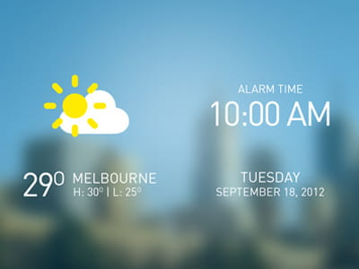
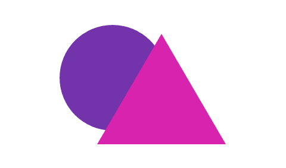

Create OS-style backgrounds with backdrop-filter  |  web.dev

 

- [Home](https://web.dev/)  chevron_right

- [All articles](https://web.dev/blog)

# Create OS-style backgrounds with backdrop-filter

Blurring and color shifting behind an element.

 Jul 26, 2019  • Updated Aug 29, 2019

 
 Adam Argyle

- [Twitter](https://twitter.com/argyleink)  ·

- [GitHub](https://github.com/argyleink)  ·

- [Glitch](https://glitch.com/@argyleink)

 
 Joe Medley

- [Twitter](https://twitter.com/medleyjp)  ·

- [GitHub](https://github.com/jpmedley)

Translucence, blurring, and other effects are useful ways of creating depth while keeping the context of the background content. They support a host of use cases such as frosted glass, video overlays, translucent navigation headers, inappropriate image censoring, image loading, and so on. You may recognize these effects from two popular operating systems: [Windows 10](https://i.kinja-img.com/gawker-media/image/upload/s--9RLXARU4--/c_scale,dpr_2.0,f_auto,fl_progressive,q_80,w_800/trgz8yivyyqrpcnwscu5.png) and [iOS](https://static.businessinsider.com/image/51fd2822eab8eae16e00000b-750.jpg).

 

An example of a frosted glass effect. [Source](https://dribbble.com/shots/733714-Weather-App?list=tags&tag=android).

Historically, these techniques were difficult to implement on the web, requiring less than perfect [hacks or workarounds](https://stackoverflow.com/questions/38145368/css-workaround-to-backdrop-filter). In recent years both [Safari](https://webkit.org/blog/3632/introducing-backdrop-filters/) and Edge have provided these capabilities through the `background-filter` (and alternatively, the `-webkit-backdrop-filter`) property, which dynamically blends foreground and background colors based on filter functions. Now Chrome supports `background-filter`, starting in version 76.

A demonstration of the filter functions for `backdrop-filter`. Try the example on [CodePen](https://codepen.io/robinrendle/pen/LmzLEL).

## Basics [#](https://web.dev/backdrop-filter/#basics)

- The `backdrop-filter` property applies one or more filters to an element, changing the appearance of anything behind the element.
- The overlaying element must be at least partially transparent.
- The overlaying element will get a new stacking context.

error
**Caution:**`backdrop-filter` may harm performance. Test it before deploying.

CSS `backdrop-filter` applies one or more effects to an element that is translucent or transparent. To understand that, consider the images below.

No foreground transparency

`.frosty-glass-pane {[[NEWLINE]]  backdrop-filter: blur(2px);[[NEWLINE]]}`

Foreground transparency

`.frosty-glass-pane {[[NEWLINE]]  opacity: .9;[[NEWLINE]]  backdrop-filter: blur(2px);[[NEWLINE]]}`

The image on the left shows how overlapping elements would be rendered if `backdrop-filter` were not used or supported. The image on the right applies a blurring effect using `backdrop-filter`. Notice that it uses `opacity` in addition to `backdrop-filter`. Without `opacity`, there would be nothing to apply blurring to. It almost goes without saying that if `opacity` is set to `1` (fully opaque) there will be no effect on the background.

The `backdrop-filter` property is like CSS [filters](https://developer.mozilla.org/en-US/docs/Web/CSS/filter) in that all your favorite [filter functions](https://developer.mozilla.org/en-US/docs/Web/CSS/filter#Filter_functions) are supported: `blur()`, `brightness()`, `contrast()`, `opacity()`, `drop-shadow()`, and so on. It also supports the `url()` function if you want to use an external image as the filter, as well as the keywords `none`, `inherit`, `initial`, and `unset`. There are explanations for all of this on [MDN](https://developer.mozilla.org/en-US/docs/Web/CSS/backdrop-filter), including descriptions of syntax, filters, and values.

When `backdrop-filter` is set to anything other than `none`, the browser creates a new [stacking context](https://www.w3.org/TR/CSS21/zindex.html). A [containing block](https://developer.mozilla.org/en-US/docs/Web/CSS/Containing_block) may also be created, but only if the element has absolute and fixed position descendants.

You can combine filters for rich and clever effects, or use just one filter for more subtle or precise effects. You can even combine them with [SVG filters](https://developer.mozilla.org/en-US/docs/Web/SVG/Element/filter).

## Feature detection and fallback [#](https://web.dev/backdrop-filter/#feature-detection-and-fallback)

As with many features of the modern web, you'll want to know whether the user's browser supports `backdrop-filter` before using it. Do this with `@supports()`. For performance reasons, fall back to an image instead of a polyfill when `backdrop-image` isn't supported. The example below shows this.

`@supports (backdrop-filter: none) {[[NEWLINE]]	.background {[[NEWLINE]]		backdrop-filter: blur(10px);[[NEWLINE]]	}[[NEWLINE]]}[[NEWLINE]][[NEWLINE]]@supports not (backdrop-filter: none) {[[NEWLINE]]  .background {[[NEWLINE]]    background-image: blurred-hero.png;[[NEWLINE]]  }[[NEWLINE]]}`

## Examples [#](https://web.dev/backdrop-filter/#examples)

Design techniques and styles previously reserved for native operating systems are now performant and achievable with a single CSS declaration. Let's look at some examples.

### Single filter [#](https://web.dev/backdrop-filter/#single-filter)

In the following example, the frosted effect is achieved by combining color and blur. The blur is supplied by `backdrop-filter`, while the color comes from the element's semi-transparent background color.

`.blur-behind-me {[[NEWLINE]]  background-color: rgba(255, 255, 255, 0.3);[[NEWLINE]]  backdrop-filter: blur(.5rem);[[NEWLINE]]}`

Try this example for yourself in [CodePen](https://codepen.io/netsi1964/pen/JqBLPK).

### Multiple filters [#](https://web.dev/backdrop-filter/#multiple-filters)

Sometimes you'll need multiple filters to achieve the desired effect. To do this, provide a list of filters separated by a space. For example:

`.brighten-saturate-and-blur-behind-me {[[NEWLINE]]  backdrop-filter: brightness(150%) saturate(150%) blur(1rem);[[NEWLINE]]}`

In the following example, each of the four panes has a different combination of backdrop filters while the same set of shapes are animated behind them.

Try this example for yourself in [CodePen](https://codepen.io/pepf/pen/GqZkdj).

### Overlays [#](https://web.dev/backdrop-filter/#overlays)

This example shows how to blur a semi-transparent background to make text readable while stylistically blending with a page's background.

`.modal {[[NEWLINE]]  backdrop-filter: blur(10px);[[NEWLINE]]  background-color: rgba(255, 255, 255, 0.5);[[NEWLINE]]}`

Try this [example](https://mfreed7.github.io/backdrop-filter-feature/examples/scrollable.html) for yourself.

### Text contrast on dynamic backgrounds [#](https://web.dev/backdrop-filter/#text-contrast-on-dynamic-backgrounds)

As stated earlier, `backdrop-filter` allows performant effects that would be difficult or impossible on the web. An example of this is changing a background in respone to an animation. In this example, `backdrop-filter` maintains the high contrast between the text and its background in spite of what's going on behind the text. It starts with the default background color `darkslategray` and uses `backdrop-filter` to invert the colors after the transformation.

`.container::before {[[NEWLINE]]  z-index: 1;[[NEWLINE]]  background-color: darkslategray;[[NEWLINE]]  filter: invert(1);[[NEWLINE]]}[[NEWLINE]][[NEWLINE]].container::after {[[NEWLINE]]	backdrop-filter: invert(1);[[NEWLINE]]  z-index: 3;[[NEWLINE]]}`

Try this example from [Chen Hui Jing](https://www.chenhuijing.com/#%F0%9F%91%9F) in [Codrops](https://tympanus.net/codrops-playground/huijing/Qqpwg5Iy/editor).

## Conclusion [#](https://web.dev/backdrop-filter/#conclusion)

More than 560 of you have upvoted the [Chromium bug](https://crbug.com/497522) over the past few years, clearly marking this as a long awaited CSS feature. Chrome's release of `backdrop-filter` in version 76 brings the web a step closer to truly native-like UI presentation.

### Additional resources [#](https://web.dev/backdrop-filter/#additional-resources)

- [Specification](https://drafts.fxtf.org/filter-effects-2/#BackdropFilterProperty)
- [Chrome Platform Status](https://www.chromestatus.com/feature/5679432723333120)
- [MDN](https://developer.mozilla.org/en-US/docs/Web/CSS/backdrop-filter)
- [`background-filter` at CSS Tricks](https://css-tricks.com/the-backdrop-filter-css-property/)
- [Samples on Codepen](https://codepen.io/tag/backdrop-filter/)

  Last updated: Aug 29, 2019    [Improve article](https://github.com/GoogleChrome/web.dev/blob/master/src/site/content/en/blog/backdrop-filter/index.md)

 [arrow_back Return to all articles](https://web.dev/blog)  [arrow_forward      ### Next article  Keeping things fresh with stale-while-revalidate](https://web.dev/stale-while-revalidate/)