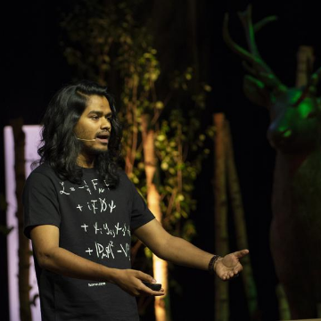

Crowdsourcing Artificial Intelligence for Science: YOU can do a lot! - Sharada Mohanty at dotAI 2018

Crowdsourcing Artificial Intelligence for Science: YOU can do a lot! - Sharada Mohanty at dotAI 2018

https://www.dotconferences.com/2018/05/sharada-mohanty-crowdsourcing-artificial-intelligence-for-science

Much of Artificial Intelligence Research is done by a handful of elite researchers. At the same time, hundreds of thousands of really talented developers and engineers stand behind a mental block that they need a lot of advanced skills to be able to contribute to AI Research, or even to use AI in their own work. Sharada attempts to help clarify the myth, and convince everyone that they indeed have a lot to contribute to AI Research by telling the story of how people from all over the world came together