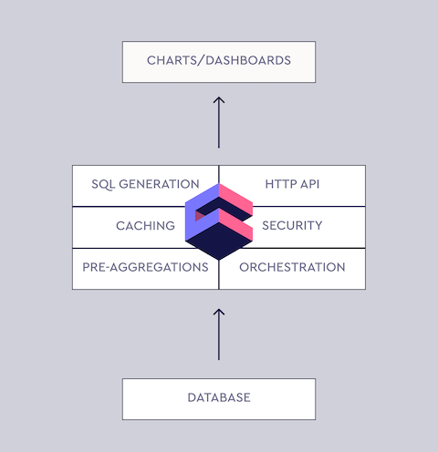
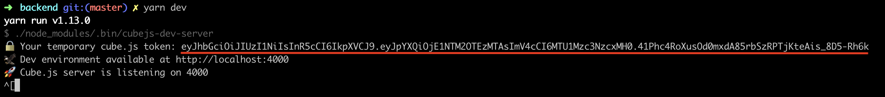
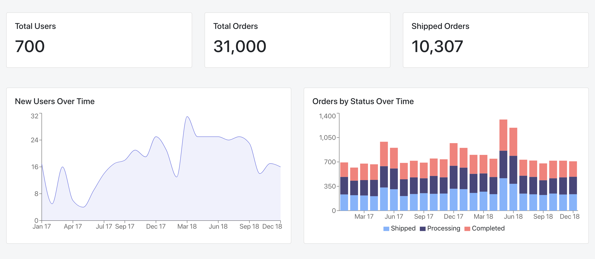

Cube.js, the Open Source Dashboard Framework: Ultimate Guide | Cube.js Blog

# share this article

![](data:image/svg+xml,%3csvg xmlns='http://www.w3.org/2000/svg' viewBox='0 0 64 64' width='32' height='32' class='social-icon social-icon--twitter js-evernote-checked' data-evernote-id='167'%3e%3cg data-evernote-id='168' class='js-evernote-checked'%3e%3ccircle cx='32' cy='32' r='31' fill='%2300aced' style='fill:%236f76d9' data-evernote-id='169' class='js-evernote-checked'%3e%3c/circle%3e%3c/g%3e%3cg data-evernote-id='170' class='js-evernote-checked'%3e%3cpath d='M48%2c22.1c-1.2%2c0.5-2.4%2c0.9-3.8%2c1c1.4-0.8%2c2.4-2.1%2c2.9-3.6c-1.3%2c0.8-2.7%2c1.3-4.2%2c1.6 C41.7%2c19.8%2c40%2c19%2c38.2%2c19c-3.6%2c0-6.6%2c2.9-6.6%2c6.6c0%2c0.5%2c0.1%2c1%2c0.2%2c1.5c-5.5-0.3-10.3-2.9-13.5-6.9c-0.6%2c1-0.9%2c2.1-0.9%2c3.3 c0%2c2.3%2c1.2%2c4.3%2c2.9%2c5.5c-1.1%2c0-2.1-0.3-3-0.8c0%2c0%2c0%2c0.1%2c0%2c0.1c0%2c3.2%2c2.3%2c5.8%2c5.3%2c6.4c-0.6%2c0.1-1.1%2c0.2-1.7%2c0.2c-0.4%2c0-0.8%2c0-1.2-0.1 c0.8%2c2.6%2c3.3%2c4.5%2c6.1%2c4.6c-2.2%2c1.8-5.1%2c2.8-8.2%2c2.8c-0.5%2c0-1.1%2c0-1.6-0.1c2.9%2c1.9%2c6.4%2c2.9%2c10.1%2c2.9c12.1%2c0%2c18.7-10%2c18.7-18.7 c0-0.3%2c0-0.6%2c0-0.8C46%2c24.5%2c47.1%2c23.4%2c48%2c22.1z' fill='white' data-evernote-id='171' class='js-evernote-checked'%3e%3c/path%3e%3c/g%3e%3c/svg%3e)

[Cube.js](https://cube.dev/) is an open source framework for building analytical web applications. It is primarily used to build internal business intelligence tools or to add customer-facing analytics to an existing application. In a majority of cases, the first step of building such an application is an analytics dashboard. It usually starts with—“let’s add an analytics dashboard to our admin panel.” Then, as it always happens in software development, things get more complicated, much more complicated.

When we started working on Cube.js, we wanted to build a tool, which is simple to start but scales easily in features, complexity, and data volume. Cube.js puts down a solid foundation for your future analytical system, whether it is a standalone application or embedded into the existing one.

You can think about this tutorial as **“Cube.js 101.”** I’ll walk you through the basic steps of designing the first dashboard from the database to visualizations.

*[The live demo of the final dashboard is available here.](https://statsbotco.github.io/cubejs/react-dashboard/)  [The full source code is on Github.](https://github.com/statsbotco/cube.js/tree/master/examples/react-dashboard)*

## Architecture

The majority of modern web applications are built as a [single-page application](https://en.wikipedia.org/wiki/Single-page_application), where the frontend is separated from the backend. The backend also usually is split into multiple services, following a [microservice architecture](https://en.wikipedia.org/wiki/Microservices).

Cube.js embraces this approach. Conventionally you run Cube.js Backend as a service. It manages the connection to your database, including queries queue, caching, pre-aggregation, and more. It also exposes an API for your frontend app to build dashboards and other analytics features.

## Backend

Analytics starts with the data and data resides in a database. That is the first thing we need to have in place. You most likely already have a database for your application and usually, it is just fine to use for analytics. Modern popular databases such as Postgres or MySQL are well suited for a simple analytical workload. By simple, I mean a data volume with less than 1 billion rows.

MongoDB is fine as well, the only thing you’ll need to add is MongoDB Connector for BI. It allows executing SQL code on top of your MongoDB data. It is free and can be easily downloaded from the MongoDB website. One more thing to keep in mind is replication. It is considered a bad practice to run analytics queries against your production database mostly because of the performance issues. Cube.js can dramatically reduce the amount of a database’s workload, but still, I’d recommend connecting to the replica.

To summarize— If you use Postgres or MySQL, just create a replica and we’re good to go. If you use MongoDB—download MongoDB Connector for BI and create a replica.

If you don’t have any data for the dashboard, you can load our sample e-commerce Postgres dataset.

	$ curl http://cube.dev/downloads/ecom-dump.sql > ecom-dump.sql
	$ createdb ecom
	$ psql --dbname ecom -f ecom-dump.sql

Now, as we have data in the database, we’re ready to create the Cube.js Backend service. Run the following commands in your terminal:

	$ npm install -g cubejs-cli
	$ cubejs create dashboard-backend -d postgres

The commands above install Cube.js CLI and create a new service, configured to work with Postgres database.

Cube.js uses environment variables for configuration. It uses environment variables starting with `CUBEJS_`. To configure the connection to our database, we need to specify the DB type and name. In the Cube.js project folder replace the contents of `.env` with the following:

	CUBEJS_API_SECRET=SECRET
	CUBEJS_DB_TYPE=postgres
	CUBEJS_DB_NAME=ecom

## Cube.js Data Schema

The next step is to create a [Cube.js data schema](https://cube.dev/docs/getting-started-cubejs-schema). Cube.js uses the data schema to generate an SQL code, which will be executed in your database. The data schema is not a replacement for SQL. It is designed to make SQL reusable and give it a structure while preserving all of its power. Basic elements of the data schema are `measures` and `dimensions`.

**Measure** is referred to as quantitative data, such as the number of units sold, number of unique visits, profit, and so on.

**Dimension** is referred to as categorical data, such as state, gender, product name, or units of time (e.g., day, week, month).

Conventionally, schema files are located in the `schema` folder. Here is an example of the schema, which can be used to describe users’ data.

	cube(`Users`, {
	  sql: `SELECT * FROM users`,

	  measures: {
	    count: {
	      sql: `id`,
	      type: `count`
	    }
	  },

	  dimensions: {
	    city: {
	      sql: `city`,
	      type: `string`
	    },

	    signedUp: {
	      sql: `created_at`,
	      type: `time`
	    },

	    companyName: {
	      sql: `company_name`,
	      type: `string`
	    }
	  }
	});

Now, with the above schema in place, we can send queries to the Cube.js backend about users’ data. Cube.js queries are plain javascript objects. Usually it has one or more `measures`, `dimensions`, and `timeDimensions`.

If we want to answer the question “Where are our users based?” we can send the following query to the Cube.js:

	{
	   measures: ['Users.count'],
	   dimensions: ['Users.city']
	}

Cube.js will generate the required SQL based on the schema, execute it, and send the result back.

Let’s create a slightly more complicated query. We can add a `timeDimensions` to see how the ratio of different cities has been changing every month during the last year. To do this, we will add a `signedUp` time dimension, group it by monthly, and filter only last year’s signups.

	{
	   measures: ['Users.count'],
	   dimensions: ['Users.city'],
	   timeDimensions: [{
	     dimension: 'Users.signedUp',
	     granularity: 'month',
	     dateRange: ['2018-01-31', '2018-12-31']
	   }]
	}

Cube.js can generate simple schemas based on your database’s tables. Let’s generate schemas we need for our dashboard and then start a dev server.

	$ cubejs generate -t users,orders
	$ npm run dev

You can inspect generated schemas and send test queries by opening a development playground at [http://localhost:4000](http://localhost:4000/).

## Frontend

We’ll build our frontend and dashboard with React, using the Cube.js React client. But you can use any framework or just vanilla javascript to build a frontend with Cube.js. [This tutorial shows you how to build a dashboard in pure javascript.](https://statsbot.co/blog/node-express-analytics-dashboard-with-cubejs/)We’ll set everything up using Create React App, which is officially supported by the React team. It packages all the dependencies for React app and makes it easy to get started with a new project. Run the following commands in your terminal:

	$ npx create-react-app dashboard-frontend
	$ cd cubejs-dashboard
	$ npm start

The last line starts a server on port 3000 and opens your web browser at [http://localhost:3000](http://localhost:3000/).

We’ll build our UI with Reactstrap, which is a React wrapper for Bootstrap 4. Install Reactstrap and Bootstrap from NPM. Reactstrap does not include Bootstrap CSS, so this needs to be installed separately:

`$ npm install reactstrap bootstrap --save`
Import Bootstrap CSS in the `src/index.js` file before importing `./index.css`:
`import 'bootstrap/dist/css/bootstrap.min.css';`
Now we are ready to use the Reactstrap components.

The next step is to install Cube.js client to fetch the data from the server and our visualization library to display it. For this tutorial, we’re going to use Recharts. Cube.js is visualization agnostic, meaning you can use any library you want. We’ll also use moment and numeral to nicely format dates and numbers.

`$ npm install --save @cubejs-client/core @cubejs-client/react recharts moment numeral`

Finally, we’re done with dependencies, so let’s go ahead and create our first chart. Replace the contents of `src/App.js` with the following:

	import React, { Component } from "react";
	import {
	 BarChart,
	 Bar,
	 XAxis,
	 YAxis,
	 Tooltip,
	 ResponsiveContainer
	} from "recharts";
	import cubejs from "@cubejs-client/core";
	import moment from "moment";
	import { QueryRenderer } from "@cubejs-client/react";

	const cubejsApi = cubejs(process.env.REACT_APP_CUBEJS_TOKEN, {
	 apiUrl: process.env.REACT_APP_API_URL
	});

	const dateFormatter = item => moment(item).format("MMM YY");

	class App extends Component {
	 render() {
	   return (
	     <QueryRenderer
	       query={{
	         measures: ["Orders.count"],
	         timeDimensions: [
	           {
	             dimension: "Orders.createdAt",
	             dateRange: ["2017-01-01", "2018-12-31"],
	             granularity: "month"
	           }
	         ]
	       }}
	       cubejsApi={cubejsApi}
	       render={({ resultSet }) => {
	         if (!resultSet) {
	           return "Loading...";
	         }

	         return (
	           <ResponsiveContainer width="100%" height={300}>
	             <BarChart data={resultSet.chartPivot()}>
	               <XAxis dataKey="x" tickFormatter={dateFormatter} />
	               <YAxis />
	               <Tooltip labelFormatter={dateFormatter} />
	               <Bar dataKey="Orders.count" fill="rgba(106, 110, 229)" />
	             </BarChart>
	           </ResponsiveContainer>
	         );
	       }}
	     />
	   );
	 }
	}

	export default App;

You can check out this example in the CodeSandbox below.

## Cube.js React 101 - 1

Made by **keydunov**

## Files

public

index.html

src

App.js

index.js

styles.css

.env

package.json

## Dependencies

### npm dependencies

@cubejs-client/core
^0.4.5
@cubejs-client/react
^0.4.5
bootstrap
^4.3.1
moment
^2.24.0
numeral
^2.0.6
react
^16.8.5
react-dom
^16.8.5
react-scripts
2.1.8
reactstrap
^7.1.0
recharts
^1.5.0

[Open In CodeSandbox![](data:image/svg+xml,%3csvg xmlns='http://www.w3.org/2000/svg' aria-label='CodeSandbox' role='presentation' x='0px' y='0px' width='35px' height='35px' viewBox='0 0 1024 1024' style='vertical-align: middle%3b' data-evernote-id='5' class='js-evernote-checked'%3e%3ctitle%3eCodeSandbox%3c/title%3e%3cg id='Layer_1'%3e%3cpolyline fill='currentColor' points='719.001%2c851 719.001%2c639.848 902%2c533.802 902%2c745.267 719.001%2c851'%3e%3c/polyline%3e%3cpolyline fill='currentColor' points='302.082%2c643.438 122.167%2c539.135 122.167%2c747.741 302.082%2c852.573 302.082%2c643.438'%3e%3c/polyline%3e%3cpolyline fill='currentColor' points='511.982%2c275.795 694.939%2c169.633 512.06%2c63 328.436%2c169.987 511.982%2c275.795'%3e%3c/polyline%3e%3c/g%3e%3cg id='Layer_2'%3e%3cpolyline fill='none' stroke='currentColor' stroke-width='80' stroke-miterlimit='10' points='899%2c287.833 509%2c513 509%2c963'%3e%3c/polyline%3e%3cline fill='none' stroke='currentColor' stroke-width='80' stroke-miterlimit='10' x1='122.167' y1='289' x2='511.5' y2='513'%3e%3c/line%3e%3cpolygon fill='none' stroke='currentColor' stroke-width='80' stroke-miterlimit='10' points='121%2c739.083 510.917%2c963.042 901%2c738.333 901%2c288 511%2c62 121%2c289'%3e%3c/polygon%3e%3c/g%3e%3c/svg%3e)](https://codesandbox.io/s/xv0v19l1pp?from-embed)

Cube.js React 101 - 1

[![](data:image/svg+xml,%3csvg xmlns='http://www.w3.org/2000/svg' aria-label='CodeSandbox' role='presentation' x='0px' y='0px' width='1.125em' height='1.125em' viewBox='0 0 1024 1024' style='vertical-align: middle%3b' data-evernote-id='8' class='js-evernote-checked'%3e%3ctitle%3eCodeSandbox%3c/title%3e%3cg id='Layer_1'%3e%3cpolyline fill='currentColor' points='719.001%2c851 719.001%2c639.848 902%2c533.802 902%2c745.267 719.001%2c851'%3e%3c/polyline%3e%3cpolyline fill='currentColor' points='302.082%2c643.438 122.167%2c539.135 122.167%2c747.741 302.082%2c852.573 302.082%2c643.438'%3e%3c/polyline%3e%3cpolyline fill='currentColor' points='511.982%2c275.795 694.939%2c169.633 512.06%2c63 328.436%2c169.987 511.982%2c275.795'%3e%3c/polyline%3e%3c/g%3e%3cg id='Layer_2'%3e%3cpolyline fill='none' stroke='currentColor' stroke-width='80' stroke-miterlimit='10' points='899%2c287.833 509%2c513 509%2c963'%3e%3c/polyline%3e%3cline fill='none' stroke='currentColor' stroke-width='80' stroke-miterlimit='10' x1='122.167' y1='289' x2='511.5' y2='513'%3e%3c/line%3e%3cpolygon fill='none' stroke='currentColor' stroke-width='80' stroke-miterlimit='10' points='121%2c739.083 510.917%2c963.042 901%2c738.333 901%2c288 511%2c62 121%2c289'%3e%3c/polygon%3e%3c/g%3e%3c/svg%3e)Open in Editor](https://codesandbox.io/s/xv0v19l1pp?from-embed)

![](data:image/svg+xml,%3csvg xmlns='http://www.w3.org/2000/svg' class='recharts-surface js-evernote-checked' width='661' height='300' viewBox='0 0 661 300' version='1.1' data-evernote-id='19'%3e%3cdefs data-evernote-id='20' class='js-evernote-checked'%3e%3cclipPath id='recharts2-clip' data-evernote-id='21' class='js-evernote-checked'%3e%3crect x='65' y='5' height='260' width='591' data-evernote-id='22' class='js-evernote-checked'%3e%3c/rect%3e%3c/clipPath%3e%3c/defs%3e%3cg class='recharts-layer recharts-cartesian-axis recharts-xAxis xAxis js-evernote-checked' data-evernote-id='23'%3e%3cline class='recharts-cartesian-axis-line js-evernote-checked' width='591' height='30' x='65' y='265' stroke='%23666' fill='none' x1='65' y1='265' x2='656' y2='265' data-evernote-id='24'%3e%3c/line%3e%3cg class='recharts-cartesian-axis-ticks js-evernote-checked' data-evernote-id='25'%3e%3cg class='recharts-layer recharts-cartesian-axis-tick js-evernote-checked' data-evernote-id='26'%3e%3cline class='recharts-cartesian-axis-tick-line js-evernote-checked' width='591' height='30' x='65' y='265' stroke='%23666' fill='none' x1='77.3125' y1='271' x2='77.3125' y2='265' data-evernote-id='27'%3e%3c/line%3e%3ctext width='591' height='30' x='77.3125' y='273' stroke='none' fill='%23666' class='recharts-text recharts-cartesian-axis-tick-value js-evernote-checked' text-anchor='middle' data-evernote-id='28'%3e%3ctspan x='77.3125' dy='0.71em' data-evernote-id='29' class='js-evernote-checked'%3eJan 17%3c/tspan%3e%3c/text%3e%3c/g%3e%3cg class='recharts-layer recharts-cartesian-axis-tick js-evernote-checked' data-evernote-id='30'%3e%3cline class='recharts-cartesian-axis-tick-line js-evernote-checked' width='591' height='30' x='65' y='265' stroke='%23666' fill='none' x1='151.1875' y1='271' x2='151.1875' y2='265' data-evernote-id='31'%3e%3c/line%3e%3ctext width='591' height='30' x='151.1875' y='273' stroke='none' fill='%23666' class='recharts-text recharts-cartesian-axis-tick-value js-evernote-checked' text-anchor='middle' data-evernote-id='32'%3e%3ctspan x='151.1875' dy='0.71em' data-evernote-id='33' class='js-evernote-checked'%3eApr 17%3c/tspan%3e%3c/text%3e%3c/g%3e%3cg class='recharts-layer recharts-cartesian-axis-tick js-evernote-checked' data-evernote-id='34'%3e%3cline class='recharts-cartesian-axis-tick-line js-evernote-checked' width='591' height='30' x='65' y='265' stroke='%23666' fill='none' x1='225.0625' y1='271' x2='225.0625' y2='265' data-evernote-id='35'%3e%3c/line%3e%3ctext width='591' height='30' x='225.0625' y='273' stroke='none' fill='%23666' class='recharts-text recharts-cartesian-axis-tick-value js-evernote-checked' text-anchor='middle' data-evernote-id='36'%3e%3ctspan x='225.0625' dy='0.71em' data-evernote-id='37' class='js-evernote-checked'%3eJul 17%3c/tspan%3e%3c/text%3e%3c/g%3e%3cg class='recharts-layer recharts-cartesian-axis-tick js-evernote-checked' data-evernote-id='38'%3e%3cline class='recharts-cartesian-axis-tick-line js-evernote-checked' width='591' height='30' x='65' y='265' stroke='%23666' fill='none' x1='274.3125' y1='271' x2='274.3125' y2='265' data-evernote-id='39'%3e%3c/line%3e%3ctext width='591' height='30' x='274.3125' y='273' stroke='none' fill='%23666' class='recharts-text recharts-cartesian-axis-tick-value js-evernote-checked' text-anchor='middle' data-evernote-id='40'%3e%3ctspan x='274.3125' dy='0.71em' data-evernote-id='41' class='js-evernote-checked'%3eSep 17%3c/tspan%3e%3c/text%3e%3c/g%3e%3cg class='recharts-layer recharts-cartesian-axis-tick js-evernote-checked' data-evernote-id='42'%3e%3cline class='recharts-cartesian-axis-tick-line js-evernote-checked' width='591' height='30' x='65' y='265' stroke='%23666' fill='none' x1='348.1875' y1='271' x2='348.1875' y2='265' data-evernote-id='43'%3e%3c/line%3e%3ctext width='591' height='30' x='348.1875' y='273' stroke='none' fill='%23666' class='recharts-text recharts-cartesian-axis-tick-value js-evernote-checked' text-anchor='middle' data-evernote-id='44'%3e%3ctspan x='348.1875' dy='0.71em' data-evernote-id='45' class='js-evernote-checked'%3eDec 17%3c/tspan%3e%3c/text%3e%3c/g%3e%3cg class='recharts-layer recharts-cartesian-axis-tick js-evernote-checked' data-evernote-id='46'%3e%3cline class='recharts-cartesian-axis-tick-line js-evernote-checked' width='591' height='30' x='65' y='265' stroke='%23666' fill='none' x1='422.0625' y1='271' x2='422.0625' y2='265' data-evernote-id='47'%3e%3c/line%3e%3ctext width='591' height='30' x='422.0625' y='273' stroke='none' fill='%23666' class='recharts-text recharts-cartesian-axis-tick-value js-evernote-checked' text-anchor='middle' data-evernote-id='48'%3e%3ctspan x='422.0625' dy='0.71em' data-evernote-id='49' class='js-evernote-checked'%3eMar 18%3c/tspan%3e%3c/text%3e%3c/g%3e%3cg class='recharts-layer recharts-cartesian-axis-tick js-evernote-checked' data-evernote-id='50'%3e%3cline class='recharts-cartesian-axis-tick-line js-evernote-checked' width='591' height='30' x='65' y='265' stroke='%23666' fill='none' x1='495.9375' y1='271' x2='495.9375' y2='265' data-evernote-id='51'%3e%3c/line%3e%3ctext width='591' height='30' x='495.9375' y='273' stroke='none' fill='%23666' class='recharts-text recharts-cartesian-axis-tick-value js-evernote-checked' text-anchor='middle' data-evernote-id='52'%3e%3ctspan x='495.9375' dy='0.71em' data-evernote-id='53' class='js-evernote-checked'%3eJun 18%3c/tspan%3e%3c/text%3e%3c/g%3e%3cg class='recharts-layer recharts-cartesian-axis-tick js-evernote-checked' data-evernote-id='54'%3e%3cline class='recharts-cartesian-axis-tick-line js-evernote-checked' width='591' height='30' x='65' y='265' stroke='%23666' fill='none' x1='569.8125' y1='271' x2='569.8125' y2='265' data-evernote-id='55'%3e%3c/line%3e%3ctext width='591' height='30' x='569.8125' y='273' stroke='none' fill='%23666' class='recharts-text recharts-cartesian-axis-tick-value js-evernote-checked' text-anchor='middle' data-evernote-id='56'%3e%3ctspan x='569.8125' dy='0.71em' data-evernote-id='57' class='js-evernote-checked'%3eSep 18%3c/tspan%3e%3c/text%3e%3c/g%3e%3cg class='recharts-layer recharts-cartesian-axis-tick js-evernote-checked' data-evernote-id='58'%3e%3cline class='recharts-cartesian-axis-tick-line js-evernote-checked' width='591' height='30' x='65' y='265' stroke='%23666' fill='none' x1='643.6875' y1='271' x2='643.6875' y2='265' data-evernote-id='59'%3e%3c/line%3e%3ctext width='591' height='30' x='636.6124992370605' y='273' stroke='none' fill='%23666' class='recharts-text recharts-cartesian-axis-tick-value js-evernote-checked' text-anchor='middle' data-evernote-id='60'%3e%3ctspan x='636.6124992370605' dy='0.71em' data-evernote-id='61' class='js-evernote-checked'%3eDec 18%3c/tspan%3e%3c/text%3e%3c/g%3e%3c/g%3e%3c/g%3e%3cg class='recharts-layer recharts-cartesian-axis recharts-yAxis yAxis js-evernote-checked' data-evernote-id='62'%3e%3cline class='recharts-cartesian-axis-line js-evernote-checked' width='60' height='260' x='5' y='5' stroke='%23666' fill='none' x1='65' y1='5' x2='65' y2='265' data-evernote-id='63'%3e%3c/line%3e%3cg class='recharts-cartesian-axis-ticks js-evernote-checked' data-evernote-id='64'%3e%3cg class='recharts-layer recharts-cartesian-axis-tick js-evernote-checked' data-evernote-id='65'%3e%3cline class='recharts-cartesian-axis-tick-line js-evernote-checked' width='60' height='260' x='5' y='5' stroke='%23666' fill='none' x1='59' y1='265' x2='65' y2='265' data-evernote-id='66'%3e%3c/line%3e%3ctext width='60' height='260' x='57' y='265' stroke='none' fill='%23666' class='recharts-text recharts-cartesian-axis-tick-value js-evernote-checked' text-anchor='end' data-evernote-id='67'%3e%3ctspan x='57' dy='0.355em' data-evernote-id='68' class='js-evernote-checked'%3e0%3c/tspan%3e%3c/text%3e%3c/g%3e%3cg class='recharts-layer recharts-cartesian-axis-tick js-evernote-checked' data-evernote-id='69'%3e%3cline class='recharts-cartesian-axis-tick-line js-evernote-checked' width='60' height='260' x='5' y='5' stroke='%23666' fill='none' x1='59' y1='200' x2='65' y2='200' data-evernote-id='70'%3e%3c/line%3e%3ctext width='60' height='260' x='57' y='200' stroke='none' fill='%23666' class='recharts-text recharts-cartesian-axis-tick-value js-evernote-checked' text-anchor='end' data-evernote-id='71'%3e%3ctspan x='57' dy='0.355em' data-evernote-id='72' class='js-evernote-checked'%3e350%3c/tspan%3e%3c/text%3e%3c/g%3e%3cg class='recharts-layer recharts-cartesian-axis-tick js-evernote-checked' data-evernote-id='73'%3e%3cline class='recharts-cartesian-axis-tick-line js-evernote-checked' width='60' height='260' x='5' y='5' stroke='%23666' fill='none' x1='59' y1='135' x2='65' y2='135' data-evernote-id='74'%3e%3c/line%3e%3ctext width='60' height='260' x='57' y='135' stroke='none' fill='%23666' class='recharts-text recharts-cartesian-axis-tick-value js-evernote-checked' text-anchor='end' data-evernote-id='75'%3e%3ctspan x='57' dy='0.355em' data-evernote-id='76' class='js-evernote-checked'%3e700%3c/tspan%3e%3c/text%3e%3c/g%3e%3cg class='recharts-layer recharts-cartesian-axis-tick js-evernote-checked' data-evernote-id='77'%3e%3cline class='recharts-cartesian-axis-tick-line js-evernote-checked' width='60' height='260' x='5' y='5' stroke='%23666' fill='none' x1='59' y1='70' x2='65' y2='70' data-evernote-id='78'%3e%3c/line%3e%3ctext width='60' height='260' x='57' y='70' stroke='none' fill='%23666' class='recharts-text recharts-cartesian-axis-tick-value js-evernote-checked' text-anchor='end' data-evernote-id='79'%3e%3ctspan x='57' dy='0.355em' data-evernote-id='80' class='js-evernote-checked'%3e1050%3c/tspan%3e%3c/text%3e%3c/g%3e%3cg class='recharts-layer recharts-cartesian-axis-tick js-evernote-checked' data-evernote-id='81'%3e%3cline class='recharts-cartesian-axis-tick-line js-evernote-checked' width='60' height='260' x='5' y='5' stroke='%23666' fill='none' x1='59' y1='5' x2='65' y2='5' data-evernote-id='82'%3e%3c/line%3e%3ctext width='60' height='260' x='57' y='12' stroke='none' fill='%23666' class='recharts-text recharts-cartesian-axis-tick-value js-evernote-checked' text-anchor='end' data-evernote-id='83'%3e%3ctspan x='57' dy='0.355em' data-evernote-id='84' class='js-evernote-checked'%3e1400%3c/tspan%3e%3c/text%3e%3c/g%3e%3c/g%3e%3c/g%3e%3cg class='recharts-layer recharts-bar js-evernote-checked' data-evernote-id='85'%3e%3cg class='recharts-layer recharts-bar-rectangles js-evernote-checked' data-evernote-id='86'%3e%3cg class='recharts-layer js-evernote-checked' data-evernote-id='87'%3e%3cg class='recharts-layer recharts-bar-rectangle js-evernote-checked' data-evernote-id='88'%3e%3cpath fill='rgba(106%2c 110%2c 229)' width='19' height='128.7' x='67.4625' y='136.3' radius='0' class='recharts-rectangle js-evernote-checked' d='M 67.4625%2c136.3 h 19 v 128.7 h -19 Z' data-evernote-id='89'%3e%3c/path%3e%3c/g%3e%3cg class='recharts-layer recharts-bar-rectangle js-evernote-checked' data-evernote-id='90'%3e%3cpath fill='rgba(106%2c 110%2c 229)' width='19' height='114.95714285714286' x='92.0875' y='150.04285714285714' radius='0' class='recharts-rectangle js-evernote-checked' d='M 92.0875%2c150.04285714285714 h 19 v 114.95714285714286 h -19 Z' data-evernote-id='91'%3e%3c/path%3e%3c/g%3e%3cg class='recharts-layer recharts-bar-rectangle js-evernote-checked' data-evernote-id='92'%3e%3cpath fill='rgba(106%2c 110%2c 229)' width='19' height='125.54285714285714' x='116.7125' y='139.45714285714286' radius='0' class='recharts-rectangle js-evernote-checked' d='M 116.7125%2c139.45714285714286 h 19 v 125.54285714285714 h -19 Z' data-evernote-id='93'%3e%3c/path%3e%3c/g%3e%3cg class='recharts-layer recharts-bar-rectangle js-evernote-checked' data-evernote-id='94'%3e%3cpath fill='rgba(106%2c 110%2c 229)' width='19' height='123.68571428571428' x='141.3375' y='141.31428571428572' radius='0' class='recharts-rectangle js-evernote-checked' d='M 141.3375%2c141.31428571428572 h 19 v 123.68571428571428 h -19 Z' data-evernote-id='95'%3e%3c/path%3e%3c/g%3e%3cg class='recharts-layer recharts-bar-rectangle js-evernote-checked' data-evernote-id='96'%3e%3cpath fill='rgba(106%2c 110%2c 229)' width='19' height='183.85714285714286' x='165.9625' y='81.14285714285714' radius='0' class='recharts-rectangle js-evernote-checked' d='M 165.9625%2c81.14285714285714 h 19 v 183.85714285714286 h -19 Z' data-evernote-id='97'%3e%3c/path%3e%3c/g%3e%3cg class='recharts-layer recharts-bar-rectangle js-evernote-checked' data-evernote-id='98'%3e%3cpath fill='rgba(106%2c 110%2c 229)' width='19' height='167.70000000000002' x='190.5875' y='97.29999999999998' radius='0' class='recharts-rectangle js-evernote-checked' d='M 190.5875%2c97.29999999999998 h 19 v 167.70000000000002 h -19 Z' data-evernote-id='99'%3e%3c/path%3e%3c/g%3e%3cg class='recharts-layer recharts-bar-rectangle js-evernote-checked' data-evernote-id='100'%3e%3cpath fill='rgba(106%2c 110%2c 229)' width='19' height='127.39999999999998' x='215.2125' y='137.60000000000002' radius='0' class='recharts-rectangle js-evernote-checked' d='M 215.2125%2c137.60000000000002 h 19 v 127.39999999999998 h -19 Z' data-evernote-id='101'%3e%3c/path%3e%3c/g%3e%3cg class='recharts-layer recharts-bar-rectangle js-evernote-checked' data-evernote-id='102'%3e%3cpath fill='rgba(106%2c 110%2c 229)' width='19' height='133.15714285714284' x='239.8375' y='131.84285714285716' radius='0' class='recharts-rectangle js-evernote-checked' d='M 239.8375%2c131.84285714285716 h 19 v 133.15714285714284 h -19 Z' data-evernote-id='103'%3e%3c/path%3e%3c/g%3e%3cg class='recharts-layer recharts-bar-rectangle js-evernote-checked' data-evernote-id='104'%3e%3cpath fill='rgba(106%2c 110%2c 229)' width='19' height='128.14285714285714' x='264.4625' y='136.85714285714286' radius='0' class='recharts-rectangle js-evernote-checked' d='M 264.4625%2c136.85714285714286 h 19 v 128.14285714285714 h -19 Z' data-evernote-id='105'%3e%3c/path%3e%3c/g%3e%3cg class='recharts-layer recharts-bar-rectangle js-evernote-checked' data-evernote-id='106'%3e%3cpath fill='rgba(106%2c 110%2c 229)' width='19' height='139.1' x='289.0875' y='125.9' radius='0' class='recharts-rectangle js-evernote-checked' d='M 289.0875%2c125.9 h 19 v 139.1 h -19 Z' data-evernote-id='107'%3e%3c/path%3e%3c/g%3e%3cg class='recharts-layer recharts-bar-rectangle js-evernote-checked' data-evernote-id='108'%3e%3cpath fill='rgba(106%2c 110%2c 229)' width='19' height='137.05714285714285' x='313.7125' y='127.94285714285715' radius='0' class='recharts-rectangle js-evernote-checked' d='M 313.7125%2c127.94285714285715 h 19 v 137.05714285714285 h -19 Z' data-evernote-id='109'%3e%3c/path%3e%3c/g%3e%3cg class='recharts-layer recharts-bar-rectangle js-evernote-checked' data-evernote-id='110'%3e%3cpath fill='rgba(106%2c 110%2c 229)' width='19' height='180.14285714285714' x='338.3375' y='84.85714285714286' radius='0' class='recharts-rectangle js-evernote-checked' d='M 338.3375%2c84.85714285714286 h 19 v 180.14285714285714 h -19 Z' data-evernote-id='111'%3e%3c/path%3e%3c/g%3e%3cg class='recharts-layer recharts-bar-rectangle js-evernote-checked' data-evernote-id='112'%3e%3cpath fill='rgba(106%2c 110%2c 229)' width='19' height='167.5142857142857' x='362.9625' y='97.4857142857143' radius='0' class='recharts-rectangle js-evernote-checked' d='M 362.9625%2c97.4857142857143 h 19 v 167.5142857142857 h -19 Z' data-evernote-id='113'%3e%3c/path%3e%3c/g%3e%3cg class='recharts-layer recharts-bar-rectangle js-evernote-checked' data-evernote-id='114'%3e%3cpath fill='rgba(106%2c 110%2c 229)' width='19' height='148.94285714285715' x='387.5875' y='116.05714285714285' radius='0' class='recharts-rectangle js-evernote-checked' d='M 387.5875%2c116.05714285714285 h 19 v 148.94285714285715 h -19 Z' data-evernote-id='115'%3e%3c/path%3e%3c/g%3e%3cg class='recharts-layer recharts-bar-rectangle js-evernote-checked' data-evernote-id='116'%3e%3cpath fill='rgba(106%2c 110%2c 229)' width='19' height='148.75714285714287' x='412.2125' y='116.24285714285713' radius='0' class='recharts-rectangle js-evernote-checked' d='M 412.2125%2c116.24285714285713 h 19 v 148.75714285714287 h -19 Z' data-evernote-id='117'%3e%3c/path%3e%3c/g%3e%3cg class='recharts-layer recharts-bar-rectangle js-evernote-checked' data-evernote-id='118'%3e%3cpath fill='rgba(106%2c 110%2c 229)' width='19' height='138.54285714285712' x='436.8375' y='126.45714285714288' radius='0' class='recharts-rectangle js-evernote-checked' d='M 436.8375%2c126.45714285714288 h 19 v 138.54285714285712 h -19 Z' data-evernote-id='119'%3e%3c/path%3e%3c/g%3e%3cg class='recharts-layer recharts-bar-rectangle js-evernote-checked' data-evernote-id='120'%3e%3cpath fill='rgba(106%2c 110%2c 229)' width='19' height='243.10000000000002' x='461.4625' y='21.899999999999977' radius='0' class='recharts-rectangle js-evernote-checked' d='M 461.4625%2c21.899999999999977 h 19 v 243.10000000000002 h -19 Z' data-evernote-id='121'%3e%3c/path%3e%3c/g%3e%3cg class='recharts-layer recharts-bar-rectangle js-evernote-checked' data-evernote-id='122'%3e%3cpath fill='rgba(106%2c 110%2c 229)' width='19' height='221.18571428571428' x='486.0875' y='43.81428571428572' radius='0' class='recharts-rectangle js-evernote-checked' d='M 486.0875%2c43.81428571428572 h 19 v 221.18571428571428 h -19 Z' data-evernote-id='123'%3e%3c/path%3e%3c/g%3e%3cg class='recharts-layer recharts-bar-rectangle js-evernote-checked' data-evernote-id='124'%3e%3cpath fill='rgba(106%2c 110%2c 229)' width='19' height='135.94285714285715' x='510.7125' y='129.05714285714285' radius='0' class='recharts-rectangle js-evernote-checked' d='M 510.7125%2c129.05714285714285 h 19 v 135.94285714285715 h -19 Z' data-evernote-id='125'%3e%3c/path%3e%3c/g%3e%3cg class='recharts-layer recharts-bar-rectangle js-evernote-checked' data-evernote-id='126'%3e%3cpath fill='rgba(106%2c 110%2c 229)' width='19' height='133.7142857142857' x='535.3375' y='131.2857142857143' radius='0' class='recharts-rectangle js-evernote-checked' d='M 535.3375%2c131.2857142857143 h 19 v 133.7142857142857 h -19 Z' data-evernote-id='127'%3e%3c/path%3e%3c/g%3e%3cg class='recharts-layer recharts-bar-rectangle js-evernote-checked' data-evernote-id='128'%3e%3cpath fill='rgba(106%2c 110%2c 229)' width='19' height='126.1' x='559.9625' y='138.9' radius='0' class='recharts-rectangle js-evernote-checked' d='M 559.9625%2c138.9 h 19 v 126.1 h -19 Z' data-evernote-id='129'%3e%3c/path%3e%3c/g%3e%3cg class='recharts-layer recharts-bar-rectangle js-evernote-checked' data-evernote-id='130'%3e%3cpath fill='rgba(106%2c 110%2c 229)' width='19' height='133.34285714285716' x='584.5875' y='131.65714285714284' radius='0' class='recharts-rectangle js-evernote-checked' d='M 584.5875%2c131.65714285714284 h 19 v 133.34285714285716 h -19 Z' data-evernote-id='131'%3e%3c/path%3e%3c/g%3e%3cg class='recharts-layer recharts-bar-rectangle js-evernote-checked' data-evernote-id='132'%3e%3cpath fill='rgba(106%2c 110%2c 229)' width='19' height='133.34285714285716' x='609.2125' y='131.65714285714284' radius='0' class='recharts-rectangle js-evernote-checked' d='M 609.2125%2c131.65714285714284 h 19 v 133.34285714285716 h -19 Z' data-evernote-id='133'%3e%3c/path%3e%3c/g%3e%3cg class='recharts-layer recharts-bar-rectangle js-evernote-checked' data-evernote-id='134'%3e%3cpath fill='rgba(106%2c 110%2c 229)' width='19' height='131.67142857142858' x='633.8375' y='133.32857142857142' radius='0' class='recharts-rectangle js-evernote-checked' d='M 633.8375%2c133.32857142857142 h 19 v 131.67142857142858 h -19 Z' data-evernote-id='135'%3e%3c/path%3e%3c/g%3e%3c/g%3e%3c/g%3e%3c/g%3e%3c/svg%3e)

Jun
Console
0
Problems
0

%3b cursor: pointer%3b' data-evernote-id='14' class='js-evernote-checked'%3e%3cg%3e%3cpath d='m31 26.4q0 0.3-0.2 0.5l-1.1 1.2q-0.3 0.2-0.6 0.2t-0.5-0.2l-8.7-8.8-8.8 8.8q-0.2 0.2-0.5 0.2t-0.5-0.2l-1.2-1.2q-0.2-0.2-0.2-0.5t0.2-0.5l10.4-10.4q0.3-0.2 0.6-0.2t0.5 0.2l10.4 10.4q0.2 0.2 0.2 0.5z'%3e%3c/path%3e%3c/g%3e%3c/svg%3e)

Let’s look deeper at how we load data and draw the chart.
First, we’re initializing the Cube.js API client:

	const cubejsApi = cubejs(process.env.REACT_APP_CUBEJS_TOKEN, {
	 apiUrl: process.env.REACT_APP_API_URL
	});

Here we are using the `REACT_APP_CUBEJS_TOKEN` and `REACT_APP_API_URL` environment variables. Create React App automatically loads your env variables from the `.env` file if they start with `REACT_APP_`. The Cube.js backend will print the development API token during the startup.

Create a `.env` file with the correct credentials.

	REACT_APP_CUBEJS_TOKEN=COPY-API-TOKEN-FROM-TERMINAL-OUTPUT
	REACT_APP_API_URL=http://localhost:4000/cubejs-api/v1

Next, we are using the QueryRenderer Cube.js React Component to load Orders data.

	<QueryRenderer
	  query={{
	    measures: ["Orders.count"],
	    timeDimensions: [
	      {
	        dimension: "Orders.createdAt",
	        dateRange: ["2017-01-01", "2018-12-31"],
	        granularity: "month"
	      }
	    ]
	  }}
	  cubejsApi={cubejsApi}
	  render={({ resultSet }) => {
	    // Render result
	  }}
	/>

QueryRenderer performs an API request to the Cube.js backend and uses the [render props](https://reactjs.org/docs/render-props.html) technique to let you render the result however you want to. We’ve already covered the query format above, but in case you want to refresh—here is [the query format full reference.](https://cube.dev/docs/query-format)

The `render` parameter of QueryRenderer is a function of the type `({error, resultSet, isLoading}) => React.Node`. The output of this function will be rendered by the QueryRenderer. A `resultSet` is an object containing data obtained from the query. If this object is not defined, it means that the data is still being fetched.

`resultSet` provides multiple methods for data manipulation, but in our case, we need just the `chartPivot` method, which returns data in a format expected by Recharts.

We’ll plot the Orders data as a bar chart inside a responsive container.

	if (!resultSet) {
	  return "Loading...";
	}

	return (
	  <ResponsiveContainer width="100%" height={300}>
	    <BarChart data={resultSet.chartPivot()}>
	      <XAxis dataKey="x" tickFormatter={dateFormatter} />
	      <YAxis />
	      <Tooltip labelFormatter={dateFormatter} />
	      <Bar dataKey="Orders.count" fill="rgba(106, 110, 229)" />
	    </BarChart>
	  </ResponsiveContainer>
	);

## Building a Dashboard

We learned how to build a single chart with Cube.js and Recharts, and we are now ready to start building the whole dashboard. There are some best practices regarding designing the layout of the dashboard. The common practice is to put the most important and high-level metrics on the top as single value charts, sometimes called [KPIs](https://en.wikipedia.org/wiki/Performance_indicator), and then list the relevant breakdowns of those metrics.

Here is the screenshot of our final dashboard with KPIs on top followed by bar and line charts.

First, let’s refactor our chart and extract the common code into a reusable `<Chart />` component. Create an `src/Chart.js` file the following content:

	import React from "react";
	import { Card, CardTitle, CardBody, CardText } from "reactstrap";
	import { QueryRenderer } from "@cubejs-client/react";

	const Chart = ({ cubejsApi, title, query, render }) => (
	 <Card>
	   <CardBody>
	     <CardTitle tag="h5">{title}</CardTitle>
	     <CardText>
	       <QueryRenderer
	         query={query}
	         cubejsApi={cubejsApi}
	         render={({ resultSet }) => {
	           if (!resultSet) {
	             return 
;
	           }

	           return render(resultSet);
	         }}
	       />
	     </CardText>
	   </CardBody>
	 </Card>
	);

	export default Chart;

Next, let’s use this component to create the dashboard. Replace the content of `src/App.js` with the following:

	import React, { Component } from "react";
	import { Container, Row, Col } from "reactstrap";
	import {
	 AreaChart,
	 Area,
	 XAxis,
	 YAxis,
	 Tooltip,
	 ResponsiveContainer,
	 Legend,
	 BarChart,
	 Bar
	} from "recharts";
	import moment from "moment";
	import numeral from "numeral";
	import cubejs from "@cubejs-client/core";
	import Chart from "./Chart.js";

	const cubejsApi = cubejs(process.env.REACT_APP_CUBEJS_TOKEN, {
	 apiUrl: process.env.REACT_APP_API_URL
	});
	const numberFormatter = item => numeral(item).format("0,0");
	const dateFormatter = item => moment(item).format("MMM YY");

	const renderSingleValue = (resultSet, key) => (
	 <h1 height={300}>{numberFormatter(resultSet.chartPivot()[0][key])}</h1>
	);

	class App extends Component {
	 render() {
	   return (
	     <Container fluid>
	       <Row>
	         <Col sm="4">
	           <Chart
	             cubejsApi={cubejsApi}
	             title="Total Users"
	             query={{ measures: ["Users.count"] }}
	             render={resultSet => renderSingleValue(resultSet, "Users.count")}
	           />
	         </Col>
	         <Col sm="4">
	           <Chart
	             cubejsApi={cubejsApi}
	             title="Total Orders"
	             query={{ measures: ["Orders.count"] }}
	             render={resultSet => renderSingleValue(resultSet, "Orders.count")}
	           />
	         </Col>
	         <Col sm="4">
	           <Chart
	             cubejsApi={cubejsApi}
	             title="Shipped Orders"
	             query={{
	               measures: ["Orders.count"],
	               filters: [
	                 {
	                   dimension: "Orders.status",
	                   operator: "equals",
	                   values: ["shipped"]
	                 }
	               ]
	             }}
	             render={resultSet => renderSingleValue(resultSet, "Orders.count")}
	           />
	         </Col>
	       </Row>
	        
	        
	       <Row>
	         <Col sm="6">
	           <Chart
	             cubejsApi={cubejsApi}
	             title="New Users Over Time"
	             query={{
	               measures: ["Users.count"],
	               timeDimensions: [
	                 {
	                   dimension: "Users.createdAt",
	                   dateRange: ["2017-01-01", "2018-12-31"],
	                   granularity: "month"
	                 }
	               ]
	             }}
	             render={resultSet => (
	               <ResponsiveContainer width="100%" height={300}>
	                 <AreaChart data={resultSet.chartPivot()}>
	                   <XAxis dataKey="category" tickFormatter={dateFormatter} />
	                   <YAxis tickFormatter={numberFormatter} />
	                   <Tooltip labelFormatter={dateFormatter} />
	                   <Area
	                     type="monotone"
	                     dataKey="Users.count"
	                     name="Users"
	                     stroke="rgb(106, 110, 229)"
	                     fill="rgba(106, 110, 229, .16)"
	                   />
	                 </AreaChart>
	               </ResponsiveContainer>
	             )}
	           />
	         </Col>
	         <Col sm="6">
	           <Chart
	             cubejsApi={cubejsApi}
	             title="Orders by Status Over time"
	             query={{
	               measures: ["Orders.count"],
	               dimensions: ["Orders.status"],
	               timeDimensions: [
	                 {
	                   dimension: "Orders.createdAt",
	                   dateRange: ["2017-01-01", "2018-12-31"],
	                   granularity: "month"
	                 }
	               ]
	             }}
	             render={resultSet => {
	               return (
	                 <ResponsiveContainer width="100%" height={300}>
	                   <BarChart data={resultSet.chartPivot()}>
	                     <XAxis tickFormatter={dateFormatter} dataKey="x" />
	                     <YAxis tickFormatter={numberFormatter} />
	                     <Bar
	                       stackId="a"
	                       dataKey="shipped, Orders.count"
	                       name="Shipped"
	                       fill="#7DB3FF"
	                     />
	                     <Bar
	                       stackId="a"
	                       dataKey="processing, Orders.count"
	                       name="Processing"
	                       fill="#49457B"
	                     />
	                     <Bar
	                       stackId="a"
	                       dataKey="completed, Orders.count"
	                       name="Completed"
	                       fill="#FF7C78"
	                     />
	                     <Legend />
	                     <Tooltip />
	                   </BarChart>
	                 </ResponsiveContainer>
	               );
	             }}
	           />
	         </Col>
	       </Row>
	     </Container>
	   );
	 }
	}

	export default App;

That is enough to build our first dashboard. Give it a try in the CodeSanbox below.

## Cube.js React 101 - 2

Made by **keydunov**

## Files

public

index.html

src

App.js

Chart.js

index.css

index.js

.env

now.json

package.json

## Dependencies

### npm dependencies

@cubejs-client/core
^0.4.5
@cubejs-client/react
^0.4.5
bootstrap
^4.3.1
moment
^2.24.0
numeral
^2.0.6
react
^16.8.5
react-dom
^16.8.5
react-scripts
2.1.8
reactstrap
^7.1.0
recharts
^1.5.0

[Open In CodeSandbox![](data:image/svg+xml,%3csvg xmlns='http://www.w3.org/2000/svg' aria-label='CodeSandbox' role='presentation' x='0px' y='0px' width='35px' height='35px' viewBox='0 0 1024 1024' style='vertical-align: middle%3b' data-evernote-id='5' class='js-evernote-checked'%3e%3ctitle%3eCodeSandbox%3c/title%3e%3cg id='Layer_1'%3e%3cpolyline fill='currentColor' points='719.001%2c851 719.001%2c639.848 902%2c533.802 902%2c745.267 719.001%2c851'%3e%3c/polyline%3e%3cpolyline fill='currentColor' points='302.082%2c643.438 122.167%2c539.135 122.167%2c747.741 302.082%2c852.573 302.082%2c643.438'%3e%3c/polyline%3e%3cpolyline fill='currentColor' points='511.982%2c275.795 694.939%2c169.633 512.06%2c63 328.436%2c169.987 511.982%2c275.795'%3e%3c/polyline%3e%3c/g%3e%3cg id='Layer_2'%3e%3cpolyline fill='none' stroke='currentColor' stroke-width='80' stroke-miterlimit='10' points='899%2c287.833 509%2c513 509%2c963'%3e%3c/polyline%3e%3cline fill='none' stroke='currentColor' stroke-width='80' stroke-miterlimit='10' x1='122.167' y1='289' x2='511.5' y2='513'%3e%3c/line%3e%3cpolygon fill='none' stroke='currentColor' stroke-width='80' stroke-miterlimit='10' points='121%2c739.083 510.917%2c963.042 901%2c738.333 901%2c288 511%2c62 121%2c289'%3e%3c/polygon%3e%3c/g%3e%3c/svg%3e)](https://codesandbox.io/s/71nz8w20qj?from-embed)

Cube.js React 101 - 2

[![](data:image/svg+xml,%3csvg xmlns='http://www.w3.org/2000/svg' aria-label='CodeSandbox' role='presentation' x='0px' y='0px' width='1.125em' height='1.125em' viewBox='0 0 1024 1024' style='vertical-align: middle%3b' data-evernote-id='8' class='js-evernote-checked'%3e%3ctitle%3eCodeSandbox%3c/title%3e%3cg id='Layer_1'%3e%3cpolyline fill='currentColor' points='719.001%2c851 719.001%2c639.848 902%2c533.802 902%2c745.267 719.001%2c851'%3e%3c/polyline%3e%3cpolyline fill='currentColor' points='302.082%2c643.438 122.167%2c539.135 122.167%2c747.741 302.082%2c852.573 302.082%2c643.438'%3e%3c/polyline%3e%3cpolyline fill='currentColor' points='511.982%2c275.795 694.939%2c169.633 512.06%2c63 328.436%2c169.987 511.982%2c275.795'%3e%3c/polyline%3e%3c/g%3e%3cg id='Layer_2'%3e%3cpolyline fill='none' stroke='currentColor' stroke-width='80' stroke-miterlimit='10' points='899%2c287.833 509%2c513 509%2c963'%3e%3c/polyline%3e%3cline fill='none' stroke='currentColor' stroke-width='80' stroke-miterlimit='10' x1='122.167' y1='289' x2='511.5' y2='513'%3e%3c/line%3e%3cpolygon fill='none' stroke='currentColor' stroke-width='80' stroke-miterlimit='10' points='121%2c739.083 510.917%2c963.042 901%2c738.333 901%2c288 511%2c62 121%2c289'%3e%3c/polygon%3e%3c/g%3e%3c/svg%3e)Open in Editor](https://codesandbox.io/s/71nz8w20qj?from-embed)

##### Total Users

# 700

##### Total Orders

# 31,000

##### Shipped Orders

# 10,307

##### New Users Over Time

![](data:image/svg+xml,%3csvg xmlns='http://www.w3.org/2000/svg' class='recharts-surface js-evernote-checked' width='270' height='300' viewBox='0 0 270 300' version='1.1' data-evernote-id='47'%3e%3cdefs data-evernote-id='48' class='js-evernote-checked'%3e%3cclipPath id='recharts2-clip' data-evernote-id='49' class='js-evernote-checked'%3e%3crect x='65' y='5' height='260' width='200' data-evernote-id='50' class='js-evernote-checked'%3e%3c/rect%3e%3c/clipPath%3e%3c/defs%3e%3cg class='recharts-layer recharts-cartesian-axis recharts-xAxis xAxis js-evernote-checked' data-evernote-id='51'%3e%3cline class='recharts-cartesian-axis-line js-evernote-checked' width='200' height='30' x='65' y='265' stroke='%23666' fill='none' x1='65' y1='265' x2='265' y2='265' data-evernote-id='52'%3e%3c/line%3e%3cg class='recharts-cartesian-axis-ticks js-evernote-checked' data-evernote-id='53'%3e%3cg class='recharts-layer recharts-cartesian-axis-tick js-evernote-checked' data-evernote-id='54'%3e%3cline class='recharts-cartesian-axis-tick-line js-evernote-checked' width='200' height='30' x='65' y='265' stroke='%23666' fill='none' x1='73.69565217391305' y1='271' x2='73.69565217391305' y2='265' data-evernote-id='55'%3e%3c/line%3e%3ctext width='200' height='30' x='73.69565217391305' y='273' stroke='none' fill='%23666' class='recharts-text recharts-cartesian-axis-tick-value js-evernote-checked' text-anchor='middle' data-evernote-id='56'%3e%3ctspan x='73.69565217391305' dy='0.71em' data-evernote-id='57' class='js-evernote-checked'%3eFeb 17%3c/tspan%3e%3c/text%3e%3c/g%3e%3cg class='recharts-layer recharts-cartesian-axis-tick js-evernote-checked' data-evernote-id='58'%3e%3cline class='recharts-cartesian-axis-tick-line js-evernote-checked' width='200' height='30' x='65' y='265' stroke='%23666' fill='none' x1='125.8695652173913' y1='271' x2='125.8695652173913' y2='265' data-evernote-id='59'%3e%3c/line%3e%3ctext width='200' height='30' x='125.8695652173913' y='273' stroke='none' fill='%23666' class='recharts-text recharts-cartesian-axis-tick-value js-evernote-checked' text-anchor='middle' data-evernote-id='60'%3e%3ctspan x='125.8695652173913' dy='0.71em' data-evernote-id='61' class='js-evernote-checked'%3eAug 17%3c/tspan%3e%3c/text%3e%3c/g%3e%3cg class='recharts-layer recharts-cartesian-axis-tick js-evernote-checked' data-evernote-id='62'%3e%3cline class='recharts-cartesian-axis-tick-line js-evernote-checked' width='200' height='30' x='65' y='265' stroke='%23666' fill='none' x1='186.7391304347826' y1='271' x2='186.7391304347826' y2='265' data-evernote-id='63'%3e%3c/line%3e%3ctext width='200' height='30' x='186.7391304347826' y='273' stroke='none' fill='%23666' class='recharts-text recharts-cartesian-axis-tick-value js-evernote-checked' text-anchor='middle' data-evernote-id='64'%3e%3ctspan x='186.7391304347826' dy='0.71em' data-evernote-id='65' class='js-evernote-checked'%3eMar 18%3c/tspan%3e%3c/text%3e%3c/g%3e%3cg class='recharts-layer recharts-cartesian-axis-tick js-evernote-checked' data-evernote-id='66'%3e%3cline class='recharts-cartesian-axis-tick-line js-evernote-checked' width='200' height='30' x='65' y='265' stroke='%23666' fill='none' x1='265' y1='271' x2='265' y2='265' data-evernote-id='67'%3e%3c/line%3e%3ctext width='200' height='30' x='245.61249923706055' y='273' stroke='none' fill='%23666' class='recharts-text recharts-cartesian-axis-tick-value js-evernote-checked' text-anchor='middle' data-evernote-id='68'%3e%3ctspan x='245.61249923706055' dy='0.71em' data-evernote-id='69' class='js-evernote-checked'%3eDec 18%3c/tspan%3e%3c/text%3e%3c/g%3e%3c/g%3e%3c/g%3e%3cg class='recharts-layer recharts-cartesian-axis recharts-yAxis yAxis js-evernote-checked' data-evernote-id='70'%3e%3cline class='recharts-cartesian-axis-line js-evernote-checked' width='60' height='260' x='5' y='5' stroke='%23666' fill='none' x1='65' y1='5' x2='65' y2='265' data-evernote-id='71'%3e%3c/line%3e%3cg class='recharts-cartesian-axis-ticks js-evernote-checked' data-evernote-id='72'%3e%3cg class='recharts-layer recharts-cartesian-axis-tick js-evernote-checked' data-evernote-id='73'%3e%3cline class='recharts-cartesian-axis-tick-line js-evernote-checked' width='60' height='260' x='5' y='5' stroke='%23666' fill='none' x1='59' y1='265' x2='65' y2='265' data-evernote-id='74'%3e%3c/line%3e%3ctext width='60' height='260' x='57' y='265' stroke='none' fill='%23666' class='recharts-text recharts-cartesian-axis-tick-value js-evernote-checked' text-anchor='end' data-evernote-id='75'%3e%3ctspan x='57' dy='0.355em' data-evernote-id='76' class='js-evernote-checked'%3e0%3c/tspan%3e%3c/text%3e%3c/g%3e%3cg class='recharts-layer recharts-cartesian-axis-tick js-evernote-checked' data-evernote-id='77'%3e%3cline class='recharts-cartesian-axis-tick-line js-evernote-checked' width='60' height='260' x='5' y='5' stroke='%23666' fill='none' x1='59' y1='200' x2='65' y2='200' data-evernote-id='78'%3e%3c/line%3e%3ctext width='60' height='260' x='57' y='200' stroke='none' fill='%23666' class='recharts-text recharts-cartesian-axis-tick-value js-evernote-checked' text-anchor='end' data-evernote-id='79'%3e%3ctspan x='57' dy='0.355em' data-evernote-id='80' class='js-evernote-checked'%3e8%3c/tspan%3e%3c/text%3e%3c/g%3e%3cg class='recharts-layer recharts-cartesian-axis-tick js-evernote-checked' data-evernote-id='81'%3e%3cline class='recharts-cartesian-axis-tick-line js-evernote-checked' width='60' height='260' x='5' y='5' stroke='%23666' fill='none' x1='59' y1='135' x2='65' y2='135' data-evernote-id='82'%3e%3c/line%3e%3ctext width='60' height='260' x='57' y='135' stroke='none' fill='%23666' class='recharts-text recharts-cartesian-axis-tick-value js-evernote-checked' text-anchor='end' data-evernote-id='83'%3e%3ctspan x='57' dy='0.355em' data-evernote-id='84' class='js-evernote-checked'%3e16%3c/tspan%3e%3c/text%3e%3c/g%3e%3cg class='recharts-layer recharts-cartesian-axis-tick js-evernote-checked' data-evernote-id='85'%3e%3cline class='recharts-cartesian-axis-tick-line js-evernote-checked' width='60' height='260' x='5' y='5' stroke='%23666' fill='none' x1='59' y1='70' x2='65' y2='70' data-evernote-id='86'%3e%3c/line%3e%3ctext width='60' height='260' x='57' y='70' stroke='none' fill='%23666' class='recharts-text recharts-cartesian-axis-tick-value js-evernote-checked' text-anchor='end' data-evernote-id='87'%3e%3ctspan x='57' dy='0.355em' data-evernote-id='88' class='js-evernote-checked'%3e24%3c/tspan%3e%3c/text%3e%3c/g%3e%3cg class='recharts-layer recharts-cartesian-axis-tick js-evernote-checked' data-evernote-id='89'%3e%3cline class='recharts-cartesian-axis-tick-line js-evernote-checked' width='60' height='260' x='5' y='5' stroke='%23666' fill='none' x1='59' y1='5' x2='65' y2='5' data-evernote-id='90'%3e%3c/line%3e%3ctext width='60' height='260' x='57' y='12' stroke='none' fill='%23666' class='recharts-text recharts-cartesian-axis-tick-value js-evernote-checked' text-anchor='end' data-evernote-id='91'%3e%3ctspan x='57' dy='0.355em' data-evernote-id='92' class='js-evernote-checked'%3e32%3c/tspan%3e%3c/text%3e%3c/g%3e%3c/g%3e%3c/g%3e%3cg class='recharts-layer recharts-area js-evernote-checked' data-evernote-id='93'%3e%3cg class='recharts-layer js-evernote-checked' data-evernote-id='94'%3e%3cdefs data-evernote-id='95' class='js-evernote-checked'%3e%3cclipPath id='animationClipPath-recharts-area-3' data-evernote-id='96' class='js-evernote-checked'%3e%3crect x='65' y='0' width='0' height='266' data-evernote-id='97' class='js-evernote-checked'%3e%3c/rect%3e%3c/clipPath%3e%3c/defs%3e%3cg class='recharts-layer js-evernote-checked' clip-path='url(%23animationClipPath-recharts-area-3)' data-evernote-id='98'%3e%3cg class='recharts-layer js-evernote-checked' data-evernote-id='99'%3e%3cpath stroke='none' fill='rgba(106%2c 110%2c 229%2c .16)' fill-opacity='0.6' width='200' height='260' class='recharts-curve recharts-area-area js-evernote-checked' d='M65%2c126.875C67.89855072463769%2c175.625%2c70.79710144927536%2c224.375%2c73.69565217391305%2c224.375C76.59420289855073%2c224.375%2c79.4927536231884%2c135%2c82.3913043478261%2c135C85.28985507246377%2c135%2c88.18840579710145%2c205.41666666666669%2c91.08695652173913%2c216.25C93.98550724637681%2c227.08333333333334%2c96.88405797101449%2c232.5%2c99.78260869565217%2c232.5C102.68115942028986%2c232.5%2c105.57971014492753%2c205.41666666666669%2c108.47826086956522%2c191.875C111.37681159420289%2c178.33333333333334%2c114.27536231884058%2c162.08333333333334%2c117.17391304347825%2c151.25C120.07246376811594%2c140.41666666666666%2c122.97101449275361%2c132.29166666666666%2c125.8695652173913%2c126.875C128.76811594202897%2c121.45833333333333%2c131.66666666666666%2c124.16666666666667%2c134.56521739130434%2c118.75C137.46376811594203%2c113.33333333333334%2c140.3623188405797%2c94.375%2c143.26086956521738%2c94.375C146.15942028985506%2c94.375%2c149.05797101449275%2c110.625%2c151.95652173913044%2c110.625C154.85507246376812%2c110.625%2c157.75362318840578%2c61.875%2c160.65217391304347%2c61.875C163.55072463768116%2c61.875%2c166.44927536231882%2c78.12500000000004%2c169.3478260869565%2c94.375C172.2463768115942%2c110.625%2c175.14492753623188%2c159.375%2c178.04347826086956%2c159.375C180.94202898550725%2c159.375%2c183.8405797101449%2c13.125%2c186.7391304347826%2c13.125C189.63768115942028%2c13.125%2c192.53623188405797%2c61.875%2c195.43478260869566%2c61.875C198.33333333333334%2c61.875%2c201.231884057971%2c61.875%2c204.1304347826087%2c61.875C207.02898550724638%2c61.875%2c209.92753623188403%2c61.875%2c212.82608695652172%2c61.875C215.7246376811594%2c61.875%2c218.6231884057971%2c70%2c221.52173913043478%2c70C224.42028985507247%2c70%2c227.31884057971013%2c61.875%2c230.2173913043478%2c61.875C233.1159420289855%2c61.875%2c236.0144927536232%2c67.29166666666667%2c238.91304347826087%2c78.125C241.81159420289856%2c88.9583333333333%2c244.71014492753622%2c151.25%2c247.6086956521739%2c151.25C250.5072463768116%2c151.25%2c253.40579710144925%2c126.875%2c256.30434782608694%2c126.875C259.2028985507246%2c126.875%2c262.1014492753623%2c130.9375%2c265%2c135L265%2c265C262.1014492753623%2c265%2c259.2028985507246%2c265%2c256.30434782608694%2c265C253.40579710144925%2c265%2c250.5072463768116%2c265%2c247.6086956521739%2c265C244.71014492753622%2c265%2c241.81159420289856%2c265%2c238.91304347826087%2c265C236.0144927536232%2c265%2c233.1159420289855%2c265%2c230.2173913043478%2c265C227.31884057971013%2c265%2c224.42028985507247%2c265%2c221.52173913043478%2c265C218.6231884057971%2c265%2c215.7246376811594%2c265%2c212.82608695652172%2c265C209.92753623188403%2c265%2c207.02898550724638%2c265%2c204.1304347826087%2c265C201.231884057971%2c265%2c198.33333333333334%2c265%2c195.43478260869566%2c265C192.53623188405797%2c265%2c189.63768115942028%2c265%2c186.7391304347826%2c265C183.8405797101449%2c265%2c180.94202898550725%2c265%2c178.04347826086956%2c265C175.14492753623188%2c265%2c172.2463768115942%2c265%2c169.3478260869565%2c265C166.44927536231882%2c265%2c163.55072463768116%2c265%2c160.65217391304347%2c265C157.75362318840578%2c265%2c154.85507246376812%2c265%2c151.95652173913044%2c265C149.05797101449275%2c265%2c146.15942028985506%2c265%2c143.26086956521738%2c265C140.3623188405797%2c265%2c137.46376811594203%2c265%2c134.56521739130434%2c265C131.66666666666666%2c265%2c128.76811594202897%2c265%2c125.8695652173913%2c265C122.97101449275361%2c265%2c120.07246376811594%2c265%2c117.17391304347825%2c265C114.27536231884058%2c265%2c111.37681159420289%2c265%2c108.47826086956522%2c265C105.57971014492753%2c265%2c102.68115942028986%2c265%2c99.78260869565217%2c265C96.88405797101449%2c265%2c93.98550724637681%2c265%2c91.08695652173913%2c265C88.18840579710145%2c265%2c85.28985507246377%2c265%2c82.3913043478261%2c265C79.4927536231884%2c265%2c76.59420289855073%2c265%2c73.69565217391305%2c265C70.79710144927536%2c265%2c67.89855072463769%2c265%2c65%2c265Z' data-evernote-id='100'%3e%3c/path%3e%3cpath stroke='rgb(106%2c 110%2c 229)' fill='none' fill-opacity='0.6' width='200' height='260' class='recharts-curve recharts-area-curve js-evernote-checked' d='M65%2c126.875C67.89855072463769%2c175.625%2c70.79710144927536%2c224.375%2c73.69565217391305%2c224.375C76.59420289855073%2c224.375%2c79.4927536231884%2c135%2c82.3913043478261%2c135C85.28985507246377%2c135%2c88.18840579710145%2c205.41666666666669%2c91.08695652173913%2c216.25C93.98550724637681%2c227.08333333333334%2c96.88405797101449%2c232.5%2c99.78260869565217%2c232.5C102.68115942028986%2c232.5%2c105.57971014492753%2c205.41666666666669%2c108.47826086956522%2c191.875C111.37681159420289%2c178.33333333333334%2c114.27536231884058%2c162.08333333333334%2c117.17391304347825%2c151.25C120.07246376811594%2c140.41666666666666%2c122.97101449275361%2c132.29166666666666%2c125.8695652173913%2c126.875C128.76811594202897%2c121.45833333333333%2c131.66666666666666%2c124.16666666666667%2c134.56521739130434%2c118.75C137.46376811594203%2c113.33333333333334%2c140.3623188405797%2c94.375%2c143.26086956521738%2c94.375C146.15942028985506%2c94.375%2c149.05797101449275%2c110.625%2c151.95652173913044%2c110.625C154.85507246376812%2c110.625%2c157.75362318840578%2c61.875%2c160.65217391304347%2c61.875C163.55072463768116%2c61.875%2c166.44927536231882%2c78.12500000000004%2c169.3478260869565%2c94.375C172.2463768115942%2c110.625%2c175.14492753623188%2c159.375%2c178.04347826086956%2c159.375C180.94202898550725%2c159.375%2c183.8405797101449%2c13.125%2c186.7391304347826%2c13.125C189.63768115942028%2c13.125%2c192.53623188405797%2c61.875%2c195.43478260869566%2c61.875C198.33333333333334%2c61.875%2c201.231884057971%2c61.875%2c204.1304347826087%2c61.875C207.02898550724638%2c61.875%2c209.92753623188403%2c61.875%2c212.82608695652172%2c61.875C215.7246376811594%2c61.875%2c218.6231884057971%2c70%2c221.52173913043478%2c70C224.42028985507247%2c70%2c227.31884057971013%2c61.875%2c230.2173913043478%2c61.875C233.1159420289855%2c61.875%2c236.0144927536232%2c67.29166666666667%2c238.91304347826087%2c78.125C241.81159420289856%2c88.9583333333333%2c244.71014492753622%2c151.25%2c247.6086956521739%2c151.25C250.5072463768116%2c151.25%2c253.40579710144925%2c126.875%2c256.30434782608694%2c126.875C259.2028985507246%2c126.875%2c262.1014492753623%2c130.9375%2c265%2c135' data-evernote-id='101'%3e%3c/path%3e%3c/g%3e%3c/g%3e%3c/g%3e%3c/g%3e%3c/svg%3e)

##### Orders by Status Over time

![](data:image/svg+xml,%3csvg xmlns='http://www.w3.org/2000/svg' class='recharts-surface js-evernote-checked' width='270' height='300' viewBox='0 0 270 300' version='1.1' data-evernote-id='113'%3e%3cdefs data-evernote-id='114' class='js-evernote-checked'%3e%3cclipPath id='recharts4-clip' data-evernote-id='115' class='js-evernote-checked'%3e%3crect x='65' y='5' height='212' width='200' data-evernote-id='116' class='js-evernote-checked'%3e%3c/rect%3e%3c/clipPath%3e%3c/defs%3e%3cg class='recharts-layer recharts-cartesian-axis recharts-xAxis xAxis js-evernote-checked' data-evernote-id='117'%3e%3cline class='recharts-cartesian-axis-line js-evernote-checked' width='200' height='30' x='65' y='217' stroke='%23666' fill='none' x1='65' y1='217' x2='265' y2='217' data-evernote-id='118'%3e%3c/line%3e%3cg class='recharts-cartesian-axis-ticks js-evernote-checked' data-evernote-id='119'%3e%3cg class='recharts-layer recharts-cartesian-axis-tick js-evernote-checked' data-evernote-id='120'%3e%3cline class='recharts-cartesian-axis-tick-line js-evernote-checked' width='200' height='30' x='65' y='217' stroke='%23666' fill='none' x1='69.16666666666667' y1='223' x2='69.16666666666667' y2='217' data-evernote-id='121'%3e%3c/line%3e%3ctext width='200' height='30' x='69.16666666666667' y='225' stroke='none' fill='%23666' class='recharts-text recharts-cartesian-axis-tick-value js-evernote-checked' text-anchor='middle' data-evernote-id='122'%3e%3ctspan x='69.16666666666667' dy='0.71em' data-evernote-id='123' class='js-evernote-checked'%3eJan 17%3c/tspan%3e%3c/text%3e%3c/g%3e%3cg class='recharts-layer recharts-cartesian-axis-tick js-evernote-checked' data-evernote-id='124'%3e%3cline class='recharts-cartesian-axis-tick-line js-evernote-checked' width='200' height='30' x='65' y='217' stroke='%23666' fill='none' x1='127.50000000000001' y1='223' x2='127.50000000000001' y2='217' data-evernote-id='125'%3e%3c/line%3e%3ctext width='200' height='30' x='127.50000000000001' y='225' stroke='none' fill='%23666' class='recharts-text recharts-cartesian-axis-tick-value js-evernote-checked' text-anchor='middle' data-evernote-id='126'%3e%3ctspan x='127.50000000000001' dy='0.71em' data-evernote-id='127' class='js-evernote-checked'%3eAug 17%3c/tspan%3e%3c/text%3e%3c/g%3e%3cg class='recharts-layer recharts-cartesian-axis-tick js-evernote-checked' data-evernote-id='128'%3e%3cline class='recharts-cartesian-axis-tick-line js-evernote-checked' width='200' height='30' x='65' y='217' stroke='%23666' fill='none' x1='185.83333333333334' y1='223' x2='185.83333333333334' y2='217' data-evernote-id='129'%3e%3c/line%3e%3ctext width='200' height='30' x='185.83333333333334' y='225' stroke='none' fill='%23666' class='recharts-text recharts-cartesian-axis-tick-value js-evernote-checked' text-anchor='middle' data-evernote-id='130'%3e%3ctspan x='185.83333333333334' dy='0.71em' data-evernote-id='131' class='js-evernote-checked'%3eMar 18%3c/tspan%3e%3c/text%3e%3c/g%3e%3cg class='recharts-layer recharts-cartesian-axis-tick js-evernote-checked' data-evernote-id='132'%3e%3cline class='recharts-cartesian-axis-tick-line js-evernote-checked' width='200' height='30' x='65' y='217' stroke='%23666' fill='none' x1='260.83333333333337' y1='223' x2='260.83333333333337' y2='217' data-evernote-id='133'%3e%3c/line%3e%3ctext width='200' height='30' x='245.61249923706055' y='225' stroke='none' fill='%23666' class='recharts-text recharts-cartesian-axis-tick-value js-evernote-checked' text-anchor='middle' data-evernote-id='134'%3e%3ctspan x='245.61249923706055' dy='0.71em' data-evernote-id='135' class='js-evernote-checked'%3eDec 18%3c/tspan%3e%3c/text%3e%3c/g%3e%3c/g%3e%3c/g%3e%3cg class='recharts-layer recharts-cartesian-axis recharts-yAxis yAxis js-evernote-checked' data-evernote-id='136'%3e%3cline class='recharts-cartesian-axis-line js-evernote-checked' width='60' height='212' x='5' y='5' stroke='%23666' fill='none' x1='65' y1='5' x2='65' y2='217' data-evernote-id='137'%3e%3c/line%3e%3cg class='recharts-cartesian-axis-ticks js-evernote-checked' data-evernote-id='138'%3e%3cg class='recharts-layer recharts-cartesian-axis-tick js-evernote-checked' data-evernote-id='139'%3e%3cline class='recharts-cartesian-axis-tick-line js-evernote-checked' width='60' height='212' x='5' y='5' stroke='%23666' fill='none' x1='59' y1='217' x2='65' y2='217' data-evernote-id='140'%3e%3c/line%3e%3ctext width='60' height='212' x='57' y='217' stroke='none' fill='%23666' class='recharts-text recharts-cartesian-axis-tick-value js-evernote-checked' text-anchor='end' data-evernote-id='141'%3e%3ctspan x='57' dy='0.355em' data-evernote-id='142' class='js-evernote-checked'%3e0%3c/tspan%3e%3c/text%3e%3c/g%3e%3cg class='recharts-layer recharts-cartesian-axis-tick js-evernote-checked' data-evernote-id='143'%3e%3cline class='recharts-cartesian-axis-tick-line js-evernote-checked' width='60' height='212' x='5' y='5' stroke='%23666' fill='none' x1='59' y1='164' x2='65' y2='164' data-evernote-id='144'%3e%3c/line%3e%3ctext width='60' height='212' x='57' y='164' stroke='none' fill='%23666' class='recharts-text recharts-cartesian-axis-tick-value js-evernote-checked' text-anchor='end' data-evernote-id='145'%3e%3ctspan x='57' dy='0.355em' data-evernote-id='146' class='js-evernote-checked'%3e350%3c/tspan%3e%3c/text%3e%3c/g%3e%3cg class='recharts-layer recharts-cartesian-axis-tick js-evernote-checked' data-evernote-id='147'%3e%3cline class='recharts-cartesian-axis-tick-line js-evernote-checked' width='60' height='212' x='5' y='5' stroke='%23666' fill='none' x1='59' y1='111' x2='65' y2='111' data-evernote-id='148'%3e%3c/line%3e%3ctext width='60' height='212' x='57' y='111' stroke='none' fill='%23666' class='recharts-text recharts-cartesian-axis-tick-value js-evernote-checked' text-anchor='end' data-evernote-id='149'%3e%3ctspan x='57' dy='0.355em' data-evernote-id='150' class='js-evernote-checked'%3e700%3c/tspan%3e%3c/text%3e%3c/g%3e%3cg class='recharts-layer recharts-cartesian-axis-tick js-evernote-checked' data-evernote-id='151'%3e%3cline class='recharts-cartesian-axis-tick-line js-evernote-checked' width='60' height='212' x='5' y='5' stroke='%23666' fill='none' x1='59' y1='58' x2='65' y2='58' data-evernote-id='152'%3e%3c/line%3e%3ctext width='60' height='212' x='57' y='58' stroke='none' fill='%23666' class='recharts-text recharts-cartesian-axis-tick-value js-evernote-checked' text-anchor='end' data-evernote-id='153'%3e%3ctspan x='57' dy='0.355em' data-evernote-id='154' class='js-evernote-checked'%3e1%2c050%3c/tspan%3e%3c/text%3e%3c/g%3e%3cg class='recharts-layer recharts-cartesian-axis-tick js-evernote-checked' data-evernote-id='155'%3e%3cline class='recharts-cartesian-axis-tick-line js-evernote-checked' width='60' height='212' x='5' y='5' stroke='%23666' fill='none' x1='59' y1='5' x2='65' y2='5' data-evernote-id='156'%3e%3c/line%3e%3ctext width='60' height='212' x='57' y='12' stroke='none' fill='%23666' class='recharts-text recharts-cartesian-axis-tick-value js-evernote-checked' text-anchor='end' data-evernote-id='157'%3e%3ctspan x='57' dy='0.355em' data-evernote-id='158' class='js-evernote-checked'%3e1%2c400%3c/tspan%3e%3c/text%3e%3c/g%3e%3c/g%3e%3c/g%3e%3cg class='recharts-layer recharts-bar js-evernote-checked' data-evernote-id='159'%3e%3cg class='recharts-layer recharts-bar-rectangles js-evernote-checked' data-evernote-id='160'%3e%3cg class='recharts-layer js-evernote-checked' data-evernote-id='161'%3e%3cg class='recharts-layer recharts-bar-rectangle js-evernote-checked' data-evernote-id='162'%3e%3c/g%3e%3cg class='recharts-layer recharts-bar-rectangle js-evernote-checked' data-evernote-id='163'%3e%3c/g%3e%3cg class='recharts-layer recharts-bar-rectangle js-evernote-checked' data-evernote-id='164'%3e%3c/g%3e%3cg class='recharts-layer recharts-bar-rectangle js-evernote-checked' data-evernote-id='165'%3e%3c/g%3e%3cg class='recharts-layer recharts-bar-rectangle js-evernote-checked' data-evernote-id='166'%3e%3c/g%3e%3cg class='recharts-layer recharts-bar-rectangle js-evernote-checked' data-evernote-id='167'%3e%3c/g%3e%3cg class='recharts-layer recharts-bar-rectangle js-evernote-checked' data-evernote-id='168'%3e%3c/g%3e%3cg class='recharts-layer recharts-bar-rectangle js-evernote-checked' data-evernote-id='169'%3e%3c/g%3e%3cg class='recharts-layer recharts-bar-rectangle js-evernote-checked' data-evernote-id='170'%3e%3c/g%3e%3cg class='recharts-layer recharts-bar-rectangle js-evernote-checked' data-evernote-id='171'%3e%3c/g%3e%3cg class='recharts-layer recharts-bar-rectangle js-evernote-checked' data-evernote-id='172'%3e%3c/g%3e%3cg class='recharts-layer recharts-bar-rectangle js-evernote-checked' data-evernote-id='173'%3e%3c/g%3e%3cg class='recharts-layer recharts-bar-rectangle js-evernote-checked' data-evernote-id='174'%3e%3c/g%3e%3cg class='recharts-layer recharts-bar-rectangle js-evernote-checked' data-evernote-id='175'%3e%3c/g%3e%3cg class='recharts-layer recharts-bar-rectangle js-evernote-checked' data-evernote-id='176'%3e%3c/g%3e%3cg class='recharts-layer recharts-bar-rectangle js-evernote-checked' data-evernote-id='177'%3e%3c/g%3e%3cg class='recharts-layer recharts-bar-rectangle js-evernote-checked' data-evernote-id='178'%3e%3c/g%3e%3cg class='recharts-layer recharts-bar-rectangle js-evernote-checked' data-evernote-id='179'%3e%3c/g%3e%3cg class='recharts-layer recharts-bar-rectangle js-evernote-checked' data-evernote-id='180'%3e%3c/g%3e%3cg class='recharts-layer recharts-bar-rectangle js-evernote-checked' data-evernote-id='181'%3e%3c/g%3e%3cg class='recharts-layer recharts-bar-rectangle js-evernote-checked' data-evernote-id='182'%3e%3c/g%3e%3cg class='recharts-layer recharts-bar-rectangle js-evernote-checked' data-evernote-id='183'%3e%3c/g%3e%3cg class='recharts-layer recharts-bar-rectangle js-evernote-checked' data-evernote-id='184'%3e%3c/g%3e%3cg class='recharts-layer recharts-bar-rectangle js-evernote-checked' data-evernote-id='185'%3e%3c/g%3e%3c/g%3e%3c/g%3e%3c/g%3e%3cg class='recharts-layer recharts-bar js-evernote-checked' data-evernote-id='186'%3e%3cg class='recharts-layer recharts-bar-rectangles js-evernote-checked' data-evernote-id='187'%3e%3cg class='recharts-layer js-evernote-checked' data-evernote-id='188'%3e%3cg class='recharts-layer recharts-bar-rectangle js-evernote-checked' data-evernote-id='189'%3e%3c/g%3e%3cg class='recharts-layer recharts-bar-rectangle js-evernote-checked' data-evernote-id='190'%3e%3c/g%3e%3cg class='recharts-layer recharts-bar-rectangle js-evernote-checked' data-evernote-id='191'%3e%3c/g%3e%3cg class='recharts-layer recharts-bar-rectangle js-evernote-checked' data-evernote-id='192'%3e%3c/g%3e%3cg class='recharts-layer recharts-bar-rectangle js-evernote-checked' data-evernote-id='193'%3e%3c/g%3e%3cg class='recharts-layer recharts-bar-rectangle js-evernote-checked' data-evernote-id='194'%3e%3c/g%3e%3cg class='recharts-layer recharts-bar-rectangle js-evernote-checked' data-evernote-id='195'%3e%3c/g%3e%3cg class='recharts-layer recharts-bar-rectangle js-evernote-checked' data-evernote-id='196'%3e%3c/g%3e%3cg class='recharts-layer recharts-bar-rectangle js-evernote-checked' data-evernote-id='197'%3e%3c/g%3e%3cg class='recharts-layer recharts-bar-rectangle js-evernote-checked' data-evernote-id='198'%3e%3c/g%3e%3cg class='recharts-layer recharts-bar-rectangle js-evernote-checked' data-evernote-id='199'%3e%3c/g%3e%3cg class='recharts-layer recharts-bar-rectangle js-evernote-checked' data-evernote-id='200'%3e%3c/g%3e%3cg class='recharts-layer recharts-bar-rectangle js-evernote-checked' data-evernote-id='201'%3e%3c/g%3e%3cg class='recharts-layer recharts-bar-rectangle js-evernote-checked' data-evernote-id='202'%3e%3c/g%3e%3cg class='recharts-layer recharts-bar-rectangle js-evernote-checked' data-evernote-id='203'%3e%3c/g%3e%3cg class='recharts-layer recharts-bar-rectangle js-evernote-checked' data-evernote-id='204'%3e%3c/g%3e%3cg class='recharts-layer recharts-bar-rectangle js-evernote-checked' data-evernote-id='205'%3e%3c/g%3e%3cg class='recharts-layer recharts-bar-rectangle js-evernote-checked' data-evernote-id='206'%3e%3c/g%3e%3cg class='recharts-layer recharts-bar-rectangle js-evernote-checked' data-evernote-id='207'%3e%3c/g%3e%3cg class='recharts-layer recharts-bar-rectangle js-evernote-checked' data-evernote-id='208'%3e%3c/g%3e%3cg class='recharts-layer recharts-bar-rectangle js-evernote-checked' data-evernote-id='209'%3e%3c/g%3e%3cg class='recharts-layer recharts-bar-rectangle js-evernote-checked' data-evernote-id='210'%3e%3c/g%3e%3cg class='recharts-layer recharts-bar-rectangle js-evernote-checked' data-evernote-id='211'%3e%3c/g%3e%3cg class='recharts-layer recharts-bar-rectangle js-evernote-checked' data-evernote-id='212'%3e%3c/g%3e%3c/g%3e%3c/g%3e%3c/g%3e%3cg class='recharts-layer recharts-bar js-evernote-checked' data-evernote-id='213'%3e%3cg class='recharts-layer recharts-bar-rectangles js-evernote-checked' data-evernote-id='214'%3e%3cg class='recharts-layer js-evernote-checked' data-evernote-id='215'%3e%3cg class='recharts-layer recharts-bar-rectangle js-evernote-checked' data-evernote-id='216'%3e%3c/g%3e%3cg class='recharts-layer recharts-bar-rectangle js-evernote-checked' data-evernote-id='217'%3e%3c/g%3e%3cg class='recharts-layer recharts-bar-rectangle js-evernote-checked' data-evernote-id='218'%3e%3c/g%3e%3cg class='recharts-layer recharts-bar-rectangle js-evernote-checked' data-evernote-id='219'%3e%3c/g%3e%3cg class='recharts-layer recharts-bar-rectangle js-evernote-checked' data-evernote-id='220'%3e%3c/g%3e%3cg class='recharts-layer recharts-bar-rectangle js-evernote-checked' data-evernote-id='221'%3e%3c/g%3e%3cg class='recharts-layer recharts-bar-rectangle js-evernote-checked' data-evernote-id='222'%3e%3c/g%3e%3cg class='recharts-layer recharts-bar-rectangle js-evernote-checked' data-evernote-id='223'%3e%3c/g%3e%3cg class='recharts-layer recharts-bar-rectangle js-evernote-checked' data-evernote-id='224'%3e%3c/g%3e%3cg class='recharts-layer recharts-bar-rectangle js-evernote-checked' data-evernote-id='225'%3e%3c/g%3e%3cg class='recharts-layer recharts-bar-rectangle js-evernote-checked' data-evernote-id='226'%3e%3c/g%3e%3cg class='recharts-layer recharts-bar-rectangle js-evernote-checked' data-evernote-id='227'%3e%3c/g%3e%3cg class='recharts-layer recharts-bar-rectangle js-evernote-checked' data-evernote-id='228'%3e%3c/g%3e%3cg class='recharts-layer recharts-bar-rectangle js-evernote-checked' data-evernote-id='229'%3e%3c/g%3e%3cg class='recharts-layer recharts-bar-rectangle js-evernote-checked' data-evernote-id='230'%3e%3c/g%3e%3cg class='recharts-layer recharts-bar-rectangle js-evernote-checked' data-evernote-id='231'%3e%3c/g%3e%3cg class='recharts-layer recharts-bar-rectangle js-evernote-checked' data-evernote-id='232'%3e%3c/g%3e%3cg class='recharts-layer recharts-bar-rectangle js-evernote-checked' data-evernote-id='233'%3e%3c/g%3e%3cg class='recharts-layer recharts-bar-rectangle js-evernote-checked' data-evernote-id='234'%3e%3c/g%3e%3cg class='recharts-layer recharts-bar-rectangle js-evernote-checked' data-evernote-id='235'%3e%3c/g%3e%3cg class='recharts-layer recharts-bar-rectangle js-evernote-checked' data-evernote-id='236'%3e%3c/g%3e%3cg class='recharts-layer recharts-bar-rectangle js-evernote-checked' data-evernote-id='237'%3e%3c/g%3e%3cg class='recharts-layer recharts-bar-rectangle js-evernote-checked' data-evernote-id='238'%3e%3c/g%3e%3cg class='recharts-layer recharts-bar-rectangle js-evernote-checked' data-evernote-id='239'%3e%3c/g%3e%3c/g%3e%3c/g%3e%3c/g%3e%3c/svg%3e)

- Shipped
- Processing
- Completed

350
Console
14
Problems
0

%3b cursor: pointer%3b' data-evernote-id='14' class='js-evernote-checked'%3e%3cg%3e%3cpath d='m31 26.4q0 0.3-0.2 0.5l-1.1 1.2q-0.3 0.2-0.6 0.2t-0.5-0.2l-8.7-8.8-8.8 8.8q-0.2 0.2-0.5 0.2t-0.5-0.2l-1.2-1.2q-0.2-0.2-0.2-0.5t0.2-0.5l10.4-10.4q0.3-0.2 0.6-0.2t0.5 0.2l10.4 10.4q0.2 0.2 0.2 0.5z'%3e%3c/path%3e%3c/g%3e%3c/svg%3e)

## Next Steps

We’ve built a simple proof of concept dashboard with Cube.js. You can check the [live demo here](https://statsbotco.github.io/cubejs/react-dashboard/). The [full source code](https://github.com/statsbotco/cube.js/tree/master/examples/react-dashboard) is available on Github.

To learn more about Cube.js backend deployment, you can refer to the [deployment documentation.](https://cube.dev/docs/deployment) Also, here you can find [more tutorials](https://github.com/statsbotco/cube.js#tutorials) on a variety of topics.

And join our [Slack Community](https://publicslack.com/slacks/cubejs/invites/new)! It is a great to place to get help and stay up to date with new releases.

![](data:image/svg+xml,%3csvg xmlns='http://www.w3.org/2000/svg' viewBox='0 0 64 64' width='41' height='41' class='social-icon social-icon--twitter js-evernote-checked' data-evernote-id='1448'%3e%3cg data-evernote-id='1449' class='js-evernote-checked'%3e%3ccircle cx='32' cy='32' r='31' fill='%2300aced' style='fill:%236f76d9' data-evernote-id='1450' class='js-evernote-checked'%3e%3c/circle%3e%3c/g%3e%3cg data-evernote-id='1451' class='js-evernote-checked'%3e%3cpath d='M48%2c22.1c-1.2%2c0.5-2.4%2c0.9-3.8%2c1c1.4-0.8%2c2.4-2.1%2c2.9-3.6c-1.3%2c0.8-2.7%2c1.3-4.2%2c1.6 C41.7%2c19.8%2c40%2c19%2c38.2%2c19c-3.6%2c0-6.6%2c2.9-6.6%2c6.6c0%2c0.5%2c0.1%2c1%2c0.2%2c1.5c-5.5-0.3-10.3-2.9-13.5-6.9c-0.6%2c1-0.9%2c2.1-0.9%2c3.3 c0%2c2.3%2c1.2%2c4.3%2c2.9%2c5.5c-1.1%2c0-2.1-0.3-3-0.8c0%2c0%2c0%2c0.1%2c0%2c0.1c0%2c3.2%2c2.3%2c5.8%2c5.3%2c6.4c-0.6%2c0.1-1.1%2c0.2-1.7%2c0.2c-0.4%2c0-0.8%2c0-1.2-0.1 c0.8%2c2.6%2c3.3%2c4.5%2c6.1%2c4.6c-2.2%2c1.8-5.1%2c2.8-8.2%2c2.8c-0.5%2c0-1.1%2c0-1.6-0.1c2.9%2c1.9%2c6.4%2c2.9%2c10.1%2c2.9c12.1%2c0%2c18.7-10%2c18.7-18.7 c0-0.3%2c0-0.6%2c0-0.8C46%2c24.5%2c47.1%2c23.4%2c48%2c22.1z' fill='white' data-evernote-id='1452' class='js-evernote-checked'%3e%3c/path%3e%3c/g%3e%3c/svg%3e)

