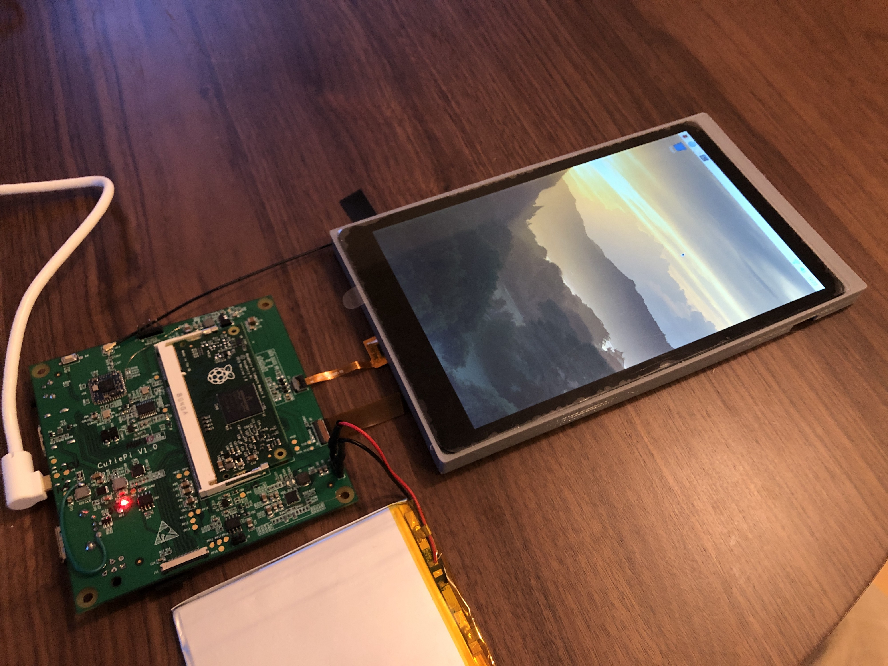
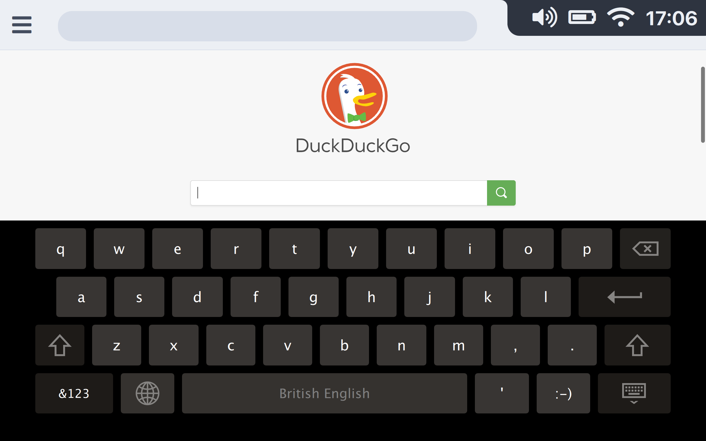
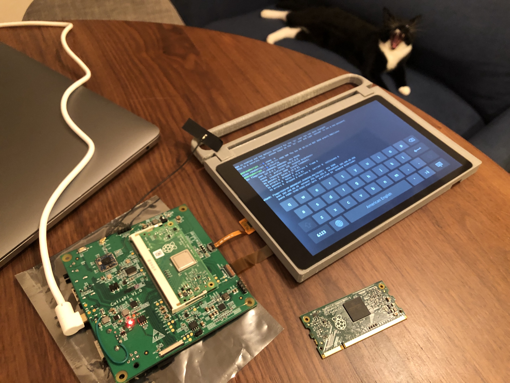

CutiePi First Serving: General Updates

A wild CutiePi board in its natural habitat, pins and ports exposed which is its way of saying “Debug me.”

# CutiePi First Serving: General Updates

[Penk from CutiePi](https://medium.com/@penkchen?source=post_page-----df654c0f8cdf----------------------)

[Oct 3](https://medium.com/cutiepi/cutiepi-first-serving-general-updates-df654c0f8cdf?source=post_page-----df654c0f8cdf----------------------) · 3 min read

Welcome to the [CutiePi](https://cutiepi.io/) blog.

> We serve hot updates, and fresh news, that we hope would be good enough to keep you coming back for more.

**5 things.**

**One**, we have an updated carrier board design, and have started with the layout for the revised PCB, **CutiePi board V1.1**, which will be a 6-layer immersion gold PCB. Once done, we will be ordering additional prototypes to verify our design, which includes the mechanical, enclosure, RF pre-scanning, and safety certifications among other things. You can view the [V1.1 schematics](https://github.com/cutiepi-io/cutiepi-board/blob/v1.1/CutiePi-board-schematic-V1.1.pdf) on Github.

[ ## cutiepi-io/cutiepi-board  ####  github.com](https://github.com/cutiepi-io/cutiepi-board/tree/v1.1?source=post_page-----df654c0f8cdf----------------------)

**Two**, we have made some changes to keep the device thin, most of which are connectors related:

- Use “mid-mount” USB Type-A port
- Replace normal HDMI with mini-HDMI
- Change microUSB to the USB Type-C 6pin for power/charging

Click [here](https://github.com/cutiepi-io/cutiepi-board/blob/v1.1/CutiePi%20V1.1%20Change%20List.xlsx) for a full list of changes. No hackability features were needlessly sacrificed for this endeavour.

* * *

*...*
**Three**, there are also some software-side updates.

CutiePi got its name not because of how anyone in our team looks, cough cough, but because we are using [Qt](https://www.qt.io/) (kjuːt) framework.

Currently we have the Qt open source edition (Qt 5.12.5 LTS) built for Raspbian. We’ll be using QtCompositor (and Wayland), QtWebEngine (Chromium based renderer), and QtVirtualKeyboard to develop the home screen/launcher. Here’s a video of us switching between Scratch3 and the terminal emulator, to show the compositor at work:

Did the way it looked leave a bad after-taste? Don’t worry, we have exactly what you need to clear your palate, our final shell UI design:

Also, we’ve tested Compute Module 3+ Lite (CM3+L) module against our drivers, and to no-one’s surprise, it all works.

CM3+L test and a not-impressed cat

* * *

*...*

**Four**, we might crowdfund. But hear us out first before you start bemoaning us for even thinking this.

We are currently in talks with manufacturers to produce our devices, and they gave a good quotation for orders starting from 1,000 units. There’re also other expenses such as the lab testing fees and the RF certifications, and the final numbers could prove to be too much for a small community-driven project like ours to pay upfront. But **IF** we do decide to crowdfund, we swear on the old gods and new, that 100% of it will be used for mass production of the devices. Nothing will go to development, miscellaneous fees, nor our coffees.

* * *

*...*

**Five** and last, if you haven’t already, please [subscribe to our mailing list](http://eepurl.com/gqDTsf), to receive our monthly updates. You can also check our Github repos for the latest project developments. Do you want to voice out your concerns? Send them over to [hello@cutiepi.io](https://medium.com/cutiepi/cutiepi-first-serving-general-updates-df654c0f8cdfmailto:hello@cutiepi.io) and we’ll be in touch.

And, if you want to help spread the word about this project, please share this post amongst your peers who might be interested in having a slice of CutiePi.

[ ## CutiePi  ###  The all-in-one Raspberry Pi tablet. CutiePi has 5 repositories available. Follow their code on GitHub.     ####  github.com](https://github.com/cutiepi-io?source=post_page-----df654c0f8cdf----------------------)

**And that’s five things.**