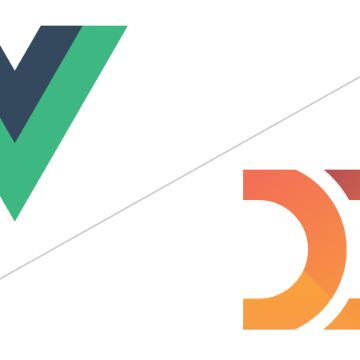

D3.js and Vue.JS – gitconnected.com blog | Level Up Your Coding

D3.js and Vue.JS – gitconnected.com blog | Level Up Your Coding

https://levelup.gitconnected.com/d3-js-and-vue-js-7a6a721eb79f

In this blog I’ll describe how you can integrate D3 in Vue.js. D3 is a popular JavaScript library for visualising data using web standards…