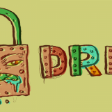
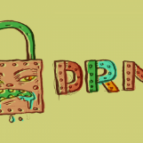

DRM's Dead Canary: How We Just Lost the Web, What We Learned from It, and What We Need to Do Next

# DRM's Dead Canary: How We Just Lost the Web, What We Learned from It, and What We Need to Do Next

DEEPLINKS BLOG

By [Cory Doctorow](https://www.eff.org/about/staff/cory-doctorow)
November 27, 2017

 [Share on Twitter**](https://twitter.com/intent/tweet?text=DRM%27s%20Dead%20Canary%3A%20How%20We%20Just%20Lost%20the%20Web%2C%20What%20We%20Learned%20from%20It%2C%20and%20What%20We%20Need%20to%20Do%20Next&url=https%3A//www.eff.org/deeplinks/2017/10/drms-dead-canary-how-we-just-lost-web-what-we-learned-it-and-what-we-need-do-next&via=eff&related=eff)  [Share on Facebook**](https://www.facebook.com/share.php?u=https%3A//www.eff.org/deeplinks/2017/10/drms-dead-canary-how-we-just-lost-web-what-we-learned-it-and-what-we-need-do-next&title=DRM%27s%20Dead%20Canary%3A%20How%20We%20Just%20Lost%20the%20Web%2C%20What%20We%20Learned%20from%20It%2C%20and%20What%20We%20Need%20to%20Do%20Next)  [Share on Google+**](https://plus.google.com/share?url=https%3A//www.eff.org/deeplinks/2017/10/drms-dead-canary-how-we-just-lost-web-what-we-learned-it-and-what-we-need-do-next)

EFF has been fighting against DRM and the laws behind it for a decade and a half, intervening in the [US Broadcast Flag](https://www.eff.org/broadcastflag), the [UN Broadcasting Treaty](https://www.eff.org/issues/wipo-broadcasting-treaty), the [European DVB CPCM standard](https://w2.eff.org/IP/DVB/dvb_paper_032007.pdf), the [W3C EME standard](https://www.eff.org/press/releases/eff-makes-formal-objection-drm-html5) and many other skirmishes, battles and even wars over the years. With that long history behind us, there are two things we want you to know about DRM:

1. Everybody on the inside secretly knows that DRM *technology* is irrelevant, but DRM *law* is *everything*; and

2. The reason companies want DRM has nothing to do with copyright.

These two points have just been demonstrated in a messy, drawn-out fight over the standardization of DRM in browsers, and since we threw a lot of blood and treasure at that fight, one thing we hope to salvage is an object lesson that will drive these two points home and provide a roadmap for the future of DRM fighting.

## DRM IS TECHNOLOGICALLY BANKRUPT; DRM LAW IS DEADLY

Here's how DRM works, at a high level: a company wants to provide a customer (you) with digital asset (like a movie, a book, a song, a video game or an app), but they want to control what you do with that file after you get it.

So they encrypt the file. [We *love* encryption](https://www.eff.org/encrypt-the-web). Encryption *works*. With relatively little effort, anyone can scramble a file so well that no one will ever be able to decrypt it unless they're provided with the key.

Let's say this is Netflix. They send you a movie that's been scrambled and they want to be sure you can't save it and watch it later from your hard-drive. But they also need to give you a way to view the movie, too. At some point, that means unscrambling the movie. And there's only one way to unscramble a file that's been competently encrypted: you have to use the key.

So Netflix also gives you the unscrambling key.

But if you have the key, you can just unscramble the Netflix movies and save them to your hard drive. How can Netflix give you the key but control how you use it?

Netflix has to *hide* the key, somewhere on your computer, like in a browser extension or an app. This is where the technological bankruptcy comes in. Hiding something well is hard. Hiding something well in a piece of equipment that you give to your adversary to take away with them and do anything they want with is *impossible*.

Maybe you can't find the keys that Netflix hid in your browser. But someone can: a bored grad student with a free weekend, a self-taught genius decapping a chip in their basement, a competitor with a full-service lab. One tiny flaw in any part of the fragile wrapping around these keys, and they're free.

And once that flaw is exposed, anyone can write an app or a browser plugin that does have a save button. It's game over for the DRM technology. (The keys [escape pretty regularly, just as fast as they can be revoked by the DRM companies](https://freedom-to-tinker.com/index.php?s=aacs).)

DRM gets made over the course of years, by skilled engineers, at a cost of millions of dollars. It gets broken in days, by teenagers, with hobbyist equipment. That's not because the DRM-makers are stupid, it's because they're *doing* something stupid.

Which is where the law comes in. DRM law gives rightsholders more forceful, far-ranging legal powers than laws governing any other kind of technology. In 1998, Congress passed the Digital Millennium Copyright Act (DMCA), whose Section 1201 provides for felony liability for anyone commercially engaged in bypassing a DRM system: 5 years in prison and a $500,000 fine for a *first offense*. Even noncommercial bypass of DRM is subject to liability. It also makes it legally risky to even *talk* about how to bypass a DRM system.

So the law shores up DRM systems with a broad range of threats. If Netflix designs a video player that won't save a video unless you break some DRM, they now have the right to sue -- or sic the police -- on any rival that rolls out an improved alternative streaming client, or a video-recorder that works with Netflix. Such tools wouldn't violate copyright law any more than a VCR or a Tivo does, but because that recorder would have to break Netflix DRM, they could use DRM law to crush it.

DRM law goes beyond mere bans on tampering with DRM. Companies also use Section 1201 of the DMCA to threaten security researchers who discover flaws in their products. The law becomes a weapon they can aim at anyone who wants to warn their customers (still you) that the products you're relying on aren't fit for use. That includes warning people about flaws in DRM that expose them to being hacked.

It's not just the USA and not just the DMCA, either. The US Trade Representative has "convinced" countries around the world to adopt a version of this rule.

## DRM HAS NOTHING TO DO WITH COPYRIGHT

DRM law has the power to do untold harm. Because it affords corporations the power to control the use of their products after sale, the power to decide who can compete with them and under what circumstances, and even who gets to warn people about defective products, DRM laws represent a powerful temptation.

Some things that aren't copyright infringement: buying a DVD while you're on holiday and playing it when you get home. It is obviously not a copyright infringement to go into a store in (say) New Delhi and buy a DVD and bring it home to (say) Topeka. The rightsholder made their movie, sold it to the retailer, and you paid the retailer the asking price. This is the opposite of copyright infringement. That's paying for works on the terms set by the rightsholder. But because DRM stops you from playing out-of-region discs on your home player, the studios can invoke copyright law to decide where you can consume the copyrighted works you've bought, fair and square.

Other not-infringements: fixing your car (GM uses DRM to control who can diagnose an engine, and to force mechanics to spend tens of thousands of dollars for diagnostic information they could otherwise determine themselves or obtain from third parties); refilling an ink cartridge (HP pushed out a fake security update that added DRM to millions of inkjet printers so that they'd refuse remanufactured or third-party cartridges), or toasting home-made bread (though this hasn't happened yet, there's no reason that a company couldn't put DRM in its toasters to control whose bread you can use).

It's also not a copyright infringement to watch Netflix in a browser that Netflix hasn't approved. It's not a copyright infringement to record a Netflix movie to watch later. It's not a copyright infringement to feed a Netflix video to an algorithm that can warn you about upcoming strobe effects that can trigger life-threatening seizures in people with photosensitive epilepsy.

## WHICH BRINGS US TO THE W3C

The W3C is the world's foremost open web standards body, a consortium whose members (companies, universities, government agencies, civil society groups and others) engage in protracted wrangles over the best way for everyone to deliver web content. They produce "recommendations" (W3C-speak for "standards") that form the invisible struts that hold up the web. These agreements, produced through patient negotiation and compromise, represent an agreement by major stakeholders about the best (or least-worst) way to solve thorny technological problems.

In 2013, Netflix and a few other media companies convinced the W3C to start work on a DRM system for the web. This DRM system, Encrypted Media Extensions (EME), represented a sharp departure from the W3C's normal business. First, EME would not be a complete standard: the organization would specify an API through which publishers and browser vendors would make DRM work, but the actual "content decryption module" (CDM) wouldn't be defined by the standard. That means that EME was a standard in name only: if you started a browser company and followed all the W3C's recommendations, you still wouldn't be able to play back a Netflix video. For that, you'd need Netflix's permission.

It's hard to overstate how weird this is. Web standards are about "permissionless interoperability." The standards for formatting text mean that anyone can make a tool that can show you pages from the *New York Times*' website; images from Getty; or interactive charts on Bloomberg. The companies can still decide who can see which pages on their websites (by deciding who gets a password and which parts of the website each password unlocks), but they don't get to decide who can make the web browsing program you type the password into in order to access the website.

A web in which every publisher gets to pick and choose which browsers you can use to visit their sites is a very different one from the historical web. Historically, anyone could make a new browser by making sure it adhered to W3C recommendations, and then start to compete. And while the web has always been dominated by a few browsers, *which* browsers dominate have changed every decade or so, as new companies and even nonprofits like Mozilla (who make Firefox) overthrew the old order. Technologies that have stood in the way of this permissionless interoperabilty -- for instance, patent-encumbered video -- have been seen as impediments to the idea of the open web, not standardization opportunities.

When the W3C starts making technologies that only work when they're blessed by a handful of entertainment companies, they're putting their thumbs -- their *fists* -- on the scales in favor of ensuring that the current browser giants get to enjoy a permanent reign.

But that's the least of it. Until EME, W3C standards were designed to give the users of the web (e.g. you) more control over what your computer did while you were accessing other peoples' websites. With EME -- and for the first time ever -- the W3C is designing technology that takes away your control. EME is designed to allow Netflix -- and other big companies -- to decide what your browser does, even (especially) when you disagree about what that should be.

Since the earliest days of computing, there's been a simmering debate about whether computers exist to control their users, or vice versa (as the visionary computer scientist and education specialist Seymour Papert put it, "children should be programming the computer rather than being programmed by it" -- that applies equally well to adults). Every W3C standard until 2017 was on the side of people controlling computers. EME breaks with that. It is a subtle, but profound shift.

## WHY WOULD THE W3C DO THIS?

Ay yi yi. *That* is the three billion user question.

The W3C version of the story goes something like this. The rise of apps has weakened the web. In the pre-app days, the web was the only game in town, so companies had to play by web rules: open standards, open web. But now that apps exist and nearly everyone uses them, big companies can boycott the web, forcing their users into apps instead. That just accelerates the rise of apps, and weakens the web even more. Apps are used to implement DRM, so DRM-using companies are moving to apps. To keep entertainment companies from killing the web outright, the Web must have DRM too.

Even if those companies don't abandon the web altogether, continues this argument, getting them to make their DRM at the W3C is better than letting them make it on an ad-hoc basis. Left to their own devices, they could make DRM that made no accommodations for people with disabilities, and without the W3C's moderating influence, these companies would make DRM that would be hugely invasive of web users' privacy.

The argument ends with a broad justification for DRM: companies have the right to protect their copyrights. We can't expect an organization to spend fortunes creating or licensing movies and then distribute them in a way that lets anyone copy and share them.

We think that these arguments don't hold much water. The web does indeed lack some of its earlier only-game-in-town muscle, but the reality is that companies make money by going where their customers are, and every potential customer has a browser, while only *existing* customers have a company's apps. The more hoops a person has to jump through in order to become your customer, the fewer customers you'll have. Netflix is in a hyper-competitive market with tons of new entrants (e.g. [Disney](http://www.latimes.com/business/la-fi-disney-streaming-20170907-story.html)), and being "that streaming service you can't use on the web" is a serious deficit.

We also think that the media companies and tech companies would struggle to arrive at a standard for DRM outside of the W3C, even a really terrible one. We've spent a lot of time in [the smoke-filled rooms of DRM standardization](https://www.eff.org/effector/15/13) and the core dynamic there is the media companies demanding full-on lockdown for every frame of video, and tech companies insisting that the best anyone can hope for is an ineffectual "speed-bump" that they hope will mollify the media companies. Often as not, these negotiations collapse under their own weight.

Then there's the matter of patents: companies that think DRM is a good idea also *love* software patents, and the result is an impenetrable thicket of patents that make getting anything done next to impossible. The W3C's patent-pooling mechanism (which is uniquely comprehensive in the standards world and stands as an example of the best way to do this sort of thing) was essential to making DRM standardization possible. What's more, there are key players in the DRM world, like Adobe, who hold significant patent portfolios but are playing an ever-dwindling role in the world of DRM (the avowed goal of EME was to "kill Flash"). If the companies involved had to all sit down and negotiate a new patent deal without the W3C's framework, any of these companies could "turn troll" and insist that all the rest would have to shell out big dollars to license their patents -- they have nothing to lose by threatening the entire enterprise, and everything to gain from even a minuscule per-user royalty for something that will be rolled out into *three billion* browsers.

Finally, there's no indication that EME had anything to do with protecting legitimate business interests. Streaming video services like Netflix rely on customers to subscribe to a whole library with constantly added new materials and a recommendation engine to help them navigate the catalog.

DRM for streaming video is all about preventing competition, not protecting copyrights. The purpose of DRM is to give companies the legal tools to prevent activities that would otherwise be allowed. The DRM part doesn't have to "work" (in the sense of preventing copyright infringement) so long as it allows for the invocation of the DMCA.

To see how true this is, just look at Widevine, Google's version of EME. Google bought the company that made Widevine in 2010, but it wasn't until 2016 that an independent researcher actually took a close look at how well it prevented videos from leaking. That researcher, [David Livshits found that Widevine was trivial to circumvent](https://www.wired.com/2016/06/bug-chrome-makes-easy-pirate-movies/), and it had been since its inception, and that the errors that made Widevine so ineffective were obvious to even a cursory examination. If the millions of dollars and the high-power personnel committed to EME were allocated to create a technology that would effectively prevent copyright infringement, then you'd think that Netflix or one of the other media companies in the negotiations would have diverted some of those resources to a quick audit to make sure that the stuff actually worked as advertised.

(Funny story: Livshits is an Israeli at Ben Gurion University, and Israel happens to be the rare country that doesn't ban breaking DRM, meaning that Israelis are among the only people who can do this kind of research without fear of legal retaliation)

But the biggest proof that EME was just a means to shut down legitimate competitors -- and not an effort to protect copyright -- is what happened next.

## A CONTROLLED EXPERIMENT

When EFF joined the W3C, our opening bid was "Don't make DRM."

We put the case to the organization, describing the way that DRM interferes with the important copyright exceptions (like those that allow people to record and remix copyrighted works for critical or transformative purposes) and the myriad problems presented by the DMCA and laws like it around the world.

The executive team of the W3C basically dismissed all arguments about fair use and user rights in copyright as a kind of unfortunate casualty of the need to keep Netflix from ditching the web in favor of apps, and as for the DMCA, they said that they couldn't do anything about this crazy law, but they were sure that the W3C's members were not interested in abusing the DMCA, they just wanted to keep their high-value movies from being shared on the internet.

So we changed tack, and proposed a kind of "controlled experiment" to find out what the DRM fans at the W3C were trying to accomplish.

The W3C is a consensus body: it makes standards by getting everyone in a room to compromise, moving toward a position that everyone can live with. Our ideal world was "No DRM at the W3C," and DRM is a bad enough idea that it was hard to imagine much of a compromise from there.

But after listening closely to the DRM side's disavowals of DMCA abuse, we thought we could find something that would represent an improvement on the current status quo and that should fit with their stated views.

We proposed a kind of DRM non-aggression pact, through which W3C members would promise that they'd only sue people under laws like DMCA 1201 if there was some other law that had been broken. So if someone violates your copyright, or incites someone to violate your copyright, or interferes with your contracts with your users, or misappropriates your trade secrets, or counterfeits your trademarks, or does *anything else that violates your legal rights*, you can throw the book at them.

But if someone goes around your DRM and *doesn't* violate any other laws, the non-aggression pact means that you couldn't use the W3C standardised DRM as a route to legally shut them down. That would protect security researchers, it would protect people analyzing video to add subtitles and other assistive features, it would protect archivists who had the legal right to make copies, and it would protect people making new browsers.

If all you care about is making an effective technology that prevents lawbreaking, this agreement should be a no-brainer. For starters, if you think DRM *is* an effective technology, it shouldn't matter if it's illegal to criticize it.

And since the nonaggression pact kept all other legal rights intact, there was no risk that agreeing to it would allow someone to break the law with impunity. Anyone who violated copyrights (or any other rights) would be square in the DMCA's crosshairs, and companies would have their finger on the trigger.

## NOT SURPRISED BUT STILL DISAPPOINTED

Of course, they *hated* this idea.

The studios, the DRM vendors and the large corporate members of the W3C participated in a desultory, brief "negotiation" before voting to terminate further discussion and press on. The W3C executive helped them dodge discussions, chartering further work on EME without any parallel work on protecting the open web, even as opposition within the W3C mounted.

By the time the dust settled, EME was published after the most divided votes the W3C had ever seen, with the W3C executive unilaterally [declaring](https://lists.w3.org/Archives/Public/public-html-media/2017Jul/0000.html) that issues for security research, accessibility, archiving and innovation had been dealt with as much as they could be (despite the fact that literally nothing binding was done about any of these things). The "consensus" process of the W3C has so thoroughly hijacked that EME's publication was only supported [by 58% of the members](https://arstechnica.com/gadgets/2017/09/drm-for-html5-published-as-a-w3c-recommendation-after-58-4-approval/) who voted in the final poll, and many of those members expressed regret that they were cornered into voting for something they objected to.

When the W3C executive declared that any protections for the open web were incompatible with the desires of the DRM-boosters, it was a kind of ironic vindication. After all, this is where we'd started, with EFF insisting that DRM wasn't compatible with security disclosures, with accessibility, with archiving or innovation. Now, it seemed, everyone agreed.

What's more, they all implicitly agreed that DRM wasn't about protecting copyright. It was about using copyright to seize other rights, like the right to decide who could criticize your product -- or compete with it.

DRM's sham cryptography means that it only works if you're not allowed to know about its defects. This proposition was conclusively proved when [a W3C member proposed](https://lists.w3.org/Archives/Public/public-html-media/2017Jun/0015.html) that the Consortium should protect disclosures that affected EME's "privacy sandbox" and opened users to invasive spying, and within minutes, [Netflix's representative said that even this was not worth considering.](https://lists.w3.org/Archives/Public/public-html-media/2017Jun/0017.html)

In a twisted way, Netflix was right. DRM is so fragile, so incoherent, that it is simply incompatible with the norms of the marketplace and science, in which anyone is free to describe their truthful discoveries, even if they frustrate a giant company's commercial aspirations.

The W3C tacitly admitted this when they tried to convene [a discussion group](https://www.w3.org/2016/02/proposed-techpolig.htm) to come up with some nonbinding guidelines for when EME-using companies should use the power of DRM law to punish their critics and when they should permit the criticism.

## "RESPONSIBLE DISCLOSURE" ON OUR TERMS, OR JAIL

They called this "responsible disclosure," but it was far from the kinds of "responsible disclosure" we see today. In current practice, companies offer security researchers enticements to disclose their discoveries to vendors before going public. These enticements range from bug-bounty programs that pay out cash, to leaderboards that provide glory to the best researchers, to binding promises to act on disclosures in a timely way, rather than crossing their fingers, sitting on the newly discovered defects, and hoping no one else re-discovers them and exploits them.

The tension between independent security researchers and corporations is as old as computing itself. Computers are hard to secure, thanks to their complexity. Perfection is elusive. Keeping the users of networked computers safe requires constant evaluation and disclosure, so that vendors can fix their bugs and users can make informed decisions about which systems are safe enough to use.

But companies aren't always the best stewards of bad news about their own products. As researchers have discovered -- the hard way -- telling a company about its mistakes may be the polite thing to do, but it's very risky behavior, apt to get you threatened with legal reprisals if you go public. Many's the researcher who told a company about a bug, only to have the company sit on that news for an intolerably long time, putting its users at risk. Often, these bugs only come to light when they are independently discovered by bad actors, who figure out how to exploit them, turning them into attacks that compromise millions of users, so many that the bug's existence can no longer be swept under the rug.

As the research world grew more gunshy about talking to companies, companies were forced to make real, binding assurances that they would honor the researchers' discoveries by taking swift action in a defined period, by promising not to threaten researchers over presenting their findings, and even by bidding for researchers' trust with cash bounties. Over the years, the situation has improved, with most big companies offering some kind of disclosure program.

But the reason companies offer those bounties and assurances is that *they have no choice*. Telling the truth about defective products is not illegal, so researchers who discover those truths are under no obligation to play by companies' rules. That forces companies to demonstrate their goodwill with good conduct, binding promises and pot-sweeteners.

Companies definitely want to be able to decide who can tell the truth about their products and when. We know that because when they get the chance to flex that muscle, they flex it. We know it because they said so at the W3C. We know it because they demanded that they get that right as part of the DRM package in EME.

Of all the lows in the W3C DRM process, the most shocking was when the historic defenders of the open web tried to turn an effort to protect the rights of researchers to warn billions of people about harmful defects in their browsers into an effort to advise companies on when they should hold off on exercising that right -- a right they wouldn’t have without the W3C making DRM for the web.

## DRM IS THE OPPOSITE OF SECURITY

From the first days of the DRM fight at the W3C, we understood that the DRM vendors and the media companies they supplied weren't there to protect copyright, they were there to grab legally enforceable non-copyright privileges. We also knew that DRM was incompatible with security research: because DRM relies on obfuscation, anyone who documents how DRM works also makes it stop working.

This is especially clear in terms of what *wasn't* said at the W3C: when we proposed that people should be able to break DRM to generate subtitles or conduct security audits, the arguments were always about whether that was acceptable, but it was never about whether it was possible.

Recall that EME is supposed to be a system that helps companies ensure that their movies aren't saved to their users' hard-drives and shared around the internet. For this to work, it should be, you know, *hard* to do that.

But in every discussion of when people should be allowed to break EME, it was always a given that anyone who wanted to could do so. After all, when you hide secrets in software you give to people who you want to keep them secret from, you are probably going to be disappointed.

From day one, we understood that we would arrive at a point in which the DRM advocates at the W3C would be obliged to admit that the survival of their plan relied on being able to silence people who examined their products.

However, we did hold out hope that when this became clear to everyone, that they would understand that DRM couldn't peacefully co-exist with the open web.

We were wrong.

## THE W3C IS THE CANARY IN THE COALMINE

The success of DRM at the W3C is a parable about market concentration and the precarity of the open web. Hundreds of security researchers lobbied the W3C to protect their work, UNESCO publicly condemned the extension of DRM to the web, and the many crypto-currency members of the W3C warned that using browsers for secure, high-stakes applications like moving around peoples' life-savings could only happen if browsers were subjected to the same security investigations as every other technology in our life (except DRM technologies).

There is no shortage of businesses that want to be able to control what their customers and competitors do with their products. When the US Copyright Office [held hearings on DRM in 2015](http://copyright.gov/1201/2015/comments-020615/), they heard about DRM in medical implants and cars, farm equipment and voting machines. Companies have discovered that adding DRM to their products is the most robust way to control the marketplace, a cheap and reliable way to convert commercial preferences about who can repair, improve, and supply their products into legally enforceable rights.

The marketplace harms from this anti-competitive behavior are easy to see. For example, the [aggressive use of DRM to prevent independent repair shops](https://ifixit.org/revolution) ends up diverting tons of e-waste to landfill or recycling, at the cost of local economies and the ability of people to get full use out of your property. A phone that you recycle instead of repairing is a phone you have to pay to replace -- and repair creates many more jobs than recycling (recycling a ton of e-waste creates [15 jobs](https://ifixit.org/revolution); repairing it creates [150 jobs](https://ifixit.org/revolution)). Repair jobs are local, entrepreneurial jobs, because you don't need a lot of capital to start a repair shop, and your customers want to bring their gadgets to someone local for service (no one wants to send a phone to China for repairs -- let alone a car!).

But those economic harms are only the tip of the iceberg. Laws like DMCA 1201 incentivize DRM by promising the power to control competition, but DRM's worst harms are in the realm of security. When the W3C published EME, it bequeathed to the web an unauditable attack-surface in browsers used by billions of people for their most sensitive and risky applications. These browsers are also the control panels for the Internet of Things: the sensor-studded, actuating gadgets that can see us, hear us, and act on the physical world, with the power to boil, freeze, shock, concuss, or betray us in a thousand ways.

The gadgets themselves have DRM, intended to lock our repairs and third-party consumables, meaning that everything from your toaster to your car is becoming off-limits to scrutiny by independent researchers who can give you unvarnished, unbiased assessments of the security and reliability of these devices.

In a competitive market, you'd expect non-DRM options to proliferate in answer to this bad behavior. After all, no customer *wants* DRM: no car-dealer ever sold a new GM by boasting that it was a felony for your favorite mechanic to fix it.

But we don't live in an a competitive market. Laws like DMCA 1201 undermine the competition that might counter their worst effects.

The companies that fought DRM at the W3C -- browser vendors, Netflix, tech giants, the cable industry -- all trace their success to business strategies that shocked and outraged established industry when they first emerged. Cable started as [unlicensed businesses that retransmitted broadcasts and charged for it](https://www.eff.org/deeplinks/2016/04/save-comcast). Apple's dominance started with [ripping CDs and ignoring the howls of the music industry](https://www.eff.org/deeplinks/2016/04/save-itunes) (just as Firefox got where it is by [blocking obnoxious ads](https://www.eff.org/deeplinks/2016/04/save-firefox) and ignoring the web-publishers who lost millions as a result). Of course, Netflix's revolutionary red envelopes were [treated as a form of theft](https://www.eff.org/deeplinks/2016/04/save-netflix).

These businesses started as pirates and became admirals, and treat their origin stories as legends of plucky, disruptive entrepreneurs taking on a dinosauric and ossified establishment. But they treat any disruption aimed at *them* as an affront to the natural order of things. To [paraphrase Douglas Adams](https://whitmansyawp.wordpress.com/2016/04/13/douglas-adams-quote-technology-rules/), any technology invented in your adolescence is amazing and world-changing; anything invented after you turn 30 is immoral and needs to be destroyed.

## LESSONS FROM THE W3C

Most people don't understand the risks of DRM. The topic is weird, technical, esoteric and take too long to explain. The pro-DRM side wants to make the debate about piracy and counterfeiting, and those are easy stories to tell.

But people who want DRM don't really care about that stuff, and we can prove it: just ask them if they'd be willing to promise not to use the DMCA unless someone is violating copyright, and watch them squirm and weasel about why policing copyright involves shutting down competitive activities that don't violate copyright. Point out that they didn't even question *whether* someone could break their DRM, because, of course, DRM is so technologically incoherent that it only works if it's against the law to understand how it works, and it can be defeated just by looking closely at it.

Ask them to promise not to invoke the DMCA against people who have discovered defects in their products and listen to them defend the idea that companies should get a veto over publication of true facts about their mistakes and demerits.

These inconvenient framings at least establish what we're fighting about, dispensing with the disingenuous arguments about copyright and moving on to the real issues: competition, accessibility, security.

This won't win the fight on its own. These are still wonky and nuanced ideas.

One thing we've learned from 15-plus years fighting DRM: it's easier to get people to take notice of *procedural* issues than *substantive* ones. We labored in vain to get people to take notice of the Broadcasting Treaty, a bafflingly complex and horribly overreaching treaty from WIPO, a UN specialized agency. No one cared until someone started stealing piles of our handouts and [hiding them in the toilets so no one could read them](https://boingboing.net/2011/07/07/wipos-broadcast-trea.html). *That* was global news: it's hard to figure out what something like the Broadcast Treaty is about, but it's easy to call shenanigans when someone tries to hide your literature in the toilet so delegates don’t see the opposing view.

So it was that four years of beating the drum about DRM at the W3C barely broke the surface, but when we resigned from the W3C over the final vote, everyone sat up and took notice, asking how they could help fix things. The short answer is, "It's too late: we resigned because we had run out of options.

But the long answer is a little more hopeful. EFF is [suing the US government](https://www.eff.org/press/releases/eff-lawsuit-takes-dmca-section-1201-research-and-technology-restrictions-violate) to overturn Section 1201 of the DMCA. As we proved at the W3C, there is no appetite for making DRM unless there's a law like DMCA 1201 in the mix. DRM on its own does nothing except provide an opportunity for competitors to kick butt with innovative offerings that cost less and do more.

The Copyright Office is about to hold [fresh hearings](https://www.eff.org/deeplinks/2017/09/once-again-were-asking-copyright-office-protect-your-right-fix-study-secure-remix) about DMCA 1201.

The W3C fight proved that we could shift the debate to the real issues. The incentives that led to the W3C being colonized by DRM are still in play and other organizations will face this threat in the years to come. We'll continue to refine this tactic there and keep fighting, and we'll keep reporting on how it goes so that you can help us fight. All we ask is that you keep paying attention. As we learned at the W3C, we can't do it without you.

## Related Issues:

[DRM](https://www.eff.org/issues/drm)

 [Share on Twitter**](https://twitter.com/intent/tweet?text=DRM%27s%20Dead%20Canary%3A%20How%20We%20Just%20Lost%20the%20Web%2C%20What%20We%20Learned%20from%20It%2C%20and%20What%20We%20Need%20to%20Do%20Next&url=https%3A//www.eff.org/deeplinks/2017/10/drms-dead-canary-how-we-just-lost-web-what-we-learned-it-and-what-we-need-do-next&via=eff&related=eff)  [Share on Facebook**](https://www.facebook.com/share.php?u=https%3A//www.eff.org/deeplinks/2017/10/drms-dead-canary-how-we-just-lost-web-what-we-learned-it-and-what-we-need-do-next&title=DRM%27s%20Dead%20Canary%3A%20How%20We%20Just%20Lost%20the%20Web%2C%20What%20We%20Learned%20from%20It%2C%20and%20What%20We%20Need%20to%20Do%20Next)  [Share on Google+**](https://plus.google.com/share?url=https%3A//www.eff.org/deeplinks/2017/10/drms-dead-canary-how-we-just-lost-web-what-we-learned-it-and-what-we-need-do-next)

## Join EFF Lists

### Join Our Newsletter!

Email updates on news, actions, events in your area, and more.

## Related Updates

[Deeplinks Blog](https://www.eff.org/deeplinks/2017/10/updates?type=blog) by [Cory Doctorow](https://www.eff.org/about/staff/cory-doctorow) | October 25, 2017

### [Epson is Using its eBay "Trusted Status" to Make Competing Ink Sellers Vanish](https://www.eff.org/deeplinks/2017/10/epson-using-its-ebay-trusted-status-make-competing-ink-sellers-vanish)

[Deeplinks Blog](https://www.eff.org/deeplinks/2017/10/updates?type=blog) by [Jeremy Malcolm](https://www.eff.org/about/staff/jeremy-malcolm) | October 23, 2017

### [Portugal Bans Use of DRM to Limit Access to Public Domain Works](https://www.eff.org/deeplinks/2017/10/portugal-bans-use-drm-limit-access-public-domain-works-0)

[Deeplinks Blog](https://www.eff.org/deeplinks/2017/10/updates?type=blog) by [Jeremy Malcolm](https://www.eff.org/about/staff/jeremy-malcolm) | October 23, 2017

### [Portugal Bans Use of DRM to Limit Access to Public Domain Works](https://www.eff.org/deeplinks/2017/10/portugal-bans-use-drm-limit-access-public-domain-works-0)

[Deeplinks Blog](https://www.eff.org/deeplinks/2017/10/updates?type=blog) by [Cory Doctorow](https://www.eff.org/about/staff/cory-doctorow) | September 18, 2017

### [An open letter to the W3C Director, CEO, team and membership](https://www.eff.org/deeplinks/2017/09/open-letter-w3c-director-ceo-team-and-membership)

[Deeplinks Blog](https://www.eff.org/deeplinks/2017/10/updates?type=blog) by [Elliot Harmon](https://www.eff.org/about/staff/elliot-harmon) | July 18, 2017

### [Librarians Call on W3C to Rethink its Support for DRM](https://www.eff.org/deeplinks/2017/07/librarians-call-w3c-rethink-its-support-drm)

[Deeplinks Blog](https://www.eff.org/deeplinks/2017/10/updates?type=blog) by [Cory Doctorow](https://www.eff.org/about/staff/cory-doctorow) | July 13, 2017

### [Net Neutrality Won't Save Us if DRM is Baked Into the Web](https://www.eff.org/deeplinks/2017/07/net-neutrality-wont-save-us-if-drm-baked-web)

[Deeplinks Blog](https://www.eff.org/deeplinks/2017/10/updates?type=blog) by [Cory Doctorow](https://www.eff.org/about/staff/cory-doctorow) | July 12, 2017

### [Notice to the W3C of EFF's appeal of the Director's decision on EME](https://www.eff.org/deeplinks/2017/07/notice-w3c-effs-appeal-directors-decision-eme)

[Deeplinks Blog](https://www.eff.org/deeplinks/2017/10/updates?type=blog) by [Cory Doctorow](https://www.eff.org/about/staff/cory-doctorow) | July 9, 2017

### [New Research Estimates Value of Removing DRM Locks](https://www.eff.org/deeplinks/2017/07/new-research-estimates-value-removing-drm-locks)

[Deeplinks Blog](https://www.eff.org/deeplinks/2017/10/updates?type=blog) by [Cory Doctorow](https://www.eff.org/about/staff/cory-doctorow) | July 6, 2017

### [Amid Unprecedented Controversy, W3C Greenlights DRM for the Web](https://www.eff.org/deeplinks/2017/07/amid-unprecedented-controversy-w3c-greenlights-drm-web)

[Deeplinks Blog](https://www.eff.org/deeplinks/2017/10/updates?type=blog) by Kerry Sheehan | May 24, 2017

### [Book Review: The End of Ownership](https://www.eff.org/deeplinks/2017/05/book-review-end-ownership)

## Pages

- 1
- [2](https://www.eff.org/deeplinks/2017/10/drms-dead-canary-how-we-just-lost-web-what-we-learned-it-and-what-we-need-do-next?page=1)
- [3](https://www.eff.org/deeplinks/2017/10/drms-dead-canary-how-we-just-lost-web-what-we-learned-it-and-what-we-need-do-next?page=2)
- [4](https://www.eff.org/deeplinks/2017/10/drms-dead-canary-how-we-just-lost-web-what-we-learned-it-and-what-we-need-do-next?page=3)
- [5](https://www.eff.org/deeplinks/2017/10/drms-dead-canary-how-we-just-lost-web-what-we-learned-it-and-what-we-need-do-next?page=4)
- [6](https://www.eff.org/deeplinks/2017/10/drms-dead-canary-how-we-just-lost-web-what-we-learned-it-and-what-we-need-do-next?page=5)
- [7](https://www.eff.org/deeplinks/2017/10/drms-dead-canary-how-we-just-lost-web-what-we-learned-it-and-what-we-need-do-next?page=6)
- [8](https://www.eff.org/deeplinks/2017/10/drms-dead-canary-how-we-just-lost-web-what-we-learned-it-and-what-we-need-do-next?page=7)
- [9](https://www.eff.org/deeplinks/2017/10/drms-dead-canary-how-we-just-lost-web-what-we-learned-it-and-what-we-need-do-next?page=8)
- [next ›](https://www.eff.org/deeplinks/2017/10/drms-dead-canary-how-we-just-lost-web-what-we-learned-it-and-what-we-need-do-next?page=1)
- [last »](https://www.eff.org/deeplinks/2017/10/drms-dead-canary-how-we-just-lost-web-what-we-learned-it-and-what-we-need-do-next?page=29)