Darts, Dice, and Coins

# Darts, Dice, and Coins: Sampling from a Discrete Distribution

### Last Major Update: December 29, 2011

Earlier this year, I asked a question on Stack Overflow about[a data structure for loaded dice](http://stackoverflow.com/q/5027757/501557). Specifically, I was interested in answering this question:

"You are given an n-sided die where side i has probability pi of being rolled. What is the most efficient data structure for simulating rolls of the die?"

This data structure could be used for many purposes. For starters, you could use it to simulate rolls of a fair, six-sided die by assigning probability 1616 to each of the sides of the die, or a to simulate a fair coin by simulating a two-sided die where each side has probability 1212 of coming up. You could also use this data structure to directly simulate the total of two fair six-sided dice being thrown by having an 11-sided die (whose faces were 2, 3, 4, ..., 12), where each side was appropriately weighted with the probability that this total would show if you used two fair dice. However, you could also use this data structure to simulate loaded dice. For example, if you were playing [craps](http://en.wikipedia.org/wiki/Craps) with dice that you knew weren't perfectly fair, you might use the data structure to simulate many rolls of the dice to see what the optimal strategy would be. You could also consider simulating an imperfect[roulette wheel](http://en.wikipedia.org/wiki/Roulette) in the same way.

Outside the domain of game-playing, you could also use this data structure in robotics simulations where sensors have known failure rates. For example, if a range sensor has a 95% chance of giving the right value back, a 4% chance of giving back a value that's too small, and a 1% chance of handing back a value that's too large, you could use this data structure to simulate readings from the sensor by generating a random outcome and simulating the sensor reading in that case.

The answer I received on Stack Overflow impressed me for two reasons. First, the solution pointed me at a powerful technique called the**alias method** that, under certain reasonable assumptions about the machine model, is capable of simulating rolls of the die in O(1)O(1)time after a simple preprocessing step. Second, and perhaps more surprisingly, this algorithm has been known for decades, but I had not once encountered it! Considering how much processing time is dedicated to simulation, I would have expected this technique to be better- known. A few quick Google searches turned up a wealth of information on the technique, but I couldn't find a single site that compiled together the intuition and explanation behind the technique.

This writeup is my attempt to give a quick survey of various approaches for simulating a loaded die, ranging from simple techniques that are highly impractical to the very optimized and efficient alias method. My hope here is to capture different intuitions about the problem and how each highlights some new aspect of simulating loaded dice. For each approach, my goal is to explore the motivating idea, core algorithm, correctness proof, and runtime analysis (in terms of time, memory, and randomness required).

##  Preliminaries

Before I go into any of the specific details of the different techniques, let's first standardize our notation and terminology.

In the introduction to this writeup, I used the term "loaded die" to describe a general scenario where there are is a finite set of outcomes, each of which has some associated probability. Formally, this is termed a[discrete probability distribution](http://en.wikipedia.org/wiki/Discrete_distribution#Discrete_probability_distribution), and the problem of simulating the loaded die is called **sampling from a discrete distribution**. To describe our discrete probability distribution (loaded die), we will assume that we are given a set of n probabilities p0,p1,...,pn−1p0,p1,...,pn−1 associated with outcomes 0,1,...,n−10,1,...,n−1. Although the outcomes can be anything (heads/tails, numbers on a die, colors, etc.), for simplicity I'll assume that the outcome is some positive natural number that corresponds to the given index.

Dealing with real numbers on a computer is a bit of computation gray area. There are many fast algorithms whose speed is derived purely from the ability to, in constant time, [compute the floor function of an arbitrary real number](http://cstheory.stackexchange.com/a/3648/4354), and numerical inaccuracies in floating-point representations can entirely ruin certain algorithms. Consequently, before we embark on any discussion of algorithms for working with probabilities, which enter the dark world of real numbers, I should clarify what I assume the computer can and cannot do.

In what follows, I will assume that all of the following operations can be done in constant time:

- **Addition, subtraction, multiplication, division, and comparison of arbitrary real numbers**. We will need to be able to do this in order to manipulate probabilities. This may seem like a very strong assumption, but if we assume that the precision of any real number is bounded by some polynomial of the machine word size (for example, a 64-bit double on a 32-bit machine), then I don't believe that this is too unreasonable.
- **Generation of a uniform real number in the range [0, 1).** In order to simulate randomness, we need some kind of random source. I assume that we can, in constant time, generate an arbitrary-precision real number. This is far beyond what could ever be actually done on a computer, but for the purposes of this discussion I think that it's fine to do so. If we are willing to accept some loss of precision by saying an arbitrary [IEEE-754 double](http://en.wikipedia.org/wiki/IEEE_754-2008) in the range [0, 1], then we do indeed lose some precision, but are probably accurate enough for most applications.
- **Computing the integer floor of a real number.** This is reasonable if we assume that we are working with IEEE-754 doubles, but is in general not a reasonable request of a computer.

It is worth wondering whether or not it's unreasonable to assume that we can do all of these operations efficiently. In practice, we rarely have probabilities specified to a level of precision where the rounding error inherent in an IEEE-754 double will cause significant problems, and so we can get all of the above for free by just doing everything with IEEE doubles. However, if we are in an environment where the probabilities are specified *exactly* as high-precision rational numbers, then these constraints may be unreasonable.

##  Simulating a Fair Die

Before we generalize to the special case of rolling an arbitrarily loaded die, let's begin by starting with a simpler algorithm that will serve as a building block for the later algorithms: simulating a fair, n-sided die. For example, we may be interested in rolling a fair 6-sided die to play Monopoly or Risk, or flipping a fair coin (a 2-sided die), etc.

In this special case, there is a simple, elegant, and efficient algorithm for simulating the outcome. The idea behind the algorithm is as follows. Suppose that we can generate truly random, uniformly-distributed real numbers in the range [0,1)[0,1). We can visualize this range as follows:

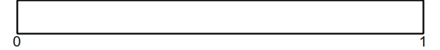

Now, if we want to roll an nn-sided die, one way to do so would be to segment the range [0,1)[0,1) into nn evenly-sized smaller regions, each of which has length 1n1n. This looks as follows:

At this point, if we generate a randomly-chosen real number in the range [0,1)[0,1), it will fall into exactly one of these smaller regions. From there, we can read off what the outcome of the die roll is by seeing what range it falls in. For example, if our randomly-chosen value fell at this location:

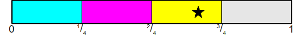

We would say that the die rolled a 2 (assuming that we zero-index our die).

Graphically, it's easy to see in which bucket the random value fell, but how can we encode this as an algorithm? This is where we use the fact that the die is a fair die. Since all of the ranges have equal size, namely 1n1n, we can see what the largest value of i is such thatinin is no greater than the randomly-generated value (call that value x). One observation is that if we are trying to find the maximum value of i such that in≤xin≤x, this is equivalent to finding the maximum value of nn such that i≤xni≤xn. But, by definition, this means that i=⌊xn⌋i=⌊xn⌋, the largest natural number no larger than xn. Consequently, this gives us the following (very simple) algorithm for simulating a fair, n-sided die:

#### Algorithm: Simulating a Fair Die

1. Generate a uniformly-random value xx in the range [0,1)[0,1).
2. Return ⌊xn⌋⌊xn⌋.

Using our computational assumptions from above, this algorithm runs in O(1)O(1) time.

This section has two takeaway points. First, we can segment the range [0,1)[0,1) into pieces such that a uniformly-random real number in that range maps naturally back to one of the many discrete choices available to us. We will exploit this technique extensively throughout the rest of this writeup. Second, it can be complicated to determine which range a particular random value has fallen into, but if we know something about the partitions (in this case, that they all have the same size), it can be mathematically easy to determine which partition a particular point is in.

##  Simulating a Loaded Die with a Fair Die

Given an algorithm for simulating a fair die, can we adapt the algorithm to simulate a loaded die? The answer, interestingly, is yes, but it will come at a space premium.

The intuition of the previous section suggests that in order to simulate a roll of a loaded die, all we need to do is split the range [0,1)[0,1)into pieces, then determine which piece we have fallen into. However, in general this can be much more difficult than it might seem. For example, suppose that we have a four-sided die with side probabilities of 12,13,112,12,13,112, and 112112 (we can confirm that this is a legal probability distribution since 12+13+112+112=612+412+112+112=121212+13+112+112=612+412+112+112=1212). If we partition the range [0,1)[0,1) into four pieces of these given sizes, we get the following:

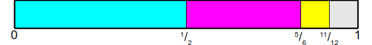

Unfortunately, at this point we're stuck. Even if we knew a random number in the range [0,1)[0,1), there is no simple mathematical trick we can use to automatically determine which partition that number falls into. This is not to say that it's extremely difficult to do so - as you'll see, there are many great tricks we can use - but none of them necessarily has the mathematical simplicity of the algorithm for rolling a fair die.

However, we can adapt the technique for fair dice to work in this case. Let's take this particular case as an example. The probability of the sides of the dice coming up are 12,13,112,12,13,112, and 112112. If we rewrite this such that all the terms have a common denominator, we get the values 612,412,112,612,412,112, and 112112. We can therefore think about this problem as follows: rather than rolling a four-sided die with weighted probabilities, why not instead roll a 12-sided fair die where the faces have duplicate labels on them? Since we know how to simulate a fair die, this would be equivalent to cutting up the range [0,1)[0,1) into twelve pieces like this:

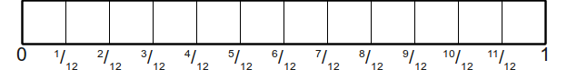

Then assigning them to the different outcomes like this:

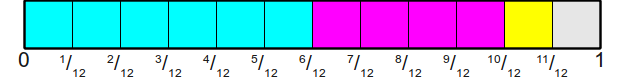

Now, simulating a die roll is extremely simple - we just roll this new fair die, then see what side comes up and read off the value it contains. This first step can be accomplished using the algorithm from above, which will give us back an integer in the range 0,1,...,110,1,...,11. To map that integer back to one of the sides of the original loaded die, we will store an auxiliary array of size twelve that maps each of these numbers back to the original outcome. Graphically, we can see this as follows:

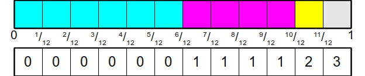

To formalize this as an algorithm, we will describe both the initialization step (coming up with the table) and the generation step (simulating throws of the random die). Both of these steps are important to consider in this algorithm and the algorithms that follow, since the setup time might be great.

In the initialization step, we begin by finding the [least common multiple](http://en.wikipedia.org/wiki/Least_common_multiple)of all of the probabilities we are given for the sides of the dice (in our example, this was 12). The LCM is useful here because it corresponds to the smallest common denominator we could use for all of the fractions, and therefore the number of sides on the new, fair die that we will be rolling. Once we have this LCM (let's call it L), we need to determine how many sides of the new die will be distributed to each of the sides of the original, loaded die. In our example, the side with probability 1212 got 6 sides on the new die, since 12×12=612×12=6. Similarly, the side with probability 1313 got 4 sides, since13×12=413×12=4. More generally, if L is the LCM of the probabilities and pipi is the probability of side ii of the die coming up, we would allocate L⋅piL⋅pi sides of the fair die to side ii of the original loaded die.

Here is pseudocode for the above algorithm:

#### Algorithm: Simulating a Loaded Die with a Fair Die

- **Initialization**:

    1. Find the LCM of the denominators of the probabilities p0,p1,...,pn−1p0,p1,...,pn−1; call it LL

    2. Allocate an array AA of size LL mapping outcomes of the fair die roll to the original die roll.

    3. For each side ii of the original die, in any order:
        1. Set the next L⋅piL⋅pi entries of AA to be ii.

- **Generation**:

    1. Generate a fair die roll from an LL-sided die; call the side SS.
    2. Return A[S]A[S].

This algorithm may be simple, but how efficient is it? The actual generation of die rolls is quite fast - each die roll requires O(1)O(1) work to generate a random die roll using the earlier algorithm, plus an extra O(1)O(1) work for the table lookup. This gives a total work requirement of O(1)O(1).

However, the initialization step may be extremely costly. In order for this algorithm to work, we need to allocate space for an array as large as the LCM of the denominators of all of the input fractions. For our example (12,13,112,11212,13,112,112), this was 12, but for other inputs it can be pathologically bad. As an example, consider the fractions 99999910000009999991000000 and 1100000011000000. The LCM of the denominators is one million, so our table would require one million entries!

Unfortunately, it gets worse than this. In the previous example, we could at least say that we "expected" the algorithm to use a lot of memory, since the denominators of the fractions were each one million. However, we may end up with a set of probabilities for which the LCM is substantially greater than any individual denominiator. As an example, consider the probabilities 115,110,56115,110,56. Here, the LCM of the denominators is 30, which is larger than any of the denominators themselves. The construction here works because 15=3×515=3×5, 10=2×510=2×5, and 6=2×36=2×3; in other words, each denominiator is the product of two primes chosen out of a pool of three. Their LCM is therefore the product of all of those primes together, since each denominator has to divide the LCM. If we generalize this construction and consider any set of kk primes, then if we pick one fraction for each pairwise product of those primes, the LCM may be much larger than any individual denominiator. In fact, one of the best upper bounds we can derive on the LCM would be O(∏ni=0di)O(∏i=0ndi), where didi is the denominator of the iith probability. This precludes this algorithm from being used in any practical setting where the probabilities are not known in advance, since the memory usage required to hold a table of size O(∏ni=0di)O(∏i=0ndi) can easily be beyond what can be held in RAM.

That said, in many cases this algorithm is well-behaved. If the probabilities are all identical, then all the probabilities we are given as input are 1n1n for some nn. The LCM of the denominators is then nn, so the fair die we end up rolling will have nn sides and each of the sides of the original die will correspond to one side of the fair die. The initialization time is thus O(n)O(n). Graphically, this would look as follows:

This gives the following information about this algorithm:

| Algorithm | Initialization Time | Generation Time | Memory Usage |
| --- | --- | --- | --- |
|     | Best | Worst | Best | Worst | Best | Worst |
| Loaded Die from Fair Die | Θ(n)Θ(n) | O(∏ni=0di)O(∏i=0ndi) | Θ(1)Θ(1) | Θ(n)Θ(n) | O(∏ni=0di)O(∏i=0ndi) |

Another important detail about this algorithm is that it assumes that we're given the probabilities nicely and conveniently as fractions with well-behaved denominators. If the probabilities are specified as IEEE-754 doubles, then this approach is likely to fail catastrophically due to small rounding errors; imagine if we have 0.25 and 0.250000000001 as probabilities! Thus this approach is probably best not attempted except in special cases where the probabilities are known to be well-behaved and specified in a format conducive to operations on rational numbers.

##  Simulating a Biased Coin

Our explanation of one simple random primitive (the fair die) led to a simple but potentially disastrously inefficient algorithm for simulating a loaded die. Perhaps exploring other simple random primitives might shed some more light on different approaches for solving this problem.

A simple but surprisingly useful task is simulating a biased coin using a random generator. Given a coin with probability pheadspheads of coming up heads, how would we simulate a flip of the biased coin?

One of the intuitions we developed earlier on was that we can partition the range [0,1)[0,1) into a series of buckets such that when we pick a random value in the range, it ends up in some bucket with probability equal to the size of the bucket. To simulate a biased coin using a uniformly random value in the range [0,1)[0,1), we could consider splitting the range [0,1)[0,1) like this:

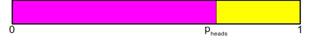

And then generating a uniformly-random value in the range [0,1)[0,1) to see what bucket it's contained in. Fortunately, since there is only one splitting point, it's quite easy to determine which bucket the point is contained in; if the value is less than pheadspheads, then the coin came up heads, and otherwise it came up tails. As pseudocode:

#### Algorithm: Simulating a Biased Coin

1. Generate a uniformly-random value xx in the range [0,1)[0,1).
2. If x<pheadsx<pheads, return "heads."
3. If x≥pheadsx≥pheads, return "tails."

Since we can generate a uniformly-random value in the range [0,1)[0,1) in O(1)O(1) time and can do a real-valued comparison in O(1)O(1) as well, this algorithm runs in O(1)O(1) time.

##  Simulating a Fair Die with Biased Coins

From our earlier discussion, we know that it's possible to simulate a loaded die with a fair die, assuming that we're willing to pay a potential premium in space usage. Since we can think of a biased coin as a loaded two-sided die, this means that it's possible to simulate a biased coin using a fair die. Interestingly, it's also possible to do the opposite, and we can simulate a fair die with a biased coin. The construction is straightforward, elegant, and can easily be generalized to simulate a loaded die using a set of biased coins.

The construction for simulating a biased coin worked by partitioning the range [0,1)[0,1) into two regions - a "heads" region and a "tails" region - based on the probability of the die coming up heads. We have already seen a similar trick used above to simulate a fair, nn-sided die that worked by splitting the region [0,1)[0,1) into nn evenly-sized regions. For example, when rolling a four-sided die, we ended up with this partitioning:

Now, suppose that we were interested in simulating a roll of this fair die, given that we have available to us a collection of biased coins. One way that we might think about this would be to imaging marching across these buckets from the left to the right, at each time asking whether or not we want to stop in the bucket we're currently contained in or to move on. For example, let's suppose that we want to pick one of these four buckets randomly. Beginning in the leftmost bucket, we would flip a biased coin that would indicate whether we should stop in this bucket or continue moving forward. Since we want to pick all of these buckets uniformly with probability 1414, we could do this by flipping a biased coin that comes up heads with probability 1414. If it comes up heads, we stop in this bucket. Otherwise, we move on to the next bucket.

If the coins comes up tails, we end up in the second bucket and again want to ask whether or not we should choose this bucket or keep moving. Initially, you might think that we should flip another coin that comes up heads with probability 1414 to do this, but this would actually be incorrect! One way to see the flaw in this reasoning is to carry it to the extreme - if in each bucket we flip a coin that comes up heads with probability 1414, then there is a small chance that in each bucket the coin will come up tails and we will end up rejecting each bucket. Somehow, we need to keep increasing the probability of the coin coming up heads as we march across the buckets. At the extreme, if we end up in the last bucket, we need the coin to come up heads with probability 11, since if we've rejected every preceding bucket the correct decision is to stop in the last bucket.

To determine the probability that our biased coin should come up heads once we've skipped the first bucket, notice that if we have indeed skipped the first bucket, there are only three buckets left. Since we're rolling a fair die we would want each of these three buckets to be chosen with probability 1313. Consequently, intuitively it seems like we should have the second die come up heads with probability 1313. Using a simmilar argument, if we flip tails on the second bucket, then the coin we toss for the third bucket should come up heads with probability 1212, and the coin we toss for the final bucket should come up heads with probability 11.

This intuition leads us to the following algorithm. Note that we have **not** argued why this algorithm is correct or even that it is correct; we'll do that in a second.

#### Algorithm: Simulating a Fair Die with Biased Coins

1. For i=0i=0 to n−1n−1:
    1. Flip a biased coin with probability 1n−i1n−i of coming up heads.
    2. If it comes up heads, return ii.

This algorithm is simple and in the worst-case runs in O(n)O(n) time. But how do we know that it's actually correct? To see this, we will need the following theorem:

**Theorem:** The above algorithm outputs side ii with probability 1n1n for any choice of ii.

**Proof:** Consider any fixed n≥0n≥0. We prove by strong induction that each of the nn sides has probability 1n1n of being chosen.

As our base case, we show that side 00 of the die has probability 1n1n of being chosen. But this is immediate from the algorithm - we choose side 0 if a biased coin with probability 1n1n of coming up heads comes up heads, which means that we pick it with probability 1n1n.

For the inductive step, assume that for sides 0,1,2,...,k−10,1,2,...,k−1 that those sides are chosen with probability 1n1n and consider the probability that side kk is chosen. Side kk will be chosen iff the first kk sides are **not** chosen, then a coin that comes up heads with probability 1n−k1n−k comes up heads. Because each of the first kk sides have probability 1n1n each of being chosen, and since only one side is ever chosen, the probability that one of the first kk sides is chosen is given by knkn. This means that the probability that the algorithm does not pick one of the first kk sides is given by 1−kn=nn−kn=n−kn1−kn=nn−kn=n−kn. This means that the probability that we choose side kk is given by n−kn1n−k=1nn−kn1n−k=1n as required, completing the induction. Thus each side of the die is chosen uniformly at random.

Of course, this algorithm is fairly inefficient - we can simulate a roll of the fair die in O(1)O(1) using our earlier technique! - but this algorithm can be used as a stepping stone into a reasonably efficient algorithm for simulating a loaded die with biased coins.

##  Simulating a Loaded Die with a Biased Coin

The above algorithm is interesting in that it gives a simple framework for simulating a die with a set of coins. We begin by flipping a coin to determine whether to pick the first side of the die or to move on to the remaining sides. In doing so, we have to be careful to scale up the remaining probabilities.

Let's see how we might use this technique to simulate a roll of a loaded die. Let's use our example from above, with probabilities 12,13,112,11212,13,112,112. This, if you'll recall, splits the range [0,1)[0,1) as follows:

Now, let's think about how we might simulate this loaded die using biased coins. We could start by flipping a coin that has probability 1212 of coming up heads to determine whether or not we should output side 0. If this coin comes up heads, great! We're done. Otherwise, we need to flip another coin to determine whether or not to pick the next side. As with before, even though the next side has probability 1313 of coming up, we do not want to flip a coin that comes up heads with probability 1313, since half of the probability mass has been discarded when we didn't choose the 1212 side. In fact, since half of the probability mass is gone, if we renormalize the remaining probabilities at this point, we end up with the updated probabilities 23,16,1623,16,16. Thus the second coin should be flipped with probability 2323. If this coin also flips tails, then we have to choose between the two 112112 sides. Since at that point 5656 of the probability mass will be gone, we would renormalize the probabilities of the 112112 sides so that each has probability 1212 of coming up heads, so the third coin would have probability 1212 of coming up heads. The final coin, if it's ever flipped, would have to come up heads with probability 11, since it's the very last bucket.

To recap, the probabilities for the coins would be
1. First flip: 1212
2. Second flip: 2323
3. Third flip: 1212
4. Fourth flip: 11

Although it may make intuitive sense where these numbers come from, to turn this into an algorithm we are going to need to come up with a formal construction for choosing the probabilities. The idea is as follows - at each step, we remember how much of the probability mass remains to be used up. At the beginning, before flipping any coins, this is 11. After flipping the first coin, it's 1−p01−p0. After flipping the second coin, it's 1−p0−p11−p0−p1. More generally, after flipping kk coins, the remaining probability mass is 1−∑k−1i=0pi1−∑i=0k−1pi. Whenever we flip a coin to determine whether or not to pick bucket kk, we end up flipping a coin that comes up heads with probability equal to the fraction of the remaining probability occupied by the probability pkpk, which is given by pk1−∑k−1i=0pipk1−∑i=0k−1pi. This gives us the following algorithm for simulating a loaded die with a set of biased coins (again, we'll prove correctness and runtime in a second):

#### Algorithm: Loaded Die from Biased Coins

- **Initialization**:

    1. Store the probabilities pipi for later use.

- **Generation**:
- Set mass=1mass=1
- For i=0i=0 to n−1n−1:

    1. Flip a biased coin with probability pimasspimass of coming up heads.
    2. If it comes up heads, return ii.
    3. Otherwise, set mass=mass−pimass=mass−pi

While this may make some amount of intuitive sense, is it mathematically correct? Fortunately, the answer is yes due to a generalization of the above proof, which is given here:

**Theorem:** The above algorithm outputs side ii with probability pipi for any choice of ii.

**Proof:** Consider any fixed n≥0n≥0. We prove by strong induction that each of the nn sides has probability pipi of being chosen.

As our base case, we show that side 00 of the die has probability p0p0 of being chosen. We choose side 00 if the very first coin flip comes up heads, which occurs with probability p0massp0mass. Since massmass is initially 11, this probability is p01=p0p01=p0, so side 0 is chosen with probability p0p0 as required.

For the inductive step, assume that for sides 0,1,...,k−10,1,...,k−1 that those sides are chosen with probability p0,p1,...,pk−1p0,p1,...,pk−1 and consider the probability that side kk is chosen. Side kk will be chosen iff the first kk sides are **not** chosen, then a coin that comes up heads with probability pkmasspkmass comes up heads. Because each of the first kk sides are all chosen with the correct probabilities, and since only one side is ever chosen, the probability that one of the first kk sides is chosen is given by ∑k−1i=0pi∑i=0k−1pi. This means that the probability that the algorithm does not pick one of the first kk sides is given by 1−∑k−1i=0pi1−∑i=0k−1pi. Now, the probability that the coin for side kk comes up heads is given by pkmasspkmass, and after kk iterations we can see by a quick induction that mass=1−∑k−1i=0pimass=1−∑i=0k−1pi. This means that the total probability that we pick side kk is given by (1−∑k−1i=0pi)pk1−∑k−1i=0pi=pk(1−∑i=0k−1pi)pk1−∑i=0k−1pi=pk as required, completing the induction.

Now, let's consider the runtime complexity of this algorithm. We know that the initialization time will be either Θ(1)Θ(1) if we keep a shallow copy of the input probability array, but would probably be Θ(n)Θ(n) so that we can store our own version of the array (in case the caller wants to change it later on). Actually generating the result of the die roll might require us to flip Θ(n)Θ(n) coins in the worst-case, but only requires a single flip in the best case.

However, with a bit of thought it becomes clear that the input distribution heavily influences how many coin flips we will need. In the absolute best case, we have a probability distribution where all of the probability mass is centered on the first side of the die and the remaining probabilities are all zero. In that case, we need just one coin flip. In the absolute worst-case, all the probability mass is centered on the very last side of the die and is zero everywhere else, in which case we'll need to flip nn coins to find the outcome.

We can precisely and mathematically characterize the expected number of coin flips for this algorithm. Let's think of a random variable XX that represents the number of coin flips in any execution of this algorithm on some specific distribution. That is, ℙ[X=1]P[X=1] is the probability that the algorithm flips just one coin before terminating, ℙ[X=2]P[X=2] is the probability that the algorithm flips just two coins, etc. In this case, the expected number of coin flips for our algorithm is given by the [expected value](http://en.wikipedia.org/wiki/Expected_value) of XX, denoted 𝔼[X]E[X]. By definition, we have that

𝔼[X]=∑i=1ni⋅ℙ[X=i]E[X]=∑i=1ni⋅P[X=i]

So what is the value of ℙ[X=i]P[X=i]? Well, the algorithm will terminate after it chooses some side of the die. If it chooses side 00, it will flip one coin to determine to stop there. If it chooses side 11, it will flip two coins - one to recognize that it doesn't want to pick side 00, and one to recognize that it does want to pick side 11. More generally, if the algorithm chooses side ii, it will flip i+1i+1 coins, ii to decide not to pick the previous i−1i−1 sides, and one to decide to pick side ii. Combined with the fact that we know that side ii is chosen with probability pipi, this means that

𝔼[X]=∑i=1ni⋅ℙ[X=i]=∑i=1ni⋅pi−1=∑i=1n((i−1)pi−1+pi−1)=∑i=1n((i−1)pi−1)+∑i=1npi−1E[X]=∑i=1ni⋅P[X=i]=∑i=1ni⋅pi−1=∑i=1n((i−1)pi−1+pi−1)=∑i=1n((i−1)pi−1)+∑i=1npi−1

In the last simplification, notice that this first term is equivalent to ∑n−1i=0i⋅pi∑i=0n−1i⋅pi, which is equal to 𝔼[p]E[p]; the expected outcome of the die roll! Moreover, the second term is 11, since it's the sum of the total probabilities. This means that 𝔼[X]=𝔼[p]+1E[X]=E[p]+1. That is, the expected number of coin flips is one plus the expected value of the die roll!

| Algorithm | Initialization Time | Generation Time | Memory Usage |
| --- | --- | --- | --- |
|     | Best | Worst | Best | Worst | Best | Worst |
| Loaded Die from Fair Die | Θ(n)Θ(n) | O(∏ni=0di)O(∏i=0ndi) | Θ(1)Θ(1) | Θ(n)Θ(n) | O(∏ni=0di)O(∏i=0ndi) |
| Loaded Die from Biased Coins | Θ(n)Θ(n) | Θ(1)Θ(1) | Θ(n)Θ(n) | Θ(n)Θ(n) |

##  Generalizing Biased Coins: Simulating Loaded Dice

In the above example, we were able to efficiently simulate a biased coin because there was only one partition point that we needed to consider. How efficiently can we generalize this idea up to loaded dice, where the number of sides may be arbitrarily large?

If you'll notice, a biased coin is exactly the same as a loaded die that just has two sides. Consequently, we can think of a biased coin as just a special case of the more general problem we're interested in solving. When solving the biased coin problem, we split the range[0,1)[0,1) into two regions - one for "heads" and one for "tails" - and then used the fact that there was just one splitting point to find the bucket we belong to. If we have an n-sided die, then we will have multiple buckets and, therefore, multiple splitting points. For example, suppose that we have a seven-sided die with probabilities 14,15,18,18,110,110,11014,15,18,18,110,110,110. If we were to partition the range [0,1)[0,1) into seven pieces, we would do so as follows:

Notice where these splits are located. The first partition begins at 00 and ends at 1414. The second partition begins at 1414 and ends at 14+15=92014+15=920. More generally, if the probabilities are p0,p1,...,pn−1p0,p1,...,pn−1, the partitions would be the ranges [0,p0),[p0,p0+p1),[p0+p1,p0+p1+p2),[0,p0),[p0,p0+p1),[p0+p1,p0+p1+p2), etc. That is, bucket ii is delimited by the range

[∑j=0i−1pj,∑j=0ipj)[∑j=0i−1pj,∑j=0ipj)

Notice that the difference between these two values is pipi, so the total area of the bucket is pipi as required.

Now that we know where the partitions are, if we were to pick a uniformly-random value xx in the range [0,1)[0,1), how would we determine which range it fell into? Using our biased coin algorithm as a starting point, one idea would be as follows: starting with endpoint of the first bucket, continuously walk upward across the partitions until we find an endpoint greater than the value of xx. If we do this, we will have located the first bucket containing the point xx, and we have our value. For example, if we picked the random value x=2740x=2740, we would execute the following search:

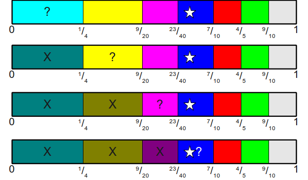

From which we could conclude that the die rolled a 3, zero-indexed.

This linear scan algorithm would give an O(n)O(n)-time algorithm for finding the side of the die that was rolled. However, we can dramatically improve this runtime by using the following observation: the sequence of endpoints of the buckets forms an ascending sequence (since we're always adding in more and more probabilities, none of which can be less than zero). Consequently, we are trying to answer the following question: given an ascending sequence of values and some test point, find the first value in the range strictly greater than the test point. This is a perfect spot to use a [binary search](http://en.wikipedia.org/wiki/Binary_search_algorithm)! For example, here's an execution of binary search over the above array to find what bucket the value x=3940x=3940 belongs to:

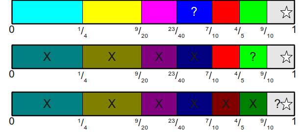

This gives us an Θ(logn)Θ(log⁡n) algorithm for mapping a uniformly-random value in the range [0,1)[0,1) to a side of the die that was rolled. Moreover, this requires only Θ(n)Θ(n) preprocessing time to build up the table of endpoints; we simply compute the partial sums of the probabilities all the way up.

This algorithm is sometimes called the [roulette wheel selection](http://en.wikipedia.org/wiki/Fitness_proportionate_selection) because the algorithm picks a random bucket using a technique similar to a roulette wheel - throwing a ball into the range and seeing where it lands. In pseudocode, the algorithm looks like this:

#### Algorithm: Roulette Wheel Selection

- **Initialization**:

    1. Allocate an array AA of size nn
    2. Set A[0]=p0A[0]=p0.
    3. For each probability ii from 11 to n−1n−1:
        1. Set A[i]=A[i−1]+piA[i]=A[i−1]+pi

- **Generation**:

    1. Generate a uniformly-random value xx in the range [0,1)[0,1)

    2. Using a binary search, find the index ii of the smallest element in AA larger than xx.

    3. Return ii.
The comparison between this algorithm and the earlier one is quite impressive:

| Algorithm | Initialization Time | Generation Time | Memory Usage |
| --- | --- | --- | --- |
|     | Best | Worst | Best | Worst | Best | Worst |
| Loaded Die from Fair Die | Θ(n)Θ(n) | O(∏ni=0di)O(∏i=0ndi) | Θ(1)Θ(1) | Θ(n)Θ(n) | O(∏ni=0di)O(∏i=0ndi) |
| Loaded Die from Biased Coins | Θ(n)Θ(n) | Θ(1)Θ(1) | Θ(n)Θ(n) | Θ(n)Θ(n) |
| Roulette Wheel Selection | Θ(n)Θ(n) | Θ(logn)Θ(log⁡n) | Θ(n)Θ(n) |

It is clear that we now have a much better algorithm than what we started with. Discretizing the probabilities may have initially seemed promising, but this new approach based on a continuous value and binary search appears to be much better. However, it is still possible to improve upon these bounds by using a clever set of hybrid techniques, as we'll see in a minute.

One interesting detail about this algorithm is that while using a binary search guarantees worst-case O(logn)O(log⁡n) time for random generation, it also eliminates the possibility of faster lookups; that is, the generation time is now Ω(logn)Ω(log⁡n) as well. Is it possible to do better than this? It turns out that the answer is yes.

Suppose that we switch from using a simple binary search over the list of cumulative probabilities to using a [binary search tree](http://en.wikipedia.org/wiki/Binary_search_tree). For example, given the above set of probabilities, we might build the following binary search tree over their cumulative distribution:

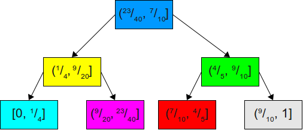

Now, if we wanted to simulate a roll of the die, we can generate a uniformly-distributed number in the range [0,1)[0,1), then look up in which range it lies in this BST. Since this is a balanced binary search tree, the best-case lookup time is O(1)O(1) and the worst-case lookup time is O(logn)O(log⁡n).

However, assuming that we know more about the probability distribution, it may be possible to do much better than this. For example, suppose that our probabilities are 99100,1600,1600,1600,1600,1600,160099100,1600,1600,1600,1600,1600,1600. That is, the probability distribution is extremely skewed, with almost all of the probability mass concentrated on a single side. We could build a balanced BST for these probabilities, as shown here:

While this binary search tree is perfectly balanced, it's not a very good binary search tree for our application. Since we know that 99 times out of 100 the random value is going to be in the range [0,99100)[0,99100), it doesn't make any sense to store the node for that range where it's currently located. In fact, doing this would mean that almost all of the time we'd end up doing two unnecessary comparisons against the blue and yellow nodes. Since with very high probability we would want the node for the large range to be checked first, it makes sense to unbalance the tree in a way that makes the average case substantially better at the expense of the remaining cases. This is shown here:

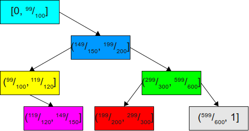

Now, we are very likely to terminate the search after immediately finding the bucket we want on our first try. In the very unlikely event that the bucket we want to find is contained in the sliver (99100,1](99100,1], then we end up degrading gracefully to the rest of the tree, which is indeed well-balanced.

More generally, we are interested in solving this problem:

Given a set of probabilities, find the binary search tree of those probabilities that minimizes the expected lookup time.

Fortunately, this problem is extremely well-studied and is called the [optimal binary search tree problem](http://en.wikipedia.org/wiki/Binary_search_tree#Optimal_binary_search_trees). There are many algorithms for solving this problem; it is known that an exact solution can be found in time O(n2)O(n2) using [dynamic programming](http://en.wikipedia.org/wiki/Dynamic_programming), and there exist good linear-time algorithms that can find approximate solutions. Additionally, the [splay tree](http://en.wikipedia.org/wiki/Splay_tree) data structure, a self-balancing binary search tree, can be used to get to within a constant factor of the optimal solution.

Interestingly, the best-case behavior for these optimized binary search trees occurs when the probability distributions are extremely skewed, since we can just move the nodes containing the bulk of the probability mass near the root of the tree, and their worst-case is when the distribution is balanced, since in that case the tree has to be wide and shallow. This is the opposite of the behavior of the earlier algorithm that uses a fair die to simulate a loaded die!

In the best-case, we have a loaded die in which one side always comes up (that is, it occurs with probability 1, and each other side occurs with probability 0). This is an extreme exaggeration of our earlier example, but would cause the search to always terminate after one lookup. In the worst-case, all the probabilities are even, and we have to do a standard BST lookup. This gives the following:

| Algorithm | Initialization Time | Generation Time | Memory Usage |
| --- | --- | --- | --- |
|     | Best | Worst | Best | Worst | Best | Worst |
| Loaded Die from Fair Die | Θ(n)Θ(n) | O(∏ni=0di)O(∏i=0ndi) | Θ(1)Θ(1) | Θ(n)Θ(n) | O(∏ni=0di)O(∏i=0ndi) |
| Loaded Die from Biased Coins | Θ(n)Θ(n) | Θ(1)Θ(1) | Θ(n)Θ(n) | Θ(n)Θ(n) |
| Roulette Wheel Selection | Θ(n)Θ(n) | Θ(logn)Θ(log⁡n) | Θ(n)Θ(n) |
| Optimal Roulette Wheel Selection | O(n2)O(n2) | Θ(1)Θ(1) | O(logn)O(log⁡n) | Θ(n)Θ(n) |

##  Throwing Darts

So far, we have seen two primitives that have, in some way, helped us build algorithms for simulating loaded dice: the fair die and the biased coin. Using purely a fair die, we came up with an (albeit impractical) algorithm for simulating a loaded die, and beginning with the intuition for biased coins we were able to invent a fast algorithm for simulating loaded dice. Is it possible to combine the two approaches together to build an algorithm built on both fair dice and biased coins? The answer is a resounding "yes," and in fact the resulting algorithm is superior to both of the above approaches.

Up to this point, we have been visualizing the range [0,1)[0,1) and the probabilities of the dice faces as a one-dimensional range. Both of the above algorithms work by picking some point in the range [0,1)[0,1) and mapping it onto a line segment whose length corresponds to some probability. The longer we make our line segments, the higher the probability that this segment is chosen. But what if instead of thinking in one dimension, we think in two? What if instead of thinking of the probability pipi as the length of a line segment, we think of it as the area of a rectangle?

Let's begin by returning to our older example of the probabilities 12,13,112,11212,13,112,112. Let's visualize these probabilities as rectangles of width ww (for some arbitrary w>0w>0) and height pipi (and thus total area w⋅piw⋅pi):

Notice that the total area of these rectangles is, collectively, ww, since the area is

∑i=0n−1wpi=w∑i=0n−1pi=w∑i=0n−1wpi=w∑i=0n−1pi=w

Now, suppose that we draw a bounding box around these rectangles, whose width is 4w4w (because there are four rectangles) and whose height is 1212 (since the tallest rectangle has height 1212):

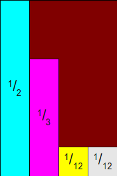

We can then think of this rectangle as being split into five regions - four regions corresponding to the different probabilities, and one region representing unused space. Given this partition, we can think of an algorithm for simulating random rolls of the die as a game of darts. Suppose that we throw a (perfectly uniformly-distributed) dart at this target. If it hits the unused space, we'll remove the dart and throw it again, repeating until we hit one of the rectangles. Since higher probabilities correspond to larger rectangles, the higher the probability that a particular face on the die comes up, the higher the probability that we eventually hit its rectangle. In fact, if we condition on the fact that we actually hit *some* rectangle, we have the following:

ℙ[hit rectangle for side i|hit some rectangle]=area of rectangle for itotal rectangle area=wpiw=piP[hit rectangle for side i|hit some rectangle]=area of rectangle for itotal rectangle area=wpiw=pi

In other words, once we finally hit some rectangle with our uniformly-random dart, we will pick the rectangle for side ii of the loaded die with probability pipi, precisely the probability that we want it to have! In other words, if we can find some efficient way of simulating throwing random darts at this rectangle, we will have an efficient way for simulating a roll of the random die.

One way we could think about throwing darts at this rectangle would be to pick two uniformly random values in the range [0,1)[0,1), scale them to the appropriate width and height, then check what region was under the dart. However, this poses the same problem we had before when trying to determine which one-dimensional bucket a random value would be in in the earlier case. However, there is a truly beautiful series of observations we can have that can make it simple, if not trivial, to determine where we hit.

As a first observation, note that we've shown that the widths of these rectangles can be arbitrarily chosen, so long as they all have the same width. The heights, of course, depend on the probabilities of the dice faces. However, if we were to uniformly scale all of the heights by some positive real number hh, then the relative areas of all of the rectangles would be the same. In fact, for any positive real number hh, we have that the total area of all the rectangles, once their heights are scaled by hh, is given by

∑i=0n−1whpi=wh∑i=0n−1pi=wh∑i=0n−1whpi=wh∑i=0n−1pi=wh

So now consider the probability of choosing any individual rectangle, conditioning on the fact that we hit some rectangle at all. Using similar math to as before, we get the following:

ℙ[hit rectangle for side i|hit some rectangle]=area of rectangle for itotal rectangle area=whpiwh=piP[hit rectangle for side i|hit some rectangle]=area of rectangle for itotal rectangle area=whpiwh=pi

So, in fact, there is no change to the probability of choosing any individual rectangle as long as we scale them linearly and uniformly.

Since we can choose any positive scaling factor that we'd like, what if we scaled these rectangles so that the height of the bounding box is always 1? Since the height of the bounding box is defined by the maximum value of pipi of the input probabilities, we could begin by scaling every one of the rectangles by a factor of 1pmax1pmax, where pmaxpmax is the maximum probability of all the input probabilities. This makes the height of the rectangle 1. Similarly, since we are allowed to pick any arbitrary width for the boxes, let's pick a width of 1. This means that given nn probabilities, the total width of the bounding box is nn and the total height is 1. This is shown here:

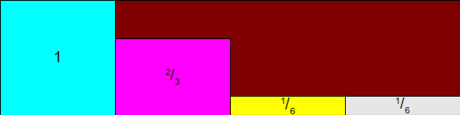

We're now ready to think about how we might throw a random dart at this rectangle and determine what we've hit. The key insight is that we can break the rectangle down so that instead of consisting of several smaller rectangles and an oddly-shaped open space, instead the region is cut apart into a collection of 2n2n rectangles, two for each of the nn input probabilities. This is shown here:

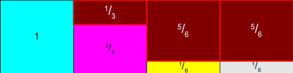

Notice how this rectangle is formed. For each side of the loaded die, we have one column of width 1 and height 1 cut into two spaces - a "yes" half-space corresponding to the rectangle for that side, and a "no" half-space corresponding to the remainder of the column.

Now, let's think about how we might throw a dart at this. A perfectly uniform dart tossed at this rectangle would have an xx and a yy component. Here, the xx component, which must be in the range [0,1)[0,1), corresponds to which column the dart lands in. The yy component, which must be between in the range [0,1)[0,1) corresponds to how high up the column we are. The choice of xx component influences which side of the loaded die we're considering, and the choice of the yy component corresponds to whether or not we pick that side or not. But wait a minute - we've seen these two ideas before! Choosing the xx coordinate, which corresponds to a column, is equivalent to rolling a fair die to decide which column to pick. Choosing the yy coordinate corresponds to flipping a biased coin to determine whether to choose the side or roll again! This observation is so important that we should make it extra clear:

**Choosing a random point in this rectangle is equivalent to rolling a fair die and flipping a biased coin.**

In fact, this result can be thought of in a much more powerful sense. In order to simulate a loaded die, we build a set of biased coins, one for each side of the die, and then roll a fair die to determine which coin to flip. Based on the die roll, if the appropriate coin comes up heads, we pick the given side, and if the coin comes up tails, we roll the die again and repeat.

Let's recap the important points so far. First, the dimensions of these rectangles are as follows - for each side, the height of the "yes" rectangle is given by pipmaxpipmax, and the height of the "no" rectangle is given by pmax−pipmaxpmax−pipmax. This normalizes the total heights of the rectangles to be 1. Second, each rectangle has width 11, though honestly this value doesn't matter. Finally, our algorithm is as follows: until we pick some outcome, roll the fair die to determine which column we are in (in other words, which biased coin to flip). Next, flip the appropriate biased coin. If it comes up heads, choose the outcome corresponding to the chosen column. Otherwise, repeat this process.

#### Algorithm: Fair Die/Biased Coin Loaded Die

- **Initialization**:

    1. Find the maximum value of pipi; call it pmaxpmax.

    2. Allocate an array CoinsCoins of length nn, corresponding to the heights of the "yes" rectangles in each row.

    3. For each probability ii from 00 to n−1n−1:
        1. Set Coins[i]=pipmaxCoins[i]=pipmax

- **Generation**:

    1. Until a value is found:

        1. Roll a fair, n-sided die and get an index ii in the range [0,n)[0,n).

        2. Flip a biased coin that comes up heads with probability Coins[i]Coins[i].

        3. If the coin comes up heads, return ii.

Let's analyze the complexity of this algorithm. In the initialization step, it takes time O(n) to find the maximum probability, and then an additional O(n) time to allocate and populate the array CoinsCoins, so the total initialization time is O(n). In the generation step, in the best case we end up flipping heads on our very first coin, terminating in O(1). But how many iterations are required on expectation? To find this value, let's compute the probability that we actually end up choosing some side after a single iteration. Since the coins don't all have the same probability of coming up heads, this will depend on which coin actually is chosen. Fortunately, since we pick each coin with identical probability (namely, 1n1n), the math becomes much easier. Moreover, since we only end up flipping one coin, the events of each coin being chosen and coming up heads are all mutually exclusive, so the total probability that some coin is chosen, flipped, and comes up heads is given by the sum of the probabilities of picking each individual coin and having that individual coin coming up heads. Since we know that the probability that side ii is chosen is given by pipmaxpipmax, so the total probability that some side is chosen is given by

∑i=0n−1(1npipmax)=1n∑i=0n−1pipmax=1n⋅pmax∑i=0n−1pi=1n⋅pmax∑i=0n−1(1npipmax)=1n∑i=0n−1pipmax=1n⋅pmax∑i=0n−1pi=1n⋅pmax

If this is the probability that some coin is chosen on any one iteration, then the expected number of iterations that may occur is given by the reciprocal of this fraction, which is n⋅pmaxn⋅pmax. But what exactly does this mean? This depends very much on the choice of pmaxpmax. At one extreme, pmaxpmax might be equal to 11 (that is, the die always comes up the same way every time). In this case, the expected number of iterations is equal to nn, meaning that on expectation we would need to roll the fair die nn times. This makes sense, since the only way we would choose a side is if we were to pick the biased coin for the one side that always comes up heads, since each other side has a coin that never comes up heads at all. On the other hand, in the other extreme the minimum value of pmaxpmax is 1n1n, since if it were any lower than this the total probability of all sides would be less than one. If pmax=1npmax=1n, then the expected number of flips is 1. This too makes sense. If pmax=1npmax=1n, then each side has the same probability of being chosen (namely, 1n1n), so when we normalize the probabilities of each side to 1, each side will have probability 1 of being chosen. Thus the die roll to choose which coin to flip will effectively be determining the outcome, since the coin always comes up heads and we never have to repeat ourselves.

It's interesting that the expected number of flips depends solely on the value of pmaxpmax and not any of the other probabilities involved, but if we return to our graphical intuition this does make sense. The total area of the rectangle at which we're shooting darts is always nn, since we normalize the heights to be 1. Moreover, the total area held by the rectangles representing "yes" answers is given by 1pmax1pmax, since each rectangle has width 1 and height normalized by multiplying by 1pmax1pmax. This means that the ratio of the total area of the "yes" rectangles to the total area of the overall rectangle is 1n⋅pmax1n⋅pmax. In other words, the space used up by the "no" rectangles depends purely on the value of pmaxpmax. It can be spread around or distributed however we choose, but ultimately its area is the same and the odds of some dart hitting it is independent of how it's spread.

Comparing this algorithm to the others gives us this information:

| Algorithm | Initialization Time | Generation Time | Memory Usage |
| --- | --- | --- | --- |
|     | Best | Worst | Best | Worst | Best | Worst |
| Loaded Die from Fair Die | Θ(n)Θ(n) | O(∏ni=0di)O(∏i=0ndi) | Θ(1)Θ(1) | Θ(n)Θ(n) | O(∏ni=0di)O(∏i=0ndi) |
| Loaded Die from Biased Coins | Θ(n)Θ(n) | Θ(1)Θ(1) | Θ(n)Θ(n) | Θ(n)Θ(n) |
| Roulette Wheel Selection | Θ(n)Θ(n) | Θ(logn)Θ(log⁡n) | Θ(n)Θ(n) |
| Optimal Roulette Wheel Selection | O(n2)O(n2) | Θ(1)Θ(1) | O(logn)O(log⁡n) | Θ(n)Θ(n) |
| Fair Die/Biased Coin Loaded Die | Θ(n)Θ(n) | Θ(1)Θ(1) | Θ(n)Θ(n) (expected) | Θ(n)Θ(n) |

In the best case, this algorithm is better than the binary search algorithm from above, requiring just one coin flip. However, its worst-case behavior is exponentially worse. Is it possible to eliminate this worst-case behavior?

##  The Alias Method

The previous technique has excellent best-case behavior, generating a random roll using a single fair die roll and coin flip. On expectation, its worst-case behavior is much worse, though, potentially requiring a linear number of die rolls and coin flips. The reason for this is that, unlike the previous techniques, the algorithm may "miss" and have to repeatedly iterate until it decides on a decision. Graphically, this is because it works by throwing darts at a target that may contain a large amount of empty space not assigned to any outcome. If there were a way to eliminate all of that empty space such that every piece of the target was covered by a rectangle corresponding to some side of the loaded die, then we could just throw a single dart at it and read off the result.

A particularly clever insight we might have is to adjust the height of the rectangle such that instead of having the height match the greatest probability, it matches the *average* probability. Let's consider our above example. Here, our probabilities are 12,13,112,11212,13,112,112. Since there are four probabilities, the average probability must be 1414. What would happen if we tried normalizing the height of the box to 1414, the average, rather than 1212, the maximum? Let's see what happens. We begin with rectangles of width 11 whose heights are equal to the initial probabilities:

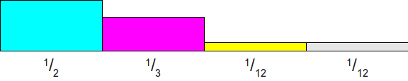

Now, we scale all of these rectangles so that a probability of 1414 would have height 1. This works by multiplying each probability by four, yielding this setup:

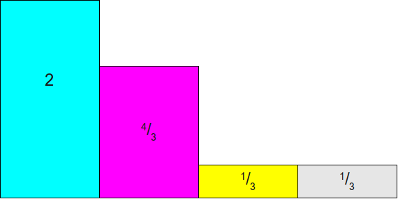

At this point, let's draw a 1×41×4 rectangle on top of this image. This will represent the target we'll be shooting at:

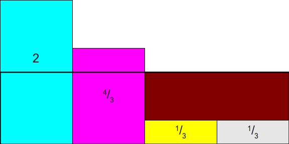

As you can see, this doesn't quite work out, since the rectangles for 1212 and 1313 don't neatly fit into the box. But what if we allowed ourselves to cut the rectangles into smaller pieces? That is, what if we cut some of the space for the 1212 rectangle off and move it into the empty space above the space for one of the 112112 rectangles? This would give this setup, which still has the vertical bars hanging over, but not by too much:

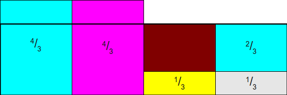

Now, we still have a bit of overhang, but not too much overhang. One way to completely eliminate the overhang would be to move the extra pieces from the 1212 and 1313 bars into the empty space, but there's actually a better solution. Let's begin by moving enough of the 1212 bar out of the first column and into the third to complete fill in the remaining gap. This will leave a small gap in the first column, but will close the other gap:

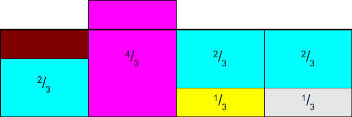

Finally, we can tuck the extra overhead from the second column into the first, producing this final rectangle:

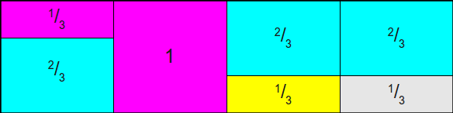

What we have below has several excellent properties. First, the total areas of the rectangles representing each side of the loaded die are unchanged from the original; all we've done is cut those rectangles into pieces and move them around. This means that as long as the areas of original rectangles are proportionally distributed according to the original probability distribution, the total area dedicated to each side of the die is the same. Second, notice that this new rectangle has no free space in it, meaning that any time we toss a dart at it, we are guaranteed to hit something that will give us an ultimate answer, not empty space that requires another dart toss. This means that a single dart toss suffices to generate our random value. Finally, and most importantly, note that each column has **at most** two different rectangles in it. This means that we can retain our intuition from before - we roll a die to determine which biased coin to toss, then toss the coin. The difference this time is what the coin toss means. A toss of heads means that we pick one side of the die, and a toss of tails now means that we should pick some other side of the die (rather than rolling again).

At a high level, the alias method works as follows. First, we create rectangles representing each of the different probabilities of the dice sides. Next, we cut those rectangles into pieces and rearrange them so that we completely fill in a rectangular target such that each column has a fixed width and contains rectangles from at most two different sides of the loaded die. Finally, we simulate rolls of the die by tossing darts randomly at the target, which we can do by a combination of a fair die and biased coins.

But how do we even know that it's possible to cut the original rectangles apart in a way that allows each column to contain at most two different probabilities? This does not seem immediately obvious, but amazingly it's always possible to do this. Moreover, not only can we cut the rectangles into pieces such that each column contains at most two different rectangles, but we can do so in a way where one of the rectangles in each column is the rectangle initially placed in that column. If you'll notice, in the above rectangle rearrangement, we always cut a piece of a rectangle and moved it into another column, and never entirely removed a rectangle from its original column. This means that each column in the final arrangement will consist of some rectangle corresponding to the probability initially assigned there, plus (optionally) a second rectangle pulled from some other column. This second rectangle is often called the **alias** of the column, since the remaining probability of the column is used as an "alias" for some other probability. The use of the term "alias" here gives rise to the name "alias method."

Before we go into the proof that it's always possible to distribute the probabilities in this way, we should take a quick second to sketch out how the algorithm actually works. Because each column of the resulting arrangement always contains some (potentially zero-height!) piece of the original rectangle from that column, to store the (potentially) two different rectangles occupying a column, implementations of the alias method typically work by storing two different tables: a **probability table**  ProbProb and an **alias table**  AliasAlias. Both of these tables have size nn. The probability table stores, for each column, the probability within that column that the original rectangle will be chosen, and the alias table stores the identity of the second rectangle (if any) contained in that column. That way, generating a random roll of the die can be done as follows. First, using a fair die, choose some column ii uniformly at random. Next, flip a random coin with probability Prob[i]Prob[i] of coming up heads. If the coin flips heads, output that the die rolled ii, and otherwise output that the die rolled Alias[i]Alias[i]. For example, here are the probability and alias tables for the above configuration:

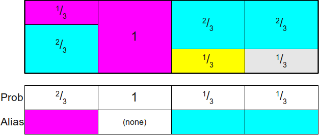

Below is a front-end into a JavaScript implementation of the alias method that has the above probability and alias tables built into it. You can click on the "Generate" button to have it generate a fair die roll and biased coin toss to see what side of the die would be rolled.

| Die Roll | Coin Toss | Result |
| --- | --- | --- |
| -   | -   |     |
|     |

##  Proving Alias Tables Exist

We now need to formally prove that it is always possible to construct the AliasAlias and ProbProb tables from above. In order to prove that this is always possible, we need to show that it is possible to do the following:

- Construct (n⋅pi)×1(n⋅pi)×1 rectangles for each of the probabilities pipi,
- cut them horitzontally into smaller pieces, and
- distribute them into nn columns
    - such that each column has height 11,
    - no column contains more than two rectangles, and
    - some rectangle corresponding to side ii is placed in column ii.

Before going into the proof that it's always possible to do this, let's work through an example. Suppose that we have the four probabilities 12,13,112,11212,13,112,112 as above. This is a collection of four probabilities (k=n=4k=n=4) whose sum is 1=441=44. Although we saw above how to fill in the alias table by experimentation, let's instead try walking through this construction more explicitly by starting with a completely empty table and then filling it in. We begin by scaling all of these probabilities by a factor of four, giving us these probabilities and this empty table:

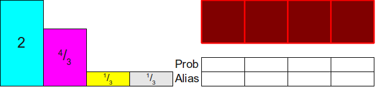

Now, notice that of the four rectangles that we have to distribute, two of them (13,1313,13) are less than 1. This means that they won't completely fill up a column and will need some other probability to fill in the remainder. Let's pick one of the two (say, the yellow one) and put it into its appropriate column:

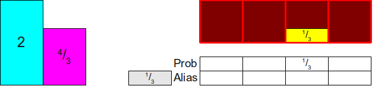

Now, we need to somehow make up the difference in the top of the column. To do this, we'll notice that two of the rectangles that have yet to be distributed have heights greater than 1 (namely, 22 and 4343). Let's pick one of these two arbitrarily; here, let's use the 4343. We then distribute enough of the 4343 into the column to fill it completely; this ends up using 2323 of the 4343 up, as shown here:

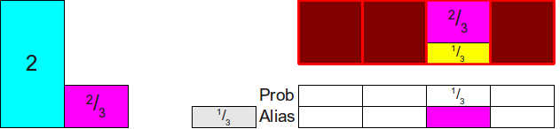

Now, notice what our setup looks like. We now have three rectangles whose total area is 33 and three open columns, so it seems like it should be possible to distribute those rectangles into the three columns. To do so, we'll use the same intuition as before. Notice that there is at least one rectangle whose height is less than 11, so we'll pick one arbitrarily (let's say that we grab the 2323 rectangle) and place it into its column:

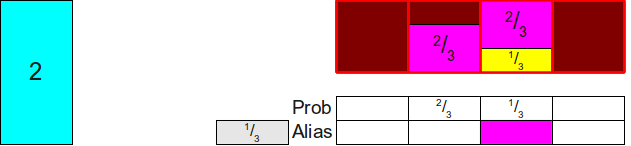

We now need to top off the column, so we'll pick some probability that's at least 1 and use it to make up the rest of the column. There's only one choice here (using the 22), so we'll pull 1313 off of the 22 and put it atop the column:

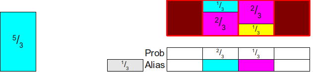

And we're now down to two rectangles shose total area is two. We now repeat this process by finding some rectangle whose height is at most 1 (here, the 1313) and putting it into its column:

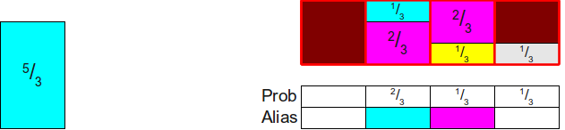

And then we find some rectangle of height at least 11 to top off the column, using our only choice of the 5353:

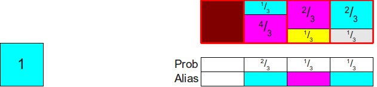

Now we have just one rectangle remaining, and it has area 1. We can thus finish the construction by just putting that rectangle in its own column:

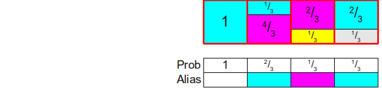
And voilà! We've filled in the table.
Notice that the general pattern behind this construction is as follows:

- Find some rectangle that has height at most 1 and place it into its own column, setting the ProbProb table to the height of that rectangle.
- Find some rectangle that has height at least 1 and use it to top off the column, setting the AliasAlias table to correspond to the side of the die represented by the rectangle.

Can we prove that this general construction is always possible? That is, we don't end up getting "stuck" when distributing probabilities this way? Fortunately, the answer is yes. The intuition behind this is that we've scaled all of the probabilities such that the average of the new probabilities is now 1 (because originally it was 1n1n, and we multiplied everything by nn). We know that the minimum of all the scaled probabilities must be no greater than the average and that the maximum of all the scaled probabilities must be no less than the average, so when we first start off there always must be at least one element at most 1 (namely, the smallest of the scaled probabilities) and one element at least one (namely, the largest of the scaled probabilities). We can thus pair these elements together. But what about once we've removed these two? Well, when we do this, we end up removing one probability from the total and decreasing the total sum of the scaled probabilities by one. This means that the new average hasn't changed, since the average scaled probability is one. We can then repeat this procedure over and over again until eventually we've paired up all the elements.

We can formalize this argument in the following theorem:

**Theorem:** Given kk width-one rectangles of heights h0,h1,...,hk−1h0,h1,...,hk−1 such that ∑k−1i=0hi=k∑i=0k−1hi=k, there is a way of cutting the rectangles and distributing them into kk columns, each of which has height 1, such that each column contains at most two different rectangles and the iith column contains at least one piece of the iith rectangle.

**Proof:** By induction. As a base case, if k=1k=1, then we have just one rectangle and its height must be 1. We can therefore assign it to the 00th column. Thus each column has height 1, contains at most two rectangles, and the 00th column contains at least one piece of the 00th rectangle.

For the inductive step, assume that for some natural number kk the theorem holds and consider any k+1k+1 rectangles of width 11 and heights h0,h1,...,hkh0,h1,...,hk such that ∑ki=0hi=k+1∑i=0khi=k+1. We first claim that there is some height hlhl such that hl≤1hl≤1 and some different height hghg (such that l≠gl≠g) such that hg≥1hg≥1. To see this, assume for the sake of contradiction that there is no hlhl with hl≤1hl≤1; this would mean that hi>1hi>1 for all natural numbers ii in the range 0≤i≤k0≤i≤k. But then we have that k+1=∑ki=0hi>∑ki=01=k+1k+1=∑i=0khi>∑i=0k1=k+1, which is clearly impossible. Thus there is some index ll such that hl≤1hl≤1. Now, suppose for the sake of contradiction that there is no other height hghg (with l≠gl≠g) such that hg≥1hg≥1. Then we must have that each other hg<1hg<1, which would (by similar logic) mean that ∑ki=0hi<k+1∑i=0khi<k+1, a contradiction. Consequently, we have that hl≤1hl≤1 and hg≥1hg≥1.

Now, consider the following construction. Place hlhl into column ll, and fill the remaining 1−hl1−hl space in the llth column with a piece of the rectangle hghg (such space must exist, since 0≤1−hl≤10≤1−hl≤1 and hg≥1hg≥1). This completely fills the column. We are now left with a collection of kk different pieces of rectangles whose total sum is kk, since we removed 11 total area from the rectangles, whose initial total sum was k+1k+1. Moreover, we have completely filled column ll, so we will never try placing any more pieces of the rectangle there. Thus, by the inductive hypothesis, we can assign the remaining kk rectangles into kk columns while satisfying the above conditions. Combined with the fact that we have now filled column ll, this means that we have a way of filling all the columns while satisfying the constraints. This completes the induction.

This is a constructive proof that says that not only can we always build the alias table, but that the above algorithm of finding a rectangle of height at most one and pairing it with a rectangle of height at least one will always succeed. From here, we can start devising faster and faster algorithms for computing alias tables.

##  Generating Alias Tables

Using just what we have said above, we can get a pretty good algorithm for simulating loaded die rolls using the alias method. The initialization works by repeatedly scanning the input probabilities to find a value at most 1 and a value at least 1, combining them together to fill a column:

#### Algorithm: Naive Alias Method

- **Initialization**:

    1. Multiply each probability pipi by nn.
    2. Create arrays AliasAlias and ProbProb, each of size nn.
    3. For j=1 to n−1j=1 to n−1:
        1. Find a probability plpl satisfying pl≤1pl≤1.
        2. Find a probability pgpg (with l≠gl≠g) satisfying pg≥1pg≥1
        3. Set Prob[l]=plProb[l]=pl.
        4. Set Alias[l]=gAlias[l]=g.
        5. Remove plpl from the list of initial probabilities.
        6. Set pg:=pg−(1−pl)pg:=pg−(1−pl).
    4. Let ii be the last probability remaining, which must have weight 1.
    5. Set Prob[i]=1Prob[i]=1.

- **Generation**:

    1. Generate a fair die roll from an nn-sided die; call the side ii.
    2. Flip a biased coin that comes up heads with probability Prob[i]Prob[i].
    3. If the coin comes up "heads," return ii.
    4. Otherwise, return Alias[i]Alias[i].

The generation step of this algorithm is exactly the same as the method described above, and runs in Θ(1)Θ(1). The generation step requires multiple iterations, which are described here. First, we need to spend Θ(n)Θ(n) time scaling each probability by a factor of nn, and need O(n)O(n) time to allocate the two arrays. The inner loop executes Θ(n)Θ(n) times, on each iteration doing O(n)O(n) work to scan the array, remove one of the array elements, and update the probabilities. This gives a total of O(n2)O(n2) total initialization work. If we consider this algorithm in context, we have the following:

| Algorithm | Initialization Time | Generation Time | Memory Usage |
| --- | --- | --- | --- |
|     | Best | Worst | Best | Worst | Best | Worst |
| Loaded Die from Fair Die | Θ(n)Θ(n) | O(∏ni=0di)O(∏i=0ndi) | Θ(1)Θ(1) | Θ(n)Θ(n) | O(∏ni=0di)O(∏i=0ndi) |
| Loaded Die from Biased Coins | Θ(n)Θ(n) | Θ(1)Θ(1) | Θ(n)Θ(n) | Θ(n)Θ(n) |
| Roulette Wheel Selection | Θ(n)Θ(n) | Θ(logn)Θ(log⁡n) | Θ(n)Θ(n) |
| Optimal Roulette Wheel Selection | O(n2)O(n2) | Θ(1)Θ(1) | O(logn)O(log⁡n) | Θ(n)Θ(n) |
| Fair Die/Biased Coin Loaded Die | Θ(n)Θ(n) | Θ(1)Θ(1) | Θ(n)Θ(n) (expected) | Θ(n)Θ(n) |
| Naive Alias Method | O(n2)O(n2) | Θ(1)Θ(1) | Θ(n)Θ(n) |

Compared to the other efficient simulation techniques, this naive alias method has a large initialization cost, but can then simulate die rolls extremely efficiently. If we could somehow reduce the initialization cost to something lower (say, O(n)O(n)), then this technique would be strictly better than all of the other techniques employed here.

One simple way to reduce the initialization cost is to use a better data structure for storing the heights as we go. In the naive version, we use an unsorted array to hold all the probabilities, meaning that it takes O(n)O(n) work to locate the two probabilities we want. A better alternative would be to use a balanced binary search tree to hold the values. This way, we could locate the values pgpg and plpl in O(logn)O(log⁡n) time by finding the maximum and minimum values in the tree. Deleting plpl could be done in O(logn)O(log⁡n) time, and updating the probability of pgpg could also be done in O(logn)O(log⁡n) time by simply removing it from the tree and reinserting it. This gives the following algorithm:

#### Algorithm: Alias Method

- **Initialization**:

    1. Create arrays AliasAlias and ProbProb, each of size nn.
    2. Create a balanced binary search tree TT.
    3. Insert n⋅pin⋅pi into TT for each probability ii.
    4. For j=1 to n−1j=1 to n−1:
        1. Find and remove the smallest value in TT; call it plpl.
        2. Find and remove the largest value in TT; call it pgpg.
        3. Set Prob[l]=plProb[l]=pl.
        4. Set Alias[l]=gAlias[l]=g.
        5. Set pg:=pg−(1−pl)pg:=pg−(1−pl).
        6. Add pgpg to TT.
    5. Let ii be the last probability remaining, which must have weight 1.
    6. Set Prob[i]=1Prob[i]=1.

- **Generation**:

    1. Generate a fair die roll from an nn-sided die; call the side ii.
    2. Flip a biased coin that comes up heads with probability Prob[i]Prob[i].
    3. If the coin comes up "heads," return ii.
    4. Otherwise, return Alias[i]Alias[i].

Now, our algorithm's initialization is much faster. Creating AliasAlias and ProbProb still takes O(n)O(n) time each, and adding the probabilities to the BST TT will take Θ(nlogn)Θ(nlog⁡n) time. From there, we do Θ(n)Θ(n) iterations of filling in the table, each of which takes O(logn)O(log⁡n) work. This gives an overall runtime of O(nlogn)O(nlog⁡n) for the intialization, as seen here:

| Algorithm | Initialization Time | Generation Time | Memory Usage |
| --- | --- | --- | --- |
|     | Best | Worst | Best | Worst | Best | Worst |
| Loaded Die from Fair Die | Θ(n)Θ(n) | O(∏ni=0di)O(∏i=0ndi) | Θ(1)Θ(1) | Θ(n)Θ(n) | O(∏ni=0di)O(∏i=0ndi) |
| Loaded Die from Biased Coins | Θ(n)Θ(n) | Θ(1)Θ(1) | Θ(n)Θ(n) | Θ(n)Θ(n) |
| Roulette Wheel Selection | Θ(n)Θ(n) | Θ(logn)Θ(log⁡n) | Θ(n)Θ(n) |
| Optimal Roulette Wheel Selection | O(n2)O(n2) | Θ(1)Θ(1) | O(logn)O(log⁡n) | Θ(n)Θ(n) |
| Fair Die/Biased Coin Loaded Die | Θ(n)Θ(n) | Θ(1)Θ(1) | Θ(n)Θ(n) (expected) | Θ(n)Θ(n) |
| Naive Alias Method | O(n2)O(n2) | Θ(1)Θ(1) | Θ(n)Θ(n) |
| Alias Method | O(nlogn)O(nlog⁡n) | Θ(1)Θ(1) | Θ(n)Θ(n) |

However, there is an algorithm that runs even faster than this approach. It's remarkably simple, and is perhaps the cleanest of all of the algorithms for implementing the alias method. This algorithm was originally described in the paper ["A Linear Algorithm For Generating Random Numbers With a Given Distribution"](http://web.eecs.utk.edu/~vose/Publications/random.pdf) by Michael Vose, and has become the standard algorithm for implementing the alias method.

The idea behind Vose's algorithm is to maintain two worklists, one containing the elements whose height is less than 1 and one containing the elements whose height is at least 1, and to repeatedly pair the first elements of each worklist. On each iteration, we consume the element from the "small" worklist, and potentially move the remainder of the element from the "large" worklist into the "small" worklist. The algorithm maintains several invariants:

- The elements of the "small" worklist are all less than 1.
- The elements of the "large" worklist are all at least 1.
- The sum of the elements in the worklists is always equal to the total number of elements.

For simplicity, each worklist does not store the actual probability, but rather some pointer back to the original probability list saying which side of the loaded die is being referenced. Given these invariants, the algorithm is given below:

#### Algorithm: (Unstable) Vose's Alias Method

#### Caution: This algorithm suffers from numerical inaccuracies. A more numerically sound algorithm is given later.

- **Initialization**:

    1. Create arrays AliasAlias and ProbProb, each of size nn.
    2. Create two worklists, SmallSmall and LargeLarge.
    3. Multiply each probability by nn.
    4. For each scaled probability pipi:
        1. If pi<1pi<1, add ii to SmallSmall.
        2. Otherwise (pi≥1pi≥1), add ii to LargeLarge.
    5. While SmallSmall is not empty:
        1. Remove the first element from SmallSmall; call it ll.
        2. Remove the first element from LargeLarge; call it gg.
        3. Set Prob[l]=plProb[l]=pl.
        4. Set Alias[l]=gAlias[l]=g.
        5. Set pg:=pg−(1−pl)pg:=pg−(1−pl).
        6. If pg<1pg<1, add gg to SmallSmall.
        7. Otherwise (pg≥1pg≥1), add gg to LargeLarge.
    6. While LargeLarge is not empty:
        1. Remove the first element from LargeLarge; call it gg.
        2. Set Prob[g]=1Prob[g]=1.

- **Generation**:

    1. Generate a fair die roll from an nn-sided die; call the side ii.
    2. Flip a biased coin that comes up heads with probability Prob[i]Prob[i].
    3. If the coin comes up "heads," return ii.
    4. Otherwise, return Alias[i]Alias[i].

Given the three above invariants, the first part of this algorithm (everything except the last loop) should be reasonably self-explanatory: we continuously pair some small element from SmallSmall with a large element from LargeLarge as normal, then add the remainder of the large element to the appropriate worklist. The last loop in the algorithm requires some explanation. Once we have exhausted all of the elements from the SmallSmall list, there will be at least one element left over in the LargeLarge list (since if every element was in SmallSmall, the sum of the elements would have to be less than the number of remaining elements, violating the last invariant). Since every element of LargeLarge is at least 1, and since the sum of the kk elements in LargeLarge must be equal to kk, this means that every element in LargeLarge must be exactly equal to 1, since otherwise the total would be too large. This final loop thus sets every large element's probability to be 1 so that the columns containing the large element are all equal to 1.

In this algorithm, the type of worklist does not matter. Vose's original paper uses stacks for the worklist because they can be efficiently implemented using arrays, but we could use a queue instead if we'd like. For simplicity, though, we'll use a stack.

Before doing an analysis of the algorithm, let's first trace through an example to see how it works. Let's consider an example of using the seven probabilities 14,15,18,18,110,110,11014,15,18,18,110,110,110. To highlight the fact that the algorithm doesn't sort the probabilities or require them to be sorted, let's order them arbitrarily as 18,15,110,14,110,110,1818,15,110,14,110,110,18. The algorithm begins by adding these elements to two work stacks, as shown here:

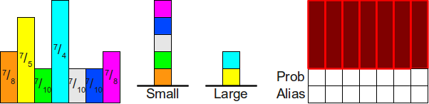

We now place the top of the SmallSmall stack into its slot, moving the magenta rectangle into its final position:

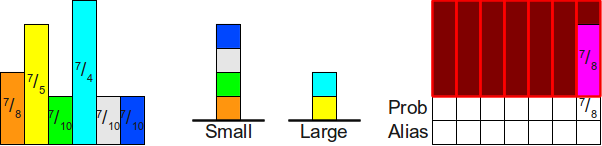

Now, we use the top of the LargeLarge stack (the cyan rectangle) to fill in the rest of the column. Since 74−18=138≥174−18=138≥1, we leave the cyan block atop the LargeLarge stack, as shown here:

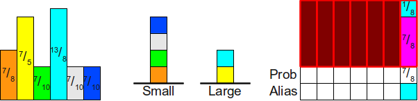

We then repeat this process. We move the rectangle on top of the SmallSmall stack into its column, then top off the difference with the top of the LargeLarge stack:

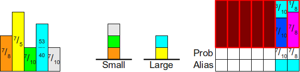
And once more:
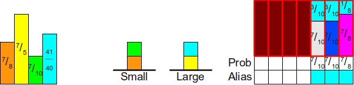

When we repeat this process next, we'll find that while we can use the cyan block to cover the slack space in the table, doing so ends up making the cyan block have height less than one. Consequently, we move the cyan block atop the small stack, as shown here:

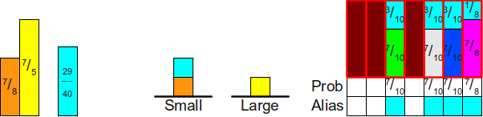

Now, when we process the SmallSmall worklist, we end up putting the cyan block in its place, then using the yellow block to fill in the slack:

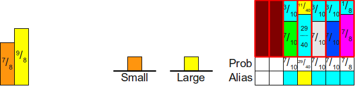

We then process the SmallSmall stack to put the orange block into position, topping it off with the yellow block:

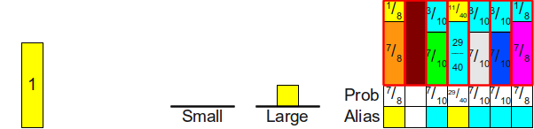

And finally, since the SmallSmall stack is empty, we put the yellow block into its own column and are done.

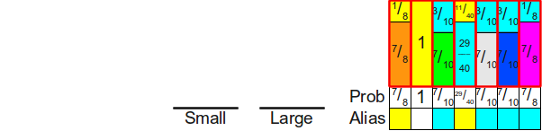
We now have a well-formed alias table for these probabilities.

##  A Practical Version of Vose's Algorithm

Unfortunately, the above algorithm, as written, is not numerically stable. On an idealized machine that can do arbitrary-precision real number computations it's fine, but if you were to try running it using IEEE-754 doubles, it may end up completely failing. There are two sources of inaccuracy that we need to deal with before moving on:

1. The computation to determine whether or not a probability belongs in the SmallSmall or LargeLarge worklist may be inaccurate. Specifically, it may be possible that scaling up the probabilities by a factor of nn has caused probabilities equal to 1n1n to end up being slightly less than 11 (thus ending up in the SmallSmall list rather than the LargeLarge list).

2. The computation that subtracts the appropriate probability mass from a larger probability is not numerically stable and may introduce significant rounding errors. This may end up putting a probability that should be in the LargeLarge list into the SmallSmall list instead.

The combination of these two factors means that we may end up with the algorithm accidentally putting all of the probabilities into the SmallSmall worklist instead of the LargeLarge worklist. As a result, the algorithm may end up failing because it expects the LargeLarge worklist to be nonempty when the SmallSmall worklist is nonempty.

Fortunately, fixing this ends up not being particularly difficult. We will update the inner loop of the algorithm so that it terminates whenever either of the two worklists are empty, so we don't accidentally end up looking at nonexistent elements from the LargeLarge worklist. Second, when one worklist is empty, we'll set the remaining probabilities of the elements in the other worklist to all be 11, since, mathematically, this should only occur if all of the remaining probabilites are precisely equal to 11. Finally, we'll replace the computation that updates the large probabilities with a slightly more stable computation. This is shown here:

#### Algorithm: Vose's Alias Method

- **Initialization**:

    1. Create arrays AliasAlias and ProbProb, each of size nn.
    2. Create two worklists, SmallSmall and LargeLarge.
    3. Multiply each probability by nn.
    4. For each scaled probability pipi:
        1. If pi<1pi<1, add ii to SmallSmall.
        2. Otherwise (pi≥1pi≥1), add ii to LargeLarge.

    5. While SmallSmall and LargeLarge are not empty: *(LargeLarge might be emptied first)*

        1. Remove the first element from SmallSmall; call it ll.
        2. Remove the first element from LargeLarge; call it gg.
        3. Set Prob[l]=plProb[l]=pl.
        4. Set Alias[l]=gAlias[l]=g.

        5. Set pg:=(pg+pl)−1pg:=(pg+pl)−1. *(This is a more numerically stable option.*)

        6. If pg<1pg<1, add gg to SmallSmall.
        7. Otherwise (pg≥1pg≥1), add gg to LargeLarge.
    6. While LargeLarge is not empty:
        1. Remove the first element from LargeLarge; call it gg.
        2. Set Prob[g]=1Prob[g]=1.

    7. While SmallSmall is not empty: *This is only possible due to numerical instability.*

        1. Remove the first element from SmallSmall; call it ll.
        2. Set Prob[l]=1Prob[l]=1.

- **Generation**:

    1. Generate a fair die roll from an nn-sided die; call the side ii.
    2. Flip a biased coin that comes up heads with probability Prob[i]Prob[i].
    3. If the coin comes up "heads," return ii.
    4. Otherwise, return Alias[i]Alias[i].

All that's left to do now is analyze the algorithm's complexity. Seeding the worklists takes a total of Θ(n)Θ(n) time, because we add each element to exactly one of the worklists. The inner loop does a total of Θ(1)Θ(1) work, since it needs to remove two elements from the worklist, update two arrays, and add one element back to a worklist. It can't execute more than O(n)O(n) times, since each iteration decreases the number of elements (collectively) in the worklists by one by eliminating the smaller probability. The last two loops can each execute at most O(n)O(n) times, since there are at most O(n)O(n) elements in the LargeLarge and SmallSmall worklists. This gives a total runtime of Θ(n)Θ(n), which (as seen below) is as good as we're going to get:

| Algorithm | Initialization Time | Generation Time | Memory Usage |
| --- | --- | --- | --- |
|     | Best | Worst | Best | Worst | Best | Worst |
| Loaded Die from Fair Die | Θ(n)Θ(n) | O(∏ni=0di)O(∏i=0ndi) | Θ(1)Θ(1) | Θ(n)Θ(n) | O(∏ni=0di)O(∏i=0ndi) |
| Loaded Die from Biased Coins | Θ(n)Θ(n) | Θ(1)Θ(1) | Θ(n)Θ(n) | Θ(n)Θ(n) |
| Roulette Wheel Selection | Θ(n)Θ(n) | Θ(logn)Θ(log⁡n) | Θ(n)Θ(n) |
| Optimal Roulette Wheel Selection | O(n2)O(n2) | Θ(1)Θ(1) | O(logn)O(log⁡n) | Θ(n)Θ(n) |
| Fair Die/Biased Coin Loaded Die | Θ(n)Θ(n) | Θ(1)Θ(1) | Θ(n)Θ(n) (expected) | Θ(n)Θ(n) |
| Naive Alias Method | O(n2)O(n2) | Θ(1)Θ(1) | Θ(n)Θ(n) |
| Alias Method | O(nlogn)O(nlog⁡n) | Θ(1)Θ(1) | Θ(n)Θ(n) |
| Vose's Alias Method | Θ(n)Θ(n) | Θ(1)Θ(1) | Θ(n)Θ(n) |

##  Concluding Thoughts

Phew! We've covered a lot of ground here! We've explored several different methods for simulating loaded dice, beginning with a very simple set of techniques and concluding with extremely fast and efficient algorithms. Each method shows off a different set of techniques, and I find the final version (Vose's alias method) to be one of the most interesting and elegant algorithms I have ever come across.

If you are interested in seeing code for Vose's alias method, including a quick summary of what complications arise in practice due to numerical inaccuracy, I have **[a Java implementation of the alias method](http://www.keithschwarz.com/interesting/code/?dir=alias-method)** available at the [Archive of Interesting Code](http://www.keithschwarz.com/interesting/).

If you have any questions, comments, or corrections, please feel free to contact me at [keith@keithschwarz.com](http://www.keithschwarz.com/darts-dice-coins/mailto:keith@keithschwarz.com).

Hope this helps!
[(L)](http://www.keithschwarz.com/darts-dice-coins/#)Window size:  x
Viewport size:  x