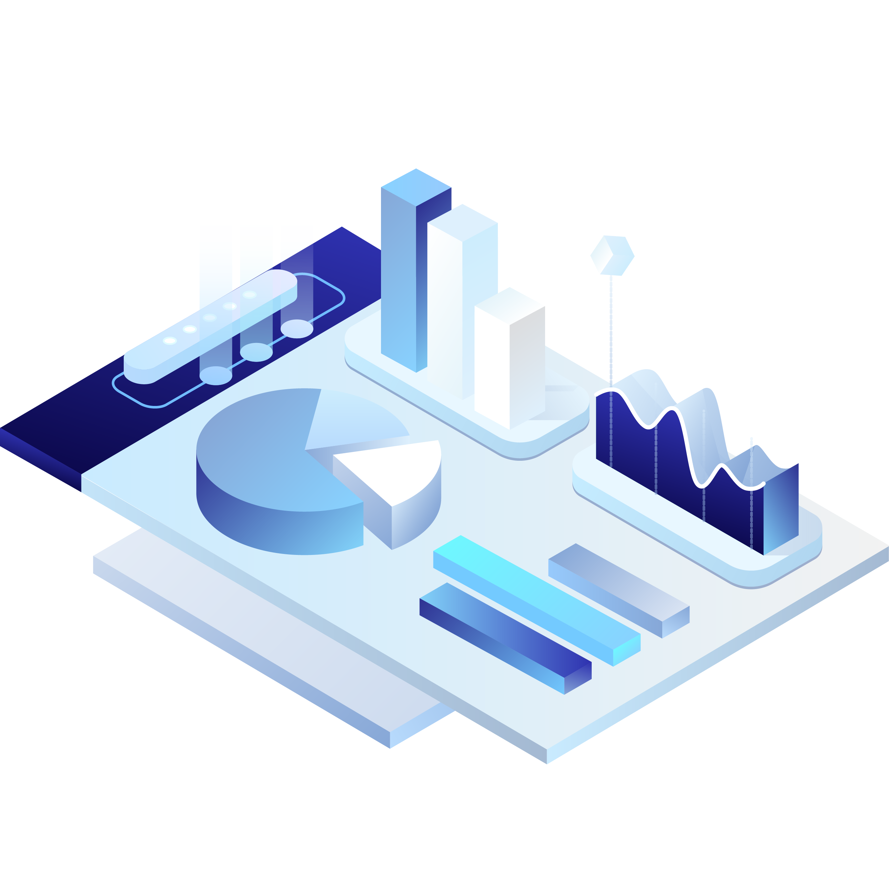
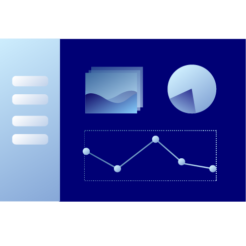
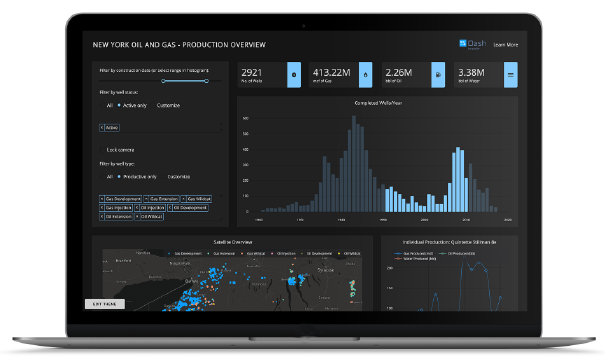
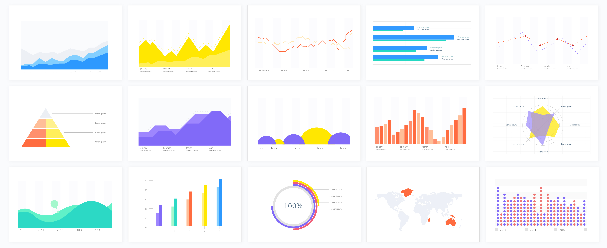
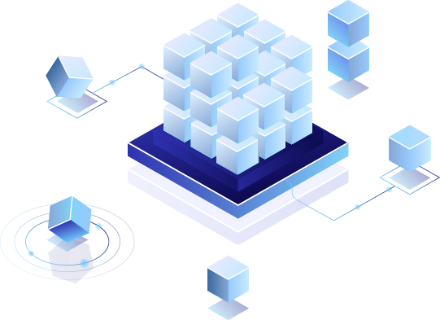
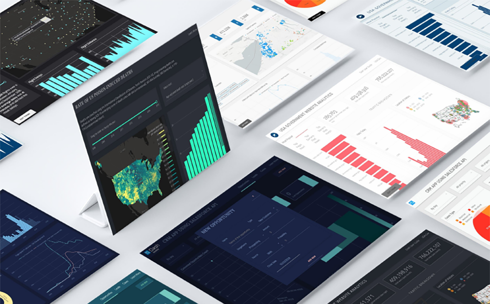
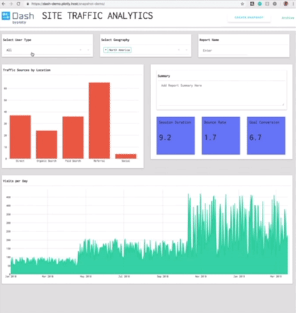
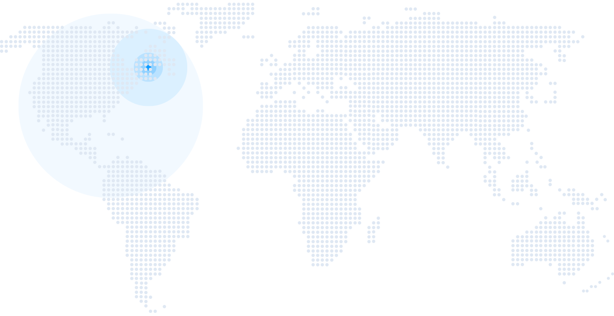

Dash by Plotly

# Build beautiful, web-based analytics applications with Dash

Dash is a Python framework for building analytical web applications.
No JavaScript required.

[DASH OPEN SOURCE](https://dash.plot.ly/getting-started)[DASH ENTERPRISE TRIAL](https://plotly.typeform.com/to/rkO85m)

## SOLUTIONS

#

Build, Test, Deploy.
At any scale.
DASH

## Dash is the fastest way to build shareable, interactive analytics apps.

Build beautiful, modern UI elements like drop-downs, sliders, and graphs around your data analytics code. No JavaScript required.

[GET STARTED](https://dash.plot.ly/getting-started)
DASH ENTERPRISE

## Dash enterprise offerings drive app development and deployment at scale.

Empower your teams with collaborative data workflows to design, build, and deploy analytic apps that deliver insight across the organization.

[LEARN MORE](https://plot.ly/dash/pricing)
Features

# Dash is Productive

Productive

Before Dash, it would take an entire team of engineers and designers to create interative analtyics apps.

Completely Customizable

Every aesthetic element of a Dash app is customizable and rendered in the web so you can employ the full power of CSS.

Lightweight

Dash apps require very little boilerplate to get started. A fully-functional analytics app can weigh in at just 40 lines of Python or R code.

Direct Control

Dash links interactive UI controls and displays, like sliders, dropdown menus, and graphs, to your data analytics code, giving you hands-on input for your data views.

Dash In Action

# Oil and Gas Dashboard

This Dash app displays oil production in western New York. Filters at the top of the app update the graphs below. Selecting or hovering over data in one plot will update the other plots ('cross-filtering').

Dash apps are powered by Plotly.js, a fully featured charting library including maps like these, financial charts, scientific graphs, and more.

[Dash Gallery](https://dash.plot.ly/gallery)

# Open Source With Enterprise Addons

We're strong believers that the future of technical computing and business intelligence is open source. Dash is MIT licensed. Run Dash on your desktop environment for free.

Using Dash inside your enterprise? Plotly offers the Dash Deployment Server for one-click app deployment and app permissioning with LDAP and Active Directory, all behind your corporate firewall.

[LEARN MORE](https://plot.ly/dash/pricing)
Dash Product Family

# Dash Deployment Server

Dash Deployment Server is designed to speed your time-to-delivery while providing the right resources, security, and scalability you need to deliver production-quality apps. Our server setups give you dedicated, secure environments for every step- from concept to production deployment.

- •Scalable deployment server, home for your company's mission critical apps.
- •Single, secure development environment.
- •Reliable and secure access for your stakeholders with integrated LDAP and SAML authentication.
- •Quickly develop, iterate, and share Dash apps.
- •A collaborative development experience that supports sharing between multiple app authors and development teams.

[Get Pricing](https://plot.ly/dash/pricing)

Dash Product Family

# Dash Design Kit

Dash Design Kit lets you easily arrange, style, and customize your Dash apps so you can go from exploration and discovery to deploying beautiful, production-ready apps in no time.

- •Experiment with different layouts and iteratively modify your apps.
- •Include customizable controls, headers, and navigational elements.
- •Add annotations and highlight KPIs.
- •Apply custom colors and styles.
- •Create fully responsive, mobile-friendly apps.

[Get Pricing](https://plot.ly/dash/pricing)
Dash Product Family

# Snapshot Engine

Snapshot Engine seamlessly links your analytics and reporting workflows together, giving you a fast way to generate interactive reports of just the data you need, presented just the way you need it.

- •Create beautiful reports in the form of interactive, printable PDFs or analytic web applications.
- •Automate the time consuming process of reporting and monitoring streaming data flows.
- •Historical archiving, versioning, and status tracking facilitate auditing and compliance and create institutional memory.

[Get Pricing](https://plot.ly/dash/pricing)

# Join The Next Generation

Get started now with the world's most modern enterprise data visualization solutions.

[Contact Sales](https://plotly.typeform.com/to/ECUfbT)