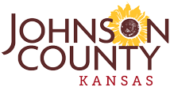
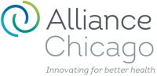
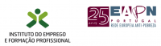
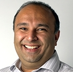
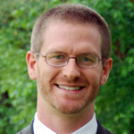
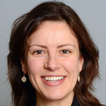

Data Science for Social Good Summer Fellowship

[**DSSG 2019 Fellowships kicked off at Imperial College London on June 3 and Alan Turing Institute/University of Warwick on June 10]()

-
-
-
-
-
-
-
-
-
-
-
.

# We’re training data scientists to tackle problems that really matter.

#### Applications for the 2019 programs are now closed. We’re running two DSSG programs at Alan Turing Institute/University of Warwick (at Warwick) and at Imperial College London.

[Apply to be a Data Science Mentor!](https://dssg.uchicago.edu/2019mentor)

[Submit a Project Proposal](https://dssg.uchicago.edu/faq-for-dssg-project-partners/)

[Sign up for our Mailing List](http://dssg.us7.list-manage.com/subscribe?u=e926f7378762c658c445fe119&id=6053f5e6e3)

#### [Join our mailing list](http://eepurl.com/zNWrT) to get updates and/or to attend our events this summer.

**The Data Science for Social Good Fellowship** is a [University of Chicago](http://dsapp.uchicago.edu/) summer program to train aspiring data scientists to work on data mining, machine learning, big data, and data science projects with social impact. Working closely with governments and nonprofits, fellows take on **real-world problems** in education, health, energy, public safety, transportation, economic development, international development, and more.

For **three months** they learn, hone, and apply their data science, analytical, and coding skills, collaborate in a fast-paced atmosphere, and learn from mentors coming from industry and academia.

# The 2019 Summer Fellowships

# [Imperial College London](http://dssg.uchicago.edu/people/2019-fellows-mentors-imperial/)

**20 Fellows

**5 Projects

**12 Weeks

# [Warwick & Alan Turing Institute ](https://dssg.uchicago.edu/europe/)

**20 Fellows

**5 Projects

**12 Weeks

In 2019, we are expanding globally and running two programs in the UK: one in collaboration with Alan Turing Institute and University of Warwick, and the other other with Imperial College London. The 2019 programs are bringing **40** aspiring data scientists from across the world to London and Warwick. They are current (or recent) graduate and undergraduate students from quantitative and computational fields – from computer science and machine learning, to statistics, math, physical sciences and engineering, to social sciences, public health and public policy.

From June until ends of August, they are working in teams of 3-4 on data science projects in partnership with nonprofits and government agencies, to tackle data-intensive high impact problems in education, public health, public safety, transportation, criminal justice, environmental issues, city operations, and social services, learning from full-time experienced mentors and project managers.

# News

Dec 10,2018
**

#### [Data Science for Social Good Adds UK Locations, Opens 2019 Applications](https://dssg.uchicago.edu/2018/12/10/data-science-for-social-good-adds-uk-locations-opens-2019-applications/)

Data Science for Social Good Adds UK Locations, Opens 2019 Applications Now seeking students, staff and project partners for program’s [...]

Nov 12,2018
**

#### [Improving Workplace Safety in Chile through Proactive Inspections](https://dssg.uchicago.edu/2018/11/12/chile-workplace-safety/)

Improving Workplace Safety in Chile through Proactive InspectionsEvery year, thousands of Chileans are killed or injured in work-related accidents. This [...]

Sep 19,2018
**

#### [Improving Traffic Safety in Jakarta Through Video Analysis](https://dssg.uchicago.edu/2018/09/19/improving-traffic-safety-in-jakarta/)

João Caldeira, Alex Fout, Aniket Kesari, Raesetje Sefala UPDATE: We are pleased to announce that this project team won a [...]

Aug 7,2018
**

#### [Tackling Tenant Harassment in New York City: 
A Data-Driven Approach](https://dssg.uchicago.edu/2018/08/07/tackling-tenant-harassment-in-new-york-city-%e2%80%a8a-data-driven-approach/)

Jerica Copeny, Samantha Fu, Rebecca Johnson, and Teng Ye Tackling Tenant Harassment in New York City: 
A Data-Driven Approach This [...]

Jul 2,2018
**

#### [Data Science for Social Good Announces 2018 Projects in Chicago and Lisbon](https://dssg.uchicago.edu/2018/07/02/data-science-for-social-good-announces-2018-projects-in-chicago-and-lisbon/)

2018 Data Science for Social Good Goes Global, Tackling Diabetes, Tenant Harassment, Unemployment, and More Fellows in Chicago and Portugal [...]

Mar 29,2018
**

#### [Human Lessons Learned Implementing Early Intervention Systems in Charlotte and Nashville](https://dssg.uchicago.edu/2018/03/29/human-lessons-learned-implementing-early-intervention-systems-in-charlotte-and-nashville/)

Human Lessons Learned Implementing Early Intervention Systems in Charlotte and Nashville This is the third in our three-part series “Lessons [...]

### [Read more of our blog posts…](http://dssg.uchicago.edu/blog/)

# Featured Projects

- 

#### [Proactive Outreach to Reduce Harassment of NYC Rental Housing Tenants](https://dssg.uchicago.edu/project/proactive-outreach-to-reduce-harassment-of-nyc-rental-housing-tenants/)

- 

#### [Identifying Factors Driving School Dropout and Improving the Impact of Social Programs in El Salvador](https://dssg.uchicago.edu/project/identifying-factors-driving-school-dropout-and-improving-the-impact-of-social-programs-in-el-salvador/)

- 

#### [Improving Traffic Safety Through Video Analysis](https://dssg.uchicago.edu/project/improving-traffic-safety-through-video-analysis/)

- 

#### [Reducing Recidivism and Improving Outcomes for People with Complex Health Needs](https://dssg.uchicago.edu/project/reducing-recidivism-and-improving-outcomes-for-people-with-complex-health-needs/)

- 

#### [Supporting Proactive Diabetes Screenings to Improve Health Outcomes](https://dssg.uchicago.edu/project/supporting-proactive-diabetes-screenings-to-improve-health-outcomes/)

- 

#### [Improving Workplace Safety through Proactive Inspections](https://dssg.uchicago.edu/project/improving-workplace-safety-through-proactive-inspections/)

- 

#### [Identifying rooftop usage in Rotterdam](https://dssg.uchicago.edu/project/identifying-rooftop-usage-in-rotterdam/)

- 

#### [Predicting long-term unemployment in Portugal](https://dssg.uchicago.edu/project/predicting-long-term-unemployment-in-continental-portugal/)



# Team

The fellowship is led by [Rayid Ghani](http://www.rayidghani.com/) from the Department of Computer Science & Harris School of Public Policy at the University of Chicago, and Former Chief Data Scientist of the 2012 Obama campaign. It’s organized by an interdisciplinary team from the Center for Data Science and Public Policy, which is a University of Chicago initiative across the [Department of Computer Science](http://www.ci.uchicago.edu/) and the [Harris School of Public Policy](http://harrisschool.uchicago.edu/).

Rayid GhaniDirector
[](http://www.twitter.com/rayidghani)
 Director, Center for Data Science & Public Policy
Computation Institute and Harris School Of Public Policy

Joe Walsh
 Data Scientist, Center for Data Science & Public Policy

Elena EnevaCo-Director of the Chicago Program
[](http://www.twitter.com/rayidghani)

Rob MitchumCommunications