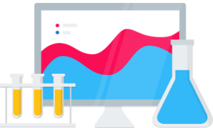
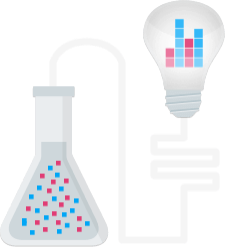
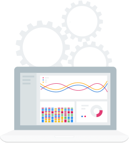
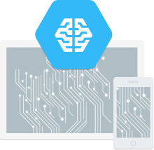

Data Science in the Cloud  |  Google Cloud Platform

# Google Cloud Platform for Data Scientists

## Scalable, easy-to-use infrastructure and tooling for Data Scientists

 [Development Guides](https://cloud.google.com/data-science/#development_guides)  [View My Console](https://console.cloud.google.com/)

## Analyze and Strategize More Intelligently

Google Cloud Platform provides data scientists **key technology and tools to extract tangible business value from massive data assets**. From managed Spark clusters and fast SQL analysis to the latest in machine learning, Google Cloud Platform **empowers data scientists** to spend more time finding value in data and less time worrying about infrastructure. Whether the task at hand is tactical optimization, predictive analytics, nuanced learning, recommendation engines or building automated decision engines, Google Cloud Platform helps Data Scientists **work smarter**.

## From Bucket of Bits to Understanding

Google Cloud Platform makes it easy for you to analyze data regardless of how it’s stored. For structured data, [Google BigQuery](https://cloud.google.com/bigquery/) is a **fully managed, low-cost data warehouse** with full SQL compatibility as well as integration with Python, R, and a host of other languages. For more general storage, [Google Cloud Storage](https://cloud.google.com/storage/) provides **powerful, simple storage** accessible from any part of GCP. Either way, access your data through Apache Spark running on [Google Cloud Dataproc](https://cloud.google.com/dataproc/), stream and analyze it through [Google Cloud Dataflow](https://cloud.google.com/dataflow/), or use it as the foundation for model building with [Google Cloud Machine Learning](https://cloud.google.com/ml/). Finally, manage it all through [Google Cloud Datalab](https://cloud.google.com/datalab/), our notebook-driven environment for data science and machine learning.

## Data Science, Not DevOps

Google Cloud Platform enables Data Science teams to work without the burden of managing infrastructure. GCP tools like [Google BigQuery](https://cloud.google.com/bigquery/), the rocket-fast data warehouse, are **serverless**: you always have the resources you need and only **pay for what you use**. Through a **rich set of client APIs**, BigQuery integrates with [Pandas](http://pandas.pydata.org/), [dplyr](https://cran.r-project.org/web/packages/dplyr/vignettes/databases.html), and more of the most popular libraries for data analysis. [Cloud Dataflow](https://cloud.google.com/dataflow/) provides a serverless means of running batch and streaming data pipelines -- perfect for **cleaning data** or **scoring models** on streaming data. [Cloud Dataflow Python support](https://cloud.google.com/blog/big-data/2016/03/google-announces-cloud-dataflow-with-python-support) ensures that Python-based data scientists can take advantage of the [Apache Beam](http://beam.apache.org/) programming model, while still using their tools of choice.

## Open-Source Analysis Platform

Google Cloud Platform makes it simple for Data Scientists to benefit from the **latest innovations in open source software**. [Google Cloud Dataproc](https://cloud.google.com/dataproc/) enables users to create managed **  [Apache Spark](http://spark.apache.org/) clusters in seconds**, complete with [Apache Zeppelin](https://zeppelin.apache.org/) or [Jupyter](http://jupyter.org/) notebooking. Teams designing the next generation of data processing tools in [Apache Beam](http://beam.apache.org/) can utilize [Cloud Dataflow](https://cloud.google.com/dataflow/), [Apache Spark](http://spark.apache.org/) or [Apache Flink](https://flink.apache.org/). GCP is **committed to open-source** to disseminate and broaden both the Data Science and Machine Learning communities. To this end, Google has open-sourced [Cloud Datalab](https://cloud.google.com/datalab/), its Jupyter-based notebooking environment, and [TensorFlow](https://www.tensorflow.org/), its deep-learning library.

## The Cloud Machine Learning Platform

 [Google Cloud Machine Learning Platform](https://cloud.google.com/products/machine-learning/?utm_source=google&utm_medium=cpc&utm_campaign=2016-q1-cloud-na-stackdriver-bkws-freetrial&gclid=CjwKEAjwmMS-BRCm5dn51JLbp1wSJACc61tFO4Iv3zBtmrksIxy4BBtVgGG1aYBJnzHRc2zDxqTyuhoCR3vw_wcB) makes it easy for Data Science teams to pursue innovative machine learning. With Google Machine Learning APIs, teams can use Google-built models to analyze and understand their data using simple APIs for **cutting edge image and speech recognition**, natural language processing, and machine translation. Using [CloudML](https://cloud.google.com/ml/), Data Scientists can **train and operationalize** their own deep learning models using [TensorFlow](https://www.tensorflow.org/) and [Cloud Datalab](https://cloud.google.com/datalab/). CloudML directly integrates with other GCP products like [Google Cloud Storage](https://cloud.google.com/storage/) or [Google BigQuery](https://cloud.google.com/bigquery/) so you can easily unlock valuable insight from our data.

 