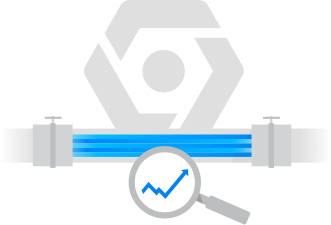

Data plumbing — Is my data pipeline processing events?

# Data plumbing — Is my data pipeline processing events?

[David Sabater Dinter](https://medium.com/@Dsdinter)
May 13·4 min read

This example shows how to implement a probe in GCP with [Cloud Scheduler](https://cloud.google.com/scheduler/), Google Cloud fully managed enterprise-grade cron job scheduler, to [check whether an end to end pipeline is working or not](https://twitter.com/polleyg/status/1125651245035712512).

Imaging you are building an amazing but complicated multi step pipeline to implement your [streaming analytics](https://cloud.google.com/solutions/big-data/stream-analytics/) use case, involving a number of GCP [Pubsub](https://cloud.google.com/pubsub/) topics and [Dataflow](https://cloud.google.com/dataflow/) streaming jobs to process the events, in addition the pipeline may be interacting with other services to enrich the events and write to an external sink.

You are now about to go-live and start opening the “taps” for the events to flow through the pipeline. When it comes to monitoring your pipeline, you have powerful metrics available to monitor your [Pubsub topics](https://cloud.google.com/pubsub/docs/monitoring) or your [Dataflow jobs](https://cloud.google.com/dataflow/docs/guides/using-stackdriver-monitoring) individually, but what happens when you want to check the status of the pipeline end to end in a holistic way?

- •Can I not just monitor the first topic and last Dataflow job and generate alerts accordingly? You can, but we still need to validate if the lack of events is because the data sources are not sending events or if there is a problem accepting new events, also the last streaming job may not be receiving anything because is stuck in an intermediate job between two topics while enriching the event with some metadata for example. Even worse, you will not identify errors in advance until you receive new events which will raise them, too late!
- •Can I then inject some dummy events using some sort of probe/health check? Sure you can! You want valid events that will be processed through the pipeline end to end, which can then be inserted in your sink at the end of the pipeline to be purged periodically. Then an alert can be generated if the probe fails to inject events or we are not receiving anything in the dead letter sink.

Let’s demonstrate how we can implement the probe with Cloud Scheduler using the below GCP **serverless** services:

- •Cloud Scheduler as the probe to generate events injected in our Pubsub Topic
- •GCP [Pubsub](https://cloud.google.com/pubsub/) Topic as messaging service
- •GCP [Dataflow](https://cloud.google.com/dataflow/) template to process our events and emit results to big query
- •[GCP BigQuery](https://cloud.google.com/bigquery/), Google fast, highly scalable, cost-effective, and fully managed cloud data warehouse for analytics, as sink

#### Example

We will just demonstrate the concept with a simple example using `gcloud commands` from your GCP project’s [Cloud Shell](https://cloud.google.com/shell/) (It can also be done through the GCP UI console) and leveraging a [Dataflow template](https://github.com/GoogleCloudPlatform/DataflowTemplates) for simplicity.

We will inject the below simple JSON message:
{“id”:”test”,”data”:”Testing probe”}

0. Before you start, make sure you have correct permissions and the APIs enabled in your project for the required components (Pubsub, BigQuery, GCS and Dataflow)

1. 1.Lets create our Pubsub topic:
gcloud pubsub topics create **[TOPIC_NAME]**

2. We continue with BigQuery, creating the output table, in reality this can be a Topic we monitor or any other sink we have available. We use BigQuery to be able to query the results easily, in that case we need to create the table with a schema compatible with the message we will inject from the probe. Using [*bq*](https://cloud.google.com/bigquery/docs/bq-command-line-tool) command line tool:

`bq --location=**[LOCATION]** mk --dataset **[PROJECT_ID]**:**[DATASET]**[[NEWLINE]]bq mk --table **[PROJECT_ID]**:**[DATASET]**.**[TABLE]** id:STRING,data:STRING`

3. We can now submit a [Dataflow template](https://cloud.google.com/dataflow/docs/guides/templates/overview) to pull messages from our topic and insert them in BigQuery. For this example we will use a simple streaming job [**PubSubtoBigQuery**](https://cloud.google.com/dataflow/docs/guides/templates/provided-templates#cloud-pubsub-to-bigquery), which can be used as baseline and extend accordingly. This template ingests JSON messages, executes a UDF to transform the messages and inserts them in BigQuery, all this without coding any Java or Python but using our own parameters, excellent!

gcloud dataflow jobs run **[JOB_NAME]** \
--gcs-location gs://dataflow-templates/latest/PubSub_to_BigQuery \
--parameters \
inputTopic=projects/**[PROJECT_ID]**/topics/**[TOPIC]**,\
outputTableSpec=**[PROJECT_ID]**:**[DATASET]**.**[TABLE_NAME]**
4. Finally, we need to create our probe with GCP scheduler, easy peasy!

gcloud beta scheduler jobs create pubsub **[JOB] **`--schedule`="*` * * * *"`  `--topic`=**[**`**TOPIC]** --`message-body='{“id”:”test”,”data”:”Testing probe”}'

We are scheduling our probe using [cron format](https://en.wikipedia.org/wiki/Cron#Overview), in our example is scheduled minutely but we can easily change it to something like hourly with `"0 * * * *"`.

Now that we have scheduled the probe we can validate that indeed we are receiving the messages from the probe every minute. The below query should return rows for every message the probe has injected in our pipeline.

bq query --use_legacy_sql=false 'SELECT * FROM `**[DATASET]**.**[TABLE_NAME]**` LIMIT 1000'

#### Conclusion

This simple example using serverless services showed how to implement a probe to inject messages in our pipeline to validate is fully working. Hopefully this can give people an idea about how to implement a probe for their own specific pipelines, bear in mind though, complex use cases like injecting messages with updated timestamps are not supported directly, as the Cloud Scheduler does not support dynamic messages at the moment.