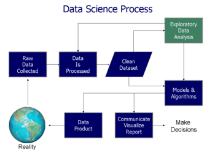

Data science - Wikipedia

# Data science

From Wikipedia, the free encyclopedia

Jump to:[navigation](https://en.wikipedia.org/wiki/Data_science#mw-head),[search](https://en.wikipedia.org/wiki/Data_science#p-search)

Not to be confused with [information science](https://en.wikipedia.org/wiki/Information_science).

| [Machine learning](https://en.wikipedia.org/wiki/Machine_learning) and [data mining](https://en.wikipedia.org/wiki/Data_mining) |
| --- |
|  |
| Problems[[show]](https://en.wikipedia.org/wiki/Data_science#) |
| [Supervised learning](https://en.wikipedia.org/wiki/Supervised_learning) (**[classification](https://en.wikipedia.org/wiki/Statistical_classification)** • **[regression](https://en.wikipedia.org/wiki/Regression_analysis)**) [[show]](https://en.wikipedia.org/wiki/Data_science#) |
| [Clustering](https://en.wikipedia.org/wiki/Cluster_analysis)[[show]](https://en.wikipedia.org/wiki/Data_science#) |
| [Dimensionality reduction](https://en.wikipedia.org/wiki/Dimensionality_reduction)[[show]](https://en.wikipedia.org/wiki/Data_science#) |
| [Structured prediction](https://en.wikipedia.org/wiki/Structured_prediction)[[show]](https://en.wikipedia.org/wiki/Data_science#) |
| [Anomaly detection](https://en.wikipedia.org/wiki/Anomaly_detection)[[show]](https://en.wikipedia.org/wiki/Data_science#) |
| [Neural nets](https://en.wikipedia.org/wiki/Artificial_neural_network)[[show]](https://en.wikipedia.org/wiki/Data_science#) |
| [Reinforcement learning](https://en.wikipedia.org/wiki/Reinforcement_learning)[[show]](https://en.wikipedia.org/wiki/Data_science#) |
| Theory[[show]](https://en.wikipedia.org/wiki/Data_science#) |
| Machine-learning venues[[show]](https://en.wikipedia.org/wiki/Data_science#) |
| Related articles[[show]](https://en.wikipedia.org/wiki/Data_science#) |
| -   [Machine learning portal](https://en.wikipedia.org/wiki/Portal:Machine_learning) |
| - [v](https://en.wikipedia.org/wiki/Template:Machine_learning_bar) · - [t](https://en.wikipedia.org/wiki/Template_talk:Machine_learning_bar) · - [e](https://en.wikipedia.org/w/index.php?title=Template:Machine_learning_bar&action=edit) |

**Data science**, also known as **data-driven science**, is an interdisciplinary field about scientific methods, processes, and systems to extract [knowledge](https://en.wikipedia.org/wiki/Knowledge) or insights from [data](https://en.wikipedia.org/wiki/Data) in various forms, either structured or unstructured,[[1]](https://en.wikipedia.org/wiki/Data_science#cite_note-:0-1)[[2]](https://en.wikipedia.org/wiki/Data_science#cite_note-2) similar to [data mining](https://en.wikipedia.org/wiki/Data_mining).

Data science is a "concept to unify statistics, data analysis and their related methods" in order to "understand and analyze actual phenomena" with data.[[3]](https://en.wikipedia.org/wiki/Data_science#cite_note-Hayashi-3) It employs techniques and theories drawn from many fields within the broad areas of [mathematics](https://en.wikipedia.org/wiki/Mathematics), [statistics](https://en.wikipedia.org/wiki/Statistics), [information science](https://en.wikipedia.org/wiki/Information_science), and [computer science](https://en.wikipedia.org/wiki/Computer_science), in particular from the subdomains of [machine learning](https://en.wikipedia.org/wiki/Machine_learning), [classification](https://en.wikipedia.org/wiki/Classification), [cluster analysis](https://en.wikipedia.org/wiki/Cluster_analysis), [data mining](https://en.wikipedia.org/wiki/Data_mining), [databases](https://en.wikipedia.org/wiki/Database), and [visualization](https://en.wikipedia.org/wiki/Data_visualization).

[Turing award](https://en.wikipedia.org/wiki/Turing_award) winner [Jim Gray](https://en.wikipedia.org/wiki/Jim_Gray_(computer_scientist)) imagined data science as a "fourth paradigm" of science ([empirical](https://en.wikipedia.org/wiki/Empirical_research), [theoretical](https://en.wikipedia.org/wiki/Basic_research), computational and now data-driven) and asserted that "everything about science is changing because of the impact of information technology" and the [data deluge](https://en.wikipedia.org/wiki/Information_explosion).[[4]](https://en.wikipedia.org/wiki/Data_science#cite_note-TansleyTolle2009-4)[[5]](https://en.wikipedia.org/wiki/Data_science#cite_note-BellHey2009-5)

When [Harvard Business Review](https://en.wikipedia.org/wiki/Harvard_Business_Review) called it "The Sexiest Job of the 21st Century"[[6]](https://en.wikipedia.org/wiki/Data_science#cite_note-Harvard-6) the term became a [buzzword](https://en.wikipedia.org/wiki/Buzzword), and is now often applied to [business analytics](https://en.wikipedia.org/wiki/Business_analytics),[[7]](https://en.wikipedia.org/wiki/Data_science#cite_note-GilPress-7) or even arbitrary use of data, or used as a sexed-up term for statistics.[[8]](https://en.wikipedia.org/wiki/Data_science#cite_note-NateSilver-8) While many university programs now offer a data science degree, there exists no consensus on a definition or curriculum contents.[[7]](https://en.wikipedia.org/wiki/Data_science#cite_note-GilPress-7) Because of the current popularity of this term, there are many "advocacy efforts" surrounding it.[[9]](https://en.wikipedia.org/wiki/Data_science#cite_note-ASA-9)

## History[[edit](https://en.wikipedia.org/w/index.php?title=Data_science&action=edit&section=1)]

[(L)](https://en.wikipedia.org/wiki/File:Data_visualization_process_v1.png)

Data science process flowchart from "Doing Data Science", Cathy O'Neil and Rachel Schutt, 2013

The term "data science" (originally used interchangeably with "[datalogy](https://en.wikipedia.org/wiki/Datalogy)") has existed for over thirty years and was used initially as a substitute for [computer science](https://en.wikipedia.org/wiki/Computer_science) by [Peter Naur](https://en.wikipedia.org/wiki/Peter_Naur) in 1960. In 1974, Naur published *Concise Survey of Computer Methods*, which freely used the term data science in its survey of the contemporary data processing methods that are used in a wide range of applications.

In 1996, members of the International Federation of Classification Societies (IFCS) met in Kobe for their biennial conference. Here, for the first time, the term data science is included in the title of the conference ("Data Science, classification, and related methods"),[[10]](https://en.wikipedia.org/wiki/Data_science#cite_note-10) after the term was introduced in a roundtable discussion by Chikio Hayashi.[[3]](https://en.wikipedia.org/wiki/Data_science#cite_note-Hayashi-3)

In November 1997, [C.F. Jeff Wu](https://en.wikipedia.org/wiki/C.F._Jeff_Wu) gave the inaugural lecture entitled "Statistics = Data Science?"[[11]](https://en.wikipedia.org/wiki/Data_science#cite_note-cfjwutk-11) for his appointment to the H. C. Carver Professorship at the [University of Michigan](https://en.wikipedia.org/wiki/University_of_Michigan).[[12]](https://en.wikipedia.org/wiki/Data_science#cite_note-cfjwu01-12) In this lecture, he characterized statistical work as a trilogy of data collection, data modeling and analysis, and decision making. In his conclusion, he initiated the modern, non-computer science, usage of the term "data science" and advocated that statistics be renamed data science and statisticians data scientists.[[11]](https://en.wikipedia.org/wiki/Data_science#cite_note-cfjwutk-11) Later, he presented his lecture entitled "Statistics = Data Science?" as the first of his 1998 P.C. Mahalanobis Memorial Lectures.[[13]](https://en.wikipedia.org/wiki/Data_science#cite_note-cfjwu02-13) These lectures honor [Prasanta Chandra Mahalanobis](https://en.wikipedia.org/wiki/Prasanta_Chandra_Mahalanobis), an Indian scientist and statistician and founder of the [Indian Statistical Institute](https://en.wikipedia.org/wiki/Indian_Statistical_Institute).

In 2001, William S. Cleveland introduced data science as an independent discipline, extending the field of statistics to incorporate "advances in computing with data" in his article "Data Science: An Action Plan for Expanding the Technical Areas of the Field of Statistics," which was published in Volume 69, No. 1, of the April 2001 edition of the International Statistical Review / Revue Internationale de Statistique.[[14]](https://en.wikipedia.org/wiki/Data_science#cite_note-cleveland01-14) In his report, Cleveland establishes six technical areas which he believed to encompass the field of data science: multidisciplinary investigations, models and methods for data, computing with data, pedagogy, tool evaluation, and theory.

In April 2002, the International Council for Science (ICSU): Committee on Data for Science and Technology (CODATA)[[15]](https://en.wikipedia.org/wiki/Data_science#cite_note-ics12-15) started the *Data Science Journal*,[[16]](https://en.wikipedia.org/wiki/Data_science#cite_note-dsj12-16) a publication focused on issues such as the description of data systems, their publication on the internet, applications and legal issues.[[17]](https://en.wikipedia.org/wiki/Data_science#cite_note-dsj02-17) Shortly thereafter, in January 2003, Columbia University began publishing *The Journal of Data Science*,[[18]](https://en.wikipedia.org/wiki/Data_science#cite_note-jds03-18) which provided a platform for all data workers to present their views and exchange ideas. The journal was largely devoted to the application of statistical methods and quantitative research. In 2005, The National Science Board published "Long-lived Digital Data Collections: Enabling Research and Education in the 21st Century" defining data scientists as "the information and computer scientists, database and software and programmers, disciplinary experts, curators and expert annotators, librarians, archivists, and others, who are crucial to the successful management of a digital data collection" whose primary activity is to "conduct creative inquiry and analysis."[[19]](https://en.wikipedia.org/wiki/Data_science#cite_note-19)

In the 2012 [Harvard Business Review](https://en.wikipedia.org/wiki/Harvard_Business_Review) article "Data Scientist: The Sexiest Job of the 21st Century",[[6]](https://en.wikipedia.org/wiki/Data_science#cite_note-Harvard-6)  [DJ Patil](https://en.wikipedia.org/wiki/DJ_Patil) claims to have coined this term in 2008 with [Jeff Hammerbacher](https://en.wikipedia.org/wiki/Jeff_Hammerbacher) to define their jobs at LinkedIn and Facebook, respectively. He asserts that a data scientist is "a new breed", and that a "shortage of data scientists is becoming a serious constraint in some sectors", but describes a much more business oriented role.

In 2013, the IEEE Task Force on Data Science and Advanced Analytics[[20]](https://en.wikipedia.org/wiki/Data_science#cite_note-20) was launched. In 2013, the first "European Conference on Data Analysis (ECDA)" was organised in Luxembourg, establishing the [European Association for Data Science (EuADS)](http://euads.org/). The first international conference: IEEE International Conference on Data Science and Advanced Analytics was launched in 2014.[[21]](https://en.wikipedia.org/wiki/Data_science#cite_note-21) In 2014, [General Assembly](https://en.wikipedia.org/wiki/General_Assembly_(school)) launched student-paid bootcamp and [The Data Incubator](https://en.wikipedia.org/wiki/The_Data_Incubator) launched a competitive free data science fellowship.[[22]](https://en.wikipedia.org/wiki/Data_science#cite_note-22). In 2014, the [American Statistical Association](https://en.wikipedia.org/wiki/American_Statistical_Association) section on Statistical Learning and Data Mining renamed its journal to "Statistical Analysis and Data Mining: The ASA Data Science Journal" and in 2016 changed its section name to "Statistical Learning and Data Science".[[9]](https://en.wikipedia.org/wiki/Data_science#cite_note-ASA-9). In 2015, the International Journal on Data Science and Analytics[[23]](https://en.wikipedia.org/wiki/Data_science#cite_note-23) was launched by Springer to publish original work on data science and big data analytics. In September 2015 the [Gesellschaft für Klassifikation (GfKl)](http://www.gfkl.org/welcome/) added to the name of the Society "Data Science Society" at the third ECDA conference at the [University of Essex](https://en.wikipedia.org/wiki/University_of_Essex), Colchester, UK.

## Relationship to Statistics[[edit](https://en.wikipedia.org/w/index.php?title=Data_science&action=edit&section=2)]

The popularity of the term "data science" has exploded in business environments and academia, as indicated by a jump in job openings.[[24]](https://en.wikipedia.org/wiki/Data_science#cite_note-24) However, many critical academics and journalists see no distinction between data science and [statistics](https://en.wikipedia.org/wiki/Statistics). Writing in [Forbes](https://en.wikipedia.org/wiki/Forbes), Gil Press argues that data science is a [buzzword](https://en.wikipedia.org/wiki/Buzzword) without a clear definition and has simply replaced “[business analytics](https://en.wikipedia.org/wiki/Business_analytics)” in contexts such as graduate degree programs.[[7]](https://en.wikipedia.org/wiki/Data_science#cite_note-GilPress-7) In the question-and-answer section of his keynote address at the Joint Statistical Meetings of [American Statistical Association](https://en.wikipedia.org/wiki/American_Statistical_Association), noted applied statistician [Nate Silver](https://en.wikipedia.org/wiki/Nate_Silver) said, “I think data-scientist is a sexed up term for a statistician....Statistics is a branch of science. Data scientist is slightly redundant in some way and people shouldn’t berate the term statistician.”[[8]](https://en.wikipedia.org/wiki/Data_science#cite_note-NateSilver-8) Similarly, in business sector, multiple researchers and analysts state that data scientists alone are far from being sufficient in granting companies a real competitive advantage[[25]](https://en.wikipedia.org/wiki/Data_science#cite_note-25) and consider data scientists as only one of the four greater job families companies require to leverage big data effectively, namely: [business analysts](https://en.wikipedia.org/wiki/Business_analyst), data scientists, big data [developers](https://en.wikipedia.org/wiki/Software_Developer) and Big Data [engineers](https://en.wikipedia.org/wiki/Software_engineer).[[26]](https://en.wikipedia.org/wiki/Data_science#cite_note-26)

On the other hand, responses to criticism are as numerous. In a 2014 [Wall Street Journal](https://en.wikipedia.org/wiki/The_Wall_Street_Journal) article, Irving Wladawsky-Berger compares the data science enthusiasm with the dawn of [computer science](https://en.wikipedia.org/wiki/Computer_science). He argues data science, like any other [interdisciplinary](https://en.wikipedia.org/wiki/Interdisciplinarity) field, employs [methodologies](https://en.wikipedia.org/wiki/Methodology) and practices from across the [academia](https://en.wikipedia.org/wiki/Academy) and [industry](https://en.wikipedia.org/wiki/Industry), but then it will morph them into a new [discipline](https://en.wikipedia.org/wiki/Discipline_(academia)). He brings to attention the sharp criticisms computer science, now a well respected academic discipline, had to once face.[[27]](https://en.wikipedia.org/wiki/Data_science#cite_note-:1-27) Likewise, [NYU](https://en.wikipedia.org/wiki/New_York_University)  [Stern's](https://en.wikipedia.org/wiki/NYU_Stern_Center_for_Business_and_Human_Rights) Vasant Dhar, as do many other academic proponents of data science,[[27]](https://en.wikipedia.org/wiki/Data_science#cite_note-:1-27) argues more specifically in December 2013 that data science is different from the existing practice of data analysis across all [disciplines](https://en.wikipedia.org/wiki/Discipline_(academia)), which focuses only on explaining [data sets](https://en.wikipedia.org/wiki/Data_set). Data science seeks actionable and consistent [pattern](https://en.wikipedia.org/wiki/Pattern_recognition) for [predictive uses](https://en.wikipedia.org/wiki/Predictive_modelling).[[1]](https://en.wikipedia.org/wiki/Data_science#cite_note-:0-1) This practical engineering goal takes data science beyond traditional [analytics](https://en.wikipedia.org/wiki/Analytics). Now the data in those disciplines and [applied fields](https://en.wikipedia.org/wiki/Applied_science) that lacked solid [theories](https://en.wikipedia.org/wiki/Theory), like [health science](https://en.wikipedia.org/wiki/Health_science) and [social science](https://en.wikipedia.org/wiki/Social_science), could be sought and utilized to generate powerful predictive models.[[1]](https://en.wikipedia.org/wiki/Data_science#cite_note-:0-1)

In an effort similar to Dhar's, Stanford professor [David Donoho](https://en.wikipedia.org/wiki/David_Donoho), in September 2015, takes the proposition further by rejecting three simplistic and misleading definitions of data science in lieu of criticisms.[[28]](https://en.wikipedia.org/wiki/Data_science#cite_note-:2-28) First, for Donoho, data science does not equate [big data](https://en.wikipedia.org/wiki/Big_data), in that the size of the data set is not a criterion to distinguish data science and statistics.[[28]](https://en.wikipedia.org/wiki/Data_science#cite_note-:2-28) Second, data science is not defined by the [computing](https://en.wikipedia.org/wiki/Computing) skills of sorting big data sets, in that these skills are already generally used for analyses across all disciplines.[[28]](https://en.wikipedia.org/wiki/Data_science#cite_note-:2-28) Third, data science is a heavily applied field where [academic programs](https://en.wikipedia.org/wiki/Graduate_school) right now do not sufficiently prepare data scientists for the jobs, in that many [graduate programs](https://en.wikipedia.org/wiki/Graduate_school) misleadingly advertise their analytics and statistics training as the essence of a data science program.[[28]](https://en.wikipedia.org/wiki/Data_science#cite_note-:2-28)[[29]](https://en.wikipedia.org/wiki/Data_science#cite_note-29) As a [statistician](https://en.wikipedia.org/wiki/Statistician), [Donoho](https://en.wikipedia.org/wiki/David_Donoho), following many in his field, champions the broadening of learning scope in the form of data science,[[28]](https://en.wikipedia.org/wiki/Data_science#cite_note-:2-28) like John Chambers who urges statisticians to adopt an inclusive concept of learning from data,[[30]](https://en.wikipedia.org/wiki/Data_science#cite_note-30) or like William Cleveland who urges to prioritize extracting from data applicable [predictive tools](https://en.wikipedia.org/wiki/Predictive_modelling) over [explanatory theories.](https://en.wikipedia.org/wiki/Explanatory_model)[[14]](https://en.wikipedia.org/wiki/Data_science#cite_note-cleveland01-14) Together, these [statisticians](https://en.wikipedia.org/wiki/Statistician) envision an increasingly inclusive applied field that grows out of traditional [statistics](https://en.wikipedia.org/wiki/Statistics) and beyond.

For the future of data science, Donoho projects an ever-growing environment for [open science](https://en.wikipedia.org/wiki/Open_science) where data sets used for [academic publications](https://en.wikipedia.org/wiki/Academic_publishing) are accessible to all researchers.[[28]](https://en.wikipedia.org/wiki/Data_science#cite_note-:2-28)  [US National Institute of Health](https://en.wikipedia.org/wiki/National_Institutes_of_Health) has already announced plans to enhance reproducibility and transparency of research data.[[31]](https://en.wikipedia.org/wiki/Data_science#cite_note-31) Other big [journals](https://en.wikipedia.org/wiki/Academic_journal) are likewise following suit.[[32]](https://en.wikipedia.org/wiki/Data_science#cite_note-32)[[33]](https://en.wikipedia.org/wiki/Data_science#cite_note-33) This way, the future of data science not only exceeds the boundary of [statistical theories](https://en.wikipedia.org/wiki/Statistical_theory) in scale and methodology, but data science will revolutionize current academia and [research paradigms](https://en.wikipedia.org/wiki/Paradigm).[[28]](https://en.wikipedia.org/wiki/Data_science#cite_note-:2-28) As Donoho concludes, "the scope and impact of data science will continue to expand enormously in coming decades as scientific data and data about science itself become ubiquitously available."[[28]](https://en.wikipedia.org/wiki/Data_science#cite_note-:2-28)

## References[[edit](https://en.wikipedia.org/w/index.php?title=Data_science&action=edit&section=3)]

1. ^ [Jump up to: ***a***](https://en.wikipedia.org/wiki/Data_science#cite_ref-:0_1-0)  [***b***](https://en.wikipedia.org/wiki/Data_science#cite_ref-:0_1-1)  [***c***](https://en.wikipedia.org/wiki/Data_science#cite_ref-:0_1-2)  Dhar, V. (2013). ["Data science and prediction"](http://cacm.acm.org/magazines/2013/12/169933-data-science-and-prediction/fulltext). *Communications of the ACM*. **56** (12): 64. [doi](https://en.wikipedia.org/wiki/Digital_object_identifier):[10.1145/2500499](https://doi.org/10.1145%2F2500499).

2. **[Jump up ^](https://en.wikipedia.org/wiki/Data_science#cite_ref-2)**  Jeff Leek (2013-12-12). ["The key word in "Data Science" is not Data, it is Science"](http://simplystatistics.org/2013/12/12/the-key-word-in-data-science-is-not-data-it-is-science/). Simply Statistics.

3. ^ [Jump up to: ***a***](https://en.wikipedia.org/wiki/Data_science#cite_ref-Hayashi_3-0)  [***b***](https://en.wikipedia.org/wiki/Data_science#cite_ref-Hayashi_3-1)  Hayashi, Chikio (1998-01-01). ["What is Data Science? Fundamental Concepts and a Heuristic Example"](https://link.springer.com/chapter/10.1007/978-4-431-65950-1_3). In Hayashi, Chikio; Yajima, Keiji; Bock, Hans-Hermann; Ohsumi, Noboru; Tanaka, Yutaka; Baba, Yasumasa. [*Data Science, Classification, and Related Methods*](https://www.springer.com/book/9784431702085). Studies in Classification, Data Analysis, and Knowledge Organization. Springer Japan. pp. 40–51. [doi](https://en.wikipedia.org/wiki/Digital_object_identifier):[10.1007/978-4-431-65950-1_3](https://doi.org/10.1007%2F978-4-431-65950-1_3). [ISBN](https://en.wikipedia.org/wiki/International_Standard_Book_Number) [9784431702085](https://en.wikipedia.org/wiki/Special:BookSources/9784431702085).

4. **[Jump up ^](https://en.wikipedia.org/wiki/Data_science#cite_ref-TansleyTolle2009_4-0)**  Stewart Tansley; Kristin Michele Tolle (2009). [*The Fourth Paradigm: Data-intensive Scientific Discovery*](https://books.google.com/books?id=oGs_AQAAIAAJ). Microsoft Research. [ISBN](https://en.wikipedia.org/wiki/International_Standard_Book_Number) [978-0-9825442-0-4](https://en.wikipedia.org/wiki/Special:BookSources/978-0-9825442-0-4).

5. **[Jump up ^](https://en.wikipedia.org/wiki/Data_science#cite_ref-BellHey2009_5-0)**  Bell, G.; Hey, T.; Szalay, A. (2009). "COMPUTER SCIENCE: Beyond the Data Deluge". *Science*. **323** (5919): 1297–1298. [doi](https://en.wikipedia.org/wiki/Digital_object_identifier):[10.1126/science.1170411](https://doi.org/10.1126%2Fscience.1170411). [ISSN](https://en.wikipedia.org/wiki/International_Standard_Serial_Number) [0036-8075](https://www.worldcat.org/issn/0036-8075).

6. ^ [Jump up to: ***a***](https://en.wikipedia.org/wiki/Data_science#cite_ref-Harvard_6-0)  [***b***](https://en.wikipedia.org/wiki/Data_science#cite_ref-Harvard_6-1)  [Davenport, Thomas H.](https://en.wikipedia.org/wiki/Thomas_H._Davenport); [Patil, DJ](https://en.wikipedia.org/wiki/DJ_Patil) (Oct 2012), [*Data Scientist: The Sexiest Job of the 21st Century*](https://hbr.org/2012/10/data-scientist-the-sexiest-job-of-the-21st-century/), [Harvard Business Review](https://en.wikipedia.org/wiki/Harvard_Business_Review)

7. ^ [Jump up to: ***a***](https://en.wikipedia.org/wiki/Data_science#cite_ref-GilPress_7-0)  [***b***](https://en.wikipedia.org/wiki/Data_science#cite_ref-GilPress_7-1)  [***c***](https://en.wikipedia.org/wiki/Data_science#cite_ref-GilPress_7-2)  ["Data Science: What's The Half-Life Of A Buzzword?"](https://www.forbes.com/sites/gilpress/2013/08/19/data-science-whats-the-half-life-of-a-buzzword/). [Forbes](https://en.wikipedia.org/wiki/Forbes). 2013-08-19.

8. ^ [Jump up to: ***a***](https://en.wikipedia.org/wiki/Data_science#cite_ref-NateSilver_8-0)  [***b***](https://en.wikipedia.org/wiki/Data_science#cite_ref-NateSilver_8-1)  ["Nate Silver: What I need from statisticians"](http://www.statisticsviews.com/details/feature/5133141/Nate-Silver-What-I-need-from-statisticians.html). 23 Aug 2013.

9. ^ [Jump up to: ***a***](https://en.wikipedia.org/wiki/Data_science#cite_ref-ASA_9-0)  [***b***](https://en.wikipedia.org/wiki/Data_science#cite_ref-ASA_9-1)  Talley, Jill (2016-06-01). ["ASA Expands Scope, Outreach to Foster Growth, Collaboration in Data Science"](http://magazine.amstat.org/blog/2016/06/01/datascience-2/). *AMSTATNEWS*. [American Statistical Association](https://en.wikipedia.org/wiki/American_Statistical_Association). Retrieved 2017-02-04.

10. **[Jump up ^](https://en.wikipedia.org/wiki/Data_science#cite_ref-10)**  Press, Gil. ["A Very Short History Of Data Science"](https://www.forbes.com/sites/gilpress/2013/05/28/a-very-short-history-of-data-science/).

11. ^ [Jump up to: ***a***](https://en.wikipedia.org/wiki/Data_science#cite_ref-cfjwutk_11-0)  [***b***](https://en.wikipedia.org/wiki/Data_science#cite_ref-cfjwutk_11-1)  Wu, C. F. J. (1997). ["Statistics = Data Science?"](http://www2.isye.gatech.edu/~jeffwu/presentations/datascience.pdf)  (PDF). Retrieved 9 October 2014.

12. **[Jump up ^](https://en.wikipedia.org/wiki/Data_science#cite_ref-cfjwu01_12-0)**  ["Identity of statistics in science examined"](http://ur.umich.edu/9899/Nov09_98/4.htm). The University Records, 9 November 1997, The University of Michigan. Retrieved 12 August 2013.

13. **[Jump up ^](https://en.wikipedia.org/wiki/Data_science#cite_ref-cfjwu02_13-0)**  ["P.C. Mahalanobis Memorial Lectures, 7th series"](https://web.archive.org/web/20131029191813/http://www.isical.ac.in/~statmath/html/pcm/pcm_recent.html). P.C. Mahalanobis Memorial Lectures, Indian Statistical Institute. Archived from [the original](http://www.isical.ac.in/~statmath/html/pcm/pcm_recent.html) on 26 Feb 2017. Retrieved 18 Jul 2017.

14. ^ [Jump up to: ***a***](https://en.wikipedia.org/wiki/Data_science#cite_ref-cleveland01_14-0)  [***b***](https://en.wikipedia.org/wiki/Data_science#cite_ref-cleveland01_14-1)  Cleveland, W. S. (2001). Data science: an action plan for expanding the technical areas of the field of statistics. International Statistical Review / Revue Internationale de Statistique, 21–26

15. **[Jump up ^](https://en.wikipedia.org/wiki/Data_science#cite_ref-ics12_15-0)**  International Council for Science : Committee on Data for Science and Technology. (2012, April). CODATA, The Committee on Data for Science and Technology. Retrieved from International Council for Science : Committee on Data for Science and Technology: http://www.codata.org/

16. **[Jump up ^](https://en.wikipedia.org/wiki/Data_science#cite_ref-dsj12_16-0)**  Data Science Journal. (2012, April). Available Volumes. Retrieved from Japan Science and Technology Information Aggregator, Electronic: http://www.jstage.jst.go.jp/browse/dsj/_vols

17. **[Jump up ^](https://en.wikipedia.org/wiki/Data_science#cite_ref-dsj02_17-0)**  Data Science Journal. (2002, April). Contents of Volume 1, Issue 1, April 2002. Retrieved from Japan Science and Technology Information Aggregator, Electronic: http://www.jstage.jst.go.jp/browse/dsj/1/0/_contents

18. **[Jump up ^](https://en.wikipedia.org/wiki/Data_science#cite_ref-jds03_18-0)**  The Journal of Data Science. (2003, January). Contents of Volume 1, Issue 1, January 2003. Retrieved from http://www.jds-online.com/v1-1

19. **[Jump up ^](https://en.wikipedia.org/wiki/Data_science#cite_ref-19)**  National Science Board. ["Long-Lived Digital Data Collections Enabling Research and Education in the 21st Century"](http://www.nsf.gov/pubs/2005/nsb0540/). National Science Foundation. Retrieved 30 June 2013.

20. **[Jump up ^](https://en.wikipedia.org/wiki/Data_science#cite_ref-20)**  ["IEEE Task Force on Data Science and Advanced Analytics"](http://www.dsaa.co/).

21. **[Jump up ^](https://en.wikipedia.org/wiki/Data_science#cite_ref-21)**  ["2014 IEEE International Conference on Data Science and Advanced Analytics"](http://datamining.it.uts.edu.au/conferences/dsaa14/).

22. **[Jump up ^](https://en.wikipedia.org/wiki/Data_science#cite_ref-22)**  ["NY gets new bootcamp for data scientists: It's free, but harder to get into than Harvard"](http://venturebeat.com/2014/04/15/ny-gets-new-bootcamp-for-data-scientists-its-free-but-harder-to-get-into-than-harvard/). *Venture Beat*. Retrieved 2016-02-22.

23. **[Jump up ^](https://en.wikipedia.org/wiki/Data_science#cite_ref-23)**  ["Journal on Data Science and Analytics"](https://www.springer.com/41060).

24. **[Jump up ^](https://en.wikipedia.org/wiki/Data_science#cite_ref-24)**  Darrow, Barb (May 21, 2015). ["Data science is still white hot, but nothing lasts forever"](http://fortune.com/2015/05/21/data-science-white-hot/). *Fortune*. Retrieved November 20, 2017.

25. **[Jump up ^](https://en.wikipedia.org/wiki/Data_science#cite_ref-25)**  Miller, Steven (2014-04-10). ["Collaborative Approaches Needed to Close the Big Data Skills Gap"](http://www.jorgdesign.net/article/view/9823). *Journal of Organization Design*. **3** (1): 26–30. [doi](https://en.wikipedia.org/wiki/Digital_object_identifier):[10.7146/jod.9823](https://doi.org/10.7146%2Fjod.9823). [ISSN](https://en.wikipedia.org/wiki/International_Standard_Serial_Number) [2245-408X](https://www.worldcat.org/issn/2245-408X).

26. **[Jump up ^](https://en.wikipedia.org/wiki/Data_science#cite_ref-26)**  De Mauro, Andrea; Greco, Marco; Grimaldi, Michele; Ritala, Paavo. ["Human resources for Big Data professions: A systematic classification of job roles and required skill sets"](http://linkinghub.elsevier.com/retrieve/pii/S0306457317300018). *Information Processing & Management*. [doi](https://en.wikipedia.org/wiki/Digital_object_identifier):[10.1016/j.ipm.2017.05.004](https://doi.org/10.1016%2Fj.ipm.2017.05.004).

27. ^ [Jump up to: ***a***](https://en.wikipedia.org/wiki/Data_science#cite_ref-:1_27-0)  [***b***](https://en.wikipedia.org/wiki/Data_science#cite_ref-:1_27-1)  Wladawsky-Berger, Irving (May 2, 2014). ["Why Do We Need Data Science When We've Had Statistics for Centuries?"](https://blogs.wsj.com/cio/2014/05/02/why-do-we-need-data-science-when-weve-had-statistics-for-centuries/). *The Wall Street Journal*. Retrieved November 20, 2017.

28. ^ [Jump up to: ***a***](https://en.wikipedia.org/wiki/Data_science#cite_ref-:2_28-0)  [***b***](https://en.wikipedia.org/wiki/Data_science#cite_ref-:2_28-1)  [***c***](https://en.wikipedia.org/wiki/Data_science#cite_ref-:2_28-2)  [***d***](https://en.wikipedia.org/wiki/Data_science#cite_ref-:2_28-3)  [***e***](https://en.wikipedia.org/wiki/Data_science#cite_ref-:2_28-4)  [***f***](https://en.wikipedia.org/wiki/Data_science#cite_ref-:2_28-5)  [***g***](https://en.wikipedia.org/wiki/Data_science#cite_ref-:2_28-6)  [***h***](https://en.wikipedia.org/wiki/Data_science#cite_ref-:2_28-7)  Donoho, David (September 2015). ["50 Years of Data Science"](http://www.economicsguy.com/wp-content/uploads/2016/06/50YearsDataScience.pdf)  (PDF). *Based on a talk at Tukey Centennial workshop, Princeton NJ Sept 18 2015*.

29. **[Jump up ^](https://en.wikipedia.org/wiki/Data_science#cite_ref-29)**  Barlow, Mike (2013). *The Culture of Big Data*. O'Reilly Media, Inc.

30. **[Jump up ^](https://en.wikipedia.org/wiki/Data_science#cite_ref-30)**  Chambers, John M. (1993-12-01). ["Greater or lesser statistics: a choice for future research"](https://link.springer.com/article/10.1007/BF00141776). *Statistics and Computing*. **3** (4): 182–184. [doi](https://en.wikipedia.org/wiki/Digital_object_identifier):[10.1007/BF00141776](https://doi.org/10.1007%2FBF00141776). [ISSN](https://en.wikipedia.org/wiki/International_Standard_Serial_Number) [0960-3174](https://www.worldcat.org/issn/0960-3174).

31. **[Jump up ^](https://en.wikipedia.org/wiki/Data_science#cite_ref-31)**  Collins, Francis S.; Tabak, Lawrence A. (2014-01-30). ["NIH plans to enhance reproducibility"](https://www.ncbi.nlm.nih.gov/pmc/articles/PMC4058759). *Nature*. **505** (7485): 612–613. [ISSN](https://en.wikipedia.org/wiki/International_Standard_Serial_Number) [0028-0836](https://www.worldcat.org/issn/0028-0836). [PMC](https://en.wikipedia.org/wiki/PubMed_Central) [4058759](https://www.ncbi.nlm.nih.gov/pmc/articles/PMC4058759) . [PMID](https://en.wikipedia.org/wiki/PubMed_Identifier) [24482835](https://www.ncbi.nlm.nih.gov/pubmed/24482835).

32. **[Jump up ^](https://en.wikipedia.org/wiki/Data_science#cite_ref-32)**  McNutt, Marcia (2014-01-17). ["Reproducibility"](http://science.sciencemag.org/content/343/6168/229). *Science*. **343** (6168): 229–229. [doi](https://en.wikipedia.org/wiki/Digital_object_identifier):[10.1126/science.1250475](https://doi.org/10.1126%2Fscience.1250475). [ISSN](https://en.wikipedia.org/wiki/International_Standard_Serial_Number) [0036-8075](https://www.worldcat.org/issn/0036-8075). [PMID](https://en.wikipedia.org/wiki/PubMed_Identifier) [24436391](https://www.ncbi.nlm.nih.gov/pubmed/24436391).

33. **[Jump up ^](https://en.wikipedia.org/wiki/Data_science#cite_ref-33)**  Peng, Roger D. (2009-07-01). ["Reproducible research and Biostatistics"](https://academic.oup.com/biostatistics/article/10/3/405/293660). *Biostatistics*. **10** (3): 405–408. [doi](https://en.wikipedia.org/wiki/Digital_object_identifier):[10.1093/biostatistics/kxp014](https://doi.org/10.1093%2Fbiostatistics%2Fkxp014). [ISSN](https://en.wikipedia.org/wiki/International_Standard_Serial_Number) [1465-4644](https://www.worldcat.org/issn/1465-4644).

[Categories](https://en.wikipedia.org/wiki/Help:Category):

- [Information science](https://en.wikipedia.org/wiki/Category:Information_science)
- [Computer occupations](https://en.wikipedia.org/wiki/Category:Computer_occupations)
- [Computational fields of study](https://en.wikipedia.org/wiki/Category:Computational_fields_of_study)
- [Data analysis](https://en.wikipedia.org/wiki/Category:Data_analysis)