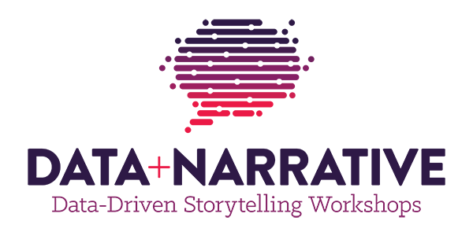
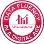
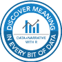
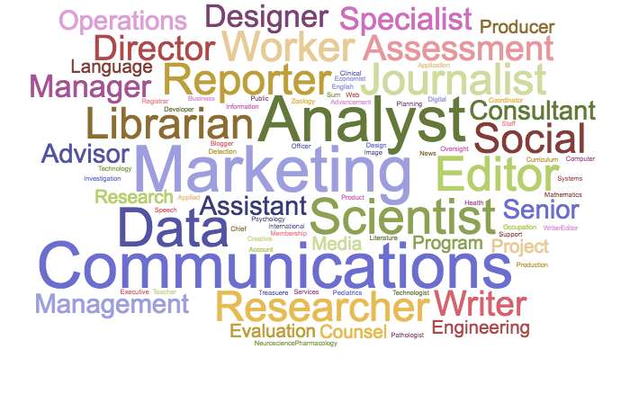

Data+Narrative: Data-Driven Storytelling Workshops at Boston University

 [BU College of Communication](http://www.bu.edu/com/)

Welcome to the Data+Narrative Storytelling Workshops at Boston University. Our ground-breaking training positions you to engage your audience through powerful data-driven stories. As we embark on our fifth successful year training students and professionals from all disciplines, we are pleased to continue our Digital Badge certification program in Data+Narrative skills. Please explore our site to learn more about our curriculum, instructors and how to earn a digital badge for three different levels of Data+Narrative skill building!

* * *

#### Workshop Dates: June 4-8, 2018

[Register Now](https://www.bu.edu/com/data-narrative/registration.html)

* * *

## Earn Your Digital Badge in Data+Narrative at Boston University

In today's competitive job market, you need the ability to accurately interpret and showcase vast amounts of data to efficiently unearth key insights and inform decision-makers. Give yourself a needed edge by earning your digital badge in our Data+Narrative Storytelling Workshops at Boston University this summer by attending the first university-based, hands-on data-driven storytelling training customized for three levels of learners.

## Why Data+Narrative?

[icon-magnifying-glass.svg](../_resources/6e9aefbc3edaa75e84b30949366d94ba.bin)

Data fluency is a must-have skill set in today’s digital workplace. Success starts with knowing how to find the meaning in every dataset – regardless of its size or format.

[icon-line-graph.svg](../_resources/b15795962aa49d046a3180d48cdc4efc.bin)

Our intensive week-long workshops equip you with a practical, ready-to-go toolbox of knowledge, techniques and strategies to become a master data storyteller – no matter your experience or skill level.

Deft storytelling skills are needed to understand and interpret today’s endless amount of digitized professional and personal data. Those skills are far more sophisticated than looking at a prepared dataset and creating an infographic; savvy data storytellers must go much deeper and wider to unearth the powerful story trapped inside data.

[icon-bar-chart.svg](../_resources/e35e823bf567fed8282c50a7a86bfadd.bin)

Optimize the power of your data to more effectively persuade your audience, inform and educate employees, clients, customers and shareholders, disrupt the competition, harness new funding sources or win a pivotal argument.

## Who Attends Our Workshops?

Job titles of our previous workshop graduates

### Workshops

[Learn More](http://www.bu.edu/com/data-narrative/workshops.html)

### Email List

[Sign Up](http://www.bu.edu/com/data-narrative/signup.html)

### Questions?

Have a question or need more information? Connect with Workshop Director and Founder Maggie Mulvihill at Boston University:

Phone: 617-358-2360
Email:[mmulvih@bu.edu](http://www.bu.edu/com/data-narrative/mmulvih@bu.edu)

[< 1 min to Spreed]()