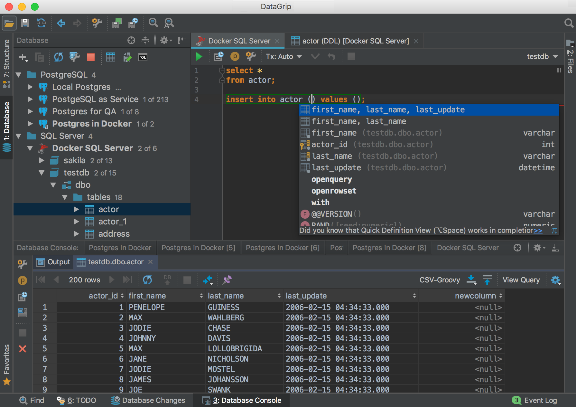
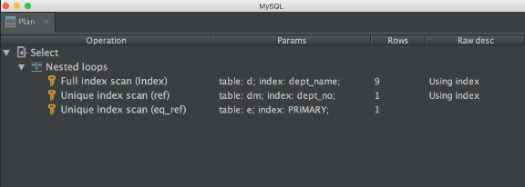
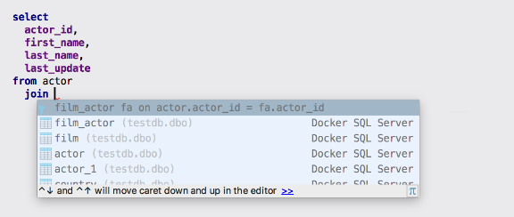
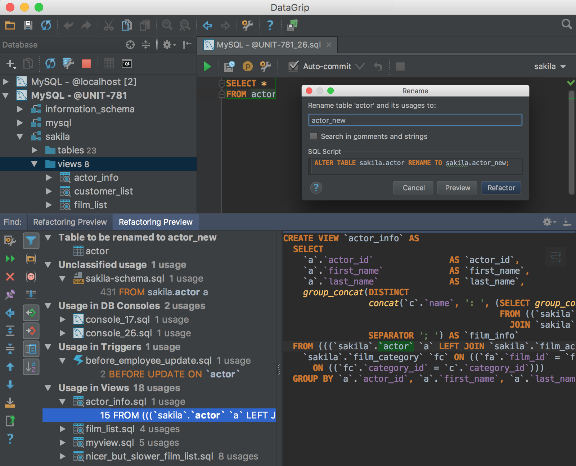
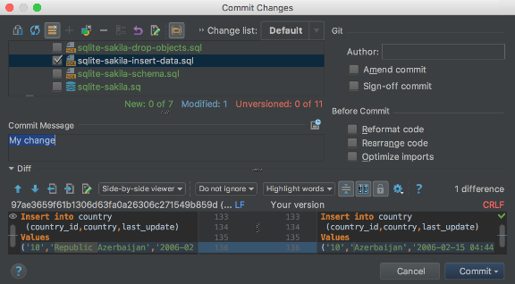

DataGrip: Cross-Platform IDE for Databases & SQL by JetBrains

# Cross-Platform IDE for Databases & SQL by JetBrains

       NDA

Many databases, one tool

 [Download](https://www.jetbrains.com/datagrip/download/download-thanks.html)

Free 30-day trial

Why
DataGrip

## Enjoy working

with databases

Meet DataGrip, our new database IDE that is tailored to suit specific needs of professional SQL developers.

 [Take a tour](https://youtu.be/Xb9K8IAdZNg)

#### Intelligent query console

Allows you to execute queries in different modes and provides local history that keeps track of all your activity and protects you from losing your work.

#### Efficient schema navigation

Lets you jump to any table, view, or procedure by its name via corresponding action, or directly from its usages in the SQL code.

#### Explain plan

Gives you an extended insight into how your queries work and into database engine behavior so you can make your queries more efficient.

#### Smart code completion

DataGrip provides context-sensitive code completion, helping you to write SQL code faster. Completion is aware of the tables structure, foreign keys, and even database objects created in code you're editing.

#### On-the-fly analysis and quick-fixes

DataGrip detects probable bugs in your code and suggests the best options to fix them on the fly. It will immediately let you know about unresolved objects, using keywords as identifiers and always offers the way to fix problems.

#### Refactorings that work in SQL files and schemas

DataGrip correctly resolves all references in your SQL code and helps you refactor them. When you rename a variable or an alias, it will update their usages throughout the entire file. The actual table names in the database are updated when you rename references to them from your queries. There is even a preview of usages of tables/views inside other views, stored procedures and functions.

#### Version control integration

We provide unified support for all major version control systems: Git, SVN, Mercurial and many others.

 [Discover all features](https://www.jetbrains.com/datagrip/features)

## Database management systems

 [Download](https://www.jetbrains.com/datagrip/download/download-thanks.html)

Free 30-day trial

## Follow JetBrains

Copyright © 2000–2018 JetBrains s.r.o. Developed with drive and [IntelliJ IDEA](https://www.jetbrains.com/idea?fromFooter)