Datasette, PyBay 2018 - by Simon Willison

# Datasette - PyBay 2018

 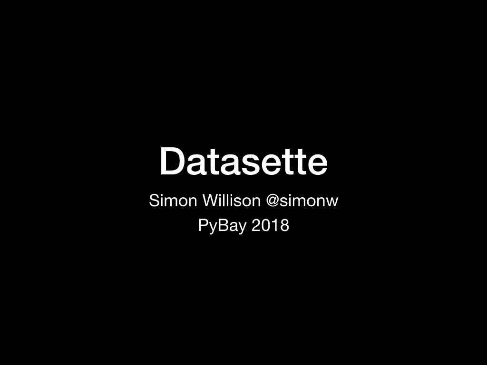

Slides and notes from my presentation on [Datasette](https://datasette.io/) given at [PyBay 2018](https://pybay.com/) on 19th August 2018.

 

I designed Datasette based on my experence working as a data journalist at [the Guardian newspaper](https://www.theguardian.com/) in London.

 

One of the projects I was involved with at the Guardian was [the Guardian Data Blog](https://www.theguardian.com/news/datablog/2011/jan/27/data-store-office-for-national-statistics).

Simon Rogers was the journalist most responsible for gathering the data used for infographics in the newspaper. We decided to start publishing the raw data on a blog.

 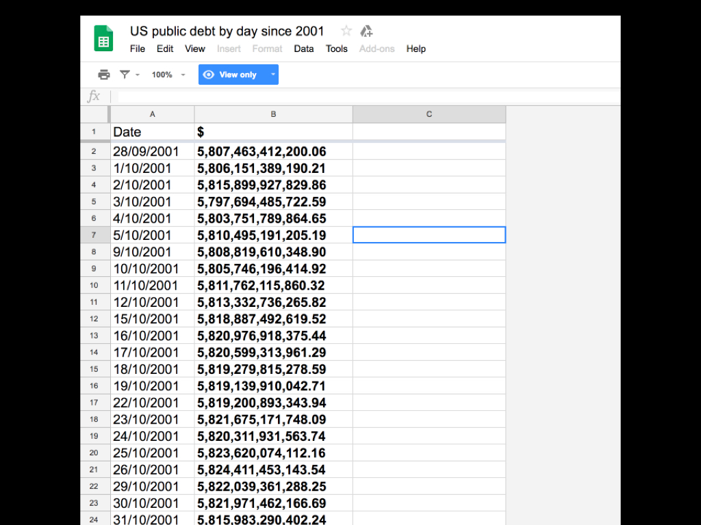

After some consideration of our options, we ended up chosing Google Spreadsheets as a publishing tool.

 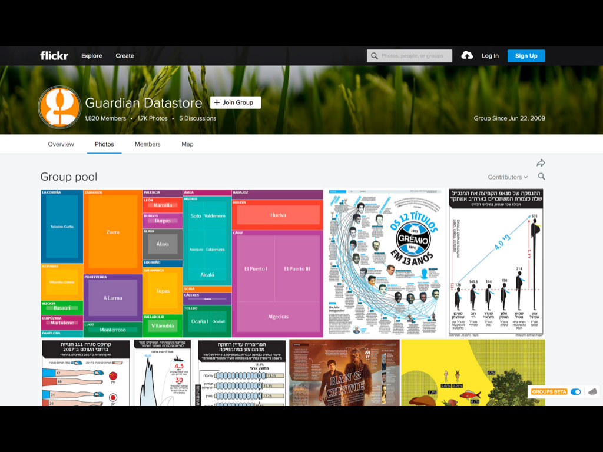

This worked really well: it was easy to publish data, and a community of readers grew up around the data that was being published who built their own analyses and visualizations on top of the data that was shared.

We even had [a Flickr group](https://www.flickr.com/groups/guardiandatastore/pool/) where people shared their work.

 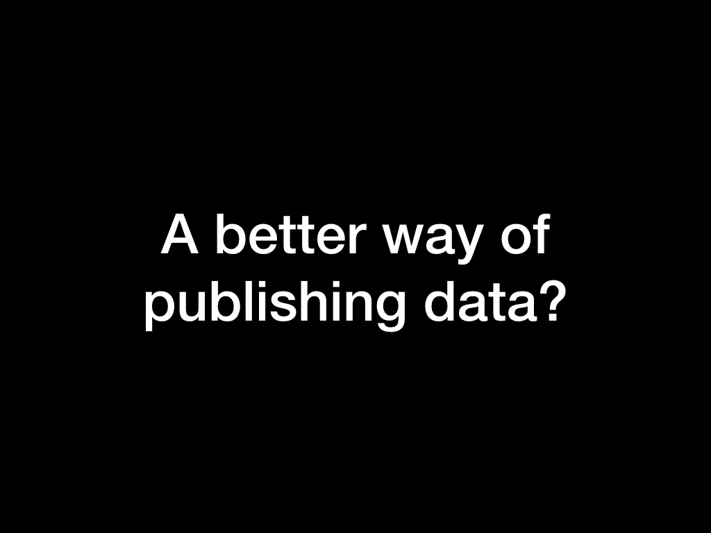

But was Google Sheets really the best way to publish this kind of data? I wanted something better. Last year [I realized](https://simonwillison.net/2017/Nov/13/datasette/) that the pieces were now available to solve this problem in a much more elegant way.

 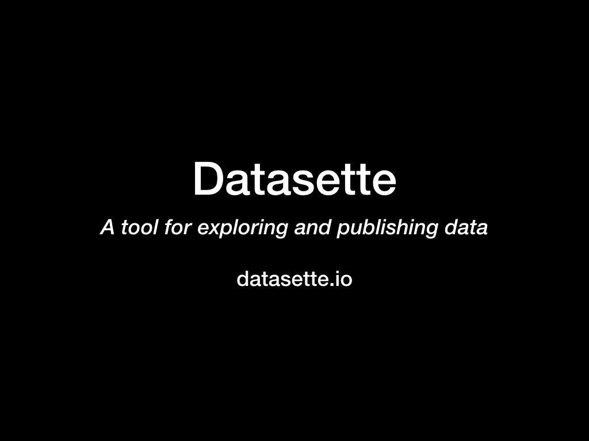

GitHub: [simonw/datasette](https://github.com/simonw/datasette)

Documentation: [datasette.readthedocs.io](https://datasette.readthedocs.io/)

Updates on my blog: [simonwillison.net/tags/datasette/](https://simonwillison.net/tags/datasette/)

 

Let's start with an example. FiveThirtyEight publish a large number of high quality data journalism articles.

Recent example: [We Researched Hundreds Of Races. Here’s Who Democrats Are Nominating.](https://fivethirtyeight.com/features/democrats-primaries-candidates-demographics/)

 

And they have a link... Get the data [on GitHub](https://github.com/fivethirtyeight/data/tree/master/primary-candidates-2018)

 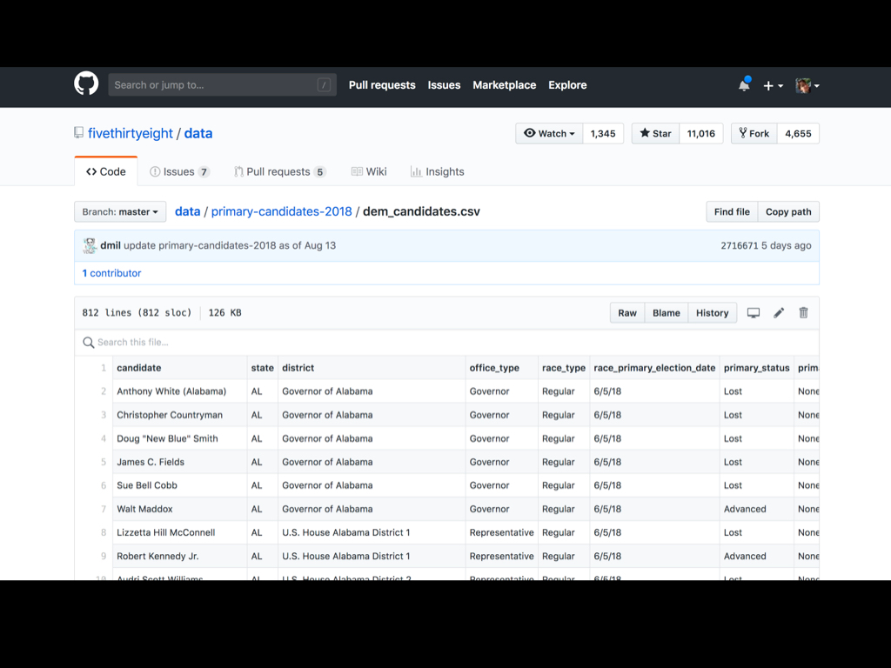

The [fivethirtyeight/data](https://github.com/fivethirtyeight/data) repository on GitHub is an incredible collection of over 400 CSV files containing the data behind their stories.

 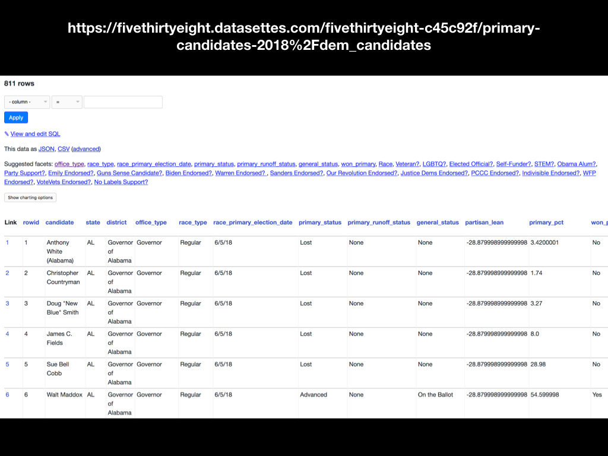

I have a [daily Travis CI job](https://github.com/simonw/fivethirtyeight-datasette) which grabs their repository, converts the CSV files to SQLite and deploys them to a Datasette instance running at [fivethirtyeight.datasettes.com](http://fivethirtyeight.datasettes.com/).

Here's [the data from that story](https://fivethirtyeight.datasettes.com/fivethirtyeight-c45c92f/primary-candidates-2018%2Fdem_candidates).

 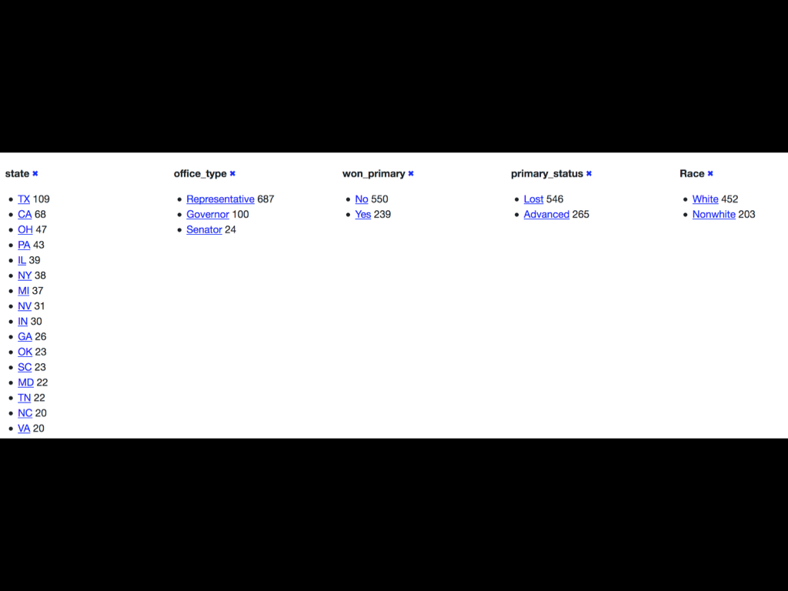

One of the most interesting features of Datasette is its ability to [add faceted browse](https://simonwillison.net/2018/May/20/datasette-facets/) to any table.

Here I'm faceting the candidates [by state, office_type, won_primary, primary_status and Race](https://fivethirtyeight.datasettes.com/fivethirtyeight-c45c92f/primary-candidates-2018%2Fdem_candidates)

 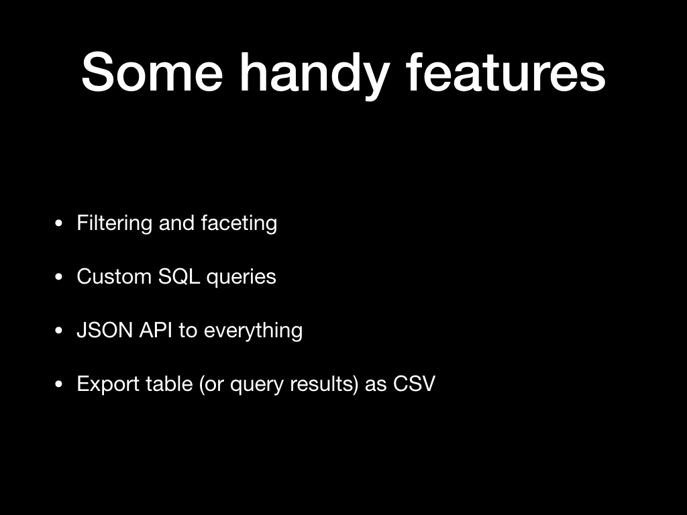

I also demonstrated the ability to apply fiters, export the data as JSON or CSV and execute custom SQL queries (the results of which can also be exported).

 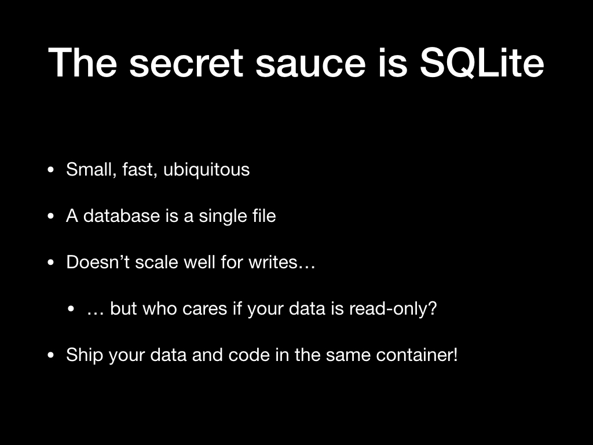

[SQLite](https://www.sqlite.org/) is an incredibly embedded database library.

It runs basically everywhere. It's in my watch, on my phone, on my loptop, embedded in a huge variety of applications.

It has a bunch of interesting characteristics which Datasette takes full advantage of.

 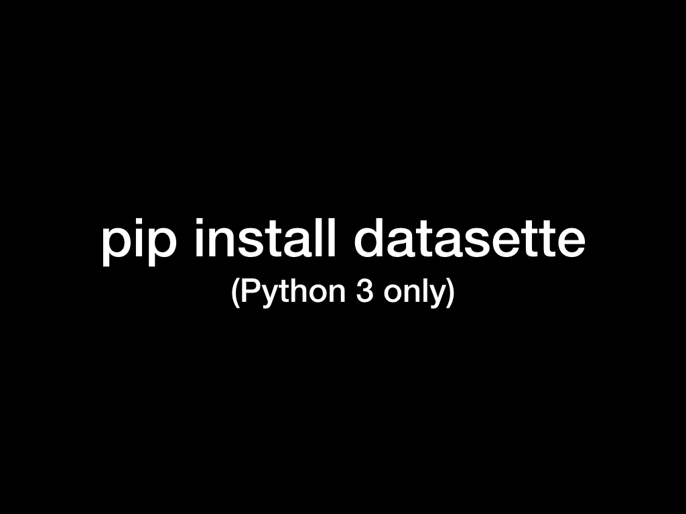

You can install the Datasette command-line utility [from PyPI](https://pypi.org/project/datasette/).

 

I said SQLite was ubiquitous: let's prove it.

Run `find ~/Library -iname '*.sqlite*'` to see some of the SQLite databases that applications have created on your OS X laptop.

I get several hundred! Firefox, Chrome and Safari all use SQLite for bookmarks and history, and applications that use it include Evernote, 1Password and many others.

 

`find ~/Library -iname '*.sqlite*' -type f -exec du -h {} + | sort -r -h`

This command sorts those database files by the largest first. On my machine, the largest SQLite database is:

`49M /Users/simonw/Library/Containers/com.apple.photoanalysisd/Data/Library/Caches/CLSBusinessCategoryCache.sqlite`

 

I ran `datasette` against this file and showed how it allowed me to explore it via `https://127.0.0.1:8001/`

`datasette /Users/simonw/Library/Containers/com.apple.photoanalysisd/Data/Library/Caches/CLSBusinessCategoryCache.sqlite`

Since I had the [datasette-cluster-map plugin](https://github.com/simonw/datasette-cluster-map) installed I could run the custom SQL query `select *, zlatitude as latitude, zlongitude as longitude from ZENTRY` to see everywhere I have been in the past few years rendered on a map.

 

So that's how to explore an existing SQLite database... but how can we go about creating them?

[csvs-to-sqlite](https://github.com/simonw/csvs-to-sqlite) is a simple command-line tool I wrote which converts CSV files into a SQLite database (using [Pandas](https://pandas.pydata.org/) under the hood).

But where can we get interesting CSV data?

It turns out that the worldwide campaign for more open data and transparency in government has worked beyond our wildest dreams.

[This website](https://opendatainception.io/) lists over 2,600 open data portals run by local governments around the world!

San Francisco's open data portal is at [datasf.org](https://datasf.org/). It has 469 datasets!

Here's a recent example (updated in May): it's a list of [all of the buildings and facilities](https://data.sfgov.org/City-Infrastructure/City-Facilities/nc68-ngbr) owned by the city.

I exported the data as CSV and used `csvs-to-sqlite` to convert it into a SQLite database:

`csvs-to-sqlite City_Facilities.csv facilities.db`

Then I used Datasette to browse the file locally:

`datasette facilities.db`

How can we publish it to the internet?

The `datasette publish` subcommand ([documented here](https://datasette.readthedocs.io/en/stable/publish.html#datasette-publish)) knows how to upload a database to a hosting platform and configure Datasette to run against that file.

It currently works with both [Zeit Now](https://zeit.co/now) and [Heroku](https://www.heroku.com/), and further publishers can be supported via [a plugin hook](https://datasette.readthedocs.io/en/latest/plugins.html#publish-subcommand-publish).

`datasette publish now facilities.db`

This outputs the URL to the new deployment. A few minutes later the instance is available for anyone to browse or build against.

What if you don't want to install any software?

[Datasette Publish](https://publish.datasettes.com/) is a web application which lets you authenticate against your (free) Zeit Now hosting account, then upload CSVs and convert and deploy them using Datasette.

Crucially, the deployment happens to our own hosting account: I'm not responsible for hosting your data.

More about [Datasette Publish on my blog](https://simonwillison.net/2018/Jan/17/datasette-publish/).

I used Datasette Publish to upload the `City_Facilities.csv` file and deploy it along with the datasette-cluster-map plugin.

Here's the demo I deployed: [san-francisco-facilities.now.sh](https://san-francisco-facilities.now.sh/data-f39e9ec/City_Facilities).

What if your data isn't a CSV?

Recently, I've been working on a new package called [sqlite-utils](https://github.com/simonw/sqlite-utils) ([documentation here](https://sqlite-utils.readthedocs.io/)) which aims to make creating new SQLite databases as productive as possible.

It's designed to work well in [Jupyter notebooks](https://jupyter.org/).

I demonstrated a notebook which pulls the list of the top downloaded PyPI packages from [this site](https://hugovk.github.io/top-pypi-packages/), then pulls package details from PyPI's JSON API and creates a SQLite database combining data from the two sources.

Here's [the notebook](https://gist.github.com/simonw/0efaeec1022ec05dd9ca70c5bc928a6a) I used.

Datasette [supports plugins](https://datasette.readthedocs.io/en/latest/plugins.html).

I've already demonstrated this plugin a couple of times.

It looks for any columns named `latitude` and `longitude` and, if it finds any, it renders those points on a map.

[simonw/datasette-cluster-map](https://github.com/simonw/datasette-cluster-map)

If you install the plugin globally (or into a virtual environment) it will load any time you run Datasette.

You can pass the name of a plugin to the `datasette publish --install` option to cause it to be installed with that deployment.

The [Datasette Publish](https://publish.datasettes.com/) web app allows you to deploy specific plugins by clicking their checkbox.

[Datasette Vega](https://github.com/simonw/datasette-vega) is a plugin that uses the excellent [Vega](https://vega.github.io/) visualization library to enable charts against any Datasette table or query.

I have a whole load of plans for improvements to Datasette and the Datasette ecosystem.

The next feature I'm working on is better support for many-to-many relationships. You can [track that here](https://github.com/simonw/datasette/issues/354).

[SpatiaLite](https://www.gaia-gis.it/fossil/libspatialite/index) is a powerful extension for SQLite that adds comprehensive support for GIS features such as polygon operations and spatial indexing.

I wrote more about it in [Building a location to time zone API with SpatiaLite, OpenStreetMap and Datasette](https://simonwillison.net/2017/Dec/12/location-time-zone-api/). I'm excited about using it to further extend Datasette's geospatial abilities.

SQLite 3.25 is due out in September and will be adding support for [window functions](https://www.sqlite.org/draft/windowfunctions.html), a powerful set of tools for running complex analytical queries, especially against time series data.

I'm excited about exploring these further in Datasette. For the moment I have [a demo running at pysqlite3-datasette.now.sh](https://pysqlite3-datasette.now.sh/fixtures-fda0fea?sql=select+content%2C+sortable%2C+row_number%28%29+over+%28order+by+sortable%29+as+row_number+from+sortable+order+by+content%3B).

I don't have a timeline for Datasette 1.0 yet, but it will represent the point at which I consider the Plugin mechanism to be stable enough that people can write plugins without fear of them breaking with future (non-2.0) updates.

So please, take a look at the plugin mechanism and let me know if it supports your needs!

The more people using Datasette and giving me feedback on how it can improve the better.

[simonwillison.net](https://simonwillison.net/)

[@simonw](https://twitter.com/simonw)