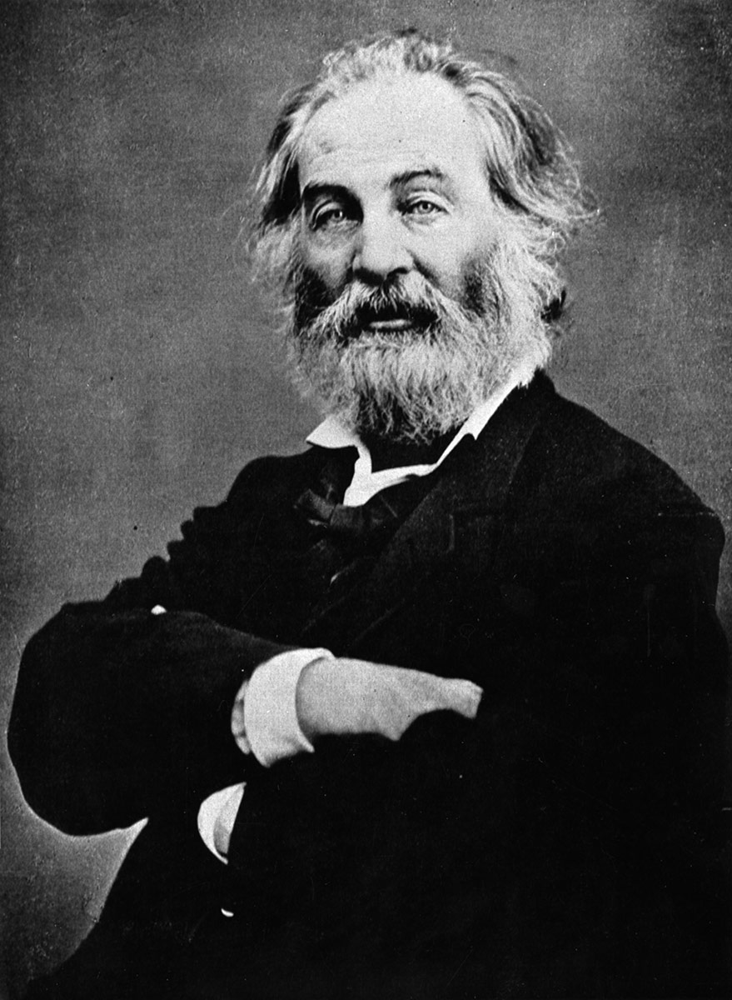
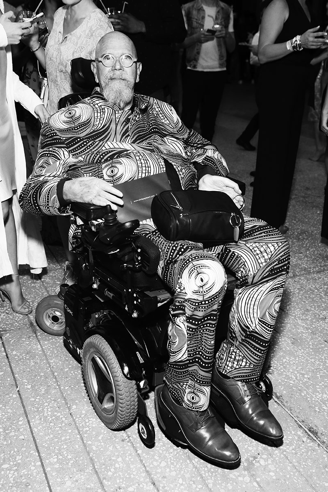
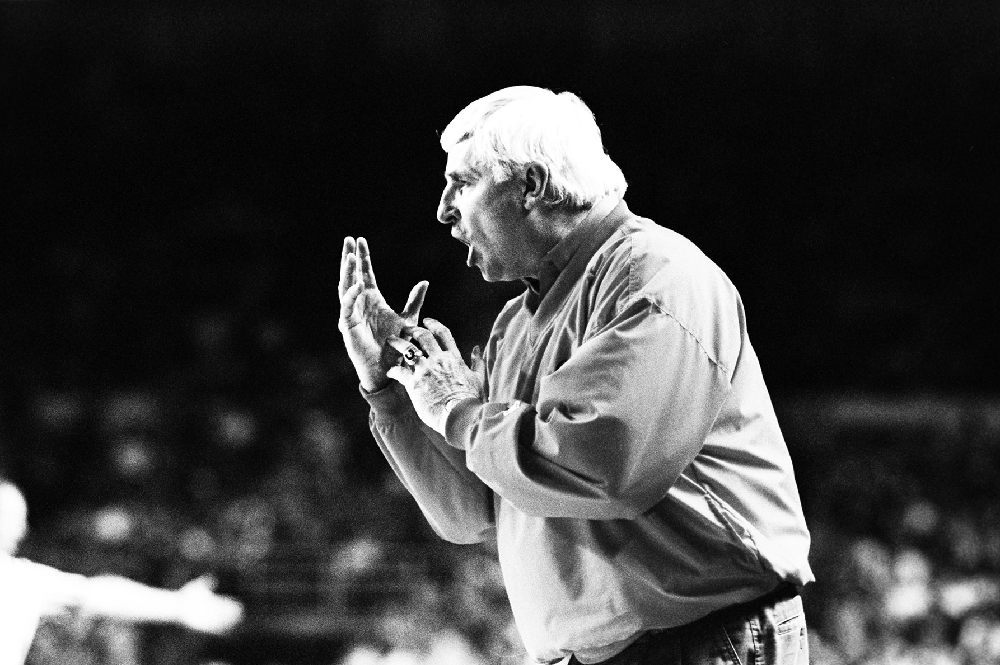
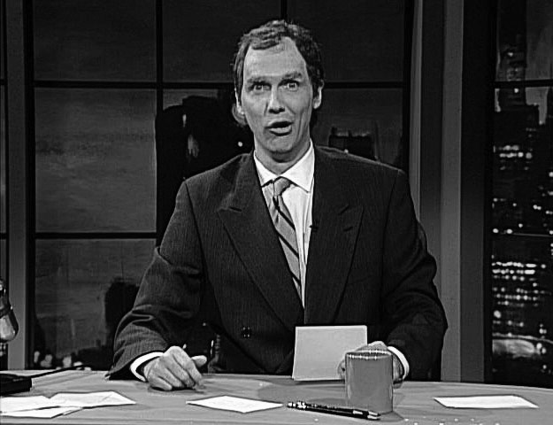
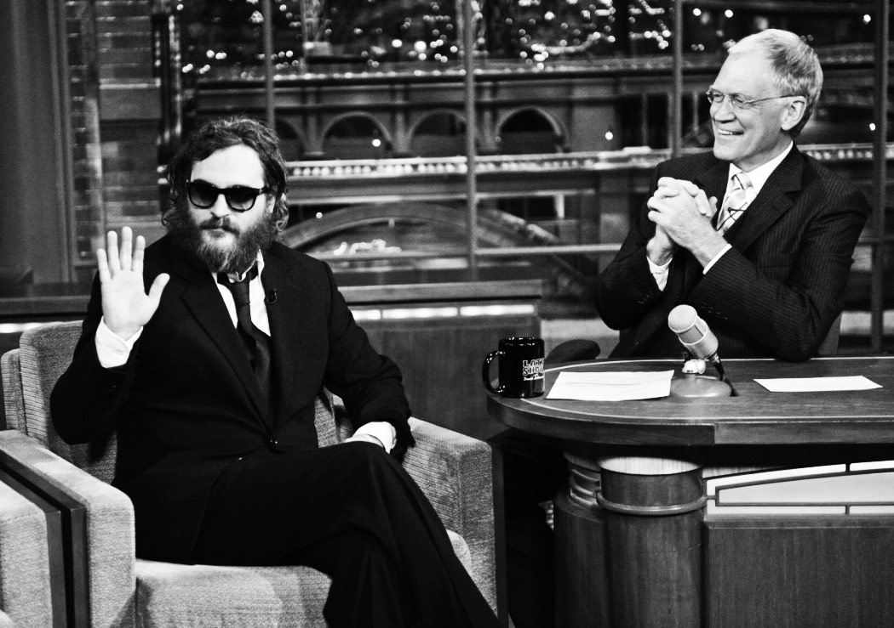
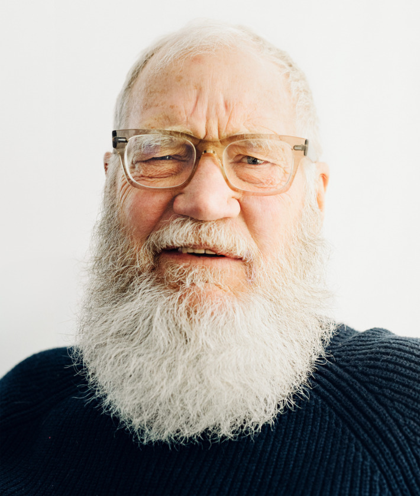
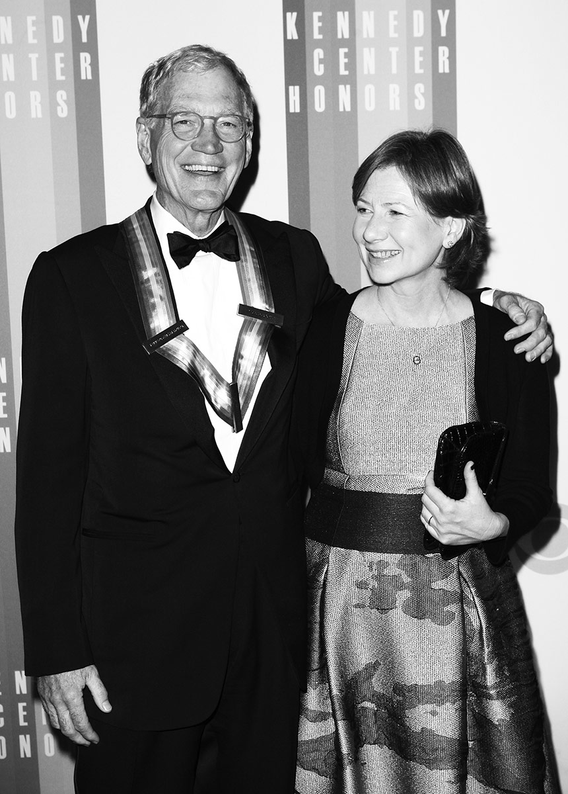
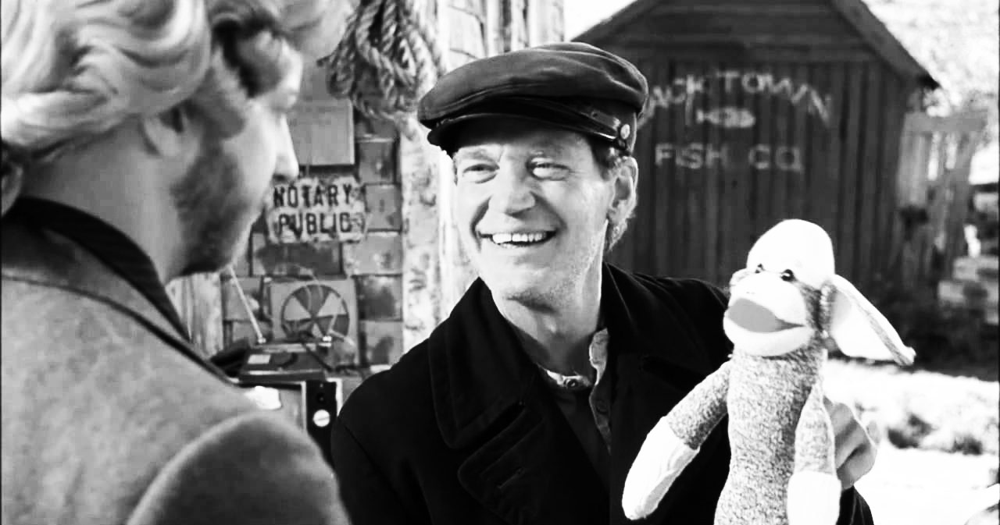

David Letterman on Life After TV, Late Night Today, and the Man He Calls Trumpy

[](https://googleads.g.doubleclick.net/aclk?sa=l&ai=CxrgOFVfLWOCbGs2hbNCkpdAM19Hs_keWq7HVsQSX7aK9wAEQASDXzsUcYLuGgIDQCqAB3d_rywPIAQKpArqT_vwswKk-4AIAqAMByAOZBKoExQFP0HxyoqCLzdAPyXWKmWvhM8EUifG3yyrZmSQ3Js0ZJQXyj80t-XCZUKdKnK5uTi8tL0HlVOh7BrP17kXgfqd3b97vbUaCSXOyaWIp1deP5Ysgt9WTQTzitQP-EDpc31qs2z8o1s3-Xb24_eiAetiX-2UaRutBp5YjhA849QVoxdxCy6UcEhSMqJ06Ou95sY6sFFVxoykZX0SU1lWWefHSMMsRCY6Z6NSm_F3mcJdSY_suWxK5MAvFN1NXQjNxwhBfQVIsMuAEAaAGAoAHi6CUNKgHpr4b2AcB0ggFCIxjEAHYEws&num=1&sig=AOD64_3VFvOj3i-MsY0Xoc7DBLQFnbPoMQ&client=ca-pub-1685738362467765&adurl=http://servedby.flashtalking.com/click/7/71123%3B2234276%3B50126%3B211%3B0/%3Fft_width%3D1%26ft_height%3D1%26ft_custom%3Dcampaign%3D689172666%3Bad_group%3D33659817777%3Btarget_id%3D%3Bcreative%3D163575108639%3Bkeyword%3D%3Bplacement%3D99efb4fad925c6a6.anonymous.google%26ft_keyword%3D%26url%3Dhttps://bellroy.com/slim-your-wallet%3Fgclidfix)

Ad closed by 

[Report this ad]()[Why this ad? ](https://www.google.com/ads/preferences/whythisad/en-US/F6rgORqAxhmfFRqM/#/AB3afGEAAAL3eyJpbWFnZV93aHlfdGhpc19hZCI6eyJsYW5kaW5nX3VybCI6Imh0dHA6Ly9zZXJ2ZWRieS5mbGFzaHRhbGtpbmcuY29tL2NsaWNrLzcvNzExMjM7MjIzNDI3Njs1MDEyNjsyMTE7MC8_ZnRfd2lkdGg9MVx1MDAyNmZ0X2hlaWdodD0xXHUwMDI2ZnRfY3VzdG9tPWNhbXBhaWduPTY4OTE3MjY2NjthZF9ncm91cD0zMzY1OTgxNzc3Nzt0YXJnZXRfaWQ9O2NyZWF0aXZlPTE2MzU3NTEwODYzOTtrZXl3b3JkPTtwbGFjZW1lbnQ9OTllZmI0ZmFkOTI1YzZhNi5hbm9ueW1vdXMuZ29vZ2xlXHUwMDI2ZnRfa2V5d29yZD1cdTAwMjZ1cmw9aHR0cHM6Ly9iZWxscm95LmNvbS9zbGltLXlvdXItd2FsbGV0P2djbGlkZml4IiwiaW1hZ2VfdXJsIjoiaHR0cHM6Ly90cGMuZ29vZ2xlc3luZGljYXRpb24uY29tL3NpbWdhZC82MDg4NzgzNjA1NjEzNTM4Nzk2IiwiaW1hZ2Vfd2lkdGgiOjcyOCwiaW1hZ2VfaGVpZ2h0Ijo5MH0sInRhcmdldGluZ19yZWFzb25zIjp7Im9wdF9vdXQiOnRydWUsImFkX3JlYXNvbiI6WzEwXSwidmVydGljYWxfaWQiOlsiOTI4MDQiXSwiZXhwbGFuYXRpb24iOnsiaW50cm9kdWN0aW9uIjoiWW91IGhhdmUgb3B0ZWQgb3V0IG9mIGludGVyZXN0IGJhc2VkIGFkdmVydGlzaW5nLiAgVGhpcyBhZCB3YXMgc2hvd24gdG8geW91IGJlY2F1c2Ugb2YgdGhlIHRpbWUgb2YgZGF5LCB0aGUgd2Vic2l0ZSB5b3Ugd2VyZSB2aWV3aW5nIG9yIHlvdXIgZ2VuZXJhbCBsb2NhdGlvbiAoZm9yIGV4YW1wbGUgY291bnRyeSBvciBjaXR5KS4ifX19G1eyPPBo76Z1BeeNY8wesTPoNwOCiQ9acHuR9sBzZt3Jj2iyemvpCTkKn4FiDlg-tdU4sQZL0wIVkghtyNeTR9_dMtN8_Iix1srNrL1ksHYib1ES0eQKlDnpDce7kyOe8wOPTPwPdA7EpYh-cwhkNcG2_zMpuspCVLgY1s4J7By6-1DEe-GxReUxV5JwtSEYv4jTquPjlFWzQzM2JQ-IeZHEQ8P1SaTsICWIsslI3xApV3m8nWnICWbXnAvH1iOdvX5JU72oAMhUj74niKfZCNQgB7td0hoAbg2xSZxFDoKYHZ1a3l2ueul8lwAdK9A1qKTGkbQdnAmZ2m3jXq86Sg,HmM0xi6gbkMvjASwdMxY8Q&s9QmcdAet8YIlqux1bEEELrhz8gCGOPCjDUiHGJlbGxyb3kuY29tL3NsaW0teW91ci13YWxsZXQyCAgFExi2zgUUQhdjYS1wdWItMTY4NTczODM2MjQ2Nzc2NUgGWAJwAQ&https://googleads.g.doubleclick.net/pagead/conversion/?ai=CxrgOFVfLWOCbGs2hbNCkpdAM19Hs_keWq7HVsQSX7aK9wAEQASDXzsUcYLuGgIDQCqAB3d_rywPIAQKpArqT_vwswKk-4AIAqAMByAOZBKoExQFP0HxyoqCLzdAPyXWKmWvhM8EUifG3yyrZmSQ3Js0ZJQXyj80t-XCZUKdKnK5uTi8tL0HlVOh7BrP17kXgfqd3b97vbUaCSXOyaWIp1deP5Ysgt9WTQTzitQP-EDpc31qs2z8o1s3-Xb24_eiAetiX-2UaRutBp5YjhA849QVoxdxCy6UcEhSMqJ06Ou95sY6sFFVxoykZX0SU1lWWefHSMMsRCY6Z6NSm_F3mcJdSY_suWxK5MAvFN1NXQjNxwhBfQVIsMuAEAaAGAoAHi6CUNKgHpr4b2AcB0ggFCIxjEAHYEws&sigh=aVeWuanL8w0)

[Not interested in this ad]()[Seen this ad multiple times]()[Ad was inappropriate]()[Ad covered content]()

We'll try not to show that ad again

Ad closed by 

##

 [»]()

 [Vulture](http://www.vulture.com/)

 Search

# In Conversation:  David Letterman

“How’s this interview going? Do you think you’re talking to a normal person here?”

 By   [David Marchese](http://nymag.com/author/David%20Marchese/)

 Photograph by[Christopher Anderson](http://nymag.com/author/Christopher%20Anderson/)

   03/05/2017  9:00 p.m.

 [Share](http://www.facebook.com/sharer/sharer.php?u=http://www.vulture.com/2017/03/david-letterman-in-conversation.html%3Fmid%3Dfb-share-vulture)  [Tweet](https://twitter.com/share?text=David%20Letterman%20on%20Life%20After%20TV%20and%20the%20Man%20He%20Calls%20Trumpy&url=http://www.vulture.com/2017/03/david-letterman-in-conversation.html%3Fmid%3Dtwitter-share-vulture&via=vulture)  [Share](https://plus.google.com/share?url=http%3A%2F%2Fwww.vulture.com%2F2017%2F03%2Fdavid-letterman-in-conversation.html)  [Pin It](http://pinterest.com/pin/create/button/?url=http%3A%2F%2Fwww.vulture.com%2F2017%2F03%2Fdavid-letterman-in-conversation.html&description=David%20Letterman%20on%20Life%20After%20TV%2C%20Late%20Night%20Today%2C%20and%20the%20Man%20He%20Calls%20Trumpy&media=http:)  [Email](http://www.vulture.com/2017/03/david-letterman-in-conversation.html?utm_source=newsletter&utm_medium=email&utm_campaign=newsletter_axiosammailto:?subject=David%20Letterman%20on%20Life%20After%20TV%2C%20Late%20Night%20Today%2C%20and%20the%20Man%20He%20Calls%20Trumpy&body=I%20saw%20this%20on%20Vulture%20and%20thought%20you%20might%20be%20interested...%0A%0ADavid%20Letterman%20on%20Life%20After%20TV%2C%20Late%20Night%20Today%2C%20and%20the%20Man%20He%20Calls%20Trumpy%0A%E2%80%9CHow%E2%80%99s%20this%20interview%20going%3F%20Do%20you%20think%20you%E2%80%99re%20talking%20to%20a%20normal%20person%20here%3F%E2%80%9D%0Ahttp%3A%2F%2Fwww.vulture.com%2F2017%2F03%2Fdavid-letterman-in-conversation.html%3Fmid%3Demailshare%5Fvulture)

Since retiring after 33 years on the late night television, David Letterman has kept a low public profile — aided by the growth of a[truly impressive beard](http://www.vulture.com/2016/10/david-lettermans-son-also-thinks-his-beard-is-creepy.html). But that doesn’t mean he hasn’t been as[fixated on politics](http://www.vulture.com/2016/10/how-letterman-would-have-done-a-trump-interview.html) as the rest of us. “If I still had a show,” says the 69-year-old, dressed in a baggy sweater and cargo pants and sitting high above midtown Manhattan in a conference room at his publicist’s offices, “people would have to come and take me off the stage. ‘Dave, that’s enough about Trump. We’ve run out of tape.’ It’s all I’d be talking about. I’d be exhausted.” Late-night TV comedy has offered some of the sharpest — and[most-remarked-upon](http://www.vulture.com/2017/02/kellyanne-conway-goes-full-fatal-attraction-on-snl.html) — responses to the Trump presidency. But despite the work of Stephen Colbert, Seth Meyers, *Saturday Night Live*, and the rest, it’s hard not to wish Letterman, late-night’s greatest ironist and most ornery host, was still around to take aim. And so we’ve brought him out of retirement to weigh in on life after television and his old frequent guest and punching bag, the man he calls Trumpy.

***David Marchese:***** I’ve always loved *Leaves of Grass,***** so it’s a pleasure to meet the man who wrote it.

*****David Letterman:*** I’ve given up on making that kind of joke because I ran out of [people with beards](http://www.vulture.com/2015/12/behold-david-lettermans-retirement-beard.html) other than

Most famous bearded poet.— tap to close —

Walt Whitman1 that anyone knew — the joke didn’t work as well when I used Frederick Douglass. But great things have happened to me since I’ve been walking around with this beard. I was in Santa Monica, at the Ocean Park Café, and this woman comes over and she says, “Are you who I think you are?” And I said, “That depends on who you think I am.” She said,

American painter who began as a photorealist, then adopted a dappled, pixelated style after becoming paralyzed in 1988. No resemblance to Letterman.— tap to close —

“You’re Chuck Close.”2 I said, “Yeah, yeah, I am.” She said, “Oh my God” — she has a whole story. She was an art major, and for her final project she did a pencil-drawing portrait of Chuck Close. She said, “It was the best thing I did in all of college.” I finally said, “I’m not Chuck Close.” Boom, she’s out like a shot. Gone. Then she comes back and says, “That really disappoints me.”

**The other thing is that somebody who loves Chuck Close that much might know that, unlike you, he’s in a wheelchair.

**Good point. I wish you had been with us. Another time with this beard, I was in New York City standing on Sixth Avenue, and a woman on the sidewalk looked at me and she said, “Do you have a television show?” “No, I don’t.” “Did you used to have a television show?” “Yes, I did.” “What happened?” “I got fired.” “Are you David Letterman?” “Yes, I am.” And then she said, “Man, they fucked you up.”

**Did CBS fuck you up?

**What do you know? What have you heard? If anybody fucked me up, it was me, by getting old and stupid.

*Story continued below*

**Have you ever wondered what you might’ve said if you’d been doing *The Late Show* the night after Trump was elected?

**No, I haven’t thought about it. See, I was out running one day when he was still president-elect, and I thought, *Let’s call him.* I’ve known the guy since the ’80s. I was one of a few people who had routinely interviewed him. I’m not blinded by the white-hot light of “president-elect.” I mean, we elected a guy with that hair? Why don’t we investigate that? He looks like Al Jardine of the Beach Boys. I don’t know. I’m sorry for rambling. I’m afraid something has happened to me hormonally. I can’t stop talking.

 “I mean, we elected a guy with that hair? Why don’t we investigate that?”
**And that’s why you’re okay with being off the air?

**I’m afraid if I still had a show, it would be a lot of, “We’re spending quite a lot of money on editing, Dave. If you could just keep it to an hour, we’d all appreciate that, because we have big stars who’ve flown in from Hollywood to be here.”

**As someone who [interviewed Trump](http://www.vulture.com/2016/10/how-letterman-would-have-done-a-trump-interview.html) dozens of times, how did your estimation of him change over the years? The first time he came on *Late Night,* which I think was in ’87, there’s deference on your part to the idea that he might know something about the economy.

**He was a mogul, for God’s sake.

**[By 2012](https://www.youtube.com/watch?v=SYoOPgeTMQc), you’re making fun of his hair apparatus and explaining to him that his ties were being made in China.

**I always regarded him as, if you’re going to have New York City, you gotta have a Donald Trump. He was a joke of a wealthy guy. We didn’t take him seriously. He’d sit down, and I would just start making fun of him. He never had any retort. He was big and doughy, and you could beat him up. He seemed to have a good time, and the audience loved it, and that was Donald Trump. Beyond that, I remember a friend in the PR business told me that he knew for a fact — this was three or four presidential campaigns ago — that Donald Trump would never run for president; he was just monkeying around for the publicity. So I assumed that was the story and now it turns out he’s the president. Now, who owns *New York*?

**It’s a family. The Wassersteins.

**Say the head of the family, let’s say his name was Larry Wasserstein. If Larry behaved the way Donald behaves, for even a six-week period, the family would get together and say, “Jesus, somebody better call the doctor.” Then they’d ask him to step down. But Trump’s the president and he can lie about anything from the time he wakes up to what he has for lunch and he’s still the president. I don’t get that. I’m tired of people being bewildered about everything he says: “I can’t believe he said that.” We gotta stop that and instead figure out ways to protect ourselves from him. We know he’s crazy. We gotta take care of ourselves here now.

*Story continued below*
**How? Is comedy useful for that?

**Comedy’s one of the ways that we can protect ourselves. [Alec Baldwin](http://www.vulture.com/2017/03/alec-baldwin-distills-donald-trump-as-pamphlet-thesaurus.html) deserves a Presidential Medal of Freedom. Sadly, he’s not going to get it from this president.

**Can you explain that a bit more? How does satire protect us from Donald Trump?

**The man has such thin skin that if you keep pressure on him — I remember there was a

Actually, it was the other way around. In a 2007 playoff game, a swarm of midges from Lake Erie caused Yankees reliever Joba Chamberlain to blow the game with a few wild pitches.— tap to close —

baseball game in Cleveland,3 and a swarm of flies came on the field and the batters were doing this [*mimes swatting at flies*] while the pitcher was throwing 100 miles an hour. Well, that’s Alec Baldwin and *Saturday Night Live. *It’s distracting the batter. Eventually Trump’s going to take a fastball off the sternum and have to leave the game.

*Story continued below*

## Related Stories

 [Donald Trump Is a Gift, and a Quandary, for Late-Night Hosts](http://www.vulture.com/2017/03/donald-trump-is-a-gift-and-a-quandary-for-late-night-hosts.html)

 [A First Draft of History, Told in 117 Days of Trump Jokes](http://www.vulture.com/2017/03/117-days-a-million-trump-jokes.html)

**There’s this idea that reducing Trump to a punchline could make him seem harmless or helps to normalize him. Is there any validity to that argument?

**I guess it’s a possibility. On the other hand, Donald Trump can be Donald Trump, but if he doesn’t help the people that need help, then he’s just a jerk. That press conference that he held berating the news media? I mean, how do you build a dictatorship? First, you undermine the press: “The only truth you’re going to hear is from me.” And he hires the Hunchback of Notre Dame, Steve Bannon, to be his little buddy. Bannon looks like a guy who goes to lunch, gets drunk, and comes back to the office: “Steve, could you have just one drink?” “Fuck you.” How is a white supremacist the chief adviser to our president? Did anybody look that up? I don’t know. How’s this interview going? Do you think you’re talking to a normal person here? Don’t I seem like I’m full of something?

*Watch a supercut of all the times Letterman has interviewed Trump over the years:*

**You’re sure you’re not missing being on the air? It seems like you’ve got a lot to say.

**This is the way I’d be every night, and the next thing you know, I’d be slumped over in my chair and that would be it.

**But it’s such an amazing group of targets. The comedy potential of these people is incredible.

**It’s delightful. Kellyanne Conway was my favorite for a long time. This thing about [her telling everyone](http://nymag.com/thecut/2017/02/kellyanne-conway-says-to-go-buy-ivankas-stuff.html), “Go buy Ivanka’s shoes; I’m going to go buy Ivanka’s shoes. Hell, *I’ll* buy you a pair of Ivanka’s shoes.” Then they had to counsel her. Boy, if this administration decides you need counseling — whoa. And poor Sean Spicer is a boob who just got out of a cab and now here he is. Then the other kid, is it Miller?

**Stephen Miller.

**Wow, that guy is creepy. He fell out of a truck. And the guy from Exxon, Rex Tillerson. Don would say, “Rex, if you’re talking to your friends, ask them” — I’m sure the Russians groomed Trump. They gave him tips: “You want to be an authoritarian dictator? Sure, that’s not a problem. We’ll tell you how to do it, for God’s sake.” I think it was just all like that, because that’s the way Trump does business: “See if they’ll give us the tar coating? They’ll throw that in? Great, great. And by the way, we’re not paying the last 10 percent of the bill.” I think it’s the same shit.

*Story continued below*
**Do you feel any better about your fellow Indianan Mike Pence?
**He only got elected because he looks like

The chair-throwing, longtime Indiana Hoosiers men’s basketball coach.— tap to close —

Bobby Knight.4 Jeez, Pence scared the hell out of me. There was a therapy …
**Conversion therapy. There’s debate about whether or not

In 2000, Pence’s congressional campaign website stated that resources should be directed toward institutions that “provide assistance to those seeking to change their sexual behavior.” In 2016, Pence’s spokesman told the *Times* that the statement was not referring to the “pray the gay away” psychotherapy known as “conversion therapy.”— tap to close —

Pence actually supported it.5

**Yes, conversion therapy. That’s when I just thought, *Oh God, really, Indiana?* I don’t care if you’re a fundamentalist Christian — even they have gay relatives. They can’t be saying homosexuality is a sin. It’s horseshit. Then

In February, the Trump administration reversed the Obama administration’s directive that directed schools to allow transgender students to use the bathrooms that correspond to their gender identity.— tap to close —

this transgender issue that just happened,6 I just think, *Are you kidding me?* Look, you’re a human, I’m a human. We’re breathing the same air. We have the same problems. We’re trying to get through our day. Who the fuck are you to throw a log in the road of somebody who has a different set of difficulties in life?

**Aside from *SNL* and Alec Baldwin, who else in late-night TV comedy is doing good work?

**I don’t watch any of it. I don’t watch my old show. I will see clips now and stuff. I was at a thing the other night and so was Lorne Michaels. This guy is now the prince of New York. People are waiting in line to thank him for what he’s doing to Trump. He’s given us a little breathing room. He’s loosened the noose. And the scary goddamn thing is that Don would like that not to be the case.

**It’s clear he cares so much about how he’s portrayed.

**He would really rather not have a society where free speech was going to be a factor. I’m telling you, there’s something between him and the Russians. “What color tie should I wear?” “Tell him red.” “They say red, Don.” “Okay, red it is.”

I do like the idea that Putin has something on Don and decided: “Let’s get him in office, and we’ll get things to go our way.” That’s beginning to sound like an Alex Jones theory, but that’d be fun, wouldn’t it?

**Well — since we’re on the topic of blackmail, you’re in the bizarre position of being a famous person who has gone through being blackmailed, or at least attempted blackmail. So if we assume that Russia does have compromising material on Trump, can you give some insight into his behavior? Would that make you have any sympathy for him?

**Well, yes,

In 2009, CBS producer Joe Halderman tried to extort Letterman for $2 million for having sex with several staff members of *The Late Show,* including Halderman’s girlfriend. Letterman apologized on-air to his staff and his family; Halderman served four months in Rikers.— tap to close —

I was blackmailed.7 But in baseball you have the major leagues and then you have your instructional leagues. My situation would have been down in the instructional leagues, and I was dumb enough to put myself in a position where I was vulnerable. If what they’re saying about Trump is true, that’s major-league blackmail. There’s no sympathy there. Yes, I went through a blackmailing; yes, it’s horrible; yes, my behavior hurt a large number of people. But do I equate it with the possibility of international interference from an authoritarian dictator? No, I don’t. I don’t even think of it as the same thing, really. Maybe I’m not thoughtful enough.

*Story continued below*

**I have a conspiracy theory that your blackmail was a Vladimir Putin long game to get you off the air. You weren’t very nice to him over the years.

**Now we be having a conversation! Wow. I’m going to look into this. This is tremendous.

**Look, I don’t know for sure if it’s true or not.

**This is the scene in the movies: *Stop the presses. We have a new page one. *Holy crap, that would be great, wouldn’t it? I mean, that would make Ed Snowden look like a third-grade shop teacher … That joke didn’t make any sense. You can fill in your own joke. But I’m going to look into this theory of yours. Jesus. I can turn that into something. This idea is money in the bank.

**If you’re a comedian or a late-night host, is there a responsibility to be taking on Trump? Would you understand the position of someone who said, “That’s just not what I do”?

**I think you have an obligation.

**I remember talking to Norm Macdonald about this subject after Jimmy Fallon was criticized for goofing around with Trump like he’s a cuddly teddy bear. Norm’s opinion was that criticizing Fallon for not asking hard-hitting questions wasn’t fair. It’s like criticizing a penguin for not flying.

**I know exactly what you’re talking about with Jimmy Fallon. Jimmy got a fantastic viral clip out of that. The comparison that comes to mind is during the Vietnam War, Johnny Carson had an unstated policy that he would never mention the war. He would talk about the personalities involved, but not the war. His theory was, with the six o’clock news, the last thing people wanted to hear more of was young Americans dying painfully.

**I’m not sure how that comparison shakes out in terms of Fallon.

**There is that obligation. We used to have a joke we’d do about booking guests: “Guess what?” “What?” “Neil Armstrong is going to be on the show.” “Neil Armstrong? That’s fantastic.” “He doesn’t want to talk about the moon.” I don’t want to criticize Jimmy Fallon, but I can only tell you what I would have done in that situation: I would have gone to work on Trump. But the thing about it is, you don’t have to concoct a complicated satirical premise to joke about Donald Trump. It’s not, “Two guys walk into a bar …”

**The premise being that the president is a lying idiot?
**Your words, not mine!

**For probably the first half or so of your TV career, you stayed away from politics —

**Because Carson was my model. I’ll tell you the other thing: All of that changed because of Jon Stewart.

**Because what he did on *The Daily Show* influenced you?

**I wouldn’t say that, but he made it so that not doing political stuff got to be the elephant in the room. And also it was having Monica Lewinsky and President Clinton. It was hard to ignore that. We’re always looking for the easiest path, the most obvious joke. Bill Clinton having sex with the intern, well, that’s not comedic heavy lifting. After that it became George W. Bush, and I thought he was funny in a harmless way. I mean, Dick Cheney was the guy to keep your eye on at a party, because he’d be going through your wife’s purse. But George W. was nothing but fun.

*Story continued below*
**So the political jokes were about expedience?

**We changed our attitude to make it easier on ourselves. And again, what defense do you have for ignoring these topics? None, really.

**You mentioned Fallon and viral videos. Whether it’s Jimmy Kimmel having celebrities read mean tweets about themselves or James Corden and carpool karaoke, part of the job now of a late-night host is to try to generate bits that’ll get shared online. When you used to do bits, even the “Top Ten” list, it always seemed like you were suffering through them. How do you feel about late-night shows becoming vehicles for social media?

**I knew it was happening, and I recognized that it was a good idea, but I didn’t know how to do it. When people around me would come up with ideas, I felt like, *This is exploitation beyond the pale. *We’re just going to produce some little precious moment here and put it up on the internet? But nobody wants to sit through an eight-minute interview with fill-in-the-blank. So these things are useful. But the idea of Twitter: Trumpy — my son, Harry, and I call him “Trumpy” — has really got something with it. Rather than a laughable expression of ego run amok, it could be a useful tool. If we get a president sometime soon who does not have a mental disorder, Twitter will be useful. So — I’m lonely, I can’t stop talking.

**Do you feel like —
**This is like visitors’ day at prison for me.

 “I’m lonely, I can’t stop talking. This is like visitors’ day at prison for me.”

**I wish we were all better at ignoring the tweets. Just because Trump blurts something on Twitter doesn’t mean we have to run around pulling our hair out every time he does it. It seems counterproductive.

**That’s my point: Let’s stop that. We don’t need more confirmation that there’s something wrong with Donald Trump. Let’s instead find ways to rebuild what is rational. And the Democrats, goddamn it, get a little backbone, get a little spine.

The only person I can trust anymore is

The junior senator from Minnesota was a writer and castmember on *SNL *for 15 years.— tap to close —

Al Franken,8 who has a great brain and a great heart. I believe what he says.
**And what’s he been telling you?

**We haven’t talked much about Trumpy. We talked during the election about Ted Cruz. He told me, “Ted Cruz is one of the smartest men I’ve ever met. He’s scary smart.”

**You figure, for somebody as viscerally unlikable as Ted Cruz to get as far as he’s gotten, he must be pretty smart.

**And this was coming from Al Franken, who I think is one of the one of the smartest people I’ve ever met. And one of the three funniest.

**Who are the other two?
**

On his last *Late Show* appearance, the *SNL* veteran told the audience, “Mr. Letterman is not for the mawkish, and he has no truck for the sentimental. But if something is true, it is not sentimental. And I say in truth, I love you.”— tap to close —

Norm Macdonald9 and a guy named

One of *SNL*’s longest-tenured writers, Downey is responsible for the “strategery” joke in Will Ferrell’s Dubya impersonation.— tap to close —

Jim Downey.10

**Aside from the hunt for viral videos, it seems like late night also had a shift in its style of comedy. It moved away from the irony and sarcasm you were known for and toward something more earnest. I mean, Jay Leno would seem like a smartass now. Did you notice that shift happening?

**No, I didn’t. I was so single-minded in getting through the hour, and sarcasm is so easy. The quote is “Sarcasm is the lowest form of wit.” If you can’t think of something funny, say something sarcastic. That worked and also got me in a lot of trouble. People would accuse me of being mean. Well, yes, sarcasm probably is mean; but on the other hand, I’m just trying to get a laugh, so leave me alone. “Hey, nice shirt” — ha-ha-ha. Big, big laugh: “Nice shirt.” Good night, everybody!

*Story continued below*

**It’s also interesting how the late-night hosts have gotten softer with their interviews at the same time as they’ve gotten more biting with the news. Is something valuable lost when the discussions between the hosts and guests are always so pleasant?

**Well, at some point publicists took over the talk shows. They were the people that booked the guests, and they had six or seven guests, so you had to be awfully nice to Guest A if you wanted to get to Guest B or C. I was not aware that this was going on until people started saying, “So-and-so is not going to be back on the show if you don’t be nice to so-and-so.” And I said, “What do we care?” And they’d say, “Well, because they also manage so-and-so and so-and-so’s sister, and we want those people on the show.” I realized not early into it that we were a tool for the careers of other people, which mediates what you’re going to talk about:

In 2015, Ford broke his pelvis in an emergency plane landing at an L.A. golf course. In February, he accidentally landed on an airport taxiway in Orange County.— tap to close —

“I’m Harrison Ford, and I can’t talk about landing a plane on a golf course.”11 I’m not saying it even makes the show worse. I can remember having a conversation via the sales department about Tylenol, and we had Bill O’Reilly on the show, and we were talking about something in the news, not particularly unpleasant but just something in the news. Tylenol called up and said, “You know what? We’re just going to lay out tonight. We’ll be back.” And rightly so. If you want to see adversarial conversation, you have cable-news channels all day long.

**Were there ever instances where you thought, *Maybe I was too hard on that person?

***Oh, yeah. I always felt like, *We got 500 people in the audience and it’s my responsibility to get a laugh.* Many times, the laugh would come at the expense of the guest. I regret that now, but at the time you think, *I’ve got to do anything to keep my head above water.* So it’s “Hey, nice shirt.” And then it’s “Oh, my mother made this shirt — how could you have said that?”

**Your [interview](https://www.youtube.com/watch?v=KxMcHunIo14)with

After violating her probation for a DUI, Hilton was incarcerated for 23 days in June 2007.— tap to close —

Paris Hilton12 was famously rough.

**I remember that. She went to jail and had a sandwich or whatever she did there and then came home. I was fascinated by this. And the poor woman said to me, “I don’t want to talk about being in jail.” I felt like I could circumnavigate that. I said, “Well, that’s all I want to talk about.” If you had a chance to talk to Paris Hilton in those days, you just kind of want to talk about, “Well, no, seriously, you were in jail.” But that upset her and she cried and I called her and apologized. I think I bought her a car, too. As the guy operating the machinery sometimes, it was “You’re going a little fast here, pal.” It was easy to overdo it.

*Story continued below*
**

As a stunt for his fake documentary *I’m Still Here,* Phoenix mumbled through his 2009 *Late Show* appearance. Letterman: “What can you tell us about your days with the Unabomber?”— tap to close —

Joaquin Phoenix13 is another one you [wouldn’t let off the hook](https://www.youtube.com/watch?v=ENJr98KXs5g).

**I mean, he came out begging to be beat up. How can you not take a couple of swings?

**The line you had at the end of that interview was perfect: “I’m sorry you couldn’t be here tonight.”

**Is it sexist of me to make this observation? You have Paris Hilton, who is beautiful and kind and introverted, versus Joaquin Phoenix, who comes out in a Halloween costume. So you can say that line to him. I don’t know that you can say it to her. Anyway, I ought to be in prison as a result of this conversation I’m having with you right now.

**If you could snap your fingers and make it happen, who’d be a dream interview for you?

**I think about that all the time. It would be great to talk to Bob Marley. Because when Bob Marley left us, he was politically active. He was the biggest musical star in the world, and he came from such desperate circumstances. It seems like we don’t have that person now whose life and music and behavior apply to soothing the waters of world strife.

**Bob Marley’s last two albums were called **[*Survival*](https://itunes.apple.com/nz/album/survival-remastered/id765733347)and *[Uprising](https://itunes.apple.com/us/album/uprising-remastered/id766058542).* I don’t know that he’d only be singing “One Love” in 2017.

**But I think also the situation politically was probably ignored back then and he was bringing it to light, whereas now we’re more aware. It might have been easier to overlook things in those days; hence the music. But I’m just fascinated by the guy. I read the biography *[Catch a Fire](https://www.amazon.com/Catch-Fire-Life-Bob-Marley/dp/0805080864).* That’s where my interest was born. And how about the music? It’s still great.

**How about somebody who’s alive?

**I’ll take Living Legends for $100, Alex. Let’s see, somebody who’s alive. Well, Trump.

 

 Photo: Christopher Anderson

**How would you handle it?

**I would just start with a list. “You did this. You did that. Don’t you feel stupid for having done that, Don? And who’s this goon Steve Bannon, and why do you want a white supremacist as one of your advisers? Come on, Don, we both know you’re lying. Now, stop it.” I think I would be in the position to give him a bit of a scolding and he would have to sit there and take it. Yeah, I would like an hour with Donald Trump; an hour and a half.

**It was clear that as *The Late Show* went on, you were more interested in the conversations than the comedy. What sort of guests were you most excited by?

**Bill O’Reilly — before he became standard talk-show fare. All I knew about him was that his ideology seemed counter to mine. My premise with him was that “You’re too smart to believe the things you’re saying. Aren’t you just playing the part of the right-wing buffoon?” For a long time, I used to think that was true. I always liked having folks on that were not the mainstream.

*Story continued below*
**In the early days, there was Harvey Pekar.
**Oh, God,

The curmudgeonly file clerk who authored the comic-book series *American Splendor**.*— tap to close —

Harvey Pekar.14 He would get under my skin so bad. He was so irritating. I don’t know how to describe Harvey, but he was tremendous. Just a tremendous guest. I can remember one time he went and started attacking G.E.

**And calling you a sellout.

**Yeah, and then I admonished him for it. We were constantly negotiating with Harvey, “Oh, can you come back?” “No.” “Please?” I don’t know if shows have guys like Harvey on these days.

**I don’t think they do.

**Well, *are* there guys like Harvey? That was great fun, and it was when we were on at 12:30, and we were working to not get just the leftovers from *The Tonight Show.* We had to establish an identity for ourselves. And Harvey and others were instrumental in that. Andy Kaufman, too, of course. One wonders, if he were alive today, what those appearances would be like. Jesus, that was fantastic.

**I know you said you don’t really watch the late-night shows, but do you have even an ambient sense of how Trump has been useful for guys like Seth Meyers and Stephen Colbert?

**People tell me nice things about Seth Meyers, that he’s good and thoughtful. But I mean, can you imagine *not *doing Trump jokes? That would seem bizarre.

**What are your thoughts on Colbert?

**Only just what you say, that a lot of people have been able to root themselves in the Trump tsunami, and Stephen is one of them. I’m aware that Stephen has been able to solidify his position, or — having not seen the show, I don’t know what the situation was prior. I can’t say much about these shows, because I just don’t watch them.

**Are you not watching because you’re not awake at 11:30 or because you did it for so long that you’re no longer interested?

**The latter is correct. Having done it for 30 years with this blind devotion to the project, and then having been a participant in the

When Johnny Carson retired in 1992, he expected Letterman to host *The Tonight Show. *Leno got the gig, Letterman moved to CBS, and the two fought it out in the ratings for a decade. (Leno generally had the better numbers.)— tap to close —

late-night wars,15 which, there’s no war now at all — and it was always me and Leno and me and Leno and me and Leno. I realize, *Jesus, what was the matter with me? *So, well … the truth is I can’t stay up that late.

**Have you and Jay been in touch at all since you left *The Late Show*?
**No. I’m assuming I will bump into him before we die.

**You’ve said elsewhere that you’d hoped CBS would have considered a woman to replace you. Why do you think there has been such resistance to having a woman host a late-night talk show?

**I think it’s inertia. Inertia is hard to break. It’s like, “Oh, we gotta get a new face in there. It’s always been a man, so we don’t want to rock the boat by adjusting to a new face which happens to belong to a woman.” I just think that a woman host would have been cool. At the top of the list are Tina Fey and Amy Schumer.

*Story continued below*

**Your writers’ room over the years didn’t exactly have the most egalitarian reputation.

**I don’t know about my writers’ room. I never went to the writers’ room, so I have no idea what went on there. I stayed away: “Just call me when you’re done.”

**Going back to the late-night wars — doesn’t the fact that you and so many viewers cared so much about who was winning late night seem a little crazy? Why did it matter who was No. 1? Both shows were being seen by millions of people.

**I cared. Jay cared. I can remember being on Johnny Carson’s show toward the end of his run, and during the commercial break I said, “Honestly, what’s the deal here?” Because he seemed like he was still the Johnny that we all loved. And he said, “I want to go out on top.” So he cared. When I began, if you didn’t have a 30 share, get in your car and go home. For a time, I looked at the ratings every single morning. If our number was bigger than *The Tonight Show*’s number, I would feel good. If it was not as big, I would feel bad. That was every day. Now I don’t know if anybody cares. I keep saying to people, “Where are the late-night wars?” “Oh, the U.N. came in and Ban Ki-moon put a stop to it.”

**Your son, Harry, is 13. Does he have a sense of his dad’s career?
**I remember

Paar’s observational wit got him the job as *The Tonight Show* host from 1957 to 1962 and a return stint to host *Jack Paar Tonite* in 1973.— tap to close —

Jack Paar16 came out of retirement after years of being gone. People said to him, “What are you doing?” And he said, “I want my daughter to understand what it is I did.” Well, I don’t feel that way. The other day, I said, “Harry, I get the sense sometimes you don’t like going places with me in public.” And he said, “Well, you have bad people skills. Just be normal.”

**How are you not normal?

**I can’t stop talking. We go and have cheeseburgers every Friday night, and I’m always worried that, you know, in the old days, you got a cheeseburger with everything. Not a problem. Now, you may not get everything. So I have to grill the counter kid: “Am I going to get everything on the burger?” And Harry’s just, “Oh my God. Stop it, please.” So I want him to be proud of me, but I don’t know that having a television show is what makes a kid proud of you.

**He doesn’t pester you with questions about what

Letterman would kick over to Kalter, the *Late Show *announcer, for short, left-field bits that would often end with the red-headed sideman beat up, in tears, or running offstage.— tap to close —

Alan Kalter17 was really like?

**Well, that, he’s fascinated by. It’s funny, Harry used to come to the show. He would watch the show. When I said to him — because I was a ninny; I just assume everything is going to be an earthquake for the kid — I said, “Harry, pretty soon I’m not going to have a job. I’m retiring. But everything will be the same.” And he said, “Will I still get to watch the Cartoon Network?” That was his concern about my retirement.

*Story continued below*
**What was the verdict on the Cartoon Network?
**No more Cartoon Network when Daddy’s retired.

**It’s no secret you were slightly insanely self-critical and competitive about your work. Now that the show is no longer part of your life, are those qualities still around?

**Yes, but not in a crippling, paralyzing way. A friend of mine, my doctor, said, “You know, you don’t need to kill yourself. It’s just TV.” Then he convinced me to try one of these selective-serotonin-reuptake inhibitors. I resisted it. I thought, *No, just put me in a state hospital.* But I did try it, and suddenly that wiring had less power than it used to. I still have vestiges of it — I think that’s about where you want to be. You don’t want to be putting your fist through a wall, but I can’t imagine going through life not questioning my own worthiness. So, yes, I still have those qualities, but in a lower gear.

 

 Photo: Christopher Anderson

**What do you beat yourself up about now?
**Mostly about my role as a father. I will say to

After dating for 23 years, Letterman married Regina Lasko in March 2009. The blackmail scandal broke seven months later.— tap to close —

my wife, Regina,18 “What about this, and do you think that?” Then from the next room, you hear, “What are you guys talking about?” And you realize, *Oh shit, Harry’s heard every God-dang thing I didn’t want him to hear. *The universe of worries and anxieties that I possess with regard to my son’s welfare seems to be infinite. Now, if I had a daughter, then I would have ill treatment from men to add to that universe of worries and anxieties.

**What does a regular day look like for you now?

**Right now, I’m missing *The Price Is Right*; thanks a lot. A regular day is structured around my wife and son. I am secondary to their schedule. But my days — I was just in California with some people. It was business related. So I do a lot of that, and I do a lot of pro bono work, as they say in the legal industry. But mostly I sit on the edge of the bed and stare at the floor. That’s why I was stunned when you — “Did we have to call and pay them to come?”

**You mean when we asked to do this interview?
**Yeah, “Is there anything we can do for Dad? He’s getting a little …”
**Was it hard to adjust to civilian life?

**It’s still hard. I have trouble operating the phone. That’s the God’s truth. I needed a pair of shoelaces. And I thought, *Hell, where do you get shoelaces?* And my friend said, there’s a place over off I-84, it’s the Designer Shoe Warehouse. So I go over there, and it’s a building the size of the Pentagon. It’s enormous. If you took somebody from — I don’t know, pick a country where they don’t have Designer Shoe Warehouses — blindfolded them and turned them loose in this place, they would just think, *You people are insane. *Who needs this many shoes? It’s sinful. It’s one of these places where there’s no employees and every now and then there’s just a scrum of shoe boxes. I’m not finding the damn shoelaces, and finally I think, *Maybe it’s one of those items they’ve got at the counter**.* I go up there and I’m nosing around the counter and, by God, there’s shoelaces. This is after about an hour. So now I’m waiting in line and the woman checking people out says in a big loud voice, “May I help our next shoe lover, please?” I just started to tremble. Nobody else seems to have a problem with going to a store! You don’t want to have painted yourself into some elite position where it’s “Bob, go out and get me some shoelaces.” It makes you feel stupid. Here’s where I’m comfortable: There’s a bait-and-tackle store near my house. They’ve got guys in there, and you can buy live bait, you can buy artificial bait, they’ll put new line on your reel. You can talk to them about rods. They’ll tell you where to go for a largemouth bass. That’s exactly where I want to be.

*Story continued below*

**This is the kind of question you’ll probably blanch at, but, you know, even a schmo like me —

**That’s right, you’re a schmo.
**Just a schmo.
**Send the schmo to talk to Letterman!

**Just in idle moments now and then, I’ll have dumb things pop up in my mind that I’m proud for having done in my career. Standing in the line at a DSW or wherever, do you ever have those little flashes where you think back with pride about the work you did?

**I don’t have those kinds of memory flashes. Somebody will say, “Remember when so and so happened,” and I’ll say, “Jeez, I sure don’t.”

Letterman’s diminutive bandleader and comedic sidekick.— tap to close —

Paul Shaffer19 and I get together about once a month and have dinner, and nothing about the show ever comes up. Memory lane is closed for repairs.

**What do you and Paul talk about?

**He took his daughter, Victoria, to the Grammy party. We talk about stuff like that. He’s good friends with

The actor Martin Short appeared on *The Late Show *more than 30 times.— tap to close —

Martin Short,20 so we talk about what Marty is doing. Paul’s son, Will, is applying for colleges now, and his kid is fascinating to me. Paul is maybe the least athletic person I’ve met in my life, but Will’s a high-school quarterback and his hope is to apply to a school where he can walk on and try to make the team. Paul and I don’t yak about the show.

**How about in this moment, then? Is there anything about your career you can say you’re proud of?

**I have this conversation with my wife, who is also a schmo. And she will say, “Thirty years. Think of all of the people you employed.” I thought, *Yeah, by God, that’s good enough.* I was able to give jobs to people. That’s an accomplishment.

**But as far as on-camera stuff, there really isn’t anything you can look back at and say, “That was pretty good”?

**Some nights the show would be okay; some nights the show would not be okay. But the one thing you can’t assail is what my wife was shrewd enough to point out, so that’s what I have settled on. It’s not like, *Boy, how about the time that we had the donkey that came out and the jockey threw up?*

**You’re being maybe excessively self-deprecating.

**People are so much nicer to me now that I’m not on the air that my impression of myself is beginning to soften, but I’m sticking with jobs as my accomplishment.

**Last year, you did the **

Letterman went to New Delhi in 2016 for *Years of Living Dangerously,* to discuss India’s evolving energy policy.— tap to close —

*****National Geographic* documentary21 about [India and climate change](http://www.vulture.com/2016/09/david-letterman-returns-to-stop-climate-change.html), but what else have you come close to doing since wrapping up *The Late Show*? There were rumors that you were going to do something at the Beacon Theatre.

**We were going to re-create the annual *Late Show* Christmas special for like three days. Then people said, “The ticket prices are going to be so and so” and I said, “Oh Jesus, no. That’s larceny. We can’t do that.” We couldn’t ask people to pay that kind of money to come see something that they got for free on television for so many years.

*Story continued below*
**What other offers have you gotten?

**There’s been offers to be on a lot of shows. I’m a big fan of *Veep,* and here’s how nice they were: They asked if I would consider a cameo. Holy shit — I got so scared. I thought about it for 24 hours and then I told them, “Here’s what would happen: I’m going to do your show. I’m going to worry about it, I’m going to get sick to my stomach, and I’m going to ruin it. I can’t do that to you.” I proved years ago that I can’t act. I was on *

Letterman played a skeevy motivational speaker in an episode of the ’70s sitcom starring Robin Williams and Pam Dawber.— tap to close —

Mork & Mindy,22  *and the night the [episode](https://www.youtube.com/watch?v=Ny6p9_zlOJc)aired, I had to stand on the front porch while my girlfriend watched inside. I couldn’t watch myself.

**You were okay in *

Letterman basically plays himself in a 30-second cameo in this 1994 nautical adventure and box-office flop written and directed by *Late Night* alums Chris Elliott and Adam Resnick.— tap to close —

Cabin Boy.23
***Well, thank you very much. I appreciate that.
**I said you were “okay.”

**That’s better than what I usually hear. I love Chris Elliott and I love Adam Res­nick, the two guys who did that movie. They got a raw deal. I remember going to see that in a theater shortly after it was released. I had never seen myself in a movie. My scene comes up, and it’s just dead silence. You could hear the sprockets in the projector clicking. Once the scene was over, I picked a side aisle and snuck out. It was humiliating.

**Is it fair to say you’re not interested in revisiting a late-night talk show?

**My interest has shifted. When I’m talking about things to do now, it’s not like, *God-dang, let’s get right back into comedy. Let’s call the Butterball hotline on Thanksgiving. *But bring in Donald Trump or Mike Pence or somebody, and let me smother them with my ignorance. I’ll tell you what really got up my nose — do you have a minute? — was the John Lewis thing. Congressman John Lewis. Do I have the name right?

**Yep.

**So he announces he’s boycotting the inauguration. Trump hops on his Twitter device and describes John Lewis as just another all-talk, no-action congressman, so sad.

**It turns out John Lewis has been involved in a fair bit of action.

**Holy God. First of all, because I’m always thinking about myself, I think, *I was about John Lewis’s age when he marched across the Edmund Pettus Bridge. Would I have had the guts to do that?* The all-talk John Lewis goes down there and gets a goddamned skull fracture. I mean, Trumpy will never have to worry about a skull fracture because of the hair. Thank you! How do you know if Donald Trump is lying? His lips are moving. Thank you! But in addition to every other thing that’s wrong with the Trump, he’s ignorant in a way that’s insulting to the office, insulting to America, insulting to human rights, insulting to civil rights, insulting to John Lewis. Trump saying that broke my heart. I thought, Y*ou stupid son of a bitch. You ought to have known better than that.*

*Story continued below*

**When you look around and see Jerry Seinfeld doing *Comedians in Cars Getting Coffee* or see Louis C.K. pop up with something on his website — does the existence of these streamlined ways of getting material out into the world change the calculus for the kind of project you’d want to do next? It’s not TV-show-or-­nothing anymore.

**Oh, yeah. I am platform-agnostic. What Jerry Seinfeld has done is brilliant. Because he had his little TV show that did quite well and he loves being on the road. He pursued two interests of his, and now he’s got other people watching it and paying him huge sums of money. Actually, *[Comedians in Cars Getting Coffee](http://comediansincarsgettingcoffee.com/)* was my idea.

**Seinfeld stole it from you?

**Yeah. We’re in deep, deep litigation. I’m going to get the rights to that back, and then I’ll be doing it.

**Is Worldwide Pants still a going concern? Is being on the production side interesting to you?

**Worldwide Pants is now on pause. Years ago, I wanted Worldwide Pants to be an ongoing organism whereby we could continue to employ people and develop material. In the meantime, things changed out from under us. It was explained to me that that production model doesn’t hold up anymore. So Worldwide Pants ran out of steam for lack of opportunity. But we are trying to put it back together. It would be fun not to be involved in traditional ABC, NBC, CBS television. There’s a billion different places to put something now.

**You know, I think we’re just about out of time.

**You’re talking to a man who has nothing to do. When we’re done, I’ll be calling you.

**Oh, no, it’s Dave again.
**Yeah, it’s asshole again. He’s back.

*This interview has been edited and condensed from two conversations.*

**A version of this article appears in the March 6, 2017, issue of *New York* Magazine. *

### Tags:

 [david letterman|](http://www.vulture.com/tags/david-letterman/)[the late show|](http://www.vulture.com/tags/the-late-show/)[vulture cover story|](http://www.vulture.com/tags/vulture-cover-story/)[late night tv|](http://www.vulture.com/tags/late-night-tv/)[comedy|](http://www.vulture.com/tags/comedy/)[new york magazine|](http://www.vulture.com/tags/new-york-magazine/)[More](http://www.vulture.com/2017/03/david-letterman-in-conversation.html?utm_source=newsletter&utm_medium=email&utm_campaign=newsletter_axiosam#)

   [Share on Facebook](http://www.facebook.com/sharer/sharer.php?u=http://www.vulture.com/2017/03/david-letterman-in-conversation.html%3Fmid%3Dfb-share-vulture)      [Tweet this Story](https://twitter.com/share?text=David%20Letterman%20on%20Life%20After%20TV%2C%20Late%20Night%20Today%2C%20and%20the%20Man%20He%20Calls%20Trumpy&url=http://www.vulture.com/2017/03/david-letterman-in-conversation.html%3Fmid%3Dtwitter-share-vulture&via=vulture)

## Most Viewed Stories

 [1 Here’s the ‘Exclusively Gay Moment’ in*Beauty and the Beast*](http://www.vulture.com/2017/03/heres-the-exclusively-gay-moment-in-beauty-and-the-beast.html)  [2 Advisers Can’t Tame the Politically Outspoken Chris Evans](http://www.vulture.com/2017/03/advisers-cant-tame-chris-evans-from-speaking-about-politics.html)  [3 Here’s How Much Those Stunning Homes on*Big Little Lies* Cost](http://www.vulture.com/2017/03/big-little-lies-houses-cost-location.html)  [4 If We’re Going to Cast Movie Stars in Musicals, It’s Time to Bring Back Dubbing](http://www.vulture.com/2017/03/beauty-and-the-beast-proves-its-time-to-bring-back-dubbing.html)  [5 Stephen Colbert Goes After Rachel Maddow’s Trump-Tax-Returns Report With a Whole Lotta Preamble](http://www.vulture.com/2017/03/stephen-colbert-takes-his-time-going-after-rachel-maddow.html)

 [What to Stream **Now**](http://www.vulture.com/streaming/)  [See what's new and notable on Netflix, Amazon, Hulu, and HBO»](http://www.vulture.com/streaming/)

 [6 What’s New on Netflix: March 2017](http://www.vulture.com/2017/02/whats-new-on-netflix-march-2017.html)  [7 All of These Musicians Were Denied U.S. Entry to Perform at South by Southwest](http://www.vulture.com/2017/03/sxsw-all-the-musicians-who-cant-perform-visa-issues.html)  [8 Once Upon a Canadian Childhood, Matthew Perry Beat Up Justin Trudeau](http://www.vulture.com/2017/03/a-10-year-old-matthew-perry-once-beat-up-justin-trudeau.html)  [9 Mandy Patinkin Reportedly ‘Burst Into Tears’ Watching Jake Gyllenhaal in*Sunday in the Park With George*](http://www.vulture.com/2017/03/mandy-patinkin-is-emotional-about-jake-gyllenhaals-george.html)  [10 All the Ways the New* Beauty and the Beast* Is Different From the Original](http://www.vulture.com/2017/03/beauty-and-the-beast-all-the-changes-from-the-original.html)

## Latest News from Vulture

 [1 min agoApparently, Drake’s*More Life* Will Not Be an Apple Music Exclusive   Are the 6 God and the tech giant at a crossroads?](http://www.vulture.com/2017/03/drakes-more-life-will-not-be-an-apple-music-exclusive.html)  [3 mins agoSeth Meyers Is Still Waiting to Get Tired of All of Donald Trump’s Winning You have not seen Seth Meyers mad until you have seen Seth Meyers discuss Meals on Wheels.](http://www.vulture.com/2017/03/seth-meyers-hasnt-tired-of-donald-trumps-winning-yet.html)  [10:36 p.m.Watch the Trailer for*American Playboy*, Amazon’s Hugh Hefner Tell-All Docuseries   How America’s favorite soft core purveyor came to fill his smoking jacket.](http://www.vulture.com/2017/03/watch-a-trailer-for-american-playboy-the-hugh-hefner-story.html)  [10:34 p.m.Rihanna Won’t Star in That Adam Driver Musical After All A promise, stolen.](http://www.vulture.com/2017/03/rihanna-wont-star-in-that-adam-driver-musical-after-all.html)  [10:30 p.m.*Review* Recap: The Miracle of Life   Life. It’s literally all we have. But does it mean anything?](http://www.vulture.com/2017/03/review-recap-season-3-episode-1.html)  [10:05 p.m.Theater Review: A Rich Revival of Arthur Miller’s*The Price*   Danny DeVito ties it all together.](http://www.vulture.com/2017/03/theater-review-a-rich-revival-of-arthur-millers-the-price.html)  [10:00 p.m.*Scandal*’s Joe Morton On His ‘Twice As Good’ Speech and Racism in Hollywood   “The difficulty for African-American actors in film is that most of that star system is based on good-looking young white folks.”](http://www.vulture.com/2017/03/scandal-joe-morton-eli-pope-and-hollywood-racism.html)  [9:47 p.m.You Can Now Sport a T-Shirt Featuring Activist Legend Jane Fonda’s 1970 Mug Shot Righteous fashionistas, take note.](http://www.vulture.com/2017/03/now-you-can-sport-a-t-shirt-featuring-jane-fondas-mug-shot.html)  [9:44 p.m.Children Disconcertingly Pull Focus in New*Transformers: The Last Knight* Trailer   *Smash, precocious remark, smash, smash.*](http://www.vulture.com/2016/12/transformers-the-last-knight-trailer-goes-boom.html)  [8:53 p.m.That Solo Venom Movie is Definitely Happening, And it Has a Release Date Sony could be setting itself up for annual Spidey related releases after all.](http://www.vulture.com/2017/03/that-solo-venom-movie-is-happening-heres-the-release-date.html)

 [8:45 p.m.Lana Del Rey To Play a Not-So-Surprise Surprise SXSW Show Perhaps some new music is in the offing?](http://www.vulture.com/2017/03/lana-del-rey-to-play-a-not-so-surprise-surprise-sxsw-show.html)  [7:53 p.m.*Pretty Little Liar* Lucy Hale to Star in Horror Film *Truth or Dare*   It’s the latest project announced by the genre specialists at Blumhouse Productions.](http://www.vulture.com/2017/03/pretty-little-liar-lucy-hale-to-star-in-horror-truth-or-dare.html)  [7:37 p.m.Patrick Stewart Uses Medicinal Marijuana to Treat His Arthritis To Sir, with weed.](http://www.vulture.com/2017/03/patrick-stewart-uses-marijuana-to-treat-his-arthritis.html)  [6:21 p.m.What Show Should Fill the*Game of Thrones*-Sized Hole in Your Life This Spring?   May we suggest *The Handmaid’s Tale*?](http://www.vulture.com/2017/03/spring-tv-preview-on-the-vulture-tv-podcast.html)  [6:17 p.m.Tyra Banks Is Returning As Host of*America’s Next Top Model* (Sorry, Rita Ora)   Now if only Janice Dickinson would come back, too.](http://www.vulture.com/2017/03/tyra-banks-is-returning-as-host-of-americas-next-top-model.html)  [5:45 p.m.Rachel Maddow’s Trump Tax Exclusive Was Her Most-Watched Episode Ever Even more impressive: Maddow drew younger viewers to cable news.](http://www.vulture.com/2017/03/rachel-maddow-trump-tax-return-ratings-success.html)  [5:38 p.m.Which Two Famous People Have Selena Gomez’s New Number? Taylor Swift absolutely demanded to have Selena’s digits, but could Orlando Bloom have made the cut too?](http://www.vulture.com/2017/03/selena-gomez-phone-number-taylor-swift-vogue.html)  [5:13 p.m.Noel Fielding and Sandi Toksvig Are Your New*Great British Bake Off* Hosts   Now *that’s* casting.](http://www.vulture.com/2017/03/noel-fielding-sandi-toksvig-to-host-great-british-bake-off.html)  [4:41 p.m.A Resolute Tinashe Switches Lanes With Her New Single ‘Flame’ “In the past, I’ve felt limited by genre titles,” she said at SXSW. “I don’t want to be stuck in a box. I’m a versatile person.”](http://www.vulture.com/2017/03/tinashe-new-single-flame-joyride.html)  [4:16 p.m.All of the Musicians Denied U.S. Entry to Perform at South by Southwest What’s going on?](http://www.vulture.com/2017/03/sxsw-all-the-musicians-who-cant-perform-visa-issues.html)

 [Home|](http://www.vulture.com/)  [TV|](http://www.vulture.com/tv/)  [Movies|](http://www.vulture.com/movies/)  [Music|](http://www.vulture.com/music/)  [Books|](http://www.vulture.com/books/)  [New On Netflix|](http://www.vulture.com/news/new-on-netflix/)

connect:  [  Newsletters  |](http://nymag.com/newsletters/)  [  Facebook  |](http://facebook.com/Vulture)  [  Twitter  |](http://twitter.com/vulture)  [  RSS  |](http://feeds.feedburner.com/nymag/vulture)  [  Feedly](http://feedly.com/i/subscription%2Ffeed%2Fhttp%3A%2F%2Fnymag.com%2Fdaily%2Fentertainment%2Findex.xml)

 [Privacy|](http://nymag.com/newyork/privacy/)  [Terms|](http://nymag.com/newyork/terms/)  [Sitemap|](http://www.vulture.com/sitemap/)  [Media Kit|](http://mediakit.nymag.com/)  [Ad Choices|](http://nymag.com/newyork/privacy/#ad-choices)  [About Us|](http://nymag.com/newyork/aboutus/)  [Contacts|](http://nymag.com/contactus/)  [Feedback|](http://community.nymag.com/nymag)  [We’re Hiring!](http://nymag.com/newyork/jobs/)

© 2017, New York Media LLC. [View all trademarks](http://nymag.com/newyork/aboutus/trademarks/)

[(L)](http://www.vulture.com/2017/03/david-letterman-in-conversation.html?utm_source=newsletter&utm_medium=email&utm_campaign=newsletter_axiosam#)Window size:  x

Viewport size:  x