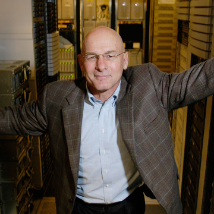

David Patterson Says It’s Time for New Computer Architectures and Software Languages

David Patterson Says It’s Time for New Computer Architectures and Software Languages

https://spectrum.ieee.org/view-from-the-valley/computing/hardware/david-patterson-says-its-time-for-new-computer-architectures-and-software-languages

Moore’s Law is over, ushering in a golden age for computer architecture, says RISC pioneer