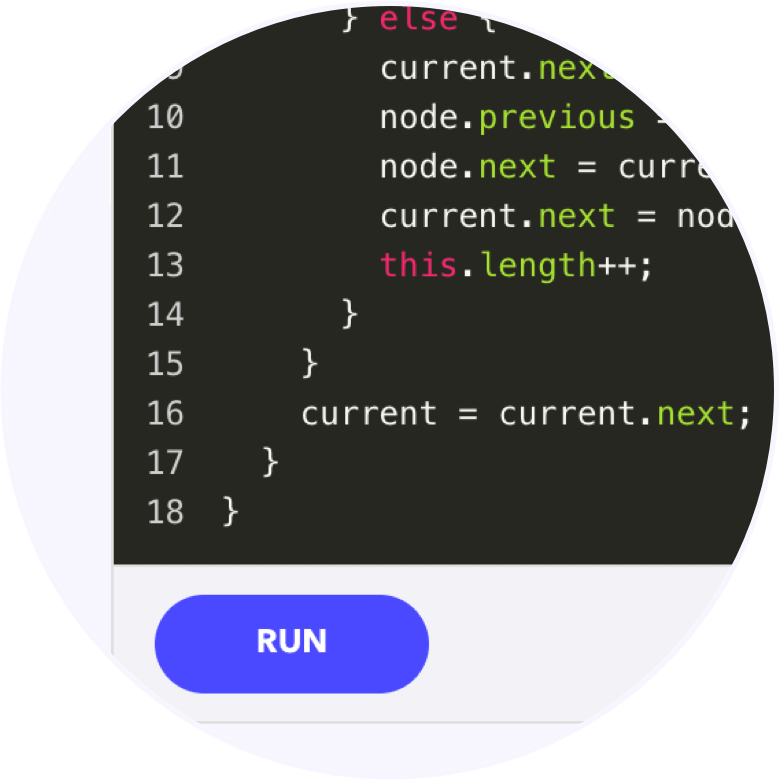
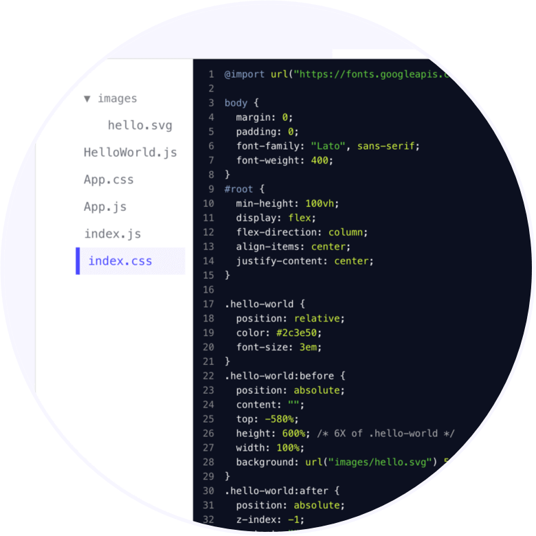

Declarative rendering and first directive : v-bind

' fill='%236C49FF' data-evernote-id='145' class='js-evernote-checked'%3e%3crect id='Rectangle' transform='translate(39.000000%2c 150.000000) rotate(36.000000) translate(-39.000000%2c -150.000000) ' x='-12' y='99' width='102' height='102' rx='19' data-evernote-id='146' class='js-evernote-checked'%3e%3c/rect%3e%3c/g%3e%3c/g%3e%3c/svg%3e)

# Level up your coding skills.

No more passive learning. Interactive in-browser environments keep you engaged and test your progress as you go.

![](data:image/svg+xml,%3csvg width='382px' height='420px' viewBox='0 0 382 420' version='1.1' xmlns='http://www.w3.org/2000/svg' data-evernote-id='154' class='js-evernote-checked'%3e%3cdesc data-evernote-id='155' class='js-evernote-checked'%3eCreated with Sketch.%3c/desc%3e%3cdefs data-evernote-id='156' class='js-evernote-checked'%3e%3cpath d='M0.5234375%2c8.06566148 L59.36875%2c0.186299246 L85.6375%2c0.186299246 L104.004688%2c9.53570343 L116.24375%2c24.1359284 C115.87308%2c25.4250381 112.704851%2c24.6777538 106.739063%2c21.8940753 C97.7903805%2c17.7185575 94.3135187%2c14.0595151 91.7578125%2c12.7106183 C90.0540084%2c11.8113538 86.9951542%2c10.6043225 82.58125%2c9.08952456 L76.240625%2c12.7106183 L76.240625%2c17.9927499 C76.9023902%2c22.0087459 77.8695777%2c25.0260631 79.1421875%2c27.0447015 C81.0511022%2c30.072659 84.1728798%2c30.4247021 85.6375%2c32.8982551 C87.1021202%2c35.3718082 86.8539445%2c37.4699766 85.6375%2c38.0144394 C84.826537%2c38.3774147 82.6614329%2c37.6410891 79.1421875%2c35.8054627 L70.790625%2c29.8517145 C66.515625%2c21.9457381 60.2260417%2c18.3619564 51.921875%2c19.1003693 C43.6177083%2c19.8387823 27.5677083%2c25.4071468 3.771875%2c35.8054627 L0.5234375%2c8.06566148 Z' id='path-1' data-evernote-id='157' class='js-evernote-checked'%3e%3c/path%3e%3cpath d='M0%2c13.6108037 L67.3359375%2c0 C70.9848958%2c5.52920136 72.809375%2c12.5472557 72.809375%2c21.0541631 C72.809375%2c29.5610705 70.9848958%2c36.5791249 67.3359375%2c42.1083262 C60.3515625%2c36.5934511 54.9708333%2c33.6168379 51.19375%2c33.1784867 C45.775%2c31.4553492 28.7104167%2c32.316918 0%2c35.7631931 L0%2c13.6108037 Z' id='path-3' data-evernote-id='158' class='js-evernote-checked'%3e%3c/path%3e%3cpath d='M0.475%2c0.026614178 L13.228125%2c3.03245075 L23.575%2c13.1411418 C27.8665728%2c21.2087261 29.794177%2c25.9559649 29.3578125%2c27.3828581 C28.7032658%2c29.5231979 23.7796047%2c26.6338891 21.1640625%2c24.2580405 C19.4203677%2c22.6741414 18.3208885%2c20.236074 17.865625%2c16.9438382 L13.228125%2c13.7047361 L6.3421875%2c8.99089555 L0.475%2c0.026614178 Z' id='path-5' data-evernote-id='159' class='js-evernote-checked'%3e%3c/path%3e%3cpath d='M2.75625%2c9.7110439 C56.0950106%2c4.00250452 87.0569898%2c0.896995237 95.6421875%2c0.394516051 C108.519984%2c-0.359202729 113.123365%2c-0.161465713 121.51875%2c2.76004681 C124.07663%2c3.65016433 128.340172%2c8.18188044 134.309375%2c16.3551952 L134.309375%2c27.1495927 C133.277015%2c35.4344297 131.95514%2c39.5768482 130.34375%2c39.5768482 C127.926665%2c39.5768482 126.258653%2c37.6123638 124.8375%2c33.2583293 C123.890064%2c30.3556396 123.890064%2c26.0838031 124.8375%2c20.4428198 L118.932813%2c20.4428198 C116.025179%2c22.6992846 111.453304%2c23.827517 105.217188%2c23.827517 C98.9810706%2c23.827517 92.5175289%2c22.6992846 85.8265625%2c20.4428198 L9.309375%2c49.1720422 L0.5796875%2c20.4428198 L2.75625%2c9.7110439 Z' id='path-7' data-evernote-id='160' class='js-evernote-checked'%3e%3c/path%3e%3cpath d='M0%2c10.2686095 L79.9670816%2c0 C85.3223605%2c6.97421663 88%2c15.5508195 88%2c25.7298087 C88%2c35.9087978 85.3223605%2c44.4854007 79.9670816%2c51.4596174 C72.7712251%2c48.7021115 64.2694475%2c46.7178075 54.4617487%2c45.5067053 C44.6540499%2c44.2956032 26.5001337%2c43.5228379 0%2c43.1884095 L0%2c10.2686095 Z' id='path-9' data-evernote-id='161' class='js-evernote-checked'%3e%3c/path%3e%3c/defs%3e%3cg id='Page-1' stroke='none' stroke-width='1' fill='none' fill-rule='evenodd' data-evernote-id='162' class='js-evernote-checked'%3e%3cg id='Home' transform='translate(-642.000000%2c -119.000000)' data-evernote-id='163' class='js-evernote-checked'%3e%3cg id='laptop-pic' transform='translate(634.000000%2c 98.000000)' data-evernote-id='164' class='js-evernote-checked'%3e%3crect id='Rectangle' fill='%236C49FF' opacity='0.0671875' transform='translate(291.000000%2c 231.000000) rotate(36.000000) translate(-291.000000%2c -231.000000) ' x='126' y='66' width='330' height='330' rx='53' data-evernote-id='165' class='js-evernote-checked'%3e%3c/rect%3e%3crect id='Rectangle' fill='%236C49FF' opacity='0.0506138393' transform='translate(72.000000%2c 123.000000) rotate(36.000000) translate(-72.000000%2c -123.000000) ' x='21' y='72' width='102' height='102' rx='19' data-evernote-id='166' class='js-evernote-checked'%3e%3c/rect%3e%3crect id='Rectangle' fill='%236C49FF' opacity='0.0506138393' transform='translate(158.500000%2c 51.500000) rotate(36.000000) translate(-158.500000%2c -51.500000) ' x='135' y='28' width='47' height='47' rx='9' data-evernote-id='167' class='js-evernote-checked'%3e%3c/rect%3e%3cg id='Group-8' transform='translate(253.000000%2c 221.000000) scale(-1%2c 1) translate(-253.000000%2c -221.000000) translate(93.000000%2c 118.000000)' data-evernote-id='168' class='js-evernote-checked'%3e%3cg id='Group' transform='translate(52.000000%2c 0.000000)' data-evernote-id='169' class='js-evernote-checked'%3e%3cpolygon id='Path' fill='%23B0C9CE' points='241.612004 164.133689 264.63326 30.8576348 115.183734 0 95.3031026 123.931902' data-evernote-id='170' class='js-evernote-checked'%3e%3c/polygon%3e%3cpolygon id='Path' fill='%23465F84' points='233.784773 155.878375 254.568019 35.5587461 119.64722 7.70093458 101.699284 119.584804' data-evernote-id='171' class='js-evernote-checked'%3e%3c/polygon%3e%3cpolygon id='Path-2' fill='%23F8F8F8' points='241.257216 164.177558 117.828405 200.263155 0.258595615 149.037651 95.181925 123.936916' data-evernote-id='172' class='js-evernote-checked'%3e%3c/polygon%3e%3cpolygon id='Path-3' fill='%23B0C9CE' points='0.179580288 149.082774 0.179580288 154.011171 118.184442 205.602674 118.184442 200.288226' data-evernote-id='173' class='js-evernote-checked'%3e%3c/polygon%3e%3cpolygon id='Path-4' fill='%23465F84' points='118.039529 200.144081 241.04984 163.720064 241.04984 168.019251 118.039529 205.405885' data-evernote-id='174' class='js-evernote-checked'%3e%3c/polygon%3e%3cpolygon id='Path-5' fill='%23465F84' points='264.08109 31.1885344 267.372874 33.5236322 244.632701 164.16377 241.071077 164.16377' data-evernote-id='175' class='js-evernote-checked'%3e%3c/polygon%3e%3cpolygon id='Path-6' fill='%23DDE7E7' points='96.0589014 128.043078 54.8322643 139.924126 161.867113 181.512181 224.103707 164.320446' data-evernote-id='176' class='js-evernote-checked'%3e%3c/polygon%3e%3cpolygon id='Path-7' fill='%23DDE7E7' points='78.6218116 154.202942 48.4235904 162.63712 85.9836665 177.202967 115.033823 168.291241' data-evernote-id='177' class='js-evernote-checked'%3e%3c/polygon%3e%3cg id='Group-9' transform='translate(203.651178%2c 76.320429) scale(-1%2c 1) rotate(-24.000000) translate(-203.651178%2c -76.320429) translate(167.651178%2c 34.820429)' stroke-width='3.2' data-evernote-id='178' class='js-evernote-checked'%3e%3cpath d='M12.6932242%2c0.0202370522 L59.7101544%2c10.1089126' id='Path-8' stroke='%23B8E986' data-evernote-id='179' class='js-evernote-checked'%3e%3c/path%3e%3cpath d='M8.00477327%2c33.3395639 L36.4677804%2c39.4361371' id='Path-8' stroke='%23B8E986' data-evernote-id='180' class='js-evernote-checked'%3e%3c/path%3e%3cpath d='M2.88782816%2c57.0841121 L21.1169451%2c61.2554517' id='Path-8' stroke='%23B8E986' data-evernote-id='181' class='js-evernote-checked'%3e%3c/path%3e%3cpath d='M0.968973747%2c67.3520249 L44.7828162%2c77.2990654' id='Path-8' stroke='%23B8E986' data-evernote-id='182' class='js-evernote-checked'%3e%3c/path%3e%3cpath d='M17.9188544%2c43.9283489 L35.8331593%2c47.9204512' id='Path-8' stroke='%23FF5E5B' data-evernote-id='183' class='js-evernote-checked'%3e%3c/path%3e%3cpath d='M16.6396181%2c50.9875389 L58.8544153%2c60.6137072' id='Path-8' stroke='%23FF5E5B' data-evernote-id='184' class='js-evernote-checked'%3e%3c/path%3e%3cpath d='M21.4367542%2c10.2367601 L68.4486874%2c20.1838006' id='Path-8' stroke='%23FFFFFF' data-evernote-id='185' class='js-evernote-checked'%3e%3c/path%3e%3cpath d='M26.5536993%2c20.5046729 L47.9809069%2c25.317757' id='Path-8' stroke='%23FFFFFF' data-evernote-id='186' class='js-evernote-checked'%3e%3c/path%3e%3cpath d='M25.274463%2c28.2056075 L46.7016706%2c33.0186916' id='Path-8' stroke='%23FFFFFF' data-evernote-id='187' class='js-evernote-checked'%3e%3c/path%3e%3cpath d='M8.64439141%2c77.6199377 L30.071599%2c82.4330218' id='Path-8' stroke='%23FFFFFF' data-evernote-id='188' class='js-evernote-checked'%3e%3c/path%3e%3cpath d='M49.5799523%2c33.9813084 L71.0071599%2c38.7943925' id='Path-8' stroke='%233EAEFF' data-evernote-id='189' class='js-evernote-checked'%3e%3c/path%3e%3cpath d='M38.7064439%2c48.741433 L60.1336516%2c53.5545171' id='Path-8' stroke='%23FFFFFF' data-evernote-id='190' class='js-evernote-checked'%3e%3c/path%3e%3c/g%3e%3cpolygon id='Path-9' fill='%2334435B' points='121.819362 10 104.129883 118.473633 128.625977 124.916992 147.580078 15.4951172' data-evernote-id='191' class='js-evernote-checked'%3e%3c/polygon%3e%3c/g%3e%3cg id='Group-7' transform='translate(0.000000%2c 117.828794)' data-evernote-id='192' class='js-evernote-checked'%3e%3cpath d='M68.6484375%2c47.8460299 L114.485938%2c36.8058427 L151.345313%2c36.8058427 L142.325%2c33.089251 L147.409375%2c26.1726958 L180.973437%2c23.9684156 L147.409375%2c18.5610409 L124.810937%2c23.9684156 C113.603646%2c28.4980443 106.979687%2c30.7628587 104.939063%2c30.7628587 C102.898438%2c30.7628587 90.8015625%2c33.660673 68.6484375%2c39.4563017 L68.6484375%2c47.8460299 Z' id='Path-20' fill-opacity='0.158344656' fill='%23000000' data-evernote-id='193' class='js-evernote-checked'%3e%3c/path%3e%3cg id='Group-5' data-evernote-id='194' class='js-evernote-checked'%3e%3cg id='Group-4' transform='translate(67.200000%2c 0.000000)' data-evernote-id='195' class='js-evernote-checked'%3e%3cpath d='M81.9679688%2c8.93140503 L89.946875%2c15.6773164 C91.7763488%2c18.0168667 93.5031717%2c19.7055624 95.1273438%2c20.7434035 C96.7515158%2c21.7812445 98.5437033%2c22.341186 100.503906%2c22.4232277 L103.560938%2c20.7434035 L93.4328125%2c12.0734436 L83.5789063%2c8.93140503 L81.9679688%2c8.93140503 Z' id='Path-17' fill='%23928181' data-evernote-id='196' class='js-evernote-checked'%3e%3c/path%3e%3cpath d='M83.2164063%2c8.46025268 L92.4765625%2c19.4910467 C90.2428234%2c20.1849615 88.4100109%2c20.1849615 86.978125%2c19.4910467 C85.5462391%2c18.7971319 84.2923329%2c17.3012585 83.2164063%2c15.0034266 L78.4%2c10.5024995 C78.8006099%2c8.62296354 79.308162%2c7.55291703 79.9226563%2c7.29235992 C80.5371505%2c7.03180281 81.6350672%2c7.4211004 83.2164063%2c8.46025268 Z' id='Path-18' fill='%23928181' data-evernote-id='197' class='js-evernote-checked'%3e%3c/path%3e%3cpath d='M76.9171875%2c5.37848741 L86.1773437%2c16.4092814 C83.9436046%2c17.1031963 82.1107921%2c17.1031963 80.6789062%2c16.4092814 C79.2470204%2c15.7153666 77.9931141%2c14.2194932 76.9171875%2c11.9216614 L72.1007812%2c7.42073419 C72.5013912%2c5.54119828 73.0089433%2c4.47115177 73.6234375%2c4.21059466 C74.2379317%2c3.95003755 75.3358484%2c4.33933514 76.9171875%2c5.37848741 Z' id='Path-18' fill='%23928181' transform='translate(79.139062%2c 10.530980) rotate(19.000000) translate(-79.139062%2c -10.530980) ' data-evernote-id='198' class='js-evernote-checked'%3e%3c/path%3e%3cg id='Path-19' data-evernote-id='199' class='js-evernote-checked'%3e%3cmask id='mask-2' fill='white' data-evernote-id='200' class='js-evernote-checked'%3e%3c/mask%3e%3cpath d='M2.3578125%2c23.678008 L37.0929688%2c15.9896416 C49.859512%2c13.4643874 59.0556057%2c14.0256335 64.68125%2c17.6733797 C73.1197164%2c23.1449991 71.2400953%2c25.5123868 75.8984375%2c29.7178608 C79.003999%2c32.5215102 82.7456657%2c35.2601613 87.1234375%2c37.9338141 C85.3994792%2c39.0140367 84.5375%2c39.5541479 84.5375%2c39.5541479 C84.5375%2c39.5541479 74.5994792%2c33.7418202 54.7234375%2c22.1171647 L17.0265625%2c31.6896583 L2.3578125%2c37.9338141 L0.48359375%2c25.4783788 L2.3578125%2c23.678008 Z' fill='%23000000' opacity='0.16640625' mask='url(%23mask-2)' data-evernote-id='203' class='js-evernote-checked'%3e%3c/path%3e%3c/g%3e%3c/g%3e%3cg id='Path-16' transform='translate(0.000000%2c 7.214008)' data-evernote-id='204' class='js-evernote-checked'%3e%3cmask id='mask-4' fill='white' data-evernote-id='205' class='js-evernote-checked'%3e%3c/mask%3e%3cpath d='M-2.975%2c26.7100673 L72.8375%2c15.8890557 C73.0587223%2c20.7750922 73.0587223%2c24.3820961 72.8375%2c26.7100673 C72.6162777%2c29.0380386 71.6829444%2c35.3616455 70.0375%2c45.6808883 L40.2421875%2c34.4825815 L-2.975%2c38.4527906 L-2.975%2c26.7100673 Z' fill='%23000000' opacity='0.179241071' mask='url(%23mask-4)' data-evernote-id='208' class='js-evernote-checked'%3e%3c/path%3e%3c/g%3e%3c/g%3e%3c/g%3e%3cg id='Group-6' transform='translate(5.600000%2c 145.883268)' data-evernote-id='209' class='js-evernote-checked'%3e%3cpath d='M93.2773438%2c53.0083977 C96.9372396%2c52.0735094 114.766667%2c48.4396305 146.765625%2c42.1067607 C159.857869%2c39.7289825 169.679744%2c38.2547658 176.23125%2c37.6841105 C182.782756%2c37.1134553 189.885881%2c37.1134553 197.540625%2c37.6841105 L192.878125%2c33.6763284 L216.511328%2c31.0454387 C213.740568%2c30.0024463 211.618303%2c29.0696455 210.144531%2c28.2470361 C207.8136%2c26.9459888 204.977664%2c22.2011145 203.373047%2c21.6259766 C202.303302%2c21.2425513 199.111505%2c21.5915362 193.797656%2c22.6729314 L186.501563%2c20.2847003 C180.279836%2c22.6421505 175.046112%2c24.335021 170.800391%2c25.3633116 C166.554669%2c26.3916023 160.8298%2c27.3528438 153.625781%2c28.2470361 L117.079688%2c37.6841105 L75.509375%2c49.5008056 L78.090625%2c58.2208627 L79.7378906%2c59.1410088 C85.1042969%2c55.9874896 89.6174479%2c53.9432859 93.2773438%2c53.0083977 Z' id='Path-10' fill-opacity='0.158571105' fill='%23000000' data-evernote-id='210' class='js-evernote-checked'%3e%3c/path%3e%3cg id='Group-3' data-evernote-id='211' class='js-evernote-checked'%3e%3cg id='Group-2' transform='translate(68.000000%2c 0.000000)' data-evernote-id='212' class='js-evernote-checked'%3e%3cpath d='M98.25625%2c22.7112871 L91.8703125%2c27.8791342 C89.3468549%2c29.3978886 87.5255007%2c29.3978886 86.40625%2c27.8791342 C85.2869993%2c26.3603799 85.2869993%2c23.8889142 86.40625%2c20.4647374 L86.40625%2c17.7923608 L98.25625%2c22.7112871 Z' id='Path-13' fill='%23827272' data-evernote-id='213' class='js-evernote-checked'%3e%3c/path%3e%3cpath d='M117.120312%2c1.67669321 L128.153125%2c1.67669321 C134.257812%2c4.03256982 137.560286%2c5.57240875 138.060547%2c6.29621003 C138.560807%2c7.0200113 138.935937%2c9.56049114 139.185937%2c13.9176496 L121.717187%2c7.79717139 L117.120312%2c1.67669321 Z' id='Path-14' fill='%23A29090' data-evernote-id='214' class='js-evernote-checked'%3e%3c/path%3e%3cg id='Path-11' transform='translate(120.000000%2c 3.206226)' data-evernote-id='215' class='js-evernote-checked'%3e%3cmask id='mask-6' fill='white' data-evernote-id='216' class='js-evernote-checked'%3e%3c/mask%3e%3cpath d='M5.490625%2c5.9662725 L16.76875%2c10.2472413 L23.7546875%2c18.8569279 L27.3328125%2c29.1902739 L16.76875%2c20.1391051 C11.2588542%2c14.8220098 8.50390625%2c12.1634621 8.50390625%2c12.1634621 C8.50390625%2c12.1634621 7.49947917%2c10.0977322 5.490625%2c5.9662725 Z' fill-opacity='0.20872962' fill='%23000000' mask='url(%23mask-6)' data-evernote-id='219' class='js-evernote-checked'%3e%3c/path%3e%3c/g%3e%3cg id='Path-15' data-evernote-id='220' class='js-evernote-checked'%3e%3cmask id='mask-8' fill='white' data-evernote-id='221' class='js-evernote-checked'%3e%3c/mask%3e%3cpath d='M13.8164062%2c38.0285293 L85.903125%2c18.64558 L104.788281%2c18.64558 L118.842187%2c16.770846 L124.574219%2c16.770846 L126.48125%2c18.64558 L127.707813%2c33.3804414 L129.75625%2c39.8735181 L115.11875%2c35.4219054 C93.3213542%2c27.5341936 81.834375%2c23.5903377 80.6578125%2c23.5903377 C79.48125%2c23.5903377 56.4369792%2c31.8519526 11.525%2c48.3751824 L13.8164062%2c38.0285293 Z' fill-opacity='0.119848279' fill='%23000000' mask='url(%23mask-8)' data-evernote-id='224' class='js-evernote-checked'%3e%3c/path%3e%3c/g%3e%3c/g%3e%3cg id='Path-12' transform='translate(0.000000%2c 8.015564)' data-evernote-id='225' class='js-evernote-checked'%3e%3cmask id='mask-10' fill='white' data-evernote-id='226' class='js-evernote-checked'%3e%3c/mask%3e%3cpath d='M-20.8%2c32.2125486 C1.75866814%2c36.608666 21.6064374%2c38.527496 38.7433077%2c37.9690388 C55.8801781%2c37.4105815 72.1907421%2c34.3134218 87.675%2c28.6775596 L83.5975362%2c54.6545629 C77.6688713%2c62.6951757 69.9414712%2c66.7154821 60.4153361%2c66.7154821 C50.8892009%2c66.7154821 23.8174222%2c62.6951757 -20.8%2c54.6545629 L-20.8%2c32.2125486 Z' fill='%23000000' opacity='0.165904018' mask='url(%23mask-10)' data-evernote-id='229' class='js-evernote-checked'%3e%3c/path%3e%3c/g%3e%3c/g%3e%3c/g%3e%3c/g%3e%3c/g%3e%3c/g%3e%3c/g%3e%3c/svg%3e)

Better than videos

Interactive practice environments are embedded in every course to give you a hands-on learning experience.

No set-up required

Put everything you‘re learning to practice in your browser immediately. No worrying about downloads or setup.

Crafted by the community

Our courses are created by a passionate community of devs with real-world experience.

' stroke='%23aaaaaa' stroke-width='1.024' data-evernote-id='260'%3e%3cg id='Group-11' transform='translate(143.000000%2c 103.000000)' data-evernote-id='261' class='js-evernote-checked'%3e%3cellipse id='Oval-8' cx='4.73684211' cy='4.71428571' rx='4.73684211' ry='4.71428571' data-evernote-id='262' class='js-evernote-checked'%3e%3c/ellipse%3e%3cpath d='M8.02323191%2c8.64592634 L9.75997122%2c10.7616257' id='Path-29' data-evernote-id='263' class='js-evernote-checked'%3e%3c/path%3e%3c/g%3e%3c/g%3e%3c/g%3e%3c/svg%3e)

Learning Tracks[View all Learning Tracks](https://www.educative.io/tracks)

[

Ace the Java Coding Interview

' stroke='%234B49FF' data-evernote-id='288' class='js-evernote-checked'%3e%3cg id='square' transform='translate(195.000000%2c 782.000000)' data-evernote-id='289' class='js-evernote-checked'%3e%3cpath d='M6.44650411%2c0.834509391 L19.5184532%2c0.834509391 C20.6230227%2c0.834509391 21.5184532%2c1.72993989 21.5184532%2c2.83450939 C21.5184532%2c3.01518473 21.493971%2c3.19502692 21.4456749%2c3.36912764 L16.6163664%2c20.7780879 C16.3211049%2c21.8424631 15.2189017%2c22.4659529 14.1545265%2c22.1706913 C14.0633879%2c22.1454092 13.9741575%2c22.1136939 13.8875071%2c22.0757844 L1.66779836%2c16.7296618 C0.722421453%2c16.3160594 0.246903478%2c15.2511175 0.570006905%2c14.2711131 L4.54707498%2c2.20827541 C4.81738074%2c1.38841153 5.58323012%2c0.834509391 6.44650411%2c0.834509391 Z' id='Rectangle' stroke-width='1.5' stroke-linecap='round' stroke-linejoin='round' data-evernote-id='290' class='js-evernote-checked'%3e%3c/path%3e%3cpath d='M5.5%2c9.5 L16.5%2c11.5' id='Line-2' stroke-linecap='square' fill-rule='nonzero' data-evernote-id='291' class='js-evernote-checked'%3e%3c/path%3e%3cpath d='M4.5%2c11.5 L15.5%2c13.5' id='Line-2' stroke-linecap='square' fill-rule='nonzero' data-evernote-id='292' class='js-evernote-checked'%3e%3c/path%3e%3cpath d='M3.5%2c13.5 L14.5%2c15.5' id='Line-2' stroke-linecap='square' fill-rule='nonzero' data-evernote-id='293' class='js-evernote-checked'%3e%3c/path%3e%3ccircle id='Oval' fill-rule='nonzero' cx='8' cy='5' r='1' data-evernote-id='294' class='js-evernote-checked'%3e%3c/circle%3e%3c/g%3e%3c/g%3e%3c/g%3e%3c/svg%3e)7 Courses

Data Structures in Java: An Interview Refresher

[Previous](https://www.educative.io/#)[Next](https://www.educative.io/#)](https://www.educative.io/track/ace-java-coding-interview)[

Ace the JavaScript Coding Interview

' stroke='%234B49FF' data-evernote-id='341' class='js-evernote-checked'%3e%3cg id='square' transform='translate(195.000000%2c 782.000000)' data-evernote-id='342' class='js-evernote-checked'%3e%3cpath d='M6.44650411%2c0.834509391 L19.5184532%2c0.834509391 C20.6230227%2c0.834509391 21.5184532%2c1.72993989 21.5184532%2c2.83450939 C21.5184532%2c3.01518473 21.493971%2c3.19502692 21.4456749%2c3.36912764 L16.6163664%2c20.7780879 C16.3211049%2c21.8424631 15.2189017%2c22.4659529 14.1545265%2c22.1706913 C14.0633879%2c22.1454092 13.9741575%2c22.1136939 13.8875071%2c22.0757844 L1.66779836%2c16.7296618 C0.722421453%2c16.3160594 0.246903478%2c15.2511175 0.570006905%2c14.2711131 L4.54707498%2c2.20827541 C4.81738074%2c1.38841153 5.58323012%2c0.834509391 6.44650411%2c0.834509391 Z' id='Rectangle' stroke-width='1.5' stroke-linecap='round' stroke-linejoin='round' data-evernote-id='343' class='js-evernote-checked'%3e%3c/path%3e%3cpath d='M5.5%2c9.5 L16.5%2c11.5' id='Line-2' stroke-linecap='square' fill-rule='nonzero' data-evernote-id='344' class='js-evernote-checked'%3e%3c/path%3e%3cpath d='M4.5%2c11.5 L15.5%2c13.5' id='Line-2' stroke-linecap='square' fill-rule='nonzero' data-evernote-id='345' class='js-evernote-checked'%3e%3c/path%3e%3cpath d='M3.5%2c13.5 L14.5%2c15.5' id='Line-2' stroke-linecap='square' fill-rule='nonzero' data-evernote-id='346' class='js-evernote-checked'%3e%3c/path%3e%3ccircle id='Oval' fill-rule='nonzero' cx='8' cy='5' r='1' data-evernote-id='347' class='js-evernote-checked'%3e%3c/circle%3e%3c/g%3e%3c/g%3e%3c/g%3e%3c/svg%3e)6 Courses

Data Structures in JavaScript: An Interview Refresher

[Previous](https://www.educative.io/#)[Next](https://www.educative.io/#)](https://www.educative.io/track/ace-js-coding-interview)[

Ace the Python Coding Interview

' stroke='%234B49FF' data-evernote-id='390' class='js-evernote-checked'%3e%3cg id='square' transform='translate(195.000000%2c 782.000000)' data-evernote-id='391' class='js-evernote-checked'%3e%3cpath d='M6.44650411%2c0.834509391 L19.5184532%2c0.834509391 C20.6230227%2c0.834509391 21.5184532%2c1.72993989 21.5184532%2c2.83450939 C21.5184532%2c3.01518473 21.493971%2c3.19502692 21.4456749%2c3.36912764 L16.6163664%2c20.7780879 C16.3211049%2c21.8424631 15.2189017%2c22.4659529 14.1545265%2c22.1706913 C14.0633879%2c22.1454092 13.9741575%2c22.1136939 13.8875071%2c22.0757844 L1.66779836%2c16.7296618 C0.722421453%2c16.3160594 0.246903478%2c15.2511175 0.570006905%2c14.2711131 L4.54707498%2c2.20827541 C4.81738074%2c1.38841153 5.58323012%2c0.834509391 6.44650411%2c0.834509391 Z' id='Rectangle' stroke-width='1.5' stroke-linecap='round' stroke-linejoin='round' data-evernote-id='392' class='js-evernote-checked'%3e%3c/path%3e%3cpath d='M5.5%2c9.5 L16.5%2c11.5' id='Line-2' stroke-linecap='square' fill-rule='nonzero' data-evernote-id='393' class='js-evernote-checked'%3e%3c/path%3e%3cpath d='M4.5%2c11.5 L15.5%2c13.5' id='Line-2' stroke-linecap='square' fill-rule='nonzero' data-evernote-id='394' class='js-evernote-checked'%3e%3c/path%3e%3cpath d='M3.5%2c13.5 L14.5%2c15.5' id='Line-2' stroke-linecap='square' fill-rule='nonzero' data-evernote-id='395' class='js-evernote-checked'%3e%3c/path%3e%3ccircle id='Oval' fill-rule='nonzero' cx='8' cy='5' r='1' data-evernote-id='396' class='js-evernote-checked'%3e%3c/circle%3e%3c/g%3e%3c/g%3e%3c/g%3e%3c/svg%3e)5 Courses

Data Structures in Python: An Interview Refresher

[Previous](https://www.educative.io/#)[Next](https://www.educative.io/#)](https://www.educative.io/track/ace-python-coding-interview)

' stroke='%235E5E5E' data-evernote-id='433' class='js-evernote-checked'%3e%3cg id='square' transform='translate(195.000000%2c 782.000000)' data-evernote-id='434' class='js-evernote-checked'%3e%3cpath d='M6.44650411%2c0.834509391 L19.5184532%2c0.834509391 C20.6230227%2c0.834509391 21.5184532%2c1.72993989 21.5184532%2c2.83450939 C21.5184532%2c3.01518473 21.493971%2c3.19502692 21.4456749%2c3.36912764 L16.6163664%2c20.7780879 C16.3211049%2c21.8424631 15.2189017%2c22.4659529 14.1545265%2c22.1706913 C14.0633879%2c22.1454092 13.9741575%2c22.1136939 13.8875071%2c22.0757844 L1.66779836%2c16.7296618 C0.722421453%2c16.3160594 0.246903478%2c15.2511175 0.570006905%2c14.2711131 L4.54707498%2c2.20827541 C4.81738074%2c1.38841153 5.58323012%2c0.834509391 6.44650411%2c0.834509391 Z' id='Rectangle' stroke-width='1.5' stroke-linecap='round' stroke-linejoin='round' data-evernote-id='435' class='js-evernote-checked'%3e%3c/path%3e%3cpath d='M5.5%2c9.5 L16.5%2c11.5' id='Line-2' stroke-linecap='square' fill-rule='nonzero' data-evernote-id='436' class='js-evernote-checked'%3e%3c/path%3e%3cpath d='M4.5%2c11.5 L15.5%2c13.5' id='Line-2' stroke-linecap='square' fill-rule='nonzero' data-evernote-id='437' class='js-evernote-checked'%3e%3c/path%3e%3cpath d='M3.5%2c13.5 L14.5%2c15.5' id='Line-2' stroke-linecap='square' fill-rule='nonzero' data-evernote-id='438' class='js-evernote-checked'%3e%3c/path%3e%3ccircle id='Oval' fill-rule='nonzero' cx='8' cy='5' r='1' data-evernote-id='439' class='js-evernote-checked'%3e%3c/circle%3e%3c/g%3e%3c/g%3e%3c/g%3e%3c/svg%3e)Courses

[      Educative   Mastering Concurrency in Go!  golangconcurrencychannelsgoroutinespatterns  ' data-evernote-id='462' class='js-evernote-checked'%3e%3cg id='Group-16' transform='translate(629.000000%2c 761.000000)' data-evernote-id='463' class='js-evernote-checked'%3e%3cg id='Group-15' transform='translate(87.000000%2c 270.000000)' data-evernote-id='464' class='js-evernote-checked'%3e%3crect id='Rectangle-8' fill='%23C8C7FF' opacity='0.404129464' x='6' y='4' width='11' height='15' rx='2' data-evernote-id='465' class='js-evernote-checked'%3e%3c/rect%3e%3crect id='Rectangle-8' fill='%23C8C7FF' x='3' y='2' width='11' height='15' rx='2' data-evernote-id='466' class='js-evernote-checked'%3e%3c/rect%3e%3crect id='Rectangle-8' fill='%234B49FF' x='0' y='0' width='11' height='15' rx='2' data-evernote-id='467' class='js-evernote-checked'%3e%3c/rect%3e%3cpolyline id='Path-21' stroke='%23FFFFFF' stroke-width='1.6' stroke-linecap='round' stroke-linejoin='round' points='4 5 7 7.27517236 4 10' data-evernote-id='468' class='js-evernote-checked'%3e%3c/polyline%3e%3c/g%3e%3c/g%3e%3c/g%3e%3c/g%3e%3c/svg%3e)35 Lessons](https://www.educative.io/collection/10370001/5895695963783168)[      Alex Jover Morales   Testing Vue.js Components with Jest  ' data-evernote-id='484' class='js-evernote-checked'%3e%3cg id='Group-16' transform='translate(629.000000%2c 761.000000)' data-evernote-id='485' class='js-evernote-checked'%3e%3cg id='Group-15' transform='translate(87.000000%2c 270.000000)' data-evernote-id='486' class='js-evernote-checked'%3e%3crect id='Rectangle-8' fill='%23C8C7FF' opacity='0.404129464' x='6' y='4' width='11' height='15' rx='2' data-evernote-id='487' class='js-evernote-checked'%3e%3c/rect%3e%3crect id='Rectangle-8' fill='%23C8C7FF' x='3' y='2' width='11' height='15' rx='2' data-evernote-id='488' class='js-evernote-checked'%3e%3c/rect%3e%3crect id='Rectangle-8' fill='%234B49FF' x='0' y='0' width='11' height='15' rx='2' data-evernote-id='489' class='js-evernote-checked'%3e%3c/rect%3e%3cpolyline id='Path-21' stroke='%23FFFFFF' stroke-width='1.6' stroke-linecap='round' stroke-linejoin='round' points='4 5 7 7.27517236 4 10' data-evernote-id='490' class='js-evernote-checked'%3e%3c/polyline%3e%3c/g%3e%3c/g%3e%3c/g%3e%3c/g%3e%3c/svg%3e)41 Lessons](https://www.educative.io/collection/10370001/6751199023857664)[      Educative   Learn Object-Oriented Programming in JavaScript  OOPObject-OrientedJavascriptES6-OOPES5-OOP  ' data-evernote-id='512' class='js-evernote-checked'%3e%3cg id='Group-16' transform='translate(629.000000%2c 761.000000)' data-evernote-id='513' class='js-evernote-checked'%3e%3cg id='Group-15' transform='translate(87.000000%2c 270.000000)' data-evernote-id='514' class='js-evernote-checked'%3e%3crect id='Rectangle-8' fill='%23C8C7FF' opacity='0.404129464' x='6' y='4' width='11' height='15' rx='2' data-evernote-id='515' class='js-evernote-checked'%3e%3c/rect%3e%3crect id='Rectangle-8' fill='%23C8C7FF' x='3' y='2' width='11' height='15' rx='2' data-evernote-id='516' class='js-evernote-checked'%3e%3c/rect%3e%3crect id='Rectangle-8' fill='%234B49FF' x='0' y='0' width='11' height='15' rx='2' data-evernote-id='517' class='js-evernote-checked'%3e%3c/rect%3e%3cpolyline id='Path-21' stroke='%23FFFFFF' stroke-width='1.6' stroke-linecap='round' stroke-linejoin='round' points='4 5 7 7.27517236 4 10' data-evernote-id='518' class='js-evernote-checked'%3e%3c/polyline%3e%3c/g%3e%3c/g%3e%3c/g%3e%3c/g%3e%3c/svg%3e)45 Lessons](https://www.educative.io/collection/10370001/5862304337887232)

[      C. H. Afzal   The Definitive Java Interview Handbook  ' data-evernote-id='535' class='js-evernote-checked'%3e%3cg id='Group-16' transform='translate(629.000000%2c 761.000000)' data-evernote-id='536' class='js-evernote-checked'%3e%3cg id='Group-15' transform='translate(87.000000%2c 270.000000)' data-evernote-id='537' class='js-evernote-checked'%3e%3crect id='Rectangle-8' fill='%23C8C7FF' opacity='0.404129464' x='6' y='4' width='11' height='15' rx='2' data-evernote-id='538' class='js-evernote-checked'%3e%3c/rect%3e%3crect id='Rectangle-8' fill='%23C8C7FF' x='3' y='2' width='11' height='15' rx='2' data-evernote-id='539' class='js-evernote-checked'%3e%3c/rect%3e%3crect id='Rectangle-8' fill='%234B49FF' x='0' y='0' width='11' height='15' rx='2' data-evernote-id='540' class='js-evernote-checked'%3e%3c/rect%3e%3cpolyline id='Path-21' stroke='%23FFFFFF' stroke-width='1.6' stroke-linecap='round' stroke-linejoin='round' points='4 5 7 7.27517236 4 10' data-evernote-id='541' class='js-evernote-checked'%3e%3c/polyline%3e%3c/g%3e%3c/g%3e%3c/g%3e%3c/g%3e%3c/svg%3e)85 Lessons](https://www.educative.io/collection/5307417243942912/5730192894984192)[      Educative   Functional Programming with ReasonML  ReasonMLReasonFunctional ProgrammingVariantsStatic  ' data-evernote-id='563' class='js-evernote-checked'%3e%3cg id='Group-16' transform='translate(629.000000%2c 761.000000)' data-evernote-id='564' class='js-evernote-checked'%3e%3cg id='Group-15' transform='translate(87.000000%2c 270.000000)' data-evernote-id='565' class='js-evernote-checked'%3e%3crect id='Rectangle-8' fill='%23C8C7FF' opacity='0.404129464' x='6' y='4' width='11' height='15' rx='2' data-evernote-id='566' class='js-evernote-checked'%3e%3c/rect%3e%3crect id='Rectangle-8' fill='%23C8C7FF' x='3' y='2' width='11' height='15' rx='2' data-evernote-id='567' class='js-evernote-checked'%3e%3c/rect%3e%3crect id='Rectangle-8' fill='%234B49FF' x='0' y='0' width='11' height='15' rx='2' data-evernote-id='568' class='js-evernote-checked'%3e%3c/rect%3e%3cpolyline id='Path-21' stroke='%23FFFFFF' stroke-width='1.6' stroke-linecap='round' stroke-linejoin='round' points='4 5 7 7.27517236 4 10' data-evernote-id='569' class='js-evernote-checked'%3e%3c/polyline%3e%3c/g%3e%3c/g%3e%3c/g%3e%3c/g%3e%3c/svg%3e)95 Lessons](https://www.educative.io/collection/10370001/5810886801358848)[      Educative   Learn Perl from Scratch  Perl LanguageProgrammingpackage  ' data-evernote-id='589' class='js-evernote-checked'%3e%3cg id='Group-16' transform='translate(629.000000%2c 761.000000)' data-evernote-id='590' class='js-evernote-checked'%3e%3cg id='Group-15' transform='translate(87.000000%2c 270.000000)' data-evernote-id='591' class='js-evernote-checked'%3e%3crect id='Rectangle-8' fill='%23C8C7FF' opacity='0.404129464' x='6' y='4' width='11' height='15' rx='2' data-evernote-id='592' class='js-evernote-checked'%3e%3c/rect%3e%3crect id='Rectangle-8' fill='%23C8C7FF' x='3' y='2' width='11' height='15' rx='2' data-evernote-id='593' class='js-evernote-checked'%3e%3c/rect%3e%3crect id='Rectangle-8' fill='%234B49FF' x='0' y='0' width='11' height='15' rx='2' data-evernote-id='594' class='js-evernote-checked'%3e%3c/rect%3e%3cpolyline id='Path-21' stroke='%23FFFFFF' stroke-width='1.6' stroke-linecap='round' stroke-linejoin='round' points='4 5 7 7.27517236 4 10' data-evernote-id='595' class='js-evernote-checked'%3e%3c/polyline%3e%3c/g%3e%3c/g%3e%3c/g%3e%3c/g%3e%3c/svg%3e)76 Lessons](https://www.educative.io/collection/10370001/5311748804444160)

[      Educative   Recursion for Coding Interviews in Java  ' data-evernote-id='612' class='js-evernote-checked'%3e%3cg id='Group-16' transform='translate(629.000000%2c 761.000000)' data-evernote-id='613' class='js-evernote-checked'%3e%3cg id='Group-15' transform='translate(87.000000%2c 270.000000)' data-evernote-id='614' class='js-evernote-checked'%3e%3crect id='Rectangle-8' fill='%23C8C7FF' opacity='0.404129464' x='6' y='4' width='11' height='15' rx='2' data-evernote-id='615' class='js-evernote-checked'%3e%3c/rect%3e%3crect id='Rectangle-8' fill='%23C8C7FF' x='3' y='2' width='11' height='15' rx='2' data-evernote-id='616' class='js-evernote-checked'%3e%3c/rect%3e%3crect id='Rectangle-8' fill='%234B49FF' x='0' y='0' width='11' height='15' rx='2' data-evernote-id='617' class='js-evernote-checked'%3e%3c/rect%3e%3cpolyline id='Path-21' stroke='%23FFFFFF' stroke-width='1.6' stroke-linecap='round' stroke-linejoin='round' points='4 5 7 7.27517236 4 10' data-evernote-id='618' class='js-evernote-checked'%3e%3c/polyline%3e%3c/g%3e%3c/g%3e%3c/g%3e%3c/g%3e%3c/svg%3e)51 Lessons](https://www.educative.io/collection/10370001/5996180548878336)[      Educative   Learn Object-Oriented Programming in Python  OOPInheritancePolymorphismClasses  ' data-evernote-id='649' class='js-evernote-checked'%3e%3cg id='Group-16' transform='translate(629.000000%2c 761.000000)' data-evernote-id='650' class='js-evernote-checked'%3e%3cg id='Group-15' transform='translate(87.000000%2c 270.000000)' data-evernote-id='651' class='js-evernote-checked'%3e%3crect id='Rectangle-8' fill='%23C8C7FF' opacity='0.404129464' x='6' y='4' width='11' height='15' rx='2' data-evernote-id='652' class='js-evernote-checked'%3e%3c/rect%3e%3crect id='Rectangle-8' fill='%23C8C7FF' x='3' y='2' width='11' height='15' rx='2' data-evernote-id='653' class='js-evernote-checked'%3e%3c/rect%3e%3crect id='Rectangle-8' fill='%234B49FF' x='0' y='0' width='11' height='15' rx='2' data-evernote-id='654' class='js-evernote-checked'%3e%3c/rect%3e%3cpolyline id='Path-21' stroke='%23FFFFFF' stroke-width='1.6' stroke-linecap='round' stroke-linejoin='round' points='4 5 7 7.27517236 4 10' data-evernote-id='655' class='js-evernote-checked'%3e%3c/polyline%3e%3c/g%3e%3c/g%3e%3c/g%3e%3c/g%3e%3c/svg%3e)58 Lessons](https://www.educative.io/collection/10370001/6201068373409792)[      Educative   Learn R from Scratch  R languageprogramming  ' data-evernote-id='674' class='js-evernote-checked'%3e%3cg id='Group-16' transform='translate(629.000000%2c 761.000000)' data-evernote-id='675' class='js-evernote-checked'%3e%3cg id='Group-15' transform='translate(87.000000%2c 270.000000)' data-evernote-id='676' class='js-evernote-checked'%3e%3crect id='Rectangle-8' fill='%23C8C7FF' opacity='0.404129464' x='6' y='4' width='11' height='15' rx='2' data-evernote-id='677' class='js-evernote-checked'%3e%3c/rect%3e%3crect id='Rectangle-8' fill='%23C8C7FF' x='3' y='2' width='11' height='15' rx='2' data-evernote-id='678' class='js-evernote-checked'%3e%3c/rect%3e%3crect id='Rectangle-8' fill='%234B49FF' x='0' y='0' width='11' height='15' rx='2' data-evernote-id='679' class='js-evernote-checked'%3e%3c/rect%3e%3cpolyline id='Path-21' stroke='%23FFFFFF' stroke-width='1.6' stroke-linecap='round' stroke-linejoin='round' points='4 5 7 7.27517236 4 10' data-evernote-id='680' class='js-evernote-checked'%3e%3c/polyline%3e%3c/g%3e%3c/g%3e%3c/g%3e%3c/g%3e%3c/svg%3e)83 Lessons](https://www.educative.io/collection/10370001/5396243679281152)

[Home](https://www.educative.io/)[Contact Us](https://www.educative.io/contactUs)[Become An Author](https://www.educative.io/authors)[Team](https://www.educative.io/team)[Blog](https://blog.educative.io/)[Careers](https://angel.co/educativeinc/jobs)[FAQ](https://www.educative.io/collection/page/6630002/170001/220001)[Terms of Service](https://www.educative.io/terms)[Privacy Policy](https://www.educative.io/privacy)

Copyright ©2019 Educative, Inc. All rights reserved.