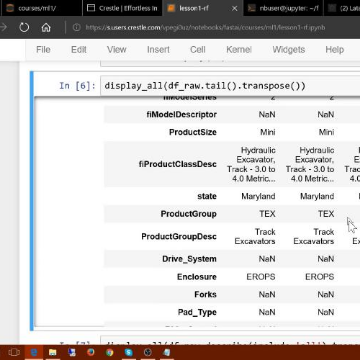

Deep Learning For Coders—36 hours of lessons for free

Deep Learning For Coders—36 hours of lessons for free

http://course.fast.ai/ml

fast.ai's practical deep learning MOOC for coders. Learn CNNs, RNNs, computer vision, NLP, recommendation systems, pytorch, time series, and much more