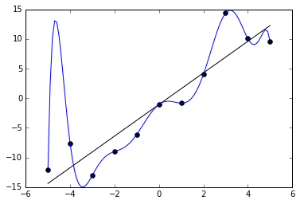
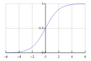

Deep Learning for Beginners

# Deep Learning for Beginners

Notes for "Deep Learning" by Ian Goodfellow, Yoshua Bengio, and Aaron Courville.

## Machine Learning

- Machine learning is a branch of statistics that uses samples to approximate functions.
    - We have a true underlying function or distribution that generates data, but we don't know what it is.
    - We can sample this function, and these samples form our training data.
- Example image captioning:
    - Function: f⋆(image)→descriptionf⋆(image)→description.
    - Samples: data∈(image,description)data∈(image,description).
    - Note: since there are many valid descriptions, the description is a distribution in text space: description∼Textdescription∼Text.
- The goal of machine is to find models that:
    - Have enough representation power to closely approximate the true function.
    - Have an efficient algorithm that uses training data to find good approximations of the function.
    - And the approximation must generalize to return good outputs for unseen inputs.
- Possible applications of machine learning:
    - Convert inputs into another form - learn "information", extract it and express it. eg: image classification, image captioning.
    - Predict the missing or future values of a sequence - learn "causality", and predict it.
    - Synthesise similar outputs - learn "structure", and generate it.

## Generalization and Overfitting.

- Overfitting is when you find a good model of the training data, but this model doesn't generalize.
    - For example: a student who has memorized the answers to training tests will score well on a training test, but might scores badly on the final test.
- There are several tradeoffs:
    - Model representation capacity: a weak model cannot model the function but a powerful model is more prone to overfitting.
    - Training iterations: training too little doesn't give enough time to fit the function, training too much gives more time to overfit.
    - You need to find a middle ground between a weak model and an overfitted model.
- The standard technique is to do cross validation:
    - Set aside "test data" which is never trained upon.
    - After all training is complete, we run the model on the final test data.
    - You cannot tweak the model after the final test (of course you can gather more data).
    - If training the model happens in stages, you need to withhold test data for each stage.
- Deep learning is one branch of machine learning techniques. It is a powerful model that has also been successful at generalizing.

## Feedforward Networks

Feedforward networks represents y=f⋆(x)y=f⋆(x) with a function family:
u=f(x;θ)u=f(x;θ)

- θθ are the model parameters. This could be thousands or millions of parameters θ1…θTθ1…θT.
- ff is a family of functions. f(x;θ)f(x;θ) is a single function of xx. uu is the output of the model.
- You can imagine if you chose a sufficiently general family of functions, chances are, one of them will resemble f⋆f⋆.
- For example: let the parameters represent a matrix and a vector:f(x⃗ ;θ)()=[θ0θ2θ1θ3]x⃗ +[θ4θ5]f(x→;θ)()=[θ0θ1θ2θ3]x→+[θ4θ5]

## Designing the Output Layer.

The most common output layer is:
f(x;M,b)=g(Mx+b)f(x;M,b)=g(Mx+b)

- The parameters in θθ are used as MM and bb.
- The linear part Mx+bMx+b ensures that your output depends on all inputs.
- The nonlinear part g(x)g(x) allows you to fit the distributon of yy.
- For example for input of photos, the output distribution could be:
    - Linear: y∈ℝy∈R. eg cuteness of the photo
    - Sigmoid: y∈[0,1]y∈[0,1]. eg probability its a cat
    - Softmax: y∈ℝCy∈RC and ∑y=1∑y=1. eg. probability its one of CC breeds of cats
- To ensure g(x)g(x) fits the distribution, you can use:
    - Linear: g(x)=xg(x)=x.
    - Sigmoid: g(x)=11+e−xg(x)=11+e−x.

    - Softmax: g(x)c=exc∑iexig(x)c=exc∑iexi.
- Softmax is actually under-constrained, and often x0x0 is set to 1. In this case sigmoid is just softmax in 2 variables.
- There is theory behind why these gg's are good choices, but there are many different choices.

## Finding θθ

Find θθ by solving the following optimization problem for JJ the cost function:
minθ∈modelsJ(y,f(x;θ))minθ∈modelsJ(y,f(x;θ))

- Deep learning is successful because there is a good family of algorithms to calculate minmin.
- That algorithms are all variations of gradient descent:

	theta = initial_random_values()
	loop {
	  xs = fetch_inputs()
	  ys = fetch_outputs()
	  us = model(theta)(xs)
	  cost = J(ys, us)
	  if cost < threshold: exit;
	  theta = theta - gradient(cost)
	}

- Intuitively, at every θθ you chose the direction that reduces the cost the most.
- This requires you to compute the gradient dcostdθtdcostdθt.
- You don't want the gradient to be near 00 because you learn too slowly or near infinf because it is not stable.
- This is a greedy algorithm, and thus might converge but into a local minimum.

## Choosing the Cost Function

- This cost function could be anything:
    - Sum of absolute errors: J=∑|y−u|J=∑|y−u|.
    - Sum of square errors: J=∑(y−u)2J=∑(y−u)2.
    - As long as the minimum occurs when the distributions are the same, in theory it would work.
- One good idea is that uu represents the parameters of the distribution of yy.
    - Rationale: often natural processes are fuzzy, and any input might have a range of outputs.
    - This approach also gives a smooth measure of how accurate we are.
    - The maximum likelihood principle says that: θML=argmaxθp(y;u)θML=arg⁡maxθp(y;u)
    - Thus we want to minimize: J=−p(y;u)J=−p(y;u)
    - For ii samples: J=−∏ip(yi;u)J=−∏ip(yi;u)
    - Taking log both sides: J′=−∑ilogp(yi;u)J′=−∑ilog⁡p(yi;u).
    - This is called cross-entropy.
- Applying the idea for: y∼Gaussian(center=u)y∼Gaussian(center=u):
    - p(y;u)=e−(y−u)2.p(y;u)=e−(y−u)2.
    - J=−∑loge−(y−u)2=∑(y−u)2J=−∑log⁡e−(y−u)2=∑(y−u)2
    - This motivates sum of squares as a good choice.

## Regularization

- Regularization techniques are methods that attempt to reduce generalization error.
    - It is not meant to improve the training error.
- Prefer smaller θθ values:
    - By adding some function of θθ into JJ we can encourage small parameters.
    - L2L2: J′=J+∑|θ|2J′=J+∑|θ|2
    - L1L1: J′=J+∑|θ|J′=J+∑|θ|
    - L0L0 is not smooth.
    - Note for θ→Mx+bθ→Mx+b usually only MM is added.
- Data augmentation:
    - Having more examples reduces overfitting.
    - Also consider generating valid new data from existing data.
    - Rotation, stretch existing images to make new images.
    - Injecting small noise into xx, into layers, into parameters.
- Multi-Task learning:
    - Share a layer between several different tasks.
    - The layer is forced to choose useful features that is relevant to a general set of tasks.
- Early stopping:
    - Keep a test data set, called the validation set, that is never trained on
    - Stop training when the cost on the validation set stops decreasing.
    - You need an extra test set to truly judge the the final.
- Parameter sharing:
    - If you know invariants about your data, encode that into your parameter choice.
    - For example: images are translationally invariant, so each small patch should have the same parameters.
- Dropout:
    - Randomly turn off some neurons in the layer.
    - Neurons learn to not take input data for granted.
- Adversarial:
    - Try to make the points near training points constant, by generating adversarial data near these points.

## Deep Feedforward Networks

Deep feedforward networks instead use:
u=f(x,θ)=fN(…f1(x;θ1)…;θN)u=f(x,θ)=fN(…f1(x;θ1)…;θN)

- This model has NN layers.
    - f1…fN−1f1…fN−1: hidden layers.
    - fNfN: output layer.
- A deep model sounds like a bad idea because it needs more parameters.
- In practise, it actually needs fewer parameters, and the models perform better (why?).
- One possible reason is that each layer learns higher and higher level features of the data.
- Residual models: f′n(x)=fn(x)+xn−1f′n(x)=fn(x)+xn−1.
    - Data can come from the past, we add on some more details to it.

## Designing Hidden Layers.

The most common hidden layer is:
fn(x)=g(Mx+b)fn(x)=g(Mx+b)

- The hidden layers have the same structure as the output layer.
- However the g(x)g(x) which work well for the output layer don't work well for the hidden layers.
- The simplest and most successful gg is the rectified linear unit (ReLU): g(x)=max(0,x)g(x)=max(0,x).
    - Compared to sigmoid, the gradients of ReLU does not approach zero when x is very big.
- Other common non-linear functions include:
- Modulated ReLU: g(x)=max(0,x)+αmin(0,x)g(x)=max(0,x)+αmin(0,x).
    - Where alpha is -1, very small, or a model parameter itself.
    - The intuition is that this function has a slope for x < 0.
    - In practise there is no absolute winner between this and ReLU.
- Maxout: g(x)i=maxj∈G(i)xjg(x)i=maxj∈G(i)xj
    - GG partitions the range [1..I][1..I] into subsets [1..m],[m+1..2m],[I−m..I][1..m],[m+1..2m],[I−m..I].
    - For comparison ReLU is ℝn→ℝnRn→Rn, and maxout is ℝn→ℝnmRn→Rnm.
    - It is the max of each bundle of mm inputs, think of it as mm piecewise linear sections.
- Linear: g(x)=xg(x)=x
    - After multiplying with the next layer up, it is equivalent to: fn(x)=g′(NMx+b′)fn(x)=g′(NMx+b′)
    - It's useful because you can use use narrow NN and MM, which has less parameters.

## Optimizaton Methods

- The methods we use is based on stochastic gradient descent:
    - Choose a subset of the training data (a minibatch), and calculate the gradient from that.
    - Benefit: does not depend on training set size, but on minibatch size.
- There are many ways to do gradient descent (using: gradient gg, learning rate ϵϵ, gradient update ΔΔ)
    - Gradient descent - use gradient: Δ=ϵgΔ=ϵg.
    - Momentum - use exponential decayed gradient: Δ=ϵ∑e−tgtΔ=ϵ∑e−tgt.
    - Adaptive learning rate where ϵ=ϵtϵ=ϵt:
        - AdaGrad - slow learning on gradient magnitude: ϵt=ϵδ+∑g2t√ϵt=ϵδ+∑gt2.
        - RMSProp - slow learning on exponentially decayed gradient magnitude: ϵt=ϵδ+∑e−tg2t√ϵt=ϵδ+∑e−tgt2.
        - Adam - complicated.
- Newton's method: it's hard to apply due to technical reasons.
- Batch normalization is a layer with the transform: y=mx−μσ+by=mx−μσ+b
    - mm and bb are learnable, while μμ and σσ are average and standard deviation.
    - This means that the layers can be fully independent (assume the distribution of the previous layer).
- Curriculum learning: provide easier things to learn first then mix harder things in.

## Simplifying the Network

- At this point, we have enough basis to design and optimize deep networks.
- However, these models are very general and large.
    - If your network has NN layers each with SS inputs/outputs, the parameter space is |θ|=O(NS2)|θ|=O(NS2).
    - This has two downsides: overfitting, and longer training time.
- There are many methods to reduce parameter space:
    - Find symmetries in the problem and choose layers that are invariant about the symmetry.
    - Create layers with lower output dimensionality, the network must summarize information into a more compact representation.

## Convolution Networks

A convolutional network simplifies some layers by using convolution instead of matrix multiply (denoted with a star):

fn(x)=g(θn∗x)fn(x)=g(θn∗x)

- It is used for data that is spatially distributed, and works for 1d, 2d and 3d data.
    - 1d: (θ∗x)i=∑aθaxi+a(θ∗x)i=∑aθaxi+a
    - 2d: (θ∗x)ij=∑a∑bθabxab+ij(θ∗x)ij=∑a∑bθabxab+ij
- It's slightly from the mathematical definition, but has the same idea: the output at each point is a weighted sum of nearby points.
- Benefits:
    - Captures the notion of locality, if θθ is zero, except in a window ww wide near i=0i=0.
    - Captures the notion of translation invariance, as the same θθ are used for each point.
    - Reduces the number of model parameters from O(S2)O(S2), to O(w2)O(w2).
- If there are nn layers of convolution, one base value will be able to influence the outputs in a wnwn radius.
- Practical considerations:
    - Pad the edges with 0, and how far to pad.
    - Tiled convolutions (you rotate between different convolutions).

## Pooling

A common layer used in unison with convnets is max pooling:
fn(x)i=maxj∈G(i)xjfn(x)i=maxj∈G(i)xj

- It is the same structure as maxout, and equivalent in 1d.
- For higher dimensions GG partitions the input space into tiles.
- This reduces the size of the input data, and can be considered as collapsing a local region of the inputs into a summary.
- It is also invariant to small translations.

## Recurrent Networks

Recurrent networks use previous outputs as inputs, forming a recurrence:
s(t)=f(s(t−1),x(t);θ)s(t)=f(s(t−1),x(t);θ)

- The state ss contains a summary of the past, while xx is the inputs that arrive at each step.
- It is a simpler model than a fully dynamic: s(t)=d(t)(x(t),...x(1);θ′)s(t)=d(t)(x(t),...x(1);θ′)
    - All the θθ's are shared across time - the recurrent network assumes time invariance.
    - A RNN can learn for any input length, while a fully dynamic model needs a different gg for each input length.
- Output: the model may return y(t)y(t) at each time step:
    - No output during steps, only the final state matters. Eg: sentiment analysis.
    - y(t)=s(t)y(t)=s(t), the model has no internal state and thus less powerful. But it is easier to train, since the training data yy is just ss.
    - y(t)=o(s(t))y(t)=o(s(t)), use an output layer to transform (and hide) the internal state. But training is more indirect and harder.
    - As always we prefer to think of yy as the parameters to a distribution.
- The output chosen may be fed back to ff as extra inputs. If not fed in, the yy are conditionally independent of each other.
    - When generating a sentence, we need conditional dependence between words, eg: A-A and B-B might be valid, but A-B might be invalid.
- Completion:
    - Finish when input ends. This works for x(t)→y(t)x(t)→y(t).
    - Extra output y(t)endyend(t) with the probability the output has completed.
    - Extra output y(t)lengthylength(t) with the length of output remaining/total.
- Optimization is done using the same gradient descent class of methods.
    - Gradients are calculated by expanding the recurrence to a flat formula, called back-propagation through time (BPTT).
- One difficult aspect of BPTT is the gradient Δ=∂∂stΔ=∂∂st:
    - Δ>0Δ>0: the state explodes, and provide unstable gradient. The solution is to clip the gradient updates to a reasonable size during descent.
    - Δ≈0Δ≈0: this allows the state to persist for a long time, howevr the gradient descent method needs a gradient to work.
    - Δ<0Δ<0: the RNN is in a constant state of information loss.
- There are variants of RNN that impose a simple prior to help preserve state s(t)≈s(t−1)s(t)≈s(t−1):
    - s(t)=fts(t−1)+f(...)s(t)=fts(t−1)+f(...): we get a direct first derivative ∂∂x∂∂x
    - It lets us pass along a gradient from previous steps, even when ff itself has zero gradient.
- Long short-term memory (LSTM) model input, output and forgetting:s(t)=fts(t−1)+itf(s(t−1),x(t);θ)s(t)=fts(t−1)+itf(s(t−1),x(t);θ)
    - The ouput is: y(t)=ots(t)y(t)=ots(t)
    - It uses probabilities (known as gates): otot output, ftft forgetting, itit input.
    - The gates are usually a sigmoid layer: ot=g(Mx+b)=11+eMx+bot=g(Mx+b)=11+eMx+b.
    - Long term information is preserved, because generating new data gg and using it ii are decoupled.
    - Gradients are preserved more as there is a direct connection between the past and future.
- Gated recurrent unit (GRU) are a simpler model:s(t)=(1−ut)s(t−1)+utf(rts(t−1),x(t);θ)s(t)=(1−ut)s(t−1)+utf(rts(t−1),x(t);θ)
    - The gates: utut update, rtrt reset.
    - There is no clear winner.
- For dropout, prefer d(f(s,x;θ))d(f(s,x;θ)) not storing information, over d(s)d(s) losing information.
- Memory Networks and attention mechanisms.

## Useful Data Sets

- There are broad categories of input data, the applications are limitless.
- Images vector [0−1]WH[0−1]WH: image to label, image to description.
- Audio vector for each time slice: speech to text.
- Text embed each word into vector [0−1]N[0−1]N: translation.
- Knowledge Graphs: question answering.

## Autoencoders

An autoencoder has two functions, which encode ff and decode gg from input space to representation space. The objective is:

J=L(x,g(f(x)))J=L(x,g(f(x)))

- LL is the loss function, and is low when images are similar.
- The idea is that the representation space learns important features.
- To prevent overfitting we have some additional regularization tools:
    - Sparse autoencoders minimize: J′=J+S(f(x))J′=J+S(f(x)). This is a regularizer on representation space.
    - Denoising autoencoders minimize: J=L(x,g(f(n(x))))J=L(x,g(f(n(x)))), where nn adds noise. This forces the network to differentiate noise from signal.
    - Contractive autoencoders minimize: J′=J+∑∂f∂xJ′=J+∑∂f∂x. This forces the encoder to be smooth: similar inputs get similar outputs.
    - Predictive autoencoders: J=L(x,g(h))+L′(h,f(x))J=L(x,g(h))+L′(h,f(x)). Instead of optimizing gg and hh simultaneously, optimize them alternately.
- Another solution is to train a discriminator network DD which outputs a scalar representing the probability the input is generated.

## Representation Learning

The idea is that instead of optimizing u=f(x;θ)u=f(x;θ), we optimize:
u=ro(f(ri(x);θ))u=ro(f(ri(x);θ))

- riri and roro are the input and output representations, but the idea can apply to CNN, RNN and other models.
    - For example the encoder half of an autoencoder can be used to represent the input riri.
- The hope is that there are other representations that make the task easier.
- These representations can be trained on large amounts of data and understand the base data.
- For example: words is a very sparse input vector (all zeros, with one active).
    - There are semantic representations of words that is easier to work with.

## Practical Advice

- Have a good measure of your success.
- Build a working model as soon as possible.
- Instrument and iterate from data.

## Appendix: Probability

- Probability is a useful tool because it allows us to model:
    - Randomness: truely random system (quantum etc).
    - Hidden variables: deterministic, but we can't see all the critical factors.
    - Incomplete models: especially relevant in chaotic systems that are sensitive to small perturbations.
- It is useful for reading papers and more advanced machine learning, but not as critical for playing around with a network.
- Probability: P(x,y)P(x,y) means P(x=x,y=y)P(x=x,y=y).
- Marginal probability: P(x)=∑yP(x=x,y=y)P(x)=∑yP(x=x,y=y).
- Chain rule: P(x,y)=P(x|y)P(y)P(x,y)=P(x|y)P(y).
- If xx and yy are independent: P(x,y)=P(x)P(y)P(x,y)=P(x)P(y).
- Expectation: 𝔼x∼P[f(x)]=∑xP(x)f(x)Ex∼P[f(x)]=∑xP(x)f(x).
- Bayes rule: P(x|y)=P(x)P(y|x)P(y)=P(x)P(y|x)∑xP(x)P(y|x)P(x|y)=P(x)P(y|x)P(y)=P(x)P(y|x)∑xP(x)P(y|x).
- Self information: I(x)=−logP(x)I(x)=−log⁡P(x).
- Shannon entropy: H(x)=𝔼x∼P[I(x)]=−∑xP(x)logP(x)H(x)=Ex∼P[I(x)]=−∑xP(x)log⁡P(x).
- KL divergence: DKL(P||Q)=𝔼x∼P[logP(x)Q(x)]DKL(P||Q)=Ex∼P[log⁡P(x)Q(x)].
    - It is a measure of how similar distributions PP and QQ are (not true measure, not symmetric).
- Cross entropy: H(P,Q)=H(P)+DKL=−𝔼x∼PlogQ(x)H(P,Q)=H(P)+DKL=−Ex∼Plog⁡Q(x).
- Maximum likelihood:
    - For pp is data and qq is model:
    - θML=argmaxθQ(X;θ)θML=arg⁡maxθQ(X;θ).
    - Assuming iid and using log: θML=argmaxθ∑xlogQ(x;θ)θML=arg⁡maxθ∑xlog⁡Q(x;θ).
    - Since each data point is equally likely: θML=argmaxθH(P,Q;θ)θML=arg⁡maxθH(P,Q;θ).
    - The only component of KL that varies is the entropy: θML=argmaxθDKL(P||Q;θ)θML=arg⁡maxθDKL(P||Q;θ).
- Maximum a posteriori:
    - θMAP=argmaxθQ(θ|X)=argmaxθlogQ(X|θ)+logQ(θ)θMAP=arg⁡maxθQ(θ|X)=arg⁡maxθlog⁡Q(X|θ)+log⁡Q(θ).
    - This is like a regularizing term based on the prior of Q(θ)Q(θ).