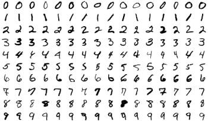

Deep learning could reveal why the world works the way it does

### [Artificial Intelligence](https://www.technologyreview.com/artificial-intelligence/) / [Machine Learning](https://www.technologyreview.com/artificial-intelligence/machine-learning/)

# Deep learning could reveal why the world works the way it does

## At a major AI research conference, one researcher laid out how existing AI techniques might be used to analyze causal relationships in data.

by [Karen Hao](https://www.technologyreview.com/profile/karen-hao/)
May 8, 2019

This week, the AI research community has gathered in New Orleans for the [International Conference on Learning Representations](https://iclr.cc/) (ICLR, pronounced “eye-clear”), one of its major annual conferences. There are over 3,000 attendees and 1,500 paper submissions, making it one of the most important forums for exchanging new ideas within the field.

This year the talks and accepted papers are heavily focused on tackling four major challenges in deep learning: fairness, security, generalizability, and causality. If you’ve been following along with MIT Technology Review’s coverage, you’ll recognize the first three. We’ve talked about how machine-learning algorithms in their current state are [biased](https://www.technologyreview.com/s/612876/this-is-how-ai-bias-really-happensand-why-its-so-hard-to-fix/), susceptible to [adversarial attacks](https://www.technologyreview.com/s/613170/emtech-digital-dawn-song-adversarial-machine-learning/), and [incredibly limited](https://www.technologyreview.com/s/612437/what-is-machine-learning-we-drew-you-another-flowchart/) in their ability to generalize the patterns they find in a training data set for multiple applications. Now the research community is busy trying to make the technology sophisticated enough to mitigate these weaknesses.

![](data:image/svg+xml,%3csvg xmlns='http://www.w3.org/2000/svg' viewBox='0 0 58 60.1' class='jsx-3449101280 js-evernote-checked' data-evernote-id='528'%3e%3cg class='jsx-3449101280 js-evernote-checked' data-evernote-id='529'%3e%3cg class='jsx-3449101280 js-evernote-checked' data-evernote-id='530'%3e%3cg class='jsx-3449101280 js-evernote-checked' data-evernote-id='531'%3e%3cg class='jsx-3449101280 js-evernote-checked' data-evernote-id='532'%3e%3cg class='jsx-3449101280 js-evernote-checked' data-evernote-id='533'%3e%3cpolyline points='42.6%2c18.5 55.9%2c58.6 43.3%2c58.6 39.7%2c49.6 18.9%2c49.6 15.4%2c58.6 2.1%2c58.6 6.7%2c46.2' class='jsx-3449101280 st0 js-evernote-checked' data-evernote-id='534'%3e%3c/polyline%3e%3cg class='jsx-3449101280 js-evernote-checked' data-evernote-id='535'%3e%3cpath d='M38.9%2c19.9c-0.7-2.1%2c0.4-4.3%2c2.5-5c2.1-0.7%2c4.3%2c0.4%2c5%2c2.5c0.7%2c2.1-0.4%2c4.3-2.5%2c5 C41.8%2c23.1%2c39.6%2c22%2c38.9%2c19.9z' class='jsx-3449101280 st1 js-evernote-checked' data-evernote-id='536'%3e%3c/path%3e%3c/g%3e%3cg class='jsx-3449101280 js-evernote-checked' data-evernote-id='537'%3e%3cpath d='M10.3%2c47.7c0.7-2-0.3-4.3-2.4-5.1c-2-0.7-4.3%2c0.3-5.1%2c2.4c-0.7%2c2%2c0.3%2c4.3%2c2.4%2c5.1 C7.3%2c50.8%2c9.6%2c49.8%2c10.3%2c47.7z' class='jsx-3449101280 st1 js-evernote-checked' data-evernote-id='538'%3e%3c/path%3e%3c/g%3e%3c/g%3e%3c/g%3e%3c/g%3e%3cg class='jsx-3449101280 js-evernote-checked' data-evernote-id='539'%3e%3cg class='jsx-3449101280 js-evernote-checked' data-evernote-id='540'%3e%3cpolyline points='37.4%2c39.6 29.9%2c12.5 29.7%2c12.5 22.3%2c38.4 29%2c38.4' class='jsx-3449101280 st0 js-evernote-checked' data-evernote-id='541'%3e%3c/polyline%3e%3cg class='jsx-3449101280 js-evernote-checked' data-evernote-id='542'%3e%3cpath d='M41.1%2c38.3c0.6%2c2.1-0.7%2c4.3-2.8%2c4.9s-4.3-0.7-4.9-2.8c-0.6-2.1%2c0.7-4.3%2c2.8-4.9 C38.4%2c35%2c40.5%2c36.2%2c41.1%2c38.3z' class='jsx-3449101280 st1 js-evernote-checked' data-evernote-id='543'%3e%3c/path%3e%3c/g%3e%3c/g%3e%3c/g%3e%3cg class='jsx-3449101280 js-evernote-checked' data-evernote-id='544'%3e%3cg class='jsx-3449101280 js-evernote-checked' data-evernote-id='545'%3e%3cpolyline points='10.8%2c34.3 22.6%2c1.5 36.2%2c1.5 38.4%2c7.5' class='jsx-3449101280 st0 js-evernote-checked' data-evernote-id='546'%3e%3c/polyline%3e%3cg class='jsx-3449101280 js-evernote-checked' data-evernote-id='547'%3e%3cpath d='M14.5%2c35.5c-0.7%2c2.1-3%2c3.1-5.1%2c2.4c-2.1-0.7-3.1-3-2.4-5.1c0.7-2.1%2c3-3.1%2c5.1-2.4 C14.2%2c31.2%2c15.3%2c33.4%2c14.5%2c35.5z' class='jsx-3449101280 st1 js-evernote-checked' data-evernote-id='548'%3e%3c/path%3e%3c/g%3e%3cg class='jsx-3449101280 js-evernote-checked' data-evernote-id='549'%3e%3cpath d='M34.6%2c8.6c0.7%2c2.1%2c3%2c3.1%2c5.1%2c2.4c2.1-0.7%2c3.1-3%2c2.4-5.1c-0.7-2.1-3-3.1-5.1-2.4 C34.9%2c4.3%2c33.9%2c6.6%2c34.6%2c8.6z' class='jsx-3449101280 st1 js-evernote-checked' data-evernote-id='550'%3e%3c/path%3e%3c/g%3e%3c/g%3e%3c/g%3e%3c/g%3e%3c/g%3e%3c/svg%3e)

#### Sign up for **The Algorithm** — artificial intelligence, demystified

Also stay updated on MIT Technology Review initiatives and events?
YesNo

What we haven’t talked about much is the final challenge: causality. This is something researchers have puzzled over for some time. Machine learning is great at [finding](https://www.technologyreview.com/s/612775/algorithms-criminal-justice-ai/)[*correlations*](https://www.technologyreview.com/s/612775/algorithms-criminal-justice-ai/) in data, but can it ever figure out *causation*? Such an achievement would be a huge milestone: if algorithms could help us shed light on the causes and effects of different phenomena in complex systems, they would deepen our understanding of the world and unlock more powerful tools to influence it.

On Monday, to a packed room, acclaimed researcher Léon Bottou, now at Facebook’s AI research unit and New York University, laid out a new framework that he's been working on with collaborators for how we might get there. Here’s my summary of his talk. You can also watch it in full below, beginning around 12:00.

Posted by [ICLR](https://www.facebook.com/iclr.cc/videos)
14,427 Views

[Share](https://www.facebook.com/sharer/sharer.php?u=https%3A%2F%2Fwww.facebook.com%2Ficlr.cc%2Fvideos%2F534780673594799%2F&display=popup&ref=plugin&src=video)

-1:40:36

HD
[**Open in a new tab](https://www.facebook.com/iclr.cc/videos/534780673594799/)

Posted by [ICLR](https://www.facebook.com/iclr.cc/videos)
14,427 Views

### **Idea #1**

Sample images from the MNIST dataset.
Wikipedia

Let’s begin with Bottou and his team's first big idea: a new way of thinking about causality. Say you want to build a computer vision system that recognizes handwritten numbers. (This is a [classic introductory problem](http://yann.lecun.com/exdb/mnist/) that uses the widely available “MNIST” data set pictured above.) You’d train a neural network on tons of images of handwritten numbers, each labeled with the number they represent, and end up with a pretty decent system for recognizing new ones it had never seen before.

But let’s say your training data set is slightly modified and each of the handwritten numbers also has a color—red or green—associated with it. Suspend your disbelief for a moment and imagine that you don't know whether the color or the shape of the markings is a better predictor for the digit. The standard practice today is to simply label each piece of training data with both features and feed them into the neural network for it to decide.

Samples from a colored MNIST dataset.
Léon Bottou

Here’s where things get interesting. The “colored MNIST” data set is purposely misleading. Back in the real world we know that the color of the markings is completely irrelevant, but in this particular data set, the color is in fact a stronger predictor for the digit than its shape. So our neural network learns to use color as the primary predictor. That’s fine when we then use the network to recognize other handwritten numbers that follow the same coloring patterns. But performance completely tanks when we reverse the colors of the numbers. (When Bottou and his collaborators played out this thought experiment with real training data and a real neural network, they achieved 84.3% recognition accuracy in the former scenario and 10% accuracy in the latter.)

In other words, the neural network found what Bottou calls a “spurious correlation,” which makes it completely useless outside of the narrow context within which it was trained. In theory, if you could get rid of all the spurious correlations in a machine-learning model, you would be left with only the “invariant” ones—those that hold true regardless of context.

Invariance would in turn allow you to understand causality, explains Bottou. If you know the invariant properties of a system and know the intervention performed on a system, you should be able to infer the consequence of that intervention. For example, if you know that the shape of a handwritten digit always dictates its meaning, then you can infer that changing its shape (cause) would change its meaning (effect). Another example: if you know that all objects are subject to the law of gravity, then you can infer that when you let go of a ball (cause), it will fall to the ground (effect).

Obviously, these are simple cause-and-effect examples based on invariant properties we already know, but think how we could apply this idea to much more complex systems that we don’t yet understand. What if we could find the invariant properties of our economic systems, for example, so we could understand the effects of implementing [universal basic income](https://www.technologyreview.com/s/612640/universal-basic-income-had-a-rough-2018/)? Or the invariant properties of Earth’s climate system, so we could evaluate the impact of various geoengineering ploys?

### **Idea #2**

So how do we get rid of these spurious correlations? This is Bottou's team's second big idea. In current machine-learning practice, the default intuition is to amass as much diverse and representative data as possible into a single training set. But Bottou says this approach does a disservice. Different data that comes from different contexts—whether collected at different times, in different locations, or under different experimental conditions—should be preserved as separate sets rather than mixed and combined. When they are consolidated, as they are now, important contextual information gets lost, leading to a much higher likelihood of spurious correlations.

With multiple context-specific data sets, training a neural network is very different. The network can no longer find the correlations that only hold true in one single diverse training data set; it must find the correlations that are invariant across all the diverse data sets. And if those sets are selected smartly from a full spectrum of contexts, the final correlations should also closely match the invariant properties of the ground truth.

So let’s return to our simple colored MNIST example one more time. Drawing on their theory for finding invariant properties, Bottou and collaborators reran their original experiment. This time they used two colored MNIST data sets, each with different color patterns. They then trained their neural network to find the correlations that held true across both groups. When they tested this improved model on new numbers with the same and reversed color patterns, it achieved 70% recognition accuracy for both. The results proved that the neural network had learned to disregard color and focus on the markings' shapes alone.

Bottou says his team's work on these ideas is not done, and it will take the research community some time to test the techniques on problems more complicated than colored numbers. But the framework hints at the potential of deep learning to help us understand why things happen, and thus give us more control over our fates.' class='jsx-671803276 js-evernote-checked' data-evernote-id='622'%3e%3c/path%3e%3c/svg%3e)

Share

[**](https://www.facebook.com/dialog/share?app_id=140586622674265&display=popup&title=Deep%20learning%20could%20reveal%20why%20the%20world%20works%20the%20way%20it%20does&description=At%20a%20major%20AI%20research%20conference%2C%20one%20researcher%20laid%20out%20how%20existing%20AI%20techniques%20might%20be%20used%20to%20analyze%20causal%20relationships%20in%20data.&href=https%3A%2F%2Fwww.technologyreview.com%2Fs%2F613502%2Fdeep-learning-could-reveal-why-the-world-works-the-way-it-does%2F%3Futm_campaign%3Dsite_visitor.unpaid.engagement%26utm_source%3Dfacebook%26utm_medium%3Dsocial_share%26utm_content%3D2019-05-25)

[**](https://twitter.com/intent/tweet?text=Deep%20learning%20could%20reveal%20why%20the%20world%20works%20the%20way%20it%20does%20-%20via%20%40techreview&url=https%3A%2F%2Fwww.technologyreview.com%2Fs%2F613502%2Fdeep-learning-could-reveal-why-the-world-works-the-way-it-does%2F%3Futm_campaign%3Dsite_visitor.unpaid.engagement%26utm_source%3Dtwitter%26utm_medium%3Dsocial_share%26utm_content%3D2019-05-25)

[**](https://reddit.com/submit?text=Deep%20learning%20could%20reveal%20why%20the%20world%20works%20the%20way%20it%20does&url=https%3A%2F%2Fwww.technologyreview.com%2Fs%2F613502%2Fdeep-learning-could-reveal-why-the-world-works-the-way-it-does%2F%3Futm_campaign%3Dsite_visitor.unpaid.engagement%26utm_source%3Dreddit%26utm_medium%3Dsocial_share%26utm_content%3D2019-05-25)

[**](https://linkedin.com/shareArticle?text=Deep%20learning%20could%20reveal%20why%20the%20world%20works%20the%20way%20it%20does&url=https%3A%2F%2Fwww.technologyreview.com%2Fs%2F613502%2Fdeep-learning-could-reveal-why-the-world-works-the-way-it-does%2F%3Futm_campaign%3Dsite_visitor.unpaid.engagement%26utm_source%3Dlinkedin%26utm_medium%3Dsocial_share%26utm_content%3D2019-05-25&summary=At%20a%20major%20AI%20research%20conference%2C%20one%20researcher%20laid%20out%20how%20existing%20AI%20techniques%20might%20be%20used%20to%20analyze%20causal%20relationships%20in%20data.)

[**](https://api.whatsapp.com/send?text=Deep%20learning%20could%20reveal%20why%20the%20world%20works%20the%20way%20it%20does%20https%3A%2F%2Fwww.technologyreview.com%2Fs%2F613502%2Fdeep-learning-could-reveal-why-the-world-works-the-way-it-does%2F%3Futm_campaign%3Dsite_visitor.unpaid.engagement%26utm_source%3Dwhatsapp%26utm_medium%3Dsocial_share%26utm_content%3D2019-05-25)

[**](https://www.technologyreview.com/s/613502/deep-learning-could-reveal-why-the-world-works-the-way-it-does/mailto:?subject=Deep%20learning%20could%20reveal%20why%20the%20world%20works%20the%20way%20it%20does&body=From%20MIT%20Technology%20Review%3A%0A%0ADeep%20learning%20could%20reveal%20why%20the%20world%20works%20the%20way%20it%20does%0AAt%20a%20major%20AI%20research%20conference%2C%20one%20researcher%20laid%20out%20how%20existing%20AI%20techniques%20might%20be%20used%20to%20analyze%20causal%20relationships%20in%20data.%0A%0Ahttps%3A%2F%2Fwww.technologyreview.com%2Fs%2F613502%2Fdeep-learning-could-reveal-why-the-world-works-the-way-it-does%2F%3Futm_campaign%3Dsite_visitor.unpaid.engagement%26utm_source%3Demail%26utm_medium%3Dsocial_share%26utm_content%3D2019-05-25)

Link

Tagged[Deep Learning](https://www.technologyreview.com/g/deep-learning/), [Neural Networks](https://www.technologyreview.com/g/neural-networks/)

Author

[Karen Hao](https://www.technologyreview.com/profile/karen-hao/)Karen Hao is the artificial intelligence reporter for *MIT Technology Review*. In particular she covers the ethics and social impact of the technology as well as its applications for social good. She also writes the AI newsletter, the Algorithm, which thoughtfully examines the field’s latest news and research. Prior to joining the publication, she was a reporter and data scientist at Quartz and an application engineer at the first startup to spin out of Google X.