Deep learning has a size problem - Heartbeat

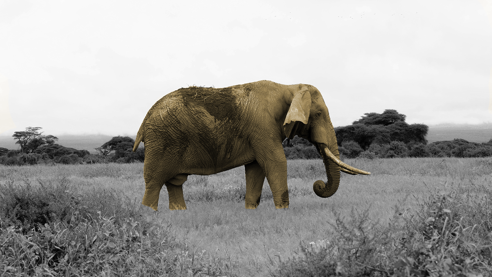

# Deep learning has a size problem

## Shifting from state-of-the-art accuracy to state-of-the-art efficiency

[Jameson Toole](https://heartbeat.fritz.ai/@jamesonthecrow?source=post_page-----ea601304cd8----------------------)

[Nov 5](https://heartbeat.fritz.ai/deep-learning-has-a-size-problem-ea601304cd8?source=post_page-----ea601304cd8----------------------) · 10 min read

> The following is an adaptation of two talks I recently gave at the O’Reilly AI Conference and DroidCon in London. > [> Slides are available](https://www.slideshare.net/jamesontoole/creating-smaller-faster-productionready-mobile-machine-learning-models)>  at the end of this post.

Earlier this year, researchers at [NVIDIA announced MegatronLM](https://nv-adlr.github.io/MegatronLM), a massive transformer model with 8.3 billion parameters (24 times larger than BERT) that achieved state-of-the-art performance on a variety of language tasks. While this was an undoubtedly impressive technical achievement, I couldn’t help but ask myself: is deep learning going in the right direction?

The parameters alone weigh in at just over 33 GB on disk. Training the final model took 512 V100 GPUs running continuously for 9.2 days. Given the power requirements per card, a back of the envelope estimate put the amount of energy used to train this model at over 3X the yearly energy consumption of the average American.

I don’t mean to single out this particular project. There are [many examples](https://medium.com/syncedreview/the-staggering-cost-of-training-sota-ai-models-e329e80fa82) of [massive models](https://ai.googleblog.com/2019/10/exploring-massively-multilingual.html)  [being trained](https://github.com/facebookresearch/FixRes) to achieve ever-so-slightly higher accuracy on various benchmarks. Despite being 24X larger than BERT, MegatronLM is only 34% better at its language modeling task. As a one-off experiment to demonstrate the performance of new hardware, there isn’t much harm here. But in the long term, this trend is [going to cause a few problems](https://www.technologyreview.com/s/613630/training-a-single-ai-model-can-emit-as-much-carbon-as-five-cars-in-their-lifetimes/).

First, it hinders democratization. If we believe in a world where millions of engineers are going to use deep learning to make every application and device better, we won’t get there with massive models that take large amounts of time and money to train.

Second, it restricts scale. There are probably less than 100 million processors in every public and private cloud in the world. But there are already 3 billion mobile phones, 12 billion IoT devices, and 150 billion micro-controllers out there. In the long term, it’s these small, low power devices that will consume the most deep learning, and massive models simply won’t be an option.

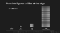
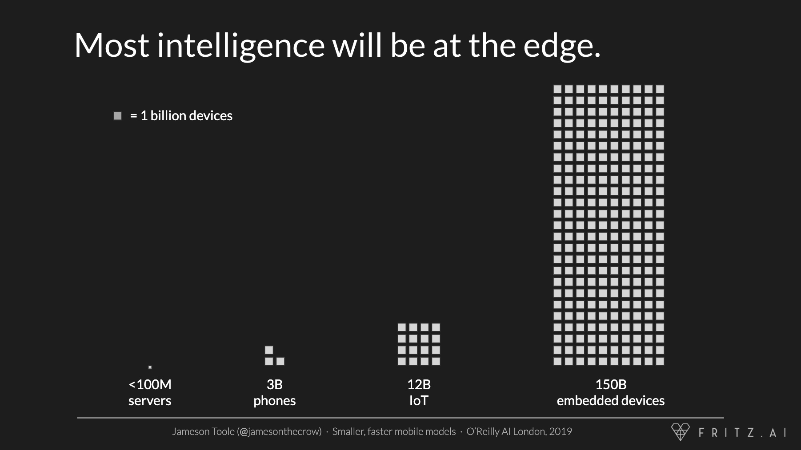

To make sure deep learning lives up to its promise, we need to re-orient research away from state-of-the-art accuracy and towards state-of-the-art efficiency. We need to ask if models enable the largest number of people to iterate as fast as possible using the fewest amount of resources on the most devices.

The good news is that work is being done to make deep learning models smaller, faster, and more efficient. Early returns are incredible. Take, for example, one result from [a 2015 paper by Han et al](https://arxiv.org/abs/1510.00149).

“On the ImageNet dataset, our method reduced the storage required by AlexNet by 35x, from 240MB to 6.9MB, without loss of accuracy. Our method reduced the size of VGG-16 by 49x from 552MB to 11.3MB, again with no loss of accuracy.”

To achieve results like this, we have to consider the entire machine learning lifecycle—from model selection to training to deployment. For the rest of this article, we’ll dive into those phases and look at ways to make smaller, faster, more efficient models.

* * *

*...*

> Machine learning models are moving closer and closer to edge devices. Fritz AI is here to help with this transition. > [> Explore our suite of developer tools that makes it easy to teach devices to see, hear, sense, and think.](https://www.fritz.ai/product/premium.html?utm_campaign=buildmodels4&utm_source=heartbeat)

* * *

*...*

# **Model Selection**

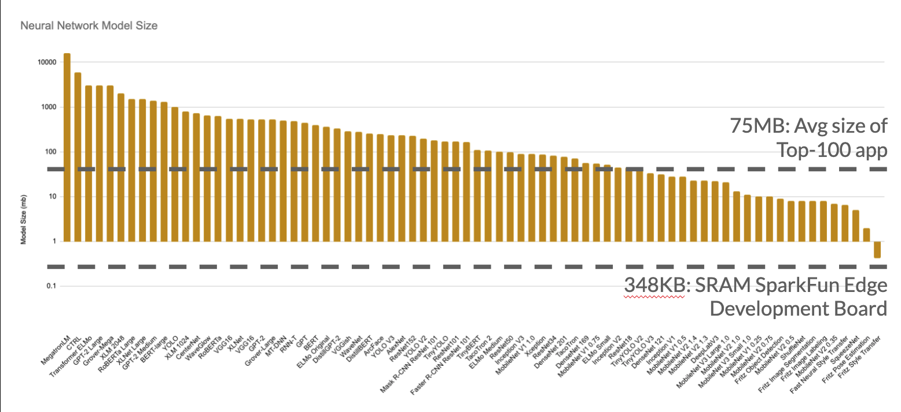

The best way to end up with a smaller, more efficient model is to start with one. The graph above plots the rough size (in megabytes) of various model architectures. I’ve overlaid lines denoting the typical size of mobile applications (code and assets included), as well as the amount of SRAM that might be available in an embedded device.

The logarithmic scale on the Y-axis softens the visual blow, but the unfortunate truth is that the majority of model architectures are orders of magnitude too large for deployment anywhere but the larger corners of a datacenter.

Incredibly, the smaller architectures to the right [don’t perform much worse than the large ones](https://medium.com/@culurciello/analysis-of-deep-neural-networks-dcf398e71aae) to the left. An architecture like VGG-16 (300–500MB) performs about as well as a MobileNet (20MB) model, despite being nearly 25X smaller.

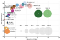
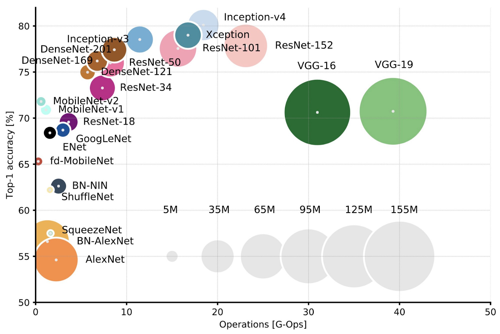

What makes smaller architectures like MobileNet and SqueezeNet so efficient? Based on experiments by [Iandola et al](https://arxiv.org/abs/1602.07360) (SqueezeNet), [Howard et al](https://arxiv.org/abs/1905.02244) (MobileNetV3), and [Chen et al](https://arxiv.org/abs/1706.05587) (DeepLab V3), some answers lie in the macro- and micro-architectures of models.

Macro-architecture refers the types of layers used by a model and how they are arranged into modules and blocks. To produce efficient macro-architectures:

- Keep activation maps large by downsampling later or using atrous (dilated) convolutions
- Use more channels, but fewer layers
- Use skip connections and residual connections to improve accuracy and re-use parameters during calculation
- Replace standard convolutions with [depthwise separable ones](https://heartbeat.fritz.ai/building-an-image-recognition-model-for-mobile-using-depthwise-convolutions-643d70e0f7e2)

A model’s micro-architecture is defined by choices related to individual layers. Best practices include:

- Making input and output blocks as efficient as possible, as they are typically 15–25% of a model’s computation cost
- Decreasing the size of convolution kernels
- Adding a width multiplier to control the number of channels per convolution with a hyperparameter, alpha
- Arranging layers so that parameters can be fused (e.g. bias and batch normalization)

# **Model Training**

After a model architecture has been selected, there’s still a lot that can be done to shrink it and make it more efficient during training. In case it wasn’t already obvious, most neural networks are over-parameterized. Many trained weights have little impact on overall accuracy and can be removed. [Frankle et al](https://arxiv.org/abs/1803.03635) find that in many networks, 80–90% of network weights can be removed — along with most of the precision in those weights — with little loss in accuracy.

There are three main strategies for finding and removing these parameters: knowledge distillation, pruning, and quantization. They can be applied together or separately.

## **Knowledge Distillation**

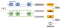
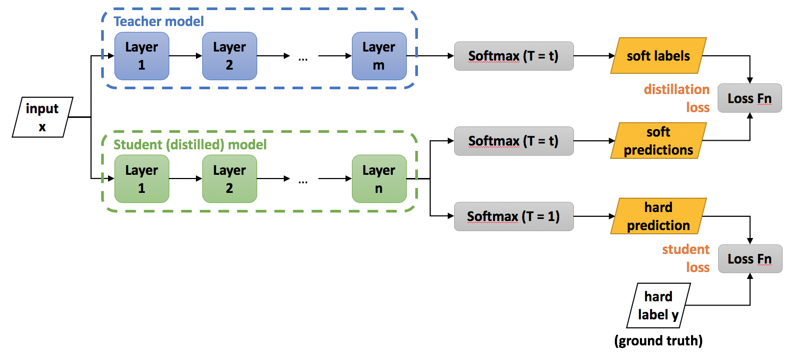

Knowledge distillation uses a larger “teacher” model to train a smaller “student” model. [First conceived by Hinton et al in 2015](https://arxiv.org/abs/1503.02531), the keys to this technique are two loss terms: one for the hard predictions of the student model and a second based on the ability of the student to produce the same distribution of scores across all output classes.

[Polino et al](https://arxiv.org/abs/1802.05668v1) were able to achieve a 46X reduction in size for ResNet models trained on CIFAR10 with only 10% loss in accuracy, and a 2X reduction in size on ImageNet with only a 2% loss in accuracy. More recently, [Jiao et al](https://arxiv.org/abs/1909.10351v2) distilled BERT to create TinyBERT: 7.5X smaller, 9.4X faster, and only 3% less accurate. There are a few great open source libraries with implementations of distillation frameworks including [Distiller](https://github.com/NervanaSystems/distiller) and [Distil* for transformers](https://github.com/huggingface/transformers/tree/master/examples/distillation).

## **Pruning**

The second technique to shrink models is pruning. Pruning involves assessing the importance of weights in a model and removing those that contribute the least to overall model accuracy. Pruning can be done at multiple scales in a network. The smallest models are achieved by pruning at the individual weight level. Weights with small magnitudes are set to zero. When models are compressed or stored in a sparse format, these zeros are very efficient to store.

[Han et al](https://arxiv.org/abs/1506.02626) use this approach to shrink common computer vision architectures by 9–13X with negligible changes in accuracy. Unfortunately, a lack of support for fast sparse matrix operations means that weight-level pruning doesn’t also increase runtime speeds.

To create models that are both smaller and faster, pruning needs to be done at filter or layer levels—for example, removing the filters of a convolution layer that contribute least to overall prediction accuracy. Models pruned at the filter level aren’t quite as small but are typically faster. [Li et al](https://arxiv.org/abs/1608.08710)were able to reduce the size and runtime of a VGG model by 34% with no loss in accuracy using this technique.

Finally, it’s worth noting that [Liu et al](https://arxiv.org/abs/1810.05270v2) have shown mixed results as to whether it’s better to start from a larger model and prune or train a smaller model from scratch.

## **Quantization**

[K1PuSPCL2PLPV7](../_resources/ac8e3bcc1785f57ed31112101444422e.png)
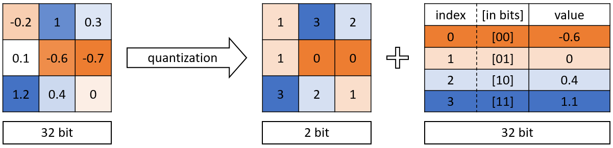

[source](https://medium.com/@kaustavtamuly/compressing-and-accelerating-high-dimensional-neural-networks-6b501983c0c8)

After a model has been trained, it needs to be prepared for deployment. Here, too, there are techniques to squeeze even more optimizations out of a model. Typically, the weights of a models are stored as 32-bit floating point numbers, but for most applications, this is far more precision than necessary. We can save space and (sometimes) time by quantizing these weights, again with minimal impact on accuracy.

Quantization maps each floating point weight to a fixed precision integer containing fewer bits than the original. While there are a number of quantization techniques, the two most important factors are the bit depth of the final model and whether weights are quantized during or after training (quantization-aware training and post-training quantization, respectively).

Finally, it’s important to quantize both weights and activations to speed up model runtime. Activation functions are mathematical operations that will naturally produce floating point numbers. If these functions aren’t modified to produce quantized outputs, models can even run slower due to the necessary conversion.

In a fantastic review, [Krishnamoorthi](https://arxiv.org/abs/1806.08342) tests a number of quantization schemes and configurations to provide a set of best practices:

**Results**:

- Post-training can generally be applied down to 8 bits, resulting in 4X smaller models with <2% accuracy loss
- Training-aware quantization allows a reduction of bit depth to 4 or 2 bits (8–16X smaller models) with minimal accuracy loss
- Quantizing weights and activations can result in a 2–3X speed increase on CPUs

* * *

*...*

> Deep learning — for experts, by experts. > [> We’re using our decades of experience to deliver the best deep learning resources to your inbox each week.](https://www.deeplearningweekly.com/newsletter?utm_campaign=dlweekly-newsletter-expertise4&utm_source=heartbeat)

* * *

*...*

# **Deployment**

A common thread among these techniques is that they generate a continuum of models, each with different shapes, sizes, and accuracies. While this creates a bit of a management and organization problem, it maps nicely onto the wide variety of hardware and software conditions models will face in the wild.

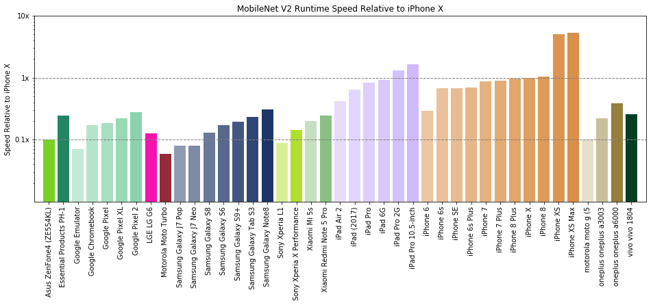

The graph above shows the runtime speed of a MobileNetV2 model across various smartphones. There can be an 80X speed difference between the lowest and highest end devices. In order to deliver users a consistent experience, it’s important to put the right model on the right device. This means training multiple models and deploying them to different devices based on available resources.

Typically, the best on-device performance is achieved by:

- Using native formats and frameworks (e.g Core ML on iOS and TFLite on Android)
- Leveraging any available accelerators like GPUs or DSPs by using supported operations only
- Monitoring performance across devices, identifying model bottlenecks, and iterating architectures for specific hardware

Of course, monitoring and managing different versions of all of your models isn’t always easy, but that’s exactly why we built [Fritz AI](https://www.fritz.ai/).

# **Putting it all together**

By applying these techniques, it’s possible to shrink and speed up most models by at least an order of magnitude. To quote just a few papers discussed thus far:

- “TinyBERT is empirically effective and achieves comparable results with BERT in GLUE datasets, while being 7.5x smaller and 9.4x faster on inference.” — [Jiao et al](https://arxiv.org/abs/1909.10351)
- “Our method reduced the size of VGG-16 by 49x from 552MB to 11.3MB, again with no loss of accuracy.” — [Han et al](https://arxiv.org/abs/1510.00149v5)
- “The model itself takes up less than 20KB of Flash storage space … and it only needs 30KB of RAM to operate.” — [Peter Warden at TensorFlow Dev Summit 2019](https://petewarden.com/2019/03/07/launching-tensorflow-lite-for-microcontrollers/)

To prove that it can be done by mere mortals, I took the liberty of [creating a tiny 17KB style transfer model](https://heartbeat.fritz.ai/creating-a-17kb-style-transfer-model-with-layer-pruning-and-quantization-864d7cc53693) that contains just 11,686 parameters, yet still produces results that look as good as a 1.6 million parameter model.

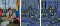
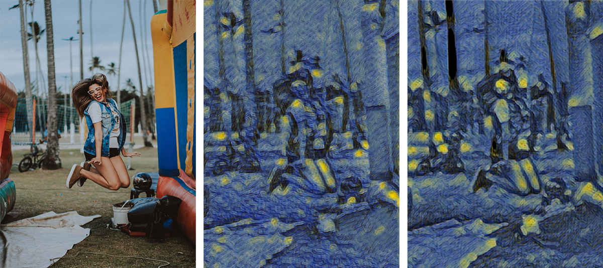

Left: Original image. Middle: Stylized image from the our small, 17KB model. Right: Stylized Image from the larger 7MB model.

I am consistently floored that results like this are easily achievable, yet aren’t done as a standard process in every paper. If we don’t change our practices, I worry we’ll waste time, money, and resources, while failing to bring deep learning to applications and devices that could benefit from it.

The good news, though, is that the marginal benefits of bigger models seem to be falling, and thanks to the techniques outlined here, we can make optimizations to size and speed that don’t sacrifice much accuracy. We can have our cake and eat it, too.

# **Some open questions about what’s next**

Thus far, I believe we’ve only scratched the surface of what’s possible in terms of model optimization. With more research and experimentation, I think it’s possible to go even further. To that end, here are some areas that I think are ripe for additional work:

- Better framework support for quantized operations and quantized-aware training
- A more rigorous study of model optimization vs task complexity
- Additional work to determine the usefulness of [platform-aware neural architecture search](https://arxiv.org/abs/1807.11626)
- Continued investment in a multi-level intermediate representation ([MLIR](https://ai.google/research/pubs/pub48035))

# Additional Resources

- [Distiller](https://github.com/NervanaSystems/distiller) — A library for optimizing PyTorch models
- [TensorFlow Model Optimization Toolkit](https://www.tensorflow.org/model_optimization)
- [Keras Tuner](https://github.com/keras-team/keras-tuner) — Hyperparameter optimization for Keras
- [TinyML](https://tinymlsummit.org/#home) — Group dedicated to embedded ML

 translateX(-35px)%3b transform: translateY(-35px) translateX(-35px)%3b %7d use%5b*%7chref='%23loader'%5d%5bdata-color='blue'%5d%7b color: %2300A0DC%3b %7d use%5b*%7chref='%23loader'%5d%5bdata-color='dark-gray'%5d%7b color: %23434649%3b %7d use%5b*%7chref='%23loader'%5d%5bdata-color='light-gray'%5d%7b color: %23A0A3A6%3b %7d use%5b*%7chref='%23loader'%5d%5bdata-size='small'%5d%7b stroke-width: 8px%3b -webkit-transform: translateY(-20px) translateX(-20px)%3b transform: translateY(-20px) translateX(-20px)%3b %7d %3c/style%3e %3csymbol id='loader' preserveAspectRatio='xMinYMin meet' x='50%25' y='50%25' width='71px' height='71px'%3e %3crect style='stroke: currentColor%3b' x='11px' y='11px' rx='7.50265' width='50px' height='50px' id='loader-icon' stroke-miterlimit='10' transform='rotate(136.936 35 35) scale(0.940189 0.940189) translate(2.0934 2.0934)' data-evernote-id='215' class='js-evernote-checked'%3e %3canimate attributeName='rx' attributeType='XML' from='25' to='2' values='25%3b 2%3b 25%3b 25' keyTimes='0%3b .4%3b .8%3b 1' keySplines='0 0 .5 1%3b.5 0 1 1%3b.5 0 1 1' begin='0s' dur='1.8s' repeatCount='indefinite' calcMode='spline'%3e%3c/animate%3e %3canimate attributeName='stroke-dashoffset' from='600' to='200' values='600%3b 400%3b 200%3b 200%3b' keyTimes='0%3b.4%3b .8%3b 1' keySplines='0 0 .5 1%3b.5 0 1 1%3b.5 0 1 1' begin='0s' dur='1.8s' repeatCount='indefinite' calcMode='spline'%3e%3c/animate%3e %3canimateTransform attributeName='transform' attributeType='XML' type='rotate' from='0 35 35' to='360 35 35' values='0 35 35%3b 180 35 35%3b 360 35 35%3b 360 35 35' keyTimes='0%3b .4%3b .8%3b 1' keySplines='0 0 .5 1%3b.5 0 1 1%3b.5 0 1 1' begin='0s' dur='1.8s' repeatCount='indefinite' calcMode='spline' additive='sum'%3e%3c/animateTransform%3e %3canimateTransform attributeName='transform' attributeType='XML' type='scale' from='0.75' to='1' values='0.75%3b 1%3b 0.75%3b 0.75' keyTimes='0%3b .4%3b .8%3b 1' keySplines='0 0 .5 1%3b.5 0 1 1%3b.5 0 1 1' begin='0s' dur='1.8s' repeatCount='indefinite' calcMode='spline' additive='sum'%3e%3c/animateTransform%3e %3canimateTransform attributeName='transform' attributeType='XML' type='translate' from='0 0' to='8.75 8.75' values='8.75 8.75%3b 0 0%3b 8.75 8.75%3b 8.75 8.75' keyTimes='0%3b .4%3b .8%3b 1' keySplines='0 0 .5 1%3b.5 0 1 1%3b.5 0 1 1' begin='0s' dur='1.8s' repeatCount='indefinite' calcMode='spline' additive='sum'%3e%3c/animateTransform%3e %3c/rect%3e %3cg style='transform: scale(.5)%3b'%3e %3crect style='stroke-opacity: 1%3b' x='11px' y='11px' rx='7.50265' width='50px' height='50px' id='loader-icon' stroke-miterlimit='10' transform='rotate(136.936 35 35) scale(0.940189 0.940189) translate(2.0934 2.0934)' data-evernote-id='216' class='js-evernote-checked'%3e %3canimate attributeName='rx' attributeType='XML' from='25' to='2' values='25%3b 2%3b 25%3b 25' keyTimes='0%3b .4%3b .8%3b 1' keySplines='0 0 .5 1%3b.5 0 1 1%3b.5 0 1 1' begin='0s' dur='1.8s' repeatCount='indefinite' calcMode='spline'%3e%3c/animate%3e %3canimate attributeName='stroke-dashoffset' from='600' to='200' values='600%3b 400%3b 200%3b 200%3b' keyTimes='0%3b.4%3b .8%3b 1' keySplines='0 0 .5 1%3b.5 0 1 1%3b.5 0 1 1' begin='0s' dur='1.8s' repeatCount='indefinite' calcMode='spline'%3e%3c/animate%3e %3canimateTransform attributeName='transform' attributeType='XML' type='rotate' from='0 35 35' to='360 35 35' values='0 35 35%3b 180 35 35%3b 360 35 35%3b 360 35 35' keyTimes='0%3b .4%3b .8%3b 1' keySplines='0 0 .5 1%3b.5 0 1 1%3b.5 0 1 1' begin='0s' dur='1.8s' repeatCount='indefinite' calcMode='spline' additive='sum'%3e%3c/animateTransform%3e %3canimateTransform attributeName='transform' attributeType='XML' type='scale' from='0.75' to='1' values='0.75%3b 1%3b 0.75%3b 0.75' keyTimes='0%3b .4%3b .8%3b 1' keySplines='0 0 .5 1%3b.5 0 1 1%3b.5 0 1 1' begin='0s' dur='1.8s' repeatCount='indefinite' calcMode='spline' additive='sum'%3e%3c/animateTransform%3e %3canimateTransform attributeName='transform' attributeType='XML' type='translate' from='0 0' to='8.75 8.75' values='8.75 8.75%3b 0 0%3b 8.75 8.75%3b 8.75 8.75' keyTimes='0%3b .4%3b .8%3b 1' keySplines='0 0 .5 1%3b.5 0 1 1%3b.5 0 1 1' begin='0s' dur='1.8s' repeatCount='indefinite' calcMode='spline' additive='sum'%3e%3c/animateTransform%3e %3c/rect%3e %3c/g%3e %3c/symbol%3e %3csymbol id='arrow-up-left-icon' preserveAspectRatio='xMinYMin meet' viewBox='0 0 24 24' x='0px' y='0px' width='24px' height='24px'%3e %3cg class='large-icon' style='fill: currentColor%3b'%3e %3cpath d='M20%2c18.6L7.4%2c6H17V4H6C5.4%2c4%2c4.9%2c4.2%2c4.6%2c4.6C4.2%2c4.9%2c4%2c5.4%2c4%2c6v11h2V7.4L18.6%2c20L20%2c18.6z'%3e%3c/path%3e %3c/g%3e %3cg class='small-icon' style='fill-opacity: 1%3b'%3e %3cpath d='M9.4%2c8H15V6H8C7.5%2c6%2c7%2c6.2%2c6.6%2c6.6C6.2%2c6.9%2c6%2c7.4%2c6%2c8l0%2c7h2V9.4l8.6%2c8.6l1.4-1.4L9.4%2c8z'%3e%3c/path%3e %3c/g%3e %3c/symbol%3e %3csymbol id='analytics-icon' preserveAspectRatio='xMinYMin meet' viewBox='0 0 24 24' x='0px' y='0px' width='24px' height='24px'%3e %3cg class='large-icon' style='fill: currentColor%3b'%3e %3cpath d='M5%2c19h16v2H5c-1.1%2c0-2-0.9-2-2V3h2V19z M20%2c3c-0.2%2c0-0.4%2c0.1-0.5%2c0.2L15%2c6l2.2%2c1.2l-2.7%2c4.9l-3.6-2c-0.2-0.1-0.4-0.1-0.7-0.1c-0.2%2c0.1-0.4%2c0.2-0.5%2c0.4l-3.1%2c5.8l1.5%2c0.8l2.7-5l3.6%2c2c0.2%2c0.1%2c0.4%2c0.1%2c0.6%2c0.1c0.2-0.1%2c0.4-0.2%2c0.5-0.4L18.7%2c8L21%2c9.2L21%2c4C21%2c3.4%2c20.5%2c3%2c20%2c3z'%3e%3c/path%3e %3c/g%3e %3cg class='small-icon' style='fill-opacity: 1%3b'%3e %3cpath d='M8%2c16h10v2H7c-0.6%2c0-1-0.4-1-1V6h2V16z M17.3%2c6c-0.1%2c0-0.3%2c0-0.4%2c0.1l-2.6%2c1.6l1.1%2c0.6l-1.5%2c2.9l-2.2-1.1C11.5%2c10%2c11.3%2c10%2c11.1%2c10c-0.2%2c0.1-0.4%2c0.2-0.5%2c0.4l-1.8%2c3.7l1.5%2c0.8l1.4-2.9l2.2%2c1.1c0.4%2c0.2%2c0.9%2c0%2c1.1-0.4l1.8-3.6L18%2c9.7l0-3C18%2c6.3%2c17.7%2c6%2c17.3%2c6z'%3e%3c/path%3e %3c/g%3e %3c/symbol%3e %3csymbol id='bell-icon' preserveAspectRatio='xMinYMin meet' viewBox='0 0 24 24' x='0px' y='0px' width='24px' height='24px'%3e %3cg class='large-icon' style='fill: currentColor%3b'%3e %3cpath d='M18%2c15V9c0-3.3-2.7-6-6-6S6%2c5.7%2c6%2c9v6c0%2c1.7-1.3%2c3-3%2c3v2h7c0%2c1.1%2c0.9%2c2%2c2%2c2s2-0.9%2c2-2h7v-2C19.3%2c18%2c18%2c16.7%2c18%2c15z M7%2c18c0.6-0.8%2c1-1.9%2c1-3V8.9c0-2.2%2c1.8-4%2c4-4s4%2c1.8%2c4%2c4V15c0%2c1.1%2c0.4%2c2.2%2c1%2c3H7z'%3e%3c/path%3e %3c/g%3e %3cg class='small-icon' style='fill-opacity: 1%3b'%3e %3cpath d='M16%2c13v-3c0-2.2-1.8-4-4-4s-4%2c1.8-4%2c4v3c0%2c1.1-0.9%2c2-2%2c2v2h4c0%2c1.1%2c0.9%2c2%2c2%2c2s2-0.9%2c2-2h4v-2C16.9%2c15%2c16%2c14.1%2c16%2c13z M9.2%2c15c0.5-0.5%2c0.8-1.3%2c0.8-2V9.9c0-1.1%2c0.9-2%2c2-2s2%2c0.9%2c2%2c2V13c0%2c0.7%2c0.3%2c1.5%2c0.8%2c2H9.2z'%3e%3c/path%3e %3c/g%3e %3c/symbol%3e %3csymbol id='block-icon' preserveAspectRatio='xMinYMin meet' viewBox='0 0 24 24' x='0px' y='0px' width='24px' height='24px'%3e %3cg class='large-icon' style='fill: currentColor%3b'%3e %3cpath d='M12%2c2C6.5%2c2%2c2%2c6.5%2c2%2c12c0%2c5.5%2c4.5%2c10%2c10%2c10c5.5%2c0%2c10-4.5%2c10-10C22%2c6.5%2c17.5%2c2%2c12%2c2z M3.8%2c12c0-4.5%2c3.7-8.2%2c8.2-8.2c2%2c0%2c3.7%2c0.7%2c5.2%2c1.8L5.6%2c17.2C4.5%2c15.7%2c3.8%2c14%2c3.8%2c12z M12%2c20.2c-2%2c0-3.7-0.7-5.2-1.8L18.4%2c6.8c1.1%2c1.4%2c1.8%2c3.2%2c1.8%2c5.2C20.2%2c16.5%2c16.5%2c20.2%2c12%2c20.2z'%3e%3c/path%3e %3c/g%3e %3cg class='small-icon' style='fill-opacity: 1%3b'%3e %3cpath d='M12%2c5c-3.9%2c0-7%2c3.1-7%2c7c0%2c3.9%2c3.1%2c7%2c7%2c7c3.9%2c0%2c7-3.1%2c7-7C19%2c8.1%2c15.9%2c5%2c12%2c5z M6.8%2c12c0-2.9%2c2.3-5.2%2c5.2-5.2c1.1%2c0%2c2.2%2c0.4%2c3%2c1L7.7%2c15C7.1%2c14.2%2c6.8%2c13.1%2c6.8%2c12z M12%2c17.2c-1.1%2c0-2.2-0.4-3-1L16.3%2c9c0.6%2c0.9%2c1%2c1.9%2c1%2c3C17.2%2c14.9%2c14.9%2c17.2%2c12%2c17.2z'%3e%3c/path%3e %3c/g%3e %3c/symbol%3e %3csymbol id='book-icon' preserveAspectRatio='xMinYMin meet' viewBox='0 0 24 24' x='0px' y='0px' width='24px' height='24px'%3e %3cg class='large-icon' style='fill: currentColor%3b'%3e %3cpath d='M20%2c4h-4.9c-1.4%2c0-2.5%2c0.7-3.1%2c1.6C11.4%2c4.7%2c10.3%2c4%2c8.9%2c4H4C2.9%2c4%2c2%2c4.9%2c2%2c6v12c0%2c1.1%2c0.9%2c2%2c2%2c2h5.3c1%2c0%2c1.6%2c0.3%2c2%2c1h1.6c0.3-0.7%2c1-1%2c2-1H20c1.1%2c0%2c2-0.9%2c2-2V6C22%2c4.9%2c21.1%2c4%2c20%2c4z M11%2c18.7C10.5%2c18.2%2c9.8%2c18%2c8.9%2c18H4V6h5.1c1%2c0%2c1.9%2c0.8%2c1.9%2c1.9V18.7z M20%2c18h-4.9c-0.9%2c0-1.7%2c0.2-2.1%2c0.7V7.9c0-1%2c0.8-1.9%2c1.9-1.9H20V18z'%3e%3c/path%3e %3c/g%3e %3cg class='small-icon' style='fill-opacity: 1%3b'%3e %3cpath d='M18%2c7h-4.2c-0.6%2c0-1.4%2c0.3-1.8%2c1c-0.3-0.7-1.2-1-1.8-1H6C5.4%2c7%2c5%2c7.4%2c5%2c8v8c0%2c0.6%2c0.4%2c1%2c1%2c1h3.3c1%2c0%2c1.6%2c0.3%2c2%2c1h1.6c0.3-0.7%2c1-1%2c2-1H18c0.6%2c0%2c1-0.4%2c1-1V8C19%2c7.4%2c18.6%2c7%2c18%2c7z M11%2c15.3c-0.2-0.2-0.6-0.3-1.1-0.3H7V9h3.1C10.6%2c9%2c11%2c9.4%2c11%2c9.9V15.3z M17%2c15h-2.9c-0.5%2c0-0.9%2c0.1-1.1%2c0.3V9.9C13%2c9.4%2c13.4%2c9%2c13.9%2c9H17V15z'%3e%3c/path%3e %3c/g%3e %3c/symbol%3e %3csymbol id='unblock-icon' preserveAspectRatio='xMinYMin meet' viewBox='0 0 24 24' x='0px' y='0px' width='24px' height='24px'%3e %3cg class='large-icon' style='fill: currentColor%3b'%3e %3cpath d='M12%2c2C6.5%2c2%2c2%2c6.5%2c2%2c12c0%2c5.5%2c4.5%2c10%2c10%2c10c5.5%2c0%2c10-4.5%2c10-10C22%2c6.5%2c17.5%2c2%2c12%2c2zM12%2c20.2c-2%2c0-3.7-0.7-5.2-1.8l4.2-4.2L9.7%2c13l-4.2%2c4.2C4.5%2c15.7%2c3.8%2c14%2c3.8%2c12c0-4.5%2c3.7-8.2%2c8.2-8.2c2%2c0%2c3.7%2c0.7%2c5.2%2c1.8L13%2c9.7l1.3%2c1.3l4.2-4.2c1.1%2c1.4%2c1.8%2c3.2%2c1.8%2c5.2C20.2%2c16.5%2c16.5%2c20.2%2c12%2c20.2z'%3e%3c/path%3e %3c/g%3e %3cg class='small-icon' style='fill-opacity: 1%3b'%3e %3cpath d='M12%2c5c-3.9%2c0-7%2c3.1-7%2c7c0%2c3.9%2c3.1%2c7%2c7%2c7c3.9%2c0%2c7-3.1%2c7-7C19%2c8.1%2c15.9%2c5%2c12%2c5z M12%2c17.2c-1.1%2c0-2.2-0.4-3-1l2.5-2.5l-1.3-1.3L7.7%2c15c-0.6-0.9-1-1.9-1-3c0-2.9%2c2.3-5.2%2c5.2-5.2c1.1%2c0%2c2.2%2c0.4%2c3%2c1l-2.5%2c2.5l1.3%2c1.3L16.3%2c9c0.6%2c0.9%2c1%2c1.9%2c1%2c3C17.2%2c14.9%2c14.9%2c17.2%2c12%2c17.2z'%3e%3c/path%3e %3c/g%3e %3c/symbol%3e %3csymbol id='briefcase-icon' preserveAspectRatio='xMinYMin meet' viewBox='0 0 24 24' width='24px' height='24px'%3e %3cg class='large-icon' style='fill: currentColor%3b'%3e %3cpath d='M20%2c6h-3V4c0-1.1-0.9-2-2-2H9C7.9%2c2%2c7%2c2.9%2c7%2c4v2H4C2.9%2c6%2c2%2c6.9%2c2%2c8v9c0%2c1.1%2c0.9%2c2%2c2%2c2h16c1.1%2c0%2c2-0.9%2c2-2V8C22%2c6.9%2c21.1%2c6%2c20%2c6z M9%2c4h6v2H9V4z M20%2c17H4V8h16V17z'%3e%3c/path%3e %3c/g%3e %3cg class='small-icon' style='fill-opacity: 1%3b'%3e %3cpath d='M18%2c9h-2V7c0-0.6-0.4-1-1-1H9C8.4%2c6%2c8%2c6.4%2c8%2c7v2H6c-0.6%2c0-1%2c0.4-1%2c1v7c0%2c0.6%2c0.4%2c1%2c1%2c1h12c0.6%2c0%2c1-0.4%2c1-1v-7C19%2c9.4%2c18.6%2c9%2c18%2c9z M10%2c8h4v1h-4V8z M17%2c16H7v-5h10V16z'%3e%3c/path%3e %3c/g%3e %3c/symbol%3e %3csymbol id='calendar-icon' preserveAspectRatio='xMinYMin meet' viewBox='0 0 24 24' width='24px' height='24px'%3e %3cg class='large-icon' style='fill: currentColor%3b'%3e %3cpath d='M19%2c6h-2V3h-2v3H9V3H7v3H5C3.9%2c6%2c3%2c6.9%2c3%2c8v11c0%2c1.1%2c0.9%2c2%2c2%2c2h10.1l5.9-5.9V8C21%2c6.9%2c20.1%2c6%2c19%2c6z M19%2c14h-5v5H5V8h2v2h2V8h6v2h2V8h2V14z'%3e%3c/path%3e %3c/g%3e %3cg class='small-icon' style='fill-opacity: 1%3b'%3e %3cpath d='M17%2c8h-1V6h-2v2h-4V6H8v2H7C6.4%2c8%2c6%2c8.4%2c6%2c9v8c0%2c0.6%2c0.4%2c1%2c1%2c1h7.1l3.9-3.9V9C18%2c8.4%2c17.6%2c8%2c17%2c8z M16%2c13h-3v3H8v-6h8V13z'%3e%3c/path%3e %3c/g%3e %3c/symbol%3e %3csymbol id='camera-icon' preserveAspectRatio='xMinYMin meet' viewBox='0 0 24 24' width='24px' height='24px'%3e %3cg class='large-icon' style='fill: currentColor%3b'%3e %3cpath d='M20%2c6h-2l-1.5-3h-9L6%2c6H4C2.9%2c6%2c2%2c6.9%2c2%2c8v10c0%2c1.1%2c0.9%2c2%2c2%2c2h16c1.1%2c0%2c2-0.9%2c2-2V8C22%2c6.9%2c21.1%2c6%2c20%2c6z M20%2c18H4V8h3.2l1.5-3h6.5l1.5%2c3H20V18z M12%2c7c-2.8%2c0-5%2c2.2-5%2c5c0%2c2.8%2c2.2%2c5%2c5%2c5c2.8%2c0%2c5-2.2%2c5-5C17%2c9.2%2c14.8%2c7%2c12%2c7z M12%2c15.1c-1.7%2c0-3.1-1.4-3.1-3.1c0-1.7%2c1.4-3.1%2c3.1-3.1s3.1%2c1.4%2c3.1%2c3.1C15.1%2c13.7%2c13.7%2c15.1%2c12%2c15.1z'%3e%3c/path%3e %3c/g%3e %3cg class='small-icon' style='fill-opacity: 1%3b'%3e %3cpath d='M18%2c8h-1.5l-1-2h-7l-1%2c2H6C5.4%2c8%2c5%2c8.4%2c5%2c9v7c0%2c0.6%2c0.4%2c1%2c1%2c1h12c0.6%2c0%2c1-0.4%2c1-1V9C19%2c8.4%2c18.6%2c8%2c18%2c8z M17%2c15H7v-5h1.7l1-2h4.5l1%2c2H17V15z M14%2c12c0%2c1.1-0.9%2c2-2%2c2s-2-0.9-2-2s0.9-2%2c2-2S14%2c10.9%2c14%2c12z'%3e%3c/path%3e %3c/g%3e %3c/symbol%3e %3csymbol id='cancel-icon' preserveAspectRatio='xMinYMin meet' viewBox='0 0 24 24' width='24px' height='24px'%3e %3cg class='large-icon' style='fill: currentColor%3b'%3e %3cpath d='M20%2c5.3L13.2%2c12l6.7%2c6.7L18.7%2c20L12%2c13.3L5.2%2c20L4%2c18.8l6.7-6.7L4%2c5.3L5.2%2c4l6.8%2c6.8L18.8%2c4L20%2c5.3z'%3e%3c/path%3e %3c/g%3e %3cg class='small-icon' style='fill-opacity: 1%3b'%3e %3cpath d='M17%2c8.2L13.2%2c12l3.8%2c3.8L15.8%2c17L12%2c13.2L8.2%2c17L7%2c15.8l3.8-3.8L7%2c8.2L8.2%2c7l3.8%2c3.8L15.8%2c7L17%2c8.2z'%3e%3c/path%3e %3c/g%3e %3c/symbol%3e %3csymbol id='check-icon' preserveAspectRatio='xMinYMin meet' viewBox='0 0 24 24' width='24px' height='24px'%3e %3cg class='large-icon' style='fill: currentColor%3b'%3e %3cpath d='M19.6%2c4L21%2c5.1L10.2%2c19.4C9.9%2c19.8%2c9.4%2c20%2c9%2c20c-0.5%2c0-0.9-0.2-1.2-0.6L3%2c13.1L4.4%2c12L9%2c18.1L19.6%2c4z'%3e%3c/path%3e %3c/g%3e %3cg class='small-icon' style='fill-opacity: 1%3b'%3e %3cpath d='M17.6%2c6L19%2c7.1l-7.8%2c10.3C10.9%2c17.8%2c10.4%2c18%2c10%2c18c-0.5%2c0-0.9-0.2-1.2-0.6l-3.8-5l1.4-1.1l3.6%2c4.8L17.6%2c6z'%3e%3c/path%3e %3c/g%3e %3c/symbol%3e %3csymbol id='chevron-left-icon' preserveAspectRatio='xMinYMin meet' viewBox='0 0 24 24' width='24px' height='24px'%3e %3cg class='large-icon' style='fill: currentColor%3b'%3e %3cpath d='M16%2c3l-6.2%2c9l6.2%2c9l-1.4%2c1l-6.3-9.1C8.1%2c12.6%2c8%2c12.3%2c8%2c12c0-0.3%2c0.1-0.6%2c0.3-0.9L14.6%2c2L16%2c3z'%3e%3c/path%3e %3c/g%3e %3cg class='small-icon' style='fill-opacity: 1%3b'%3e %3cpath d='M15%2c6l-4.2%2c6l4.2%2c6l-1.4%2c1l-4.3-6.1C9.1%2c12.6%2c9%2c12.3%2c9%2c12c0-0.3%2c0.1-0.6%2c0.3-0.9L13.6%2c5L15%2c6z'%3e%3c/path%3e %3c/g%3e %3c/symbol%3e %3csymbol id='chevron-down-icon' preserveAspectRatio='xMinYMin meet' viewBox='0 0 24 24' width='24px' height='24px'%3e %3cg class='large-icon' style='fill: currentColor%3b'%3e %3cpath d='M22%2c9.4l-9.1%2c6.3C12.6%2c15.9%2c12.3%2c16%2c12%2c16c-0.3%2c0-0.6-0.1-0.9-0.3L2%2c9.4L3%2c8l9%2c6.2L21%2c8L22%2c9.4z'%3e%3c/path%3e %3c/g%3e %3cg class='small-icon' style='fill-opacity: 1%3b'%3e %3cpath d='M19%2c10.4l-6.1%2c4.3C12.6%2c14.9%2c12.3%2c15%2c12%2c15c-0.3%2c0-0.6-0.1-0.9-0.3L5%2c10.4L6%2c9l6%2c4.2L18%2c9L19%2c10.4z'%3e%3c/path%3e %3c/g%3e %3c/symbol%3e %3csymbol id='chevron-up-icon' preserveAspectRatio='xMinYMin meet' viewBox='0 0 24 24' width='24px' height='24px'%3e %3cg class='large-icon' style='fill: currentColor%3b'%3e %3cpath d='M21%2c16l-9-6.2L3%2c16l-1-1.4l9.1-6.3C11.4%2c8.1%2c11.7%2c8%2c12%2c8c0.3%2c0%2c0.6%2c0.1%2c0.9%2c0.3l9.1%2c6.3L21%2c16z'%3e%3c/path%3e %3c/g%3e %3cg class='small-icon' style='fill-opacity: 1%3b'%3e %3cpath d='M18%2c15l-6-4.2L6%2c15l-1-1.4l6.1-4.3C11.4%2c9.1%2c11.7%2c9%2c12%2c9c0.3%2c0%2c0.6%2c0.1%2c0.9%2c0.3l6.1%2c4.3L18%2c15z'%3e%3c/path%3e %3c/g%3e %3c/symbol%3e %3csymbol id='chevron-right-icon' preserveAspectRatio='xMinYMin meet' viewBox='0 0 24 24' width='24px' height='24px'%3e %3cg class='large-icon' style='fill: currentColor%3b'%3e %3cpath d='M9.4%2c2l6.3%2c9.1c0.2%2c0.3%2c0.3%2c0.6%2c0.3%2c0.9c0%2c0.3-0.1%2c0.6-0.3%2c0.9L9.4%2c22L8%2c21l6.2-9L8%2c3L9.4%2c2z'%3e%3c/path%3e %3c/g%3e %3cg class='small-icon' style='fill-opacity: 1%3b'%3e %3cpath d='M10.4%2c5l4.3%2c6.1c0.2%2c0.3%2c0.3%2c0.6%2c0.3%2c0.9c0%2c0.3-0.1%2c0.6-0.3%2c0.9L10.4%2c19L9%2c18l4.2-6L9%2c6L10.4%2c5z'%3e%3c/path%3e %3c/g%3e %3c/symbol%3e %3csymbol id='clock-icon' preserveAspectRatio='xMinYMin meet' viewBox='0 0 24 24' width='24px' height='24px'%3e %3cg class='large-icon' style='fill: currentColor%3b'%3e %3cpath d='M12%2c2C6.5%2c2%2c2%2c6.5%2c2%2c12c0%2c5.5%2c4.5%2c10%2c10%2c10c5.5%2c0%2c10-4.5%2c10-10C22%2c6.5%2c17.5%2c2%2c12%2c2z M12%2c20.2c-4.5%2c0-8.2-3.7-8.2-8.2S7.5%2c3.8%2c12%2c3.8s8.2%2c3.7%2c8.2%2c8.2S16.5%2c20.2%2c12%2c20.2z M12.9%2c11.7l3.6%2c2.6l-1%2c1.4l-3.8-2.8c-0.4-0.3-0.6-0.7-0.6-1.2V6h1.8V11.7z'%3e%3c/path%3e %3c/g%3e %3cg class='small-icon' style='fill-opacity: 1%3b'%3e %3cpath d='M12.9%2c11.7l2.1%2c1.5l-1%2c1.4l-2.5-1.7c-0.3-0.2-0.4-0.5-0.4-0.8V8h1.8V11.7z M19%2c12c0%2c3.9-3.1%2c7-7%2c7c-3.9%2c0-7-3.1-7-7c0-3.9%2c3.1-7%2c7-7C15.9%2c5%2c19%2c8.1%2c19%2c12z M17.2%2c12c0-2.9-2.3-5.2-5.2-5.2c-2.9%2c0-5.2%2c2.3-5.2%2c5.2c0%2c2.9%2c2.3%2c5.2%2c5.2%2c5.2C14.9%2c17.2%2c17.2%2c14.9%2c17.2%2c12z'%3e%3c/path%3e %3c/g%3e %3c/symbol%3e %3csymbol id='large-chevron-left-icon' preserveAspectRatio='xMinYMin meet' viewBox='0 0 24 24' width='48px' height='48px'%3e %3cg class='large-icon' style='fill: currentColor%3b'%3e %3cpath d='M15.3%2c2L16%2c2.5L8.8%2c12l7.2%2c9.5L15.3%2c22l-7.1-9.4C8.1%2c12.4%2c8%2c12.2%2c8%2c12c0-0.2%2c0.1-0.4%2c0.2-0.6L15.3%2c2z'%3e%3c/path%3e %3c/g%3e %3cg class='small-icon' style='fill-opacity: 1%3b'%3e %3cpath d='M14.3%2c5L15%2c5.5L9.8%2c12l5.2%2c6.5L14.3%2c19l-5.1-6.4C9.1%2c12.4%2c9%2c12.2%2c9%2c12c0-0.2%2c0.1-0.4%2c0.2-0.6L14.3%2c5z'%3e%3c/path%3e %3c/g%3e %3c/symbol%3e %3csymbol id='large-chevron-down-icon' preserveAspectRatio='xMinYMin meet' viewBox='0 0 24 24' width='48px' height='48px'%3e %3cg class='large-icon' style='fill: currentColor%3b'%3e %3cpath d='M2%2c8.7L2.5%2c8l9.5%2c7.2L21.5%2c8L22%2c8.7l-9.4%2c7.1C12.4%2c15.9%2c12.2%2c16%2c12%2c16c-0.2%2c0-0.4-0.1-0.6-0.2L2%2c8.7z'%3e%3c/path%3e %3c/g%3e %3cg class='small-icon' style='fill-opacity: 1%3b'%3e %3cpath d='M5%2c9.7L5.5%2c9l6.5%2c5.2L18.5%2c9L19%2c9.7l-6.4%2c5.1C12.4%2c14.9%2c12.2%2c15%2c12%2c15c-0.2%2c0-0.4-0.1-0.6-0.2L5%2c9.7z'%3e%3c/path%3e %3c/g%3e %3c/symbol%3e %3csymbol id='large-chevron-up-icon' preserveAspectRatio='xMinYMin meet' viewBox='0 0 24 24' width='48px' height='48px'%3e %3cg class='large-icon' style='fill: currentColor%3b'%3e %3cpath d='M22%2c15.3L21.5%2c16L12%2c8.8L2.5%2c16L2%2c15.3l9.4-7.1C11.6%2c8.1%2c11.8%2c8%2c12%2c8c0.2%2c0%2c0.4%2c0.1%2c0.6%2c0.2L22%2c15.3z'%3e%3c/path%3e %3c/g%3e %3cg class='small-icon' style='fill-opacity: 1%3b'%3e %3cpath d='M19%2c14.3L18.5%2c15L12%2c9.8L5.5%2c15L5%2c14.3l6.4-5.1C11.6%2c9.1%2c11.8%2c9%2c12%2c9c0.2%2c0%2c0.4%2c0.1%2c0.6%2c0.2L19%2c14.3z'%3e%3c/path%3e %3c/g%3e %3c/symbol%3e %3csymbol id='large-chevron-right-icon' preserveAspectRatio='xMinYMin meet' viewBox='0 0 24 24' width='48px' height='48px'%3e %3cg class='large-icon' style='fill: currentColor%3b'%3e %3cpath d='M15.8%2c11.4c0.1%2c0.2%2c0.2%2c0.4%2c0.2%2c0.6c0%2c0.2-0.1%2c0.4-0.2%2c0.6L8.7%2c22L8%2c21.5l7.2-9.5L8%2c2.5L8.7%2c2L15.8%2c11.4z'%3e%3c/path%3e %3c/g%3e %3cg class='small-icon' style='fill-opacity: 1%3b'%3e %3cpath d='M14.8%2c11.4c0.1%2c0.2%2c0.2%2c0.4%2c0.2%2c0.6c0%2c0.2-0.1%2c0.4-0.2%2c0.6L9.7%2c19L9%2c18.5l5.2-6.5L9%2c5.5L9.7%2c5L14.8%2c11.4z'%3e%3c/path%3e %3c/g%3e %3c/symbol%3e %3csymbol id='clipboard-icon' preserveAspectRatio='xMinYMin meet' viewBox='0 0 24 24' width='24px' height='24px'%3e %3cg class='large-icon' style='fill: currentColor%3b'%3e %3cpath d='M18%2c4h-3.7l-0.6-1.2C13.5%2c2.3%2c13%2c2%2c12.4%2c2h-0.8c-0.6%2c0-1.1%2c0.3-1.3%2c0.8L9.7%2c4H6C4.9%2c4%2c4%2c4.9%2c4%2c6v14c0%2c1.1%2c0.9%2c2%2c2%2c2h12c1.1%2c0%2c2-0.9%2c2-2V6C20%2c4.9%2c19.1%2c4%2c18%2c4z M18%2c20H6V6h2l0.5%2c2h7L16%2c6h2V20z'%3e%3c/path%3e %3c/g%3e %3cg class='small-icon' style='fill-opacity: 1%3b'%3e %3cpath d='M16%2c6h-2.7l-0.2-0.4C12.9%2c5.2%2c12.5%2c5%2c12.2%2c5h-0.3c-0.4%2c0-0.7%2c0.2-0.9%2c0.6L10.7%2c6H8C7.4%2c6%2c7%2c6.4%2c7%2c7v11c0%2c0.6%2c0.4%2c1%2c1%2c1h8c0.6%2c0%2c1-0.4%2c1-1V7C17%2c6.4%2c16.6%2c6%2c16%2c6z M15%2c17H9V8h1l0.2%2c1h3.5L14%2c8h1V17z'%3e%3c/path%3e %3c/g%3e %3c/symbol%3e %3csymbol id='clipboard-icon' preserveAspectRatio='xMinYMin meet' viewBox='0 0 24 24' width='24px' height='24px'%3e %3cg class='large-icon' style='fill: currentColor%3b'%3e %3cpath d='M18%2c4h-3.7l-0.6-1.2C13.5%2c2.3%2c13%2c2%2c12.4%2c2h-0.8c-0.6%2c0-1.1%2c0.3-1.3%2c0.8L9.7%2c4H6C4.9%2c4%2c4%2c4.9%2c4%2c6v14c0%2c1.1%2c0.9%2c2%2c2%2c2h12c1.1%2c0%2c2-0.9%2c2-2V6C20%2c4.9%2c19.1%2c4%2c18%2c4z M18%2c20H6V6h2l0.5%2c2h7L16%2c6h2V20z'%3e%3c/path%3e %3c/g%3e %3cg class='small-icon' style='fill-opacity: 1%3b'%3e %3cpath d='M16%2c6h-2.7l-0.2-0.4C12.9%2c5.2%2c12.5%2c5%2c12.2%2c5h-0.3c-0.4%2c0-0.7%2c0.2-0.9%2c0.6L10.7%2c6H8C7.4%2c6%2c7%2c6.4%2c7%2c7v11c0%2c0.6%2c0.4%2c1%2c1%2c1h8c0.6%2c0%2c1-0.4%2c1-1V7C17%2c6.4%2c16.6%2c6%2c16%2c6z M15%2c17H9V8h1l0.2%2c1h3.5L14%2c8h1V17z'%3e%3c/path%3e %3c/g%3e %3c/symbol%3e %3csymbol id='clipboard-add-icon' preserveAspectRatio='xMinYMin meet' viewBox='0 0 24 24' width='24px' height='24px'%3e %3cg class='large-icon' style='fill: currentColor%3b'%3e %3cpath d='M6%2c19h7v2H6c-1.1%2c0-2-0.9-2-2V6c0-1.1%2c0.9-2%2c2-2h3.7l0.6-1.2C10.5%2c2.3%2c11%2c2%2c11.6%2c2h0.8c0.6%2c0%2c1.1%2c0.3%2c1.3%2c0.8L14.3%2c4H18c1.1%2c0%2c2%2c0.9%2c2%2c2v8h-2V6h-2l-0.5%2c2h-7L8%2c6H6V19z M20%2c19v-3h-2v3h-3v2h3v3h2v-3h3v-2H20z'%3e%3c/path%3e %3c/g%3e %3cg class='small-icon' style='fill-opacity: 1%3b'%3e %3cpath d='M9%2c16h3v2H8c-0.6%2c0-1-0.4-1-1V7c0-0.6%2c0.4-1%2c1-1h2.7l0.2-0.4C11.1%2c5.2%2c11.5%2c5%2c11.8%2c5h0.3c0.4%2c0%2c0.7%2c0.2%2c0.9%2c0.6L13.3%2c6H16c0.6%2c0%2c1%2c0.4%2c1%2c1v6h-2V8h-1l-0.2%2c1h-3.5L10%2c8H9V16z M17%2c16v-2h-2v2h-2v2h2v2h2v-2h2v-2H17z'%3e%3c/path%3e %3c/g%3e %3c/symbol%3e %3csymbol id='compose-icon' preserveAspectRatio='xMinYMin meet' viewBox='0 0 24 24' width='24px' height='24px'%3e %3cg class='large-icon' style='fill: currentColor%3b'%3e %3cpath d='M17%2c13.8l2-2V19c0%2c1.1-0.9%2c2-2%2c2H5c-1.1%2c0-2-0.9-2-2V7c0-1.1%2c0.9-2%2c2-2h7.2l-2%2c2H5v12h12V13.8z M21%2c6.7c0%2c0.3-0.1%2c0.5-0.3%2c0.7L13.2%2c15L7%2c17l2-6.2l7.6-7.6C16.7%2c3.1%2c17%2c3%2c17.3%2c3s0.5%2c0.1%2c0.7%2c0.3L20.7%2c6C20.9%2c6.2%2c21%2c6.5%2c21%2c6.7z M18.9%2c6.7l-1.6-1.6l-7.1%2c7.1l1.6%2c1.6L18.9%2c6.7z'%3e%3c/path%3e %3c/g%3e %3cg class='small-icon' style='fill-opacity: 1%3b'%3e %3cpath d='M15%2c12.8l2-2V17c0%2c0.6-0.4%2c1-1%2c1H7c-0.6%2c0-1-0.4-1-1V8c0-0.6%2c0.4-1%2c1-1h6.2l-2%2c2H8v7h7V12.8z M17.9%2c6.9l-0.7-0.7C17%2c6%2c16.9%2c6%2c16.8%2c6c-0.1%2c0-0.3%2c0-0.4%2c0.1L10%2c12.6L9%2c15l2.4-1l6.4-6.4C18%2c7.5%2c18%2c7.3%2c18%2c7.2C18%2c7.1%2c18%2c7%2c17.9%2c6.9z'%3e%3c/path%3e %3c/g%3e %3c/symbol%3e %3csymbol id='connect-icon' preserveAspectRatio='xMinYMin meet' viewBox='0 0 24 24' width='24px' height='24px'%3e %3cg class='large-icon' style='fill: currentColor%3b'%3e %3cpath d='M22%2c8v2h-3v3h-2v-3h-3V8h3V5h2v3H22z M4%2c8V7c0-2.2%2c1.8-4%2c4-4s4%2c1.8%2c4%2c4v1c0%2c2.2-1.8%2c4-4%2c4S4%2c10.2%2c4%2c8z M6%2c8.1c0%2c1.1%2c0.9%2c2%2c2%2c2s2-0.9%2c2-2V6.9c0-1.1-0.9-2-2-2s-2%2c0.9-2%2c2V8.1z M17%2c16.8V21H3v-6.6C4.7%2c14.1%2c6.3%2c14%2c8%2c14c2.5%2c0%2c5%2c0.3%2c7.4%2c0.9C16.3%2c15.1%2c17%2c15.9%2c17%2c16.8z M15%2c16.7c-2.4-0.5-4.8-0.8-7-0.8c-1%2c0-2%2c0.1-3%2c0.2v3h10V16.7z'%3e%3c/path%3e %3c/g%3e %3cg class='small-icon' style='fill-opacity: 1%3b'%3e %3cpath d='M19%2c9v2h-2v2h-2v-2h-2V9h2V7h2v2H19z M6%2c9c0-0.4%2c0-0.6%2c0-1c0-1.7%2c1.3-3%2c3-3s3%2c1.3%2c3%2c3c0%2c0.4%2c0%2c0.6%2c0%2c1c0%2c1.7-1.3%2c3-3%2c3S6%2c10.7%2c6%2c9z M8%2c9.2c0%2c0.6%2c0.4%2c1%2c1%2c1s1-0.4%2c1-1V7.8c0-0.6-0.4-1-1-1s-1%2c0.4-1%2c1V9.2z M15%2c14.5V18H5v-4.7C6.3%2c13.1%2c7.7%2c13%2c9%2c13h0c1.7%2c0%2c3.5%2c0.2%2c5.2%2c0.5l0%2c0C14.7%2c13.6%2c15%2c14%2c15%2c14.5z M13%2c15.2c-1.3-0.2-2.7-0.3-4-0.3c-0.7%2c0-1.3%2c0-2%2c0.1v1h6V15.2z'%3e%3c/path%3e %3c/g%3e %3c/symbol%3e %3csymbol id='document-icon' preserveAspectRatio='xMinYMin meet' viewBox='0 0 24 24' width='24px' height='24px'%3e %3cg class='large-icon' style='fill: currentColor%3b'%3e %3cpath d='M14.1%2c2H5.5C4.7%2c2%2c4%2c2.7%2c4%2c3.5v17C4%2c21.3%2c4.7%2c22%2c5.5%2c22h13c0.8%2c0%2c1.5-0.7%2c1.5-1.5V7.9L14.1%2c2z M6%2c20V4h7v5h5v11H6z'%3e%3c/path%3e %3c/g%3e %3cg class='small-icon' style='fill-opacity: 1%3b'%3e %3cpath d='M13.1%2c5H8C7.4%2c5%2c7%2c5.4%2c7%2c6v12c0%2c0.6%2c0.4%2c1%2c1%2c1h8c0.6%2c0%2c1-0.4%2c1-1V8.9L13.1%2c5z M9%2c17V7h3v3h3v7H9z'%3e%3c/path%3e %3c/g%3e %3c/symbol%3e %3csymbol id='download-icon' preserveAspectRatio='xMinYMin meet' viewBox='0 0 24 24' width='24px' height='24px'%3e %3cg class='large-icon' style='fill: currentColor%3b'%3e %3cpath d='M21%2c15v4c0%2c1.1-0.9%2c2-2%2c2H5c-1.1%2c0-2-0.9-2-2v-4h2v4h14v-4H21z M12%2c16c0.5%2c0%2c1-0.2%2c1.3-0.6l4.7-4.7l-1.2-1.2L13%2c13.3V2h-2v11.3L7.2%2c9.5L6%2c10.8l4.7%2c4.7C11%2c15.8%2c11.5%2c16%2c12%2c16z'%3e%3c/path%3e %3c/g%3e %3cg class='small-icon' style='fill-opacity: 1%3b'%3e %3cpath d='M18%2c14v3c0%2c0.6-0.4%2c1-1%2c1H7c-0.6%2c0-1-0.4-1-1v-3h2v2h8v-2H18z M12%2c14c0.5%2c0%2c1-0.2%2c1.3-0.6l2.7-2.7l-1.1-1.1L13%2c11.5V5h-2v6.5L9.1%2c9.6L8%2c10.8l2.7%2c2.7C11%2c13.8%2c11.5%2c14%2c12%2c14z'%3e%3c/path%3e %3c/g%3e %3c/symbol%3e %3csymbol id='ellipsis-horizontal-icon' preserveAspectRatio='xMinYMin meet' viewBox='0 0 24 24' width='24px' height='24px'%3e %3cg class='large-icon' style='fill: currentColor%3b'%3e %3cpath d='M6%2c10v4H2v-4H6z M10%2c10v4h4v-4H10z M18%2c10v4h4v-4H18z'%3e%3c/path%3e %3c/g%3e %3cg class='small-icon' style='fill-opacity: 1%3b'%3e %3cpath d='M8%2c11v2H6v-2H8z M11%2c11v2h2v-2H11z M16%2c11v2h2l0-2H16z'%3e%3c/path%3e %3c/g%3e %3c/symbol%3e %3csymbol id='ellipsis-vertical-icon' preserveAspectRatio='xMinYMin meet' viewBox='0 0 24 24' width='24px' height='24px'%3e %3cg class='large-icon' style='fill: currentColor%3b'%3e %3cpath d='M14%2c6h-4V2h4V6z M14%2c10h-4v4h4V10z M14%2c18h-4v4h4V18z'%3e%3c/path%3e %3c/g%3e %3cg class='small-icon' style='fill-opacity: 1%3b'%3e %3cpath d='M13%2c8h-2V6h2V8z M13%2c11h-2v2h2V11z M13%2c16h-2v2h2V16z'%3e%3c/path%3e %3c/g%3e %3c/symbol%3e %3csymbol id='envelope-icon' preserveAspectRatio='xMinYMin meet' viewBox='0 0 24 24' width='24px' height='24px'%3e %3cg class='large-icon' style='fill: currentColor%3b'%3e %3cpath d='M20%2c4H4C2.9%2c4%2c2%2c4.9%2c2%2c6v12c0%2c1.1%2c0.9%2c2%2c2%2c2h16c1.1%2c0%2c2-0.9%2c2-2V6C22%2c4.9%2c21.1%2c4%2c20%2c4z M4%2c6h16v0.3l-8%2c6.1l-8-6V6z M4%2c18V8.5l6.8%2c5.1c0.4%2c0.3%2c0.8%2c0.4%2c1.2%2c0.4c0.4%2c0%2c0.8-0.1%2c1.2-0.4L20%2c8.5V18H4z'%3e%3c/path%3e %3c/g%3e %3cg class='small-icon' style='fill-opacity: 1%3b'%3e %3cpath d='M18%2c7H6C5.4%2c7%2c5%2c7.4%2c5%2c8v8c0%2c0.6%2c0.4%2c1%2c1%2c1h12c0.6%2c0%2c1-0.4%2c1-1V8C19%2c7.4%2c18.6%2c7%2c18%2c7zM16.4%2c9L12%2c12.3L7.6%2c9H16.4z M7%2c15v-4.3l3.8%2c2.9c0.4%2c0.3%2c0.8%2c0.4%2c1.2%2c0.4c0.4%2c0%2c0.8-0.1%2c1.2-0.4l3.8-2.8V15H7z'%3e%3c/path%3e %3c/g%3e %3c/symbol%3e %3csymbol id='fast-forward-icon' preserveAspectRatio='xMinYMin meet' viewBox='0 0 24 24' width='24px' height='24px'%3e %3cg class='large-icon' style='fill: currentColor%3b'%3e %3cpath d='M22.3%2c10.9L11%2c4v5.5L2%2c4v16l9-5.4V20l11.4-6.9c0.4-0.3%2c0.6-0.7%2c0.6-1.1C23%2c11.6%2c22.8%2c11.1%2c22.3%2c10.9z M4%2c16.6V7.4l7%2c4.2v0.9L4%2c16.6z M13%2c16.6V7.4l7.7%2c4.6L13%2c16.6z'%3e%3c/path%3e %3c/g%3e %3cg class='small-icon' style='fill-opacity: 1%3b'%3e %3cpath d='M19.3%2c10.8L11%2c6v3.4L5%2c6v12l6-3.6V18l8.4-5c0.4-0.3%2c0.6-0.7%2c0.6-1.1C20%2c11.4%2c19.8%2c11%2c19.3%2c10.8z M7%2c14.9V9.1l4%2c2.3v0.9L7%2c14.9z M13%2c14.9V9.1l4.7%2c2.8L13%2c14.9z'%3e%3c/path%3e %3c/g%3e %3c/symbol%3e %3csymbol id='filter-icon' preserveAspectRatio='xMinYMin meet' viewBox='0 0 24 24' width='24px' height='24px'%3e %3cg class='large-icon' style='fill: currentColor%3b'%3e %3cpath d='M9.8%2c5C9.4%2c3.8%2c8.3%2c3%2c7%2c3S4.6%2c3.8%2c4.2%2c5H2v2h2.2C4.6%2c8.2%2c5.7%2c9%2c7%2c9s2.4-0.8%2c2.8-2H22V5H9.8z M7%2c7.4C6.2%2c7.4%2c5.6%2c6.8%2c5.6%2c6S6.2%2c4.6%2c7%2c4.6S8.4%2c5.2%2c8.4%2c6S7.8%2c7.4%2c7%2c7.4z M7%2c15c-1.3%2c0-2.4%2c0.8-2.8%2c2H2v2h2.2c0.4%2c1.2%2c1.5%2c2%2c2.8%2c2s2.4-0.8%2c2.8-2H22v-2H9.8C9.4%2c15.8%2c8.3%2c15%2c7%2c15z M7%2c19.4c-0.8%2c0-1.4-0.6-1.4-1.4s0.6-1.4%2c1.4-1.4s1.4%2c0.6%2c1.4%2c1.4S7.8%2c19.4%2c7%2c19.4z M17%2c9c-1.3%2c0-2.4%2c0.8-2.8%2c2H2v2h12.2c0.4%2c1.2%2c1.5%2c2%2c2.8%2c2s2.4-0.8%2c2.8-2H22v-2h-2.2C19.4%2c9.8%2c18.3%2c9%2c17%2c9z M17%2c13.4c-0.8%2c0-1.4-0.6-1.4-1.4s0.6-1.4%2c1.4-1.4s1.4%2c0.6%2c1.4%2c1.4S17.8%2c13.4%2c17%2c13.4z'%3e%3c/path%3e %3c/g%3e %3cg class='small-icon' style='fill-opacity: 1%3b'%3e %3cpath d='M19%2c6v2h-8.3c-0.3%2c0.6-1%2c1-1.7%2c1C8.3%2c9%2c7.6%2c8.6%2c7.3%2c8H5V6h2.3c0.3-0.6%2c1-1%2c1.7-1c0.7%2c0%2c1.4%2c0.4%2c1.7%2c1H19z M15%2c10c-0.7%2c0-1.4%2c0.4-1.7%2c1H5v2h8.3c0.3%2c0.6%2c1%2c1%2c1.7%2c1c0.7%2c0%2c1.4-0.4%2c1.7-1H19v-2h-2.3C16.4%2c10.4%2c15.7%2c10%2c15%2c10z M9%2c15c-0.7%2c0-1.4%2c0.4-1.7%2c1H5v2h2.3c0.3%2c0.6%2c1%2c1%2c1.7%2c1c0.7%2c0%2c1.4-0.4%2c1.7-1H19v-2h-8.3C10.4%2c15.4%2c9.7%2c15%2c9%2c15z'%3e%3c/path%3e %3c/g%3e %3c/symbol%3e %3csymbol id='flag-icon' preserveAspectRatio='xMinYMin meet' viewBox='0 0 24 24' width='24px' height='24px'%3e %3cg class='large-icon' style='fill: currentColor%3b'%3e %3cpath d='M13%2c6c0-1.1-0.9-2-2-2H5V3H3v1v17h2v-6h5c0%2c1.1%2c0.9%2c2%2c2%2c2h6.8L21%2c6H13z M17.4%2c15H12v0c0-1.1-0.9-2-2-2H5V6h6v0c0%2c1.1%2c0.9%2c2%2c2%2c2h5.8L17.4%2c15z'%3e%3c/path%3e %3c/g%3e %3cg class='small-icon' style='fill-opacity: 1%3b'%3e %3cpath d='M12.9%2c8c0-0.6-0.4-1-1-1H8V6H6v12h2v-4h3.1c0%2c0.6%2c0.4%2c1%2c1%2c1h4.6L18%2c8H12.9z M15.3%2c13h-2.5c0-0.6-0.4-1-1-1H8V9h3.1c0%2c0.6%2c0.4%2c1%2c1%2c1h3.7L15.3%2c13z'%3e%3c/path%3e %3c/g%3e %3c/symbol%3e %3csymbol id='forward-icon' preserveAspectRatio='xMinYMin meet' viewBox='0 0 24 24' width='24px' height='24px'%3e %3cg class='large-icon' style='fill: currentColor%3b'%3e %3cpath d='M22%2c11c0%2c0.5-0.2%2c1-0.6%2c1.3L15.8%2c18l-1.2-1.2l4.8-4.8H7.9C5.7%2c12%2c4%2c13.7%2c4%2c15.9V20H2v-4c0-3.3%2c2.7-6%2c6-6h11.3l-4.8-4.8L15.8%2c4l5.7%2c5.7C21.8%2c10%2c22%2c10.5%2c22%2c11z'%3e%3c/path%3e %3c/g%3e %3cg class='small-icon' style='fill-opacity: 1%3b'%3e %3cpath d='M9%2c10h7.5l-2.9-2.9L14.8%2c6l3.7%2c3.7C18.8%2c10%2c19%2c10.5%2c19%2c11c0%2c0.5-0.2%2c1-0.6%2c1.3L14.8%2c16l-1.1-1.1l2.9-2.9H8.9c-1%2c0-1.9%2c0.8-1.9%2c1.9V17H5v-3C5%2c12%2c6.8%2c10%2c9%2c10z'%3e%3c/path%3e %3c/g%3e %3c/symbol%3e %3csymbol id='fullscreen-icon' preserveAspectRatio='xMinYMin meet' viewBox='0 0 24 24' width='24px' height='24px'%3e %3cg class='large-icon' style='fill: currentColor%3b'%3e %3cpath d='M22%2c6v3h-2V6h-5V4h5C21.1%2c4%2c22%2c4.9%2c22%2c6z M20%2c18h-5v2h5c1.1%2c0%2c2-0.9%2c2-2v-3h-2V18z M4%2c15H2v3c0%2c1.1%2c0.9%2c2%2c2%2c2h5v-2H4V15z M2%2c6v3h2V6h5V4H4C2.9%2c4%2c2%2c4.9%2c2%2c6z'%3e%3c/path%3e %3c/g%3e %3cg class='fullscreen-icon' style='fill-opacity: 1%3b'%3e %3cpath d='M19%2c7v3h-2V8h-3V6h4C18.6%2c6%2c19%2c6.4%2c19%2c7z M17%2c16h-3v2h4c0.6%2c0%2c1-0.4%2c1-1v-3h-2V16z M7%2c14H5v3c0%2c0.6%2c0.4%2c1%2c1%2c1h4v-2H7V14z M5%2c7v3h2V8h3V6H6C5.4%2c6%2c5%2c6.4%2c5%2c7z'%3e%3c/path%3e %3c/g%3e %3c/symbol%3e %3csymbol id='gear-icon' preserveAspectRatio='xMinYMin meet' viewBox='0 0 24 24' width='24px' height='24px'%3e %3cg class='large-icon' style='fill: currentColor%3b'%3e %3cpath d='M12%2c9c-1.7%2c0-3%2c1.3-3%2c3s1.3%2c3%2c3%2c3s3-1.3%2c3-3S13.7%2c9%2c12%2c9z M12%2c13.4c-0.8%2c0-1.4-0.6-1.4-1.4c0-0.8%2c0.6-1.4%2c1.4-1.4s1.4%2c0.6%2c1.4%2c1.4C13.4%2c12.8%2c12.8%2c13.4%2c12%2c13.4z M20.3%2c10.5l1.6-1.3l-2.5-4.3l-1.9%2c0.7c-0.2%2c0.1-0.5%2c0.1-0.7%2c0.1c-0.9%2c0-1.8-0.7-2-1.7l-0.3-2h-5L9.1%2c4c-0.2%2c1-1%2c1.7-2%2c1.7c-0.2%2c0-0.5%2c0-0.7-0.1L4.5%2c4.8L2%2c9.2l1.6%2c1.3c0.5%2c0.4%2c0.7%2c1%2c0.7%2c1.5c0%2c0.6-0.2%2c1.1-0.7%2c1.5L2%2c14.8l2.5%2c4.3l1.9-0.7c0.2-0.1%2c0.5-0.1%2c0.7-0.1c0.9%2c0%2c1.8%2c0.7%2c2%2c1.7l0.3%2c2h5l0.3-2c0.2-1%2c1-1.7%2c2-1.7c0.2%2c0%2c0.5%2c0%2c0.7%2c0.1l1.9%2c0.7l2.5-4.3l-1.6-1.3c-0.5-0.4-0.7-1-0.7-1.5C19.6%2c11.4%2c19.8%2c10.9%2c20.3%2c10.5zM16.7%2c16.7c-1.8%2c0-3.3%2c1.3-3.6%2c3l-0.1%2c0.5h-2.3l-0.1-0.5c-0.3-1.7-1.8-3-3.6-3c-0.4%2c0-0.9%2c0.1-1.3%2c0.2l-0.4%2c0.2l-1.2-2l0.4-0.3c0.8-0.7%2c1.3-1.7%2c1.3-2.8S5.4%2c9.9%2c4.6%2c9.2L4.3%2c8.9l1.2-2L5.9%2c7c0.4%2c0.2%2c0.8%2c0.2%2c1.3%2c0.2c1.8%2c0%2c3.3-1.3%2c3.6-3l0.1-0.5h2.3l0.1%2c0.5c0.3%2c1.7%2c1.8%2c3%2c3.6%2c3c0.4%2c0%2c0.9-0.1%2c1.3-0.2l0.5-0.2l1.2%2c2l-0.4%2c0.4C18.4%2c9.9%2c18%2c10.9%2c18%2c12s0.5%2c2.1%2c1.3%2c2.8l0.4%2c0.4l-1.2%2c2L18%2c17C17.6%2c16.8%2c17.2%2c16.7%2c16.7%2c16.7z'%3e%3c/path%3e %3c/g%3e %3cg class='small-icon' style='fill-opacity: 1%3b'%3e %3cpath d='M10.7%2c12c0-0.7%2c0.6-1.3%2c1.3-1.3s1.3%2c0.6%2c1.3%2c1.3s-0.6%2c1.3-1.3%2c1.3S10.7%2c12.7%2c10.7%2c12zM12.3%2c6.6h-0.8c-0.3%2c1.5-1.5%2c2.5-3%2c2.5c-0.4%2c0-0.7-0.1-1-0.2L7.1%2c9.6c0.7%2c0.6%2c1.1%2c1.4%2c1.1%2c2.4s-0.4%2c1.8-1.1%2c2.4L7.5%2c15c0.3-0.1%2c0.7-0.2%2c1-0.2c1.5%2c0%2c2.8%2c1.1%2c3%2c2.5h0.8c0.3-1.5%2c1.5-2.5%2c3-2.5c0.4%2c0%2c0.7%2c0.1%2c1%2c0.2l0.4-0.7c-0.7-0.6-1.1-1.4-1.1-2.4s0.4-1.8%2c1.1-2.4L16.4%2c9c-0.3%2c0.1-0.7%2c0.2-1%2c0.2C13.9%2c9.1%2c12.6%2c8.1%2c12.3%2c6.6 M13.7%2c5l0.2%2c1.3C14%2c7%2c14.7%2c7.5%2c15.4%2c7.5c0.2%2c0%2c0.4%2c0%2c0.5-0.1L17.1%2c7l1.8%2c3l-1%2c0.8c-0.4%2c0.3-0.5%2c0.7-0.5%2c1.2c0%2c0.4%2c0.2%2c0.9%2c0.5%2c1.2l1%2c0.8l-1.8%2c3l-1.2-0.5c-0.2-0.1-0.4-0.1-0.5-0.1c-0.7%2c0-1.4%2c0.5-1.5%2c1.3L13.7%2c19h-3.5L10%2c17.7c-0.1-0.7-0.8-1.3-1.5-1.3c-0.2%2c0-0.4%2c0-0.5%2c0.1L6.7%2c17L5%2c14l1-0.8c0.4-0.3%2c0.5-0.7%2c0.5-1.2c0-0.4-0.2-0.9-0.5-1.2L5%2c10l1.8-3L8%2c7.4c0.2%2c0.1%2c0.4%2c0.1%2c0.5%2c0.1C9.2%2c7.5%2c9.8%2c7%2c10%2c6.3L10.2%2c5H13.7L13.7%2c5z'%3e%3c/path%3e %3c/g%3e %3c/symbol%3e %3csymbol id='grid-icon' preserveAspectRatio='xMinYMin meet' viewBox='0 0 24 24' width='24px' height='24px'%3e %3cg class='large-icon' style='fill: currentColor%3b'%3e %3cpath d='M3%2c3h4v4H3V3z M10%2c21h4v-4h-4V21z M3%2c21h4v-4H3V21z M3%2c14h4v-4H3V14z M10%2c7h4V3h-4V7z M17%2c3v4h4V3H17z M17%2c14h4v-4h-4V14z M10%2c14h4v-4h-4V14z M17%2c21h4v-4h-4V21z'%3e%3c/path%3e %3c/g%3e %3cg class='small-icon' style='fill-opacity: 1%3b'%3e %3cpath d='M6%2c14h4v4H6V14z M6%2c10h4V6H6V10z M14%2c18h4v-4h-4V18z M14%2c6v4h4V6H14z'%3e%3c/path%3e %3c/g%3e %3c/symbol%3e %3csymbol id='hamburger-icon' preserveAspectRatio='xMinYMin meet' viewBox='0 0 24 24' width='24px' height='24px'%3e %3cg class='large-icon' style='fill: currentColor%3b'%3e %3cpath d='M22%2c6v2H2V6H22z M2%2c13h20v-2H2V13z M2%2c18h20v-2H2V18z'%3e%3c/path%3e %3c/g%3e %3cg class='small-icon' style='fill-opacity: 1%3b'%3e %3cpath d='M19%2c7v2H5V7H19z M5%2c13h14v-2H5V13z M5%2c17h14v-2H5V17z'%3e%3c/path%3e %3c/g%3e %3c/symbol%3e %3csymbol id='home-icon' preserveAspectRatio='xMinYMin meet' viewBox='0 0 24 24' width='24px' height='24px'%3e %3cg class='large-icon' style='fill: currentColor%3b'%3e %3cpath d='M12.9%2c3.3C12.6%2c3.1%2c12.3%2c3%2c12%2c3c-0.3%2c0-0.6%2c0.1-0.9%2c0.3L2%2c9.6L3%2c11l1-0.7V19c0%2c1.1%2c0.9%2c2%2c2%2c2h5v-5h2v5h5c1.1%2c0%2c2-0.9%2c2-2v-8.7l1%2c0.7l1-1.4L12.9%2c3.3z M18%2c19h-3v-3c0-1.1-0.9-2-2-2h-2c-1.1%2c0-2%2c0.9-2%2c2v3H6V8.9l6-4.1l6%2c4.1V19z'%3e%3c/path%3e %3c/g%3e %3cg class='small-icon' style='fill-opacity: 1%3b'%3e %3cpath d='M12.9%2c6.3C12.6%2c6.1%2c12.3%2c6%2c12%2c6c-0.3%2c0-0.6%2c0.1-0.9%2c0.3L5%2c10.6L6%2c12l1-0.7V17c0%2c0.6%2c0.4%2c1%2c1%2c1h8c0.6%2c0%2c1-0.4%2c1-1v-5.7l1%2c0.7l1-1.4L12.9%2c6.3z M15%2c16h-2v-3h-2v3H9V9.9l3-2.1l3%2c2.1V16z'%3e%3c/path%3e %3c/g%3e %3c/symbol%3e %3csymbol id='in-common-icon' preserveAspectRatio='xMinYMin meet' viewBox='0 0 24 24' width='24px' height='24px'%3e %3cg class='large-icon' style='fill: currentColor%3b'%3e %3cpath d='M15%2c5c-1.1%2c0-2.1%2c0.2-3%2c0.7C11.1%2c5.2%2c10.1%2c5%2c9%2c5c-3.9%2c0-7%2c3.1-7%2c7c0%2c3.9%2c3.1%2c7%2c7%2c7c1.1%2c0%2c2.1-0.2%2c3-0.7c0.9%2c0.4%2c1.9%2c0.7%2c3%2c0.7c3.9%2c0%2c7-3.1%2c7-7C22%2c8.1%2c18.9%2c5%2c15%2c5z M9%2c17.2c-2.9%2c0-5.2-2.4-5.2-5.2c0-2.9%2c2.4-5.2%2c5.2-5.2c0.4%2c0%2c0.8%2c0.1%2c1.2%2c0.2C8.9%2c8.2%2c8%2c10%2c8%2c12s0.9%2c3.8%2c2.2%2c5.1C9.8%2c17.2%2c9.4%2c17.2%2c9%2c17.2z M14.2%2c12c0%2c1.8-0.9%2c3.3-2.2%2c4.3c-1.4-1-2.2-2.5-2.2-4.3c0-1.8%2c0.9-3.3%2c2.2-4.3C13.4%2c8.7%2c14.2%2c10.2%2c14.2%2c12z M15%2c17.2c-0.4%2c0-0.8-0.1-1.2-0.2C15.1%2c15.8%2c16%2c14%2c16%2c12s-0.9-3.8-2.2-5.1c0.4-0.1%2c0.8-0.2%2c1.2-0.2c2.9%2c0%2c5.2%2c2.4%2c5.2%2c5.2C20.2%2c14.9%2c17.9%2c17.2%2c15%2c17.2z'%3e%3c/path%3e %3c/g%3e %3cg class='small-icon' style='fill-opacity: 1%3b'%3e %3cpath d='M14%2c7c-0.7%2c0-1.4%2c0.2-2%2c0.4C11.4%2c7.2%2c10.7%2c7%2c10%2c7c-2.8%2c0-5%2c2.2-5%2c5s2.2%2c5%2c5%2c5c0.7%2c0%2c1.4-0.2%2c2-0.4c0.6%2c0.3%2c1.3%2c0.4%2c2%2c0.4c2.8%2c0%2c5-2.2%2c5-5S16.8%2c7%2c14%2c7z M13.4%2c12c0%2c1.1-0.6%2c2.1-1.4%2c2.7c-0.8-0.6-1.4-1.6-1.4-2.7s0.6-2.1%2c1.4-2.7C12.8%2c9.9%2c13.4%2c10.9%2c13.4%2c12z M6.6%2c12c0-1.9%2c1.5-3.4%2c3.4-3.4c0.1%2c0%2c0.2%2c0%2c0.3%2c0C9.5%2c9.5%2c9%2c10.7%2c9%2c12s0.5%2c2.5%2c1.3%2c3.4c-0.1%2c0-0.2%2c0-0.3%2c0C8.1%2c15.4%2c6.6%2c13.9%2c6.6%2c12z M14%2c15.4c-0.1%2c0-0.2%2c0-0.3%2c0c0.8-0.9%2c1.3-2.1%2c1.3-3.4s-0.5-2.5-1.3-3.4c0.1%2c0%2c0.2%2c0%2c0.3%2c0c1.9%2c0%2c3.4%2c1.5%2c3.4%2c3.4S15.9%2c15.4%2c14%2c15.4z'%3e%3c/path%3e %3c/g%3e %3c/symbol%3e %3csymbol id='image-icon' preserveAspectRatio='xMinYMin meet' viewBox='0 0 24 24' width='24px' height='24px'%3e %3cg class='large-icon' style='fill: currentColor%3b'%3e %3cpath d='M15%2c9.5C15%2c8.7%2c15.7%2c8%2c16.5%2c8S18%2c8.7%2c18%2c9.5S17.3%2c11%2c16.5%2c11S15%2c10.3%2c15%2c9.5z M22%2c6v12c0%2c1.1-0.9%2c2-2%2c2H4c-1.1%2c0-2-0.9-2-2V6c0-1.1%2c0.9-2%2c2-2h16C21.1%2c4%2c22%2c4.9%2c22%2c6z M20%2c17.8l-4-3.1l-1.3%2c1c-0.3%2c0.2-0.6%2c0.3-1%2c0.3c-0.5%2c0-1-0.2-1.4-0.6l-3.8-4.6L4%2c15.7V18h16V17.8z M20%2c6H4v7.1l3.3-3.6C7.6%2c9.2%2c8%2c9%2c8.5%2c9C9%2c9%2c9.4%2c9.2%2c9.7%2c9.6l3.9%2c4.7l1.4-1c0.3-0.2%2c0.6-0.3%2c1-0.3c0.4%2c0%2c0.7%2c0.1%2c1%2c0.3l3%2c2.3V6z'%3e%3c/path%3e %3c/g%3e %3cg class='small-icon' style='fill-opacity: 1%3b'%3e %3cpath d='M13.7%2c11c0-0.7%2c0.6-1.3%2c1.3-1.3s1.3%2c0.6%2c1.3%2c1.3s-0.6%2c1.3-1.3%2c1.3S13.7%2c11.7%2c13.7%2c11z M19%2c8v8c0%2c0.6-0.4%2c1-1%2c1H6c-0.6%2c0-1-0.4-1-1V8c0-0.6%2c0.4-1%2c1-1h12C18.6%2c7%2c19%2c7.4%2c19%2c8z M12.8%2c15l-2.3-2.3L8.2%2c15H12.8z M17%2c9H7v4.9l2.6-2.6c0.5-0.5%2c1.4-0.5%2c1.9%2c0l3.6%2c3.6H17V9z'%3e%3c/path%3e %3c/g%3e %3c/symbol%3e %3csymbol id='link-icon' preserveAspectRatio='xMinYMin meet' viewBox='0 0 24 24' width='24px' height='24px'%3e %3cg class='large-icon' style='fill: currentColor%3b'%3e %3cpath d='M19.9%2c4.1C19.2%2c3.4%2c18.2%2c3%2c17.3%2c3s-1.9%2c0.4-2.6%2c1.1l-2.6%2c2.6c-1.2%2c1.2-1.4%2c3.1-0.5%2c4.5l-0.3%2c0.3C10.6%2c11.2%2c10%2c11%2c9.3%2c11c-0.9%2c0-1.9%2c0.4-2.6%2c1.1l-2.6%2c2.6c-1.4%2c1.4-1.4%2c3.8%2c0%2c5.2C4.8%2c20.6%2c5.8%2c21%2c6.7%2c21s1.9-0.4%2c2.6-1.1l2.6-2.6c1.2-1.2%2c1.4-3.1%2c0.5-4.5l0.3-0.3c0.6%2c0.4%2c1.2%2c0.5%2c1.9%2c0.5c0.9%2c0%2c1.9-0.4%2c2.6-1.1l2.6-2.6C21.4%2c7.9%2c21.4%2c5.5%2c19.9%2c4.1zM11.2%2c14.7c0%2c0.5-0.2%2c1-0.6%2c1.4l-2.6%2c2.6c-0.4%2c0.4-0.9%2c0.6-1.4%2c0.6c-0.5%2c0-1-0.2-1.4-0.6c-0.4-0.4-0.6-0.9-0.6-1.4c0-0.5%2c0.2-1%2c0.6-1.4l2.6-2.6c0.4-0.4%2c0.9-0.6%2c1.4-0.6c0.2%2c0%2c0.4%2c0%2c0.6%2c0.1l-1.6%2c1.6c-0.3%2c0.3-0.3%2c0.9%2c0%2c1.3l0%2c0c0.3%2c0.3%2c0.9%2c0.3%2c1.2%2c0l1.6-1.6C11.2%2c14.3%2c11.2%2c14.5%2c11.2%2c14.7z M18.7%2c8.1l-2.6%2c2.6c-0.4%2c0.4-0.9%2c0.6-1.4%2c0.6c-0.2%2c0-0.4%2c0-0.6-0.1l1.6-1.6c0.3-0.3%2c0.3-0.9%2c0-1.3l0%2c0c-0.3-0.3-0.9-0.3-1.2%2c0l-1.6%2c1.6c-0.1-0.2-0.1-0.4-0.1-0.6c0-0.5%2c0.2-1%2c0.6-1.4l2.6-2.6c0.4-0.4%2c0.9-0.6%2c1.4-0.6c0.5%2c0%2c1%2c0.2%2c1.4%2c0.6c0.4%2c0.4%2c0.6%2c0.9%2c0.6%2c1.4C19.2%2c7.2%2c19%2c7.7%2c18.7%2c8.1z'%3e%3c/path%3e %3c/g%3e %3cg class='small-icon' style='fill-opacity: 1%3b'%3e %3cpath d='M17.1%2c6.9C16.6%2c6.3%2c15.8%2c6%2c15.1%2c6c-0.8%2c0-1.5%2c0.3-2.1%2c0.9l-2.1%2c2.1c-0.4%2c0.4-0.6%2c0.8-0.7%2c1.2c-0.4%2c0.1-0.8%2c0.4-1.2%2c0.7l-2.1%2c2.1C6.3%2c13.5%2c6%2c14.3%2c6%2c15c0%2c0.8%2c0.3%2c1.5%2c0.9%2c2.1C7.4%2c17.7%2c8.2%2c18%2c8.9%2c18c0.8%2c0%2c1.5-0.3%2c2.1-0.9l2.1-2.1c0.4-0.4%2c0.6-0.8%2c0.7-1.2c0.4-0.1%2c0.8-0.4%2c1.2-0.7l2.1-2.1C17.7%2c10.5%2c18%2c9.7%2c18%2c9C18%2c8.2%2c17.7%2c7.4%2c17.1%2c6.9z M9.6%2c16c-0.2%2c0.2-0.5%2c0.3-0.8%2c0.3c-0.3%2c0-0.6-0.1-0.8-0.3l0%2c0c-0.2-0.2-0.3-0.5-0.3-0.8s0.1-0.6%2c0.3-0.8l2.2-2.2c0.1%2c0.4%2c0.4%2c0.7%2c0.6%2c1c0.3%2c0.3%2c0.6%2c0.5%2c1%2c0.7L9.6%2c16z M16%2c9.7l-2.2%2c2.2c-0.1-0.4-0.4-0.7-0.6-1c-0.3-0.3-0.6-0.5-1-0.7L14.4%2c8c0.2-0.2%2c0.5-0.3%2c0.8-0.3c0.3%2c0%2c0.6%2c0.1%2c0.8%2c0.3l0%2c0c0.2%2c0.2%2c0.3%2c0.5%2c0.3%2c0.8S16.2%2c9.4%2c16%2c9.7z'%3e%3c/path%3e %3c/g%3e %3c/symbol%3e %3csymbol id='lock-icon' preserveAspectRatio='xMinYMin meet' viewBox='0 0 24 24' width='24px' height='24px'%3e %3cg class='large-icon' style='fill: currentColor%3b'%3e %3cpath d='M18%2c10h-2V6c0-2.2-1.8-4-4-4S8%2c3.8%2c8%2c6v4H6c-1.1%2c0-2%2c0.9-2%2c2v8c0%2c1.1%2c0.9%2c2%2c2%2c2h12c1.1%2c0%2c2-0.9%2c2-2v-8C20%2c10.9%2c19.1%2c10%2c18%2c10z M10%2c5.9c0-1.1%2c0.9-2%2c2-2s2%2c0.9%2c2%2c2V10h-4V5.9z M18%2c20H6v-8h12V20z M12%2c18.1L12%2c18.1c-0.6%2c0-1-0.4-1-1v-2.3c0-0.6%2c0.4-1%2c1-1h0c0.6%2c0%2c1%2c0.4%2c1%2c1v2.3C13%2c17.7%2c12.6%2c18.1%2c12%2c18.1z'%3e%3c/path%3e %3c/g%3e %3cg class='small-icon' style='fill-opacity: 1%3b'%3e %3cpath d='M16%2c11h-1V8c0-1.7-1.3-3-3-3S9%2c6.3%2c9%2c8v3H8c-0.6%2c0-1%2c0.4-1%2c1v6c0%2c0.6%2c0.4%2c1%2c1%2c1h8c0.6%2c0%2c1-0.4%2c1-1v-6C17%2c11.4%2c16.6%2c11%2c16%2c11z M11%2c7.8c0-0.6%2c0.4-1%2c1-1s1%2c0.4%2c1%2c1V11h-2V7.8z M15%2c17H9v-4h6V17z'%3e%3c/path%3e %3c/g%3e %3c/symbol%3e %3csymbol id='unlock-icon' preserveAspectRatio='xMinYMin meet' viewBox='0 0 24 24' width='24px' height='24px'%3e %3cg class='large-icon' style='fill: currentColor%3b'%3e %3cpath d='M18%2c10h-8V5.9c0-1.1%2c0.9-2%2c2-2s2%2c0.9%2c2%2c2V8h2V6c0-2.2-1.8-4-4-4S8%2c3.8%2c8%2c6v4H6c-1.1%2c0-2%2c0.9-2%2c2v8c0%2c1.1%2c0.9%2c2%2c2%2c2h12c1.1%2c0%2c2-0.9%2c2-2v-8C20%2c10.9%2c19.1%2c10%2c18%2c10z M18%2c20H6v-8h12V20z M11%2c17.1v-2.2c0-0.6%2c0.4-1%2c1-1c0.6%2c0%2c1%2c0.4%2c1%2c1v2.2c0%2c0.6-0.4%2c1-1%2c1C11.4%2c18.1%2c11%2c17.7%2c11%2c17.1z'%3e%3c/path%3e %3c/g%3e %3cg class='small-icon' style='fill-opacity: 1%3b'%3e %3cpath d='M11%2c11V9V7.8c0-0.6%2c0.4-1%2c1-1s1%2c0.4%2c1%2c1V9h2V8c0-1.7-1.3-3-3-3S9%2c6.3%2c9%2c8v3H8c-0.6%2c0-1%2c0.4-1%2c1v6c0%2c0.6%2c0.4%2c1%2c1%2c1h8c0.6%2c0%2c1-0.4%2c1-1v-6c0-0.6-0.4-1-1-1H11z M15%2c17H9v-4h6V17z'%3e%3c/path%3e %3c/g%3e %3c/symbol%3e %3csymbol id='map-marker-icon' preserveAspectRatio='xMinYMin meet' viewBox='0 0 24 24' width='24px' height='24px'%3e %3cg class='large-icon' style='fill: currentColor%3b'%3e %3cpath d='M19%2c9c0-3.9-3.1-7-7-7C8.1%2c2%2c5%2c5.1%2c5%2c9c0%2c1.1%2c0.2%2c2.1%2c0.7%2c3h0l5.2%2c9.4c0.2%2c0.4%2c0.7%2c0.6%2c1.1%2c0.6c0%2c0%2c0%2c0%2c0%2c0s0%2c0%2c0%2c0c0.4%2c0%2c0.8-0.2%2c1.1-0.6l5.2-9.4h0C18.8%2c11.1%2c19%2c10.1%2c19%2c9z M16.7%2c11.4L12%2c19.8l-4.7-8.4C6.9%2c10.7%2c6.8%2c9.8%2c6.8%2c9c0-2.9%2c2.3-5.2%2c5.2-5.2c2.9%2c0%2c5.2%2c2.3%2c5.2%2c5.2C17.2%2c9.8%2c17.1%2c10.7%2c16.7%2c11.4z M12%2c6c-1.7%2c0-3%2c1.3-3%2c3s1.3%2c3%2c3%2c3s3-1.3%2c3-3S13.7%2c6%2c12%2c6z M12%2c10.4c-0.8%2c0-1.4-0.6-1.4-1.4s0.6-1.4%2c1.4-1.4s1.4%2c0.6%2c1.4%2c1.4S12.8%2c10.4%2c12%2c10.4z'%3e%3c/path%3e %3c/g%3e %3cg class='small-icon' style='fill-opacity: 1%3b'%3e %3cpath d='M12%2c5c-2.8%2c0-5%2c2.2-5%2c5c0%2c0.9%2c0.3%2c1.9%2c0.7%2c2.6l3.4%2c5.9c0.2%2c0.3%2c0.5%2c0.5%2c0.9%2c0.5s0.7-0.2%2c0.9-0.5l3.4-5.9c0.4-0.7%2c0.7-1.7%2c0.7-2.6C17%2c7.2%2c14.8%2c5%2c12%2c5z M14.8%2c11.8L12%2c16.5l-2.8-4.7c-0.3-0.5-0.5-1.1-0.5-1.7c0-1.8%2c1.4-3.2%2c3.2-3.2s3.2%2c1.4%2c3.2%2c3.2C15.2%2c10.6%2c15.1%2c11.2%2c14.8%2c11.8z M13.3%2c10c0%2c0.7-0.6%2c1.3-1.3%2c1.3s-1.3-0.6-1.3-1.3s0.6-1.3%2c1.3-1.3S13.3%2c9.3%2c13.3%2c10z'%3e%3c/path%3e %3c/g%3e %3c/symbol%3e %3csymbol id='messages-icon' preserveAspectRatio='xMinYMin meet' viewBox='0 0 24 24' width='24px' height='24px'%3e %3cg class='large-icon' style='fill: currentColor%3b'%3e %3cpath d='M20%2c7h-2V5c0-1.1-0.9-2-2-2H5C3.9%2c3%2c3%2c3.9%2c3%2c5v7c0%2c1.1%2c0.9%2c2%2c2%2c2h2v2c0%2c1.1%2c0.9%2c2%2c2%2c2h5v4l6.6-4.1c0.9-0.5%2c1.4-1.5%2c1.4-2.5V9C22%2c7.9%2c21.1%2c7%2c20%2c7z M7%2c9v3H5V5h11v2H9C7.9%2c7%2c7%2c7.9%2c7%2c9z M20%2c15.6c0%2c0.3-0.2%2c0.7-0.5%2c0.8L16%2c18.6V16H9V9h11V15.6z'%3e%3c/path%3e %3c/g%3e %3cg class='small-icon' style='fill-opacity: 1%3b'%3e %3cpath d='M18%2c9h-2V7c0-0.6-0.4-1-1-1H7C6.4%2c6%2c6%2c6.4%2c6%2c7v5c0%2c0.6%2c0.4%2c1%2c1%2c1h2v2c0%2c0.6%2c0.4%2c1%2c1%2c1h3v3l5.3-3.3c0.4-0.3%2c0.7-0.8%2c0.7-1.3V10C19%2c9.4%2c18.6%2c9%2c18%2c9z M9%2c10v1H8V8h6v1h-4C9.4%2c9%2c9%2c9.4%2c9%2c10z M17%2c14.4l-2%2c1.2V14h-4v-3h6V14.4z'%3e%3c/path%3e %3c/g%3e %3c/symbol%3e %3csymbol id='page-left-icon' preserveAspectRatio='xMinYMin meet' viewBox='0 0 24 24' width='24px' height='24px'%3e %3cg class='large-icon' style='fill: currentColor%3b'%3e %3cpath d='M21%2c13H4.7l6.8%2c6.8L10.2%2c21l-7.7-7.7C2.2%2c13%2c2%2c12.5%2c2%2c12s0.2-1%2c0.6-1.3L10.2%2c3l1.2%2c1.2L4.7%2c11H21V13z'%3e%3c/path%3e %3c/g%3e %3cg class='small-icon' style='fill-opacity: 1%3b'%3e %3cpath d='M18%2c13H7.5l3.8%2c3.9L10.2%2c18l-4.6-4.7C5.2%2c13%2c5%2c12.5%2c5%2c12c0-0.5%2c0.2-1%2c0.6-1.3L10.2%2c6l1.1%2c1.1L7.5%2c11H18V13z'%3e%3c/path%3e %3c/g%3e %3c/symbol%3e %3csymbol id='page-right-icon' preserveAspectRatio='xMinYMin meet' viewBox='0 0 24 24' width='24px' height='24px'%3e %3cg class='large-icon' style='fill: currentColor%3b'%3e %3cpath d='M22%2c12c0%2c0.5-0.2%2c1-0.6%2c1.3L13.8%2c21l-1.2-1.2l6.8-6.8H3v-2h16.3l-6.8-6.8L13.8%2c3l7.7%2c7.7C21.8%2c11%2c22%2c11.5%2c22%2c12z'%3e%3c/path%3e %3c/g%3e %3cg class='small-icon' style='fill-opacity: 1%3b'%3e %3cpath d='M19%2c12c0%2c0.5-0.2%2c1-0.6%2c1.3L13.8%2c18l-1.1-1.1l3.8-3.9H6v-2h10.5l-3.8-3.9L13.8%2c6l4.6%2c4.7C18.8%2c11%2c19%2c11.5%2c19%2c12z'%3e%3c/path%3e %3c/g%3e %3c/symbol%3e %3csymbol id='paperclip-icon' preserveAspectRatio='xMinYMin meet' viewBox='0 0 24 24' width='24px' height='24px'%3e %3cg class='large-icon' style='fill: currentColor%3b'%3e %3cpath d='M18%2c8v9.5c0%2c3.2-2.6%2c5.5-5.5%2c5.5S7%2c20.7%2c7%2c17.5V5c0-2.4%2c1.9-4%2c4-4s4%2c1.6%2c4%2c4v9.5c0%2c1.4-1.1%2c2.5-2.5%2c2.5S10%2c15.9%2c10%2c14.5V8h1.9v6.5c0%2c0.3%2c0.3%2c0.6%2c0.6%2c0.6c0.3%2c0%2c0.6-0.3%2c0.6-0.6V5c0-1.4-0.8-2.2-2.1-2.2S8.9%2c3.6%2c8.9%2c5v12.6c0%2c2%2c1.6%2c3.5%2c3.6%2c3.5s3.6-1.5%2c3.6-3.5V8H18z'%3e%3c/path%3e %3c/g%3e %3cg class='small-icon' style='fill-opacity: 1%3b'%3e %3cpath d='M18%2c9v5.5c0%2c3.2-2.6%2c5.5-5.5%2c5.5S7%2c17.7%2c7%2c14.5V8c0-2.4%2c1.9-4%2c4-4s4%2c1.6%2c4%2c4v5.5c0%2c1.4-1.1%2c2.5-2.5%2c2.5c-1.4%2c0-2.5-1.1-2.5-2.5V9h1.9v4.5c0%2c0.3%2c0.3%2c0.6%2c0.6%2c0.6c0.3%2c0%2c0.6-0.3%2c0.6-0.6V8c0-1.4-0.8-2.2-2.1-2.2S8.9%2c6.6%2c8.9%2c8v6.6c0%2c2%2c1.6%2c3.5%2c3.6%2c3.5s3.6-1.5%2c3.6-3.5V9H18z'%3e%3c/path%3e %3c/g%3e %3c/symbol%3e %3csymbol id='pause-icon' preserveAspectRatio='xMinYMin meet' viewBox='0 0 24 24' width='24px' height='24px'%3e %3cg class='large-icon' style='fill: currentColor%3b'%3e %3cpath d='M8%2c3H6C4.9%2c3%2c4%2c3.9%2c4%2c5v14c0%2c1.1%2c0.9%2c2%2c2%2c2h2c1.1%2c0%2c2-0.9%2c2-2V5C10%2c3.9%2c9.1%2c3%2c8%2c3z M8%2c19H6V5h2V19z M18%2c3h-2c-1.1%2c0-2%2c0.9-2%2c2v14c0%2c1.1%2c0.9%2c2%2c2%2c2h2c1.1%2c0%2c2-0.9%2c2-2V5C20%2c3.9%2c19.1%2c3%2c18%2c3z M18%2c19h-2V5h2V19z'%3e%3c/path%3e %3c/g%3e %3cg class='small-icon' style='fill-opacity: 1%3b'%3e %3cpath d='M10%2c6H7C6.4%2c6%2c6%2c6.4%2c6%2c7v10c0%2c0.6%2c0.4%2c1%2c1%2c1h3c0.6%2c0%2c1-0.4%2c1-1V7C11%2c6.4%2c10.6%2c6%2c10%2c6z M9%2c16H8V8h1V16z M17%2c6h-3c-0.6%2c0-1%2c0.4-1%2c1v10c0%2c0.6%2c0.4%2c1%2c1%2c1h3c0.6%2c0%2c1-0.4%2c1-1V7C18%2c6.4%2c17.6%2c6%2c17%2c6z M16%2c16h-1V8h1V16z'%3e%3c/path%3e %3c/g%3e %3c/symbol%3e %3csymbol id='pencil-icon' preserveAspectRatio='xMinYMin meet' viewBox='0 0 24 24' width='24px' height='24px'%3e %3cg class='large-icon' style='fill: currentColor%3b'%3e %3cpath d='M21.7%2c5L19%2c2.3C18.8%2c2.1%2c18.5%2c2%2c18.3%2c2s-0.5%2c0.1-0.7%2c0.3L5%2c14.8L3%2c21l6.2-2L21.7%2c6.4C21.9%2c6.2%2c22%2c6%2c22%2c5.7C22%2c5.5%2c21.9%2c5.2%2c21.7%2c5z M7.8%2c17.8l-1.6-1.6L18.3%2c4.1l1.6%2c1.6L7.8%2c17.8z'%3e%3c/path%3e %3c/g%3e %3cg class='small-icon' style='fill-opacity: 1%3b'%3e %3cpath d='M18.7%2c8L16%2c5.3C15.8%2c5.1%2c15.5%2c5%2c15.3%2c5s-0.5%2c0.1-0.7%2c0.3L8%2c11.8L6%2c18l6.2-2l6.6-6.6C18.9%2c9.2%2c19%2c9%2c19%2c8.7C19%2c8.5%2c18.9%2c8.2%2c18.7%2c8z M10.8%2c14.8l-1.6-1.6l6.1-6.1l1.6%2c1.6L10.8%2c14.8z'%3e%3c/path%3e %3c/g%3e %3c/symbol%3e %3csymbol id='people-icon' preserveAspectRatio='xMinYMin meet' viewBox='0 0 24 24' width='24px' height='24px'%3e %3cg class='large-icon' style='fill: currentColor%3b'%3e %3cpath d='M8%2c12c2.2%2c0%2c4-1.8%2c4-4V7c0-2.2-1.8-4-4-4S4%2c4.8%2c4%2c7v1C4%2c10.2%2c5.8%2c12%2c8%2c12z M6%2c6.8c0-1.1%2c0.9-2%2c2-2s2%2c0.9%2c2%2c2v1.5c0%2c1.1-0.9%2c2-2%2c2s-2-0.9-2-2V6.8z M17%2c12c1.7%2c0%2c3-1.3%2c3-3c0-0.4%2c0-0.6%2c0-1c0-1.7-1.3-3-3-3s-3%2c1.3-3%2c3c0%2c0.4%2c0%2c0.6%2c0%2c1C14%2c10.7%2c15.3%2c12%2c17%2c12z M16%2c7.8c0-0.6%2c0.4-1%2c1-1s1%2c0.4%2c1%2c1v1.5c0%2c0.6-0.4%2c1-1%2c1s-1-0.4-1-1V7.8zM8%2c15.9L8%2c15.9c1%2c0%2c3%2c0.1%2c4%2c0.3V18H4v-1.9C5%2c16%2c7%2c15.9%2c8%2c15.9 M8%2c14c-1.3%2c0-3.5%2c0.1-4.8%2c0.4C2.5%2c14.5%2c2%2c15.1%2c2%2c15.8V20h12v-4.2c0-0.7-0.5-1.3-1.2-1.5C11.5%2c14.1%2c9.3%2c14%2c8%2c14L8%2c14z M20.8%2c14.4C19.5%2c14.1%2c17.3%2c14%2c16%2c14v5h6v-3.2C22%2c15.1%2c21.5%2c14.5%2c20.8%2c14.4zM20%2c17h-2v-1.1c0.8%2c0%2c1.5%2c0.1%2c2%2c0.2V17z'%3e%3c/path%3e %3c/g%3e %3cg class='small-icon' style='fill-opacity: 1%3b'%3e %3cpath d='M9%2c12c1.7%2c0%2c3-1.3%2c3-3c0-0.4%2c0-0.6%2c0-1c0-1.7-1.3-3-3-3S6%2c6.3%2c6%2c8c0%2c0.4%2c0%2c0.6%2c0%2c1C6%2c10.7%2c7.3%2c12%2c9%2c12z M8%2c7.8c0-0.6%2c0.4-1%2c1-1s1%2c0.4%2c1%2c1v1.5c0%2c0.6-0.4%2c1-1%2c1s-1-0.4-1-1V7.8z M15.5%2c7.5c0.5%2c0%2c0.9%2c0.4%2c0.9%2c0.9v1.2c0%2c0.5-0.4%2c0.9-0.9%2c0.9s-0.9-0.4-0.9-0.9V8.4C14.6%2c7.9%2c15%2c7.5%2c15.5%2c7.5 M15.5%2c6C14.1%2c6%2c13%2c7.1%2c13%2c8.5c0%2c0.3%2c0%2c0.7%2c0%2c1c0%2c1.4%2c1.1%2c2.5%2c2.5%2c2.5S18%2c10.9%2c18%2c9.5c0-0.3%2c0-0.7%2c0-1C18%2c7.1%2c16.9%2c6%2c15.5%2c6L15.5%2c6z M9%2c14.9c0.7%2c0%2c1.3%2c0%2c2%2c0.1v1H7v-1C7.7%2c14.9%2c8.3%2c14.9%2c9%2c14.9L9%2c14.9 M9%2c13L9%2c13c-1.1%2c0-2.1%2c0.1-3.2%2c0.2c-0.5%2c0.1-0.8%2c0.5-0.8%2c1V18h8v-3.8c0-0.5-0.4-0.9-0.8-1C11.1%2c13.1%2c10.1%2c13%2c9%2c13L9%2c13z M19%2c17h-5v-4c0.3%2c0%2c0.7%2c0%2c1%2c0c1.1%2c0%2c2.1%2c0.1%2c3.2%2c0.2c0.5%2c0.1%2c0.8%2c0.5%2c0.8%2c1V17z'%3e%3c/path%3e %3c/g%3e %3c/symbol%3e %3csymbol id='person-icon' preserveAspectRatio='xMinYMin meet' viewBox='0 0 24 24' width='24px' height='24px'%3e %3cg class='large-icon' style='fill: currentColor%3b'%3e %3cpath d='M19.4%2c14.9C17%2c14.3%2c14.5%2c14%2c12%2c14c-2.5%2c0-5%2c0.3-7.4%2c0.9c-0.9%2c0.2-1.6%2c1-1.6%2c2V21h18v-4.2C21%2c15.9%2c20.3%2c15.1%2c19.4%2c14.9z M19%2c19H5l0-2.3c2.4-0.5%2c4.8-0.8%2c7-0.8c2.2%2c0%2c4.6%2c0.3%2c7%2c0.8V19z M12%2c12c2.2%2c0%2c4-1.8%2c4-4V7c0-2.2-1.8-4-4-4S8%2c4.8%2c8%2c7v1C8%2c10.2%2c9.8%2c12%2c12%2c12z M10%2c6.9c0-1.1%2c0.9-2%2c2-2s2%2c0.9%2c2%2c2v1.2c0%2c1.1-0.9%2c2-2%2c2s-2-0.9-2-2V6.9z'%3e%3c/path%3e %3c/g%3e %3cg class='small-icon' style='fill-opacity: 1%3b'%3e %3cpath d='M12%2c12c1.7%2c0%2c3-1.3%2c3-3c0-0.4%2c0-0.6%2c0-1c0-1.7-1.3-3-3-3S9%2c6.3%2c9%2c8c0%2c0.4%2c0%2c0.6%2c0%2c1C9%2c10.7%2c10.3%2c12%2c12%2c12z M11%2c7.8c0-0.6%2c0.4-1%2c1-1s1%2c0.4%2c1%2c1v1.5c0%2c0.6-0.4%2c1-1%2c1s-1-0.4-1-1V7.8z M17.2%2c13.5L17.2%2c13.5C15.5%2c13.2%2c13.7%2c13%2c12%2c13c0%2c0%2c0%2c0%2c0%2c0c-1.7%2c0-3.5%2c0.2-5.2%2c0.5C6.3%2c13.6%2c6%2c14%2c6%2c14.5V18h12v-3.5C18%2c14%2c17.7%2c13.6%2c17.2%2c13.5z M16%2c16H8v-0.8c1.3-0.2%2c2.7-0.3%2c4-0.3c1.3%2c0%2c2.7%2c0.1%2c4%2c0.3V16z'%3e%3c/path%3e %3c/g%3e %3c/symbol%3e %3csymbol id='phone-handset-icon' preserveAspectRatio='xMinYMin meet' viewBox='0 0 24 24' width='24px' height='24px'%3e %3cg class='large-icon' style='fill: currentColor%3b'%3e %3cpath d='M20.3%2c15.7l-3.5-3.2c-0.2-0.2-0.4-0.3-0.7-0.3c-0.2%2c0-0.3%2c0-0.4%2c0.1l-2.2%2c1.1l-2.8-2.8l1.3-2.2C12%2c8.2%2c12%2c8.1%2c12%2c7.9c0-0.3-0.1-0.5-0.3-0.7L8.3%2c3.7C7.9%2c3.2%2c7.3%2c3%2c6.7%2c3C6.2%2c3%2c5.6%2c3.2%2c5.2%2c3.6L4.4%2c4.5C3.5%2c5.3%2c3%2c6.5%2c3%2c7.8v0C3%2c8.4%2c3.1%2c9%2c3.3%2c9.5l0.1%2c0.2c1%2c2.5%2c2.4%2c4.7%2c4.3%2c6.5c1.9%2c1.9%2c4.1%2c3.4%2c6.6%2c4.4c0.1%2c0%2c0.2%2c0.1%2c0.2%2c0.1c0.6%2c0.2%2c1.1%2c0.3%2c1.7%2c0.3h0c1.2%2c0%2c2.4-0.5%2c3.3-1.4l0.8-0.8c0.4-0.4%2c0.6-1%2c0.6-1.5C21%2c16.7%2c20.8%2c16.1%2c20.3%2c15.7z M19.2%2c17.5l-0.9%2c0.9c-0.6%2c0.6-1.3%2c0.9-2.1%2c0.9c-0.4%2c0-0.7-0.1-1.1-0.2L15%2c19c-2.3-0.9-4.3-2.2-6-4l-0.1-0.1c-1.7-1.7-2.9-3.6-3.8-5.8L5%2c8.9C4.8%2c8.5%2c4.8%2c8.2%2c4.8%2c7.8c0-0.8%2c0.3-1.5%2c0.9-2.1l0.9-0.9c0.1-0.1%2c0.2-0.1%2c0.3-0.1c0.1%2c0%2c0.2%2c0%2c0.3%2c0.1l0%2c0l0%2c0l3%2c3.1l-1.7%2c2.9l4.7%2c4.7l2.9-1.4l3.2%2c2.9c0.1%2c0.1%2c0.1%2c0.2%2c0.1%2c0.3C19.3%2c17.3%2c19.3%2c17.4%2c19.2%2c17.5z'%3e%3c/path%3e %3c/g%3e %3cg class='small-icon' style='fill-opacity: 1%3b'%3e %3cpath d='M18.6%2c15.1l-2.9-2.8c-0.2-0.2-0.5-0.3-0.8-0.3c-0.2%2c0-0.4%2c0.1-0.6%2c0.2L13%2c13l-2-2l0.8-1.3C12%2c9.5%2c12%2c9.3%2c12%2c9c0-0.3-0.1-0.6-0.3-0.8L8.9%2c5.4C8.6%2c5.1%2c8.3%2c5%2c8%2c5C7.7%2c5%2c7.4%2c5.1%2c7.1%2c5.4l-1%2c1C5.4%2c7.1%2c5%2c8.1%2c5%2c9.1v0c0%2c1.2%2c0.3%2c2.4%2c1%2c3.5c1.3%2c2.2%2c3.2%2c4.1%2c5.4%2c5.4l0%2c0c1%2c0.6%2c2.2%2c1%2c3.5%2c1h0c1.1%2c0%2c2.1-0.4%2c2.8-1.2l1-1c0.2-0.2%2c0.4-0.6%2c0.4-0.9C19%2c15.7%2c18.9%2c15.4%2c18.6%2c15.1z M16.6%2c16.7c-0.5%2c0.5-1.1%2c0.7-1.7%2c0.7c-0.9%2c0-1.8-0.3-2.6-0.7c-2-1.2-3.7-2.9-4.9-4.9C6.9%2c11%2c6.6%2c10.1%2c6.6%2c9.1c0-0.6%2c0.2-1.2%2c0.7-1.7L8%2c6.8l0.1-0.1l2.3%2c2.4l-1.3%2c2l3.8%2c3.8l2-1.3l2.4%2c2.3L16.6%2c16.7z'%3e%3c/path%3e %3c/g%3e %3c/symbol%3e %3csymbol id='play-icon' preserveAspectRatio='xMinYMin meet' viewBox='0 0 24 24' width='24px' height='24px'%3e %3cg class='large-icon' style='fill: currentColor%3b'%3e %3cpath d='M6%2c5.1L18.5%2c12L6%2c18.9V5.1 M4%2c1.9v20.2l16.3-8.9c0.5-0.3%2c0.7-0.7%2c0.7-1.2c0-0.5-0.2-0.9-0.7-1.2L4%2c1.9L4%2c1.9z'%3e%3c/path%3e %3c/g%3e %3cg class='small-icon' style='fill-opacity: 1%3b'%3e %3cpath d='M9%2c8l6.7%2c4L9%2c16V8z M7%2c4.9v14.2l10.4-6c0.4-0.3%2c0.6-0.7%2c0.6-1.1c0-0.4-0.2-0.9-0.7-1.1L7%2c4.9L7%2c4.9z'%3e%3c/path%3e %3c/g%3e %3c/symbol%3e %3csymbol id='plus-icon' preserveAspectRatio='xMinYMin meet' viewBox='0 0 24 24' width='24px' height='24px'%3e %3cg class='large-icon' style='fill: currentColor%3b'%3e %3cpath d='M21%2c13h-8v8h-2v-8H3v-2h8V3h2v8h8V13z'%3e%3c/path%3e %3c/g%3e %3cg class='small-icon' style='fill-opacity: 1%3b'%3e %3cpath d='M18%2c13h-5v5h-2v-5H6v-2h5V6h2v5h5V13z'%3e%3c/path%3e %3c/g%3e %3c/symbol%3e %3csymbol id='refresh-icon' preserveAspectRatio='xMinYMin meet' viewBox='0 0 24 24' width='16px' height='16px'%3e %3cg class='large-icon' style='fill: currentColor%3b'%3e %3cpath d='M15.1%2c19c0%2c0.4-0.2%2c0.8-0.6%2c1.1L11%2c22v-2.1c-3.9-0.5-7-3.9-7-7.9c0-2.2%2c0.9-4.2%2c2.3-5.7l1.3%2c1.3C6.5%2c8.7%2c5.8%2c10.3%2c5.8%2c12c0%2c3.1%2c2.3%2c5.7%2c5.2%2c6.1V16l3.4%2c1.9C14.9%2c18.2%2c15.1%2c18.6%2c15.1%2c19z M13%2c4.1V2L9.6%2c3.9C9.1%2c4.2%2c8.9%2c4.6%2c8.9%2c5c0%2c0.4%2c0.2%2c0.8%2c0.6%2c1.1L13%2c8V5.9c3%2c0.5%2c5.2%2c3%2c5.2%2c6.1c0%2c1.7-0.7%2c3.3-1.8%2c4.4l1.3%2c1.3c1.4-1.4%2c2.3-3.4%2c2.3-5.7C20%2c7.9%2c16.9%2c4.6%2c13%2c4.1z'%3e%3c/path%3e %3c/g%3e %3cg class='small-icon' style='fill-opacity: 1%3b'%3e %3cpath d='M15%2c17c0%2c0.3-0.1%2c0.7-0.4%2c0.9L11%2c20v-2.1C8.2%2c17.4%2c6%2c15%2c6%2c12c0-1.7%2c0.7-3.2%2c1.8-4.2L9%2c9c-0.8%2c0.8-1.2%2c1.8-1.2%2c3c0%2c2%2c1.4%2c3.6%2c3.2%2c4.1V14l3.6%2c2.1C14.9%2c16.3%2c15%2c16.7%2c15%2c17z M13%2c6.1V4L9.4%2c6.1C9.1%2c6.3%2c8.9%2c6.7%2c8.9%2c7c0%2c0.3%2c0.2%2c0.7%2c0.5%2c0.9L13%2c10V7.9c1.8%2c0.5%2c3.2%2c2.1%2c3.2%2c4.1c0%2c1.2-0.5%2c2.2-1.2%2c3l1.3%2c1.3c1.1-1.1%2c1.8-2.6%2c1.8-4.2C18%2c9%2c15.8%2c6.6%2c13%2c6.1z'%3e%3c/path%3e %3c/g%3e %3c/symbol%3e %3csymbol id='reply-icon' preserveAspectRatio='xMinYMin meet' viewBox='0 0 24 24' width='24px' height='24px'%3e %3cg class='large-icon' style='fill: currentColor%3b'%3e %3cpath d='M2.6%2c9.7L8.2%2c4l1.2%2c1.2L4.7%2c10H16c3.3%2c0%2c6%2c2.7%2c6%2c6v4h-2v-4.1c0-2.1-1.7-3.9-3.9-3.9H4.7l4.8%2c4.8L8.2%2c18l-5.7-5.7C2.2%2c12%2c2%2c11.5%2c2%2c11S2.2%2c10%2c2.6%2c9.7z'%3e%3c/path%3e %3c/g%3e %3cg class='small-icon' style='fill-opacity: 1%3b'%3e %3cpath d='M19%2c14v3h-2v-3.1c0-1-0.8-1.9-1.9-1.9H7.5l2.9%2c2.9L9.2%2c16l-3.7-3.7C5.2%2c12%2c5%2c11.5%2c5%2c11c0-0.5%2c0.2-1%2c0.6-1.3L9.2%2c6l1.1%2c1.1L7.5%2c10H15C17.2%2c10%2c19%2c12%2c19%2c14z'%3e%3c/path%3e %3c/g%3e %3c/symbol%3e %3csymbol id='rewind-icon' preserveAspectRatio='xMinYMin meet' viewBox='0 0 24 24' width='24px' height='24px'%3e %3cg class='large-icon' style='fill: currentColor%3b'%3e %3cpath d='M13%2c9.5V4L1.7%2c10.9C1.2%2c11.1%2c1%2c11.6%2c1%2c12c0%2c0.4%2c0.2%2c0.9%2c0.6%2c1.1L13%2c20v-5.4l9%2c5.4V4L13%2c9.5zM11%2c16.6L3.3%2c12L11%2c7.4V16.6z M20%2c16.6l-7-4.2v-0.9l7-4.2V16.6z'%3e%3c/path%3e %3c/g%3e %3cg class='small-icon' style='fill-opacity: 1%3b'%3e %3cpath d='M13%2c9.4V6l-8.3%2c4.8C4.2%2c11%2c4%2c11.4%2c4%2c11.9c0%2c0.4%2c0.2%2c0.9%2c0.6%2c1.1l8.4%2c5v-3.6l6%2c3.6V6L13%2c9.4zM11%2c14.9l-4.7-3L11%2c9.1V14.9z M17%2c14.9l-4-2.5v-0.9l4-2.3V14.9z'%3e%3c/path%3e %3c/g%3e %3c/symbol%3e %3csymbol id='ribbon-icon' preserveAspectRatio='xMinYMin meet' viewBox='0 0 24 24' width='24px' height='24px'%3e %3cg class='large-icon' style='fill: currentColor%3b'%3e %3cpath d='M18%2c4v14.3l-6-4.5l-6%2c4.5V4H18 M18%2c2H6C4.9%2c2%2c4%2c2.9%2c4%2c4v18l8-6l8%2c6V4C20%2c2.9%2c19.1%2c2%2c18%2c2L18%2c2z'%3e%3c/path%3e %3c/g%3e %3cg class='small-icon' style='fill-opacity: 1%3b'%3e %3cpath d='M15%2c7v8.2l-3-2.4l-3%2c2.4V7H15 M16%2c5H8C7.4%2c5%2c7%2c5.4%2c7%2c6v13l5-4l5%2c4V6C17%2c5.4%2c16.6%2c5%2c16%2c5L16%2c5z'%3e%3c/path%3e %3c/g%3e %3c/symbol%3e %3csymbol id='rotate-right-icon' preserveAspectRatio='xMinYMin meet' viewBox='0 0 24 24' width='24px' height='24px'%3e %3cg class='large-icon' style='fill: currentColor%3b'%3e %3cpath d='M11%2c4.1V2l3.4%2c1.9C14.8%2c4.2%2c15%2c4.6%2c15%2c5c0%2c0.4-0.2%2c0.8-0.6%2c1.1L11%2c8V5.9c-3%2c0.5-5.2%2c3-5.2%2c6.1c0%2c3.4%2c2.8%2c6.2%2c6.2%2c6.2s6.2-2.8%2c6.2-6.2H20c0%2c4.4-3.6%2c8-8%2c8s-8-3.6-8-8C4%2c7.9%2c7.1%2c4.6%2c11%2c4.1z'%3e%3c/path%3e %3c/g%3e %3cg class='small-icon' style='fill-opacity: 1%3b'%3e %3cpath d='M11%2c6.1V4l3.5%2c2.1C14.8%2c6.3%2c15%2c6.7%2c15%2c7c0%2c0.3-0.2%2c0.7-0.5%2c0.9L11%2c10V7.9C9.2%2c8.4%2c7.8%2c10%2c7.8%2c12c0%2c2.3%2c1.9%2c4.2%2c4.2%2c4.2s4.2-1.9%2c4.2-4.2H18c0%2c3.3-2.7%2c6-6%2c6s-6-2.7-6-6C6%2c9%2c8.2%2c6.6%2c11%2c6.1z'%3e%3c/path%3e %3c/g%3e %3c/symbol%3e %3csymbol id='rotate-left-icon' preserveAspectRatio='xMinYMin meet' viewBox='0 0 24 24' width='24px' height='24px'%3e %3cg class='large-icon' style='fill: currentColor%3b'%3e %3cpath d='M13%2c4.1V2L9.6%2c3.9C9.2%2c4.2%2c9%2c4.6%2c9%2c5c0%2c0.4%2c0.2%2c0.8%2c0.6%2c1.1L13%2c8V5.9c3%2c0.5%2c5.2%2c3%2c5.2%2c6.1c0%2c3.4-2.8%2c6.2-6.2%2c6.2S5.8%2c15.4%2c5.8%2c12H4c0%2c4.4%2c3.6%2c8%2c8%2c8s8-3.6%2c8-8C20%2c7.9%2c16.9%2c4.6%2c13%2c4.1z'%3e%3c/path%3e %3c/g%3e %3cg class='small-icon' style='fill-opacity: 1%3b'%3e %3cpath d='M13%2c6.1V4L9.5%2c6.1C9.2%2c6.3%2c9%2c6.7%2c9%2c7c0%2c0.3%2c0.2%2c0.7%2c0.5%2c0.9L13%2c10V7.9c1.8%2c0.5%2c3.2%2c2.1%2c3.2%2c4.1c0%2c2.3-1.9%2c4.2-4.2%2c4.2S7.8%2c14.3%2c7.8%2c12H6c0%2c3.3%2c2.7%2c6%2c6%2c6s6-2.7%2c6-6C18%2c9%2c15.8%2c6.6%2c13%2c6.1z'%3e%3c/path%3e %3c/g%3e %3c/symbol%3e %3csymbol id='search-icon' preserveAspectRatio='xMinYMin meet' viewBox='0 0 24 24' width='24px' height='24px'%3e %3cg class='large-icon' style='fill: currentColor%3b'%3e %3cpath d='M21%2c19.8l-5.5-5.5c0.9-1.2%2c1.5-2.7%2c1.5-4.3c0-3.9-3.1-7-7-7s-7%2c3.1-7%2c7s3.1%2c7%2c7%2c7c1.6%2c0%2c3.1-0.6%2c4.3-1.5l5.5%2c5.5L21%2c19.8z M10%2c15.2c-2.9%2c0-5.2-2.4-5.2-5.2S7.1%2c4.8%2c10%2c4.8c2.9%2c0%2c5.2%2c2.4%2c5.2%2c5.2S12.9%2c15.2%2c10%2c15.2z'%3e%3c/path%3e %3c/g%3e %3cg class='small-icon' style='fill-opacity: 1%3b'%3e %3cpath d='M15.1%2c13.9C15.7%2c13%2c16%2c12.1%2c16%2c11c0-2.8-2.2-5-5-5s-5%2c2.2-5%2c5s2.2%2c5%2c5%2c5c1.1%2c0%2c2-0.3%2c2.9-0.9l2.9%2c2.9l1.2-1.2L15.1%2c13.9z M11%2c14.2c-1.8%2c0-3.2-1.5-3.2-3.2S9.2%2c7.8%2c11%2c7.8s3.2%2c1.5%2c3.2%2c3.2S12.8%2c14.2%2c11%2c14.2z'%3e%3c/path%3e %3c/g%3e %3c/symbol%3e %3csymbol id='share-android-icon' preserveAspectRatio='xMinYMin meet' viewBox='0 0 24 24' width='24px' height='24px'%3e %3cg class='large-icon' style='fill: currentColor%3b'%3e %3cpath d='M21%2c18c0%2c1.7-1.3%2c3-3%2c3s-3-1.3-3-3c0-0.1%2c0-0.2%2c0-0.3L8.3%2c14c-0.5%2c0.6-1.3%2c1-2.3%2c1c-1.7%2c0-3-1.3-3-3s1.3-3%2c3-3c0.9%2c0%2c1.7%2c0.4%2c2.3%2c1L15%2c6.3c0-0.1%2c0-0.2%2c0-0.3c0-1.7%2c1.3-3%2c3-3s3%2c1.3%2c3%2c3s-1.3%2c3-3%2c3c-1%2c0-1.8-0.5-2.3-1.1L9%2c11.6c0%2c0%2c0%2c0.2%2c0%2c0.4s0%2c0.4%2c0%2c0.4l6.8%2c3.7C16.2%2c15.5%2c17%2c15%2c18%2c15C19.7%2c15%2c21%2c16.4%2c21%2c18z'%3e%3c/path%3e %3c/g%3e %3cg class='small-icon' style='fill-opacity: 1%3b'%3e %3cpath d='M18%2c16c0%2c1.1-0.9%2c2-2%2c2c-1.1%2c0-2-0.9-2-2c0%2c0%2c0-0.1%2c0-0.1l-4.7-2.4C8.9%2c13.8%2c8.5%2c14%2c8%2c14c-1.1%2c0-2-0.9-2-2s0.9-2%2c2-2c0.5%2c0%2c0.9%2c0.2%2c1.3%2c0.5L14%2c8.1c0%2c0%2c0-0.1%2c0-0.1c0-1.1%2c0.9-2%2c2-2c1.1%2c0%2c2%2c0.9%2c2%2c2s-0.9%2c2-2%2c2c-0.4%2c0-0.8-0.1-1.1-0.4L10.1%2c12l4.7%2c2.4c0.3-0.2%2c0.7-0.4%2c1.1-0.4C17.1%2c14%2c18%2c14.9%2c18%2c16z'%3e%3c/path%3e %3c/g%3e %3c/symbol%3e %3csymbol id='share-ios-icon' preserveAspectRatio='xMinYMin meet' viewBox='0 0 24 24' width='24px' height='24px'%3e %3cg class='large-icon' style='fill: currentColor%3b'%3e %3cpath d='M17%2c15h2v4c0%2c1.1-0.9%2c2-2%2c2H5c-1.1%2c0-2-0.9-2-2V7c0-1.1%2c0.9-2%2c2-2h4v2H5v12h12V15z M19%2c3h-7v2h5.6L8%2c14.6L9.4%2c16L19%2c6.4V12h2V5C21%2c3.9%2c20.1%2c3%2c19%2c3z'%3e%3c/path%3e %3c/g%3e %3cg class='small-icon' style='fill-opacity: 1%3b'%3e %3cpath d='M15%2c14h2v3c0%2c0.6-0.4%2c1-1%2c1H7c-0.6%2c0-1-0.4-1-1V8c0-0.6%2c0.4-1%2c1-1h3v2H8v7h7V14z M16%2c6h-4v2h2.6L10%2c12.6l1.4%2c1.4L16%2c9.4V12h2V8C18%2c6.9%2c17.1%2c6%2c16%2c6z'%3e%3c/path%3e %3c/g%3e %3c/symbol%3e %3csymbol id='sort-icon' preserveAspectRatio='xMinYMin meet' viewBox='0 0 24 24' width='24px' height='24px'%3e %3cg class='large-icon' style='fill: currentColor%3b'%3e %3cpath d='M19%2c15l1%2c1.4l-7.1%2c5.3C12.6%2c21.9%2c12.3%2c22%2c12%2c22c-0.3%2c0-0.6-0.1-0.9-0.3L4%2c16.4L5%2c15l7%2c5.2L19%2c15z M12%2c3.8L19%2c9l1-1.4l-7.1-5.3C12.6%2c2.1%2c12.3%2c2%2c12%2c2c-0.3%2c0-0.6%2c0.1-0.9%2c0.3L4%2c7.6L5%2c9L12%2c3.8z'%3e%3c/path%3e %3c/g%3e %3cg class='small-icon' style='fill-opacity: 1%3b'%3e %3cpath d='M8.1%2c10L7%2c8.6l4.1-3.3C11.4%2c5.1%2c11.7%2c5%2c12%2c5c0.3%2c0%2c0.6%2c0.1%2c0.9%2c0.3L17%2c8.6L15.9%2c10L12%2c6.8L8.1%2c10z M12%2c17.2L8.1%2c14L7%2c15.4l4.1%2c3.3c0.3%2c0.2%2c0.6%2c0.3%2c0.9%2c0.3c0.3%2c0%2c0.6-0.1%2c0.9-0.3l4.1-3.3L15.9%2c14L12%2c17.2z'%3e%3c/path%3e %3c/g%3e %3c/symbol%3e %3csymbol id='speech-bubble-icon' preserveAspectRatio='xMinYMin meet' viewBox='0 0 24 24' width='24px' height='24px'%3e %3cg class='large-icon' style='fill: currentColor%3b'%3e %3cpath d='M20%2c6v9.6c0%2c0.3-0.2%2c0.7-0.5%2c0.8L16%2c18.6V16H4V6H20 M20%2c4H4C2.9%2c4%2c2%2c4.9%2c2%2c6v10c0%2c1.1%2c0.9%2c2%2c2%2c2h10v4l6.6-4.1c0.9-0.5%2c1.4-1.5%2c1.4-2.5V6C22%2c4.9%2c21.1%2c4%2c20%2c4L20%2c4z'%3e%3c/path%3e %3c/g%3e %3cg class='small-icon' style='fill-opacity: 1%3b'%3e %3cpath d='M17%2c9v5.4l-2%2c1.2V14H7V9H17 M18%2c7H6C5.4%2c7%2c5%2c7.4%2c5%2c8v7c0%2c0.6%2c0.4%2c1%2c1%2c1h7v3l5.3-3.3c0.4-0.3%2c0.7-0.8%2c0.7-1.3V8C19%2c7.4%2c18.6%2c7%2c18%2c7L18%2c7z'%3e%3c/path%3e %3c/g%3e %3c/symbol%3e %3csymbol id='star-icon' preserveAspectRatio='xMinYMin meet' viewBox='0 0 24 24' width='24px' height='24px'%3e %3cg class='large-icon' style='fill: currentColor%3b'%3e %3cpath d='M12%2c6.9l1.9%2c4l4.3%2c0.6l-3.1%2c3l0.7%2c4.3l-3.8-2l-3.8%2c2l0.7-4.3l-3.1-3l4.3-0.6L12%2c6.9 M12%2c2.8L8.9%2c9.2l-6.9%2c1l5%2c4.9L5.8%2c22l6.2-3.2l6.2%2c3.2L17%2c15.1l5-4.9l-6.9-1L12%2c2.8L12%2c2.8z'%3e%3c/path%3e %3c/g%3e %3cg class='small-icon' style='fill-opacity: 1%3b'%3e %3cpath d='M12%2c8.3l1.1%2c2.2l2.5%2c0.4l-1.8%2c1.7l0.4%2c2.5L12%2c13.9l-2.2%2c1.2l0.4-2.5l-1.8-1.7l2.5-0.4L12%2c8.3 M12%2c4.8L9.8%2c9.1L5%2c9.8l3.5%2c3.4L7.7%2c18l4.3-2.3l4.3%2c2.3l-0.8-4.8L19%2c9.8l-4.8-0.7L12%2c4.8L12%2c4.8z'%3e%3c/path%3e %3c/g%3e %3c/symbol%3e %3csymbol id='stickers-icon' preserveAspectRatio='xMinYMin meet' viewBox='0 0 24 24' width='24px' height='24px'%3e %3cg class='large-icon' style='fill: currentColor%3b'%3e %3cpath d='M15.6%2c14.2l0.8%2c1.4c0%2c0-1.7%2c1.3-4.4%2c1.3s-4.4-1.3-4.4-1.3l0.8-1.4c0%2c0%2c1.5%2c0.9%2c3.6%2c0.9C14.1%2c15.1%2c15.6%2c14.2%2c15.6%2c14.2z M21%2c6v12c0%2c1.7-1.3%2c3-3%2c3H6c-1.7%2c0-3-1.3-3-3V6c0-1.7%2c1.3-3%2c3-3h12C19.7%2c3%2c21%2c4.3%2c21%2c6z M19%2c5.8C19%2c5.3%2c18.7%2c5%2c18.2%2c5H5.8C5.3%2c5%2c5%2c5.3%2c5%2c5.8v12.5C5%2c18.7%2c5.3%2c19%2c5.8%2c19h12.5c0.4%2c0%2c0.8-0.3%2c0.8-0.8V5.8z M9%2c11.5c0.8%2c0%2c1.5-0.7%2c1.5-1.5S9.8%2c8.5%2c9%2c8.5S7.5%2c9.2%2c7.5%2c10S8.2%2c11.5%2c9%2c11.5z M15%2c8.5c-0.8%2c0-1.5%2c0.7-1.5%2c1.5s0.7%2c1.5%2c1.5%2c1.5s1.5-0.7%2c1.5-1.5S15.8%2c8.5%2c15%2c8.5z'%3e%3c/path%3e %3c/g%3e %3cg class='small-icon' style='fill-opacity: 1%3b'%3e %3cpath d='M8.8%2c10c0-0.6%2c0.5-1.2%2c1.2-1.2s1.2%2c0.5%2c1.2%2c1.2c0%2c0.6-0.5%2c1.2-1.2%2c1.2S8.8%2c10.6%2c8.8%2c10zM12%2c13.4c-1.5%2c0-2.3-0.8-2.3-0.8l-0.8%2c1.3c0%2c0%2c1.2%2c1.1%2c3.1%2c1.1s3.1-1.1%2c3.1-1.1l-0.8-1.3C14.3%2c12.6%2c13.5%2c13.4%2c12%2c13.4z M14%2c8.8c-0.6%2c0-1.2%2c0.5-1.2%2c1.2c0%2c0.6%2c0.5%2c1.2%2c1.2%2c1.2s1.2-0.5%2c1.2-1.2C15.2%2c9.4%2c14.6%2c8.8%2c14%2c8.8z M19%2c7.5v9c0%2c1.4-1.1%2c2.5-2.5%2c2.5h-9C6.1%2c19%2c5%2c17.9%2c5%2c16.5v-9C5%2c6.1%2c6.1%2c5%2c7.5%2c5h9C17.9%2c5%2c19%2c6.1%2c19%2c7.5z M17%2c7.5C17%2c7.2%2c16.8%2c7%2c16.5%2c7h-9C7.2%2c7%2c7%2c7.2%2c7%2c7.5v9C7%2c16.8%2c7.2%2c17%2c7.5%2c17h9c0.3%2c0%2c0.5-0.2%2c0.5-0.5V7.5z'%3e%3c/path%3e %3c/g%3e %3c/symbol%3e %3csymbol id='sticky-note-icon' preserveAspectRatio='xMinYMin meet' viewBox='0 0 24 24' width='24px' height='24px'%3e %3cg class='large-icon' style='fill: currentColor%3b'%3e %3cpath d='M3%2c4.5v15C3%2c20.3%2c3.7%2c21%2c4.5%2c21h10.6l5.9-5.9V4.5C21%2c3.7%2c20.3%2c3%2c19.5%2c3h-15C3.7%2c3%2c3%2c3.7%2c3%2c4.5z M5%2c5h14v9h-5v5H5V5z'%3e%3c/path%3e %3c/g%3e %3cg class='small-icon' style='fill-opacity: 1%3b'%3e %3cpath d='M6%2c7v10c0%2c0.6%2c0.4%2c1%2c1%2c1h7.1l3.9-3.9V7c0-0.6-0.4-1-1-1H7C6.4%2c6%2c6%2c6.4%2c6%2c7z M8%2c8h8v5h-3v3H8V8z'%3e%3c/path%3e %3c/g%3e %3c/symbol%3e %3csymbol id='tag-icon' preserveAspectRatio='xMinYMin meet' viewBox='0 0 24 24' width='24px' height='24px'%3e %3cg class='large-icon' style='fill: currentColor%3b'%3e %3cpath d='M19%2c3h-7l-9.4%2c9.4C2.2%2c12.8%2c2%2c13.3%2c2%2c13.8c0%2c0.5%2c0.2%2c1%2c0.6%2c1.4l6.2%2c6.2c0.4%2c0.4%2c0.9%2c0.6%2c1.4%2c0.6c0%2c0%2c0%2c0%2c0%2c0c0.5%2c0%2c1-0.2%2c1.4-0.6L21%2c12V5C21%2c3.9%2c20.1%2c3%2c19%2c3z M19%2c11.3l-8.7%2c8.9c0%2c0-0.1%2c0.1-0.2%2c0.1c-0.1%2c0-0.1%2c0-0.2-0.1l-6.2-6.2c0%2c0-0.1-0.1-0.1-0.2c0-0.1%2c0-0.1%2c0.1-0.2L12.4%2c5H19V11.3z M15%2c7.5C15%2c6.7%2c15.7%2c6%2c16.5%2c6S18%2c6.7%2c18%2c7.5S17.3%2c9%2c16.5%2c9S15%2c8.3%2c15%2c7.5z'%3e%3c/path%3e %3c/g%3e %3cg class='small-icon' style='fill-opacity: 1%3b'%3e %3cpath d='M17%2c6h-5l-6.7%2c6.7C5.1%2c12.9%2c5%2c13.2%2c5%2c13.4c0%2c0.3%2c0.1%2c0.5%2c0.3%2c0.7l4.6%2c4.6c0.2%2c0.2%2c0.5%2c0.3%2c0.7%2c0.3c0.3%2c0%2c0.5-0.1%2c0.7-0.3L18%2c12V7C18%2c6.4%2c17.6%2c6%2c17%2c6z M16%2c11.6L10.5%2c17L7%2c13.5L12.4%2c8H16V11.6z M12.7%2c10c0-0.7%2c0.6-1.3%2c1.3-1.3s1.3%2c0.6%2c1.3%2c1.3s-0.6%2c1.3-1.3%2c1.3S12.7%2c10.7%2c12.7%2c10z'%3e%3c/path%3e %3c/g%3e %3c/symbol%3e %3csymbol id='thumbs-up-icon' preserveAspectRatio='xMinYMin meet' viewBox='0 0 24 24' width='24px' height='24px'%3e %3cg class='large-icon' style='fill: currentColor%3b'%3e %3cpath d='M16.6%2c10L15%2c7.4c-0.7-1.1-1-2.3-1-3.6V2h-3C9.3%2c2%2c8%2c3.3%2c8%2c5v1c0%2c0.7%2c0.1%2c1.5%2c0.3%2c2.2L8.7%2c10H5c-0.9%2c0-1.8%2c0.4-2.4%2c1.2C2.2%2c11.7%2c2%2c12.3%2c2%2c13c0%2c0.2%2c0%2c0.5%2c0.1%2c0.7l1.5%2c6C3.9%2c21.1%2c5.1%2c22%2c6.5%2c22h5.3c0.8%2c0%2c1.5-0.2%2c2.2-0.5L17%2c20h4V10H16.6z M19%2c18h-2l-3.4%2c1.7c-0.4%2c0.2-0.9%2c0.3-1.3%2c0.3H6.3c-0.5%2c0-0.7-0.3-0.8-0.8l-1.6-6c0-0.1%2c0-0.2%2c0-0.2c0-0.2%2c0.1-0.4%2c0.2-0.6C4.2%2c12.1%2c4.4%2c12%2c4.8%2c12h4.5l0.5%2c2h1.9l-0.5-2h0l-1-4.3C10%2c7.2%2c10%2c6.6%2c10%2c6V5c0-0.6%2c0.3-1%2c0.9-1h1.3c0%2c1.6%2c0.5%2c3.1%2c1.3%2c4.4l2.2%2c3.6H19V18z'%3e%3c/path%3e %3c/g%3e %3cg class='small-icon' style='fill-opacity: 1%3b'%3e %3cpath d='M15.1%2c9l-0.6-1.2C14.2%2c7.1%2c14%2c6.4%2c14%2c5.6V4h-3C9.9%2c4%2c9%2c4.9%2c9%2c6v1.3C9%2c7.8%2c9.1%2c8.4%2c9.2%2c9l0%2c0H7C6.4%2c9%2c5.8%2c9.3%2c5.4%2c9.7C5.2%2c10.1%2c5%2c10.5%2c5%2c11c0%2c0.1%2c0%2c0.3%2c0%2c0.4l1.1%2c5.1C6.3%2c17.4%2c7.1%2c18%2c8%2c18h3.4c0.3%2c0%2c0.7-0.1%2c1-0.2l2.4-0.8H18V9H15.1z M16%2c15h-0.9l-2.9%2c1H7.8l-1-5h3.1l0.2%2c1h1.7l-0.8-3.5C11%2c8.1%2c11%2c7.7%2c11%2c7.3V6h1.1c0.1%2c0.9%2c0.3%2c1.9%2c0.7%2c2.7L14%2c11h2V15z'%3e%3c/path%3e %3c/g%3e %3c/symbol%3e %3csymbol id='to-start-icon' preserveAspectRatio='xMinYMin meet' viewBox='0 0 24 24' width='24px' height='24px'%3e %3cg class='large-icon' style='fill: currentColor%3b'%3e %3cpath d='M4%2c2v20h2v-8.1l15%2c8.2V1.9L6%2c10.1V2H4z M6.5%2c12L19%2c5.1v13.7L6.5%2c12z'%3e%3c/path%3e %3c/g%3e %3cg class='small-icon' style='fill-opacity: 1%3b'%3e %3cpath d='M7%2c5v14h2v-5.1l9%2c5.2V4.9l-9%2c5.2V5H7z M9.3%2c12L16%2c8v8L9.3%2c12z'%3e%3c/path%3e %3c/g%3e %3c/symbol%3e %3csymbol id='to-end-icon' preserveAspectRatio='xMinYMin meet' viewBox='0 0 24 24' width='24px' height='24px'%3e %3cg class='large-icon' style='fill: currentColor%3b'%3e %3cpath d='M19%2c2v8.1L4%2c1.9v20.2l15-8.2V22h2V2H19z M6%2c18.9V5.1L18.5%2c12L6%2c18.9z'%3e%3c/path%3e %3c/g%3e %3cg class='small-icon' style='fill-opacity: 1%3b'%3e %3cpath d='M16%2c5v5.1L7%2c4.9v14.2l9-5.2V19h2V5H16z M9%2c16V8l6.7%2c4L9%2c16z'%3e%3c/path%3e %3c/g%3e %3c/symbol%3e %3csymbol id='trash-icon' preserveAspectRatio='xMinYMin meet' viewBox='0 0 24 24' width='24px' height='24px'%3e %3cg class='large-icon' style='fill: currentColor%3b'%3e %3cpath d='M18.9%2c2.9L18.9%2c2.9c-1.3-0.3-2.6-0.5-3.9-0.7V2c0-0.6-0.4-1-1-1h-4C9.4%2c1%2c9%2c1.4%2c9%2c2v0.2C7.7%2c2.3%2c6.4%2c2.5%2c5.1%2c2.9C4.5%2c3%2c4%2c3.6%2c4%2c4.3V9h1v11.5C5%2c21.3%2c5.7%2c22%2c6.5%2c22h11c0.8%2c0%2c1.5-0.7%2c1.5-1.5V9h1V4.3C20%2c3.6%2c19.5%2c3%2c18.9%2c2.9z M6%2c4.7c2-0.5%2c4-0.7%2c6-0.7c2%2c0%2c4%2c0.3%2c6%2c0.7V7H6V4.7z M17%2c20H7V9h10V20z'%3e%3c/path%3e %3c/g%3e %3cg class='small-icon' style='fill-opacity: 1%3b'%3e %3cpath d='M17.4%2c6c-0.8-0.3-1.6-0.5-2.4-0.7V5c0-0.6-0.4-1-1-1h-4C9.4%2c4%2c9%2c4.4%2c9%2c5v0.3C8.2%2c5.5%2c7.4%2c5.7%2c6.6%2c6C6.3%2c6.1%2c6%2c6.5%2c6%2c6.9V11h1v6.5C7%2c18.3%2c7.7%2c19%2c8.5%2c19h7c0.8%2c0%2c1.5-0.7%2c1.5-1.5V11h1V6.9C18%2c6.5%2c17.7%2c6.1%2c17.4%2c6z M8%2c7.5c1.3-0.4%2c2.7-0.6%2c4-0.6c1.3%2c0%2c2.7%2c0.1%2c4%2c0.6V9H8V7.5z M15%2c17H9v-6h6V17z'%3e%3c/path%3e %3c/g%3e %3c/symbol%3e %3csymbol id='upload-icon' preserveAspectRatio='xMinYMin meet' viewBox='0 0 24 24' width='24px' height='24px'%3e %3cg class='large-icon' style='fill: currentColor%3b'%3e %3cpath d='M3%2c9V5c0-1.1%2c0.9-2%2c2-2h14c1.1%2c0%2c2%2c0.9%2c2%2c2v4h-2V5H5v4H3z M12%2c8c-0.5%2c0-1%2c0.2-1.3%2c0.6L6%2c13.2l1.2%2c1.2l3.8-3.8V22h2V10.7l3.8%2c3.8l1.2-1.2l-4.7-4.7C13%2c8.2%2c12.5%2c8%2c12%2c8z'%3e%3c/path%3e %3c/g%3e %3cg class='small-icon' style='fill-opacity: 1%3b'%3e %3cpath d='M6%2c10V7c0-0.6%2c0.4-1%2c1-1h10c0.6%2c0%2c1%2c0.4%2c1%2c1v3h-2V8H8v2H6z M12%2c10c-0.5%2c0-1%2c0.2-1.3%2c0.6L8%2c13.2l1.1%2c1.1l1.9-1.9V19h2v-6.5l1.9%2c1.9l1.1-1.1l-2.7-2.7C13%2c10.2%2c12.5%2c10%2c12%2c10z'%3e%3c/path%3e %3c/g%3e %3c/symbol%3e %3csymbol id='volume-min-icon' preserveAspectRatio='xMinYMin meet' viewBox='0 0 24 24' width='24px' height='24px'%3e %3cg class='large-icon' style='fill: currentColor%3b'%3e %3cpath d='M7.2%2c8H4c-1.1%2c0-2%2c0.9-2%2c2v4c0%2c1.1%2c0.9%2c2%2c2%2c2h3.2l6.8%2c5.1V2.9L7.2%2c8z M12%2c17.4L7.5%2c14H4v-4h3.5L12%2c6.6V17.4z'%3e%3c/path%3e %3c/g%3e %3cg class='small-icon' style='fill-opacity: 1%3b'%3e %3cpath d='M8.5%2c9H6c-0.6%2c0-1%2c0.4-1%2c1v4c0%2c0.6%2c0.4%2c1%2c1%2c1h2.5l4.5%2c3.1V5.9L8.5%2c9z M8.5%2c13H7v-2h1.5L11%2c9.3v5.4L8.5%2c13z'%3e%3c/path%3e %3c/g%3e %3c/symbol%3e %3csymbol id='volume-med-icon' preserveAspectRatio='xMinYMin meet' viewBox='0 0 24 24' width='24px' height='24px'%3e %3cg class='large-icon' style='fill: currentColor%3b'%3e %3cpath d='M4%2c8c-1.1%2c0-2%2c0.9-2%2c2v4c0%2c1.1%2c0.9%2c2%2c2%2c2h3.2l6.8%2c5.1V2.9L7.2%2c8H4z M12%2c6.6v10.8L7.5%2c14H4v-4h3.5L12%2c6.6z M19%2c12c0%2c1.7-0.7%2c3.1-1.8%2c4.2l-1.1-1.1c0.8-0.8%2c1.3-1.9%2c1.3-3.1s-0.5-2.2-1.3-3l1.1-1.1C18.3%2c8.9%2c19%2c10.3%2c19%2c12z'%3e%3c/path%3e %3c/g%3e %3cg class='small-icon' style='fill-opacity: 1%3b'%3e %3cpath d='M6%2c9c-0.6%2c0-1%2c0.4-1%2c1v4c0%2c0.6%2c0.4%2c1%2c1%2c1h2.5l4.5%2c3.1V5.9L8.5%2c9H6z M11%2c9.3v5.4L8.5%2c13H7v-2h1.5L11%2c9.3z M16%2c12c0%2c1.1-0.4%2c2.1-1.2%2c2.8l-0.9-0.9c0.4-0.4%2c0.8-1.2%2c0.8-1.9c0-0.7-0.3-1.4-0.8-1.9l0.9-0.9C15.6%2c9.9%2c16%2c10.9%2c16%2c12z'%3e%3c/path%3e %3c/g%3e %3c/symbol%3e %3csymbol id='volume-max-icon' preserveAspectRatio='xMinYMin meet' viewBox='0 0 24 24' width='24px' height='24px'%3e %3cg class='large-icon' style='fill: currentColor%3b'%3e %3cpath d='M4%2c8c-1.1%2c0-2%2c0.9-2%2c2v4c0%2c1.1%2c0.9%2c2%2c2%2c2h3.2l6.8%2c5.1V2.9L7.2%2c8H4z M12%2c6.6v10.8L7.5%2c14H4v-4h3.5L12%2c6.6z M23%2c12c0%2c2.8-1.1%2c5.2-2.9%2c7l-1.1-1.1c1.5-1.5%2c2.5-3.5%2c2.5-5.9s-0.9-4.3-2.5-5.9L20.1%2c5C21.9%2c6.8%2c23%2c9.2%2c23%2c12zM19%2c12c0%2c1.7-0.7%2c3.1-1.8%2c4.2l-1.1-1.1c0.8-0.8%2c1.3-1.9%2c1.3-3.1s-0.5-2.2-1.3-3l1.1-1.1C18.3%2c8.9%2c19%2c10.3%2c19%2c12z'%3e%3c/path%3e %3c/g%3e %3cg class='small-icon' style='fill-opacity: 1%3b'%3e %3cpath d='M6%2c9c-0.6%2c0-1%2c0.4-1%2c1v4c0%2c0.6%2c0.4%2c1%2c1%2c1h2.5l4.5%2c3.1V5.9L8.5%2c9H6z M11%2c9.3v5.4L8.5%2c13H7v-2h1.5L11%2c9.3z M16%2c12c0%2c1.1-0.4%2c2.1-1.2%2c2.8l-0.9-0.9c0.4-0.4%2c0.8-1.2%2c0.8-1.9c0-0.7-0.3-1.4-0.8-1.9l0.9-0.9C15.6%2c9.9%2c16%2c10.9%2c16%2c12z M19%2c12c0%2c1.9-0.8%2c3.7-2.1%2c4.9l-1.1-1.1c1-1%2c1.6-2.3%2c1.6-3.8s-0.6-2.8-1.6-3.8l1.1-1.1C18.2%2c8.3%2c19%2c10.1%2c19%2c12z'%3e%3c/path%3e %3c/g%3e %3c/symbol%3e %3csymbol id='mute-icon' preserveAspectRatio='xMinYMin meet' viewBox='0 0 24 24' width='24px' height='24px'%3e %3cg class='large-icon' style='fill: currentColor%3b'%3e %3cpath d='M4%2c8c-1.1%2c0-2%2c0.9-2%2c2v4c0%2c1.1%2c0.9%2c2%2c2%2c2h3.2l6.8%2c5.1V2.9L7.2%2c8H4z M12%2c6.6v10.8L7.5%2c14H4v-4h3.5L12%2c6.6z M23.8%2c14.6l-1.2%2c1.2L20%2c13.2l-2.6%2c2.6l-1.2-1.2l2.6-2.6l-2.6-2.6l1.2-1.2l2.6%2c2.6l2.6-2.6l1.2%2c1.2L21.2%2c12L23.8%2c14.6z'%3e%3c/path%3e %3c/g%3e %3cg class='small-icon' style='fill-opacity: 1%3b'%3e %3cpath d='M6%2c9c-0.6%2c0-1%2c0.4-1%2c1v4c0%2c0.6%2c0.4%2c1%2c1%2c1h2.5l4.5%2c3.1V5.9L8.5%2c9H6z M11%2c9.3v5.4L8.5%2c13H7v-2h1.5L11%2c9.3z M20%2c13.8L18.8%2c15L17%2c13.2L15.2%2c15L14%2c13.8l1.8-1.8L14%2c10.2L15.2%2c9l1.8%2c1.8L18.8%2c9l1.2%2c1.2L18.2%2c12L20%2c13.8z'%3e%3c/path%3e %3c/g%3e %3c/symbol%3e %3csymbol id='success-pebble-icon' preserveAspectRatio='xMinYMin meet' viewBox='0 0 24 24' width='24px' height='24px'%3e %3cg class='large-icon' style='fill: currentColor%3b'%3e %3cpath d='M15.7%2c8L17%2c9l-5.3%2c7.4c-0.3%2c0.4-0.7%2c0.6-1.2%2c0.6c-0.5%2c0-0.9-0.2-1.2-0.6l-2.4-3.5l1.4-1l2.2%2c3.2L15.7%2c8z M22%2c12c0%2c5.5-4.5%2c10-10%2c10C6.5%2c22%2c2%2c17.5%2c2%2c12C2%2c6.5%2c6.5%2c2%2c12%2c2C17.5%2c2%2c22%2c6.5%2c22%2c12z M20.2%2c12c0-4.5-3.7-8.2-8.2-8.2S3.8%2c7.5%2c3.8%2c12s3.7%2c8.2%2c8.2%2c8.2S20.2%2c16.5%2c20.2%2c12z'%3e%3c/path%3e %3c/g%3e %3cg class='small-icon' style='fill-opacity: 1%3b'%3e %3cpath d='M14%2c9l1.2%2c0.9l-3.4%2c4.8c-0.1%2c0.2-0.4%2c0.3-0.6%2c0.3c0%2c0%2c0%2c0%2c0%2c0c-0.3%2c0-0.5-0.1-0.6-0.3l-1.9-2.5l1.2-0.9l1.4%2c1.8L14%2c9z M19%2c12c0%2c3.9-3.1%2c7-7%2c7s-7-3.1-7-7c0-3.9%2c3.1-7%2c7-7S19%2c8.1%2c19%2c12z M17.2%2c12c0-2.9-2.3-5.2-5.2-5.2S6.8%2c9.1%2c6.8%2c12c0%2c2.9%2c2.3%2c5.2%2c5.2%2c5.2S17.2%2c14.9%2c17.2%2c12z'%3e%3c/path%3e %3c/g%3e %3c/symbol%3e %3csymbol id='yield-pebble-icon' preserveAspectRatio='xMinYMin meet' viewBox='0 0 24 24' width='24px' height='24px'%3e %3cg class='large-icon' style='fill: currentColor%3b'%3e %3cpath d='M11%2c16h2v2h-2V16z M22%2c12c0%2c5.5-4.5%2c10-10%2c10C6.5%2c22%2c2%2c17.5%2c2%2c12C2%2c6.5%2c6.5%2c2%2c12%2c2C17.5%2c2%2c22%2c6.5%2c22%2c12z M20.2%2c12c0-4.5-3.7-8.2-8.2-8.2c-4.5%2c0-8.2%2c3.7-8.2%2c8.2s3.7%2c8.2%2c8.2%2c8.2C16.5%2c20.2%2c20.2%2c16.5%2c20.2%2c12zM11%2c14h2V6h-2V14z'%3e%3c/path%3e %3c/g%3e %3cg class='small-icon' style='fill-opacity: 1%3b'%3e %3cpath d='M11%2c14h2v2h-2V14z M11%2c13h2V8h-2V13z M19%2c12c0%2c3.9-3.1%2c7-7%2c7c-3.9%2c0-7-3.1-7-7c0-3.9%2c3.1-7%2c7-7C15.9%2c5%2c19%2c8.1%2c19%2c12z M17.2%2c12c0-2.9-2.3-5.2-5.2-5.2c-2.9%2c0-5.2%2c2.3-5.2%2c5.2c0%2c2.9%2c2.3%2c5.2%2c5.2%2c5.2C14.9%2c17.2%2c17.2%2c14.9%2c17.2%2c12z'%3e%3c/path%3e %3c/g%3e %3c/symbol%3e %3csymbol id='error-pebble-icon' preserveAspectRatio='xMinYMin meet' viewBox='0 0 24 24' width='24px' height='24px'%3e %3cg class='large-icon' style='fill: currentColor%3b'%3e %3cpath d='M13.2%2c12l3.5%2c3.5l-1.2%2c1.2L12%2c13.2l-3.5%2c3.5l-1.2-1.2l3.5-3.5L7.3%2c8.5l1.2-1.2l3.5%2c3.5l3.5-3.5l1.2%2c1.2L13.2%2c12z M22%2c12c0%2c5.5-4.5%2c10-10%2c10C6.5%2c22%2c2%2c17.5%2c2%2c12S6.5%2c2%2c12%2c2C17.5%2c2%2c22%2c6.5%2c22%2c12z M20.2%2c12c0-4.5-3.7-8.2-8.2-8.2S3.8%2c7.5%2c3.8%2c12s3.7%2c8.2%2c8.2%2c8.2S20.2%2c16.5%2c20.2%2c12z'%3e%3c/path%3e %3c/g%3e %3cg class='small-icon' style='fill-opacity: 1%3b'%3e %3cpath d='M14.9%2c10.2L13.1%2c12l1.8%2c1.8l-1.1%2c1.1L12%2c13.1l-1.8%2c1.8l-1.1-1.1l1.8-1.8l-1.8-1.8l1.1-1.1l1.8%2c1.8l1.8-1.8L14.9%2c10.2z M19%2c12c0%2c3.9-3.1%2c7-7%2c7s-7-3.1-7-7c0-3.9%2c3.1-7%2c7-7S19%2c8.1%2c19%2c12z M17.2%2c12c0-2.9-2.3-5.2-5.2-5.2S6.8%2c9.1%2c6.8%2c12c0%2c2.9%2c2.3%2c5.2%2c5.2%2c5.2S17.2%2c14.9%2c17.2%2c12z'%3e%3c/path%3e %3c/g%3e %3c/symbol%3e %3csymbol id='notice-pebble-icon' preserveAspectRatio='xMinYMin meet' viewBox='0 0 24 24' width='24px' height='24px'%3e %3cg class='large-icon' style='fill: currentColor%3b'%3e %3cpath d='M12%2c2C6.5%2c2%2c2%2c6.5%2c2%2c12c0%2c5.5%2c4.5%2c10%2c10%2c10c5.5%2c0%2c10-4.5%2c10-10C22%2c6.5%2c17.5%2c2%2c12%2c2zM12%2c20.2c-4.5%2c0-8.2-3.7-8.2-8.2S7.5%2c3.8%2c12%2c3.8s8.2%2c3.7%2c8.2%2c8.2S16.5%2c20.2%2c12%2c20.2z M11%2c10h2v8h-2V10z M11%2c6h2v2h-2V6z'%3e%3c/path%3e %3c/g%3e %3cg class='small-icon' style='fill-opacity: 1%3b'%3e %3cpath d='M11%2c11h2v5h-2V11z M19%2c12c0%2c3.9-3.1%2c7-7%2c7c-3.9%2c0-7-3.1-7-7c0-3.9%2c3.1-7%2c7-7C15.9%2c5%2c19%2c8.1%2c19%2c12z M17.2%2c12c0-2.9-2.3-5.2-5.2-5.2c-2.9%2c0-5.2%2c2.3-5.2%2c5.2c0%2c2.9%2c2.3%2c5.2%2c5.2%2c5.2C14.9%2c17.2%2c17.2%2c14.9%2c17.2%2c12zM11%2c10h2V8h-2V10z'%3e%3c/path%3e %3c/g%3e %3c/symbol%3e %3csymbol id='question-pebble-icon' preserveAspectRatio='xMinYMin meet' viewBox='0 0 24 24' width='24px' height='24px'%3e %3cg class='large-icon' style='fill: currentColor%3b'%3e %3cpath d='M12%2c2C6.5%2c2%2c2%2c6.5%2c2%2c12s4.5%2c10%2c10%2c10c5.5%2c0%2c10-4.5%2c10-10S17.5%2c2%2c12%2c2z M12%2c20.2c-4.5%2c0-8.2-3.7-8.2-8.2S7.5%2c3.8%2c12%2c3.8c4.5%2c0%2c8.2%2c3.7%2c8.2%2c8.2S16.5%2c20.2%2c12%2c20.2z M11%2c16h2v2h-2V16z M16%2c9.2V10c0%2c1.7-1.3%2c2.9-3%2c2.9V14h-2v-1c0-1.1%2c0.9-2%2c2-2h0.3c0.5%2c0%2c0.9-0.4%2c0.9-0.9V8.8c0-0.5-0.4-0.8-0.9-0.8h-2.5c-0.5%2c0-0.8%2c0.4-0.8%2c0.8V10H8V9.2C8%2c7.5%2c9.5%2c6%2c11.2%2c6h1.5C14.5%2c6%2c16%2c7.5%2c16%2c9.2z'%3e%3c/path%3e %3c/g%3e %3cg class='small-icon' style='fill-opacity: 1%3b'%3e %3cpath d='M11%2c14h2v2h-2V14z M19%2c12c0%2c3.9-3.1%2c7-7%2c7s-7-3.1-7-7c0-3.9%2c3.1-7%2c7-7S19%2c8.1%2c19%2c12zM17.2%2c12c0-2.9-2.3-5.2-5.2-5.2S6.8%2c9.1%2c6.8%2c12c0%2c2.9%2c2.3%2c5.2%2c5.2%2c5.2S17.2%2c14.9%2c17.2%2c12z M12.5%2c8h-1C10.1%2c8%2c9%2c9.1%2c9%2c10.5V11h1.9V9.9h2.2v1.2H12c-0.6%2c0-1%2c0.4-1%2c1V13h1.5c1.4%2c0%2c2.5-1.1%2c2.5-2.5C15%2c9.1%2c13.9%2c8%2c12.5%2c8z'%3e%3c/path%3e %3c/g%3e %3c/symbol%3e %3csymbol id='at-pebble-icon' preserveAspectRatio='xMinYMin meet' viewBox='0 0 24 24' width='24px' height='24px'%3e %3cg class='large-icon' style='fill: currentColor%3b'%3e %3cpath d='M12%2c2.2c-5.5%2c0-10%2c4.5-10%2c10s4.5%2c10%2c10%2c10h5v-2h-5c-4.4%2c0-8.1-3.6-8.1-8c0-4.5%2c3.6-8.1%2c8.1-8.1c4.6%2c0%2c8%2c3.6%2c8%2c8.1v1.5c0%2c1-0.5%2c1.5-1.5%2c1.5H17v-3c0-2.8-2.2-5-5-5s-5%2c2.2-5%2c5s2.2%2c5%2c5%2c5h6.5c1.9%2c0%2c3.5-1.7%2c3.5-3.5v-1.5C22%2c6.7%2c17.5%2c2.2%2c12%2c2.2z M8.9%2c12.2c0-1.8%2c1.4-3.1%2c3.1-3.1c1.8%2c0%2c3%2c1.4%2c3%2c3.1v3h-3C10.3%2c15.2%2c8.9%2c13.9%2c8.9%2c12.2z'%3e%3c/path%3e %3c/g%3e %3cg class='small-icon' style='fill-opacity: 1%3b'%3e %3cpath d='M12%2c5.2c-3.9%2c0-7%2c3.1-7%2c7s3.1%2c7%2c7%2c7h3v-2h-3c-2.8%2c0-5.1-2.2-5.1-5S9.2%2c7.1%2c12%2c7.1s5%2c2.4%2c5%2c5.1c0%2c0.6-0.4%2c1-1%2c1h-1v-1c0-1.7-1.3-3-3-3s-3%2c1.3-3%2c3s1.3%2c3%2c3%2c3h4c1.7%2c0%2c3-1.3%2c3-3C19%2c8.4%2c15.9%2c5.2%2c12%2c5.2z M10.9%2c12.2c0-0.6%2c0.5-1.1%2c1.1-1.1c0.6%2c0%2c1%2c0.5%2c1%2c1.1v1h-1C11.3%2c13.2%2c10.9%2c12.8%2c10.9%2c12.2z'%3e%3c/path%3e %3c/g%3e %3c/symbol%3e %3csymbol id='pdf-icon' preserveAspectRatio='xMinYMin meet' viewBox='0 0 30 30' width='30px' height='30px'%3e %3cpath style='fill: currentColor%3b' d='M18.9%2c16c-0.3%2c0-0.5%2c0-0.8%2c0c-1.5-1.8-2.8-3.8-3.7-5.8c0.9-2.7%2c1.4-5.2%2c1.4-7.3C15.9%2c0.2%2c14%2c0%2c13.4%2c0C11%2c0%2c11%2c2.6%2c11%2c3.9c0%2c2%2c0.5%2c4.2%2c1.5%2c6.4c-0.9%2c2.4-2%2c4.8-3.4%2c7C3.3%2c18.8%2c0%2c21.2%2c0%2c23.9c0%2c1.1%2c0.8%2c1.9%2c1.9%2c1.9c3.3%2c0%2c6.6-4.2%2c8.3-7c2.2-0.5%2c4.7-0.9%2c7.1-1c2.8%2c3.1%2c5.6%2c5%2c7.6%2c5c1.8%2c0%2c3-1.1%2c3-2.9C27.9%2c17%2c22.5%2c16%2c18.9%2c16z M1.9%2c24L1.9%2c24c-0.1-1.5%2c2.1-3.1%2c5.5-4.3C5.4%2c22.4%2c3.4%2c24%2c1.9%2c24z M13.4%2c1.9c0.2%2c0%2c0.6%2c0%2c0.6%2c1.1c0%2c1.3-0.2%2c2.7-0.6%2c4.4c-0.3-1.2-0.5-2.4-0.5-3.4C12.9%2c1.9%2c13.2%2c1.9%2c13.4%2c1.9z M15.8%2c16.1c-1.4%2c0.1-2.8%2c0.3-4.1%2c0.5l0.1-0.1l-0.1%2c0c0.7-1.3%2c1.3-2.6%2c1.9-3.9l0%2c0.1l0-0.1C14.3%2c13.8%2c15%2c15%2c15.8%2c16.1L15.8%2c16.1L15.8%2c16.1z M24.9%2c21c-1%2c0-2.8-1-5-3.1c3.6%2c0.2%2c6.1%2c1.3%2c6.1%2c2C26%2c20.7%2c25.8%2c21%2c24.9%2c21z'%3e%3c/path%3e %3c/symbol%3e %3csymbol id='photoshop-icon' preserveAspectRatio='xMinYMin meet' viewBox='0 0 30 30' width='30px' height='30px'%3e %3cpath style='fill: currentColor%3b' d='M7.8%2c2.8c-1.9%2c0-5%2c0-5%2c0v20h4v-7c0%2c0%2c0.9%2c0%2c2%2c0c4.1%2c0%2c7-2.5%2c7-6.8S12.3%2c2.8%2c7.8%2c2.8z M8.8%2c12.8c-1%2c0-2%2c0-2%2c0v-7c0%2c0%2c0.6%2c0%2c1%2c0c2%2c0%2c4.1%2c1.4%2c4.1%2c3.4C11.9%2c11.5%2c10.8%2c12.8%2c8.8%2c12.8z M26.8%2c18.7c0%2c2.5-2.1%2c4.4-5.9%2c4.4c-1.8%2c0-3-0.4-4.1-1v-2.5c0.8%2c0.5%2c2.8%2c1%2c4.1%2c1c1.6%2c0%2c2.3-0.6%2c2.3-1.5c0-0.9-0.6-1.4-2.4-2c-2.9-0.9-4.1-2.4-4-4c0-2.4%2c2.1-4.4%2c5.5-4.4C24%2c8.6%2c25%2c9%2c25.8%2c9.4v2.5c-0.6-0.3-2.1-0.8-3.4-0.8c-1.3%2c0-2%2c0.6-2%2c1.4c0%2c0.9%2c0.7%2c1.3%2c2.6%2c1.9C25.6%2c15.4%2c26.8%2c16.6%2c26.8%2c18.7z'%3e%3c/path%3e %3c/symbol%3e %3csymbol id='illustrator-icon' preserveAspectRatio='xMinYMin meet' viewBox='0 0 30 30' width='30px' height='30px'%3e %3cpath style='fill: currentColor%3b' d='M12%2c2.1H7.5l-6.2%2c22h3.9l1.6-6h6.4l1.2%2c6h3.9L12%2c2.1z M7.4%2c15.1l2.3-9l2.3%2c9H7.4z'%3e%3c/path%3e %3cpath style='fill: currentColor%3b' d='M20.2%2c8.1h4v16h-4V8.1z M22.2%2c5.2c1.2%2c0%2c2.1-1%2c2.1-2.1S23.4%2c1%2c22.2%2c1s-2.1%2c1-2.1%2c2.1S21.1%2c5.2%2c22.2%2c5.2z'%3e%3c/path%3e %3c/symbol%3e %3csymbol id='word-icon' preserveAspectRatio='xMinYMin meet' viewBox='0 0 30 30' width='30px' height='30px'%3e %3cpolygon style='fill: currentColor%3b' points='19.2%2c1.9 19.2%2c4.9 22.6%2c4.9 19.7%2c18.4 16.2%2c1.9 12.2%2c1.9 8.7%2c18.4 5.3%2c1.9 1.2%2c1.9 6.4%2c23.9 10.6%2c23.9 14.2%2c8.4 17.9%2c23.9 22.1%2c23.9 27.2%2c1.9 '%3e%3c/polygon%3e %3c/symbol%3e %3csymbol id='powerpoint-icon' preserveAspectRatio='xMinYMin meet' viewBox='0 0 30 30' width='30px' height='30px'%3e %3cpath style='fill: currentColor%3b' d='M6.7%2c1.3h9.4c5.8%2c0%2c8.6%2c3%2c8.6%2c7.5c0%2c4.5-2.9%2c7.5-8.2%2c7.5h-4.8v9h-5V1.3z M11.7%2c12.3h3.6c2.4%2c0%2c4.5-1%2c4.5-3.5S18%2c5.3%2c15%2c5.3h-3.3V12.3z'%3e%3c/path%3e %3c/symbol%3e %3csymbol id='excell-icon' preserveAspectRatio='xMinYMin meet' viewBox='0 0 30 30' width='30px' height='30px'%3e %3cpolygon style='fill: currentColor%3b' points='20.4%2c25.2 25.6%2c25.2 16.9%2c12.4 24.4%2c1.2 19.4%2c1.2 14.4%2c8.6 9.4%2c1.2 4.4%2c1.2 11.8%2c12.4 3.1%2c25.2 13.4%2c25.2 13.4%2c22.2 10.4%2c22.2 14.4%2c16.2 '%3e%3c/polygon%3e %3c/symbol%3e %3csymbol id='text-icon' preserveAspectRatio='xMinYMin meet' viewBox='0 0 30 30' width='30px' height='30px'%3e %3cpolygon style='fill: currentColor%3b' points='3.6%2c0.9 3.6%2c6.9 6.6%2c6.9 6.6%2c4.9 11.6%2c4.9 11.6%2c20.9 7.6%2c20.9 7.6%2c24.9 19.6%2c24.9 19.6%2c20.9 15.6%2c20.9 15.6%2c4.9 20.6%2c4.9 20.6%2c6.9 23.6%2c6.9 23.6%2c0.9 '%3e%3c/polygon%3e %3c/symbol%3e %3csymbol id='file-icon' preserveAspectRatio='xMinYMin meet' viewBox='0 0 30 30' width='30px' height='30px'%3e %3cpath style='fill: currentColor%3b' d='M5.4%2c0.9v24h11.5l6.5-6.5V0.9H5.4z M8.4%2c3.9h12v10h-8v8h-4V3.9z M15.4%2c22.2v-5.3h5.3L15.4%2c22.2z'%3e%3c/path%3e %3c/symbol%3e %3cg class='large-icon' style='fill: currentColor%3b'%3e %3cpath d='M19.6%2c4L21%2c5.1L10.2%2c19.4C9.9%2c19.8%2c9.4%2c20%2c9%2c20c-0.5%2c0-0.9-0.2-1.2-0.6L3%2c13.1L4.4%2c12L9%2c18.1L19.6%2c4z'%3e%3c/path%3e %3c/g%3e%3cg class='small-icon' style='fill-opacity: 1%3b'%3e %3cpath d='M17.6%2c6L19%2c7.1l-7.8%2c10.3C10.9%2c17.8%2c10.4%2c18%2c10%2c18c-0.5%2c0-0.9-0.2-1.2-0.6l-3.8-5l1.4-1.1l3.6%2c4.8L17.6%2c6z'%3e%3c/path%3e %3c/g%3e %3cg class='large-icon' style='fill: currentColor%3b'%3e %3cpath d='M22%2c9.4l-9.1%2c6.3C12.6%2c15.9%2c12.3%2c16%2c12%2c16c-0.3%2c0-0.6-0.1-0.9-0.3L2%2c9.4L3%2c8l9%2c6.2L21%2c8L22%2c9.4z'%3e%3c/path%3e %3c/g%3e%3cg class='small-icon' style='fill-opacity: 1%3b'%3e %3cpath d='M19%2c10.4l-6.1%2c4.3C12.6%2c14.9%2c12.3%2c15%2c12%2c15c-0.3%2c0-0.6-0.1-0.9-0.3L5%2c10.4L6%2c9l6%2c4.2L18%2c9L19%2c10.4z'%3e%3c/path%3e %3c/g%3e %3cg class='large-icon' style='fill: currentColor%3b'%3e %3cpath d='M11%2c16h2v2h-2V16z M22%2c12c0%2c5.5-4.5%2c10-10%2c10C6.5%2c22%2c2%2c17.5%2c2%2c12C2%2c6.5%2c6.5%2c2%2c12%2c2C17.5%2c2%2c22%2c6.5%2c22%2c12z M20.2%2c12c0-4.5-3.7-8.2-8.2-8.2c-4.5%2c0-8.2%2c3.7-8.2%2c8.2s3.7%2c8.2%2c8.2%2c8.2C16.5%2c20.2%2c20.2%2c16.5%2c20.2%2c12zM11%2c14h2V6h-2V14z'%3e%3c/path%3e %3c/g%3e%3cg class='small-icon' style='fill-opacity: 1%3b'%3e %3cpath d='M11%2c14h2v2h-2V14z M11%2c13h2V8h-2V13z M19%2c12c0%2c3.9-3.1%2c7-7%2c7c-3.9%2c0-7-3.1-7-7c0-3.9%2c3.1-7%2c7-7C15.9%2c5%2c19%2c8.1%2c19%2c12z M17.2%2c12c0-2.9-2.3-5.2-5.2-5.2c-2.9%2c0-5.2%2c2.3-5.2%2c5.2c0%2c2.9%2c2.3%2c5.2%2c5.2%2c5.2C14.9%2c17.2%2c17.2%2c14.9%2c17.2%2c12z'%3e%3c/path%3e %3c/g%3e %3cg class='large-icon' style='fill: currentColor%3b'%3e %3cpath d='M15.7%2c8L17%2c9l-5.3%2c7.4c-0.3%2c0.4-0.7%2c0.6-1.2%2c0.6c-0.5%2c0-0.9-0.2-1.2-0.6l-2.4-3.5l1.4-1l2.2%2c3.2L15.7%2c8z M22%2c12c0%2c5.5-4.5%2c10-10%2c10C6.5%2c22%2c2%2c17.5%2c2%2c12C2%2c6.5%2c6.5%2c2%2c12%2c2C17.5%2c2%2c22%2c6.5%2c22%2c12z M20.2%2c12c0-4.5-3.7-8.2-8.2-8.2S3.8%2c7.5%2c3.8%2c12s3.7%2c8.2%2c8.2%2c8.2S20.2%2c16.5%2c20.2%2c12z'%3e%3c/path%3e %3c/g%3e%3cg class='small-icon' style='fill-opacity: 1%3b'%3e %3cpath d='M14%2c9l1.2%2c0.9l-3.4%2c4.8c-0.1%2c0.2-0.4%2c0.3-0.6%2c0.3c0%2c0%2c0%2c0%2c0%2c0c-0.3%2c0-0.5-0.1-0.6-0.3l-1.9-2.5l1.2-0.9l1.4%2c1.8L14%2c9z M19%2c12c0%2c3.9-3.1%2c7-7%2c7s-7-3.1-7-7c0-3.9%2c3.1-7%2c7-7S19%2c8.1%2c19%2c12z M17.2%2c12c0-2.9-2.3-5.2-5.2-5.2S6.8%2c9.1%2c6.8%2c12c0%2c2.9%2c2.3%2c5.2%2c5.2%2c5.2S17.2%2c14.9%2c17.2%2c12z'%3e%3c/path%3e %3c/g%3e %3cg class='large-icon' style='fill: currentColor%3b'%3e %3cpath d='M13.2%2c12l3.5%2c3.5l-1.2%2c1.2L12%2c13.2l-3.5%2c3.5l-1.2-1.2l3.5-3.5L7.3%2c8.5l1.2-1.2l3.5%2c3.5l3.5-3.5l1.2%2c1.2L13.2%2c12z M22%2c12c0%2c5.5-4.5%2c10-10%2c10C6.5%2c22%2c2%2c17.5%2c2%2c12S6.5%2c2%2c12%2c2C17.5%2c2%2c22%2c6.5%2c22%2c12z M20.2%2c12c0-4.5-3.7-8.2-8.2-8.2S3.8%2c7.5%2c3.8%2c12s3.7%2c8.2%2c8.2%2c8.2S20.2%2c16.5%2c20.2%2c12z'%3e%3c/path%3e %3c/g%3e%3cg class='small-icon' style='fill-opacity: 1%3b'%3e %3cpath d='M14.9%2c10.2L13.1%2c12l1.8%2c1.8l-1.1%2c1.1L12%2c13.1l-1.8%2c1.8l-1.1-1.1l1.8-1.8l-1.8-1.8l1.1-1.1l1.8%2c1.8l1.8-1.8L14.9%2c10.2z M19%2c12c0%2c3.9-3.1%2c7-7%2c7s-7-3.1-7-7c0-3.9%2c3.1-7%2c7-7S19%2c8.1%2c19%2c12z M17.2%2c12c0-2.9-2.3-5.2-5.2-5.2S6.8%2c9.1%2c6.8%2c12c0%2c2.9%2c2.3%2c5.2%2c5.2%2c5.2S17.2%2c14.9%2c17.2%2c12z'%3e%3c/path%3e %3c/g%3e %3cpath style='fill: currentColor%3b' d='M18.9%2c16c-0.3%2c0-0.5%2c0-0.8%2c0c-1.5-1.8-2.8-3.8-3.7-5.8c0.9-2.7%2c1.4-5.2%2c1.4-7.3C15.9%2c0.2%2c14%2c0%2c13.4%2c0C11%2c0%2c11%2c2.6%2c11%2c3.9c0%2c2%2c0.5%2c4.2%2c1.5%2c6.4c-0.9%2c2.4-2%2c4.8-3.4%2c7C3.3%2c18.8%2c0%2c21.2%2c0%2c23.9c0%2c1.1%2c0.8%2c1.9%2c1.9%2c1.9c3.3%2c0%2c6.6-4.2%2c8.3-7c2.2-0.5%2c4.7-0.9%2c7.1-1c2.8%2c3.1%2c5.6%2c5%2c7.6%2c5c1.8%2c0%2c3-1.1%2c3-2.9C27.9%2c17%2c22.5%2c16%2c18.9%2c16z M1.9%2c24L1.9%2c24c-0.1-1.5%2c2.1-3.1%2c5.5-4.3C5.4%2c22.4%2c3.4%2c24%2c1.9%2c24z M13.4%2c1.9c0.2%2c0%2c0.6%2c0%2c0.6%2c1.1c0%2c1.3-0.2%2c2.7-0.6%2c4.4c-0.3-1.2-0.5-2.4-0.5-3.4C12.9%2c1.9%2c13.2%2c1.9%2c13.4%2c1.9z M15.8%2c16.1c-1.4%2c0.1-2.8%2c0.3-4.1%2c0.5l0.1-0.1l-0.1%2c0c0.7-1.3%2c1.3-2.6%2c1.9-3.9l0%2c0.1l0-0.1C14.3%2c13.8%2c15%2c15%2c15.8%2c16.1L15.8%2c16.1L15.8%2c16.1z M24.9%2c21c-1%2c0-2.8-1-5-3.1c3.6%2c0.2%2c6.1%2c1.3%2c6.1%2c2C26%2c20.7%2c25.8%2c21%2c24.9%2c21z'%3e%3c/path%3e %3cpath style='fill: currentColor%3b' d='M7.8%2c2.8c-1.9%2c0-5%2c0-5%2c0v20h4v-7c0%2c0%2c0.9%2c0%2c2%2c0c4.1%2c0%2c7-2.5%2c7-6.8S12.3%2c2.8%2c7.8%2c2.8z M8.8%2c12.8c-1%2c0-2%2c0-2%2c0v-7c0%2c0%2c0.6%2c0%2c1%2c0c2%2c0%2c4.1%2c1.4%2c4.1%2c3.4C11.9%2c11.5%2c10.8%2c12.8%2c8.8%2c12.8z M26.8%2c18.7c0%2c2.5-2.1%2c4.4-5.9%2c4.4c-1.8%2c0-3-0.4-4.1-1v-2.5c0.8%2c0.5%2c2.8%2c1%2c4.1%2c1c1.6%2c0%2c2.3-0.6%2c2.3-1.5c0-0.9-0.6-1.4-2.4-2c-2.9-0.9-4.1-2.4-4-4c0-2.4%2c2.1-4.4%2c5.5-4.4C24%2c8.6%2c25%2c9%2c25.8%2c9.4v2.5c-0.6-0.3-2.1-0.8-3.4-0.8c-1.3%2c0-2%2c0.6-2%2c1.4c0%2c0.9%2c0.7%2c1.3%2c2.6%2c1.9C25.6%2c15.4%2c26.8%2c16.6%2c26.8%2c18.7z'%3e%3c/path%3e %3cpath style='fill: currentColor%3b' d='M12%2c2.1H7.5l-6.2%2c22h3.9l1.6-6h6.4l1.2%2c6h3.9L12%2c2.1z M7.4%2c15.1l2.3-9l2.3%2c9H7.4z'%3e%3c/path%3e%3cpath style='fill: currentColor%3b' d='M20.2%2c8.1h4v16h-4V8.1z M22.2%2c5.2c1.2%2c0%2c2.1-1%2c2.1-2.1S23.4%2c1%2c22.2%2c1s-2.1%2c1-2.1%2c2.1S21.1%2c5.2%2c22.2%2c5.2z'%3e%3c/path%3e %3cpolygon style='fill: currentColor%3b' points='19.2%2c1.9 19.2%2c4.9 22.6%2c4.9 19.7%2c18.4 16.2%2c1.9 12.2%2c1.9 8.7%2c18.4 5.3%2c1.9 1.2%2c1.9 6.4%2c23.9 10.6%2c23.9 14.2%2c8.4 17.9%2c23.9 22.1%2c23.9 27.2%2c1.9 '%3e%3c/polygon%3e %3cpath style='fill: currentColor%3b' d='M6.7%2c1.3h9.4c5.8%2c0%2c8.6%2c3%2c8.6%2c7.5c0%2c4.5-2.9%2c7.5-8.2%2c7.5h-4.8v9h-5V1.3z M11.7%2c12.3h3.6c2.4%2c0%2c4.5-1%2c4.5-3.5S18%2c5.3%2c15%2c5.3h-3.3V12.3z'%3e%3c/path%3e %3cpolygon style='fill: currentColor%3b' points='20.4%2c25.2 25.6%2c25.2 16.9%2c12.4 24.4%2c1.2 19.4%2c1.2 14.4%2c8.6 9.4%2c1.2 4.4%2c1.2 11.8%2c12.4 3.1%2c25.2 13.4%2c25.2 13.4%2c22.2 10.4%2c22.2 14.4%2c16.2 '%3e%3c/polygon%3e %3cpolygon style='fill: currentColor%3b' points='3.6%2c0.9 3.6%2c6.9 6.6%2c6.9 6.6%2c4.9 11.6%2c4.9 11.6%2c20.9 7.6%2c20.9 7.6%2c24.9 19.6%2c24.9 19.6%2c20.9 15.6%2c20.9 15.6%2c4.9 20.6%2c4.9 20.6%2c6.9 23.6%2c6.9 23.6%2c0.9 '%3e%3c/polygon%3e %3cpath style='fill: currentColor%3b' d='M5.4%2c0.9v24h11.5l6.5-6.5V0.9H5.4z M8.4%2c3.9h12v10h-8v8h-4V3.9z M15.4%2c22.2v-5.3h5.3L15.4%2c22.2z'%3e%3c/path%3e %3c!-- SlideShare custom icons --%3e %3csymbol id='slideshare-logo' preserveAspectRatio='xMinYMin meet' viewBox='0 0 104 24' x='0px' y='0px' width='104px' height='24px'%3e %3cg class='small-icon' style='fill-opacity: 1'%3e %3cpath d='M22.16625%2c9.40666667 C21.9075%2c9.40666667 21.6454327%2c9.44333333 21.3800481%2c9.51666667 C21.1146635%2c9.59 20.8725%2c9.70666667 20.6535577%2c9.86666667 C20.4346154%2c10.0266667 20.2568077%2c10.23 20.1207981%2c10.4766667 C19.9847885%2c10.7233333 19.9171154%2c11.0166667 19.9171154%2c11.3566667 C19.9171154%2c11.6766667 19.9715192%2c11.9466667 20.0823173%2c12.1666667 C20.1917885%2c12.3866667 20.3364231%2c12.572 20.5155577%2c12.7213333 C20.6960192%2c12.872 20.898375%2c12.9933333 21.1246154%2c13.0866667 C21.3508558%2c13.1806667 21.57975%2c13.2633333 21.8132885%2c13.3366667 C22.0395288%2c13.41 22.2558173%2c13.484 22.4614904%2c13.5573333 C22.6678269%2c13.6306667 22.8509423%2c13.7233333 23.0108365%2c13.8333333 C23.1707308%2c13.944 23.2981154%2c14.0806667 23.3949808%2c14.2446667 C23.4911827%2c14.4086667 23.5396154%2c14.6146667 23.5396154%2c14.862 C23.5396154%2c15.0893333 23.4911827%2c15.2886667 23.3949808%2c15.4586667 C23.2981154%2c15.6293333 23.175375%2c15.7733333 23.0254327%2c15.8906667 C22.8754904%2c16.008 22.7069712%2c16.0946667 22.5212019%2c16.1513333 C22.3347692%2c16.208 22.1523173%2c16.2373333 21.9725192%2c16.2373333 C21.5996538%2c16.2373333 21.2752212%2c16.1513333 20.9985577%2c15.982 C20.7225577%2c15.812 20.5075962%2c15.6 20.355%2c15.3466667 L19.7379808%2c15.8066667 C19.8640385%2c15.98 20.01%2c16.1326667 20.1758654%2c16.2653333 C20.3417308%2c16.3973333 20.5208654%2c16.506 20.7132692%2c16.5913333 C20.9056731%2c16.676 21.1080288%2c16.74 21.3203365%2c16.7826667 C21.5326442%2c16.8253333 21.7442885%2c16.846 21.9572596%2c16.846 C22.2359135%2c16.846 22.5132404%2c16.8066667 22.7885769%2c16.7266667 C23.0639135%2c16.6466667 23.3093942%2c16.5226667 23.5243558%2c16.3553333 C23.7399808%2c16.188 23.9164615%2c15.976 24.0524712%2c15.7186667 C24.1878173%2c15.462 24.2561538%2c15.156 24.2561538%2c14.8013333 C24.2561538%2c14.448 24.193125%2c14.1546667 24.0670673%2c13.9246667 C23.9410096%2c13.694 23.7784615%2c13.5033333 23.5794231%2c13.3533333 C23.3803846%2c13.2033333 23.1561346%2c13.0806667 22.9073365%2c12.9873333 C22.6585385%2c12.894 22.4117308%2c12.8073333 22.16625%2c12.7266667 C21.9672115%2c12.66 21.7761346%2c12.594 21.5943462%2c12.5273333 C21.4112308%2c12.4606667 21.2486827%2c12.3766667 21.1067019%2c12.2733333 C20.9640577%2c12.1706667 20.8492788%2c12.0453333 20.7630288%2c11.9 C20.6767788%2c11.754 20.6336538%2c11.568 20.6336538%2c11.342 C20.6336538%2c11.116 20.6787692%2c10.92 20.7683365%2c10.754 C20.8572404%2c10.588 20.9753365%2c10.45 21.1212981%2c10.3406667 C21.2672596%2c10.2313333 21.4298077%2c10.1493333 21.6089423%2c10.096 C21.7880769%2c10.0433333 21.9632308%2c10.0173333 22.1363942%2c10.0173333 C22.4747596%2c10.0173333 22.7633654%2c10.0813333 23.0022115%2c10.2113333 C23.2410577%2c10.342 23.4367788%2c10.5133333 23.589375%2c10.7266667 L24.1566346%2c10.2666667 C23.9841346%2c10.0333333 23.7287019%2c9.83133333 23.3903365%2c9.66133333 C23.0519712%2c9.49133333 22.6439423%2c9.40666667 22.16625%2c9.40666667 Z M25.8046731%2c9.10666667 L26.4820673%2c9.10666667 L26.4820673%2c16.6666667 L25.8046731%2c16.6666667 L25.8046731%2c9.10666667 Z M28.2667788%2c16.6666667 L28.9435096%2c16.6666667 L28.9435096%2c11.9873333 L28.2667788%2c11.9873333 L28.2667788%2c16.6666667 Z M28.6051442%2c9.70666667 C28.4857212%2c9.70666667 28.3769135%2c9.752 28.2767308%2c9.842 C28.177875%2c9.93133333 28.1274519%2c10.0466667 28.1274519%2c10.1866667 C28.1274519%2c10.3266667 28.177875%2c10.4413333 28.2767308%2c10.532 C28.3769135%2c10.622 28.4857212%2c10.6666667 28.6051442%2c10.6666667 C28.7245673%2c10.6666667 28.8340385%2c10.622 28.9335577%2c10.532 C29.0330769%2c10.4413333 29.0828365%2c10.3266667 29.0828365%2c10.1866667 C29.0828365%2c10.0466667 29.0330769%2c9.93133333 28.9335577%2c9.842 C28.8340385%2c9.752 28.7245673%2c9.70666667 28.6051442%2c9.70666667 Z M32.8745192%2c16.206 C32.5958654%2c16.206 32.3470673%2c16.158 32.128125%2c16.062 C31.9091827%2c15.9646667 31.7247404%2c15.8313333 31.5754615%2c15.6613333 C31.4261827%2c15.4913333 31.3114038%2c15.2913333 31.2317885%2c15.062 C31.1528365%2c14.8313333 31.1130288%2c14.5866667 31.1130288%2c14.3266667 C31.1130288%2c14.0666667 31.1528365%2c13.8213333 31.2317885%2c13.592 C31.3114038%2c13.362 31.4261827%2c13.1613333 31.5754615%2c12.9913333 C31.7247404%2c12.8213333 31.9091827%2c12.6866667 32.128125%2c12.5866667 C32.3470673%2c12.4873333 32.5958654%2c12.4366667 32.8745192%2c12.4366667 C33.1332692%2c12.4366667 33.3721154%2c12.4846667 33.5910577%2c12.5813333 C33.81%2c12.6786667 33.9984231%2c12.812 34.1583173%2c12.982 C34.3175481%2c13.152 34.4416154%2c13.3513333 34.5311827%2c13.5813333 C34.62075%2c13.812 34.6658654%2c14.06 34.6658654%2c14.3266667 C34.6658654%2c14.5933333 34.62075%2c14.842 34.5311827%2c15.0713333 C34.4416154%2c15.3013333 34.3175481%2c15.5 34.1583173%2c15.6666667 C33.9984231%2c15.8333333 33.81%2c15.9646667 33.5910577%2c16.062 C33.3721154%2c16.158 33.1332692%2c16.206 32.8745192%2c16.206 Z M35.2629808%2c9.10666667 L34.58625%2c9.10666667 L34.58625%2c12.7966667 L34.5663462%2c12.7966667 C34.3673077%2c12.49 34.1078942%2c12.2586667 33.7900962%2c12.1013333 C33.4709712%2c11.9453333 33.1432212%2c11.8666667 32.8041923%2c11.8666667 C32.4392885%2c11.8666667 32.1095481%2c11.9306667 31.8143077%2c12.0566667 C31.5190673%2c12.184 31.2669519%2c12.3566667 31.0579615%2c12.5766667 C30.8489712%2c12.7966667 30.6864231%2c13.0566667 30.5703173%2c13.3566667 C30.4542115%2c13.6566667 30.3964904%2c13.98 30.3964904%2c14.3266667 C30.3964904%2c14.6733333 30.4542115%2c14.9966667 30.5703173%2c15.2966667 C30.6864231%2c15.596 30.8489712%2c15.8566667 31.0579615%2c16.0766667 C31.2669519%2c16.2966667 31.5190673%2c16.47 31.8143077%2c16.5966667 C32.1095481%2c16.7233333 32.4392885%2c16.7866667 32.8041923%2c16.7866667 C33.1432212%2c16.7866667 33.4709712%2c16.7093333 33.7900962%2c16.5566667 C34.1078942%2c16.404 34.3673077%2c16.1766667 34.5663462%2c15.8766667 L34.58625%2c15.8766667 L34.58625%2c16.6666667 L35.2629808%2c16.6666667 L35.2629808%2c9.10666667 Z M37.4796058%2c13.9666667 C37.4935385%2c13.7666667 37.5426346%2c13.5746667 37.6288846%2c13.392 C37.7151346%2c13.2086667 37.8305769%2c13.0446667 37.975875%2c12.9013333 C38.1218365%2c12.7586667 38.2903558%2c12.6453333 38.4820962%2c12.562 C38.6738365%2c12.4786667 38.8821635%2c12.4366667 39.1070769%2c12.4366667 C39.5900769%2c12.4366667 39.9616154%2c12.5813333 40.2230192%2c12.872 C40.4844231%2c13.1613333 40.6244135%2c13.5266667 40.6449808%2c13.9666667 L37.4796058%2c13.9666667 Z M39.1024327%2c11.8666667 C38.7707019%2c11.8666667 38.4621923%2c11.9286667 38.1769038%2c12.0513333 C37.8909519%2c12.1753333 37.6421538%2c12.346 37.4305096%2c12.566 C37.2182019%2c12.7866667 37.0523365%2c13.0466667 36.9329135%2c13.3466667 C36.8128269%2c13.6466667 36.7537788%2c13.9733333 36.7537788%2c14.3266667 C36.7537788%2c14.6806667 36.8148173%2c15.0066667 36.9375577%2c15.3066667 C37.0609615%2c15.6066667 37.2274904%2c15.8666667 37.4404615%2c16.0866667 C37.6527692%2c16.3066667 37.9062115%2c16.4786667 38.2014519%2c16.6013333 C38.4966923%2c16.7253333 38.8171442%2c16.7866667 39.1614808%2c16.7866667 C39.5462885%2c16.7866667 39.9065481%2c16.7093333 40.2415962%2c16.5566667 C40.5766442%2c16.404 40.8838269%2c16.1506667 41.1624808%2c15.7966667 L40.6542692%2c15.3966667 C40.5222404%2c15.61 40.3285096%2c15.798 40.0737404%2c15.9613333 C39.8196346%2c16.1253333 39.5170962%2c16.206 39.166125%2c16.206 C38.9286058%2c16.206 38.7070096%2c16.1613333 38.5013365%2c16.072 C38.2969904%2c15.982 38.1178558%2c15.86 37.9665865%2c15.7066667 C37.8139904%2c15.5533333 37.6945673%2c15.374 37.6089808%2c15.1666667 C37.5233942%2c14.9606667 37.4762885%2c14.74 37.4703173%2c14.5066667 L41.3210481%2c14.5066667 L41.3316635%2c14.3366667 L41.3316635%2c14.1866667 C41.3316635%2c13.8666667 41.2832308%2c13.5666667 41.1870288%2c13.2866667 C41.0908269%2c13.0066667 40.9501731%2c12.762 40.7637404%2c12.5513333 C40.5779712%2c12.342 40.3457596%2c12.1753333 40.0677692%2c12.0513333 C39.7891154%2c11.9286667 39.4666731%2c11.8666667 39.1024327%2c11.8666667 Z M44.8281058%2c9.40666667 C44.5693558%2c9.40666667 44.3072885%2c9.44333333 44.0419038%2c9.51666667 C43.7765192%2c9.59 43.5343558%2c9.70666667 43.3154135%2c9.86666667 C43.0964712%2c10.0266667 42.9193269%2c10.23 42.7826538%2c10.4766667 C42.6466442%2c10.7233333 42.5789712%2c11.0166667 42.5789712%2c11.3566667 C42.5789712%2c11.6766667 42.6340385%2c11.9466667 42.7441731%2c12.1666667 C42.8536442%2c12.3866667 42.9982788%2c12.572 43.1774135%2c12.7213333 C43.357875%2c12.872 43.5602308%2c12.9933333 43.7864712%2c13.0866667 C44.0127115%2c13.1806667 44.2422692%2c13.2633333 44.4751442%2c13.3366667 C44.7013846%2c13.41 44.9176731%2c13.484 45.1240096%2c13.5573333 C45.3296827%2c13.6306667 45.5134615%2c13.7233333 45.6726923%2c13.8333333 C45.8325865%2c13.944 45.9599712%2c14.0806667 46.0568365%2c14.2446667 C46.1530385%2c14.4086667 46.2021346%2c14.6146667 46.2021346%2c14.862 C46.2021346%2c15.0893333 46.1530385%2c15.2886667 46.0568365%2c15.4586667 C45.9599712%2c15.6293333 45.8372308%2c15.7733333 45.6872885%2c15.8906667 C45.5380096%2c16.008 45.3694904%2c16.0946667 45.1837212%2c16.1513333 C44.996625%2c16.208 44.8141731%2c16.2373333 44.634375%2c16.2373333 C44.2615096%2c16.2373333 43.9370769%2c16.1513333 43.6610769%2c15.982 C43.3850769%2c15.812 43.1694519%2c15.6 43.0168558%2c15.3466667 L42.3998365%2c15.8066667 C42.5258942%2c15.98 42.6718558%2c16.1326667 42.8377212%2c16.2653333 C43.0035865%2c16.3973333 43.1827212%2c16.506 43.375125%2c16.5913333 C43.5675288%2c16.676 43.7698846%2c16.74 43.9821923%2c16.7826667 C44.1945%2c16.8253333 44.4068077%2c16.846 44.6191154%2c16.846 C44.8977692%2c16.846 45.1750962%2c16.8066667 45.4504327%2c16.7266667 C45.7257692%2c16.6466667 45.97125%2c16.5226667 46.1862115%2c16.3553333 C46.4025%2c16.188 46.5783173%2c15.976 46.7143269%2c15.7186667 C46.8496731%2c15.462 46.9180096%2c15.156 46.9180096%2c14.8013333 C46.9180096%2c14.448 46.8549808%2c14.1546667 46.7295865%2c13.9246667 C46.6028654%2c13.694 46.4403173%2c13.5033333 46.2412788%2c13.3533333 C46.0429038%2c13.2033333 45.8186538%2c13.0806667 45.5698558%2c12.9873333 C45.3210577%2c12.894 45.0735865%2c12.8073333 44.8281058%2c12.7266667 C44.6297308%2c12.66 44.4386538%2c12.594 44.2562019%2c12.5273333 C44.07375%2c12.4606667 43.9112019%2c12.3766667 43.7685577%2c12.2733333 C43.6259135%2c12.1706667 43.5111346%2c12.0453333 43.4248846%2c11.9 C43.3386346%2c11.754 43.2955096%2c11.568 43.2955096%2c11.342 C43.2955096%2c11.116 43.340625%2c10.92 43.4301923%2c10.754 C43.5197596%2c10.588 43.6378558%2c10.45 43.7831538%2c10.3406667 C43.9291154%2c10.2313333 44.0916635%2c10.1493333 44.2714615%2c10.096 C44.4499327%2c10.0433333 44.62575%2c10.0173333 44.7989135%2c10.0173333 C45.1366154%2c10.0173333 45.4252212%2c10.0813333 45.6640673%2c10.2113333 C45.9035769%2c10.342 46.0986346%2c10.5133333 46.2512308%2c10.7266667 L46.8184904%2c10.2666667 C46.6459904%2c10.0333333 46.3905577%2c9.83133333 46.0521923%2c9.66133333 C45.7138269%2c9.49133333 45.3057981%2c9.40666667 44.8281058%2c9.40666667 Z M49.1319808%2c9.10666667 L48.4545865%2c9.10666667 L48.4545865%2c16.6666667 L49.1319808%2c16.6666667 L49.1319808%2c14.2666667 C49.1319808%2c13.9533333 49.171125%2c13.682 49.2514038%2c13.452 C49.3303558%2c13.2213333 49.4365096%2c13.032 49.5692019%2c12.8813333 C49.7018942%2c12.732 49.8531635%2c12.62 50.0223462%2c12.5466667 C50.1915288%2c12.4733333 50.3653558%2c12.4366667 50.5451538%2c12.4366667 C50.7899712%2c12.4366667 50.9936538%2c12.4766667 51.1568654%2c12.5566667 C51.3194135%2c12.6366667 51.4487885%2c12.7486667 51.5443269%2c12.892 C51.6411923%2c13.0353333 51.7095288%2c13.2066667 51.7486731%2c13.4066667 C51.7891442%2c13.6066667 51.8083846%2c13.83 51.8083846%2c14.0766667 L51.8083846%2c16.6666667 L52.4851154%2c16.6666667 L52.4851154%2c13.7966667 C52.4851154%2c13.2166667 52.3378269%2c12.75 52.0425865%2c12.3966667 C51.7473462%2c12.044 51.3041538%2c11.8666667 50.7136731%2c11.8666667 C50.3826058%2c11.8666667 50.0701154%2c11.9466667 49.7781923%2c12.1066667 C49.4862692%2c12.2666667 49.2772788%2c12.4833333 49.1512212%2c12.7566667 L49.1319808%2c12.7566667 L49.1319808%2c9.10666667 Z M55.6650865%2c16.2266667 C55.5323942%2c16.2266667 55.4016923%2c16.2113333 55.2723173%2c16.1813333 C55.1422788%2c16.1513333 55.0248462%2c16.1013333 54.9186923%2c16.032 C54.8125385%2c15.9613333 54.7276154%2c15.87 54.66525%2c15.7566667 C54.6015577%2c15.6433333 54.570375%2c15.5033333 54.570375%2c15.3366667 C54.570375%2c15.1166667 54.6433558%2c14.94 54.7893173%2c14.8066667 C54.9352788%2c14.6733333 55.122375%2c14.572 55.3519327%2c14.502 C55.5801635%2c14.432 55.8355962%2c14.3853333 56.1175673%2c14.362 C56.4002019%2c14.3386667 56.6801827%2c14.3266667 56.9588365%2c14.3266667 L57.157875%2c14.3266667 L57.157875%2c14.6766667 C57.157875%2c14.8833333 57.1247019%2c15.08 57.0583558%2c15.2666667 C56.9920096%2c15.4533333 56.8958077%2c15.6186667 56.76975%2c15.762 C56.6436923%2c15.9046667 56.4877788%2c16.018 56.3020096%2c16.1013333 C56.1162404%2c16.1853333 55.9039327%2c16.2266667 55.6650865%2c16.2266667 Z M55.9835481%2c11.8666667 C55.5854712%2c11.8666667 55.2285288%2c11.9306667 54.9140481%2c12.0566667 C54.5982404%2c12.184 54.3447981%2c12.3433333 54.1523942%2c12.5366667 L54.5312308%2c12.9873333 C54.6957692%2c12.8206667 54.8987885%2c12.6866667 55.1382981%2c12.5866667 C55.3764808%2c12.4873333 55.6358942%2c12.4366667 55.9138846%2c12.4366667 C56.3185962%2c12.4366667 56.6271058%2c12.5366667 56.8394135%2c12.7373333 C57.0517212%2c12.9366667 57.157875%2c13.24 57.157875%2c13.6466667 L57.157875%2c13.7966667 C56.7332596%2c13.7966667 56.3239038%2c13.812 55.9291442%2c13.842 C55.5337212%2c13.872 55.1840769%2c13.938 54.8788846%2c14.042 C54.5736923%2c14.1453333 54.3302019%2c14.3013333 54.1470865%2c14.512 C53.9646346%2c14.7213333 53.8737404%2c15.0066667 53.8737404%2c15.3666667 C53.8737404%2c15.6266667 53.9248269%2c15.846 54.0283269%2c16.0266667 C54.1311635%2c16.206 54.259875%2c16.3533333 54.4164519%2c16.4666667 C54.5717019%2c16.58 54.7448654%2c16.6613333 54.9339519%2c16.7113333 C55.122375%2c16.762 55.3068173%2c16.7866667 55.4859519%2c16.7866667 C55.864125%2c16.7866667 56.1878942%2c16.718 56.4565962%2c16.5813333 C56.7246346%2c16.4453333 56.9648077%2c16.22 57.1777788%2c15.9066667 L57.1976827%2c15.9066667 C57.1976827%2c16.0333333 57.2043173%2c16.1633333 57.2175865%2c16.2966667 C57.2308558%2c16.4306667 57.2474423%2c16.5533333 57.2680096%2c16.6666667 L57.8750769%2c16.6666667 C57.8472115%2c16.5333333 57.8279712%2c16.37 57.8147019%2c16.1766667 C57.8014327%2c15.9833333 57.7947981%2c15.7966667 57.7947981%2c15.6166667 L57.7947981%2c13.5666667 C57.7947981%2c13.28 57.7483558%2c13.03 57.6554712%2c12.8166667 C57.5625865%2c12.6033333 57.4325481%2c12.4266667 57.2680096%2c12.2866667 C57.1008173%2c12.1466667 56.9090769%2c12.042 56.6901346%2c11.9713333 C56.4711923%2c11.9013333 56.2356635%2c11.8666667 55.9835481%2c11.8666667 Z M61.6813558%2c11.8666667 C61.3489615%2c11.8666667 61.0510673%2c11.952 60.7850192%2c12.122 C60.5196346%2c12.292 60.3205962%2c12.5133333 60.1885673%2c12.7866667 L60.168%2c12.7866667 C60.168%2c12.6866667 60.1653462%2c12.56 60.1580481%2c12.4066667 C60.1514135%2c12.2533333 60.1414615%2c12.1133333 60.1281923%2c11.9866667 L59.4813173%2c11.9866667 C59.4945865%2c12.1466667 59.5052019%2c12.3266667 59.5111731%2c12.5266667 C59.5178077%2c12.7266667 59.521125%2c12.89 59.521125%2c13.0166667 L59.521125%2c16.6666667 L60.1985192%2c16.6666667 L60.1985192%2c14.2666667 C60.1985192%2c13.9533333 60.2363365%2c13.6846667 60.3126346%2c13.4613333 C60.3889327%2c13.238 60.4884519%2c13.0553333 60.6111923%2c12.9113333 C60.7339327%2c12.768 60.8779038%2c12.6633333 61.0437692%2c12.5966667 C61.2096346%2c12.53 61.3827981%2c12.4966667 61.5612692%2c12.4966667 C61.6541538%2c12.4966667 61.7470385%2c12.5033333 61.8399231%2c12.5166667 C61.9334712%2c12.53 61.9991538%2c12.5433333 62.0389615%2c12.5566667 L62.1291923%2c11.9166667 C62.0555481%2c11.8966667 61.9845577%2c11.8833333 61.9142308%2c11.8766667 C61.8452308%2c11.87 61.7669423%2c11.8666667 61.6813558%2c11.8666667 Z M63.4773462%2c13.9666667 C63.4906154%2c13.7666667 63.540375%2c13.5746667 63.626625%2c13.392 C63.7122115%2c13.2086667 63.8276538%2c13.0446667 63.9736154%2c12.9013333 C64.1195769%2c12.7586667 64.2874327%2c12.6453333 64.4798365%2c12.562 C64.6715769%2c12.4786667 64.8799038%2c12.4366667 65.1048173%2c12.4366667 C65.5871538%2c12.4366667 65.9593558%2c12.5813333 66.2207596%2c12.872 C66.4815%2c13.1613333 66.6221538%2c13.5266667 66.6420577%2c13.9666667 L63.4773462%2c13.9666667 Z M65.0995096%2c11.8666667 C64.7677788%2c11.8666667 64.4592692%2c11.9286667 64.1746442%2c12.0513333 C63.8886923%2c12.1753333 63.6398942%2c12.346 63.42825%2c12.566 C63.2152788%2c12.7866667 63.0494135%2c13.0466667 62.9306538%2c13.3466667 C62.8105673%2c13.6466667 62.7508558%2c13.9733333 62.7508558%2c14.3266667 C62.7508558%2c14.6806667 62.8125577%2c15.0066667 62.9352981%2c15.3066667 C63.0580385%2c15.6066667 63.2252308%2c15.8666667 63.4375385%2c16.0866667 C63.6505096%2c16.3066667 63.9032885%2c16.4786667 64.1991923%2c16.6013333 C64.4944327%2c16.7253333 64.8142212%2c16.7866667 65.1592212%2c16.7866667 C65.5440288%2c16.7866667 65.9042885%2c16.7093333 66.2393365%2c16.5566667 C66.5743846%2c16.404 66.8815673%2c16.1506667 67.1602212%2c15.7966667 L66.6520096%2c15.3966667 C66.5199808%2c15.61 66.32625%2c15.798 66.0714808%2c15.9613333 C65.8167115%2c16.1253333 65.5141731%2c16.206 65.1638654%2c16.206 C64.9256827%2c16.206 64.7040865%2c16.1613333 64.4990769%2c16.072 C64.2940673%2c15.982 64.1155962%2c15.86 63.9636635%2c15.7066667 C63.8117308%2c15.5533333 63.6923077%2c15.374 63.6060577%2c15.1666667 C63.5204712%2c14.9606667 63.4740288%2c14.74 63.4673942%2c14.5066667 L67.3187885%2c14.5066667 L67.3294038%2c14.3366667 L67.3294038%2c14.1866667 C67.3294038%2c13.8666667 67.2803077%2c13.5666667 67.1847692%2c13.2866667 C67.0879038%2c13.0066667 66.94725%2c12.762 66.7614808%2c12.5513333 C66.5757115%2c12.342 66.3435%2c12.1753333 66.0648462%2c12.0513333 C65.7861923%2c11.9286667 65.4644135%2c11.8666667 65.0995096%2c11.8666667'%3e%3c/path%3e %3c/g%3e %3cg class='large-icon' style='fill: currentColor'%3e %3cpath d='M33.41%2c8.11 C33.02%2c8.11 32.625%2c8.165 32.225%2c8.275 C31.825%2c8.385 31.46%2c8.56 31.13%2c8.8 C30.8%2c9.04 30.532%2c9.345 30.327%2c9.715 C30.122%2c10.085 30.02%2c10.525 30.02%2c11.035 C30.02%2c11.515 30.102%2c11.92 30.269%2c12.25 C30.434%2c12.58 30.652%2c12.858 30.922%2c13.082 C31.194%2c13.308 31.499%2c13.49 31.84%2c13.63 C32.181%2c13.771 32.526%2c13.895 32.878%2c14.005 C33.219%2c14.115 33.545%2c14.226 33.855%2c14.336 C34.166%2c14.446 34.442%2c14.585 34.683%2c14.75 C34.924%2c14.916 35.116%2c15.121 35.262%2c15.367 C35.407%2c15.613 35.48%2c15.922 35.48%2c16.293 C35.48%2c16.634 35.407%2c16.933 35.262%2c17.188 C35.116%2c17.444 34.931%2c17.66 34.705%2c17.836 C34.479%2c18.012 34.225%2c18.142 33.945%2c18.227 C33.664%2c18.312 33.389%2c18.356 33.118%2c18.356 C32.556%2c18.356 32.067%2c18.227 31.65%2c17.973 C31.234%2c17.718 30.91%2c17.4 30.68%2c17.02 L29.75%2c17.71 C29.94%2c17.97 30.16%2c18.199 30.41%2c18.398 C30.66%2c18.596 30.93%2c18.759 31.22%2c18.887 C31.51%2c19.014 31.815%2c19.11 32.135%2c19.174 C32.455%2c19.238 32.774%2c19.269 33.095%2c19.269 C33.515%2c19.269 33.933%2c19.21 34.348%2c19.09 C34.763%2c18.97 35.133%2c18.784 35.457%2c18.533 C35.782%2c18.282 36.048%2c17.964 36.253%2c17.578 C36.457%2c17.193 36.56%2c16.734 36.56%2c16.202 C36.56%2c15.672 36.465%2c15.232 36.275%2c14.887 C36.085%2c14.541 35.84%2c14.255 35.54%2c14.03 C35.24%2c13.805 34.902%2c13.621 34.527%2c13.481 C34.152%2c13.341 33.78%2c13.211 33.41%2c13.09 C33.11%2c12.99 32.822%2c12.891 32.548%2c12.791 C32.272%2c12.691 32.027%2c12.565 31.813%2c12.41 C31.598%2c12.256 31.425%2c12.068 31.295%2c11.85 C31.165%2c11.631 31.1%2c11.352 31.1%2c11.013 C31.1%2c10.674 31.168%2c10.38 31.303%2c10.131 C31.437%2c9.882 31.615%2c9.675 31.835%2c9.511 C32.055%2c9.347 32.3%2c9.224 32.57%2c9.144 C32.84%2c9.065 33.104%2c9.026 33.365%2c9.026 C33.875%2c9.026 34.31%2c9.122 34.67%2c9.317 C35.03%2c9.513 35.325%2c9.77 35.555%2c10.09 L36.41%2c9.4 C36.15%2c9.05 35.765%2c8.747 35.255%2c8.492 C34.745%2c8.237 34.13%2c8.11 33.41%2c8.11 Z M38.894%2c7.66 L39.915%2c7.66 L39.915%2c19 L38.894%2c19 L38.894%2c7.66 Z M42.605%2c19 L43.625%2c19 L43.625%2c11.981 L42.605%2c11.981 L42.605%2c19 Z M43.115%2c8.56 C42.935%2c8.56 42.771%2c8.628 42.62%2c8.763 C42.471%2c8.897 42.395%2c9.07 42.395%2c9.28 C42.395%2c9.49 42.471%2c9.662 42.62%2c9.798 C42.771%2c9.933 42.935%2c10 43.115%2c10 C43.295%2c10 43.46%2c9.933 43.61%2c9.798 C43.76%2c9.662 43.835%2c9.49 43.835%2c9.28 C43.835%2c9.07 43.76%2c8.897 43.61%2c8.763 C43.46%2c8.628 43.295%2c8.56 43.115%2c8.56 Z M49.55%2c18.309 C49.13%2c18.309 48.755%2c18.237 48.425%2c18.093 C48.095%2c17.947 47.817%2c17.747 47.592%2c17.492 C47.367%2c17.237 47.194%2c16.937 47.074%2c16.593 C46.955%2c16.247 46.895%2c15.88 46.895%2c15.49 C46.895%2c15.1 46.955%2c14.732 47.074%2c14.388 C47.194%2c14.043 47.367%2c13.742 47.592%2c13.487 C47.817%2c13.232 48.095%2c13.03 48.425%2c12.88 C48.755%2c12.731 49.13%2c12.655 49.55%2c12.655 C49.94%2c12.655 50.3%2c12.727 50.63%2c12.872 C50.96%2c13.018 51.244%2c13.218 51.485%2c13.473 C51.725%2c13.728 51.912%2c14.027 52.047%2c14.372 C52.182%2c14.718 52.25%2c15.09 52.25%2c15.49 C52.25%2c15.89 52.182%2c16.263 52.047%2c16.607 C51.912%2c16.952 51.725%2c17.25 51.485%2c17.5 C51.244%2c17.75 50.96%2c17.947 50.63%2c18.093 C50.3%2c18.237 49.94%2c18.309 49.55%2c18.309 Z M53.15%2c7.66 L52.13%2c7.66 L52.13%2c13.195 L52.1%2c13.195 C51.8%2c12.735 51.409%2c12.388 50.93%2c12.152 C50.449%2c11.918 49.955%2c11.8 49.444%2c11.8 C48.894%2c11.8 48.397%2c11.896 47.952%2c12.085 C47.507%2c12.276 47.127%2c12.535 46.812%2c12.865 C46.497%2c13.195 46.252%2c13.585 46.077%2c14.035 C45.902%2c14.485 45.815%2c14.97 45.815%2c15.49 C45.815%2c16.01 45.902%2c16.495 46.077%2c16.945 C46.252%2c17.394 46.497%2c17.785 46.812%2c18.115 C47.127%2c18.445 47.507%2c18.705 47.952%2c18.895 C48.397%2c19.085 48.894%2c19.18 49.444%2c19.18 C49.955%2c19.18 50.449%2c19.064 50.93%2c18.835 C51.409%2c18.606 51.8%2c18.265 52.1%2c17.815 L52.13%2c17.815 L52.13%2c19 L53.15%2c19 L53.15%2c7.66 Z M56.491%2c14.95 C56.512%2c14.65 56.586%2c14.362 56.716%2c14.088 C56.846%2c13.813 57.02%2c13.567 57.239%2c13.352 C57.459%2c13.138 57.713%2c12.968 58.002%2c12.843 C58.291%2c12.718 58.605%2c12.655 58.944%2c12.655 C59.672%2c12.655 60.232%2c12.872 60.626%2c13.308 C61.02%2c13.742 61.231%2c14.29 61.262%2c14.95 L56.491%2c14.95 Z M58.937%2c11.8 C58.437%2c11.8 57.972%2c11.893 57.542%2c12.077 C57.111%2c12.263 56.736%2c12.519 56.417%2c12.849 C56.097%2c13.18 55.847%2c13.57 55.667%2c14.02 C55.486%2c14.47 55.397%2c14.96 55.397%2c15.49 C55.397%2c16.021 55.489%2c16.51 55.674%2c16.96 C55.86%2c17.41 56.111%2c17.8 56.432%2c18.13 C56.752%2c18.46 57.134%2c18.718 57.579%2c18.902 C58.024%2c19.088 58.507%2c19.18 59.026%2c19.18 C59.606%2c19.18 60.149%2c19.064 60.654%2c18.835 C61.159%2c18.606 61.622%2c18.226 62.042%2c17.695 L61.276%2c17.095 C61.077%2c17.415 60.785%2c17.697 60.401%2c17.942 C60.018%2c18.188 59.562%2c18.309 59.033%2c18.309 C58.675%2c18.309 58.341%2c18.242 58.031%2c18.108 C57.723%2c17.973 57.453%2c17.79 57.225%2c17.56 C56.995%2c17.33 56.815%2c17.061 56.686%2c16.75 C56.557%2c16.441 56.486%2c16.11 56.477%2c15.76 L62.281%2c15.76 L62.297%2c15.505 L62.297%2c15.28 C62.297%2c14.8 62.224%2c14.35 62.079%2c13.93 C61.934%2c13.51 61.722%2c13.143 61.441%2c12.827 C61.161%2c12.513 60.811%2c12.263 60.392%2c12.077 C59.972%2c11.893 59.486%2c11.8 58.937%2c11.8 Z M67.567%2c8.11 C67.177%2c8.11 66.782%2c8.165 66.382%2c8.275 C65.982%2c8.385 65.617%2c8.56 65.287%2c8.8 C64.957%2c9.04 64.69%2c9.345 64.484%2c9.715 C64.279%2c10.085 64.177%2c10.525 64.177%2c11.035 C64.177%2c11.515 64.26%2c11.92 64.426%2c12.25 C64.591%2c12.58 64.809%2c12.858 65.079%2c13.082 C65.351%2c13.308 65.656%2c13.49 65.997%2c13.63 C66.338%2c13.771 66.684%2c13.895 67.035%2c14.005 C67.376%2c14.115 67.702%2c14.226 68.013%2c14.336 C68.323%2c14.446 68.6%2c14.585 68.84%2c14.75 C69.081%2c14.916 69.273%2c15.121 69.419%2c15.367 C69.564%2c15.613 69.638%2c15.922 69.638%2c16.293 C69.638%2c16.634 69.564%2c16.933 69.419%2c17.188 C69.273%2c17.444 69.088%2c17.66 68.862%2c17.836 C68.637%2c18.012 68.383%2c18.142 68.103%2c18.227 C67.821%2c18.312 67.546%2c18.356 67.275%2c18.356 C66.713%2c18.356 66.224%2c18.227 65.808%2c17.973 C65.392%2c17.718 65.067%2c17.4 64.837%2c17.02 L63.907%2c17.71 C64.097%2c17.97 64.317%2c18.199 64.567%2c18.398 C64.817%2c18.596 65.087%2c18.759 65.377%2c18.887 C65.667%2c19.014 65.972%2c19.11 66.292%2c19.174 C66.612%2c19.238 66.932%2c19.269 67.252%2c19.269 C67.672%2c19.269 68.09%2c19.21 68.505%2c19.09 C68.92%2c18.97 69.29%2c18.784 69.614%2c18.533 C69.94%2c18.282 70.205%2c17.964 70.41%2c17.578 C70.614%2c17.193 70.717%2c16.734 70.717%2c16.202 C70.717%2c15.672 70.622%2c15.232 70.433%2c14.887 C70.242%2c14.541 69.997%2c14.255 69.697%2c14.03 C69.398%2c13.805 69.06%2c13.621 68.685%2c13.481 C68.31%2c13.341 67.937%2c13.211 67.567%2c13.09 C67.268%2c12.99 66.98%2c12.891 66.705%2c12.791 C66.43%2c12.691 66.185%2c12.565 65.97%2c12.41 C65.755%2c12.256 65.582%2c12.068 65.452%2c11.85 C65.322%2c11.631 65.257%2c11.352 65.257%2c11.013 C65.257%2c10.674 65.325%2c10.38 65.46%2c10.131 C65.595%2c9.882 65.773%2c9.675 65.992%2c9.511 C66.212%2c9.347 66.457%2c9.224 66.728%2c9.144 C66.997%2c9.065 67.262%2c9.026 67.523%2c9.026 C68.032%2c9.026 68.467%2c9.122 68.827%2c9.317 C69.188%2c9.513 69.482%2c9.77 69.712%2c10.09 L70.567%2c9.4 C70.307%2c9.05 69.922%2c8.747 69.412%2c8.492 C68.902%2c8.237 68.287%2c8.11 67.567%2c8.11 Z M74.054%2c7.66 L73.033%2c7.66 L73.033%2c19 L74.054%2c19 L74.054%2c15.4 C74.054%2c14.93 74.113%2c14.523 74.234%2c14.178 C74.353%2c13.832 74.513%2c13.548 74.713%2c13.322 C74.913%2c13.098 75.141%2c12.93 75.396%2c12.82 C75.651%2c12.71 75.913%2c12.655 76.184%2c12.655 C76.553%2c12.655 76.86%2c12.715 77.106%2c12.835 C77.351%2c12.955 77.546%2c13.123 77.69%2c13.338 C77.836%2c13.553 77.939%2c13.81 77.998%2c14.11 C78.059%2c14.41 78.088%2c14.745 78.088%2c15.115 L78.088%2c19 L79.108%2c19 L79.108%2c14.695 C79.108%2c13.825 78.886%2c13.125 78.441%2c12.595 C77.996%2c12.066 77.328%2c11.8 76.438%2c11.8 C75.939%2c11.8 75.468%2c11.92 75.028%2c12.16 C74.588%2c12.4 74.273%2c12.725 74.083%2c13.135 L74.054%2c13.135 L74.054%2c7.66 Z M83.901%2c18.34 C83.701%2c18.34 83.504%2c18.317 83.309%2c18.272 C83.113%2c18.227 82.936%2c18.152 82.776%2c18.048 C82.616%2c17.942 82.488%2c17.805 82.394%2c17.635 C82.298%2c17.465 82.251%2c17.255 82.251%2c17.005 C82.251%2c16.675 82.361%2c16.41 82.581%2c16.21 C82.801%2c16.01 83.083%2c15.858 83.429%2c15.753 C83.773%2c15.648 84.158%2c15.578 84.583%2c15.543 C85.009%2c15.508 85.431%2c15.49 85.851%2c15.49 L86.151%2c15.49 L86.151%2c16.015 C86.151%2c16.325 86.101%2c16.62 86.001%2c16.9 C85.901%2c17.18 85.756%2c17.428 85.566%2c17.643 C85.376%2c17.857 85.141%2c18.027 84.861%2c18.152 C84.581%2c18.278 84.261%2c18.34 83.901%2c18.34 Z M84.381%2c11.8 C83.781%2c11.8 83.243%2c11.896 82.769%2c12.085 C82.293%2c12.276 81.911%2c12.515 81.621%2c12.805 L82.192%2c13.481 C82.44%2c13.231 82.746%2c13.03 83.107%2c12.88 C83.466%2c12.731 83.857%2c12.655 84.276%2c12.655 C84.886%2c12.655 85.351%2c12.805 85.671%2c13.106 C85.991%2c13.405 86.151%2c13.86 86.151%2c14.47 L86.151%2c14.695 C85.511%2c14.695 84.894%2c14.718 84.299%2c14.763 C83.703%2c14.808 83.176%2c14.907 82.716%2c15.063 C82.256%2c15.218 81.889%2c15.452 81.613%2c15.768 C81.338%2c16.082 81.201%2c16.51 81.201%2c17.05 C81.201%2c17.44 81.278%2c17.769 81.434%2c18.04 C81.589%2c18.309 81.783%2c18.53 82.019%2c18.7 C82.253%2c18.87 82.514%2c18.992 82.799%2c19.067 C83.083%2c19.143 83.361%2c19.18 83.631%2c19.18 C84.201%2c19.18 84.689%2c19.077 85.094%2c18.872 C85.498%2c18.668 85.86%2c18.33 86.181%2c17.86 L86.211%2c17.86 C86.211%2c18.05 86.221%2c18.245 86.241%2c18.445 C86.261%2c18.646 86.286%2c18.83 86.317%2c19 L87.232%2c19 C87.19%2c18.8 87.161%2c18.555 87.141%2c18.265 C87.121%2c17.975 87.111%2c17.695 87.111%2c17.425 L87.111%2c14.35 C87.111%2c13.92 87.041%2c13.545 86.901%2c13.225 C86.761%2c12.905 86.565%2c12.64 86.317%2c12.43 C86.065%2c12.22 85.776%2c12.063 85.446%2c11.957 C85.116%2c11.852 84.761%2c11.8 84.381%2c11.8 Z M92.969%2c11.8 C92.468%2c11.8 92.019%2c11.928 91.618%2c12.183 C91.218%2c12.438 90.918%2c12.77 90.719%2c13.18 L90.688%2c13.18 C90.688%2c13.03 90.684%2c12.84 90.673%2c12.61 C90.663%2c12.38 90.648%2c12.17 90.628%2c11.98 L89.653%2c11.98 C89.673%2c12.22 89.689%2c12.49 89.698%2c12.79 C89.708%2c13.09 89.713%2c13.335 89.713%2c13.525 L89.713%2c19 L90.734%2c19 L90.734%2c15.4 C90.734%2c14.93 90.791%2c14.527 90.906%2c14.192 C91.021%2c13.857 91.171%2c13.583 91.356%2c13.367 C91.541%2c13.152 91.758%2c12.995 92.008%2c12.895 C92.258%2c12.795 92.519%2c12.745 92.788%2c12.745 C92.928%2c12.745 93.068%2c12.755 93.208%2c12.775 C93.349%2c12.795 93.448%2c12.815 93.508%2c12.835 L93.644%2c11.875 C93.533%2c11.845 93.426%2c11.825 93.32%2c11.815 C93.216%2c11.805 93.098%2c11.8 92.969%2c11.8 Z M95.676%2c14.95 C95.696%2c14.65 95.771%2c14.362 95.901%2c14.088 C96.03%2c13.813 96.204%2c13.567 96.424%2c13.352 C96.644%2c13.138 96.897%2c12.968 97.187%2c12.843 C97.476%2c12.718 97.79%2c12.655 98.129%2c12.655 C98.856%2c12.655 99.417%2c12.872 99.811%2c13.308 C100.204%2c13.742 100.416%2c14.29 100.446%2c14.95 L95.676%2c14.95 Z M98.121%2c11.8 C97.621%2c11.8 97.156%2c11.893 96.727%2c12.077 C96.296%2c12.263 95.921%2c12.519 95.602%2c12.849 C95.281%2c13.18 95.031%2c13.57 94.852%2c14.02 C94.671%2c14.47 94.581%2c14.96 94.581%2c15.49 C94.581%2c16.021 94.674%2c16.51 94.859%2c16.96 C95.044%2c17.41 95.296%2c17.8 95.616%2c18.13 C95.937%2c18.46 96.318%2c18.718 96.764%2c18.902 C97.209%2c19.088 97.691%2c19.18 98.211%2c19.18 C98.791%2c19.18 99.334%2c19.064 99.839%2c18.835 C100.344%2c18.606 100.807%2c18.226 101.227%2c17.695 L100.461%2c17.095 C100.262%2c17.415 99.97%2c17.697 99.586%2c17.942 C99.202%2c18.188 98.746%2c18.309 98.218%2c18.309 C97.859%2c18.309 97.525%2c18.242 97.216%2c18.108 C96.907%2c17.973 96.638%2c17.79 96.409%2c17.56 C96.18%2c17.33 96%2c17.061 95.87%2c16.75 C95.741%2c16.441 95.671%2c16.11 95.661%2c15.76 L101.466%2c15.76 L101.482%2c15.505 L101.482%2c15.28 C101.482%2c14.8 101.408%2c14.35 101.264%2c13.93 C101.118%2c13.51 100.906%2c13.143 100.626%2c12.827 C100.346%2c12.513 99.996%2c12.263 99.576%2c12.077 C99.156%2c11.893 98.671%2c11.8 98.121%2c11.8'%3e%3c/path%3e %3c/g%3e %3c/symbol%3e %3csymbol id='linkedin-icon' preserveAspectRatio='xMinYMin meet' viewBox='0 0 24 24' x='0px' y='0px' width='24px' height='24px'%3e %3cg class='small-icon' style='fill-opacity: 1'%3e %3cpath d='M7.30833333%2c10.332 L9.28833333%2c10.332 L9.28833333%2c16.6946667 L7.30833333%2c16.6946667 L7.30833333%2c10.332 Z M12.4243333%2c11.2013333 L12.4516667%2c11.2013333 C12.7156667%2c10.7013333 13.3603333%2c10.174 14.3223333%2c10.174 C16.3256667%2c10.174 16.695%2c11.4913333 16.695%2c13.2053333 L16.695%2c16.6946667 L14.7183333%2c16.6946667 L14.7183333%2c13.6 C14.7183333%2c12.8626667 14.705%2c11.9133333 13.6903333%2c11.9133333 C12.6616667%2c11.9133333 12.5043333%2c12.7173333 12.5043333%2c13.5473333 L12.5043333%2c16.6946667 L10.529%2c16.6946667 L10.529%2c10.332 L12.4243333%2c10.332 L12.4243333%2c11.2013333 L12.4243333%2c11.2013333 Z M8.29966667%2c9.46266667 C7.66433333%2c9.46266667 7.15166667%2c8.94866667 7.15166667%2c8.316 C7.15166667%2c7.68266667 7.66433333%2c7.16866667 8.29966667%2c7.16866667 C8.93166667%2c7.16866667 9.44566667%2c7.68266667 9.44566667%2c8.316 C9.44566667%2c8.94866667 8.93166667%2c9.46266667 8.29966667%2c9.46266667 L8.29966667%2c9.46266667 Z M17.6796667%2c5.33333333 L6.317%2c5.33333333 C5.77433333%2c5.33333333 5.33366667%2c5.764 5.33366667%2c6.29466667 L5.33366667%2c17.7046667 C5.33366667%2c18.2353333 5.77433333%2c18.6666667 6.317%2c18.6666667 L17.6796667%2c18.6666667 C18.2236667%2c18.6666667 18.6663333%2c18.2353333 18.6663333%2c17.7046667 L18.6663333%2c6.29466667 C18.6663333%2c5.764 18.2236667%2c5.33333333 17.6796667%2c5.33333333 L17.6796667%2c5.33333333 Z'%3e%3c/path%3e %3c/g%3e %3cg class='large-icon' style='fill: currentColor'%3e %3cpath d='M4.9619%2c9.498 L7.9319%2c9.498 L7.9319%2c19.042 L4.9619%2c19.042 L4.9619%2c9.498 Z M12.6359%2c10.802 L12.6769%2c10.802 C13.0729%2c10.052 14.0399%2c9.261 15.4829%2c9.261 C18.4879%2c9.261 19.0419%2c11.237 19.0419%2c13.808 L19.0419%2c19.042 L16.0769%2c19.042 L16.0769%2c14.4 C16.0769%2c13.294 16.0569%2c11.87 14.5349%2c11.87 C12.9919%2c11.87 12.7559%2c13.076 12.7559%2c14.321 L12.7559%2c19.042 L9.7929%2c19.042 L9.7929%2c9.498 L12.6359%2c9.498 L12.6359%2c10.802 L12.6359%2c10.802 Z M6.4489%2c8.194 C5.4959%2c8.194 4.7269%2c7.423 4.7269%2c6.474 C4.7269%2c5.524 5.4959%2c4.753 6.4489%2c4.753 C7.3969%2c4.753 8.1679%2c5.524 8.1679%2c6.474 C8.1679%2c7.423 7.3969%2c8.194 6.4489%2c8.194 L6.4489%2c8.194 Z M20.5189%2c2 L3.4749%2c2 C2.6609%2c2 1.9999%2c2.646 1.9999%2c3.442 L1.9999%2c20.557 C1.9999%2c21.353 2.6609%2c22 3.4749%2c22 L20.5189%2c22 C21.3349%2c22 21.9989%2c21.353 21.9989%2c20.557 L21.9989%2c3.442 C21.9989%2c2.646 21.3349%2c2 20.5189%2c2 L20.5189%2c2 Z'%3e%3c/path%3e %3c/g%3e %3c/symbol%3e %3csymbol id='slideshare-dudes-icon' preserveAspectRatio='xMinYMin meet' viewBox='0 0 24 24' x='0px' y='0px' width='24px' height='24px'%3e %3cg class='small-icon' style='fill-opacity: 1'%3e %3cpath d='M18%2c11.3333333 L18%2c6.66666667 C18.2222222%2c5.72734014 17.4522849%2c4.66666667 16.6666667%2c4.66666667 L7.33333333%2c4.66666667 C6.54819863%2c4.66666667 5.70940171%2c5.72734014 6%2c6.66666667 L6%2c11.3333333 C5.59911193%2c11.3392239 4.66666667%2c11.3333333 4.66666667%2c11.3333333 L4.66666667%2c12 L7.33333333%2c14 C7.33333333%2c14 7%2c16.6666667 7.33333333%2c17.3333333 C7.66666667%2c18 8%2c19.3333333 9.33333333%2c19.3333333 C10.6666667%2c19.3333333 10.9428091%2c19.1715729 11.3333333%2c18 C11.7238576%2c16.8284271 11.3333333%2c15.3333333 11.3333333%2c15.3333333 C11.3333333%2c15.3333333 11.9259259%2c15.6111111 12.6666667%2c15.3333333 C13.4074074%2c15.0555555 14%2c14.6666667 14%2c14.6666667 L14.6666667%2c14.6666667 C14.6666667%2c14.6666667 14%2c16 12.6666667%2c16 C12.6666667%2c16 12.3431457%2c17.1911977 12.6666667%2c18 C12.9901876%2c18.8088023 13.3333333%2c19.3333333 14.6666667%2c19.3333333 C16%2c19.3333333 16.3333333%2c18 16.6666667%2c17.3333333 C17%2c16.6666667 16.6666667%2c14 16.6666667%2c14 L19.3333333%2c12 L19.3333333%2c11.3333333 L18%2c11.3333333 Z M13.3333333%2c12.6666667 C12.7572521%2c12.9067005 12.6666667%2c13.6666667 12.6666667%2c13.6666667 C12.6666667%2c13.6666667 12.2516333%2c13.1619687 10.6666667%2c12.6666667 C9.08169999%2c12.1713646 7.33333333%2c12 7.33333333%2c12 L7.33333333%2c6.66666667 C7.33333333%2c6.32918841 7.38341118%2c6 8%2c6 L16%2c6 C16.6160932%2c6 16.6666667%2c6.32918841 16.6666667%2c6.66666667 L16.6666667%2c12 C16.6666667%2c12 13.9094145%2c12.4266329 13.3333333%2c12.6666667 Z M14.3333333%2c10.6666667 C15.2538079%2c10.6666667 16%2c9.92047458 16%2c9 C16%2c8.07952542 15.2538079%2c7.33333333 14.3333333%2c7.33333333 C13.4128588%2c7.33333333 12.6666667%2c8.07952542 12.6666667%2c9 C12.6666667%2c9.92047458 13.4128588%2c10.6666667 14.3333333%2c10.6666667 Z M9.66666667%2c10.6666667 C10.5871412%2c10.6666667 11.3333333%2c9.92047458 11.3333333%2c9 C11.3333333%2c8.07952542 10.5871412%2c7.33333333 9.66666667%2c7.33333333 C8.74619208%2c7.33333333 8%2c8.07952542 8%2c9 C8%2c9.92047458 8.74619208%2c10.6666667 9.66666667%2c10.6666667 Z'%3e%3c/path%3e %3c/g%3e %3cg class='large-icon' style='fill: currentColor'%3e %3cpath d='M21%2c11 L21%2c4 C21.3333333%2c2.59101021 20.1784273%2c1 19%2c1 L5%2c1 C3.82229795%2c1 2.56410256%2c2.59101021 3%2c4 L3%2c11 C2.3986679%2c11.0088359 1%2c11 1%2c11 L1%2c12 L5%2c15 C5%2c15 4.5%2c19 5%2c20 C5.5%2c21 6%2c23 8%2c23 C10%2c23 10.4142136%2c22.7573593 11%2c21 C11.5857864%2c19.2426407 11%2c17 11%2c17 C11%2c17 11.8888889%2c17.4166667 13%2c17 C14.1111111%2c16.5833333 15%2c16 15%2c16 L16%2c16 C16%2c16 15%2c18 13%2c18 C13%2c18 12.5147186%2c19.7867966 13%2c21 C13.4852814%2c22.2132034 14%2c23 16%2c23 C18%2c23 18.5%2c21 19%2c20 C19.5%2c19 19%2c15 19%2c15 L23%2c12 L23%2c11 L21%2c11 Z M14%2c13 C13.1358782%2c13.3600507 13%2c14.5 13%2c14.5 C13%2c14.5 12.37745%2c13.7429531 10%2c13 C7.62254999%2c12.2570469 5%2c12 5%2c12 L5%2c4 C5%2c3.49378261 5.07511677%2c3 6%2c3 L18%2c3 C18.9241398%2c3 19%2c3.49378261 19%2c4 L19%2c12 C19%2c12 14.8641218%2c12.6399493 14%2c13 Z M15.5%2c10 C16.8807119%2c10 18%2c8.88071187 18%2c7.5 C18%2c6.11928813 16.8807119%2c5 15.5%2c5 C14.1192881%2c5 13%2c6.11928813 13%2c7.5 C13%2c8.88071187 14.1192881%2c10 15.5%2c10 Z M8.5%2c10 C9.88071187%2c10 11%2c8.88071187 11%2c7.5 C11%2c6.11928813 9.88071187%2c5 8.5%2c5 C7.11928813%2c5 6%2c6.11928813 6%2c7.5 C6%2c8.88071187 7.11928813%2c10 8.5%2c10 Z'%3e%3c/path%3e %3c/g%3e %3c/symbol%3e %3csymbol id='hd-icon' preserveAspectRatio='xMinYMin meet' viewBox='0 0 24 24' x='0px' y='0px' width='24px' height='24px'%3e %3cg class='small-icon' style='fill-opacity: 1'%3e %3cpath d='M12.6666667%2c7.99999999 L15.3333333%2c7.99999999 C15.8977191%2c7.99999999 18.6666667%2c7.99999999 18.6666667%2c12 C18.6666667%2c16 15.3333333%2c16 15.3333333%2c16 L12.6666667%2c15.9999999 L12.6666667%2c7.99999999 Z M15.3333333%2c14.7039999 C15.3333333%2c14.7039999 17.3333333%2c14.7039999 17.3333333%2c12.0186666 C17.3333333%2c9.33333332 15.3333333%2c9.33333332 15.3333333%2c9.33333332 L14%2c9.33333332 L14%2c14.704 L15.3333333%2c14.7039999 Z'%3e%3c/path%3e %3cpath d='M5.33333333%2c7.99999999 L6.63768117%2c7.99999999 L6.63768117%2c11.3333333 L10.0289857%2c11.3333333 L10.0289857%2c7.99999999 L11.3333333%2c7.99999999 L11.3333333%2c16 L10.0289855%2c16 L10.0289855%2c12.6928105 L6.63768116%2c12.6928105 L6.63768116%2c16 L5.33333333%2c16 L5.33333333%2c7.99999999 L5.33333333%2c7.99999999 Z'%3e%3c/path%3e %3c/g%3e %3cg class='large-icon' style='fill: currentColor'%3e %3cpath d='M13%2c6 L17%2c6 C17.8465786%2c6 22%2c6 22%2c12 C22%2c18 17%2c18 17%2c18 L13%2c17.9999998 L13%2c6 Z M17%2c16.0559998 C17%2c16.0559998 20%2c16.0559998 20%2c12.0279999 C20%2c8 17%2c8 17%2c8 L15%2c8 L15%2c16.056 L17%2c16.0559998 Z'%3e%3c/path%3e %3cpath d='M2%2c6 L3.95652175%2c6 L3.95652175%2c11 L9.04347849%2c11 L9.04347849%2c6 L11%2c6 L11%2c18 L9.04347826%2c18 L9.04347826%2c13.0392157 L3.95652174%2c13.0392157 L3.95652174%2c18 L2%2c18 L2%2c6 L2%2c6 Z'%3e%3c/path%3e %3c/g%3e %3c/symbol%3e %3csymbol id='fullscreen-off-icon' preserveAspectRatio='xMinYMin meet' viewBox='0 0 24 24' x='0px' y='0px' width='24px' height='24px'%3e %3cg class='small-icon' style='fill-opacity: 1'%3e %3cpath d='M14%2c15.3333333 L14%2c17.3333333 L15.3333333%2c17.3333333 L15.3333333%2c15.3333333 L18.6666667%2c15.3333333 L18.6666667%2c14 L15.3333333%2c14 C14.6%2c14 14%2c14.6 14%2c15.3333333 Z M15.3333333%2c6.66666667 L14%2c6.66666667 L14%2c8.66666667 C14%2c9.4 14.6%2c10 15.3333333%2c10 L18.6666667%2c10 L18.6666667%2c8.66666667 L15.3333333%2c8.66666667 L15.3333333%2c6.66666667 Z M8.66666667%2c8.66666667 L5.33333333%2c8.66666667 L5.33333333%2c10 L8.66666667%2c10 C9.4%2c10 10%2c9.4 10%2c8.66666667 L10%2c6.66666667 L8.66666667%2c6.66666667 L8.66666667%2c8.66666667 Z M10%2c15.3333333 L10%2c17.3333333 L8.66666667%2c17.3333333 L8.66666667%2c15.3333333 L5.33333333%2c15.3333333 L5.33333333%2c14 L8.66666667%2c14 C9.4%2c14 10%2c14.6 10%2c15.3333333 Z'%3e%3c/path%3e %3c/g%3e %3cg class='large-icon' style='fill: currentColor'%3e %3cpath d='M15%2c17 L15%2c20 L17%2c20 L17%2c17 L22%2c17 L22%2c15 L17%2c15 C15.9%2c15 15%2c15.9 15%2c17 Z M17%2c4 L15%2c4 L15%2c7 C15%2c8.1 15.9%2c9 17%2c9 L22%2c9 L22%2c7 L17%2c7 L17%2c4 Z M7%2c7 L2%2c7 L2%2c9 L7%2c9 C8.1%2c9 9%2c8.1 9%2c7 L9%2c4 L7%2c4 L7%2c7 Z M9%2c17 L9%2c20 L7%2c20 L7%2c17 L2%2c17 L2%2c15 L7%2c15 C8.1%2c15 9%2c15.9 9%2c17 Z'%3e%3c/path%3e %3c/g%3e %3c/symbol%3e %3csymbol id='information-icon' preserveAspectRatio='xMinYMin meet' viewBox='0 0 24 24' x='0px' y='0px' width='24px' height='24px'%3e %3cg class='large-icon' style='fill: currentColor'%3e %3cpath d='M9%2c0 L15%2c0 L15%2c6 L9%2c6 L9%2c0 L9%2c0 Z'%3e%3c/path%3e %3cpath d='M18%2c24 L6%2c24 L6%2c21 L9%2c21 L9%2c12 L6%2c12 L6%2c9 L15%2c9 L15%2c21 L18%2c21 L18%2c24 L18%2c24 Z'%3e%3c/path%3e %3c/g%3e %3cg class='small-icon' style='fill-opacity: 1'%3e %3cpath d='M10%2c4 L14%2c4 L14%2c8 L10%2c8 L10%2c4 L10%2c4 Z'%3e%3c/path%3e %3cpath d='M16%2c20 L8%2c20 L8%2c18 L10%2c18 L10%2c12 L8%2c12 L8%2c10 L14%2c10 L14%2c18 L16%2c18 L16%2c20 L16%2c20 Z'%3e%3c/path%3e %3c/g%3e %3c/symbol%3e %3c/svg%3e)

 

 

 [K1PuSPCL2PLPV7](../_resources/93b053f2f5f91fc2bfa3bd6ca67f428f.bin)

 *  1* of 31

* * *

*...*

*Editor’s Note:*[* Heartbeat*](http://heartbeat.fritz.ai/)* is a contributor-driven online publication and community dedicated to exploring the emerging intersection of mobile app development and machine learning. We’re committed to supporting and inspiring developers and engineers from all walks of life.*

*Editorially independent, Heartbeat is sponsored and published by*[* Fritz AI*](http://fritz.ai/)*, the machine learning platform that helps developers teach devices to see, hear, sense, and think. We pay our contributors, and we don’t sell ads.*

*If you’d like to contribute, head on over to our*[* call for contributors*](https://heartbeat.fritz.ai/call-for-contributors-october-2018-update-fee7f5b80f3e)*. You can also sign up to receive our weekly newsletters (*[*Deep Learning Weekly*](https://www.deeplearningweekly.com/)* and*[* Heartbeat*](https://www.fritz.ai/newsletter)*), join us on*[*  *](https://join.slack.com/t/fritz-ai-community/shared_invite/enQtNTY5NDM2MTQwMTgwLWU4ZDEwNTAxYWE2YjIxZDllMTcxMWE4MGFhNDk5Y2QwNTcxYzEyNWZmZWEwMzE4NTFkOWY2NTM0OGQwYjM5Y2U)[*Slack*](http://fritz.ai/slack)*, and follow Fritz AI on*[* Twitter*](https://twitter.com/fritzlabs)* for all the latest in mobile machine learning.*