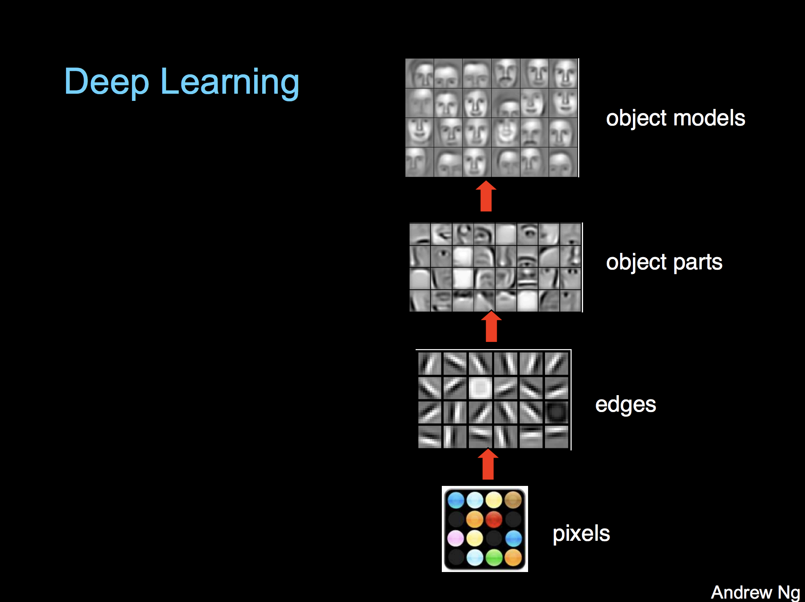
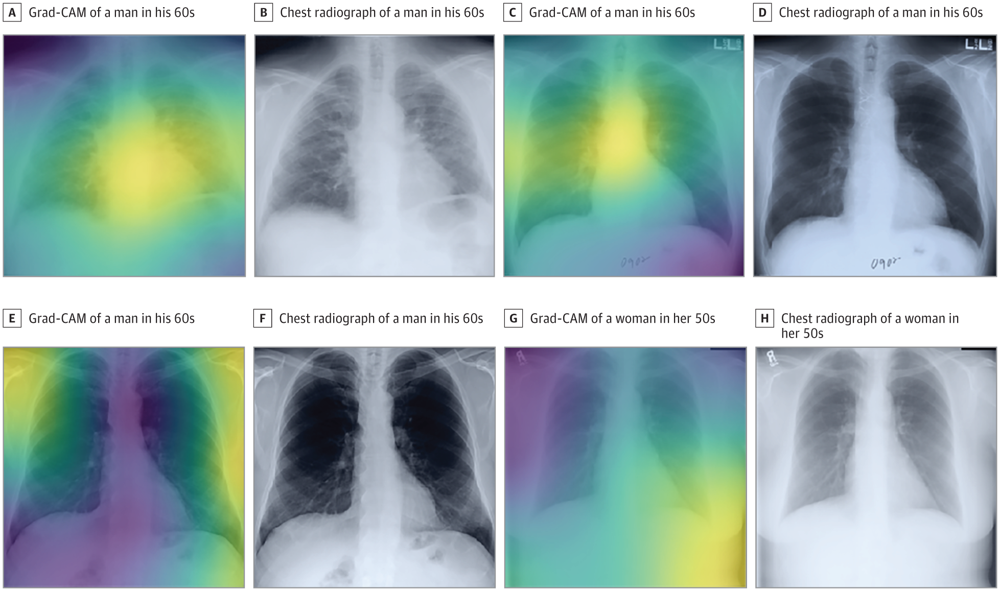
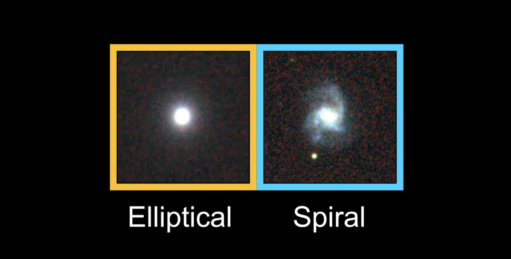

Deep learning isn’t hard anymore - Towards Data Science

# Deep learning isn’t hard anymore

## At least, building software with deep learning isn’t

[Caleb Kaiser](https://towardsdatascience.com/@calebkaiser?source=post_page-----26db0d4749d7----------------------)

[Feb 7](https://towardsdatascience.com/deep-learning-isnt-hard-anymore-26db0d4749d7?source=post_page-----26db0d4749d7----------------------) · 6 min read

In the not-so-distant past, a data science team would need a few things to effectively use deep learning:

- A novel model architecture, likely designed in-house
- Access to a large, and likely proprietary, data set
- The hardware or funds for large-scale model training

This had the effect of bottlenecking deep learning, limiting it to the few projects that met those conditions.

Over the last couple years, however, things have changed.

At [Cortex](https://github.com/cortexlabs/cortex), we are seeing users launch a new generation of products built on deep learning—and unlike before, these products aren’t all being built using one-of-a-kind model architectures.

The driver behind this growth is transfer learning.

# What is transfer learning?

Transfer learning, broadly, is the idea that the knowledge accumulated in a model trained for a specific task—say, identifying flowers in a photo—can be transferred to another model to assist in making predictions for a different, related task—like identifying melanomas on someone’s skin.

*Note: If you want a more technical dive into transfer learning, Sebastian Ruder has written a *[*fantastic primer*](https://ruder.io/transfer-learning/)*.*

There are a variety of approaches to transfer learning, but one approach in particular—finetuning—is finding widespread adoption.

In this approach, a team takes a pre-trained model and removes/retrains the last layers of the model to focus on a new, related task. For example, AI Dungeon is an open world text adventure game that went viral for how convincing its AI-generated stories are:

Source: [AI Dungeon](http://aidungeon.io/)

What’s remarkable is that AI Dungeon wasn’t developed in one of Google’s research labs—it was a hackathon project built by a single engineer.

Nick Walton, the creator of AI Dungeon, built it not by designing a model from scratch, but by taking a state-of-the-art NLP model—OpenAI’s GPT-2—and finetuning it on choose your own adventure texts.

The reason this works at all is that in a neural network, the initial layers focus on simple, general features, while the final layers focus on more task-specific classification/regression. Andrew Ng visualizes the layers and their relative levels of specificity by imagining an image recognition model:

Source: [Stanford](http://cs229.stanford.edu/materials/CS229-DeepLearning.pdf)

The general knowledge of the base layers, it turns out, often translates well to other tasks. In the AI Dungeon example, GPT-2 had a state of the art understanding of general English, it just needed a little retraining in its final layers to perform well within the choose your own adventure genre.

Through this process, a single engineer can deploy a model that achieves state of the art results in a new domain in a matter of days.

# Why transfer learning is the key to the next generation of ML-powered software

Earlier, I mentioned the favorable conditions that needed to be present for machine learning—and deep learning, in particular—to be used effectively. You needed access to a large, clean dataset, you needed to be able to design an effective model, and you needed the means to train it.

This meant that by default, projects in certain domains or without certain resources weren’t feasible.

Now, with transfer learning, these bottlenecks are being removed:

## 1. Small datasets are no longer dealbreakers

Deep learning typically requires large amounts of labeled data, and in many domains, this data simply doesn’t exist. Transfer learning can fix this.

For example, a team affiliated with Harvard Medical School recently deployed a model that could “predict long-term mortality, including noncancer death, from chest radiographs.”

Source: [JAMA Network](https://cdn.jamanetwork.com/ama/content_public/journal/jamanetworkopen/938081/zoi190301f3.png?Expires=2147483647&Signature=SYAmsZ0dfktqhdOwVN~SbUZ6QRPsNkgKuLMAnC922jyDaTNzmqKz7SS7WVJiVd0UwF~-PXCJ2~f~rHtYKWEqDlbpNos1XRS95SDab8CXWlgaaXD47DDzA8TOXExK4lnmw28QZ~EG2vrrlVAHEHW1XBUSJ-aKQxlcCWa8FhV8~q-zOzt9piUhTpk-XGPhH~05Mnyy0j5t77aqHrxQWjaWc7HRtuv-UFI1UOlVApgLOdYlJpZyJKuE6pkMfYCH~vyLn4r58iXSQll8flOSuxafCTLaENiDdZ4t4k3gK0ypkQLL6LBDgy1EXobSNA13Al5mnsrwaR162JuH5djiPyLMcw__&Key-Pair-Id=APKAIE5G5CRDK6RD3PGA)

With a dataset of ~50,000 labeled images, they did not have the data necessary to train their CNN (convolutional neural network) from scratch. Instead, they took a pre-trained Inception-v4 model (which is trained on the ImageNet dataset of over 14 million images) and used transfer learning and slight architecture modifications to adapt the model to their dataset.

In the end, their CNN was successful in using just one chest image per patient to generate risk scores that were [correlated with the patients’ actual mortality](https://jamanetwork.com/journals/jamanetworkopen/fullarticle/2738349).

## 2. Models can be trained in minutes—not days

Training a model on huge amounts of data isn’t just a question of acquiring a large dataset, it is also a question of resources and time.

For example, when Google was developing their state of the art image classification model Xception, they trained two versions: one on the ImageNet dataset (14 million images), and the other on the JFT dataset (350 million images).

Training on 60 NVIDIA K80 GPUs—with various optimizations—it took [3 days](https://www.zpascal.net/cvpr2017/Chollet_Xception_Deep_Learning_CVPR_2017_paper.pdf) for a single ImageNet experiment to run. The JFT experiments took over a *month*.

Now that the pre-trained Xception model is released, however, teams can finetune their own version much faster.

For example, a team at the University of Illinois and Argonne National Laboratory recently trained a model to classify images of galaxies as spiral or elliptical:

Source: [Argonne Leadership Computing Facility](https://www.youtube.com/watch?v=8-jcf1TZNdA)

Despite only having a dataset of 35,000 labeled images, they were able to finetune Xception in just *8 minutes* using NVIDIA GPUs.

The resulting model is able to classify galaxies with a 99.8% success rate at a superhuman speed of over 20,000 galaxies per minute, when it is [served on GPUs](https://towardsdatascience.com/how-much-difference-do-gpus-make-in-model-serving-c40b885ac096).

## 3. You don’t need venture capital to train models anymore

Google probably didn’t care much about cost when they trained their Xception model on 60 GPUs for months at a time. However, for any team that doesn’t have a Google-sized budget, the price of model training is a real concern.

For example, when OpenAI first publicized the results of GPT-2, they released the model architecture but not the full pre-trained model, due to concerns about misuse.

In response, a team at Brown replicated GPT-2 by following the architecture and training procedure laid out in the paper, calling their model OpenGPT-2. It cost them ~$50,000 to train, and it didn’t perform as well as GPT-2.

$50,000 for a model that performs below the state of the art is a big risk for any team building real, production software without a massive bankroll.

Fortunately, transfer learning lowers this cost dramatically.

When Nick Walton built AI Dungeon, he did it by finetuning GPT-2. OpenAI had already put roughly [27,118,520 pages of text](https://towardsdatascience.com/too-big-to-deploy-how-gpt-2-is-breaking-production-63ab29f0897c) and thousands of dollars into training the model, and Walton didn’t need to recreate any of that.

Instead, he used a much smaller set of text scraped from chooseyourstory.com, and finetuned the model in Google Colab—which is entirely free.

# Machine learning engineering is becoming a real ecosystem

Looking at software engineering as a parallel, we typically see ecosystems “mature” in pretty standard patterns.

A new programming language will emerge with some exciting features, and people will use it for specialized use-cases, research projects, and toys. At this stage, anyone who uses it has to build all their basic utilities from scratch.

Down the line, people within the community develop libraries and projects that abstract common utilities away, until the tooling is capable and stable enough to be used in production.

At this stage, the engineers using it to build software are not concerned about sending HTTP requests or connecting to databases—all of that is abstracted away—and are solely focused on building their product.

In other words, Facebook builds React, Google builds Angular, and engineers use them to build products. With transfer learning, machine learning engineering is taking that step forward.

As companies like OpenAI, Google, Facebook, and the rest of the tech giants release powerful open source models, the “tooling” for machine learning engineers gets more capable and stable.

Instead of spending time building a model from scratch with PyTorch or TensorFlow, machine learning engineers are using open source models and transfer learning to build products, meaning a whole new generation of ML-powered software is on its way.

Now, machine learning engineers just have to worry about [how to put these models into production](https://github.com/cortexlabs/cortex).

*Note: If you’re interested in building software with finetuned models, *[*check out Cortex*](https://github.com/cortexlabs/cortex)*, an open source platform for deploying models. Full disclosure, I’m a contributor.*