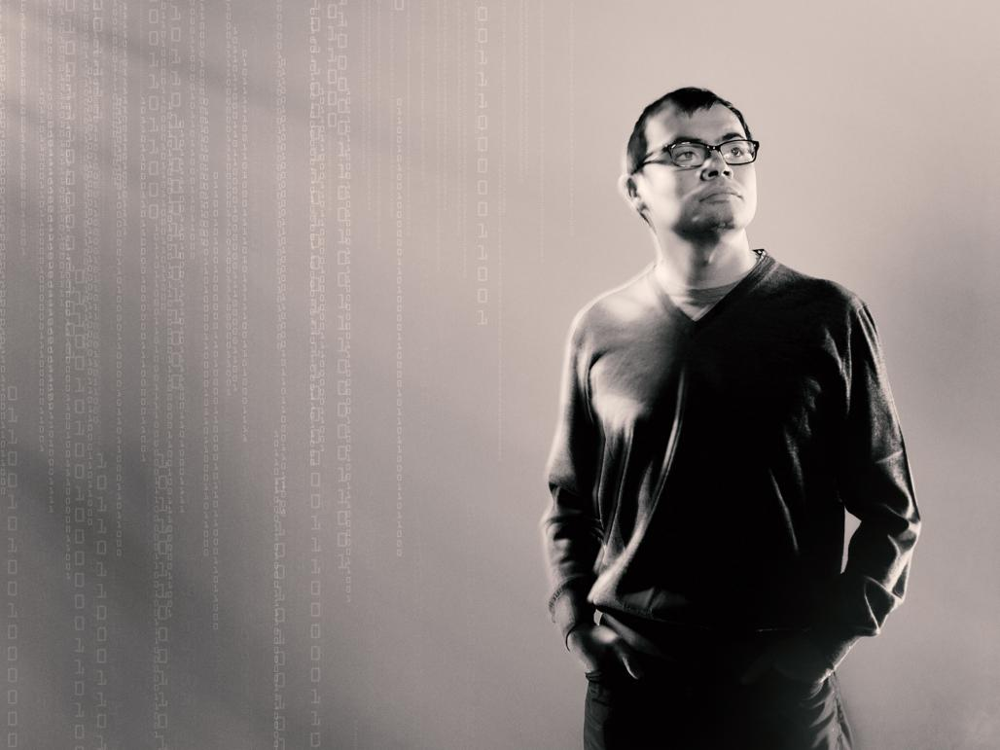
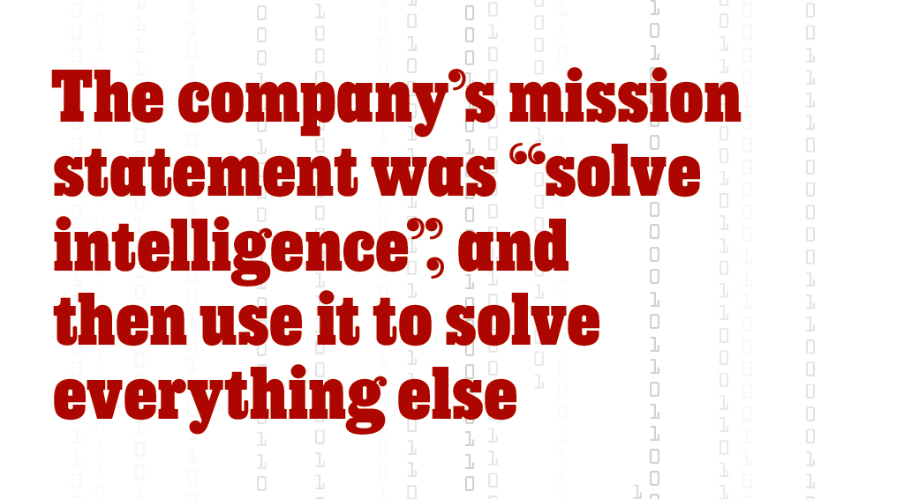
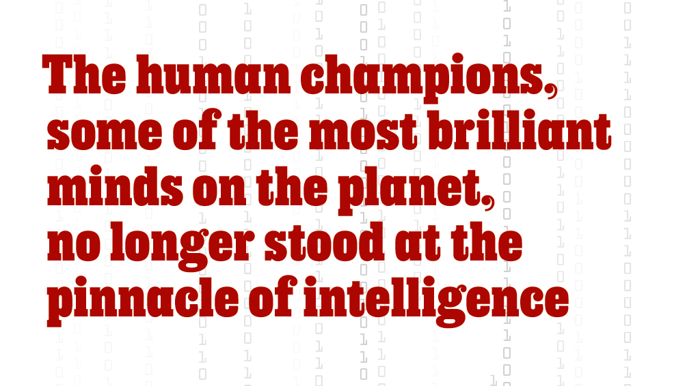
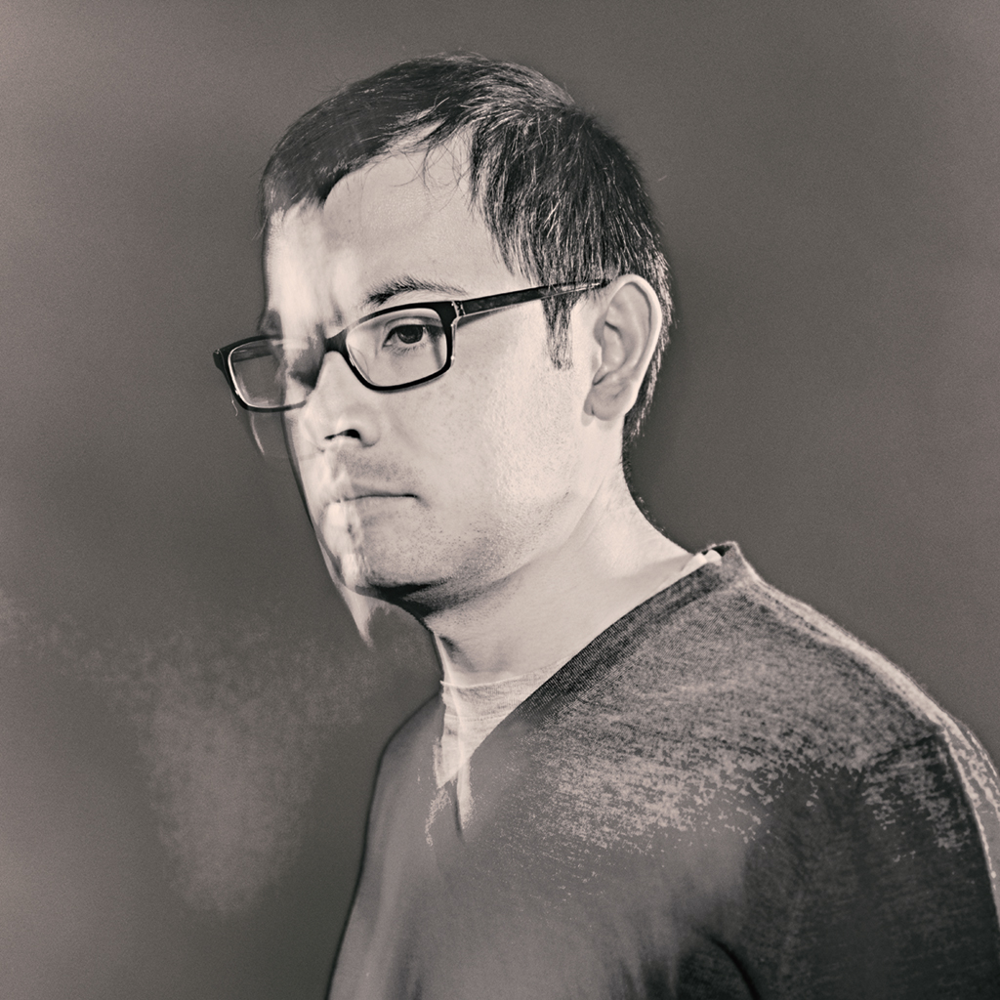
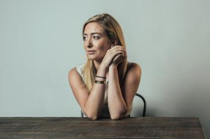

DeepMind and Google: the battle to control artificial intelligence

 

[Tech](https://www.1843magazine.com/tech)

#  DeepMind and Google: the battle to control artificial intelligence

Demis Hassabis founded a company to build the world’s most powerful AI. Then Google bought him out. Hal Hodson asks who is in charge

 [Hal Hodson](https://www.1843magazine.com/contributor/17012) | April/May 2019

     [![](data:image/svg+xml,%3csvg version='1.1' xmlns='http://www.w3.org/2000/svg' id='twitter' xmlns:xlink='http://www.w3.org/1999/xlink' x='0px' y='0px' viewBox='0 0 32 32' style='enable-background:new 0 0 32 32%3b' xml:space='preserve' data-evernote-id='573' class='js-evernote-checked'%3e %3cstyle type='text/css' data-evernote-id='574' class='js-evernote-checked'%3e .st0%7bfill:%23488AC8%3b%7d %3c/style%3e %3cpath class='st0 js-evernote-checked' d='M16%2c0C7.2%2c0%2c0%2c7.2%2c0%2c16c0%2c8.8%2c7.2%2c16%2c16%2c16c8.8%2c0%2c16-7.2%2c16-16C32%2c7.2%2c24.8%2c0%2c16%2c0z M22.3%2c12.8 c0%2c0.1%2c0%2c0.3%2c0%2c0.4c0%2c4.3-3.3%2c9.2-9.2%2c9.2c-1.8%2c0-3.5-0.5-4.9-1.5c0.3%2c0%2c0.5%2c0%2c0.8%2c0c1.5%2c0%2c2.9-0.5%2c4-1.4c-1.4%2c0-2.6-1-3-2.2 c0.2%2c0%2c0.4%2c0.1%2c0.6%2c0.1c0.3%2c0%2c0.6%2c0%2c0.8-0.1c-1.5-0.3-2.6-1.6-2.6-3.2v0c0.4%2c0.2%2c0.9%2c0.4%2c1.5%2c0.4c-0.9-0.6-1.4-1.6-1.4-2.7 c0-0.6%2c0.2-1.1%2c0.4-1.6c1.6%2c1.9%2c4%2c3.2%2c6.6%2c3.4c-0.1-0.2-0.1-0.5-0.1-0.7c0-1.8%2c1.4-3.2%2c3.2-3.2c0.9%2c0%2c1.8%2c0.4%2c2.4%2c1 c0.7-0.2%2c1.4-0.4%2c2-0.8c-0.2%2c0.8-0.8%2c1.4-1.4%2c1.8c0.6-0.1%2c1.3-0.3%2c1.9-0.5C23.4%2c11.8%2c22.9%2c12.3%2c22.3%2c12.8z' data-evernote-id='575'%3e%3c/path%3e %3c/svg%3e)](https://www.1843magazine.com/#twitter)    

One afternoon in August 2010, in a conference hall perched on the edge of San Francisco Bay, a 34-year-old Londoner called Demis Hassabis took to the stage. Walking to the podium with the deliberate gait of a man trying to control his nerves, he pursed his lips into a brief smile and began to speak: “So today I’m going to be talking about different approaches to building…” He stalled, as though just realising that he was stating his momentous ambition out loud. And then he said it: “AGI”.

AGI stands for artificial general intelligence, a hypothetical computer program that can perform intellectual tasks as well as, or better than, a human. AGI will be able to complete discrete tasks, such as recognising photos or translating languages, which are the single-minded focus of the multitude of artificial intelligences (AIs) that inhabit our phones and computers. But it will also add, subtract, play chess and speak French. It will also understand physics papers, compose novels, devise investment strategies and make delightful conversation with strangers. It will monitor nuclear reactions, manage electricity grids and traffic flow, and effortlessly succeed at everything else. AGI will make today’s most advanced AIs look like pocket calculators.

The only intelligence that can currently attempt all these tasks is the kind that humans are endowed with. But human intelligence is limited by the size of the skull that houses the brain. Its power is restricted by the puny amount of energy that the body is able to provide. Because AGI will run on computers, it will suffer none of these constraints. Its intelligence will be limited only by the number of processors available. AGI may start by monitoring nuclear reactions. But soon enough it will discover new sources of energy by digesting more physics papers in a second than a human could in a thousand lifetimes. Human-level intelligence, coupled with the speed and scalability of computers, will make problems that currently appear insoluble disappear. Hassabis told the *Observer*, a British newspaper, that he expected AGI to master, among other disciplines, “cancer, climate change, energy, genomics, macro-economics [and] financial systems”.

The conference at which Hassabis spoke was called the Singularity Summit. “The Singularity” refers to the most likely consequence of the advent of AGI, according to futurists. Because AGI will process information at high speed, it will become very smart very quickly. Rapid cycles of self-improvement will lead to an explosion of machine intelligence, leaving humans choking on silicon dust. Since this future is constructed entirely on a scaffolding of untested presumptions, it is a matter of almost religious belief whether one considers the Singularity to be Utopia or hell.

Judging by the titles of talks, the attendees at the conference tended towards the messianic: “The Mind and How to Build One”; “AI against Aging”; “Replacing Our Bodies”; “Modifying the Boundary between Life and Death”. Hassabis’s speech, by contrast, appeared underwhelming: “A Systems Neuroscience Approach to Building AGI”.

Hassabis paced between the podium and a screen, speaking at a rapid clip. He wore a maroon jumper and a white button-down shirt like a schoolboy. His slight stature seemed only to magnify his intellect. Up until now, Hassabis explained, scientists had approached AGI from two directions. On one track, known as symbolic AI, human researchers tried to describe and program all the rules needed for a system that could think like a human. This approach was popular in the 1980s and 1990s, but hadn’t produced the desired results. Hassabis believed that the brain’s mental architecture was too subtle to be described in this way.

The other track comprised researchers trying to replicate the brain’s physical networks in digital form. This made a certain kind of sense. After all, the brain is the seat of human intelligence. But those researchers were also misguided, said Hassabis. Their task was on the same scale as mapping every star in the universe. More fundamentally, it focused on the wrong level of brain function. It was like trying to understand how Microsoft Excel works by tearing open a computer and examining the interactions of the transistors.

Instead, Hassabis proposed a middle ground: AGI should take inspiration from the broad methods by which the brain processes information – not the physical systems or the particular rules it applies in specific situations. In other words it should focus on understanding the brain’s software, not its hardware. New techniques like functional magnetic resonance imaging (fMRI), which made it possible to peer inside the brain while it engaged in activities, had started to make this kind of understanding feasible. The latest studies, he told the audience, showed that the brain learns by replaying experiences during sleep, in order to derive general principles. AI researchers should emulate this kind of system.

A logo appeared in the lower-right corner of his opening slide, a circular swirl of blue. Two words, closed up, were printed underneath it: DeepMind. This was the first time the company had been referred to in public. Hassabis had spent a year trying to get an invitation to the Singularity Summit. The lecture was an alibi. What he really needed was one minute with Peter Thiel, the Silicon Valley billionaire who funded the conference. Hassabis wanted Thiel’s investment.

Hassabis has never spoken about why he wanted Thiel’s backing in particular. (Hassabis refused multiple interview requests for this article through a spokesperson. *1843* spoke to 25 sources, including current and former employees and investors. Most of them spoke anonymously, as they were not authorised to talk about the company.) But Thiel believes in AGI with even greater fervour than Hassabis. In a talk at the Singularity Summit in 2009, Thiel had said that his biggest fear for the future was not a robot uprising (though with an apocalypse-proof bolthole in the New Zealand outback, he’s better prepared than most people). Rather, he worried that the Singularity would take too long coming. The world needed new technology to ward off economic decline.

DeepMind ended up raising £2m; Thiel contributed £1.4m. When Google bought the company in January 2014 for $600m, Thiel and other early investors earned a 5,000% return on their investment.

For many founders, this would be a happy ending. They could slow down, take a step back and spend more time with their money. For Hassabis, the acquisition by Google was just another step in his pursuit of AGI. He had spent much of 2013 negotiating the terms of the deal. DeepMind would operate as a separate entity from its new parent. It would gain the benefits of being owned by Google, such as access to cash flow and computing power, without losing control.

Hassabis thought DeepMind would be a hybrid: it would have the drive of a startup, the brains of the greatest universities, and the deep pockets of one of the world’s most valuable companies. Every element was in place to hasten the arrival of AGI and solve the causes of human misery.

Demis Hassabis was born in north London in 1976 to a Greek-Cypriot father and a Chinese-Singaporean mother. He was the eldest of three siblings. His mother worked at John Lewis, a British department store, and his father ran a toy shop. He took up chess at the age of four, after watching his father and uncle play. Within weeks he was beating the grown-ups. By 13 he was the second-best chess player in the world for his age. At eight, he taught himself to code on a basic computer.

Hassabis completed his A-levels in 1992, two years ahead of schedule. He got a job programming videogames with Bullfrog Productions. Hassabis wrote Theme Park, in which players designed and ran a virtual amusement park. It was a huge success, selling 15m copies and forming part of a new genre of simulation games in which the goal is not to defeat an opponent but to optimise the functioning of a complex system like a business or a city.

As well as making games, he was brilliant at playing them. As a teen, he’d run between floors at board-game competitions to compete in simultaneous bouts of chess, scrabble, poker and backgammon. In 1995, while studying computer science at Cambridge University, Hassabis wandered into a student Go tournament. Go is an ancient board game of strategy that is considerably more complex than chess. Mastery is supposed to require intuition acquired by long experience. No one knew if Hassabis had even played before.

First, Hassabis won the beginners’ tournament. Then he beat the winner of the experienced players, albeit with a handicap. Charles Matthews, the Cambridge Go master who ran the tournament, remembers the expert player’s shock at being thrashed by a 19-year-old novice. Matthews took Hassabis under his wing.

Hassabis’s intellect and ambition have always expressed themselves through games. Games, in turn, sparked his fascination with intelligence. As he observed his own development at chess, he wondered whether computers might be programmed to learn as he had, through accumulated experience. Games offered a learning environment that the real world couldn’t match. They were neat and contained. Because games are hived off from the real world, they can be practised without interference and mastered efficiently. Games speed up time: players build a crime syndicate in a couple of days and fight the battle of the Somme in minutes.

In the summer of 1997, Hassabis travelled to Japan. That May, IBM’s Deep Blue computer had beaten Garry Kasparov, the world chess champion. This was the first time a computer had defeated a grandmaster at chess. The match captured the world’s attention and raised concerns over the growing power and potential menace of computers. When Hassabis met Masahiko Fujuwarea, a Japanese board-game master, he spoke of a plan that would combine his interests in strategy games and artificial intelligence: one day he would build a computer program to beat the greatest human Go player.

Hassabis approached his career methodically. “At the age of 20, Hassabis was taking a view that certain things have to be in place before he could go into artificial intelligence at the level he wanted to,” says Matthews. “He had a plan.”

In 1998 he started a game studio of his own called Elixir. Hassabis focused on one hugely ambitious game, Republic: The Revolution, an intricate political simulation. Years earlier, when still in school, Hassabis had told his friend Mustafa Suleyman that the world needed grand simulations in order to model its complex dynamics and solve the toughest social problems. Now, he tried do so in a game.

His aspirations proved harder than expected to wrangle into code. Elixir eventually released a pared-down version of the game, to lukewarm reviews. Other games flopped (one was a Bond-villain simulator called Evil Genius). In April 2005 Hassabis shut down Elixir. Matthews believes that Hassabis founded the company simply to gain managerial experience. Now, Hassabis lacked just one crucial area of knowledge before embarking on his quest for AGI. He needed to understand the human brain.

In 2005, Hassabis started a PhD in neuroscience at University College London (UCL). He published influential research on memory and imagination. One paper, which has since been cited over 1,000 times, showed that people with amnesia also had difficulty imagining new experiences, suggesting that there is a connection between remembering and creating mental images. Hassabis was building up an understanding of the brain required to tackle AGI. Most of his work came back to one question: how does the human brain obtain and retain concepts and knowledge?

Hassabis officially founded DeepMind on November 15th 2010. The company’s mission statement was the same then as it is now: to “solve intelligence”, and then use it to solve everything else. As Hassabis told the Singularity Summit attendees, this means translating our understanding of how the brain accomplished tasks into software that could use the same methods to teach itself.

Hassabis does not pretend that science has fully comprehended the human mind. The blueprint for AGI could not simply be drawn from hundreds of neuroscience studies. But he clearly believes enough is known to begin work on AGI in the manner he would like. Yet it is possible that his confidence outruns reality. We still know very little for certain about how the brain actually functions. In 2018 the findings of Hassabis’s own PhD were called into question by a team of Australian researchers. The statistics are devilish and this is just a single paper, but it shows that the science that underwrites DeepMind’s work is far from settled.

Suleyman and Shane Legg, an AGI-obsessed New Zealander whom Hassabis also met at UCL, joined as co-founders. The firm’s reputation grew rapidly. Hassabis reeled in talent. “He’s a bit of a magnet,” says Ben Faulkner, DeepMind’s former operations manager. Many new recruits came from Europe, beyond the terrible gaze of Silicon Valley giants like Google and Facebook. Perhaps DeepMind’s greatest accomplishment was moving early to hire and retain the brightest and best. The company set up shop in the attic of a terraced house on Russell Square in Bloomsbury, across the road from UCL.

One machine-learning technique that the company focused on grew out of Hassabis’s twin fascination with games and neuroscience: reinforcement learning. Such a program is built to gather information about its environment, then learn from it by repeatedly replaying its experiences, much like the description that Hassabis gave of human-brain activity during sleep in his Singularity Summit lecture.

Reinforcement learning starts with a computational blank slate. The program is shown a virtual environment about which it knows nothing but the rules, such as a simulation of a game of chess or a video game. The program contains at least one component known as a neural network. This is made up of layers of computational structures that sift through information in order to identify particular features or strategies. Each layer examines the environment at a different level of abstraction. At first these networks have minimal success but, importantly, their failures are encoded within them. They become increasingly sophisticated as they experiment with different strategies and are rewarded when they are successful. If the program moves a chess piece and loses the game as a result, it won’t make that mistake again. Much of the magic of artificial intelligence lies in the speed at which it repeats its tasks.

DeepMind’s work culminated in 2016 when a team built an AI program that used reinforcement learning alongside other techniques to play Go. The program, called AlphaGo, caused astonishment when it beat the world champion in a five-game match in Seoul in 2016. The machine’s victory, watched by 280m people, came a decade earlier than experts had predicted. The following year an improved version of AlphaGo thrashed the Chinese Go champion.

Like Deep Blue in 1997, AlphaGo changed perceptions of human accomplishment. The human champions, some of the most brilliant minds on the planet, no longer stood at the pinnacle of intelligence. Nearly 20 years after he had confided his ambition to Fujuwarea, Hassabis fulfilled it. Hassabis has said that the match brought him close to tears. Traditionally, a student of Go pays back their teacher by beating them in a single contest. Hassabis thanked Matthews by beating the entire game.

DeepBlue won through the brute strength and speed of computation, but AlphaGo’s style appeared artistic, almost human. Its grace and sophistication, the transcendence of its computational muscle, seemed to show that DeepMind was further ahead than its competitors on the quest for a program that could treat disease and manage cities.

Hassabis has always said that DeepMind would change the world for the better. But there are no certainties about AGI. If it ever comes into being, we don’t know whether it will be altruistic or vicious, or if it will submit to human control. Even if it does, who should take the reins?

From the start, Hassabis has tried to protect DeepMind’s independence. He has always insisted that DeepMind remain in London. When Google bought the company in 2014, the question of control became more pressing. Hassabis didn’t need to sell DeepMind to Google. There was plenty of cash on hand and he had sketched out a business model in which the company would design games to fund research. Google’s financial heft was attractive, yet, like many founders, Hassabis was reluctant to hand over the company he had nurtured. As part of the deal, DeepMind created an arrangement that would prevent Google from unilaterally taking control of the company’s intellectual property. In the year leading up to acquisition, according to a person familiar with the transaction, both parties signed a contract called the Ethics and Safety Review Agreement. The agreement, previously unreported, was drawn up by senior barristers in London.

The Review Agreement puts control of DeepMind’s core AGI technology, whenever it may be created, in the hands of a governing panel known as the Ethics Board. Far from being a cosmetic concession from Google, the Ethics Board gives DeepMind solid legal backing to keep control of its most valuable and potentially most dangerous technology, according to the same source. The names of the panel members haven’t been made public, but another source close to both DeepMind and Google says that all three of DeepMind’s founders sit on the board. (DeepMind refused to answer a detailed set of questions about the Review Agreement but said that “ethics oversight and governance has been a priority for us from the earliest days.”)

Hassabis can determine DeepMind’s destiny by other means too. One is loyalty. Employees past and present say that Hassabis’s research agenda is one of DeepMind’s greatest strengths. His programme, which offers fascinating and important work free from the pressures of academia, has attracted hundreds of the world’s most talented experts. DeepMind has subsidiary offices in Paris and Alberta. Many employees feel more affinity with Hassabis and his mission than with its revenue-hungry corporate parent. As long as he retains their personal loyalty, Hassabis holds considerable power over his sole shareholder. Better for Google to have DeepMind’s AI talent working for it by proxy than for those people to end up at Facebook or Apple.

DeepMind has another source of leverage, though it requires constant replenishment: favourable publicity. The company excels at this. AlphaGo was a PR coup. Since the Google acquisition, the firm has repeatedly produced marvels that have garnered global attention. One piece of software can spot patterns in an eye scan that are indicators of macular degeneration. Another program learned to play chess from scratch using similar architecture to AlphaGo, becoming the greatest chess player of all time after just nine hours playing against itself. In December 2018 a program called AlphaFold proved more accurate than competitors at predicting the three-dimensional structure of proteins from a list of their composites, potentially paving the way to treat diseases such as Parkinson’s and Alzheimer’s.

DeepMind is particularly proud of the algorithms it developed that calculate the most efficient means to cool Google’s data centres, which contain an estimated 2.5m computer servers. DeepMind said in 2016 that they had reduced Google’s energy bill by 40%. But some insiders say such boasts are overblown. Google had been using algorithms to optimise its data centres long before DeepMind existed. “They just want to have some PR so they can claim some value added within Alphabet,” says one Google employee. Google’s parent Alphabet pays DeepMind handsomely for services like these. DeepMind billed £54m to Alphabet companies in 2017. That figure pales in comparison to DeepMind’s overheads. It spent £200m on staff alone that year. Overall, DeepMind lost £282m in 2017.

This is a pittance for the cash-rich giant. But other Alphabet subsidiaries in the red have attracted the attention of Ruth Porat, Alphabet’s parsimonious chief financial officer. Google Fiber, an effort to build an internet-service provider, was put on hiatus after it became clear that it would take decades to make a return on investment. AI researchers wonder privately whether DeepMind will be “Porated”.

DeepMind’s careful unveiling of AI advances forms part of its strategy of managing up, signalling its reputational worth to the powers that be. That’s especially valuable at a time when Google stands accused of invading users’ privacy and spreading fake news. DeepMind is also lucky to have a sympathiser at the highest level: Larry Page, one of Google’s two founders, now chief executive of Alphabet. Page is the closest thing that Hassabis has to a boss. Page’s father, Carl, studied neural networks in the 1960s. Early in his career, Page said that he built Google solely to found an AI company.

DeepMind’s tight control needed for press management doesn’t gel with the academic spirit that pervades the company. Some researchers complain that it can be difficult to publish their work: they have to battle through layers of internal approval before they can even submit work to conferences and journals. DeepMind believes that it needs to proceed carefully to avoid scaring the public with the prospect of AGI. But clamming up too tightly could start to sour the academic atmosphere and weaken the loyalty of employees.

Five years after the acquisition by Google, the question of who controls DeepMind is coming to a crunch point. The firm’s founders and early employees are approaching earn-out, when they can leave with the financial compensation that they received from the acquisition (Hassabis’s stock was probably worth around £100m). But a source close to the company suggests that Alphabet has pushed back the founders’ earn-outs by two years. Given his relentless focus, Hassabis is unlikely to jump ship. He is interested in money only in so far as it helps him achieve his life’s work. But some colleagues have already left. Three AI engineers have departed since the start of 2019. And Ben Laurie, one of the world’s most prominent security engineers, has now returned to Google, his previous employer. This number is small, but DeepMind offers such an exhilarating mission and handsome pay that it is rare for anyone to leave.

So far, Google has not interfered much with DeepMind. But one recent event has raised concerns over how long the company can sustain its independence.

DeepMind had always planned to use AI to improve health care. In February 2016, it set up a new division, DeepMind Health, led by Mustafa Suleyman, one of the company’s co-founders. Suleyman, whose mother was an NHS nurse, hoped to create a program called Streams that would warn doctors when a patient’s health deteriorated. DeepMind would earn a performance-based fee. Because this work required access to sensitive information about patients, Suleyman established an Independent Review Panel (IRP) populated by the great and good of British health care and technology. DeepMind was wise to proceed with care. The British information commissioner subsequently found that one of the partner hospitals broke the law in handling patient data. Nonetheless by the end of 2017, Suleyman had signed agreements with four large NHS hospitals.

On November 8th 2018, Google reported the creation of its own health-care division, Google Health. Five days later, it was announced that DeepMind Health was to be rolled into its parent company’s efforts. DeepMind appeared to have had little warning. According to information gained from Freedom of Information requests, it gave its partner hospitals only three days’ notice of the change. DeepMind refused to say when discussions about the merger began but said that the short gap between the notification and a public announcement was in the interests of transparency. Suleyman had written in 2016 that “at no stage will patient data ever be linked or associated with Google accounts, products or services.” His promise seemed to have been broken. (In response to *1843*’s questions, DeepMind said that “at this stage, none of our contracts have moved across to Google, and they only will with our partners’ consent. Streams becoming a Google service does not mean the patient data...can be used to provide other Google products or services.”)

Google’s annexation has angered employees at DeepMind Health. According to people close to the health team, more employees plan to leave the company once the absorption is complete. One member of the IRP, Mike Bracken, has already walked out on Suleyman. According to multiple people familiar with the event, Bracken quit in December 2017 over concerns that the panel was more about window-dressing than genuine oversight. When Bracken asked Suleyman if he would give panel members the accountability and governance powers of non-executive directors, Suleyman scoffed.  (A spokesperson for DeepMind said they had “no recollection” of the incident.) Julian Huppert, the head of the IRP, argues that the panel delivered “more radical governance” than Bracken expected because members were able to speak openly and not bound by a duty of confidentiality.

This episode shows that peripheral parts of DeepMind’s operation are vulnerable to Google. DeepMind said in a statement that “we all agreed that it makes sense to bring these efforts together in one collaborative effort, with increased resources.” This begs the question of whether Google will apply the same logic to DeepMind’s work on AGI.

From a distance, DeepMind looks to have taken great strides. It has already built software that can learn to perform tasks at superhuman levels. Hassabis often cites Breakout, a videogame for the Atari console. A Breakout player controls a bat that she can move horizontally across the bottom of the screen, using it to bounce a ball against blocks that hover above it, destroying them on impact. The player wins when all blocks are obliterated. She loses if she misses the ball with the bat. Without human instruction, DeepMind’s program not only learned to play the game but also worked out how to cannon the ball into the space behind the blocks, taking advantage of rebounds to break more blocks. This, Hassabis says, demonstrates the power of reinforcement learning and  the preternatural ability of DeepMind’s computer programs.

It’s an impressive demo. But Hassabis leaves a few things out. If the virtual paddle were moved even fractionally higher, the program would fail. The skill learned by DeepMind’s program is so restricted that it cannot react even to tiny changes to the environment that a person would take in their stride – at least not without thousands more rounds of reinforcement learning. But the world has jitter like this built into it. For diagnostic intelligence, no two bodily organs are ever the same. For mechanical intelligence, no two engines can be tuned in the same way. So releasing programs perfected in virtual space into the wild is fraught with difficulty.

The second caveat, which DeepMind rarely talks about, is that success within virtual environments depends on the existence of a reward function: a signal that allows software to measure its progress. The program learns that ricocheting off the back wall makes its score go up. Much of DeepMind’s work with AlphaGo lay in constructing a reward function compatible with such a complex game. Unfortunately, the real world doesn’t offer simple rewards. Progress is rarely measured by single scores. Where such measures exist, political challenges complicate the problem. Reconciling the reward signal for climate health (the concentration of CO₂ in the atmosphere) with the reward signal for oil companies (share price) requires satisfying many human beings with conflicted motivations. Reward signals tend to be very weak. It is rare for human brains to receive explicit feedback about the success of a task while in the midst of it.

DeepMind has found a way around this by employing vast amounts of computer power. AlphaGo takes thousands of years of human game-playing time to learn anything. Many AI thinkers suspect this solution is unsustainable for tasks that offer weaker rewards. DeepMind acknowledges the existence of such ambiguities. It has recently focused on StarCraft 2, a strategy computer game. Decisions taken early in the game have ramifications later on, which is closer to the sort of convoluted and delayed feedback that characterises many real-world tasks. In January, DeepMind software beat some of the world’s top human players in a demo that, while heavily constrained, was still impressive. Its programs have also begun to learn reward functions by following the feedback of human taskmasters. But putting human instruction in the loop risks losing the effects of scale and speed that unadulterated computer-processing offered.

Current and former researchers at DeepMind and Google, who requested anonymity due to stringent non-disclosure agreements, have also expressed scepticism that DeepMind can reach AGI through such methods. To these individuals, the focus on achieving high performance within simulated environments makes the reward-signal problem hard to tackle. Yet this approach is at the heart of DeepMind. It has an internal leaderboard, in which programs from competing teams of coders vie for mastery over virtual domains.

Hassabis has always seen life as a game. A large part of his career was devoted to making them, a large part of his leisure time has been spent playing them. At DeepMind, they are his chosen vehicle for developing AGI. Just like his software, Hassabis can learn only from his experiences. The pursuit of AGI may eventually lose its way, having invented some useful medical technologies and out-classed the world’s greatest board-game players. Significant achievements but not the one he craves. But he could yet usher AGI into being, right under Google’s nose but beyond its control. If he does this, Demis Hassabis will have beaten the toughest game of all. •

**[Hal Hodson](https://www.1843magazine.com/contributor/17012)**is technology correspondent for *The Economist*

PHOTOGRAPHS **David Ellis**

## More From [Tech](https://www.1843magazine.com/tech)

[Tech](https://www.1843magazine.com/tech)

### [Metal heads](https://www.1843magazine.com/watches-jewellery/metal-heads)

What’s light, durable and found round the chicest necks? Anthony DeMarco traces the rise of titanium jewellery

[The Daily](https://www.1843magazine.com/the-daily)  [Tech](https://www.1843magazine.com/tech)

### [Can Shapr and BumbleBizz reinvent networking?](https://www.1843magazine.com/technology/the-daily/can-shapr-and-bumblebizz-reinvent-networking)

LinkedIn is a great place to show off your CV, but its size makes it too impersonal. Jennifer Brown tests two apps that offer a more intimate approach

[Tech](https://www.1843magazine.com/tech)

### [His dark materials](https://www.1843magazine.com/design/his-dark-materials)

How designers and architects are using the blackest black ever made