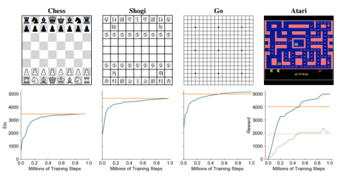
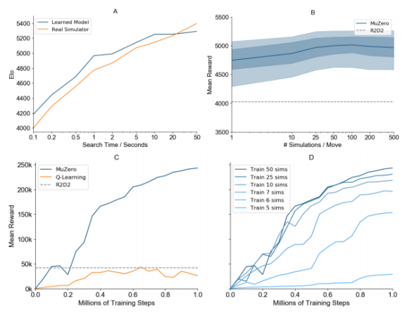
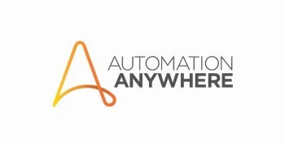

DeepMind&#8217;s MuZero teaches itself how to win at Atari, chess, shogi, and Go

[(L)](https://share.flipboard.com/bookmarklet/popout?v=2&title=DeepMind%27s%20MuZero%20teaches%20itself%20how%20to%20win%20at%20Atari%2C%20chess%2C%20shogi%2C%20and%20Go%20%7C%20VentureBeat&url=https%3A%2F%2Fventurebeat.com%2F2019%2F11%2F20%2Fdeepminds-muzero-teaches-itself-how-to-win-at-atari-chess-shogi-and-go%2F&t=1574774757653&utm_campaign=tools&utm_medium=article-share&utm_source=venturebeat.com)

[AI](https://venturebeat.com/category/ai/)

# DeepMind’s MuZero teaches itself how to win at Atari, chess, shogi, and Go

[Kyle Wiggers](https://venturebeat.com/author/kylewiggers/)[@Kyle_L_Wiggers](https://twitter.com/Kyle_L_Wiggers)November 20, 2019 8:42 AM

Image Credit: DeepMind

In a paper published in the journal *Science *late last year, Google parent company Alphabet’s DeepMind detailed [AlphaZero](https://venturebeat.com/2018/12/06/google-deepmind-alphazero-chess-shogi-go/), an AI system that could teach itself how to master the game of chess, a Japanese variant of chess called shogi, and the Chinese board game Go. In each case, it beat a world champion, demonstrating a knack for learning two-person games with perfect information — that is to say, games where any decision is informed of all the events that have previously occurred.

But AlphaZero had the advantage of knowing the rules of games it was tasked with playing. In pursuit of a performant machine learning model capable of teaching *itself *the rules, a team at DeepMind devised MuZero, which combines a tree-based search (where a *tree* is a data structure used for locating information from within a set) with a learned model. MuZero predicts the quantities most relevant to game planning, such that it achieves industry-leading performance on 57 different Atari games and matches the performance of AlphaZero in Go, chess, and shogi.

Recommended Videos
Powered by [AnyClip](https://anyclip.com/)

How Does Michael Phelps Teach His Kids To Swim?

[(L)](https://anyclip.com/)

 [        Now Playing     How Does Michael Phelps Teach His Kids To Swim?](https://venturebeat.com/2019/11/20/deepminds-muzero-teaches-itself-how-to-win-at-atari-chess-shogi-and-go/)

 [           Poll Finds Teaching Force Is Predominantly Female and White](https://venturebeat.com/2019/11/20/deepminds-muzero-teaches-itself-how-to-win-at-atari-chess-shogi-and-go/)

 [           Apple CEO Tim Cook Talks About Internet Privacy](https://venturebeat.com/2019/11/20/deepminds-muzero-teaches-itself-how-to-win-at-atari-chess-shogi-and-go/)

 [           Google Plans to Offer Checking Accounts Next Year](https://venturebeat.com/2019/11/20/deepminds-muzero-teaches-itself-how-to-win-at-atari-chess-shogi-and-go/)

 [           Google Launches Stadia Gaming Service](https://venturebeat.com/2019/11/20/deepminds-muzero-teaches-itself-how-to-win-at-atari-chess-shogi-and-go/)

 [           Google's A.I. Unit, DeepMind, Is Costing Millions](https://venturebeat.com/2019/11/20/deepminds-muzero-teaches-itself-how-to-win-at-atari-chess-shogi-and-go/)

 [           Michael B Jordan Is On Top Of His Game](https://venturebeat.com/2019/11/20/deepminds-muzero-teaches-itself-how-to-win-at-atari-chess-shogi-and-go/)

The researchers say MuZero paves the way for learning methods in a host of real-world domains, particularly those lacking a simulator that communicates rules or environment dynamics.

“Planning algorithms … have achieved remarkable successes in artificial intelligence … However, these planning algorithms all rely on knowledge of the environment’s dynamics, such as the rules of the game or an accurate simulator,” wrote the scientists in a [preprint paper](https://arxiv.org/pdf/1911.08265.pdf) describing their work. “Model-based … learning aims to address this issue by first learning a model of the environment’s dynamics, and then planning with respect to the learned model.”

## Model-based reinforcement learning

Fundamentally, MuZero receives observations — i.e., images of a Go board or Atari screen — and transforms them into a hidden state. This hidden state is updated iteratively by a process that receives the previous state and a hypothetical next action, and at every step the model predicts the policy (e.g., the move to play), value function (e.g., the predicted winner), and immediate reward (e.g., the points scored by playing a move).

Above: Evaluation of MuZero throughout training in chess, shogi, Go, and Atari. The y-axis shows Elo rating.

*Image Credit: DeepMind*

Intuitively, MuZero internally invents game rules or dynamics that lead to accurate planning.

As the DeepMind researchers explain, one form of reinforcement learning — the technique that’s at the heart of MuZero and AlphaZero, in which rewards drive an AI agent toward goals — involves models. This form models a given environment as an intermediate step, using a state transition model that predicts the next step and a reward model that anticipates the reward.

Commonly, model-based reinforcement learning focuses on directly modeling the observation stream at the pixel level, but this level of granularity is computationally expensive in large-scale environments. In fact, no prior method has constructed a model that facilitates planning in visually complex domains such as Atari; the results lag behind well-tuned model-free methods, even in terms of data efficiency.

Above: Comparison of MuZero against previous agents in Atari.
*Image Credit: DeepMind*

For MuZero, DeepMind instead pursued an approach focusing on end-to-end prediction of a value function, where an algorithm is trained so that the expected sum of rewards matches the expected value with respect to real-world actions. The system has no semantics of the environment state but simply outputs policy, value, and reward predictions, which an algorithm similar to AlphaZero’s search (albeit generalized to allow for single-agent domains and intermediate rewards) uses to produce a recommended policy and estimated value. These in turn are used to inform an action and the final outcomes in played games.

## Training and experimentation

The DeepMind team applied MuZero to the classic board games Go, chess, and shogi as benchmarks for challenging planning problems, and to all 57 games in the open source Atari Learning Environment as benchmarks for visually complex reinforcement learning domains. They trained the system for five hypothetical steps and a million mini-batches (i.e., small batches of training data) of size 2,048 in board games and size 1,024 in Atari, which amounted to 800 simulations per move for each search in Go, chess, and shogi and 50 simulations for each search in Atari.

With respect to Go, MuZero slightly exceeded the performance of AlphaZero despite using less overall computation, which the researchers say is evidence it might have gained a deeper understanding of its position. As for Atari, MuZero achieved a new state of the art for both mean and median normalized score across the 57 games, outperforming the previous state-of-the-art method (R2D2) in 42 out of 57 games and outperforming the previous best model-based approach in all games.

Above: Evaluations of MuZero on Go (A), all 57 Atari Games (B), and Ms. Pac-Man (C-D).

*Image Credit: DeepMind*

The researchers next evaluated a version of MuZero — MuZero Reanalyze — that was optimized for greater sample efficiency, which they applied to 75 Atari games using 200 million frames of experience per game in total. They report that it managed a 731% median normalized score compared to 192%, 231%, and 431% for previous state-of-the-art model-free approaches IMPALA, Rainbow, and LASER, respectively, while requiring substantially less training time (12 hours versus Rainbow’s 10 days).

Lastly, in an attempt to better understand the role the model played in MuZero, the team focused on Go and Ms. Pac-Man. They compared search in AlphaZero using a perfect model to the performance of search in MuZero using a learned model, and they found that MuZero matched the performance of the perfect model even when undertaking larger searches than those for which it was trained. In fact, with only six simulations per move — fewer than the number of simulations per move than is enough to cover all eight possible actions in Ms. Pac-Man — MuZero learned an effective policy and “improved rapidly.”

“Many of the breakthroughs in artificial intelligence have been based on either high-performance planning,” wrote the researchers. “In this paper we have introduced a method that combines the benefits of both approaches. Our algorithm, MuZero, has both matched the superhuman performance of high-performance planning algorithms in their favored domains — logically complex board games such as chess and Go — and outperformed state-of-the-art model-free [reinforcement learning] algorithms in their favored domains — visually complex Atari games.”

## Most Read

- [Amazon brings Alexa to AWS IoT Core devices](https://venturebeat.com/2019/11/25/amazon-brings-alexa-to-aws-iot-core-devices/)
- [Uber loses license to operate in London, one of its biggest markets](https://venturebeat.com/2019/11/25/uber-loses-license-to-operate-in-london-one-of-its-biggest-markets/)
- [Tesla passes 200,000 Cybertruck orders within 3 days of launch](https://venturebeat.com/2019/11/25/tesla-passes-200000-cybertruck-orders-within-3-days-of-launch/)
- [ProBeat: It's a shame neither Google nor Microsoft have an answer to Apple AirPods in 2019](https://venturebeat.com/2019/11/22/probeat-its-a-shame-neither-google-nor-microsoft-have-an-answer-to-apple-airpods-in-2019/)
- [Automation Anywhere raises $290 million at a $6.8 billion valuation](https://venturebeat.com/2019/11/21/rpa-startup-automation-anywhere-raises-290-million-at-a-6-8-billion-valuation/)

## [UPCOMING EVENTS](https://venturebeat.com/events/)

- [GamesBeat Summit](https://www.gamesbeatsummit.com/)Apr. 28-29
- [Transform](https://vbtransform.com/)Jul. 15-16

THE  DATA  ROI  TOOLKIT
How to determine the value of your data initiatives
LEARN MORE

# From black box to white box: Reclaiming human power in AI

[Florian Douetteau, Dataiku](https://venturebeat.com/author/florian-douetteau-dataiku/)November 11, 2019 05:16 AM

Sponsored

Image Credit: Getty Images

THE  DATA  ROI  TOOLKIT
Toolkit
How to determine the value of your data initiatives

LEARN MORE

## Most Read

- [Amazon brings Alexa to AWS IoT Core devices](https://venturebeat.com/2019/11/25/amazon-brings-alexa-to-aws-iot-core-devices/)
- [Uber loses license to operate in London, one of its biggest markets](https://venturebeat.com/2019/11/25/uber-loses-license-to-operate-in-london-one-of-its-biggest-markets/)
- [Tesla passes 200,000 Cybertruck orders within 3 days of launch](https://venturebeat.com/2019/11/25/tesla-passes-200000-cybertruck-orders-within-3-days-of-launch/)
- [ProBeat: It's a shame neither Google nor Microsoft have an answer to Apple AirPods in 2019](https://venturebeat.com/2019/11/22/probeat-its-a-shame-neither-google-nor-microsoft-have-an-answer-to-apple-airpods-in-2019/)
- [Automation Anywhere raises $290 million at a $6.8 billion valuation](https://venturebeat.com/2019/11/21/rpa-startup-automation-anywhere-raises-290-million-at-a-6-8-billion-valuation/)

THE  DATA  ROI  TOOLKIT
Toolkit
How to determine the value of your data initiatives

LEARN MORE

## [UPCOMING EVENTS](https://venturebeat.com/events/)

- [GamesBeat Summit](https://www.gamesbeatsummit.com/)Apr. 28-29
- [Transform](https://vbtransform.com/)Jul. 15-16

THE  DATA  ROI  TOOLKIT
Toolkit
How to determine the value of your data initiatives

LEARN MORE

*This article is part of a VB special issue. Read the full series here: [Power in AI](https://venturebeat.com/vb-special-issue-power-in-ai/).*

* * *

*Presented by Dataiku*

* * *

It’s hard to imagine what life was like before the peak of AI hype in which we currently find ourselves. But it was just a few years ago, in 2012, that Apple gave the world the first integrated version of Siri on the iPhone 4S, which people used to impress their friends by asking it banal questions. Google was just beginning to test its self-driving cars in Nevada. And the McKinsey Global Institute had recently released “Big data: The next frontier for innovation, competition, and productivity.”

On the starting blocks of the race to release the next big AI-powered thing, no one was talking about explainable AI. Doing it first, even if no one truly understood how it worked, was paramount. That McKinsey Global Institute report gave a small amount of foreshadowing, predicting that businesses in nearly all sectors of the U.S. economy had at least an average of 200 terabytes of stored data. Back then, some companies were even doing something with that data, but those applications were mostly behind-the-scenes or extremely specialized. They were projects — largely siloed off from the core functions — that were maybe for those new people called data scientists to worry about, but certainly not the core of the business.

In the years that followed, things took off. By late 2012, data scientist, as most people are sick of hearing by now, was dubbed the sexiest job of the 21st century, and data teams started working feverishly with the masses of data that companies were storing. In fact, the roots of today’s AI movement crept into our lives with little resistance, despite (or perhaps because of) the fact that in the grand scheme of things, very few people actually understood the fundamentals of data science or machine learning.

Today, people are refused or given loans, accepted or denied entrance to universities, offered a lower or higher price on car insurance, and more, all at the hands of AI systems that usually offer no explanations. In many cases, humans who work for those companies can’t even explain the decisions. This is black box AI, and consumers increasingly — and often unknowingly — find themselves at its mercy. The issue has garnered so much attention that Gartner put explainable AI on the Top 10 Data and Analytics Technology Trends for 2019.

To be clear, [“black box” is not synonymous with “malicious.”](https://venturebeat.com/2019/07/10/openai-explainability-and-reasoning-should-inform-future-ai-models/) There are plenty of examples of black box systems that are doing good things, like analyzing imagery in healthcare to detect cancers or other conditions. The point is that while these systems are potentially more accurate from a technological perspective, models where humans cannot explain the outcomes — no matter what they’re trying to predict — can be harmful to consumers and to businesses. Harm aside, people simply have a hard time trusting what cannot be explained. The aforementioned healthcare example is instructive here, as AI systems often have high technical accuracy, but people don’t trust the machine-generated results.

Fortunately, the AI paradigm is shifting in two ways. One is on the consumer side — with increased focus and scrutiny around AI regulation, privacy, ethics, trust, and interpretability moving to the forefront. Consumers are starting to hold companies responsible for the AI-based decisions they make — and that’s a good thing.

The other shift is the approach from businesses, which are being forced to change their strategy partially because of consumer preference or increased legislation, but also because scaling AI efforts in a sustainable way (i.e., in a way that will continue to provide value into the future and not present risks) fundamentally requires a white box approach.

In other words, companies are starting to take note that turning AI into a business asset happens with large-scale, transparent adoption across departments and use cases, not by hiring data scientists to churn out the most cutting-edge models and throwing those models over the proverbial wall for the business to use.

Power in AI is no longer about who can make the most complex or accurate black box model with the data at hand; it’s about creating white box models that serve business needs, with an acceptable level of accuracy, and results that practitioners, executives, and customers can explain and understand. From there, it comes down to educating the people who are interacting with these models to do what humans do best and what AI systems cannot do: make judgments about whether the outputs make sense in context and whether they are working as intended — ideally, in a fair and unbiased way.

After all, it’s still people who make decisions about building models; they choose the data and which algorithm to apply. Humans (thankfully) aren’t machines, but that also means they can introduce their own biases that ultimately impact how that model acts in real business scenarios.

From a practical standpoint, explainable AI happens at several levels. It all starts with building the model; some algorithms are inherently more interpretable than others, and explainability is increasingly a topic of machine learning research. But ultimately, models that could be explained by data scientists or machine learning researchers probably might not be easily explained by a customer service representative (CSR). That’s where the idea of data democratization comes into play.

What would it take to get a CSR to explain to customers why they’re paying a certain price for their car insurance? It comes back again to trust via transparency — not only trust that the systems with which the CSR interacts are providing them with the right data, but trust in the data itself. And on top of all that, trust in the model. To get there, the CSR needs to not only understand what data goes into models, but where that data comes from, what it means, and how it influences the results of the model.

Clearly, wide-scale explainable AI requires a massive shift in organizations’ approach to data science and AI from the top down, but also from the bottom up. It’s about upskilling all employees so that they understand data and the systems it powers. It’s about setting up processes that allow white box systems to be democratized and used by all. It’s about investing in the right technologies and tools that both technologists and non-technical people can interact with.

It’s only out of this fundamental shift that companies will start creating products and systems that consumers can trust and will continue to use. That will require those in the C-suite to support and learn from those on the front lines and in the trenches when it comes to working with customers, data, processes, and the rest. And, of course, technology like AI platforms can fill in the gaps and encourage collaboration from all sides.

Perhaps more importantly, it’s also out of this shift that everyone will start to have a broader understanding of AI and the power it holds. If everyone in every job, no matter what their technical ability or background, interacts with AI systems and has a basic understanding of how they work, we’ll be better off than we are today. People will have the ability to work smarter on things that matter, not harder on repetitive processes, and that fulfills one of the greatest promises of AI.

Ultimately, organizational change will lead to a change in the wider public, giving people the ability to hold businesses accountable for the machine learning-powered systems they build. Democratization of data and AI isn’t just necessary in the workplace and to build the businesses of tomorrow, but also to make the AI-driven world one that we all want to live in.

*Florian Douetteau is CEO of Dataiku.*

* * *

*Sponsored articles are content produced by a company that is either paying for the post or has a business relationship with VentureBeat, and they’re always clearly marked. Content produced by our editorial team is never influenced by advertisers or sponsors in any way. For more information, contact [sales@venturebeat.com](https://venturebeat.com/2019/11/20/deepminds-muzero-teaches-itself-how-to-win-at-atari-chess-shogi-and-go/mailto:sales@venturebeat.com).*