Deliverance From 27,000 Feet

 In 2016, three Indian climbers died trying to summit Mount Everest.

 Two of them were abandoned near the top.

 This is the story of the quest, a year later, to find them and bring them home.

Deliverance From 27,000 Feet

 By John Branch  dec. 19, 2017

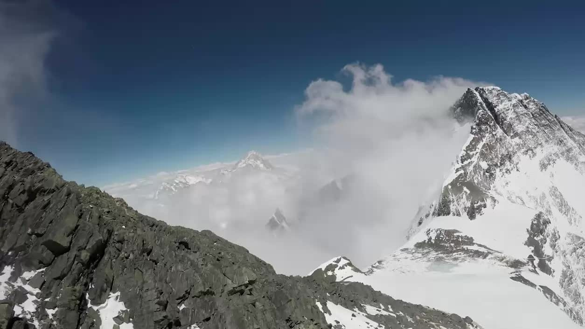

   Dawa Finjhok Sherpa/Seven Summit Treks, for The New York Times

Five Sherpas surrounded the frozen corpse. They swung axes at the body’s edges, trying to pry it from its icy tomb. They knocked chunks of snow from the body, and the shattered pieces skittered down the mountain. When they finally freed a leg and lifted it, the entire stiff and contorted body shifted, down to its fingertips.

The sun was shining, but the air was dangerously cold and thin at 27,300 feet above sea level. A plume of snow clouded the ridge toward the summit of [Mount Everest](https://www.nytimes.com/2017/12/18/sports/climb-mount-everest.html), so close above. When the Sherpas arrived — masks on their faces, oxygen tanks on their backs — the only movement on the steep face came from the dead man’s frayed jacket pockets. They were inside out and flapping in the whipping wind.

More than a year of exposure to the world’s wickedest elements had blackened and shriveled the man’s bare face and hands. His hydrant-yellow summit suit had dulled to the hue of a fallen leaf. The bottom of his boots pointed uphill. His frozen arms were bent at the elbows and splayed downhill over his head. It was as if the man sat down for a rest, fell backward and froze that way.

The Sherpas picked at the body and used gestures and muffled words to decide how best to move it off the mountain. The ghoulish face and bone-white teeth scared them, so they covered the head with the jacket’s hood.

There was no time to linger. That altitude is called the “death zone” for good reason. The Sherpas knew from experience how difficult it was to scale the world’s highest mountain. The only thing more daunting might be to haul a dead body back down.

The man’s name was Goutam Ghosh, and the last time anyone saw him alive was on the evening of May 21, 2016, when it was obvious that he would become another fatality statistic, soon frozen and as inanimate as the boulders around him.

Ghosh was a 50-year-old police officer from Kolkata, part of a doomed eight-person expedition — four climbers from the Indian state of West Bengal and four Sherpa guides from Nepal — that ran out of time and oxygen near the top of Everest. The four Bengali climbers were eventually abandoned by their guides and left to die. Three did; only one, a 42-year-old woman named Sunita Hazra, survived, as did the guides.

 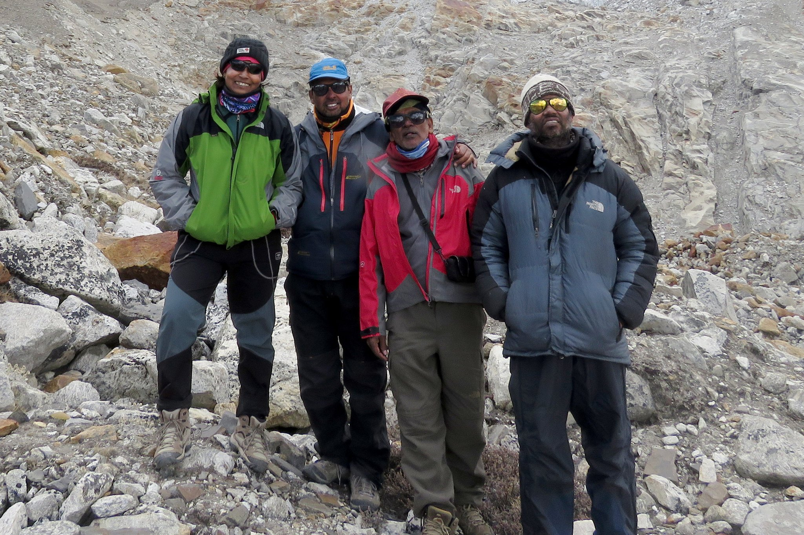

 From left, Sunita Hazra, Goutam Ghosh, Paresh Nath and Subhas Paul shortly before their summit attempt at Mount Everest in May 2016.  Sunita Hazra

At the time of the tragedy, the climbing season for Everest was almost over. On their way to the summit over the next two nights, the last two dozen of the year’s climbers had come upon Ghosh’s rigid corpse on a steep section of rock and ice.

To get around him, climbers and their guides, sucking oxygen through masks and double-clipped to a rope for safety, stripped off their puffy mittens. They untethered the clips one at a time, stepped over and reached around Ghosh’s body, and clipped themselves to the rope above him.

Some numbly treated the body as an obstacle. Others paused to make sense of what they saw — a twisted man still affixed to the rope, reclined on the slope as if he might continue climbing after waking from his awkward slumber.

Apparently abandoned at his time of greatest need, he was a mute embodiment of their worst fears. One climber stepped on the dead man and apologized profusely. Another saw the body and nearly turned around, spooked by the thought of his own worried family back home. Another paused on his descent to hold a one-sided conversation with the corpse stretched across the route.

Who are you? Who left you here? And is anyone coming to take you home?

#### The Ultimate Conquest

   3D model and animation by Jeremy White | Satellite image from DigitalGlobe

Mount Everest occupies a rare spot in the collective imagination — a misty mix of wonder, reverence and trepidation. Hundreds of people successfully and safely reach the summit most years and return home with inspirational tales of conquest and perseverance. Other stories detail the occasional tragedies that leave a few people dead in a typical year. Those disaster stories are now their own genre in books and film.

Where most of those stories end is where this one begins, long after hope is gone — the quiet, desperate and dangerous pursuit, usually at the insistence of a distraught family far away, to bring the dead home. The only search is for some semblance of closure.

That was why the Sherpas with their oxygen masks and ice axes had come this far, this high, more than a year later.

The four Indian climbers, from a vibrant climbing culture in West Bengal, were like so many others attempting Everest. They saw the mountain as the ultimate conquest, a bucket-list item that would bring personal satisfaction and prestige. They dreamed of it for years and made it the focus of their training. As motivation, they surrounded themselves with photographs of the mountain, from their Facebook pages to the walls of their homes.

In other ways, however, they were different. Climbing Everest is an expensive endeavor, something to be both bought and earned. Many climbers are middle-aged Westerners — doctors, lawyers and other professionals — with the kind of wealth that the group from India could not fathom. Some spend $100,000 to ensure the best guides, service and safety.

These four climbers measured monthly salaries in the hundreds of dollars. They borrowed money and sold off possessions simply for a chance. They cut costs and corners, because otherwise Everest was completely out of reach.

Advertisement

Ghosh shared an apartment with eight members of his extended family. Paresh Nath, 58, was a one-handed tailor who barely scraped by with his wife and young son. Subhas Paul, 44, drove a small-goods truck and used his father’s pension to pay for his Everest attempt. Hazra was a nurse, married and raising a son.

They knew one another from the climbing circles of West Bengal, connected more by their common mission than strong friendships.

About 5,000 people have reached the 29,029-foot (8,848-meter) summit of Everest at least once since Tenzing Norgay and Edmund Hillary first did it in 1953. Nearly 300 people have died on the mountain in that period, according to the Himalayan Database, which tracks such things.

Nepal officials estimate that about 200 bodies remain scattered across Everest. A few are so familiar, so well preserved by the subfreezing temperatures, that they serve as macabre mileposts for the living, including one corpse commonly called Green Boots. Other bodies remaining on Everest include those of George Mallory, dating to his fatal attempt in 1924, and the guide Scott Fischer, part of the 1996 disaster depicted in “Into Thin Air.”

Most of the bodies are far out of sight. Some have been moved, dumped over cliffs or into crevasses at the behest of families bothered that their loved ones were someone else’s landmark or at the direction of Nepali officials who worry that the sight of dead bodies hinders the country’s tourist trade.

More and more, however, families and friends of those who die on Everest and the world’s other highest peaks want and expect the bodies to be brought home. For them and those tasked with recovering the bodies — an exercise that can be more dangerous and far more costly than the expedition that killed the climber in the first place — the drama begins with death.

When someone dies, those left behind, from climbing partners on the scene to family and friends half a world away, are immediately faced with enormously daunting decisions and tasks. The rituals, customs and logistics of what happens next are always different.

There are practical considerations, including whether to search for the bodies of those presumed missing or dead, if that is even feasible, and whether to recover the body or let it rest eternally where it is. There are emotional considerations, maybe cultural and religious ones, often in the name of closure, which can mean different things to different people. There are the wishes of the deceased, if those were ever communicated. There are logistical concerns, including danger and cost, local customs and international laws. Sometimes, in some places, recovery of a body is not just wanted, it is needed, to prove a death so that benefits can be provided to a family in desperate need of financial support.

All these things came into play after the bodies of three men from India were scattered high on Everest in 2016. The dim hopes for rescue kindled into demands for recovery, led by the West Bengal government.

Within a few days, in the short window between the last of the season’s summit attempts and the start of the summer monsoon that racks the Himalayas and shuts down the climbing season until the following year, a recovery team of six hired Sherpas tried to find the deceased and carry them down. They had neither the manpower nor the time.

The first they found was Paul, the delivery driver and a part-time guitar instructor who lived with his sprawling family, including his wife and 10-year-old daughter, in the small town of Bankura. He was steps from the well-worn route below Camp 4, roughly 26,000 feet above sea level. He was faceup, but only the toes of his boots stuck out of the fresh snow. It took four hours to chip and pry him from his icy grave and another 12 to drag him to Camp 2, where a helicopter carried the body to Base Camp.

A few days later, thousands crowded Bankura’s rough and narrow streets for a miles-long procession of Paul’s body, which was carried on the open bed of Paul’s small truck. The procession led to the banks of the Dwarakeswar River, where the body was cremated and the soul set free, according to Hindu tradition. There was heartache, but also closure.

 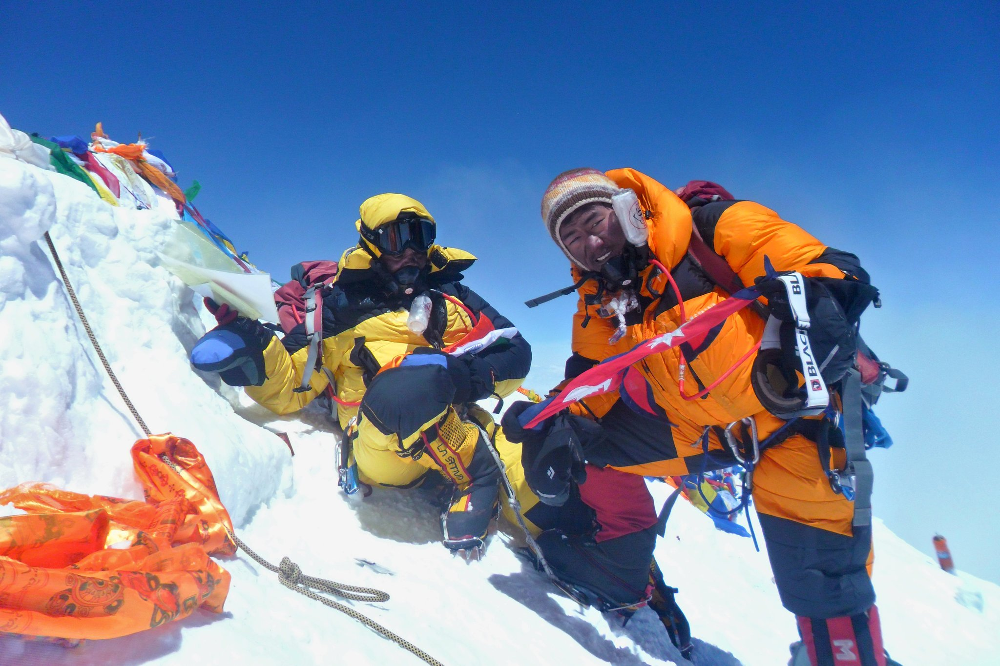

 Subhas Paul, left, and his guide, Lakpa Sherpa, at the summit.  Subhas Paul

 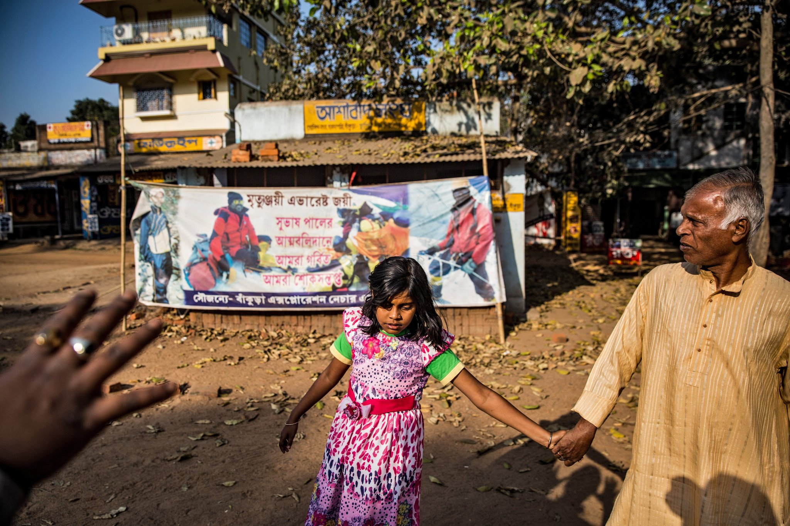

 Subhas Paul’s daughter, Susreeta, and brother-in-law Shayamapada Das.  Josh Haner/The New York Times

 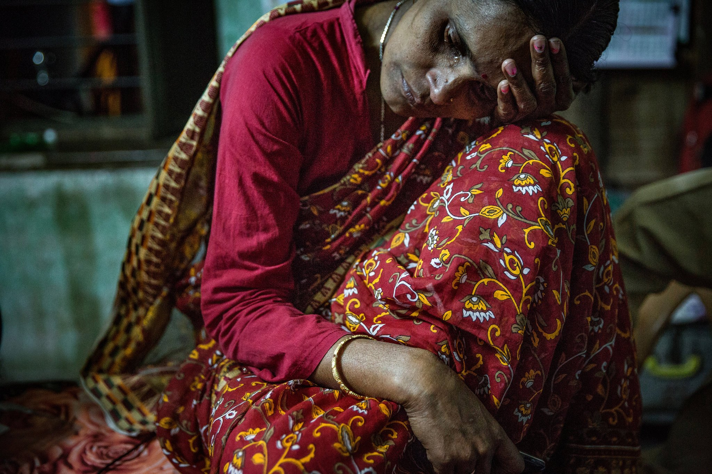

 Bishakita Paul in the bedroom she shared with Subhas.  Josh Haner/The New York Times

Back on Everest, above where Paul’s body was extricated, two of the Sherpas moved up to Camp 4. At roughly 26,000 feet, higher than all but about 15 of earth’s peaks, it sits at the edge of the oxygen-depleted death zone and is the last rest stop for climbers before their final push to the summit. The Sherpas searched the abandoned tents, some shredded to ribbons by wind, until they found the body of another of the missing Indian climbers. They knew it was Nath, the tailor, because he had only one hand, the other lost in a childhood firecracker accident.

Raging winds kept them from climbing any higher in search of Ghosh, and the men were called back. The summer monsoon was on the way, ending the climbing season. Everyone rushed to pack up camp and get off the mountain. Ghosh and Nath, left dead in the death zone, would remain on Everest for at least a year, and maybe forever.

The thought of Ghosh somewhere up there — alone and frozen, or maybe wandering around the Himalayas lost and crying into the wind for help — haunted his wife, his brothers, his mother and all those who lived in the cramped home off Old Calcutta Road, hundreds of miles away. Kolkata lies on the improbably flat and vast plain of the Hooghly River, a slow and wide offshoot of the Ganges in eastern India. There is nothing, not even a hill, to poke the horizon, and the thought of a mountain like Everest feels as far away as another planet.

And so his wife, Chandana, kept the vermilion sindoor in the part of her hair, and the red and white bangles on her right wrist, to indicate that she was a married woman. She would not remove them until she was certain she was a widow. She left the calendar on the wall of the bedroom turned to May 2016. In her mind, that was when time stopped.

“I still believe he is alive,” she said in her home in February. “I am not a widow. I am the married wife to Goutam Ghosh. Not a widow. Unless I see him, and we cremate him, I will not change.”

In the steel town of Durgapur, 100 miles northwest of Kolkata, Nath’s wife, Sabita, tried to move on. She and Nath were poor, even by Indian standards, and she had no money to bring the body home. She and her husband never spoke about what to do if he died, but now she convinced herself that he would want to be left on the mountain. He dreamed about Everest so much that a photo of the mountain was one of the few things that decorated the chipped concrete walls of their bedroom.

Advertisement

The two of them sat side by side through countless nights sewing backpacks and jackets to sell to support his quest. People in town marveled at his ability to cut and sew with just one hand, just as climbers wondered how he could navigate the ropes and harnesses used in mountaineering.

Sabita let herself imagine that she might awake and find him sitting behind his sewing machine. The couple’s 9-year-old son silently pretended that nothing had happened, that his father was simply on a long trip.

That’s what happens when the body is left on the mountain. Death feels like hearsay. Only the body coming through the door at home could make it something more than a haunting phantom in the imagination. Its return could bring honor and closure. It might not answer all the questions, but it could end the nightmares.

But even if it could happen, even if the bodies of Ghosh and Nath were found where they were last seen, and even if impossibly huge sums could be raised to pay to recover them, and even if there were people willing to risk their own lives on Everest to honor the dead and appease the living, nothing could happen right now. It would have to wait a year.

#### The Summit Within Reach

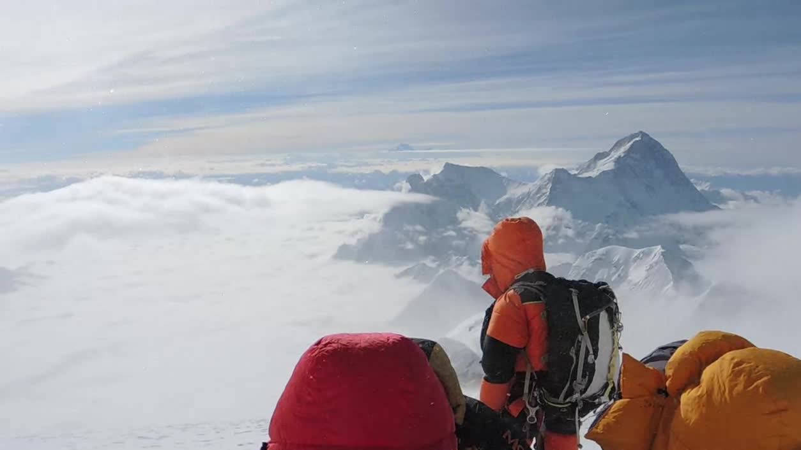

 The climbers paused at the Balcony on their way to the summit.  Sunita Hazra

On the afternoon of May 20, 2016, Ghosh, Nath, Paul and Hazra anxiously rested inside a tent at Camp 4. They wore oxygen masks and bright, bulky snowsuits filled with down. They sipped tea and munched crackers. There was little chatter.

They did not know one another well, but formed a ragtag group of modestly accomplished climbers, joined by their individual desires to summit Everest and their common need for a low-budget expedition. All had spent 10 years or more saving, borrowing and raising money for an Everest expedition. They found a company popular with West Bengali climbers that charged them each about $30,000, cheaper than other outfitters but still a daunting sum, far more than any of them dreamed of making in a year.

Adding to their desperation was that it was their third attempt in three years. Their 2014 quest was scuttled by an avalanche that killed 16 Sherpas, ending the season just as it was about to start. The 2015 season was canceled after an earthquake rocked Nepal in late April, killing nearly 9,000 people. It caused an avalanche that roared into Everest Base Camp, killing 18.

Now, finally, after weeks at Base Camp and on the lower slopes of Everest, they were within reach of the summit. If all went well, they would be back at Camp 4 within 24 hours, on their way home to India, where Everest summiters are revered as conquering heroes. “Everesters,” they are called.

In the early evening, after dark and later than they had planned, they emerged from the tent, each with a guide. (Guides in the Himalayas are often called Sherpas, though not all are part of the ethnic group of Sherpa, from which many take their surname.) The sky was clear and the moon was full. A line of headlamps slinked up the face of the mountain above them.

The summit of Everest cannot be seen from Camp 4, but much of the route can. It leads up a series of ropes, used by every Everest climber, that are tied to anchors drilled into the rock and ice and set by Sherpas at the start of the season.

The route leads across a barren ice field, sliced with deep crevasses, and shoots up a steep and rocky slope until it reaches a small flat spot, a burr on the side of the mountain. The landing is known as the Balcony, and from there it is two hours or more along the exposed, knife-edged Southeast Ridge to the South Summit — at 28,700 feet, it would be the world’s second-highest peak, if it were considered separate from Everest. From the South Summit, the top of Everest finally emerges in full view, tantalizingly close up a serrated ridge.

The round-trip journey from Camp 4 takes some people less than 12 hours, and experienced guides and climbers know that it should take no more than about 18 — 12 hours up, six hours back. Most follow a rule that at a predetermined time — rarely later than noon — all climbers still moving up should retreat. Prolonged exposure is dangerous, and sometimes deadly, because of the unpredictability of afternoon weather, the limited number of oxygen bottles that can be carried and the toll caused by extreme elevation and temperatures.

A woman and two guides were the first of 74 people to reach the summit that day, at 3:36 a.m., according to the Himalayan Database. The last recorded time for climbers reaching the summit was 11 a.m.

The West Bengal expedition stood at the Balcony well after dawn, resting and taking in the majestic views of snow-covered peaks and cloud-shrouded valleys. There were four clients and only three guides because Nath’s guide appeared to stay behind at Camp 4, for reasons never understood. Other climbers were already coming down, having reached the summit hours before.

The Base Camp manager for the Indian expedition received a radio call from Bishnu Gurung, the only one of the group’s guides with experience reaching the summit of Everest. He said he recommended to the clients that they turn back, but they refused.

“I told them, ‘If we are still on the Balcony at 10 in the morning, how can we reach the top?’ ” Gurung said.

Ghosh cried at the prospect of giving up, Gurung later said. Paul began ascending on his own.

“I stopped there just to check if he will return back if I didn’t continue,” Lakpa Sherpa, Paul’s guide, said. “I thought he would listen to me. Sherpas can’t use force or hit him in that situation. They are our guest. All we could do is convince. As he wasn’t convinced, I followed him.”

Only Nath was persuaded to turn back to Camp 4. The three other Indian climbers persisted. The three guides joined them, carrying a dwindling amount of oxygen and a growing sense of dread.

“I thought that I won’t return back,” Lakpa Sherpa recalled.

#### ‘It’s Late’

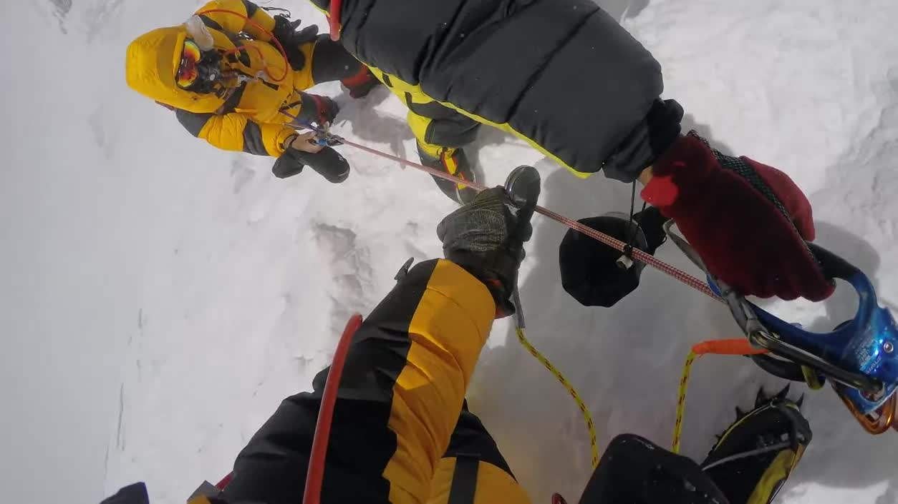

   Paul Pottinger

Throughout the late morning and early afternoon, dozens who had reached the summit descended past the Indian climbers. Paul Pottinger, a Seattle doctor, reached the summit at 7:48 that morning. He wore a camera on his head to record much of his daylight descent on the rope, a one-way lane used by both those going up and coming down. Negotiating past oncoming climbers can be a slow, clumsy and dangerous exercise.

Pottinger passed Paul and his guide, Lakpa Sherpa, well below the South Summit. Lakpa Sherpa asked for the time. Pottinger lifted the sleeve of his jacket to expose his watch, visible to the camera. It was 10:23. He repeatedly told the guide that it was 10:20. He later speculated that the guide wanted Paul, his client, to hear how late it was.

“Who climbs Everest without a watch?” Pottinger said months later. “Now I wonder if he had a watch. And I wonder if he was really saying, ‘Please tell my guy to stop because I can’t.’ ”

Advertisement

Minutes later, Pottinger passed Pasang Sherpa, Hazra’s guide, climbing alone. At 10:45, on a particularly steep pitch at an anchor tangled in a knot of ropes, Pottinger passed a group of three: Ghosh, Gurung and Hazra.

“The timing could scarcely have been worse for all of us, jammed together at the steepest section of the day,” Pottinger wrote in an online diary of his expedition. “But they made it by and continued up. *How many more people will be headed up at this time of day? Damn it’s late.* But, as before, I said nothing to them about this. And, as before, it haunts me to this day.”

Paul and Lakpa Sherpa reached the summit at 1:45 p.m., according to the camera later recovered from Paul’s body. There were 31 photographs taken at the summit over 16 minutes.

The others in their group — Ghosh, Hazra, Nath and their guides — were somewhere below.

 

 Sunita Hazra in a tent at Base Camp.  Sunita Hazra

 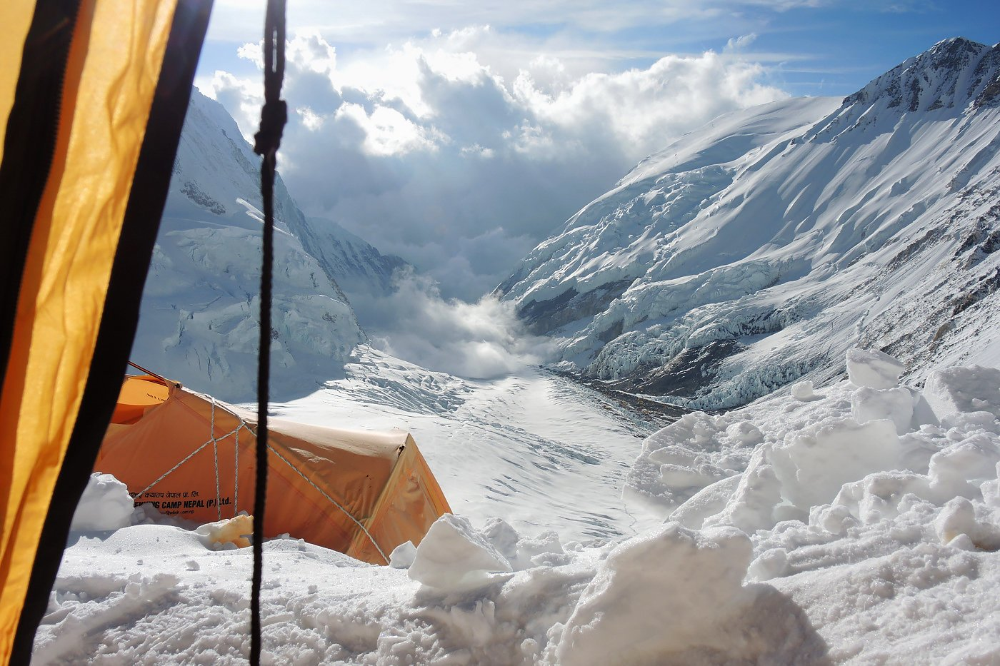

 The view from Camp 3.  Sunita Hazra

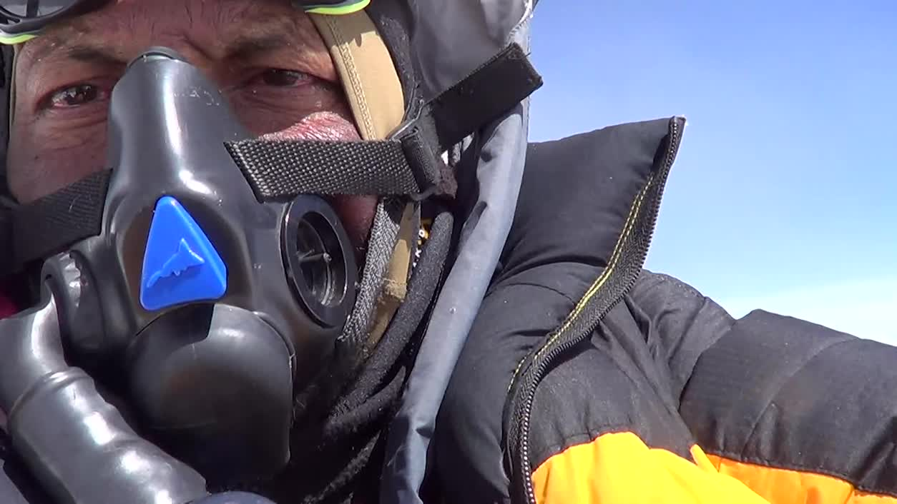

 Goutam Ghosh turned the camera on himself.  Goutam Ghosh

The last photograph of Ghosh taken with his camera appeared to be at the South Summit at 1:57 p.m. He wore an oxygen mask. He held flags and banners that he had carried in his backpack. A video recorder dangled around his neck. Ghosh turned it on.

Wind whipped through the camera’s microphone, but not enough to obscure the sound of Ghosh’s quick-paced breathing. It was as if Ghosh were checking himself in a mirror. With a bare hand, he lifted his sunglasses to his forehead. His eyes were bloodshot. He pulled his oxygen mask to his chin, briefly showing his teeth and his gray-speckled mustache.

“Goutam,” a voice said, and Ghosh glanced in its direction, put his mask on and reached to turn off the camera. It was the last record of him alive.

Yet Gurung, Ghosh’s guide, apparently kept going, alone. About 40 minutes later, he photographed himself 21 times with Ghosh’s camera at what appeared to be the summit. There was no sign of Ghosh.

(Hazra, the lone survivor, said that she reached the summit at about 3 p.m. There is no evidence that she got there. She has petitioned for a summit certificate from Nepal’s Department of Tourism, the arbiter of such matters, without success.)

#### Stop or Continue?

 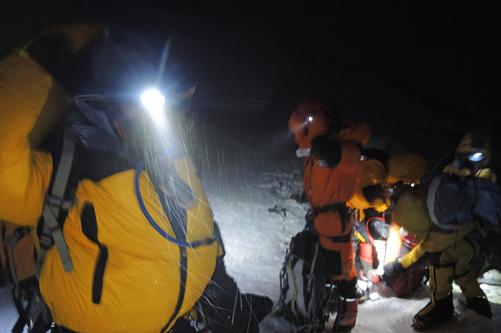

 The expedition setting out from Camp 4.  Sunita Hazra

In the area above 8,000 meters (over 26,000 feet), from Camp 4 to the summit, a dearth of oxygen and brutal weather kill those who dare stay exposed too long. As altitude increases, atmospheric pressure decreases, and with the thin air comes less oxygen for the lungs and the bloodstream.

The body tries to overcome it by sending more blood to the brain, which can cause swelling, leading to symptoms like headaches, nausea and exhaustion. At extreme heights, a condition known as high-altitude cerebral edema can also cause a lack of muscle coordination, impaired speech, confusion and hallucinations. As the body continues to fight for equilibrium, it sends blood to the lungs. High-altitude pulmonary edema results in coughing and major breathing problems.

The sun’s strong rays at high altitudes can burn the skin and eyes, causing snow blindness. The subfreezing temperatures, exacerbated by perpetually strong winds, cause frostbite, killing the skin and the underlying tissue, especially in the extremities.

Confused and numb, climbers sometimes react to the onset of hypothermia by shedding their clothes, believing they are burning up, not freezing to death. It is why those who die in extreme conditions, like the ones on the slopes of Everest, are often discovered in a state of undress.

 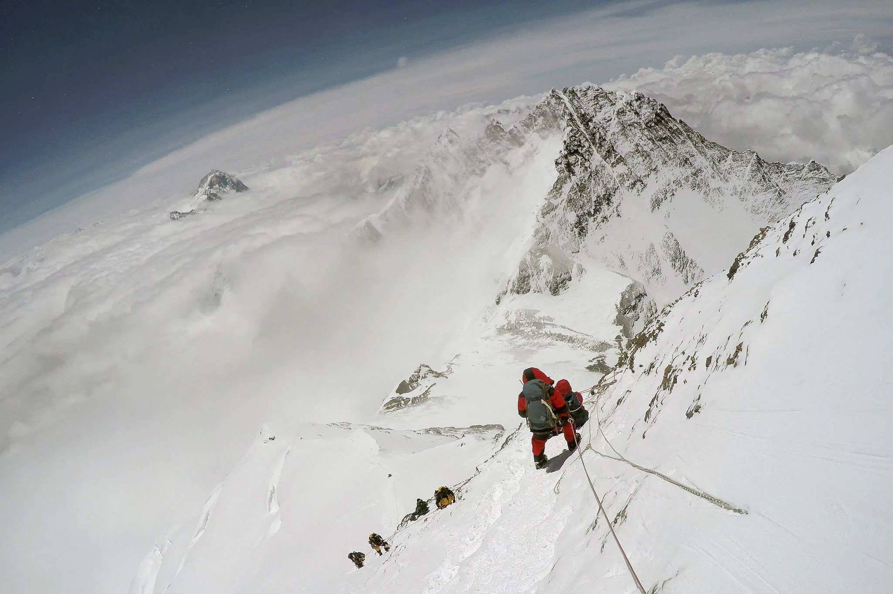

 An image from the video camera of Paul Pottinger, a Seattle doctor, on his descent. The climbers coming up the mountain include Goutam Ghosh; his guide, Bishnu Gurung; and Sunita Hazra.  Paul Pottinger

Back in West Bengal, vague and inaccurate news reports spread quickly on May 21: The climbers had reached the summit. The houses of the climbers filled with friends offering congratulations and customary sweets.

By nightfall, however, the festive moods faded. Updated reports from Everest arrived. The West Bengali climbers were lost on their way down.

That evening, down at Camp 4, the first group to leave for a summit attempt included an experienced American climber and photographer, Thom Pollard, and his Nepali guide.

Advertisement

They first passed a Sherpa, then another, both cold, scared and without oxygen. Then they came across climbers below the Balcony. One was a woman. One was a man in a yellow snowsuit, lying sideways across the hill, still attached to the rope. His hands were uncovered. He appeared close to death.

Options for would-be rescuers are few at such extreme altitudes. Climbers carry finite amounts of oxygen, just enough for their own expected need, because of the weight of the canisters. They worry about their own survival, knowing that extra time exposed to the elements can prove fatal. They are often in a depleted state, physically and mentally. Even if they have all their faculties, they have paid tens of thousands of dollars, perhaps devoted many years of their lives, to this one day, and might be reluctant to abort it all for a faceless stranger whose needs cannot be assessed easily and who, most likely, speaks a different language.

Pollard and his guide stopped, discussed the situation and continued past.

“I’ve wrestled with this for a year,” Pollard said from his home in New Hampshire.

Pollard and his guide were the first to summit on the morning of May 22, at 2:40 a.m. On their descent, still in the dark, they were relieved to see Hazra was gone. There were marks in the snow where she had either scooted downhill or been dragged away.

But Ghosh was still there, splayed on the slope and now alone.

“He was dead,” said Pollard’s guide, Lhakpa Gyaljen Sherpa. “I shouted: ‘Hello, hello!’ There was no response. Looking at his face, he was dead. That’s why the others must have left him.”

Like everyone else who went up and back for the remaining days of the season, they stepped over him, clipped out of and back onto the rope around him, and continued down.

Sunita Hazra’s memories of that night are spotty, but she remembered leaving Ghosh, her closest friend on the expedition.

“I told Goutam, ‘You must come,’ ” she said in the living room of her home near Kolkata. “I thought if I started moving downward, he would follow me. I had neither the strength to help him or to even look behind me to make sure he was coming.”

She believes she would have died, too, if not for Leslie Binns, a British climber who was ascending above Camp 4 when he found her with her mittens off and her jacket unzipped. He gave her a shot of oxygen, which lifted her energy, but soon realized she would not make it to Camp 4 on her own. He aborted his own summit attempt to drag, encourage and cajole her downhill.

They soon discovered Subhas Paul, in a dazed and hypothermic state of his own. Binns slowly coaxed the two Indian climbers down, sharing hits of oxygen and trying to lift them when they collapsed. They lost track of the roped route. Paul fell into a shallow crevasse and flailed his arms.

Binns eventually made a decision to try to save one or the other. Figuring Paul had energy to expend, he chose Hazra and escorted her to a tent.

“When I got to Camp 4, Subhas was not behind me,” Hazra said. “I thought he was there. I thought Goutam and Nath were somewhere safe.”

Some in Camp 4 later awoke in the night to someone shouting, rhythmically but incoherently, over and over. They presumed it came from within the camp, part of another expedition. No one ventured into the dark to explore.

When climbers emerged from their tents in the first rays of sunlight, they realized the shouting was from Paul, about 100 yards uphill from camp. He had been out in the elements for at least 32 hours.

Hazra and Paul were reunited with their three guides in the tent. They did not know where Ghosh and Nath were.

By midafternoon, persuaded by doctors from other expeditions to get to lower altitude immediately, the group was on its way downhill again, without Ghosh and Nath, carrying the last bits of oxygen it had stashed at Camp 4. Paul soon collapsed.

“Subhas started getting very weak,” Lakpa Sherpa said. “He wasn’t getting better even after supplying oxygen. His hands froze. We tried very hard to rescue him from there.”

Two guides stayed with Paul. The third led Hazra downward, but soon left her behind, feeling he was in worse condition than she was, suffering from frostbite on his hands and feet. Darkness came, bringing snow and wind.

Alone, Hazra fell and broke her wrist. She had frostbite on her hands. Eventually, the other two guides caught up to her.

Advertisement

“I understood from the Sherpas that Subhas sat down to rest,” Hazra said at her home earlier this year. She began to cry. “And they left him,” she said.

Hazra and the guides made their way to the icy landing spot above Camp 2, where a helicopter winched Hazra to Base Camp. Ferried to Kathmandu, she was hospitalized for her injuries. A few days later, she received a hero’s welcome at the airport in Kolkata.

She knew little of what happened behind her, up the mountain. At about the time that Paul, Hazra and the three guides left Camp 4 to descend toward Camp 3, another Indian expedition returning from the summit spotted Nath off the trail in afternoon light. He was upright and alive, mindlessly digging into the ice with his one hand.

Nath was carried to Camp 4. His eyes were swollen shut with snow blindness.

By the next morning, the last day that anyone would summit Everest for the season, Nath was too weak to hold a bowl of soup. He died in a tent at Camp 4.

Goutam Ghosh was still somewhere higher on the mountain. At least 27 people stepped over him on their way to the summit and again on their way down before the season ended and the mountain emptied for most of a year.

#### A New Season

 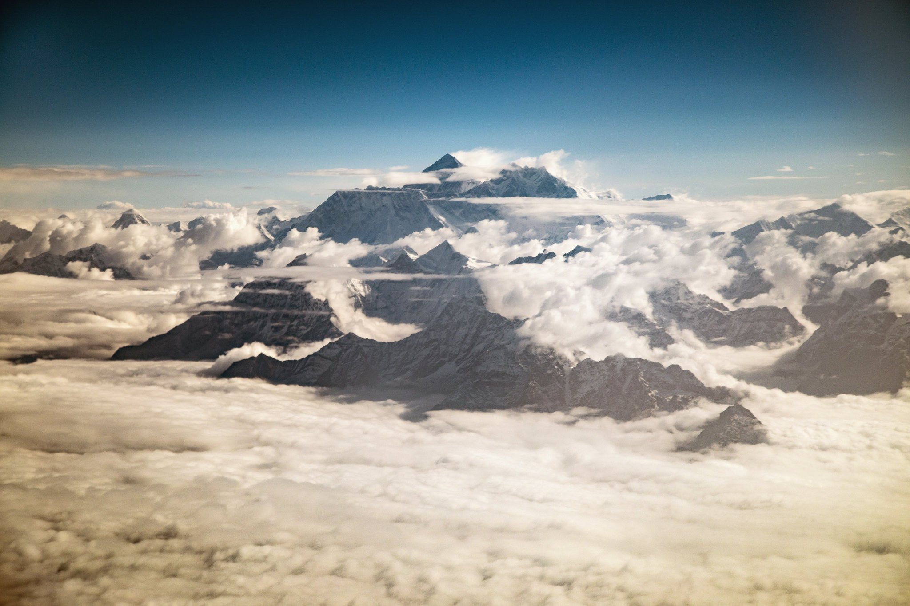

 Mount Everest.  Josh Haner/The New York Times

Every spring, as hopeful climbers from around the world trek to Everest Base Camp in Nepal, an elevation of about 17,500 feet, to begin acclimating for a summit push in May, a team of local Sherpas is hired to create the season’s route up the mountain. They establish the course up more than two vertical miles that hundreds of others will follow.

First, the “icefall doctors” set ropes, ladders and makeshift bridges through the notoriously dangerous, ever-shifting Khumbu Icefall immediately above Base Camp. Others keep moving upward, setting anchors and stringing ropes until they reach the summit. The process can take weeks, and is often delayed by bad weather.

Only when the ropes are fixed to the top does the Everest climbing season open. It usually lasts only a few weeks, squeezed between the route opening in early May and the projected start of the monsoon at the end of the month.

Everest is rarely climbed at any other time of the year. That meant the rope-fixing Sherpas were likely to be the first to see Ghosh and Nath, if their bodies were still there from the year before. The forces of wind, snow, ice and gravity could have moved them or hidden them.

Nath was last seen in a tent at Camp 4, at more than 26,000 feet, which gets battered into something unrecognizable from one year to the next. Ghosh was last seen higher on the mountain, clipped to a rope on a steep section called the Triangular Face, just below the perch called the Balcony. If that rope from last year’s route was damaged — perhaps by a falling piece of ice — Ghosh’s body could have fallen and disappeared for good.

There were three major reasons the Ghosh family desperately wanted Goutam’s body returned. The first was emotional. The idea that he lay near the summit of Everest, alone, exposed to the elements, left to serve as a tragic tourist marker for future climbers, was nearly too much to bear. And they wanted answers about what happened. Maybe his body could provide those answers. Maybe that video camera around his neck, if it was still there and still worked, held clues. Maybe there were memory cards from his camera in his pockets or backpack. Maybe a message for the family. Something.

The second was religious. Hindus believe the body is merely a temporary vessel for the soul. Once the soul is severed from the body through cremation, it is reincarnated in another body. Like most in West Bengal and across India, the Ghoshes were devoutly Hindu. To them, closure required a cremation, and all the ceremonies that came with it.

The third reason, as important as the others, was financial. Legally, in India, Ghosh was considered a missing person. Only when a body was produced, or seven years had passed, would the Indian government issue a death certificate, which the Ghosh family needed to gain access to his modest bank accounts and to receive financial death benefits like life insurance and the pension he had earned as a police officer.

Ghosh was a police sub-inspector, the second in command at the local precinct of the Kolkata police. It was a good job that paid about $500 a month. Ghosh was a talented player of tabla, the Indian bongo-like drums, and sometimes performed with his wife. He took army courses to become an adept equestrian and was known in the neighborhood as a good soccer player. He had been mountaineering and rock climbing for most of his life.

It might seem a strange hobby in Kolkata, hundreds of miles from the Himalayan foothills, but West Bengal is a surprising hive of mountaineering. There are hundreds of mountaineering clubs, in just about every small town and every neighborhood of the cities. Kolkata has dozens of them. The state government heavily promotes the activity through the West Bengal Mountaineering and Adventure Sports Foundation, where a 60-foot climbing wall rises outside its offices.

The foundation gives grants to those who apply with realistic ambitions of scaling the biggest peaks. In the case of Ghosh, Paul, Nath and Hazra, it granted each 500,000 rupees, or about $7,500, toward their quest to climb Everest.

Ghosh was the most experienced of the mountaineers — not a well-known climber in West Bengal, but a respected one. He was an instructor at summer camps held at a climbing center on Susunia Hill, a 1,450-foot hiccup on the plain a couple of hours’ drive northwest of Kolkata. He had successfully climbed a number of 7,000-meter peaks in the Himalayas. In the bedroom he shared with Chandana was a poster of Everest. It hung there for 20 years.

“We try to go through our routines,” Chandana Ghosh said in February. “The peace is not there. We try to eat and we try to sleep. But all the time we are thinking about the beloved man of this family, lying up there all alone.”

Goutam Ghosh was the youngest of three brothers, all in their 50s. They lived with their parents, wives and children in a dim, two-story apartment in the concrete jumble of Barrackpore, a district of northern Kolkata. Their father had recently died. The door from the street led to an outside hallway, open to a sky obscured by rambling apartments, one on top of another, squeezed tight. The bathroom was to the left, a hole behind a half wall and a pitcher of water next to a hose.

Debasish Ghosh, 53, unlike his younger brother, was not a mountaineer. A small man with a bushy mustache and a bit of a paunch, he ran a fast-food stall, serving chow mein and mutton rolls, not far from the family’s home near the Barrackpore train station. He made a vow: If the body could be found, he would bring Goutam home.

 

 Goutam Ghosh’s widow, Chandana, helps her brother-in-law Debasish prepare for his trip to Nepal in hope of returning with Ghosh’s body.  Josh Haner/The New York Times

 A flier for the Goutam Ghosh memorial rock climbing course at Susunia Hill in West Bengal, India.  Josh Haner/The New York Times

 Debasish Ghosh at the outset of his 40-hour trip by train, bus and taxi to Kathmandu to meet his brother’s body.  Josh Haner/The New York Times

Debasish Ghosh hoped that the West Bengal government would coordinate and finance a retrieval attempt a year later. For months, he requested meetings with officials, slowly climbing the government’s chain of command, until he and Chandana met with Mamata Banerjee, the chief minister of West Bengal.

She expressed concern for the cost, Debasish Ghosh said, and asked who would venture up Everest to bring back the bodies. She wondered about the state’s responsibility if members of a recovery team were hurt or killed.

Without a commitment from the state government, the Ghosh family sent a letter to Prime Minister Narendra Modi of India. His office forwarded it to the state government, with a note that said “for action as appropriate.” Secretly, the state government approved money for the operation, but it did not share its plans with the Ghosh and Nath families.

Advertisement

“They were saying that only if the body is located will they take up the decision,” Debasish Ghosh said. “But who will inform us that the body is there? It has to be the Sherpas, because otherwise nobody is obligated to find the body.”

So the family hired an experienced guide who was known among West Bengali climbers and who had been to the Everest summit five times. He told Debasish Ghosh that he would recover his brother’s body for 26.3 Indian lakh rupees, or roughly $40,000, more than the cost of Goutam Ghosh’s original expedition.

The family agreed to pay 2.5 lakh (about $4,000) upfront, to organize and buy oxygen for those who would make the initial search, following closely behind the rope-fixing teams. The rest would be paid at intervals along the way — when photographs were produced, for example, and when the body reached Kathmandu.

The Ghosh family did not have the money, but agreed to sell a small lot in Kolkata that Goutam owned, where he hoped to someday build a house. They sold jewelry, including a gold necklace that Chandana wore for her wedding. Family members and mountaineering club members scrounged the small bits of savings that they had. By early May, as the rope-fixing team was doing its work, it was still not enough.

“We have arranged about 20 lakh so far,” Debasish Ghosh said in Kolkata.

A day later, too anxious to wait helplessly any longer, he packed a small yellow daypack with a few changes of clothes, plastic containers of homemade chicken and roti, and a folder of paperwork, protected in plastic sleeves. The sleeves held copies of Goutam Ghosh’s identification card, his police service card, his permit for climbing Everest — all things that would help identify a body and cut through the logistics of bringing it home.

He knelt at his mother’s bed and touched his mother’s feet, a sign of respect. He prayed with her as she cried. He stepped into the hot sun and through a huddle of well-wishers. Accompanied by one of Goutam Ghosh’s friends, he waved and disappeared around a corner, swallowed by a street filled with cars, rickshaws, scooters, bicycles, walkers and cows, and walked to the train station.

“I cannot keep my mind cool staying at home,” Debasish said. “I want to be closer.”

After two trains, two buses and 40 hours, the two men were in Kathmandu. They found a $5-a-night room to share, and waited.

#### ‘Let Him Be’

 Sabita Nath and her husband, Paresh, spent many late nights at sewing machines to make backpacks and jackets that supported Paresh’s quest.  Josh Haner/The New York Times

The rope-fixing team reached Camp 4 on April 23, but weather stopped the Sherpas from going higher. The team descended to refresh at lower altitude in anticipation of its next push, carrying rumors that a body was seen amid the tatters and rubble at Camp 4 — the body of Paresh Nath, presumably.

His wife, Sabita Nath, had little communication with the government for nearly a year. No one reached out to the family to discuss what might happen if the body was found. No one, in fact, had asked her if she even wanted her husband’s body back.

Sabita Nath did not share her tiny home with a large, extended family. With her husband gone, it was just her and their 9-year-old son, Adrishikar, living behind a storefront where her husband sold his handmade backpacks and jackets.

“After a while, I began to think there is no reason to bring him here,” she said at her home one day, sitting near the sewing machines where they used to work side by side. “He loved the mountains like God. If he is there, let him be. His soul must be happy somewhere.”

She and Paresh were not deeply religious. Some of Nath’s relatives performed rituals after it was clear that he had died in 2016, but Sabita did not attend. She allowed herself the traditional 10 days of mourning, then removed all the signs of being a wedded woman — the circular red bindi from her forehead, the vermilion sindoor along the part of her hair and the red and white bangles on her wrist. She was a widow.

Money was an issue. Paresh Nath once had a life insurance policy, his wife said, but the premiums were not paid and it was worthless. Sabita got busy at her sewing machine, making simple nylon shopping bags she sold to a nearby grocery market for about 1,500 rupees (about $23) per month. Climbers and friends provided donations of about 2,500 rupees per month ($39) to keep her financially afloat.

 A picture of Paresh Nath in the small shop at his home where he sold backpacks and mountaineering supplies.  Josh Haner/The New York Times

 Adrishikar Nath, now 10, did not ask if his father was dead for much of the year after he did not come home.  Josh Haner/The New York Times

For most of a year, Adrishikar did not ask if his father was dead, and his mother did not have the heart to tell him.

“I tell him that papa has built a room on Everest that he is living in,” Sabita Nath said in February. “I can’t tell him the real fact, that he is gone.”

Like many Indians, the Naths ate without utensils, and Adrishikar carefully washed his father’s one hand after meals. Paresh Nath drove the boy to school on a scooter even though he had no license because of his disability. Theirs was a special bond, Sabita Nath said, and her focus was on the boy’s well-being, not her husband’s body.

Advertisement

“Even if the government brings the body, what’s the use to me?” she said. “It is just a mortal body. To me, the more urgent thing is a job, so I can raise our son. To bring a body from Everest is a huge cost. And I cannot spend that money.”

If the government wanted to help financially, she said, the money would be better spent on her son’s education than on her husband’s dead body. She reiterated her stance in May, just before photographs of Nath’s body appeared on social media. He was identified by his boots and the snowsuit he had sewn himself.

Nath’s family and friends were stunned by the photographs. Sabita experienced chest pains and went to the doctor.

“I felt sick,” she said afterward at her home in Durgapur. “Until that day, I was trying to console myself by thinking that maybe he was still alive and only lost.”

#### The Red Tape

 Climbers working their way across the Summit Ridge. The true summit is hidden a few meters beyond this view.  Paul Pottinger

The route to the summit of Everest changes slightly each year, depending on variable conditions, like the snowpack or snow slides. In 2017, it opened on May 15, later than usual. The new route was strung near previous ones, and the worn, faded ropes of past seasons could be seen threaded among the rocks and through the snow.

The rope-fixing team returned down the mountain and reported seeing a body most of the way up the Triangular Face, below the Balcony — just where Goutam Ghosh’s body was last seen, about 360 days before.

“I think that was the body of the Indian climber,” Chime Chundub Gurung, one member of the team, said at the airport in Kathmandu a few days later. “The body was upside down with legs up. It was very close to the new rope. I didn’t touch it, and I didn’t see the face. I only saw boots, and he was wearing mountaineering clothes.”

The hundreds of climbers below, eager for the route to open and seeing a forecast for good weather, began to stream toward the summit. Within days, dozens reached the summit and came back again. Few of them saw Paresh Nath’s body, stashed away on a far side of Camp 4. But every one of them climbed within feet of Ghosh’s body.

The first photographs arrived on Tuesday, May 16. Debasish Ghosh received one on his phone at 6:17 that evening while sitting at his hotel. Numbly, he stared at it, tugging the edges with his fingertips to zoom in for a better look. He sent the message to his son and to Chandana at home in Kolkata. He also sent it to Sunita Hazra, the only survivor among the four Indians in the expedition the year before.

The photo showed a body in a faded yellow snowsuit bent like a horseshoe and half-buried in snow. It looked like something archaeologists were midway through excavating. There was no face visible, but the boots and the gear matched what Ghosh was wearing a year before. The pattern of the yellow-and-black snowsuit matched what Sunita had in her closet at home, the one she bought alongside Ghosh at a little shop in Kathmandu.

 Goutam Ghosh’s body was discovered nearly a year after he was left dead on the mountain.  Phurba Sherpa

Everyone agreed: It was Ghosh’s body.

Three men from the West Bengal government rushed to Kathmandu, taking the 90-minute commercial flight that Debasish Ghosh could not afford. They quickly struck a deal with Mingma Sherpa, the owner of Seven Summit Treks, a major Himalayan expedition company based in Kathmandu. The sides agreed on a price that the government would pay for the two bodies to be recovered: $90,000, roughly the amount the government quietly set aside weeks earlier. The government announced it would pay for the retrievals.

Sabita Nath and Chandana Ghosh received calls from a government official asking them to sign a “no objection” certificate to allow for the attempted recoveries. They agreed.

Nepal’s Department of Tourism, which oversees the country’s mountaineering trade, placed only one major provision on the operation: It did not want the bodies coming down at the same time that hundreds of climbers were going up.

“We just want to ensure that other mountaineers who planned to go up this season will not be hampered,” Director General Dinesh Bhattarai said. “I have talked to them, and they will try to bring them down at nighttime, and when there are less climbers moving up.”

The issue, he admitted, was one of optics as much as congestion.

“The climbers, they know pretty well that it is dangerous, and they are ready to encounter these kinds of incidents,” Bhattarai said. “They are mentally prepared for that. It’s more about not hampering the existing climber. But at the same time, we are also concerned about what they see.”

It was also a matter of practicality. Digging out and dragging a body off the mountain typically requires at least six Sherpas. This effort needed about a dozen people. And most of the Sherpa guides were either still on the mountain with clients, or just returning, too exhausted to turn right back around and go up.

The days of waiting piled up.

#### The Retrievals Begin

 Sherpas used axes to pry Goutam Ghosh’s body from the mountain.  Dawa Finjhok Sherpa/Seven Summit Treks, for The New York Times

It was late May, the tail end of the Everest climbing season, when five hired Sherpas quietly left Camp 2 at 1 a.m. Into the dark they carried ropes and oxygen canisters, but no food, only a little bit of water and a plastic half-liter bottle of Coke. The Coke froze quickly in the bitter temperatures, even inside their packs. When they wanted a sip, they used a small stove to melt ice and put the bottle in the warm water to turn it back to liquid.

They turned their oxygen on low at what they called the “crampon point,” an hour above Camp 2, where the trail becomes predominantly ice and climbers attach crampons, with fang-like spikes, to the soles of their boots.

Sherpas typically use oxygen only in the death zone, at Camp 4 and above, but they wanted to move quickly. Oxygen was fuel, feeding the lungs and the blood, and it allowed them to keep a brisker pace than usual. Each man had two bottles, enough to last about 24 hours, they figured.

Advertisement

The leader was Dawa Finjhok Sherpa, a 29-year-old guide who had been to the summit of Everest five times. He received a call a couple of weeks before from Mingma Sherpa, the owner of Seven Summits. The company needed an experienced guide to lead an expedition to retrieve a pair of bodies, he was told.

(The New York Times hired Dawa Finjhok Sherpa, through Seven Summits, to shoot video of the retrieval effort.)

Guides often did two, even three, major expeditions in the Himalayas each spring. By late May, many were either already home or exhausted. Mingma Sherpa dangled a $3,000 payout for a few days of work and scrounged up about a dozen men. He promised beer if they were successful.

Like most Sherpas, Dawa Finjhok Sherpa did not love working as a guide, carrying heavy loads and the hopes and demands of foreigners — and sometimes the foreigners themselves — up and down the world’s highest peaks. But it paid better than anything else.

Many of the guides came from remote villages, and there was little work there. Some, like Dawa Finjhok Sherpa, were from Kathmandu. They knew that more conventional jobs, in construction or retail or finance or anything else, wouldn’t give them the same money for the same amount of work. But it did not mean they liked it.

“I’ve almost quit this job,” Dawa Finjhok Sherpa said over a beer in Kathmandu one evening, “because there are so many ways to die.”

About 11 a.m., the retrieval Sherpas reached Camp 4, a ghost town of abandoned tents and gear so late in the season. They heated their Cokes and sipped from the plastic bottles, but did not dawdle. Once rested, the five men stood in the midday light, put on their packs, secured their oxygen masks and kept moving, up the Triangular Face toward the Balcony of Everest, looking for a frozen man who had waited a long time for someone to take him home.

A few hours behind them, following the same route, six more Sherpas left Camp 2 and headed to Camp 4. Their mission was to recover Paresh Nath.

The danger increased with every foot of altitude toward the summit, where the air grew thinner and the chances of rescue, should anything go wrong, grew slimmer. The same threats faced by climbers from around the world were faced by Sherpas from Nepal. But Mingma Sherpa, an experienced climber himself, said no mission to recover bodies was off limits, if the price was right.

“Above the South Summit, from the South Summit to the summit, we might have to think about it,” Mingma Sherpa said. “But below the Balcony, the only question is weather. I cannot fight the weather. The technical part, we can handle. The weather can kill us.”

If it all went right, then, the bodies of the Indian climbers would return from Everest. They would be among the highest-altitude recoveries ever made.

At 1:39 local time on a Wednesday afternoon, the recovery team searching for Goutam Ghosh got to his body, a pale-yellow crescent on a steep black-and-white backdrop, icebound between jagged rocks the color of coal.

The head was downhill, the face turned slightly to the outside. The arms were splayed overhead, the back was arched and the feet were curled to the right. His once-bright clothes were bleached by the elements. So was the rope that was still attached to the rigging around his waist. It was red when all the Everest summiters of the year before climbed it, but was now faded to a dusky pink.

There were no signs of his depleted oxygen bottles, probably scavenged and sold in Kathmandu for a hundred dollars. There were no signs of his mittens, likely pulled off by Ghosh in his final desperate, hypoxic moments. The snowsuit was unzipped to the waist, a sign that hypothermia had tricked Ghosh into thinking he was overheating.

A skull cap that Ghosh wore the day of the summit attempt was still on, but the yellow down-filled hood attached to his snowsuit was loose and filled with snow. It was still knotted where Ghosh had cinched it at the chin. His hands were bare, black and leathery, like his face. His white teeth, like the silver crampons still attached to his boots, gleamed in the sunshine.

The men were able to pry Ghosh’s hood loose and pull it over his face. They tied the hood with rope so they would not have to see the face.

“At first when we saw him, we were a little bit afraid,” Dawa Finjhok Sherpa said. “If we don’t see the skin, it’s easier.”

The Sherpas connected Ghosh to a new rope, anchored in a rock about 30 feet uphill, and used ice axes to dig and pry the body from the snow. When the body moved, it moved as one piece, without torque, all the limbs, muscles and joints frozen solid. Pulling on a wrist turned the body all the way to the toes. Once the body was freed from the mountain’s grip, the men hammered blocks of ice from it. Dawa Finjhok Sherpa estimated the load weighed more than 300 pounds, double Ghosh’s weight when he was alive. Two men could not lift the body. Three struggled to maneuver it.

They tied ropes through Ghosh’s carabiner. They lowered him by rigging a pulley-type system through the same anchors used for climbers attempting the summit. They used Ghosh’s jumar, a ratcheting device used in climbing, to help belay the load, sliding it downhill one stretch of rope at a time.

They had the mountain to themselves above Camp 4, which they could see far below in the saddle between Everest and Lhotse.

“It was easier because there was a lot of snow this year, so the rocks were covered in snow and we could slide him,” Dawa Finjhok Sherpa said. “But the snowy, flat areas were hard. He was heavy.”

Advertisement

Not far from where they found Ghosh’s body that morning was another body that Dawa Finjhok Sherpa estimated had been there for five or six years. And somewhere nearby, they knew, was the body of a doctor from Alabama who had died a few days before. There was no plan to bring it down.

It took an hour to drag Ghosh’s body to Camp 4, where Dawa Finjhok Sherpa opened Ghosh’s backpack. Inside he found a video camera and a pair of gloves. There were banners and printouts of the India and West Bengal flags, and for the Kolkata police department and Ghosh’s climbing club.

Dawa Finjhok Sherpa put the gloves on Ghosh’s hands and put the video camera in his own backpack. He left Ghosh’s backpack at Camp 4, with the wind-torn remains of the 2017 climbing season.

The recovery team had a rolled-up plastic toboggan that it intended to use as a stretcher, but Ghosh’s body was too stiff and contorted to fit on it properly. So the men found an abandoned blue plastic tarp, wrapped it around Ghosh’s lower body and lashed it tight with mismatched pieces of rope. They found a thin, gray foam sleeping pad and did the same thing for his upper body.

The men tried to keep the body on its back, but it slid better facedown. Soon the snowsuit was ripped open at the elbows, spilling down feathers.

By nightfall, the team was pulling, lifting and sliding Ghosh down the mountain, past where Subhas Paul had died the year before. It came across the group assigned to retrieve Paresh Nath, which was on its way up. There were few other climbers. The mountain was practically empty so late in the season, and those who remained traveled different parts of the slopes at different times. Like drivers familiar with a city’s traffic patterns, the recovery Sherpas knew the rhythms of the route.

They rested in the middle of the night at Camp 3, which is carved into the precipitous ice of the Lhotse Face. A Seven Summits cook had hiked up from Camp 2 to meet them, and fed them noodles and juice. The Sherpas trudged downhill from there.

“I started to make a system to belay the body below Camp 3,” Dawa Finjhok Sherpa said. “My partner was holding the rope, but he fell asleep. He let the rope slip just as I was hooking up our system. Three of us held on as tight as we could and we screamed. We all got rope burns. If we wouldn’t have held on, the body would have slipped down the mountain.”

At dawn, Ghosh’s body arrived at the crampon point. The Sherpas assigned to get his body had been working nearly 28 hours, but Ghosh’s journey was held up, awaiting Nath and the helicopter that would carry them off the mountain.

Clouds shrouded Everest. Ghosh’s recovery team sought shelter down at Camp 2, leaving Ghosh alone on the mountain again. The body was soon covered in snow.

#### Leaving Everest

 The retrieval Sherpas with Goutam Ghosh’s body, just below Camp 4.  Dawa Finjhok Sherpa/Seven Summit Treks, for The New York Times

The body of Paresh Nath, still in the red-and-black snowsuit that he sewed for himself, reached the crampon point at about 2 p.m. on Thursday, May 25. He was wrapped in a malleable, plastic stretcher, with a tangle of ropes laced through grommets at its edges.

Nath’s right hand, his one hand, was bare and appeared to grip a rope across his chest. His other arm was tucked along his side. It was the position he died in a year before. His body was hard as stone.

Their toughest work done, the sun shining again, the Sherpas assigned to Nath’s recovery shed their outer layers. They huddled on the snow and were presented with noodles and juice.

The Ghosh team came up the short distance from Camp 2, and having strapped the contorted Ghosh into a plastic stretcher of his own, his arms sticking over the edges, coaxed both men downhill in their makeshift sleds. It was not an easy journey, the trail pocked by crags and crevasses. In an hour, they got to the helicopter landing spot, nothing but a relatively flat space covered in snow and ice near the tents at Camp 2. At more than 21,000 feet, it is the highest spot on the mountain that most helicopters can reasonably reach.

When the Sherpas called to Base Camp, they were told the helicopter would not come that day. It would come tomorrow, the 26th. The next day, reports were the same. The helicopter would come the 27th.

The excuse was weather; it was raining in Kathmandu, and clouds were thick between there and Everest. What the Sherpas did not know, and what the families of Ghosh and Nath did not know, was that they were also waiting for the body of another Indian climber, one who had died just days before.

A third team of Sherpas hired by Seven Summits had rappelled into a crevasse near the Balcony and pulled him out. The team followed the teams of Ghosh and Nath back down the mountain, and arrived at Camp 2 late on May 26, well after dark.

The biggest expense for most recovery operations is helicopters. Seven Summits wanted to minimize the cost by ferrying three bodies down at once, rather than performing multiple missions over several days.

Finally, on May 28, the bodies were in place and the sky was clear and blue. A helicopter curled around the valley and touched down, just for a moment, in a cloud of blowing snow. Its skids briefly tickled the slope, and the helicopter spun sideways. Its tail nearly wiped away the man trying to direct it.

Advertisement

The pilot brought it around for another try, flying about 10 feet above the ground as he approached. The helicopter landed and slid 20 or 30 feet before it stopped. The pilot kept the rotors on to hold the copter on the icy shelf. Three men pulled Ghosh’s body to the vessel, and a fourth helped them lift it into the small space behind the pilot, who breathed oxygen from a tank through a tube to his nose.

The helicopter, already at its altitude limit, unable to take more than one body at a time, lifted off the snow only slightly and followed the throat of the snow-filled valley downhill, into some low clouds and over the steep, chunky landscape of the Khumbu Icefall.

A year before, the climb between Base Camp and Camp 2 took Ghosh and his colleagues about 20 hours, divided by a night’s sleep at Camp 1. The ride down took two minutes.

The icefall gave way to a barren strip of gray moraine dotted with yellow and orange tents, the remnants of the season’s Base Camp. The helicopter landed in front of about two dozen people, some pointing cameras and others shielding their faces from the dust.

Two men pulled Ghosh’s body out of the copter, letting it drop to the rocks, and another four carried it by the ropes. Soon the helicopter was gone again, to get Paresh Nath.

Over a couple of hours that morning, the bodies, along with guides and supplies coming off the mountain for the season, were ferried to a green plain at about 14,000 feet. At noon, the bodies of Ghosh, Nath and the other Indian climber were piled on top in the small cargo space behind the pilot’s seat. Several guides climbed on top of the bodies, happy to have a ride downhill.

They flew down a cloud-covered river bed, thick with spring runoff. Seven minutes later, the helicopter landed at Lukla in a cold, light rain. Men muscled the bodies to the ground.

Among the men waiting who converged on the cargo was one of the three West Bengal government officials and several police officers from Lukla. Soon, more officers arrived, in uniform. Part of their job was to identify and investigate dead bodies coming out of the mountains above.

“The police tried to take the bodies inside, but we didn’t have the manpower to move them,” Dawa Finjhok Sherpa said. “They asked us to remove the clothes and the wraps, but they were all frozen. So they said, O.K., just unwrap their faces. They took pictures of their faces.”

The formal investigation took a couple of hours. Down in Kathmandu, Debasish Ghosh stood among about three dozen people waiting at a hospital helipad in the late-afternoon light. The helicopter soon appeared as a silent dot over the city’s skyline. It grew larger and louder until it touched down in a swirl of wind and dust.

 After a three-day wait near Camp 2, a helicopter arrived to carry the bodies off the mountain.  Dawa Finjhok Sherpa/Seven Summit Treks, for The New York Times

 Goutam Ghosh’s body arriving in Kathmandu.  Josh Haner/The New York Times

 Debasish Ghosh outside the hospital where a post-mortem was performed on his brother’s body.  Josh Haner/The New York Times

“I cannot stop thinking about the money spent to retrieve his body,” Debasish Ghosh said. “If we had spent the money earlier, if we had helped Goutam when he was alive, so that he could find a better agency, or buy more oxygen or make better preparations, could he have survived? Would he be home now, alive? Did we contribute to his death because we didn’t help him until now?”

No one paid Debasish much attention. Not the government officials from West Bengal, quick to reach the helicopter the moment it landed. Not Loben Sherpa, who organized the fateful expedition the year before, or Mingma Sherpa, the owner of Seven Summits, who was paid to recover the bodies. Not the few journalists who had gathered, nor the neighborhood children who rushed to see what the excitement was about.

Debasish stood back, without expression, his hands folded behind him. His brother’s body was the first out, laid stiffly on the concrete. People surged forward to get closer. Debasish crossed his arms.

Within a couple of minutes, the helicopter was emptied of its cargo and gone again. People and their cameras followed its skyward arc, but Debasish stared intently at his brother’s corpse. No one spoke to him. No one asked if he wanted to get closer to the body. No one comforted him. No one offered to have him meet Dawa Finjhok Sherpa, who led the recovery effort and accompanied the body every step from its yearlong home near the Balcony of Everest to the helipad in Kathmandu.

The bodies were lifted into the back of a waiting, unmarked sport utility vehicle and driven around the vast compound of Tribhuvan University Teaching Hospital, to the service entrance at the Department of Forensic Medicine. Government officials arrived quickly by car. Nobody offered Debasish a ride. He walked the 10 minutes, alone.

On the ground floor was a warm, dimly lit hallway where a dead body lay uncovered on a table. The lights and air-conditioning in the building had been on sporadically because of power failures, a persistent problem. A service entrance from the dock was on one end. A table was at the other, where a police representative kept guard.

Two silver, dented doors opened into what was called the Forensic Demonstration Room. There were three stainless steel tables, each framed with edges to keep things from spilling off the edges. The tables had drains that fed into tubes under the table, and the tile floors had drains, too. Above each table was an electrical outlet to plug in power tools.

The three bodies were unloaded from the car and carried into the service entrance. Ghosh’s and Nath’s were placed on the floor of the hallway, to one side. Their names were written in marker on the tattered coverings that had wrapped them all the way from near the summit of Everest.

Debasish Ghosh was escorted inside. He told someone that his brother’s name was misspelled.

The bodies were not unwrapped, and Debasish did not see his brother’s face. He touched the body only through the layers of clothes and wrappings, and tried to give it a squeeze. It needed to thaw for a couple of days before it could be examined.

#### Cause of Death

 Goutam Ghosh’s body thawed for a couple of days in a hallway outside the autopsy room.  Josh Haner/The New York Times

At 11 in the morning on May 31, a team of forensic doctors huddled over the body of Goutam Ghosh.

The bodies had been placed on their own examination tables the day before. A pipe ran warm water over them to help them thaw. For the first time, Debasish Ghosh was taken to look at his brother’s face. He was struck not by overwhelming emotion, but by how black his brother’s face was. He was in the room for less than a minute.

Bodies found at such high elevations, where the temperatures remain below freezing, are well preserved. The outside of the body appears intact, if shrunken and mummified. There is little decomposition internally. Threats found in other remote locations, such as heat, soggy conditions or animal scavengers, are not an issue at such high elevations.

Advertisement

The university’s forensics department, led by Dr. Pramod Kumar Shrestha, performs six to eight post-mortems on a typical day. Maybe 15 examinations a year are for people who died high in the Himalayas, some of them climbers, some of them villagers.

“After one year, it may be difficult to determine the cause of death,” Shrestha said. “But we eliminate the possibilities one by one, until we are left with plausible explanations.”

Many climbers who succumb to the elements are said to have died of high-altitude illness, a vague diagnosis. It was presumed to be what happened to Ghosh and Nath.

“The head-regulating mechanics stop functioning when you’re in extreme cold temperatures,” Shrestha said. “With a lack of oxygen, the brain stops functioning. It is not able to coordinate various functions of the body. It’s the brain that coordinates the regulation of your body.”

Sometimes there are several possible explanations.

 The coffin holding Goutam Ghosh’s body arriving at the airport in Kathmandu en route to Kolkata.  Rajneesh Bhandari for The New York Times

 A tribute to Ghosh in his house as his body was brought in. The boots were carried home from Nepal by his brother. The photograph was the last taken of Ghosh, at the South Summit — not quite the true summit.  Josh Haner/The New York Times

“They may have some injuries from falling or something,” Shrestha said. “They may have broken bones, internal injuries, a skull fracture, bruises. It depends on the conditions of their death. A lack of oxygen, an exposure to cold, starves the brain. The lungs get a froth in the respiratory passages. But it could be accompanied by a disease. Maybe they died there, but they had heart disease. We check all the internal organs for signs of pre-existing conditions.”

With Ghosh, the doctors began with external observations, something often done by a police investigator looking for clues to a violent death. “The face appears partially mummified. Both the feet are soddened,” the doctors wrote in the final report for Ghosh. The eyes were “shrunken and collapsed,” they reported. They found lacerations on his right hand, perhaps stemming from rough handling during the recovery. There were no broken bones.

A saw was used to cut into the head to retrieve the brain and to split the rib cage to inspect internal organs. The saw cut from behind one ear to the other, over the top of the head. The skin was pulled back, front to back, the skull opened and the brain removed. It was weighed and examined. No abnormalities were found. The brain was replaced, the skull fitted together and the skin sewn.

“We try to keep the body as presentable as possible,” Shrestha said.

There was an abnormal amount of fluid in the lungs. The chambers of the heart contained only “post-mortem clot.” The kidneys “appear congested,” the report said. But the heart and Ghosh’s other organs, most of them removed and weighed, were determined to be normal for a 50-year-old man.

The abdomen and the chest were sewn back together, leaving a crude, thick laceration. The exam lasted about 45 minutes. In the final report, the doctors listed the cause of death as “undetermined.”

A similar examination for Nath, noting his missing left hand and some abrasions, ended with the same conclusion.

The bodies of Ghosh and Nath were carted to a nearby room, in the Department of Anatomy, for embalming. A mix of formaldehyde, glycerin and rectified spirits was injected into their cavities and soft tissue. The bodies were shrouded in plastic wrapping and placed inside wood coffins, along with white cotton cloths.

On one coffin was a photocopy of Ghosh’s passport. On the other was a copy of Nath’s. They were attached to the lids of the coffins with clear packing tape.

Before the coffins were sealed, though, Debasish Ghosh, wearing a surgical mask, entered and took another look at his brother. He asked for his brother’s boots as a memento. And he asked for the boots of Nath, to give to his family.

#### Last Respects

 Chandana Ghosh embraced the body of her husband, Goutam. His mother, Sahbha Rani Ghosh, is at top center.  Josh Haner/The New York Times

Preparations were complete at the Ghosh house when the sun came up in Kolkata on June 2, the temperature on its way past 100 degrees. The family’s sitting room, really an unused storefront with yellow walls, was cleared of furniture and the roll-up door raised. Ghosh’s faded climbing boots sat in a corner near his photograph.

“I must see him again,” his wife, Chandana, said in the room the day before. “Most times, the bodies are left on Everest. No one can see the body again. No one can touch the body again. At least I will see him once more. I will touch him one more time.”

The hearse crept into the crowd, and was immediately surrounded by mourners. Some hung on to the vehicle and cried. Many aimed their cameras inside, where Ghosh’s body was out of the coffin, draped in white cloths, his feet and face exposed for all to see. A yellow cap, like the one he wore when he died, was on his head. It covered the scar from the autopsy on his skull.

Advertisement

The women of the family rushed inside the house, and the body was carried through the throng and placed on the floor. A human chain formed to keep people back amid pushing and shouting. The room, about 10 feet by 20 feet, was stuffed with 50 people. It was swelteringly hot. Women knelt at Ghosh’s side and cried.

Chandana broke down near her husband’s left hip and flung herself on top of his corpse. She sat up again, inconsolable, her face and hair wet with tears and sweat. Her nephew lifted a cup of water to her lips and wiped her face with a wet cloth.

Ghosh’s mother, her face anguished, wailed and fell atop her dead son.

After 20 minutes, the body was carried across the street, onto a platform in the shade. A line formed to pay respects, starting down the block and curling around Ghosh’s body, soon piled with flowers.

After an hour in the midday heat, the body was lifted back into the hearse. A group with a banner led the procession onto Old Calcutta Road, followed by mourners in two single-file lines. The hearse followed, and then family members and close friends, some dropping puffed rice and splashing water to the ground, followed by police and military officers. Debasish’s teenage son had downloaded the music of his uncle’s favorite singer into his phone, and Kishore Kumar’s voice warbled from the hearse’s speakers en route to the crematory.

At the same time, more than 100 miles to the northwest, a similar ritual unfolded for Paresh Nath in Durgapur. His body arrived in a hearse to the courtyard of his home, where a huge crowd awaited. The lid of the coffin was pried off, and the plastic wrap that encased his body was torn open at the head. A flag of the Durgapur Mountaineers Association was draped on top of him. The body was soon smothered in garlands and petals.

Sabita Nath sobbed, and held tight to her son, Adrishikar, now 10, who came face-to-face with the corpse of his father after a year of denying his death. The body was taken to the mountaineering club, where another crowd gathered, and then to the Birbhanpur Cremation Ground along the Damodar River.

Adrishikar, as his son, was responsible for the cremation rituals. He was shown all the ritualistic steps and performed them — the touching of rice and water and fire to the lips, the chanting, the circling. The young boy who had washed his father’s hand after meals when his father was alive was there when his father’s body was slid into the incinerator, and there to take the ashes to the river, and to break the urn, and to dunk himself in the water. And when it was over, he returned home and held his mother again.

 Chandana Ghosh as the hearse carrying her husband’s body leaves their house for the last time.  Josh Haner/The New York Times

 The procession to the crematory.  Josh Haner/The New York Times

 Chandana Ghosh did not attend the cremation. She removed the red and white wedding bangles and colorful sari that signaled marriage and changed into a predominantly white sari.  Josh Haner/The New York Times

Thirteen men carried Ghosh’s body up some steps inside the dim, dusty crematory in Kolkata. In the room upstairs, fluorescent bulbs overhead did not provide enough light, and a ceiling fan did not provide enough breeze. One side of the room had an iron gate that opened to an incinerator.

The group lifted Ghosh’s body onto a bamboo stretcher. The white linen sheet that covered him was pulled back to reveal a red-and-black track suit. The jacket was opened, exposing a thick, zipperlike scar from the autopsy.

Several sticks of incense were lit. In a bowl, rice, banana and ghee were mashed together. A nephew fed it to his uncle’s lips. He poured sacred Ganges water into his hand and sprinkled it on Ghosh’s blackened face, then over the rest of his body. The group chanted prayers and mantras. Debasish Ghosh stood in the corner, expressionless.

The body was carried and placed headfirst on rails that disappeared under the metal door of a 10-foot-tall oven. Several times, a man called, “Balo Hari.” The group answered, “Hari Bol,” a plea to Lord Krishna to take Ghosh from earth to heaven. The door opened slightly to reveal an orange glow. Someone pulled a lever, and the body slid into the opening. The door closed behind it.

Back at the Ghosh house, Ghosh’s widow, Chandana, had changed clothes. Gone was the colorful sari, replaced by a white one with small, subtle flowers. She had no sindoor tilak, the vermilion smear along the hairline that signaled marriage, and no red bindi dot on her forehead.

The red and white bangles on her wrist were gone, too. While her husband’s body was cremated, she broke them. A year after her husband died on Everest, she was finally a widow.

The calendar on the bedroom wall still showed May 2016.

 Goutam Ghosh.  Josh Haner/The New York Times

Rajneesh Bhandari contributed reporting from Kathmandu, Nepal; Chandrasekhar Bhattacharjee contributed from Kolkata, India; and Arka Dutta contributed from Durgapur, India.

Produced by Chris Cirillo, Josh Haner, Becky Hanger, Sam Manchester, Ken Plutnicki and Andrew Rossback.

Advertisement