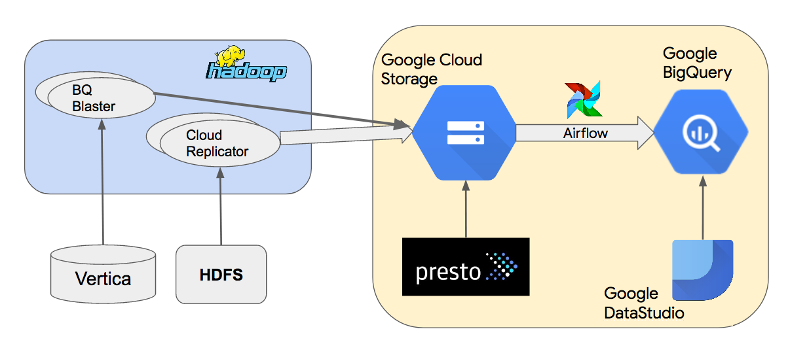

Democratizing data analysis with Google BigQuery

#### Infrastructure

# Democratizing data analysis with Google BigQuery

By [Prasad Wagle](https://blog.twitter.com/engineering/en_us/authors.prasadwagle.html)

 Monday, 8 July 2019

       [![](data:image/svg+xml,%3csvg xmlns='http://www.w3.org/2000/svg' width='56' height='72' viewBox='0 0 56 72' data-evernote-id='112' class='js-evernote-checked'%3e%3cpath d='M29.518 12.25l-8.705 8.704a13.624 13.624 0 0 0-2.881 4.26 13.617 13.617 0 0 0-1.128 5.377c0 5.48 3.076 8.778 4.01 9.77 2.346 2.494 7.014 3.983 7.416 3.674.637-.49 2.665-3.002.174-5.764-.452-.502-3.605-.852-5.154-4.667-.836-2.059-.753-4.129.076-6.055a7.8 7.8 0 0 1 1.647-2.434l8.705-8.704c3.057-3.057 8.032-3.057 11.089 0 3.057 3.057 3.057 8.032 0 11.089l-4.175 4.174a17.549 17.549 0 0 1 2.37 5.947l5.963-5.962c5.35-5.351 5.35-14.057 0-19.408C43.574 6.9 34.869 6.9 29.518 12.25z' data-evernote-id='113' class='js-evernote-checked'%3e%3c/path%3e%3cpath d='M26.357 59.768l9.01-9.01a13.624 13.624 0 0 0 2.881-4.26 13.617 13.617 0 0 0 1.128-5.377c0-5.48-3.076-8.778-4.01-9.77-2.346-2.494-7.014-3.983-7.416-3.674-.637.49-2.665 3.002-.174 5.764.452.502 3.605.852 5.154 4.667.836 2.059.753 4.129-.076 6.055a7.8 7.8 0 0 1-1.647 2.434l-9.01 9.01c-3.057 3.057-8.032 3.057-11.089 0-3.057-3.057-3.057-8.032 0-11.089l4.479-4.479a17.549 17.549 0 0 1-2.37-5.947L6.95 40.36c-5.35 5.351-5.35 14.057 0 19.408 5.351 5.35 14.057 5.35 19.407 0z' data-evernote-id='114' class='js-evernote-checked'%3e%3c/path%3e%3c/svg%3e) Link copied successfully](https://blog.twitter.com/engineering/en_us/topics/infrastructure/2019/democratizing-data-analysis-with-google-bigquery.html#)

Every day, over a hundred million people come to Twitter to find out what’s happening in the world and talk about it. Every Tweet and user action generates an event that we make available for internal data analysis at Twitter. Hundreds of employees analyze and visualize this data, and improving their experience is a top priority for the Twitter Data Platform team.

We believe that users with a wide range of technical skills should be able to discover data and have access to SQL-based analysis and visualization tools that perform well. This would allow a whole new group of less technically inclined users, including data analysts and product managers, to get insights from data enabling them to understand and improve how Twitter features are used. This is how we are democratizing data analysis at Twitter.

As our internal data analysis tools and capabilities have improved, we have seen a corresponding improvement in the Twitter service. However, there is still room for improvement. Current tools such as Scalding require a programming background to use. SQL-based analysis tools such as Presto and Vertica have performance issues at scale. We also have the problem of data being spread across multiple systems without a consistent way of accessing it.

Last year, we announced a [new collaboration with Google](https://blog.twitter.com/engineering/en_us/topics/infrastructure/2018/a-new-collaboration-with-google-cloud.html) and are migrating parts of our [data infrastructure](https://blog.twitter.com/engineering/en_us/topics/infrastructure/2019/the-start-of-a-journey-into-the-cloud.html) to the Google Cloud Platform (GCP). We identified the following Google Cloud [Big Data](https://cloud.google.com/products/big-data/) tools as having the potential to help our efforts to democratize data analysis, visualization, and machine learning inside Twitter:

- •[BigQuery](https://cloud.google.com/bigquery/): An enterprise data warehouse with a SQL engine based on [Dremel](https://ai.google/research/pubs/pub36632) that is fast, easy, and capable of [Machine Learning](https://cloud.google.com/bigquery-ml/docs/bigqueryml-intro).

- •[Data Studio](https://datastudio.google.com/overview): A tool for big data visualization with collaboration features like those in Google Docs.

This blog post talks about our experience with these tools: what we did, what we learned, and what we’ll do next. Here, we focus on batch and interactive analytics. We'll discuss real-time analytics in a future blog post.

## History of Data Warehousing at Twitter

Before diving into BigQuery, it’s worth taking a brief look at the history of data warehousing at Twitter.  In 2011, Twitter data analysis was done in Vertica and Hadoop. To create Hadoop MapReduce jobs, we used Pig. In 2012, we replaced Pig with Scalding, which had a Scala API with advantages such as the ability to express complex pipelines and ease of testing. However, there was a steep learning curve for many data analysts and product managers who were more comfortable with SQL. Around 2016, we started using Presto as a SQL interface to Hadoop data. Spark offered a Python interface that made it a good choice for ad hoc data science and machine learning.

As of 2018, we were using the following tools for data analytics and visualization:

- •Scalding for production pipelines

- •Scalding and Spark for ad hoc data science and machine learning

- •Vertica and Presto for ad hoc, interactive SQL analysis

- •Druid for low-latency, interactive, and exploratory access to time-series metrics

- •Tableau, Zeppelin, and Pivot for data visualization

We found that while these tools offered very powerful capabilities, we struggled making those abilities accessible to a wider audience at Twitter. As we broaden our platform with Google Cloud, we are focusing on simplifying our analytical tools for all of Twitter.

## Google BigQuery Data Warehouse

Several teams at Twitter had already incorporated BigQuery into some of their production pipelines. Leveraging their experience, we began to evaluate BigQuery's capabilities against all Twitter’s use cases. Our goal was to offer BigQuery to the entire company and to standardize and support it within the Data Platform toolkit. This was challenging for many reasons. We needed to develop infrastructure to reliably ingest large amounts of data, support company-wide data management, implement proper access controls, and ensure customer privacy. We also had to build systems for resource allocation, monitoring, and chargeback to enable teams to efficiently use BigQuery.

In November 2018, we rolled out a company-wide Alpha release of BigQuery and Data Studio. We offered some of our most frequently used tables, with personal data removed, to Twitter employees. Over 250 users from a variety of teams including Engineering, Finance, and Marketing used BigQuery. Most recently, they ran around 8K queries processing close to 100 PB in a month, not including scheduled queries. With highly positive feedback, we decided to move forward and offer BigQuery as a main resource for interacting with data at Twitter.

Here’s a high-level architecture diagram of our Google BigQuery data warehouse.

 

We copy data from on-premises Hadoop clusters to Google Cloud Storage (GCS) using an internal tool called Cloud Replicator. Then we use Apache Airflow to create pipelines that use “[bq_load](https://cloud.google.com/bigquery/docs/reference/bq-cli-reference#bq_load)” to load data from GCS to BigQuery. We use Presto to query Parquet or Thrift-LZO datasets in GCS. BQ Blaster is an internal Scalding tool to load Vertica and Thrift-LZO HDFS datasets to BigQuery.

The sections below discuss our approach and learnings in the areas of ease-of-use, performance, data governance, system operability, and cost.

### Ease of use

We discovered that it was easy for users to start with BigQuery, as it didn’t require software installation and users could access it through an intuitive, web-based UI. Nevertheless, users did need to become familiar with a few GCP features and its concepts, including resources such as projects, datasets, and tables. We developed educational material and steps to help users get started. With this basic understanding established, users found it easy to navigate through datasets, preview the schema and data of tables, run simple queries, and visualize results in Data Studio.

Our goal for data ingestion to BigQuery was to enable one-click, seamless loads of HDFS or GCS datasets. We looked into [Cloud Composer](https://cloud.google.com/composer/) (managed Airflow) but could not use it because of our security model of Domain Restricted Sharing (more on that in the Data Governance section below). We experimented with using Google’s Data Transfer Service (DTS) for orchestrating the BigQuery load jobs. Whereas DTS was fast to set up, it was not flexible for building pipelines with dependencies. For our Alpha release, we set up our own Apache Airflow environment in GCE, and are making it production ready and able to support more data sources such as Vertica.

For data transformation in BigQuery, users created simple SQL data pipelines using scheduled queries. For complex, multistage pipelines with dependencies, we are planning to use either our custom Airflow infrastructure or Cloud Composer along with [Cloud Dataflow](https://cloud.google.com/dataflow/).

### Performance

BigQuery is built for general purpose SQL queries that process large amounts of data. It is not designed for low latency, high throughput queries required of a transactional database or for low latency time series analytics implemented by [Apache Druid](https://druid.apache.org/). For interactive analytics queries, our users expect response times within a minute. We had to design our usage of BigQuery to meet those expectations. To provide predictable performance to our users, we used a BigQuery feature available to flat-rate pricing customers that lets project owners reserve minimum slots for their queries. A BigQuery [slot](https://cloud.google.com/bigquery/docs/slots) is a unit of computational capacity required to execute SQL queries.

We analyzed 800+ queries processing around 1 TB of data each and found that the median execution time was 30 seconds. We also learned that performance strongly depends on our slot usage across varying projects and jobs. We had to clearly delineate our production and ad hoc slot reservations to maintain performance for production use cases and interactive analyses. This greatly informed our design for slot reservation and project hierarchy.

### Data Governance

Strong Data Governance is a core principle of Twitter Engineering. As we incorporate BigQuery into our platform, we are focusing on data discoverability, access control, security, and privacy.

For data discovery and management, we expanded our Data Access Layer ([DAL](https://blog.twitter.com/engineering/en_us/topics/insights/2016/discovery-and-consumption-of-analytics-data-at-twitter.html)) to provide tooling for both on-premises and Google Cloud data, providing a single interface and API for our users. As Google's [Data Catalog](https://cloud.google.com/data-catalog/) moves into general availability, we will incorporate it into our projects to provide users with features such as column search.

BigQuery allows for easy data sharing and access as a core feature, but we needed to control this to a degree to prevent data exfiltration. Amongst other tools, we chose two features:

- •[Domain restricted sharing](https://cloud.google.com/resource-manager/docs/organization-policy/restricting-domains): A beta feature preventing users from sharing BigQuery datasets with users outside Twitter.

- •[VPC service controls](https://cloud.google.com/vpc-service-controls/): A control which prevents data exfiltration and requires users to access BigQuery from known IP ranges.

We addressed Authentication, Authorization, and Auditing (AAA) requirements for security as follows:

- •Authentication: We used GCP User accounts for ad hoc queries and Service accounts for production queries.

- •Authorization: We required that each dataset has an owner service account and a reader group.

- •Auditing: We exported BigQuery stackdriver logs that stored detailed query execution information to a BigQuery dataset for easy analysis.

To ensure appropriate handling of Twitter users’ private data, we are required to register all BigQuery datasets, annotate private data, have appropriate retention, and remove (scrub) data that is deleted by users.

We evaluated Google’s [Cloud Data Loss Prevention API](https://cloud.google.com/dlp/), which uses machine learning to classify and redact sensitive data, but decided in favor of manual dataset annotation for precision. We plan to use the Data Loss Prevention API to complement user annotation.

At Twitter, we have created four privacy categories for datasets in BigQuery, listed here in order of decreasing sensitivity:

- •High sensitivity datasets available on an as-needed basis based on principle of least privilege. Each dataset has a separate reader group and we will monitor usage of individual accounts.

- •Medium sensitivity (1-way pseudonymized using hashing with salt) datasets have no Personally Identifiable Information (PII) and are available to a larger group of employees. This is a good balance between privacy and data utility concerns. It allows employees to perform analysis tasks, such as computing the number of users that have used a feature, without knowing who the actual users are.

- •Low sensitivity datasets with all user identifiable information removed. This is a good approach from a privacy standpoint but cannot be used for user-level analysis.

- •Public datasets (released outside Twitter) available to all Twitter employees.

For registration, we used scheduled jobs to enumerate BigQuery datasets and register them with Data Access Layer ([DAL](https://blog.twitter.com/engineering/en_us/topics/insights/2016/discovery-and-consumption-of-analytics-data-at-twitter.html)), Twitter’s metadata store. Users will annotate datasets with privacy information and also specify retention. For scrubbing, we are evaluating the performance and cost of two options: 1. Scrub datasets in GCS using tools such as Scalding and load them in BigQuery; 2. Use BigQuery DML statements. We will likely use a combination of both methods to meet the requirements of various teams and data.

### System Operability

Since BigQuery is a managed service, it was not necessary to have a Twitter SRE team for managing systems or oncall responsibilities. It was easy to provision more capacity, both storage and computation slots. We could change slot reservations by creating Google support issues. We identified areas of improvement such as self-service administration for slot allocation and better dashboards for monitoring and communicated those feature requests to Google.

### Cost

Our preliminary analysis showed that querying costs for BigQuery and Presto were in the same ballpark. We purchased slots at [flat-rate](https://cloud.google.com/bigquery/pricing#flat_rate_pricing) pricing to have a stable monthly cost rather than paying the [on-demand](https://cloud.google.com/bigquery/pricing#on_demand_pricing) price per TB of data processed. This decision was also based on feedback from users, who didn’t want to think about execution costs before running every query.

Storing data in BigQuery incurred costs in addition to GCS costs. Tools such as Scalding require datasets to exist in GCS, and for BigQuery access, we had to load the same datasets into the BigQuery [Capacitor](https://cloud.google.com/blog/products/gcp/inside-capacitor-bigquerys-next-generation-columnar-storage-format) format. We are working on a Scalding connector to BigQuery datasets that will obviate the need for storing datasets in both GCS and BigQuery.

For rare use cases that required infrequent querying over tens of petabytes, we decided that storing datasets in BigQuery was not cost effective and used Presto to directly access datasets in GCS. We are evaluating BigQuery External Data Sources for this purpose.

## Next Steps

We have received a lot of interest in BigQuery since our Alpha release. We are adding more datasets to BigQuery and onboarding more teams. We are developing connectors for data analysis tools such as Scalding to read from and write to BigQuery storage. We are evaluating tools such as Looker and Apache Zeppelin to create enterprise quality reports and notebooks using BigQuery datasets.

Collaboration with Google has been very productive, and we are excited to continue and grow this partnership. We have worked with Google to implement our own [Partner Issue Tracker](https://developers.google.com/issue-tracker/guides/partner-access) to communicate feature requests directly to Google. Some of them such as the BigQuery Parquet loader have been implemented by Google.

Here are some of our high priority feature requests for Google:

- •Tools for easy data ingestion and support for LZO-Thrift format

- •Hourly Partitions

- •Improvements around access controls such as table, row, and column level permissions

- •BigQuery [External Data Sources](https://cloud.google.com/bigquery/external-data-sources) with Hive Metastore integration and support for the LZO-Thrift format

- •Better integration of Data Catalog in the BigQuery UI

- •Self-service administration for slot allocation and monitoring

## Conclusion

Democratizing data analysis, visualization, and machine learning in a secure way is a top priority for the Data Platform team. We identified Google BigQuery and Data Studio as tools that could help with this objective and rolled out a company-wide BigQuery Alpha release last year.

We found that querying in BigQuery was easy and performant. For data ingestion and transformation, we used Google tools for simple pipelines, but for complex pipelines, we had to build our own Airflow infrastructure. In the area of data governance, BigQuery services for authentication, authorization, and auditing satisfied our needs. For metadata management and privacy compliance, we needed more flexibility and had to build our own systems. BigQuery, being a managed service, was easy to operate. Querying costs were similar to existing tools; storing data in BigQuery incurred costs in addition to GCS costs.

Overall, BigQuery has worked well for general purpose SQL analysis. We have received a lot of interest in BigQuery, and we are working on migrating more datasets, onboarding more teams, and building more pipelines with BigQuery. Twitter has varied uses of our data that will need a combination of tools including Scalding, Spark, Presto, and Druid. We intend to continue building out our data analysis tooling and provide clear guidance to our users on how to best use our offerings.

## Acknowledgments

I would like to thank my co-authors and teammates, Anju Jha and Will Pascucci, for their amazing collaboration and hard work in this project. I would also like to thank engineers and managers from multiple teams at Twitter and Google who helped us and the users of BigQuery at Twitter who provided valuable feedback.

If you are interested in working on these challenges, please take a look at our open [positions](https://careers.twitter.com/content/careers-twitter/en/jobs-search.html?q=&team=careers-twitter%3Ateam%2Finfrastructure-engineering) in the Data Platform team.