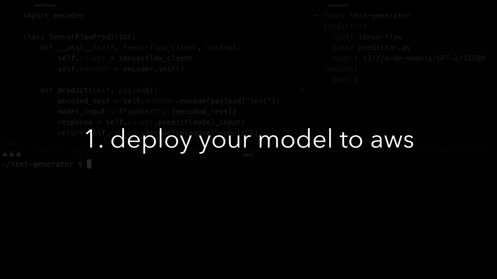

Deploy machine learning models in production - Cortex

Cortex is an open source platform for deploying machine learning models as production web services.

Demo

#

Key features

- **Multi framework:** Cortex supports TensorFlow, PyTorch, scikit-learn, XGBoost, and more.
- **Autoscaling:** Cortex automatically scales APIs to handle production workloads.
- **CPU / GPU support:** Cortex can run inference on CPU or GPU infrastructure.
- **Spot instances:** Cortex supports EC2 spot instances.
- **Rolling updates:** Cortex updates deployed APIs without any downtime.
- **Log streaming:** Cortex streams logs from deployed models to your CLI.
- **Prediction monitoring:** Cortex monitors network metrics and tracks predictions.
- **Minimal configuration:** Cortex deployments are defined in a single `cortex.yaml ` file.

#

Spinning up a cluster

Cortex is designed to be self-hosted on any AWS account. You can spin up a cluster with a single command:

Copy

1# install the CLI on your machine

2$ bash -c "$(curl -sS https://raw.githubusercontent.com/cortexlabs/cortex/0.13/get-cli.sh)"

3​
4# provision infrastructure on AWS and spin up a cluster
5$ cortex cluster up
6​
7aws region: us-west-2
8aws instance type: p2.xlarge
9spot instances: yes
10min instances: 0
11max instances: 10
12​
13￮ spinning up your cluster ...
14your cluster is ready!

#

Deploying a model

##

Implement your predictor

Copy

15# predictor.py
16​
17class  PythonPredictor:
18  def  __init__(self, config):
19 self.model = download_model()
20​
21  def  predict(self, payload):
22  return model.predict(payload["text"])

##

Configure your deployment

Copy

23# cortex.yaml
24​
25-  name: sentiment-classifier
26  predictor:
27  type: python
28  path: predictor.py
29  tracker:
30  model_type: classification
31  compute:
32  gpu:  1
33  mem: 4G

##

Deploy to AWS

Copy

34$ cortex deploy
35​
36creating sentiment-classifier

##

Serve real-time predictions

Copy

37$ curl http://***.amazonaws.com/sentiment-classifier \
38 -X POST -H "Content-Type: application/json" \
39 -d '{"text": "the movie was amazing!"}'
40​
41positive

##

Monitor your deployment

Copy

42$ cortex get sentiment-classifier --watch
43​
44status up-to-date requested last update avg inference 2XX
45live 1 1 8s 24ms 12
46​
47class count
48positive 8
49negative 4

#

What is Cortex similar to?

Cortex is an open source alternative to serving models with SageMaker or building your own model deployment platform on top of AWS services like Elastic Kubernetes Service (EKS), Elastic Container Service (ECS), Lambda, Fargate, and Elastic Compute Cloud (EC2) and open source projects like Docker, Kubernetes, and TensorFlow Serving.

#

How does Cortex work?

The CLI sends configuration and code to the cluster every time you run `cortex deploy `. Each model is loaded into a Docker container, along with any Python packages and request handling code. The model is exposed as a web service using Elastic Load Balancing (ELB), TensorFlow Serving, and ONNX Runtime. The containers are orchestrated on Elastic Kubernetes Service (EKS) while logs and metrics are streamed to CloudWatch.

#

Examples of Cortex deployments

- ​[Sentiment analysis](https://github.com/cortexlabs/cortex/tree/0.13/examples/tensorflow/sentiment-analyzer): deploy a BERT model for sentiment analysis.
- ​[Image classification](https://github.com/cortexlabs/cortex/tree/0.13/examples/tensorflow/image-classifier): deploy an Inception model to classify images.
- ​[Search completion](https://github.com/cortexlabs/cortex/tree/0.13/examples/pytorch/search-completer): deploy Facebook's RoBERTa model to complete search terms.
- ​[Text generation](https://github.com/cortexlabs/cortex/tree/0.13/examples/pytorch/text-generator): deploy Hugging Face's DistilGPT2 model to generate text.
- ​[Iris classification](https://github.com/cortexlabs/cortex/tree/0.13/examples/sklearn/iris-classifier): deploy a scikit-learn model to classify iris flowers.