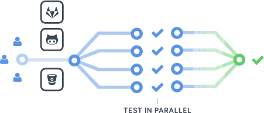
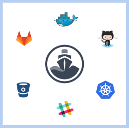
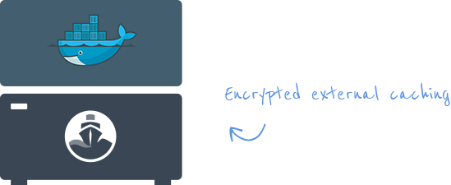
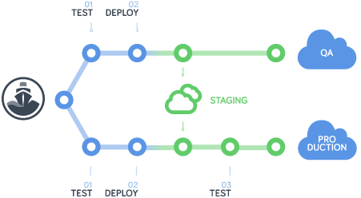

Deploying Apps with Kubernetes and Codeship

# Deploying Apps with Kubernetes and Codeship Pro

Codeship Pro is a fully customizable Continuous Integration service with native Docker support.

[    Sign up with GitHub   ](https://resources.codeship.com/cs/c/?cta_guid=6739fd24-b291-40b9-adee-ac4e25b26f82&placement_guid=d265fded-7d39-421b-9ff6-c5f0ef34cf5f&portal_id=1169977&redirect_url=APefjpHEG32Tkw07UDP5TdiCu6jeQhvukXfAiYPjv_ZseMR2QkoBq4c--Jj5_EQmDdeQThcdDrR-p36nVEEsZG83MpAitnxKpf3l2TL4b7nWPc4wEt4crCTIIlD7hlUiPE-BNs8CyK5qnEi3cbZaJsVWW1XbpzhjSu-Iq4IzB2KU21gT1U0Al0GBuo9egZAOMDTHEWX2RUKsWIc9wKX0pFCLf-XgPAamZGNqwQGD1Kr2EtaRHBbZYztz6y39_LTCtrA4AQTdQs5i29io4etIXHFVLTxjXHS3J5zU1KsyqURKEJc5Blsf304&hsutk=0e7444767f83d56536308dc41c4360ec&canon=https%3A%2F%2Fpages.codeship.com%2Fkubernetes-aw&pageId=4653734451&__hstc=209244109.0e7444767f83d56536308dc41c4360ec.1492771037955.1494882191106.1495117439603.7&__hssc=209244109.1.1495117439603&__hsfp=2287170199)[    Sign up with GitLab   ](https://resources.codeship.com/cs/c/?cta_guid=0d2c88f3-2a55-4fa1-becd-17deefb67f1b&placement_guid=eaa8a50b-6a65-4473-811e-5e9a160d69f9&portal_id=1169977&redirect_url=APefjpHv3LgGfom8V_BH2Q93jt54DAAgc1iSww01EeIIf32860E9Bc9RjE3InHB4DhEr8JNaX7pKCcvfan66B0QH4cKVdUHkx4Te_15Bj6iBoUMLt7wEW5luTNT4u5wufL92xFcO-XQ7YSezwnq1xpBGys6N4Um_zdeYdr6n_tLyYJl4OoB7xop6LrEvd6l2qHcpX4r-x8zStuUkzSkU5K8PNZV_-_yVnYhysnm6tK4nHS57c6gIx6ef5kA2dKrBuED910djnUPU14xA-kZyq-Yw4nWW0z2sFyPEhFvfoR8MnU2CY39ctK4&hsutk=0e7444767f83d56536308dc41c4360ec&canon=https%3A%2F%2Fpages.codeship.com%2Fkubernetes-aw&pageId=4653734451&__hstc=209244109.0e7444767f83d56536308dc41c4360ec.1492771037955.1494882191106.1495117439603.7&__hssc=209244109.1.1495117439603&__hsfp=2287170199)[Sign up with Bitbucket](https://resources.codeship.com/cs/c/?cta_guid=b0e02c0b-6e21-4407-a745-53544072f975&placement_guid=67938c4d-9ce2-4c1a-8ae8-a497bdf164e5&portal_id=1169977&redirect_url=APefjpGWpvYGRkvLmBjGsnAAMCwcJcOBcpR0hchGp0SIL8SC0Yp2xHloPu-2zGmAmChPDLbztX4jLtE79LjzEsxpFBPF-Z3S07qaiVAy4UABuJ71hsAzuNuvnwzmD3uqlgA-r3VX1nEWXyZLYw5DPnSsWLgZe8RtfFunBje-x8bQWn6TomDqvQFRo18sR9fvpWEp8Pbnxj-_nvLiQ4MsB4Y0wJva7bD7062LMvJ_KQWRnq6mLeWYLZYUCLeRc6SzQeeF4AwvlnIcHJFjrlWhpo75mEBOCT8oGDf18qzUv6LiS2lo5mM9J1w&hsutk=0e7444767f83d56536308dc41c4360ec&canon=https%3A%2F%2Fpages.codeship.com%2Fkubernetes-aw&pageId=4653734451&__hstc=209244109.0e7444767f83d56536308dc41c4360ec.1492771037955.1494882191106.1495117439603.7&__hssc=209244109.1.1495117439603&__hsfp=2287170199)

[or sign up via email](https://resources.codeship.com/cs/c/?cta_guid=0ecffe9c-709e-4fc8-a1c0-562d96158c64&placement_guid=92927fe6-3595-4b71-a9e5-07a561a266ab&portal_id=1169977&redirect_url=APefjpH7uLpXVWP5L2WwWiKsgZI_eGtNbWYA9uXUHHaTZoMsBRzwak0d3Wde1poyRFOLN6dh1acEV6dBh2UQXQHCwxFf7SFgA713Iyv85_FXSL825PwGcrfZeauNOPvAv_94p9TD_D8AqIbhYd56ZUEAfGGd3K4jmpG2h_PiOJqT-0gsXEzpnP21C-XEZ_xQYG4y479eGfHf6sRfnaKxLMPWBza72nsW3JhFe9YluM2W84jvFAYlLFXwZB4zaiJuQXX-Q5sFwtkj&hsutk=0e7444767f83d56536308dc41c4360ec&canon=https%3A%2F%2Fpages.codeship.com%2Fkubernetes-aw&pageId=4653734451&__hstc=209244109.0e7444767f83d56536308dc41c4360ec.1492771037955.1494882191106.1495117439603.7&__hssc=209244109.1.1495117439603&__hsfp=2287170199)

#### Codeship Pro gives you full control of your Continuous Integration and Delivery setup and makes it easy to test and deploy your microservices.

 

#### Easy to get started

We've got an easy to modify deployment [example](https://github.com/codeship/codeship-kubernetes-demo) and helpful [Kubernetes setup guide (pdf)](https://resources.codeship.com/hubfs/Continuous_Deployment_Docker_Apps_Kuberneteson_GKE_using_Codeship.pdf?t=1495032862316) specifically designed to help make it fast and easy to get going on Codeship Pro with Kubernetes.

 

#### Docker-native CI/CD

Your images are ready to deploy with Kubernetes by default! Codeship Pro uses containers as first class citizens in the build process, meaning your images and containers are easy to set up on Kubernetes with little additional work.

 

#### Built for container-based architecture

Everything from setup to deployment to support on Codeship Pro is intended for teams working looking to implement Docker best-practices and container-based applications, making Codeship Pro and Kubernetes a great fit.

 

#### Codeship is the best CI/CD solution for Kubernetes

By letting you use your images and containers natively for your CI/CD process but letting us keep everything up to date and running smoothly, your team can spend more time designing intelligent workflows and working on your application and less time just trying to make it all work.

[Codeship Kubernetes Setup Guide (PDF)](https://resources.codeship.com/cs/c/?cta_guid=f36a88c5-10fe-4e0a-876f-5ae7b9772543&placement_guid=181c86f9-18b0-42bb-8d33-d08f5e67c2c3&portal_id=1169977&redirect_url=APefjpG24eJsd1mkARgEk0ZyXWAIYYXlhCb8FTtE6S1c-cFvyzzpQgZu2PWvImI_CHSlNPh-peLEV80xMwLQvioDDzZrlOn0ImdNQ4FW7APyBIcG3smmC36yN_Ax8puEG7eGPHA1299rP_dFT6z3p2YwM9hSyEV_4DFSzlZWys0XucD1f2412oLc7ahWcXQGk1uQRrkZN_57zj63PRjGMd6gvxqLRPg8ifkICw8j3UwIyEznPuaT3D2VP2yqam9PbhYBOZcCTd0x3AoY54zyrw-B6jwgWjoM1mC3YayvSfrHvlxglIkJiMZyM6DC4N11J34H1O5uxZBe&hsutk=0e7444767f83d56536308dc41c4360ec&canon=https%3A%2F%2Fpages.codeship.com%2Fkubernetes-aw&pageId=4653734451&__hstc=209244109.0e7444767f83d56536308dc41c4360ec.1492771037955.1494882191106.1495117439603.7&__hssc=209244109.1.1495117439603&__hsfp=2287170199)

#### Full developer autonomy

Codeship Pro gives you complete control over customizing and optimizing you CI and CD workflow. Choose which steps should run sequentially or in parallel, how many concurrent builds you want to run simultaneously among your account and get full control over which dependency version you want to run for each step or when to delete your dependencies and the cache.

 

#### It’s easy to migrate to Codeship Pro

As we use Docker as a domain language you can use large parts of your docker-compose file to set up Codeship Pro. Since we treat containers as first-class citizens we guarantee that anything that you can run inside of a container you can run on Codeship Pro. Should you not be familiar with docker-compose the syntax is incredibly easy to pick up.

 

#### Efficient caching

Don’t waste time compiling code that doesn’t change. Codeship Pro provides encrypted external caching of your Docker images. We only build the small portions that actually changed in your code. You have full control to delete the cache whenever you want to.

 

[CODESHIP PRO PRICING](https://resources.codeship.com/cs/c/?cta_guid=f11f7729-a383-46f2-b4fb-7aa1f5b08d4e&placement_guid=2b8b0b79-0e4d-4daf-9d2e-f6dc5fca443a&portal_id=1169977&redirect_url=APefjpH5YsAT5Gnk2_SJjEY2-Cz3l8nWiMb3T70NtW_INuHdvuJ_QZZveoH6yUEopyTyV_oqBmbocPeTUGGB7q-oHswfwuRLxli1wMTiiFiW4y6MYcE9HMmax8rBHyY0xLvbESzCmsyYHtwSqhY79zzatHn7WxHFc_a16q-zECEK4rUEhY4VBg6CwUz6hAZAMGBwcE1VV7-9AFr5yH_C4wfbPhuwQoiG5-WLP_K2JwOKh5kELIhpayY&hsutk=0e7444767f83d56536308dc41c4360ec&canon=https%3A%2F%2Fpages.codeship.com%2Fkubernetes-aw&pageId=4653734451&__hstc=209244109.0e7444767f83d56536308dc41c4360ec.1492771037955.1494882191106.1495117439603.7&__hssc=209244109.1.1495117439603&__hsfp=2287170199)

#### Performance and security thanks to dedicated single tenant AWS instances

Choose the size, CPU, and memory of the AWS instances we provide for you. As only your code runs on one instance and you’re not sharing instances with other people we can guarantee high security and can make sure you won’t suffer from CPU heavy builds run by other teams.

 

#### Deploy anywhere

Codeship Pro is agnostic to your deployment target and lets you push and pull your images from any registry. As we use Docker as a domain language the question will never be if you can run something on Codeship Pro, but if you can run it inside of a Docker container. If it works with Docker, it works on Codeship Pro.

 

#### Get insight into your project and its health

Set up teams and permissions for your organizations and their team members. Seamless 3rd party integrations, smart notification management and project dashboards provide a high level overview over your projects and their health.

 

[CODESHIP PRO PRICING](https://resources.codeship.com/cs/c/?cta_guid=f11f7729-a383-46f2-b4fb-7aa1f5b08d4e&placement_guid=2b8b0b79-0e4d-4daf-9d2e-f6dc5fca443a&portal_id=1169977&redirect_url=APefjpH5YsAT5Gnk2_SJjEY2-Cz3l8nWiMb3T70NtW_INuHdvuJ_QZZveoH6yUEopyTyV_oqBmbocPeTUGGB7q-oHswfwuRLxli1wMTiiFiW4y6MYcE9HMmax8rBHyY0xLvbESzCmsyYHtwSqhY79zzatHn7WxHFc_a16q-zECEK4rUEhY4VBg6CwUz6hAZAMGBwcE1VV7-9AFr5yH_C4wfbPhuwQoiG5-WLP_K2JwOKh5kELIhpayY&hsutk=0e7444767f83d56536308dc41c4360ec&canon=https%3A%2F%2Fpages.codeship.com%2Fkubernetes-aw&pageId=4653734451&__hstc=209244109.0e7444767f83d56536308dc41c4360ec.1492771037955.1494882191106.1495117439603.7&__hssc=209244109.1.1495117439603&__hsfp=2287170199)

#### Common Questions

#### Is my code secure when I run it on Codeship Pro?

Each build runs on its own AWS instance. You can choose the size, CPU, and memory of your instance during your project setup. As we spawn an exclusive instance for you on every push, we can guarantee full security without compromise.

#### What is a concurrent build and how many builds can I run?

The number of concurrent builds states how many builds can be run at the same time. After you sign up you will always get 100 builds per month, 1 concurrent build, and 5 private projects for free.

#### Can I run my tests in parallel to speed up my test suite?

Yes, the number of tests you can run in parallel depends on the AWS instance size you choose. You have full control over the instance performance and will always get the same performance allocated for each build you run.

#### How do I set up my projects on Codeship Pro?

Your complete CI and CD workflows are set up with 2 simple files: [codeship-services.yml](http://documentation.codeship.com/docker/getting-started/services/) and [codeship-steps.yml](http://documentation.codeship.com/docker/getting-started/steps/). We also provide our Jet CLI binary which lets your debug builds locally.

#### Is Codeship Pro available for on-premise or iOS apps?

Currently we do not offer Codeship Pro as an on-premise solution. We also do not offer support for testing and deploying iOS apps. Please reach out to us so we can let you know once we’re launching on-premise and iOS support for Codeship.

#### How do you handle upgrading or canceling a subscription?

Upgrading your subscription in between a subscription period is prorated. You are able to cancel your subscription any time.

#### Why is Codeship Pro more expensive than Codeship Basic?

Codeship Pro spawns single-tenant AWS instances for you whenever you push a build. You are not sharing your instance’s CPU, Memory, etc. with anyone else.

#### Are there discounted plans available?

Annual plans give you 2 months for free. We also happily offer 50% discount for educational projects. **Open source projects will always be free.**

#### Learn more in our Codeship Pro Documentation

Codeship Pro offers full development autonomy. Here are some good starting points that can help you learn more.

#### Getting started

Codeship Pro is easy to get started with and grows with your team.

- [Getting started with CI](https://documentation.codeship.com/general/about/getting_started_with_ci/)
- [Starting with Codeship Pro](https://documentation.codeship.com/pro/getting-started/getting-started/)
- [Debug builds locally with "jet"](https://documentation.codeship.com/pro/getting-started/installation/)
- [Defining services](https://documentation.codeship.com/pro/getting-started/services/)
- [Configuring build steps](https://documentation.codeship.com/pro/getting-started/steps/)

#### Configure your build

Model your build environment according to your needs.

- [Using the Docker cache](https://documentation.codeship.com/pro/getting-started/caching/)
- [Secure environment variables](https://documentation.codeship.com/pro/getting-started/encryption/)
- [Linked services](https://documentation.codeship.com/pro/getting-started/services-and-databases/)
- [Sharing data via volumes](https://documentation.codeship.com/pro/getting-started/docker-volumes/)

#### Deployments

Push your images to any registry or deploy traditionally.

- [Push to a remote registry](https://documentation.codeship.com/pro/getting-started/docker-push/)
- [Deploying to AWS](https://documentation.codeship.com/pro/continuous-deployment/aws/)
- [Deploying to Google Cloud](https://documentation.codeship.com/pro/continuous-deployment/google-cloud/)
- [Deploying to Heroku](https://documentation.codeship.com/pro/continuous-deployment/heroku/)

[Codeship Pro Documentation](https://resources.codeship.com/cs/c/?cta_guid=091e2d8a-6181-4731-b92c-b1b0b833791f&placement_guid=6e9035ac-0b65-4a32-b875-dc81da519fde&portal_id=1169977&redirect_url=APefjpEjrqJtb8zFE4tZD5KOM45TxgDoaSAmQxZUOh8R0_tJAmUF96dWMoGoDeX19Ln2MK3galzeiZr6hjXxBeWkk4ftMg9FRFG9tbZ0J-xHBltxNVcD6779Hjp7ky3DYHGkmpN5AetVwMIlWR6wtLDdpFtHgVCTBZ9YcNq1sB8zQuGpPj09v6lNZK6qgUYlMcNgodpU-MlcPOEbG8a4waxotjwzhrx5LdSFzrLzFikadATeLLWMYeU&hsutk=0e7444767f83d56536308dc41c4360ec&canon=https%3A%2F%2Fpages.codeship.com%2Fkubernetes-aw&pageId=4653734451&__hstc=209244109.0e7444767f83d56536308dc41c4360ec.1492771037955.1494882191106.1495117439603.7&__hssc=209244109.1.1495117439603&__hsfp=2287170199)

 

> "From a vision perspective, Codeship's CI platform has hit the nail on the head."

 CHESLEY BROWN  InVisionApp

Engineers at Company100+

IndustryDesign

UsingCodeship Pro

Average Build Time9min 58secs

 

 

 

 

 

 