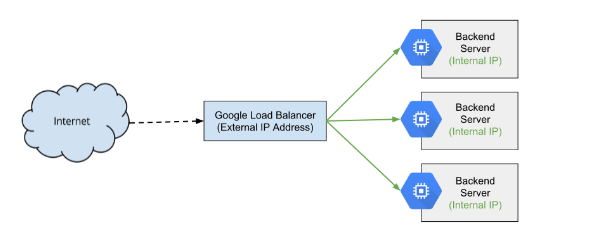
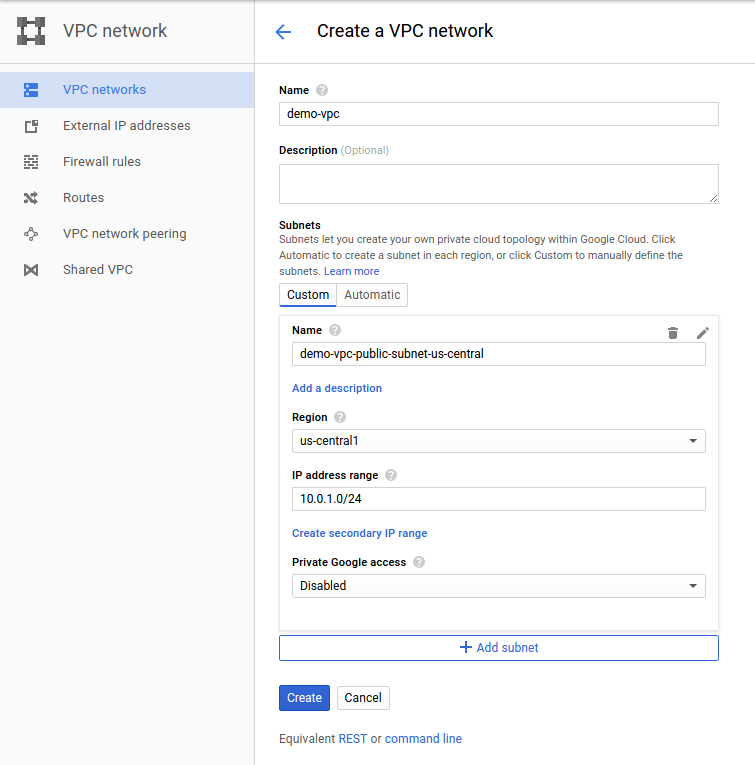
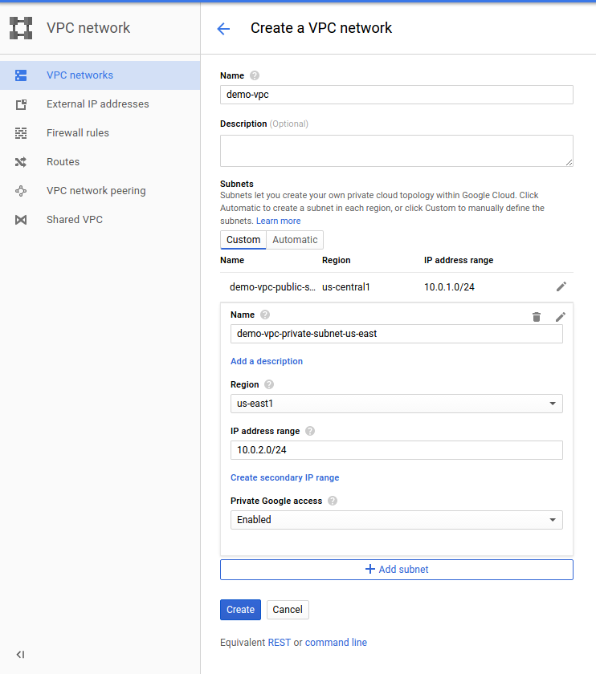

Deploying the Application — Google Cloud Platform (Public/Private Subnets)

# Deploying the Application — Google Cloud Platform (Public/Private Subnets)

This is a beginners tutorial for Google Cloud to understand networking by deploying simple application.

Here in this blog we will create a separate VPC in Google cloud with Public/Private subnets with all firewall rules and routes in place.

1. 1Deploy application on instances running in private subnet ,
2. 2LoadBalancer running in public subnet (Internet-facing)

3. 3NAT Instance running in Public subnet so that instances running in private subnet can access internet through NAT instance.

Google network daigram
Getting started with Google CLoud:
1. 1Create 2 subnets in different regions .
**Note : VPC Name: demo-vpc**
Follow below steps to create public subnet.

Public Subnet
Follow below steps to create private subnets.

Private Subnet
2. Create 1st firewall rule to allow SSH access .

gcloud compute firewall-rules create demo-vpc-allow-ssh --allow tcp:22 --network demo-vpc

Note : we will be using [Google cloud CLI](https://cloud.google.com/sdk/downloads) to create remaining resources.

3. Create 2nd firewall rule to allow access (tcp,udp,icmp ports)internally within VPC

gcloud compute firewall-rules create demo-vpc-allow-internal-network --allow tcp:1-65535,udp:1-65535,icmp --source-ranges 10.0.0.0/16 --network demo-vpc

4. Launch NAT instance in Public subnet with tag as “nat-instance”.

gcloud compute instances create nat-gateway --network gce-network --can-ip-forward \

--zone us-central1-a \
--image-family debian-8 \
--image-project debian-cloud \
--tags nat-instance
5. Launch 2 instances in private subnet with tag as “Private-instances”

gcloud compute instances create example-instance --network demo-vpc-manual-vpc --no-address \

--zone us-east1-b \
--image-family debian-8 \
--subnet demo-vpc-manual-vpc-subnet-a \
--image-project debian-cloud \
--tags private-instance
**Note : These tags will be used in route table to route traffic.**

6. Create a route to allow all instances running in private subnet to access internet.

Basically this route will allow all instances with tag **“private-instance”** running in private subnet to access internet through NAT instance

gcloud compute routes create demo-vpc-no-ip-internet-route --network demo-vpc-manual-vpc \

--destination-range 0.0.0.0/0 \
--next-hop-instance nat-gateway \
--next-hop-instance-zone us-east1-b \
--tags private-instance --priority 800

7. Next, log onto your gateway instance and configure iptables to NAT internal traffic to the Internet.

On your NAT instance, configure iptables:
Below command tells the kernel that you want to allow IP forwarding

**sudo sysctl -w net.ipv4.ip_forward=1**

Below command masquerades packets received from internal instances as if they were sent from the NAT gateway instance

**sudo iptables -t nat -A POSTROUTING -o eth0 -j MASQUERADE**
8. SSH to your private instances and install apache2 package.
sudo apt-get update -y
sudo apt-get install apache2 -y

9. Configure a internet facing load balancer and add 2 instances running in private subnet as backend in LB.

Refer below steps to Launch LoadBalancer:

Go to Console -> Network Services -> Load Balancing -> Create LoadBalancer -> Choose (TCP Load Balancing) -> Select (From Internet to my VMs) , (Single region only),No (TCP)

1. **Backend configuration** -> Select Region (Region in which your VMs are launched)-> Select existing VMs - Add nstances

2.** Front-end configuration** -> Port (80) Provide port on which you want to access your application over internet.

Access the apache server installed on private instances over the internet through LoadBalancer.

Summary , created a custom VPC in Google Cloud with Public/Private subnets ,Firewall rules to allow SSH and open tcp,udp and ICMP ports.

Launch 2 instances in private subnet and NAT instance in Public Subnet.

Configured NAT instance to allow all instances running in private subnet to access internet. Installed apache package on VMs and created internet facing LoadBalancer .

Hope this helps you in understanding the network flow in Google Cloud.

