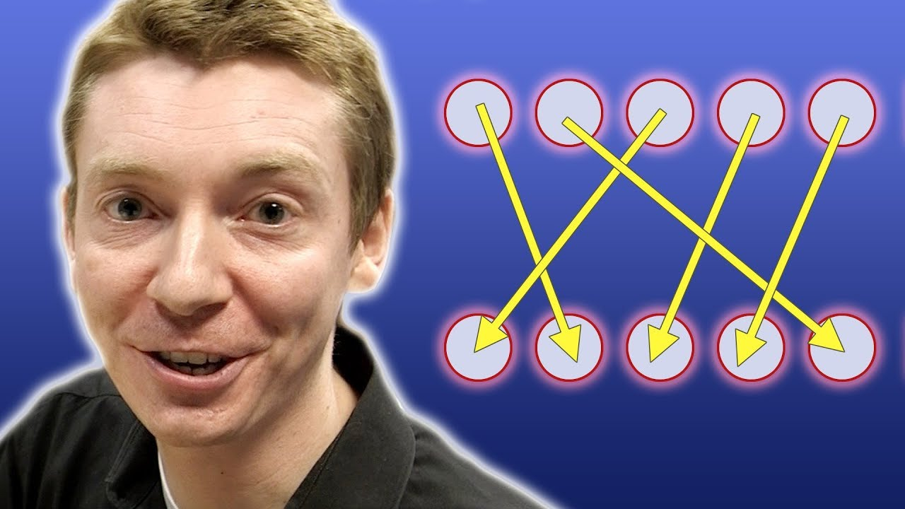

Derangements - Numberphile

Derangements - Numberphile
https://www.youtube.com/watch?v=pbXg5EI5t4c
[Numberphile](https://www.youtube.com/channel/UCoxcjq-8xIDTYp3uz647V5A)
225,414 views viewsNew
Published on Jul 31, 2017

|     |
| --- |
| [(L)](https://www.youtube.com/watch?v=pbXg5EI5t4c) |

Description

Derangements featuring Dr James Grime.
More links & stuff in full description below ↓↓↓

Extra footage from this interview: https://youtu.be/qYAWjIVY7Zw

More Dr Grime on Numberphile: http://bit.ly/grimevideos
e video: https://youtu.be/AuA2EAgAegE

Special thanks to these Patrons on Patreon:
Jeremy Buchanan
Jeff Straathof
Susan Silver
Yana Chernobilsky
Christian Cooper
James Bissonette
Ken Baron
Bill Shillito
Tony Fadell
Erik Alexander Nordlund
Bernd Sing
Dr Jubal John
Thomas Buckingham
Tony Cox
Ole Kristian Merli
Tianyu Ge
Joshua Davis
Steve Crutchfield

Patreon: http://www.patreon.com/numberphile

Numberphile is supported by the Mathematical Sciences Research Institute (MSRI): http://bit.ly/MSRINumberphile

We are also supported by Science Sandbox, a Simons Foundation initiative dedicated to engaging everyone with the process of science.

NUMBERPHILE
Website: http://www.numberphile.com/
Numberphile on Facebook: http://www.facebook.com/numberphile
Numberphile tweets: https://twitter.com/numberphile
Subscribe: http://bit.ly/Numberphile_Sub

Videos by Brady Haran

Brady's videos subreddit: http://www.reddit.com/r/BradyHaran/

Brady's latest videos across all channels: http://www.bradyharanblog.com/

Sign up for (occasional) emails: http://eepurl.com/YdjL9

"Thanks (f)or the mug"