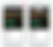

Design a Perfect Search Box – UX Planet

# Design a Perfect Search Box

## by [Nick Babich](http://babich.biz/)

Search box is a combination of input field and submit button. One may think that the search box doesn’t need a design; after all, it’s just two simple elements. However, on content-heavy websites, the search box is often the most frequently used design element. When users encounter a relatively complex sites, they will immediately look for a search box to get to their final destination quickly and painlessly. The design of the search box and its usability becomes a big deal.

In this article we’ll see how this element can be improved in order to save the user time in going where they want.

### Best practices

#### 1. Use magnifying-glass icon

Always accompany search box with magnifying-glass icon. Icons are, by definition, a visual representation of an object, action, or idea.There are a few icons that have mostly [universal recognition from users.](https://uxplanet.org/icons-as-part-of-an-awesome-user-experience-e468e16b206b#.kbes26jnx) Magnifying-glass icon is the one of such icons.

Users [recognize](https://www.nngroup.com/articles/magnifying-glass-icon/) magnifying-glass icon even without a textual label.

**Tip:** Use a schematic icon, the simplest version of the magnifying glass. Fewer graphic details speed up recognition.

#### 2. Display search field prominently

If search is important function for your app/site you should be displayed *prominently*, as it can be the fastest route to discovery for users.

Left: The search functionality is hidden behind an icon. Image credit: [thinkwithgoogle](https://www.thinkwithgoogle.com/)

It’s important to display full open-text field, because search hidden behind in icon makes search feature less noticeable and *increases the cost of interaction:*

Don’t use a progressive discosure for search because it *hides context*. Image credits: [AntonioJDN](http://www.materialup.com/AntonioJDN)

#### 3. Provide a search button for the search box

A button helps people recognize that there’s an additional step to trigger the search action — even if they decide to do this by pressing Enter.

**Tips:**

- •Size the submit button appropriately, so that users don’t have to point the mouse very precisely. A larger clickable area makes it easier to spot and to click.
- •Let users submit search using the *Enter* and by clicking the icon. Many users still have the habit of clicking an actual button to submit search.

#### 4. Put the search box on every page

You should always provide access to the search box on every page because if your users cannot find the content that they are looking for, they will try to use your search regardless of where they are in your website.

#### 5. Make search box simple

If you design a search box, make sure it looks like one and is as simple to use as possible. According to usability studies, it is more user-friendly to have no advanced search options displayed by default. Advanced search options (such Boolean search query in example below) can confuse users who will try to use it.

Boolean search

#### **6. Put** the search box where **users expect to find** it

It’s not good when users have to search for search box because it doesn’t stand out and is not easy to spot.

The chart you see below was taken from a study by A. Dawn Shaikh and Keisi Lenz: it shows the expected position of the site search form in a survey with 142 participants. The study found that the most convenient spot for users would be the *top left* or *top right* of every page on your site, where users could easily find it using the common F-shaped scanning pattern.

The figure illustrates the areas where participants expected the search to be found. The upper-right corner is still the first place users expect to find search.

Thus, place a search box in the upper-right or upper-center area of your layout and you’ll be sure that your users will find it where they expect it to be.

Content-heavy YouTube has its search in the upper-center.
**Tips:**

- •Ideally, the search box should fit the website’s overall design perfectly yet manage to stand out slightly when users need it.
- •The more content you have, the more prominently you want to display your search feature. If search is essential for your site, use plenty of contrast so that the field and icon stands out from the background and from the surrounding elements.

#### 7. Proper Field Size

Making the input field too short is a common mistake among designers. Of course users can type long queries, but only a portion of the text will be visible at a time and this means *bad usability,* since users cannot review and edit easily their query. In fact, when search box has a limited number of visible characters users are forced to use short, imprecise queries, because longer queries would be hard and inconvenient to read. If input fields are sized according to their expected input they are both easier to read and to interpret for users.

A rule of thumb is to have a 27-characters text input (it would accomodate 90% of queries).

Amazon uses a properly sized search box.

**Tip:** Consider using a growing search box, which expands the text input field on click. This saves screen space while still giving the user enough visual cues to quickly find and execute search.

#### 8. Use auto-suggestion mechanism

Auto-suggestions mechanism helps users to find a proper query by *trying to predict it* based on the entered characters. Auto-suggestion mechanism isn’t about speeding up the search process but rather about *guiding* the user and helping them in constructing their search query. Typical users are very poor at query formulation: if they don’t get good results on the first try, later search attempts rarely succeed. In fact, they often give up. When autocomplete suggestions work well they help the user articulate better search queries.

Google searches mastered this pattern, having implemented it since 2008. Because users tend to search the same things more than once, by remembering search history, Google saves time and creates a far more convenient experience.

**Tips:**

- •Ensure that auto-suggestions are *useful*. Poorly designed auto-suggestions can confuse and distract users. So use a spelling auto-corrections, recognition of root words, and predictive text in order to improve the tool.
- •You should provide auto-suggestions as quickly as possible, such as after third character is entered, to provide immediate value and reduce users data entry effort.
- •Present less than 10 items (and without a scroll bar) so the information doesn’t become overwhelming.
- •Allow for keyboard navigation for the list of suggestions. Once a user scrolls down past the last item, they should return to the top of the list. The Esc key should allow users to exit the list.
- •Highlight differences between the inputted information and

suggested information (e.g., input text has a standard weight, while suggested terms have bold weight).

The autocomplete pattern saves the user time and may even suggest content or proper wording.

#### **9. Make it clear what users can search for**

It is a good idea to include a sample search query in the input field to suggest to users what the function can be used for. If the user can search for multiple criteria, use the input hint pattern to explain (i.e., IMDb in example below). HTML5 makes it easy to include text that as *a placeholder* inside the input field.

**Tip: **Limit your hint to just a few words, otherwise you actually increase the cognitive load.

#### Conclusion

Search is a fundamental activity and a critical element of building a content-heavy app or site. Even minor changes such as a proper size for the input field or indicating what information goes in search field can significantly increase search usability together with overall UX.

Thank you!

[Update] Read**  **[**Best Practices for Search Results**](https://uxplanet.org/best-practices-for-search-results-1bbed9d7a311#.gxag5ytlg)

*Follow UX Planet: *[*Twitter*](https://twitter.com/101babich)* | *[*Facebook*](https://www.facebook.com/uxplanet/)