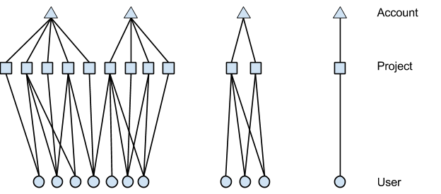
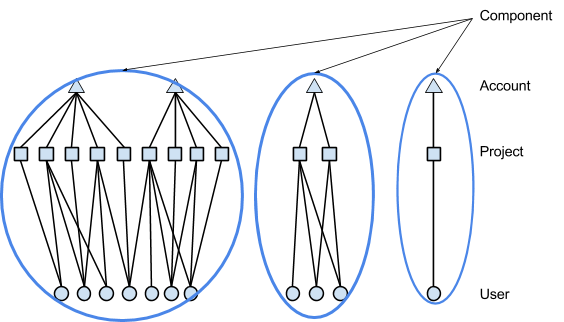
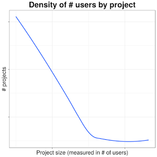
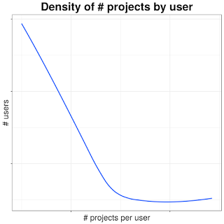
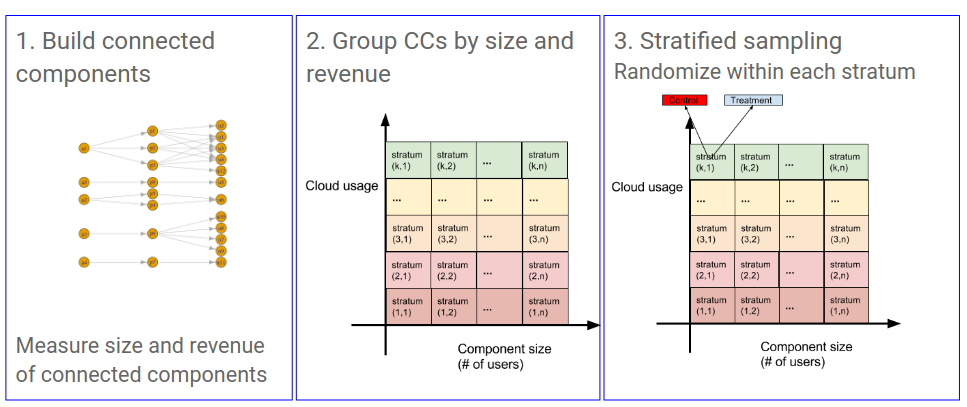
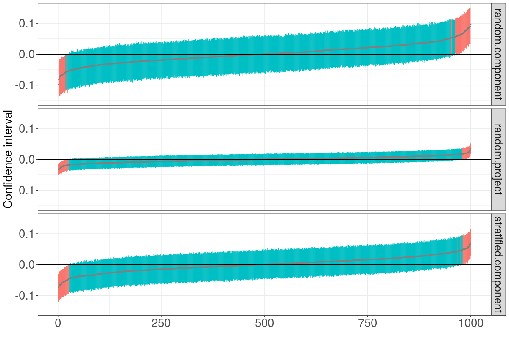
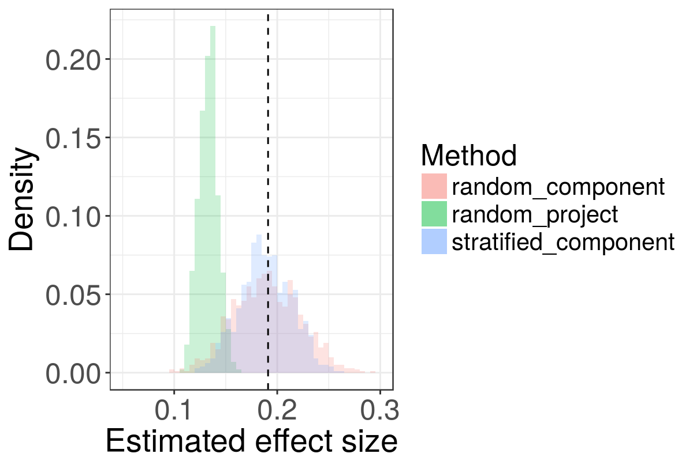
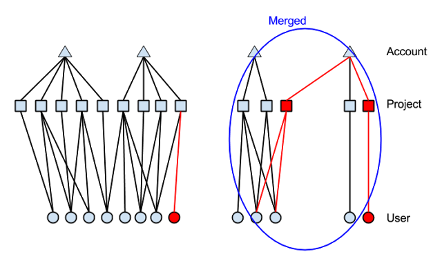

Designing A/B tests in a collaboration network

# Designing A/B tests in a collaboration network

BY SANGHO YOON

*In this article, we discuss an approach to the design of experiments in a network. In particular, we describe a method to prevent potential contamination (or inconsistent treatment exposure) of samples due to network effects. We present data from Google Cloud Platform (GCP) as an example of how we use A/B testing when users are connected. Our methodology can be extended to other areas where the network is observed and when avoiding contamination is of primary concern in experiment design. We first describe the unique challenges in designing experiments on developers working on GCP. We then use simulation to show how proper selection of the randomization unit can avoid estimation bias. This simulation is based on the actual user network of GCP.*

## Experimentation on networks

A/B testing is a standard method of measuring the effect of changes by randomizing samples into different treatment groups. Randomization is essential to A/B testing because it removes selection bias as well as the potential for confounding factors in assessing treatment effects.

At Google, A/B testing plays a key role in better understanding our users and products. With A/B testing, we can validate various hypotheses and measure the impact of our product changes, allowing us to make better decisions. Of course, A/B testing is not something new in our field, as it has been adopted by many tech companies. But due to the large scale and complexity of data, each company tends to develop its own A/B test solution to solve its unique challenges. One particular area involves experiments in marketplaces or social networks where users (or randomized samples) are connected and treatment assignment of one user may influence another user's behavior.

Typical A/B experiments assume that the response or behavior of an individual sample depends only on its own assignment to a treatment group. This is known as the Stable Unit Treatment Value Assumption (SUTVA). However, this assumption no longer holds when samples interact with each other, such as in a network. An example of this is when the effects of exposed users can spill over to their peers. This is the case for experiments on the Google Cloud Platform.

[Google Cloud Platform](https://cloud.google.com/) (GCP) offers a suite of products that enable developers to work on their projects in the cloud. GCP also provides great flexibility to developers in sharing their resources and projects, with tools to protect and control their security and privacy. We find that users in GCP naturally form collaboration networks to work on shared projects and this in turn improves efficiency in managing their resources. Our goal is to leverage this network structure in designing and analyzing experiments to improve the GCP product.

One salient requirement we impose on experiment design is that the experience of all users who collaborate with each other be consistent. This is critical to our highly collaborative product. For example, imagine a situation where two users collaborate on a shared project. One user sees a new feature to enable a firewall, but the other user doesn’t see the same option available. This could create confusion. Such an undesired effect is not only bad for user experience, it also hinders us measuring the **true **average treatment effect of the new firewall feature. Thus, the requirement is to provide a consistent user experience for the following two types of treatment exposure:

- **Direct exposure**: Every user must have a consistent experience across all GCP projects that he or she owns, manages, or collaborates in.
- **Indirect exposure**: Any two users who collaborate on a project must have the same experience.

The graph of user collaboration can be separated into distinct connected components (hereafter referred to as "components"). In order to satisfy these consistency requirements, we choose to use the component as our randomization unit in experiment design.

While the collaboration networks in Google Cloud Platform bear similarities to components of social networks (e.g. Facebook, Twitter, LinkedIn, Google+), there are significant differences. Two fundamental differences are described below:

- **A few large connected networks versus many connected components**: Users in social networks are linked to each other through their common friends. Methodologies for experimenting on users in social networks focus on ways to partition the overall graph into subgraphs, and then to run randomized experiments on these subgraphs. Severing edges is necessary because the largest connected components of the graph are typically very large. In GCP, however, we observe many small connected components because our customers want to manage their own privacy and security in their projects, and do not want to share access with third parties.
- **Spillover effects versus contamination**: Experiments in social networks must care about "spillover" or influence effects from peers. These spillover effects are a fundamental aspect of user behavior in a social network. Thus, the effect comes from both direct exposure of each treated individual, and indirect exposure from his or her peers. Such spillover effects also exist in the GCP user collaboration network but they are of secondary importance. In our case, avoiding confusion is more important than estimating indirect treatment effects. For example, imagine the confusion resulting from two users who work on a shared project but see two different versions. We need to avoid these effects rather than estimate them.

## Structure of the user collaboration network

As mentioned earlier, users in GCP collaborate with other developers via shared projects. Projects are linked to a Google Cloud billing account for proper resource management and billing. Since a project can be linked to at most one billing account, the project-to-billing account relationship is nested. However, a user can work on multiple projects.The user-to-project relationship is not necessarily nested. Rather, users can have membership in multiple projects. Therefore the relationship among billing account, project and user is complex. Figure 1 illustrates these three entities.

|     |
| --- |
|  |
| Figure 1. Connected components: an advanced account with multiple billing accounts managing separate sets of projects (left), a developing account with multiple projects (middle), and a new account (right) |

Since users can be connected via shared projects, we also need to track another entity, the component of the graph to which any user belongs. A user can be associated with exactly one component. Figure 2 shows that the user collaboration graph has three distinct components.

|     |
| --- |
|  |
| Figure 2. Hierarchy: component → account → project → user |

##

Designing experiments on the collaboration network

The hierarchical structure of the collaboration network makes it clear that we must use component as the unit of randomization in our experiments. This is necessary to provide guarantees on treatment consistency. However, the downside of using a larger unit of randomization is that we lose experimental power. This comes from two factors: fewer experimental units, and greater inherent difference across experimental units.

Figure 3 shows distribution of project size, as measured in # users per project, and the distribution of # of project per user (axes have been removed for confidentiality). These contribute to the structure and size of components. We see here indications of large differences in size and structure of components. These differences tend to increase the variance of our estimates and hence lose us statistical power.

|     |
| --- |
|  |
| Figure 3: # of users (per project) and # of projects (per user) |

One way to mitigate this loss of power is to cluster samples into more homogeneous strata and sample proportionately from each stratum. We define strata based on two features: number of users and "usage", a measure of the aggregate user activity in the network. These two properties were selected because they correlate strongly with experiment metrics of greatest interest.

By drawing a fixed fraction of units from each stratum, we achieve better balance across treatment groups, and hence reduce variance in our estimates. In addition, stratified sampling helps us obtain representative samples when the sampling rate is low.

The overall procedure of our methodology for stratified random sampling is described as follows:

1. **Build user graphs**: Find all the components in the current collaboration network.

2. **Stratify graphs by size and usage**: Measure the size of each component by number of users and revenue and stratify graphs in number of users and revenue.

3. **Select samples and random assignment**: Randomly sample a fraction of components in each stratum from Step 2 depending on the size of a study. Then randomly assign them to a treatment arm. For example, if we wish to run an experiment with a 5% arm for treatment and 5% for control, we first select a random 10% of components from each stratum, and subsequently assign them 50-50 to treatment and control groups. Each user, project and account inherits the experiment group from the component to which they belong.

4. **Run experiment**: Steps 2 and 3 are repeated daily after the graph has been updated, and new components properly also randomized.

The description above assumes that while new components may emerge over the course of the experiment, the topology of existing components will remain unchanged during this time. As discussed later, this is not entirely the case.  Figure 4 is a visual representation of these steps.

|     |
| --- |
|  |
| Figure 4. components and random sampling with stratification |

##

Modeling network effects

In order to quantify the tradeoffs involved in experiment design, we need a model of network effects to be used in subsequent simulation studies. We now describe a generative model for how effects might propagate through the network. The network topology itself is the actual collaboration network we observe for GCP.

Consider the case where experiment metrics are evaluated at the per-user level. Assume we have KK users. Let ZkZk denote the assignment of the kthkth user to an arm of the experiment. Here Zk=0Zk=0 means the user is assigned to control and Zk=1Zk=1 for treatment. Under Stable Unit Treatment Value Assumption (SUTVA), one can estimate treatment effect as follows:

δ=1N0∑kYk[Zk=1]−1N1∑kYk[Zk=0](1)(1)δ=1N0∑kYk[Zk=1]−1N1∑kYk[Zk=0]

where N0N0 and N1N1 are the number of samples assigned to treatment group and control group, respectively. This is equivalent to estimating in the following linear model:

yk∼μ+τzk(2)(2)yk∼μ+τzk
where μμ is an overall intercept term and is the effect of treatment.

When users are connected in a network, their treatment assignments can generate network effects through their interactions. Our model considers two aspects of network effects:

- **Homophily** or similarity within network: users collaborating in network tend to behave similarly. For example, developers working on a specific mobile app show similar behavior in usage. We use hierarchical models for this effect.
- **Spillover** or contamination effects: direct treatment effects can spill over through network connections. We conservatively limit the degree of spillover effects to immediate neighbors.

We model network similarity using the fully nested hierarchical structure: component → account → project. Then we use random effects to model response from this hierarchy as follows:

yi,j,k∼ci+ai,j+i,j,k(3)(3)yi,j,k∼ci+ai,j+pi,j,k

where cici refers to the response from Component ii, ai,jai,j from Account jj in Component ii, and i,j,kpi,j,k from Project kk in Account jj in Component ii. The random effects

ciai,ji,j,k∼N(0,σ2c)∼N(0,σ2a)∼N(0,σ2)ci∼N(0,σc2)ai,j∼N(0,σa2)pi,j,k∼N(0,σp2)
can model potential correlation among accounts and projects within a component.

Spillover effects are modeled as an additional component added to to the linear model in (2):

yk∼μ+τzk+γτaTk⋅Z(4)(4)yk∼μ+τzk+γτakT⋅Z

where ZZ is a vector representing treatment group assignment of every user, and akak is the kthkth column of adjacency matrix AA, i.e., mthmth element of akak is 11 if the kthkth user and mthmth user are connected. Note that we only model first order spillover effects in (4). In other words, we do not consider potential effects from neighbors’ neighbors. Thus, our model is conservative with respect to spillover effects (i.e. it limits their impact). Combining spillover effects and similarity within network, we have

yi,j,k∼μ+τzk+γτaTk⋅Z+(ci+ai,j+i,j,k)(5)(5)yi,j,k∼μ+τzk+γτakT⋅Z+(ci+ai,j+pi,j,k)

## Experimental power and unit of randomization

We can use the model just defined to simulate the effect of randomization unit. We consider two randomization units: project and connected component. To further illustrate the effects of stratification on experimental power, we sample components either uniformly, or by strata. In other words, for the three methods of randomization

- uniform random component
- uniform random project
- stratified random component

we simulate confidence intervals for A/A tests, i.e. when there is no real effect.

Figure 5 shows empirical 95% confidence intervals for each of these sampling methods. Since the true effect is zero in each case, we expect our confidence intervals to include zero 95% of the time. The plot sorts 1000 empirical confidence intervals by their mid point (grey dot). The vertical line segment corresponding to each interval is green if it covers zero, red otherwise. Thus, the patch of red on either side consists of about 25 cases (i.e. 2.5%).

The figure shows that random sampling by component has the widest confidence interval while random sampling by project has the least. Stratified sampling by component is in between. Thus stratification recovers some of the experimental power lost when going from sampling by project to sampling by connected component.

|     |
| --- |
|  |
| Figure 5. A/A test results: Confidence intervals of three methods: random sampling by projects, random sampling by component, and stratified sampling by component. |

## Estimation bias due to unit of randomization

Of course, running null experiments is hardly the purpose of experiment design. The reason we chose component as the unit of experimentation was that it better captures spillover effects when they are not null. Because randomized projects does not take network effects into account, we would expect to incur bias to the extent there are spillover effects.

We generate simulation data using (5) on the actual GCP user network, with the following parameter values for similarity and spillover effects:

- Similarity effect parameters: σc=2σc=2, σa=1σa=1 and σ=0.5σp=0.5
- Direct treatment effect size: τ=18τ=18
- Spillover effect parameter: γ=2−mγ=2−m, where m=1,2,3,4,5,6,7m=1,2,3,4,5,6,7 or 88

We varied mm to better understand the contribution of network effects under different levels of spillover effect.

For each setting of the parameters, we ran three randomized experiments, once for each of the three sampling methods. Each experiment ran with 50% in treatment and 50% in control. We repeated this whole process 1,000 times to estimate a distribution of effect size estimates.

Figure 6 shows the distributions of estimated effect size for the three experiment designs based on 1,000 simulation data sets for fixed values of τ=1/8τ=1/8 and γ=2−4γ=2−4. While the variance of the random project design is least, it incurs significant bias. In contrast, random component and stratified component have higher variance but no observable bias.

|     |
| --- |
|  |
| Figure 6. Effect size estimates for each of the three experiment designs. Dotted line shows the true effect size. Distributions estimated from 1,000 simulations, τ=1/8τ=1/8 and γ=2−4γ=2−4. |

The amount bias in a random project design depends on the level of spillover effect. This is shown for different values of mm in Figure 7. The bias of the random project design is such that its 95% confidence intervals, estimated under independence, exclude the true effect even for small spillover effects (m≤6m≤6).

|     |
| --- |
|  |
| Figure 7. Degree of network effects and effect size estimation. The dotted line with “A” refers to the true average effect. |

## Dynamic evolution of user collaboration network

An actual user collaboration network is not static and evolves over time as users start new projects, finish existing ones, or change their project memberships. As a result, the following four changes can happen to components:

- **Create**: a new component is created.
- **Split**: an existing component breaks into sub-components.
- **Remove**: a component no longer exists.
- **Merge**: existing components become connected.

The first three cases are easy: a newly created component is just randomly assigned to an arm, while no action needs to be taken for splits and removal. Difficulty only arises when connected components merge as shown in Figure 8.

|     |
| --- |
|  |
| Figure 8. Addition and Merge: new entities (projects and users) added are in RED, and components merged are in BLUE. |

At this point, it is no longer possible to guarantee consistent user treatment as defined earlier. We may discuss nuances of graph evolution in a future post, but for the most part, we are fortunate that this is a relatively rare event in our collaboration network today. Another aspect of concern is that treatment can in theory affect not just experiment metrics but also the graph topology itself. Thus graph evolution events also need to be tracked over the course of the experiment.

## Conclusion

Designing randomized experiments on a network of users is more challenging because of network effects. It is often inappropriate to ignore these network effects, either because it results in poor (inconsistent) user experience or because doing so incurs bias in estimating the effect of treatment. Our simulation results based on the actual GCP user network demonstrate the potential for bias if the structure of the network is not considered when designing experiments.