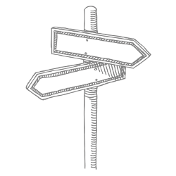

Designing Data-Intensive Applications (DDIA) — an O’Reilly book by Martin Kleppmann (The Wild Boar Book)

# Don’t just hack it together

NoSQL… Big Data… Scalability… CAP Theorem… Eventual Consistency… Sharding…

Nice buzzwords, but how does the stuff actually *work*?

As software engineers, we need to build applications that are reliable, scalable and maintainable in the long run. We need to understand the range of available tools and their trade-offs. For that, we have to dig deeper than buzzwords.

This book will help you navigate the diverse and fast-changing landscape of technologies for storing and processing data. We compare a broad variety of tools and approaches, so that you can see the strengths and weaknesses of each, and decide what’s best for your application.

 [Get the book »](http://dataintensive.net/buy.html)

## How this book is different

### Compare several designs

This book compares the fundamental ideas behind a broad variety of systems. It doesn’t go into the details of how to configure and use one particular tool. But it does explain the trade-offs and fundamental limitations that systems face, so that you can make informed decisions.

### Both theory and practice

We discuss many good ideas from academic research, but we always tie them back to reality. Just because it looks good on a whiteboard doesn’t mean it actually works in practice. We care about ideas that have been proven under intensive workloads, at big companies and at startups.

### Deeper understanding

We go under the hood of the systems you already use, teasing apart how they work internally. The aim is to help you think about data systems in new ways — not just how they work, but why they were designed that way. Your own software will be better as a result.

## What people are saying

 

>

> This book is awesome. It bridges the huge gap between distributed systems theory and practical engineering. I wish it had existed a decade ago, so I could have read it then and saved myself all the mistakes along the way.

>

> [> Jay Kreps](https://twitter.com/jaykreps)> , creator of > [> Apache Kafka](http://kafka.apache.org/)>  and > [> Project Voldemort](http://www.project-voldemort.com/)

>

 

>

> This book should be required reading for software engineers. The explosion of data and its increased importance to the applications we build has created a new set of complex challenges. Designing Data-Intensive Applications is a rare resource that bridges theory and practice to help developers make smart decisions as they design and implement data infrastructure and systems.

>

> [> Kevin Scott](https://www.linkedin.com/in/jkevinscott)> , Chief Technology Officer at > [> Microsoft](https://www.microsoft.com/)

>

 

>

> The essence of building reliable and scalable distributed data systems and efficiently using them to solve real world problems is in mastering the tradeoffs associated with the design choices. Designing Data Intensive applications explores them like none other and provides a unbiased view of how distributed systems have made these choices over time.

>

> [> Veena Basavaraj](https://www.linkedin.com/in/veenabasavaraj)> , Senior Software Engineer at > [> Uber](https://www.uber.com/)

>

 

>

> A joy to read! This is one of the best technical books I've read. It offers very helpful context, historical and current, to understanding the key issues in the text.

>

> [> David Beyer](https://www.linkedin.com/in/davidabeyer)> , Investor at > [> Amplify Partners](http://www.amplifypartners.com/)

>

### Now available

The final version of *Designing Data-Intensive Applications* (DDIA) was published in March 2017, after 2½ years in Early Release (beta). It is now available in print and ebook formats from your favorite bookstore.

 [Get the book »](http://dataintensive.net/buy.html)

### Stay in touch

Follow [@intensivedata](https://twitter.com/intensivedata) on Twitter, or join our mailing list to receive very occasional news related to the book:

 Your email address

### About the author

[Martin Kleppmann](http://martin.kleppmann.com/) is a researcher in distributed systems at the [University of Cambridge](http://www.cl.cam.ac.uk/). Previously he was a software engineer and entrepreneur at Internet companies including [LinkedIn](https://www.linkedin.com/) and [Rapportive](http://rapportive.com/), where he worked on large-scale data infrastructure. In the process he learned a few things the hard way, and he hopes this book will save you from repeating the same mistakes.

Martin is a regular conference speaker, blogger, and open source contributor. He believes that profound technical ideas should be accessible to everyone, and that deeper understanding will help us develop better software.

You can find him as [@martinkl](https://twitter.com/martinkl) on Twitter, and his blog is at [martin.kleppmann.com](http://martin.kleppmann.com/).

### Overheard on Twitter