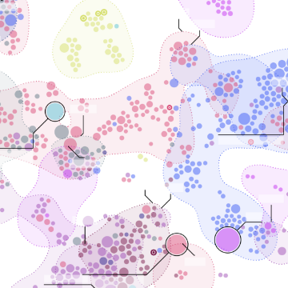

Designing the nteract Data Explorer – nteract

Designing the nteract Data Explorer – nteract

https://blog.nteract.io/designing-the-nteract-data-explorer-f4476d53f897

I spend most of my professional time designing and building data products — analytical applications like data dashboards or data…