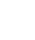

Destroy All Software Sale

#   [Destroy All Software](https://www.destroyallsoftware.com/)

GREETINGS,

I started Destroy All Software in March of 2011. Many people doubted that a programming screencast business would work, but it did! Today there are [110 published screencasts](https://www.destroyallsoftware.com/screencasts/catalog) and counting, now made in a fancy recording booth with so many bass traps that I can hardly move. (I have enclosed a photo.)

I feel very lucky that this worked out: Destroy All Software lets me share my love of programming for its own sake. Today, three big things happen, simultaneously:

First, **everything is free until April 10th at 23:59:59 Pacific time**. No account needed! Some starting points are suggested below.

Second, **we now offer annual and team subscriptions**. Annual subscriptions will normally be $290, a 17% discount vs. monthly.

Third, the **new annual subscriptions are steeply discounted** to $190 for this week. This is a 45% discount over the usual monthly price.

[ CLICK TO USE THE DISCOUNT CODE](https://www.destroyallsoftware.com/screencasts/account/checkout?discount_code=7thbirthday&plan=annual)

A few recommendations if you're new to DAS:

- **[A Compiler From Scratch](https://www.destroyallsoftware.com/screencasts/catalog/a-compiler-from-scratch)** typifies the current focus: demystifying programming tools by building them from scratch. (It's also the longest ever recorded, but it was recorded live like all the rest!)
- **[Functional Core, Imperative Shell](https://www.destroyallsoftware.com/screencasts/catalog/functional-core-imperative-shell)** is about integrating functional programming into a traditional imperative system. (**[Boundaries](https://www.destroyallsoftware.com/talks/boundaries)** is mostly about the same thing, this time as a live talk.)
- To go really far back, **[Tar, Fork, and the Tar Pipe](https://www.destroyallsoftware.com/screencasts/catalog/tar-fork-and-the-tar-pipe)** is one of my favorites about understanding Unix. A customer says that it covered "[what took a few weeks](https://twitter.com/vinibaggio/status/194238904721870848)" in an advanced operating systems class.

You can watch all of these right now without creating an account.

Finally, I'm organizing **[Deconstruct](https://www.deconstructconf.com/), an unusually independent software development conference** in Seattle in May 2018. It's not part of Destroy All Software, but if you like one then you'll probably like the other. You can find more details in my [introductory letter on the Deconstruct site](https://www.deconstructconf.com/).

That's-a-lot-of-stuff-at-once-ly yrs,
Gary Bernhardt
March 31, 2018

Content

 [     Screencasts](https://www.destroyallsoftware.com/screencasts/catalog)  [     Programmer's Compendium](https://www.destroyallsoftware.com/compendium)  [   Conference Talks](https://www.destroyallsoftware.com/talks)

Account

 [Subscription](https://www.destroyallsoftware.com/screencasts/account/subscription)  [Receipts](https://www.destroyallsoftware.com/screencasts/account/receipts)  [Email & Password](https://www.destroyallsoftware.com/screencasts/account/account_settings/edit)  [Sign Out](https://www.destroyallsoftware.com/screencasts/users/sign_out)

Company

 [Blog](https://www.destroyallsoftware.com/blog)  [Contact](https://www.destroyallsoftware.com/screencasts/contact)  [Privacy Policy](https://www.destroyallsoftware.com/screencasts/privacy_policy)  [FAQ](https://www.destroyallsoftware.com/screencasts/faq)